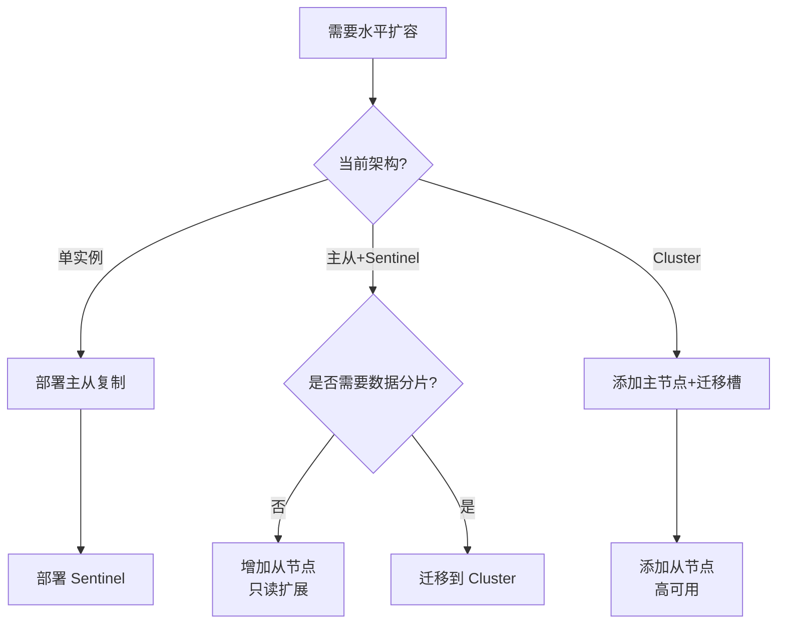
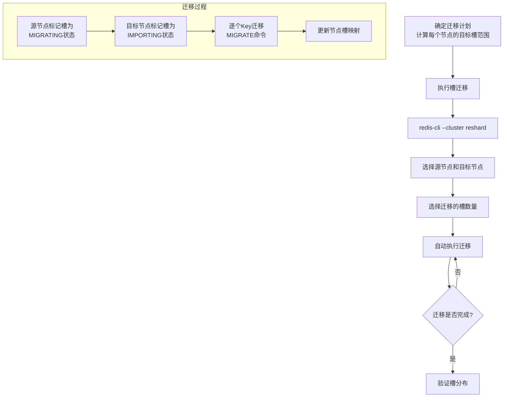
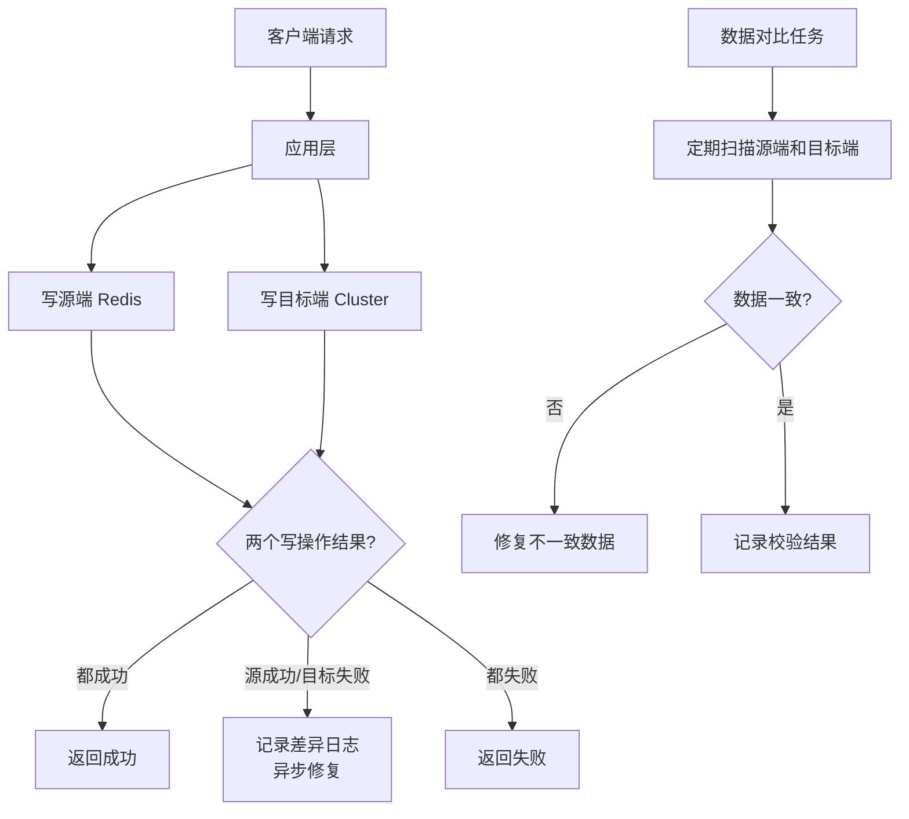

# 数据迁移与扩容

> Redis 扩容和迁移是生产环境中最具挑战性的运维操作之一。内存不足、QPS 瓶颈、业务增长都要求 Redis 具备在线扩容能力，但扩容过程中的数据一致性、服务可用性和回滚预案都需要精心设计。本文将从扩容场景分析出发，深入各种扩容方案、迁移工具和最佳实践。

## 1. 扩容场景分析

### 1.1 何时需要扩容

```text
Redis 扩容触发条件：

┌──────────────────────────────────────────────────────────┐
│  1. 内存不足                                               │
│     • used_memory > maxmemory 的 70%                      │
│     • RDB 持久化 fork 失败（内存不够创建子进程）            │
│     • 频繁触发淘汰策略                                      │
│     • AOF 重写占用大量内存                                  │
│                                                            │
│  2. QPS 不足                                               │
│     • 写入 QPS 接近单主上限（~10万）                       │
│     • 读取 QPS 超过主从能力                                 │
│     • 延迟 P99 持续升高                                    │
│     • 命令排队时间增长                                      │
│                                                            │
│  3. 网络带宽不足                                            │
│     • 出入流量接近网卡上限                                   │
│     • 大 Value 导致带宽成为瓶颈                              │
│     • 大量小命令导致协议开销大                               │
│                                                            │
│  4. 业务需求变化                                            │
│     • 新业务上线需要独立 Redis                               │
│     • 业务拆分需要数据隔离                                  │
│     • 合规要求需要物理隔离                                  │
└──────────────────────────────────────────────────────────┘
```

### 1.2 扩容量化指标

```text
┌──────────────────┬──────────────┬──────────────────────────┐
│  监控指标          │  告警阈值     │  扩容建议                  │
├──────────────────┼──────────────┼──────────────────────────┤
│  内存使用率       │  > 70%       │  垂直扩容或迁移到 Cluster  │
│  内存碎片率       │  < 1.0       │  重启或开启 activedefrag  │
│  写入 QPS         │  > 8万       │  Cluster 水平扩展          │
│  读取 QPS         │  > 30万      │  增加从节点               │
│  延迟 P99         │  > 5ms       │  检查慢查询，考虑扩容      │
│  fork 耗时        │  > 1s        │  减少实例内存或垂直扩容    │
│  网络出入流量     │  > 网卡 80%  │  垂直扩容或数据分片        │
│  连接数           │  > 50000     │  检查连接泄漏             │
│  淘汰 Key 数/秒   │  > 0         │  扩容内存                 │
└──────────────────┴──────────────┴──────────────────────────┘

获取指标命令：
  INFO memory     → 内存使用
  INFO stats      → QPS、淘汰数
  INFO clients    → 连接数
  INFO persistence → fork 耗时
  SLOWLOG GET 10  → 慢查询
```

## 2. 垂直扩容 vs 水平扩容

### 2.1 扩容方式对比

```text
┌──────────────────┬──────────────────┬───────────────────────┐
│  维度              │  垂直扩容          │  水平扩容               │
│                    │  (Scale Up)       │  (Scale Out)           │
├──────────────────┼──────────────────┼───────────────────────┤
│  方式              │  升级机器配置      │  增加节点数量            │
│  上限              │  机器硬件上限      │  理论无上限              │
│  停机时间          │  需要短暂停机      │  在线扩容               │
│  数据迁移          │  不需要           │  需要                   │
│  复杂度            │  低               │  高                     │
│  成本              │  高（高级机器）    │  低（普通机器）          │
│  适用场景          │  临时缓解         │  长期方案               │
│  扩容速度          │  快（分钟级）      │  慢（小时级）            │
│  缩容              │  降配（简单）      │  需要数据迁移            │
└──────────────────┴──────────────────┴───────────────────────┘
```

### 2.2 垂直扩容方案

```text
垂直扩容流程：

方案1：停机升级（简单可靠）
┌───────────────────────────────────────────────────┐
│  1. 通知相关方维护窗口                               │
│  2. 应用层停止写入（或切换到只读模式）                │
│  3. 等待 Redis 写入完成（bgsave / aof fsync）       │
│  4. 关闭 Redis 服务                                 │
│  5. 升级机器配置（CPU/内存/磁盘）                    │
│  6. 启动 Redis 服务                                 │
│  7. 验证数据完整性                                   │
│  8. 恢复应用写入                                     │
│  停机时间：5-15 分钟                                 │
└───────────────────────────────────────────────────┘

方案2：主从切换升级（零停机）
┌───────────────────────────────────────────────────┐
│  1. 部署高配新机器                                   │
│  2. 将新机器配置为当前主节点的从节点                   │
│  3. 等待数据全量同步完成                              │
│  4. 执行故障转移（手动或 Sentinel）                   │
│  5. 新主节点（高配机器）开始服务                      │
│  6. 下线旧主节点                                     │
│  停机时间：~0（切换期间 < 30秒）                     │
└───────────────────────────────────────────────────┘

方案3：在线扩容（云环境）
┌───────────────────────────────────────────────────┐
│  1. 云控制台调整实例规格                              │
│  2. 云平台自动执行迁移                               │
│  3. 迁移期间可能短暂不可用（秒级）                    │
│  4. 迁移完成验证                                     │
│  停机时间：0-30秒（取决于云厂商）                    │
└───────────────────────────────────────────────────┘
```

### 2.3 水平扩容方案



## 3. 主从迁移

### 3.1 主从 → Sentinel 迁移

```text
主从 → Sentinel 迁移步骤：

Step 1: 部署 Sentinel 集群
┌─────────────────────────────────────────────┐
│  当前架构：                                    │
│  Master(10.0.0.1) → Slave(10.0.0.2)         │
│                                                │
│  部署 Sentinel：                               │
│  Sentinel1(10.0.0.10:26379)                   │
│  Sentinel2(10.0.0.11:26379)                   │
│  Sentinel3(10.0.0.12:26379)                   │
│                                                │
│  配置 sentinel.conf：                          │
│  sentinel monitor mymaster 10.0.0.1 6379 2   │
│  sentinel down-after-milliseconds mymaster 30000│
│  sentinel failover-timeout mymaster 180000    │
│  sentinel parallel-syncs mymaster 1           │
└─────────────────────────────────────────────┘

Step 2: 验证 Sentinel 监控
┌─────────────────────────────────────────────┐
│  # 检查 Sentinel 状态                         │
│  redis-cli -p 26379 SENTINEL masters         │
│  redis-cli -p 26379 SENTINEL slaves mymaster │
│  redis-cli -p 26379 SENTINEL sentinels mymaster│
└─────────────────────────────────────────────┘

Step 3: 客户端切换
┌─────────────────────────────────────────────┐
│  将客户端从直连 Master 切换为通过 Sentinel     │
│  获取主节点地址：                              │
│  SENTINEL get-master-addr-by-name mymaster   │
│                                                │
│  灰度切换：1% → 10% → 50% → 100%             │
└─────────────────────────────────────────────┘

Step 4: 验证故障转移
┌─────────────────────────────────────────────┐
│  模拟主节点故障：                              │
│  redis-cli -h 10.0.0.1 DEBUG SLEEP 60       │
│                                                │
│  观察 Sentinel 是否自动切换                    │
│  确认客户端是否自动重连到新主节点              │
└─────────────────────────────────────────────┘
```

### 3.2 Sentinel → Cluster 迁移

```text
Sentinel → Cluster 迁移（最复杂的迁移路径）：

Phase 1: 准备（1-2周）
┌───────────────────────────────────────────────────┐
│  1. 评估多 Key 操作                                │
│     • 搜索代码中所有 MGET/MSET/DEL 多 Key 操作     │
│     • 搜索代码中所有 Lua 脚本                      │
│     • 搜索代码中所有事务                            │
│     • 将关联 Key 改为 Hash Tag：user:{id} → {user:id}│
│                                                      │
│  2. 准备 Cluster 节点                               │
│     • 部署 6+ 节点（3主3从）                        │
│     • 创建 Cluster                                  │
│     • 分配初始槽位                                   │
│                                                      │
│  3. 客户端改造                                      │
│     • 支持 MOVED/ASK 重定向                          │
│     • 替换不支持 Cluster 的操作                      │
│     • 测试环境验证                                   │
└───────────────────────────────────────────────────┘

Phase 2: 数据迁移（1-3天）
┌───────────────────────────────────────────────────┐
│  选择迁移工具：                                      │
│                                                      │
│  方案A：redis-shake（推荐）                           │
│    • 支持全量+增量同步                                │
│    • 支持断点续传                                     │
│    • 数据校验                                        │
│                                                      │
│  方案B：redis-cli --cluster import                  │
│    • Redis 官方工具                                  │
│    • 操作简单                                       │
│    • 不支持增量同步                                   │
│                                                      │
│  方案C：双写方案                                     │
│    • 应用层同时写 Sentinel 和 Cluster                │
│    • 全量迁移历史数据                                 │
│    • 数据校验                                       │
│    • 切读 → 停写                                     │
└───────────────────────────────────────────────────┘

Phase 3: 切换验证（1-3天）
┌───────────────────────────────────────────────────┐
│  1. 灰度切 1% 流量到 Cluster                        │
│  2. 监控延迟、错误率、数据一致性                      │
│  3. 逐步扩大流量（1% → 10% → 50% → 100%）           │
│  4. 全量切换完成后保留 Sentinel 7 天                  │
│  5. 确认无回滚需求后下线 Sentinel                    │
└───────────────────────────────────────────────────┘
```

## 4. Redis Cluster 扩容

### 4.1 添加节点

```text
Redis Cluster 添加主节点：

Step 1: 启动新节点
  # 新节点配置
  port 6380
  cluster-enabled yes
  cluster-config-file nodes-6380.conf
  cluster-node-timeout 15000

Step 2: 加入集群
  redis-cli --cluster add-node \
    10.0.1.4:6380 \         ← 新节点
    10.0.1.1:6379            ← 集群中任一节点

Step 3: 查看节点状态
  redis-cli cluster nodes
  # 新节点已加入，但还没有分配槽位

扩容前：
┌──────────┐ ┌──────────┐ ┌──────────┐
│ Master-1 │ │ Master-2 │ │ Master-3 │
│ 0-5460   │ │5461-10922│ │10923-16383│
└──────────┘ └──────────┘ └──────────┘

扩容后（添加 Master-4，但未迁移槽）：
┌──────────┐ ┌──────────┐ ┌──────────┐ ┌──────────┐
│ Master-1 │ │ Master-2 │ │ Master-3 │ │ Master-4 │
│ 0-5460   │ │5461-10922│ │10923-16383│ │  无槽位   │
└──────────┘ └──────────┘ └──────────┘ └──────────┘
```

### 4.2 迁移槽位



```text
槽迁移详细流程：

1. 执行 reshard 命令
   redis-cli --cluster reshard 10.0.1.1:6379

   交互式输入：
   • 迁移多少槽？ → 4096（总槽/节点数）
   • 目标节点 ID → Master-4 的 Node ID
   • 源节点 ID  → all（从所有节点均匀迁移）
   • 是否继续？ → yes

2. 底层执行步骤：
   ┌──────────────────────────────────────────────────┐
   │  对每个要迁移的槽：                                 │
   │                                                    │
   │  a) 源节点：CLUSTER SETSLOT <slot> MIGRATING <target>│
   │     标记槽为"迁出中"                                │
   │                                                    │
   │  b) 目标节点：CLUSTER SETSLOT <slot> IMPORTING <source>│
   │     标记槽为"迁入中"                                │
   │                                                    │
   │  c) 获取源节点该槽的所有 Key：                       │
   │     CLUSTER GETKEYSINSLOT <slot> <count>            │
   │                                                    │
   │  d) 逐个迁移 Key：                                  │
   │     MIGRATE <target> <port> <key> 0 <timeout>      │
   │     原子操作：在源节点DEL + 在目标节点RESTORE         │
   │                                                    │
   │  e) 迁移完成后：                                    │
   │     CLUSTER SETSLOT <slot> NODE <target-id>         │
   │     通知所有节点更新槽映射                           │
   └──────────────────────────────────────────────────┘

3. 迁移期间的请求路由
   ┌──────────────────────────────────────────────────┐
   │  客户端请求迁移中的槽：                              │
   │                                                    │
   │  Key 在源节点：                                     │
   │    → 源节点正常响应                                  │
   │                                                    │
   │  Key 已迁移到目标节点：                              │
   │    → 源节点返回 ASK 重定向                           │
   │    → 客户端发送 ASKING 后重定向到目标节点             │
   │    → 目标节点执行一次请求                            │
   │                                                    │
   │  迁移完成后：                                       │
   │    → 返回 MOVED 重定向（永久重定向）                 │
   └──────────────────────────────────────────────────┘
```

### 4.3 添加从节点

```text
添加从节点：

Step 1: 启动新从节点
  port 6381
  cluster-enabled yes
  cluster-config-file nodes-6381.conf

Step 2: 加入集群并指定主节点
  redis-cli --cluster add-node \
    10.0.1.5:6381 \           ← 新从节点
    10.0.1.1:6379 \           ← 集群中任一节点
    --cluster-slave \         ← 指定为从节点
    --cluster-master-id <master-node-id>  ← 指定主节点

Step 3: 验证
  redis-cli cluster nodes | grep slave

完整的 3主→4主 扩容后：
┌──────────┐ ┌──────────┐ ┌──────────┐ ┌──────────┐
│ Master-1 │ │ Master-2 │ │ Master-3 │ │ Master-4 │
│ 0-4095   │ │5461-9210 │ │10923-15000│ │4096-5460 │
└──┬───────┘ └──┬───────┘ └──┬───────┘ │9211-10922│
   │            │            │         │15001-16383│
┌──▼───────┐ ┌──▼───────┐ ┌──▼───────┐ └──┬───────┘
│ Replica1 │ │ Replica2 │ │ Replica3 │    │
└──────────┘ └──────────┘ └──────────┘ ┌──▼───────┐
                                        │ Replica4 │
                                        └──────────┘
```

## 5. 缩容流程

### 5.1 缩容步骤

```text
Redis Cluster 缩容步骤：

Step 1: 迁移槽位
  将要下线节点的槽位迁移到其他节点
  redis-cli --cluster reshard 10.0.1.1:6379
  • 源节点：要下线的节点
  • 目标节点：接收槽位的节点

Step 2: 删除从节点
  redis-cli --cluster del-node \
    10.0.1.1:6379 \
    <slave-node-id>

Step 3: 删除主节点
  redis-cli --cluster del-node \
    10.0.1.1:6379 \
    <master-node-id>

Step 4: 验证
  redis-cli cluster nodes
  redis-cli cluster slots

缩容注意事项：
  ┌──────────────────────────────────────────────────┐
  │  ⚠️ 缩容前确认：                                   │
  │  • 目标节点有足够内存容纳迁移数据                     │
  │  • 迁移期间不影响服务                                │
  │  • 保留足够的从节点保证高可用                         │
  │  • 3主节点是最小配置，不能再缩                        │
  └──────────────────────────────────────────────────┘
```

### 5.2 缩容风险评估

```text
┌──────────────────┬──────────┬────────────────────────────┐
│  风险              │  影响程度  │  缓解措施                    │
├──────────────────┼──────────┼────────────────────────────┤
│ 目标节点内存不足   │  高       │  提前评估内存需求             │
│ 迁移期间延迟升高   │  中       │  低峰期执行                  │
│ 迁移失败数据丢失   │  极高     │  先备份，再迁移              │
│ 剩余节点负载过高   │  高       │  监控 QPS 和内存             │
│ 从节点不足         │  中       │  确保每主至少1从             │
│ 客户端缓存过期     │  低       │  MOVED重定向自动处理         │
└──────────────────┴──────────┴────────────────────────────┘
```

## 6. 预分片策略

### 6.1 预分片原理

```text
预分片策略（Pre-sharding）：

核心思想：在项目初期就按最大规模规划分片数，
         后续扩容只需迁移整个分片，无需重新分配槽。

┌──────────────────────────────────────────────────────────┐
│  传统方式：                                               │
│  初期：3 主节点 → 槽 0-16383 均分                         │
│  扩容：4 主节点 → 重新分配所有槽（大量数据迁移）           │
│  再扩：5 主节点 → 再次重新分配所有槽                       │
│                                                            │
│  每次扩容都要迁移大量数据，风险高、耗时长                   │
└──────────────────────────────────────────────────────────┘

┌──────────────────────────────────────────────────────────┐
│  预分片方式：                                              │
│  初期规划32个逻辑分片（最大预期规模）                       │
│                                                            │
│  初期部署：4 物理节点，每节点 8 逻辑分片                    │
│  ┌─────────┐ ┌─────────┐ ┌─────────┐ ┌─────────┐       │
│  │ Node-1  │ │ Node-2  │ │ Node-3  │ │ Node-4  │       │
│  │ S0-S7   │ │ S8-S15  │ │ S16-S23 │ │ S24-S31 │       │
│  └─────────┘ └─────────┘ └─────────┘ └─────────┘       │
│                                                            │
│  扩容到 8 节点：每节点 4 逻辑分片                           │
│  ┌────┐ ┌────┐ ┌────┐ ┌────┐ ┌────┐ ┌────┐ ┌────┐ ┌────┐│
│  │S0-3│ │S4-7│ │S8-11│ │S12│ │S16│ │S20│ │S24│ │S28│ │
│  └────┘ └────┘ └────┘ └────┘ └────┘ └────┘ └────┘ └────┘│
│                                                            │
│  只需迁移整个逻辑分片，不需要重新计算槽映射                 │
└──────────────────────────────────────────────────────────┘
```

### 6.2 预分片实施建议

```text
预分片实施建议：

1. 逻辑分片数量选择
   ┌──────────────────────────────────────────┐
   │  • 32分片：适合中小型业务（最终4-8物理节点）│
   │  • 64分片：适合大型业务（最终8-16物理节点）│
   │  • 128分片：适合超大型业务                  │
   │  • 过多分片增加管理复杂度，不推荐 > 128     │
   └──────────────────────────────────────────┘

2. Key 路由设计
   • 使用 Hash Tag 保证关联 Key 在同一分片
   • Key 设计包含分片标识：user:{shard_id}:{uid}

3. 扩容流程简化
   • 新节点启动 → 迁移整个逻辑分片 → 更新路由
   • 整分片迁移比逐槽迁移更高效

4. 注意事项
   • 预分片数确定后不可更改
   • 初始部署时可以多逻辑分片部署在同一物理节点
   • 后续扩容是物理节点级别的迁移
```

## 7. 数据迁移工具

### 7.1 redis-shake

```text
redis-shake —— 阿里云开源的 Redis 数据迁移工具

功能特性：
┌──────────────────────────────────────────────────────────┐
│  ✅ 全量数据同步                                          │
│  ✅ 增量数据同步（实时同步）                               │
│  ✅ 断点续传                                              │
│  ✅ 数据校验                                              │
│  ✅ 支持多种源和目标                                      │
│  ✅ 支持过滤和转换                                        │
│  ✅ 并行迁移                                              │
└──────────────────────────────────────────────────────────┘

支持场景：
  单机 → 单机
  单机 → Cluster
  Sentinel → Cluster
  Cluster → Cluster
  跨版本迁移
  跨云迁移
```

```toml
# redis-shake 配置文件（shake.toml）

# 源端配置
[source]
type = "standalone"     # standalone / sentinel / cluster
address = "10.0.0.1:6379"
password = "source_password"

# 目标端配置
[target]
type = "cluster"
address = "10.0.1.1:6379"   # Cluster 任一节点
password = "target_password"

# 迁移配置
[advance]
# 并发数
parallel = 32

# 每批大小
batch_size = 256

# 是否全量同步
rdb_parallel = 32

# 增量同步
aof_mode = true

# 过滤规则
[filter]
# 只迁移匹配前缀的 Key
allow_key_prefix = ["user:", "order:", "product:"]
# 排除的 Key
block_key_prefix = ["temp:", "cache:"]

# 数据校验
[check]
enabled = true
sample_rate = 0.1   # 10% 采样校验
```

```text
redis-shake 执行流程：

1. 全量同步阶段
   ┌──────────────────────────────────────────────┐
   │  源端执行 BGSAVE → 生成 RDB 文件              │
   │  redis-shake 解析 RDB → 写入目标端            │
   │  支持并行解析和写入                             │
   │  全量数据量：取决于数据大小                      │
   │  速度：~50万 Key/秒                            │
   └──────────────────────────────────────────────┘

2. 增量同步阶段
   ┌──────────────────────────────────────────────┐
   │  全量同步完成后，自动进入增量同步               │
   │  源端发送 PSYNC 命令 → 接收增量数据            │
   │  实时同步源端的写操作到目标端                    │
   │  延迟：通常 < 1秒                               │
   └──────────────────────────────────────────────┘

3. 数据校验
   ┌──────────────────────────────────────────────┐
   │  采样校验：随机选取 Key 对比源端和目标端        │
   │  校验内容：Key 存在性、Value 一致性、TTL       │
   │  校验比例：可配置采样率                        │
   └──────────────────────────────────────────────┘
```

### 7.2 redis-migrate-tool

```text
redis-migrate-tool —— 唯品会开源的 Redis 迁移工具

特点：
  • 基于 Redis 协议代理
  • 实时迁移（源端作为代理，透传到目标端）
  • 支持多源到单目标
  • 性能较好

与 redis-shake 对比：
┌──────────────────┬──────────────────┬──────────────────────┐
│  特性              │  redis-shake      │  redis-migrate-tool   │
├──────────────────┼──────────────────┼──────────────────────┤
│  开发方           │  阿里云           │  唯品会               │
│  全量迁移         │  ✅               │  ✅                    │
│  增量迁移         │  ✅               │  ✅                    │
│  数据校验         │  ✅               │  ⚠️ 有限               │
│  断点续传         │  ✅               │  ❌                    │
│  代理模式         │  ❌               │  ✅                    │
│  跨版本           │  ✅               │  ⚠️ 部分支持           │
│  维护状态         │  活跃             │  较少更新              │
│  推荐度           │  ⭐⭐⭐             │  ⭐⭐                   │
└──────────────────┴──────────────────┴──────────────────────┘
```

### 7.3 redis-cli --cluster import

```text
redis-cli --cluster import 官方迁移工具：

使用方法：
  redis-cli --cluster import \
    10.0.1.1:6379 \           ← 目标 Cluster 节点
    --cluster-from 10.0.0.1:6379 \  ← 源节点
    --cluster-copy              ← 复制模式（不删除源数据）
    --cluster-replace           ← 覆盖目标已有 Key

特点：
  ✅ Redis 官方工具，稳定可靠
  ✅ 使用 SCAN + DUMP/RESTORE 迁移数据
  ✅ 自动处理 Cluster 路由

限制：
  ❌ 只支持全量迁移，不支持增量
  ❌ 迁移期间新写入的数据可能丢失
  ❌ 大数据量迁移速度较慢
  ❌ 没有数据校验功能

适用场景：
  • 数据量较小（< 1GB）
  • 可接受短暂停机
  • 快速验证 Cluster 兼容性
```

## 8. 迁移期间一致性

### 8.1 一致性挑战

```text
迁移期间的数据一致性问题：

问题1：迁移期间新写入数据丢失
  ┌──────────────────────────────────────────────────┐
  │  全量迁移完成后，增量数据可能未同步                 │
  │  如果直接切换到目标端，源端的新写入会丢失           │
  └──────────────────────────────────────────────────┘

问题2：双写不一致
  ┌──────────────────────────────────────────────────┐
  │  同时写源端和目标端                               │
  │  如果源端写成功、目标端写失败                       │
  │  → 两端数据不一致                                │
  └──────────────────────────────────────────────────┘

问题3：迁移过程中 Key 被修改
  ┌──────────────────────────────────────────────────┐
  │  迁移某个 Key 到目标端后                           │
  │  源端又被修改了                                   │
  │  → 目标端数据是旧的                               │
  └──────────────────────────────────────────────────┘

问题4：TTL 不一致
  ┌──────────────────────────────────────────────────┐
  │  迁移时 Key 的剩余 TTL 在目标端可能不同             │
  │  DUMP/RESTORE 会保留原始过期时间戳                  │
  │  但迁移耗时可能导致部分 Key 已过期                  │
  └──────────────────────────────────────────────────┘
```

### 8.2 一致性保障策略

```text
一致性保障策略：

策略1：维护窗口 + 停写迁移
  ┌──────────────────────────────────────────────────┐
  │  1. 通知业务方停写                                │
  │  2. 等待源端写入完成                              │
  │  3. 执行全量迁移                                  │
  │  4. 校验数据一致性                                │
  │  5. 切换到目标端                                  │
  │  6. 恢复写入                                     │
  │                                                    │
  │  优点：一致性有保证                                │
  │  缺点：需要停写，影响业务                          │
  └──────────────────────────────────────────────────┘

策略2：增量同步 + 切换
  ┌──────────────────────────────────────────────────┐
  │  1. 全量同步（期间正常写入）                        │
  │  2. 增量同步（实时追平源端）                        │
  │  3. 短暂停写（< 5秒）                              │
  │  4. 等待增量同步追平                               │
  │  5. 切换到目标端                                   │
  │  6. 恢复写入                                      │
  │                                                    │
  │  优点：停写时间极短                                │
  │  缺点：需要增量同步工具                            │
  └──────────────────────────────────────────────────┘

策略3：双写 + 对比
  ┌──────────────────────────────────────────────────┐
  │  1. 应用层同时写源端和目标端                        │
  │  2. 全量迁移历史数据                               │
  │  3. 异步对比两端数据                                │
  │  4. 修复不一致数据                                 │
  │  5. 切换读取到目标端                                │
  │  6. 停止写源端                                     │
  │                                                    │
  │  优点：零停机                                     │
  │  缺点：实现复杂，双写有短暂不一致                   │
  └──────────────────────────────────────────────────┘
```

## 9. 双写方案

### 9.1 双写架构



### 9.2 C# 双写实现

```csharp
// 双写中间件
public class DualWriteRedisService
{
    private readonly IDatabase _sourceDb;
    private readonly IDatabase _targetDb;
    private readonly ILogger<DualWriteRedisService> _logger;

    public DualWriteRedisService(
        ConnectionMultiplexer sourceConnection,
        ConnectionMultiplexer targetConnection,
        ILogger<DualWriteRedisService> logger)
    {
        _sourceDb = sourceConnection.GetDatabase();
        _targetDb = targetConnection.GetDatabase();
        _logger = logger;
    }

    /// <summary>
    /// 双写 SET 操作
    /// </summary>
    public async Task<bool> SetAsync(
        string key, string value, TimeSpan? expiry = null)
    {
        // 先写源端（主）
        var sourceResult = await _sourceDb.StringSetAsync(
            key, value, expiry);

        // 再写目标端（从）
        try
        {
            var targetResult = await _targetDb.StringSetAsync(
                key, value, expiry);

            if (!targetResult)
            {
                _logger.LogWarning(
                    "目标端写入失败: Key={Key}", key);
            }
        }
        catch (Exception ex)
        {
            // 目标端写入失败不影响主流程
            // 记录差异日志，异步修复
            _logger.LogError(ex,
                "目标端写入异常: Key={Key}", key);
        }

        return sourceResult;
    }

    /// <summary>
    /// 读取（优先从源端读取）
    /// </summary>
    public async Task<string?> GetAsync(string key)
    {
        return await _sourceDb.StringGetAsync(key);
    }

    /// <summary>
    /// 删除（双删）
    /// </summary>
    public async Task<bool> DeleteAsync(string key)
    {
        var sourceResult = await _sourceDb.KeyDeleteAsync(key);

        try
        {
            await _targetDb.KeyDeleteAsync(key);
        }
        catch (Exception ex)
        {
            _logger.LogError(ex,
                "目标端删除异常: Key={Key}", key);
        }

        return sourceResult;
    }
}
```

### 9.3 数据校验工具

```csharp
// 数据一致性校验工具
public class DataConsistencyChecker
{
    private readonly IDatabase _sourceDb;
    private readonly IDatabase _targetDb;
    private readonly ILogger<DataConsistencyChecker> _logger;

    public DataConsistencyChecker(
        ConnectionMultiplexer sourceConnection,
        ConnectionMultiplexer targetConnection,
        ILogger<DataConsistencyChecker> logger)
    {
        _sourceDb = sourceConnection.GetDatabase();
        _targetDb = targetConnection.GetDatabase();
        _logger = logger;
    }

    /// <summary>
    /// 校验指定 Key 的数据一致性
    /// </summary>
    public async Task<ConsistencyReport> CheckAsync(
        IEnumerable<string> keys)
    {
        var report = new ConsistencyReport();
        var keyList = keys.ToList();

        foreach (var key in keyList)
        {
            var sourceValue = await _sourceDb.StringGetAsync(key);
            var targetValue = await _targetDb.StringGetAsync(key);

            if (sourceValue != targetValue)
            {
                report.Inconsistencies.Add(new Inconsistency
                {
                    Key = key,
                    SourceValue = sourceValue.ToString(),
                    TargetValue = targetValue.ToString(),
                    Type = sourceValue.IsNullOrEmpty
                        ? InconsistencyType.SourceMissing
                        : targetValue.IsNullOrEmpty
                            ? InconsistencyType.TargetMissing
                            : InconsistencyType.ValueMismatch
                });
            }
            else
            {
                report.ConsistentCount++;
            }
        }

        report.TotalChecked = keyList.Count;
        _logger.LogInformation(
            "数据校验完成: 总计 {Total}, 一致 {Consistent}, 不一致 {Inconsistent}",
            report.TotalChecked, report.ConsistentCount,
            report.Inconsistencies.Count);

        return report;
    }
}

public class ConsistencyReport
{
    public int TotalChecked { get; set; }
    public int ConsistentCount { get; set; }
    public List<Inconsistency> Inconsistencies { get; set; } = new();
}

public class Inconsistency
{
    public string Key { get; set; } = string.Empty;
    public string? SourceValue { get; set; }
    public string? TargetValue { get; set; }
    public InconsistencyType Type { get; set; }
}

public enum InconsistencyType
{
    ValueMismatch,
    SourceMissing,
    TargetMissing
}
```

## 10. 回滚预案

### 10.1 回滚策略

```text
┌──────────────────────────────────────────────────────────┐
│                    回滚预案设计                             │
├──────────────────────────────────────────────────────────┤
│                                                            │
│  回滚级别1：迁移工具回滚                                    │
│  ┌──────────────────────────────────────────────────┐    │
│  │  触发条件：迁移过程中工具报错                       │    │
│  │  操作：停止迁移工具，清理目标端已迁移数据           │    │
│  │  恢复时间：< 5 分钟                                │    │
│  └──────────────────────────────────────────────────┘    │
│                                                            │
│  回滚级别2：切换前回滚                                      │
│  ┌──────────────────────────────────────────────────┐    │
│  │  触发条件：数据校验不一致率 > 阈值                  │    │
│  │  操作：停止双写，继续使用源端                       │    │
│  │  恢复时间：< 10 分钟                               │    │
│  └──────────────────────────────────────────────────┘    │
│                                                            │
│  回滚级别3：切换后回滚                                      │
│  ┌──────────────────────────────────────────────────┐    │
│  │  触发条件：切换后发现严重问题                       │    │
│  │  操作：                                           │    │
│  │  1. 保留源端 7 天，期间可随时回切                  │    │
│  │  2. 将目标端新数据同步回源端                       │    │
│  │  3. 切换回源端                                    │    │
│  │  恢复时间：30分钟 - 2小时                          │    │
│  └──────────────────────────────────────────────────┘    │
│                                                            │
│  回滚级别4：灾难级回滚                                      │
│  ┌──────────────────────────────────────────────────┐    │
│  │  触发条件：源端和目标端都不可用                     │    │
│  │  操作：                                           │    │
│  │  1. 从 RDB/AOF 备份恢复                           │    │
│  │  2. 重建 Redis 实例                               │    │
│  │  3. 恢复业务                                      │    │
│  │  恢复时间：1-4 小时                                │    │
│  └──────────────────────────────────────────────────┘    │
│                                                            │
└──────────────────────────────────────────────────────────┘
```

### 10.2 回滚检查清单

```text
回滚前检查清单：

☐ 确认源端 Redis 仍在运行且数据完整
☐ 确认源端连接配置未删除
☐ 确认应用配置文件中有源端配置的备份
☐ 评估目标端新增数据量（需反向同步的数据量）
☐ 通知相关团队即将回滚
☐ 准备回滚操作脚本
☐ 准备回滚后的验证脚本
☐ 确认回滚窗口时间

回滚后验证：
☐ 验证源端连接正常
☐ 验证读写操作正常
☐ 验证数据完整性
☐ 监控错误率和延迟
☐ 通知相关团队回滚完成
```

## 11. 总结

```text
┌─────────────────────────────────────────────────────────────┐
│                  数据迁移与扩容核心要点                         │
├─────────────────────────────────────────────────────────────┤
│                                                               │
│  扩容策略：                                                    │
│  🔹 内存不足 → 垂直扩容（主从切换）或 Cluster 水平扩展         │
│  🔹 QPS 不足 → Cluster 水平扩展                               │
│  🔹 读 QPS 不足 → 增加从节点                                  │
│  🔹 长期方案 → 预分片 + Cluster                               │
│                                                               │
│  迁移工具：                                                    │
│  🔹 redis-shake（推荐）：全量+增量、校验、断点续传              │
│  🔹 redis-cli --cluster import：小数据量快速迁移               │
│  🔹 双写方案：零停机、实现复杂                                 │
│                                                               │
│  一致性保障：                                                  │
│  🔹 停写迁移：一致性最强、有停机时间                           │
│  🔹 增量同步+切换：停写极短、需要工具支持                       │
│  🔹 双写+对比：零停机、实现复杂                               │
│                                                               │
│  回滚预案：                                                    │
│  🔹 保留源端 7 天                                             │
│  🔹 分级回滚策略                                              │
│  🔹 回滚检查清单                                              │
│  🔹 提前演练                                                  │
│                                                               │
│  关键原则：                                                    │
│  🔹 提前规划，避免被动扩容                                    │
│  🔹 低峰期执行迁移                                            │
│  🔹 灰度切换，不要一步到位                                    │
│  🔹 数据校验是必须的                                          │
│  🔹 始终有回滚方案                                            │
│                                                               │
└─────────────────────────────────────────────────────────────┘
```

::: info 参考文献
- [Redis 官方文档 - Cluster Resharding](https://redis.io/docs/management/scaling/#resharding-the-cluster)
- [redis-shake GitHub](https://github.com/tair-opensource/RedisShake)
- [redis-migrate-tool GitHub](https://github.com/vipshop/redis-migrate-tool)
- 《Redis 开发与运维》- 付磊、张益军 - 第10章 集群扩容与缩容
- 《Redis 设计与实现》- 黄健宏
:::
