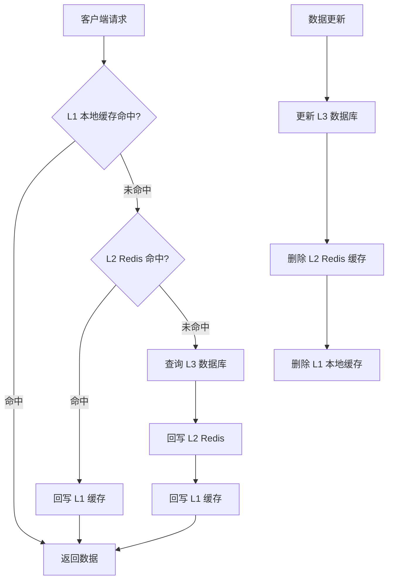
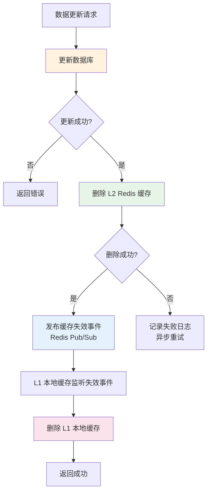

# 多级缓存架构

> 多级缓存是高并发系统的标配架构 —— 从 L1 本地缓存到 L2 Redis 分布式缓存再到 L3 数据库，每一层都是对下一层的保护。设计合理的多级缓存架构可以将 99% 的请求拦截在数据库之外，但同时缓存一致性、穿透、击穿、雪崩等问题也随之而来。本文将系统性地拆解多级缓存的每个环节，给出生产级的解决方案。

## 1. 缓存层次架构

### 1.1 三级缓存模型

```text
┌─────────────────────────────────────────────────────────────┐
│                    三级缓存架构                                 │
│                                                               │
│  ┌───────────────────────────────────────────────────────┐  │
│  │  L1 - 本地缓存（进程内）                                  │  │
│  │  • MemoryCache / IMemoryCache                          │  │
│  │  • 延迟：< 1ms                                          │  │
│  │  • 容量：受限于进程内存（MB 级）                          │  │
│  │  • 一致性：最强（单进程）                                 │  │
│  │  • 适用：热点数据、配置信息                               │  │
│  └───────────────────────────┬───────────────────────────┘  │
│                              │ 未命中                          │
│  ┌───────────────────────────▼───────────────────────────┐  │
│  │  L2 - 分布式缓存（Redis）                                │  │
│  │  • StackExchange.Redis / Cluster                        │  │
│  │  • 延迟：0.5-2ms                                        │  │
│  │  • 容量：GB-TB 级                                       │  │
│  │  • 一致性：最终一致（主从异步复制）                        │  │
│  │  • 适用：共享数据、会话信息                               │  │
│  └───────────────────────────┬───────────────────────────┘  │
│                              │ 未命中                          │
│  ┌───────────────────────────▼───────────────────────────┐  │
│  │  L3 - 持久化存储（数据库）                                │  │
│  │  • SQL Server / MySQL / PostgreSQL                     │  │
│  │  • 延迟：5-50ms                                         │  │
│  │  • 容量：TB 级                                          │  │
│  │  • 一致性：强一致（事务）                                 │  │
│  │  • 适用：持久化数据                                      │  │
│  └───────────────────────────────────────────────────────┘  │
│                                                               │
│  请求流量分布（典型电商场景）：                                 │
│  L1 命中: 60%    → 延迟 < 1ms                                │
│  L2 命中: 30%    → 延迟 ~1ms                                 │
│  L3 命中: 10%    → 延迟 ~10ms                                │
│  数据库压力降低 90%                                            │
└─────────────────────────────────────────────────────────────┘
```

### 1.2 多级缓存架构图



### 1.3 各级缓存对比

```text
┌──────────────┬──────────────┬──────────────┬──────────────┐
│  维度          │  L1 本地缓存  │  L2 Redis     │  L3 数据库     │
├──────────────┼──────────────┼──────────────┼──────────────┤
│  位置         │  进程内       │  独立进程      │  独立进程       │
│  延迟         │  < 1ms       │  0.5-2ms      │  5-50ms        │
│  吞吐量       │  百万级QPS    │  十万级QPS     │  万级QPS        │
│  容量         │  MB 级        │  GB-TB 级     │  TB 级          │
│  一致性       │  强一致       │  最终一致      │  强一致         │
│  可靠性       │  随进程生死   │  持久化可恢复  │  持久化         │
│  共享性       │  不共享       │  多进程共享    │  多进程共享     │
│  适用数据     │  热点/配置    │  通用缓存      │  持久化数据     │
│  内存成本     │  低           │  中            │  高            │
│  运维成本     │  低           │  中            │  高            │
└──────────────┴──────────────┴──────────────┴──────────────┘
```

## 2. 本地缓存（L1）

### 2.1 MemoryCache / IMemoryCache

```csharp
// .NET 本地缓存实现

// 方式1：IMemoryCache（推荐，ASP.NET Core 内置）
public class LocalCacheService
{
    private readonly IMemoryCache _cache;
    private readonly ILogger<LocalCacheService> _logger;

    public LocalCacheService(
        IMemoryCache cache,
        ILogger<LocalCacheService> logger)
    {
        _cache = cache;
        _logger = logger;
    }

    /// <summary>
    /// 获取或设置缓存
    /// </summary>
    public T? GetOrSet<T>(
        string key,
        Func<T> factory,
        TimeSpan expiry)
    {
        if (_cache.TryGetValue(key, out T? value) && value is not null)
        {
            return value;
        }

        value = factory();

        var options = new MemoryCacheEntryOptions()
            .SetAbsoluteExpiration(expiry)
            .SetPriority(CacheItemPriority.Normal)
            .RegisterPostEvictionCallback((evictedKey, evictedValue, reason, state) =>
            {
                _logger.LogDebug(
                    "本地缓存淘汰: Key={Key}, Reason={Reason}",
                    evictedKey, reason);
            });

        _cache.Set(key, value, options);

        return value;
    }

    /// <summary>
    /// 异步获取或设置
    /// </summary>
    public async Task<T?> GetOrSetAsync<T>(
        string key,
        Func<Task<T>> factory,
        TimeSpan expiry)
    {
        if (_cache.TryGetValue(key, out T? value) && value is not null)
        {
            return value;
        }

        value = await factory();

        var options = new MemoryCacheEntryOptions()
            .SetAbsoluteExpiration(expiry)
            .SetPriority(CacheItemPriority.Normal);

        _cache.Set(key, value, options);

        return value;
    }

    /// <summary>
    /// 删除缓存
    /// </summary>
    public void Remove(string key)
    {
        _cache.Remove(key);
    }

    /// <summary>
    /// 批量删除（按前缀）
    /// </summary>
    public void RemoveByPrefix(string prefix)
    {
        // IMemoryCache 不支持前缀删除
        // 需要自己维护 Key 列表或使用紧凑缓存方案
    }
}
```

### 2.2 本地缓存注意事项

```text
本地缓存注意事项：

┌──────────────────────────────────────────────────────────┐
│  1. 内存限制                                             │
│     • 设置合理的缓存大小上限                              │
│     • 监控进程内存使用                                    │
│     • 使用 CacheItemPriority 控制淘汰优先级               │
│                                                            │
│  2. 淘汰策略                                             │
│     • 过期淘汰：AbsoluteExpiration / SlidingExpiration    │
│     • 容量淘汰：Compact() 手动触发                        │
│     • 优先级：Low / Normal / High / NeverRemove          │
│                                                            │
│  3. 线程安全                                             │
│     • IMemoryCache 是线程安全的                           │
│     • 避免缓存穿透：使用 SemaphoreSlim 防止缓存击穿        │
│                                                            │
│  4. 一致性                                               │
│     • 本地缓存无法跨进程同步                              │
│     • 需要主动失效机制（Redis Pub/Sub 通知）               │
│     • 设置较短的过期时间（< 5分钟）                       │
└──────────────────────────────────────────────────────────┘
```

## 3. Redis 二级缓存（L2）

### 3.1 Redis 缓存服务

```csharp
// Redis 二级缓存服务
public class RedisCacheService
{
    private readonly IDatabase _db;
    private readonly ILogger<RedisCacheService> _logger;

    public RedisCacheService(
        IDatabase db,
        ILogger<RedisCacheService> logger)
    {
        _db = db;
        _logger = logger;
    }

    /// <summary>
    /// 获取缓存
    /// </summary>
    public async Task<T?> GetAsync<T>(string key)
    {
        var value = await _db.StringGetAsync(key);
        if (value.IsNullOrEmpty)
            return default;

        try
        {
            return JsonSerializer.Deserialize<T>(value!);
        }
        catch (JsonException ex)
        {
            _logger.LogError(ex, "反序列化缓存失败: Key={Key}", key);
            await _db.KeyDeleteAsync(key);
            return default;
        }
    }

    /// <summary>
    /// 设置缓存
    /// </summary>
    public async Task SetAsync<T>(
        string key, T value, TimeSpan? expiry = null)
    {
        var json = JsonSerializer.Serialize(value);
        await _db.StringSetAsync(key, json, expiry);
    }

    /// <summary>
    /// 删除缓存
    /// </summary>
    public async Task DeleteAsync(string key)
    {
        await _db.KeyDeleteAsync(key);
    }

    /// <summary>
    /// 批量删除（使用 SCAN + DEL）
    /// </summary>
    public async Task DeleteByPrefixAsync(string prefix)
    {
        var server = _db.Multiplexer
            .GetServers()
            .First(s => !s.IsReplica);

        var keys = server.KeysAsync(
            pattern: $"{prefix}*");

        await foreach (var key in keys)
        {
            await _db.KeyDeleteAsync(key);
        }
    }

    /// <summary>
    /// 获取或设置（防缓存击穿）
    /// </summary>
    public async Task<T> GetOrSetAsync<T>(
        string key,
        Func<Task<T>> factory,
        TimeSpan expiry,
        TimeSpan? lockExpiry = null)
    {
        // 先尝试从缓存获取
        var cached = await GetAsync<T>(key);
        if (cached is not null)
            return cached;

        // 缓存未命中，使用分布式锁防止击穿
        var lockKey = $"lock:{key}";
        lockExpiry ??= TimeSpan.FromSeconds(10);

        var lockValue = Guid.NewGuid().ToString("N");
        var acquired = await _db.StringSetAsync(
            lockKey, lockValue, lockExpiry, When.NotExists);

        if (!acquired)
        {
            // 未获取到锁，短暂等待后重试读缓存
            await Task.Delay(100);
            return await GetOrSetAsync(key, factory, expiry, lockExpiry);
        }

        try
        {
            // 双重检查：获取锁后再次检查缓存
            cached = await GetAsync<T>(key);
            if (cached is not null)
                return cached;

            // 从数据源获取
            var value = await factory();

            // 写入缓存
            await SetAsync(key, value, expiry);

            return value;
        }
        finally
        {
            // 释放锁
            var releaseScript = LuaScript.Prepare(@"
                if redis.call('GET', KEYS[1]) == ARGV[1] then
                    return redis.call('DEL', KEYS[1])
                else
                    return 0
                end
            ");

            await _db.ScriptEvaluateAsync(
                releaseScript,
                new
                {
                    KEYS = new RedisKey[] { lockKey },
                    ARGV = new RedisValue[] { lockValue }
                });
        }
    }
}
```

## 4. 缓存一致性策略

### 4.1 一致性问题分析

```text
缓存一致性核心问题：

数据库和缓存是两个独立的存储系统，无法通过事务保证原子更新。
任何更新顺序都可能出现不一致窗口：

方案1：先更新数据库，再删除缓存（Cache-Aside，推荐）
  ┌──────────────────────────────────────────────────────┐
  │  正常流程：                                            │
  │  1. 更新数据库                                        │
  │  2. 删除缓存                                          │
  │  3. 下次读取时从数据库加载到缓存                       │
  │                                                        │
  │  异常场景：                                            │
  │  读请求A: 读缓存MISS → 查数据库(旧值)                 │
  │  写请求B: 更新数据库(新值) → 删除缓存                  │
  │  读请求A: 写入缓存(旧值)                              │
  │  → 缓存是旧值！                                       │
  │                                                        │
  │  发生概率：极低（需要读请求的数据库查询早于写请求，     │
  │           但缓存写入晚于写请求的缓存删除）              │
  │  解决：设置较短的缓存过期时间 + 延迟双删               │
  └──────────────────────────────────────────────────────┘

方案2：先删除缓存，再更新数据库
  ┌──────────────────────────────────────────────────────┐
  │  异常场景：                                            │
  │  写请求: 删除缓存                                      │
  │  读请求A: 读缓存MISS → 查数据库(旧值) → 写入缓存(旧值)│
  │  写请求: 更新数据库(新值)                              │
  │  → 缓存是旧值！                                       │
  │                                                        │
  │  发生概率：较高（并发读写时容易出现）                   │
  │  解决：延迟双删                                        │
  └──────────────────────────────────────────────────────┘

方案3：先更新数据库，再更新缓存
  ┌──────────────────────────────────────────────────────┐
  │  异常场景（并发写）：                                   │
  │  写请求A: 更新数据库(A值)                              │
  │  写请求B: 更新数据库(B值)                              │
  │  写请求B: 更新缓存(B值)                                │
  │  写请求A: 更新缓存(A值)                                │
  │  → 缓存是旧值A，数据库是新值B！                        │
  │                                                        │
  │  发生概率：中等（并发写时出现）                         │
  │  不推荐！                                              │
  └──────────────────────────────────────────────────────┘
```

### 4.2 Cache-Aside 模式

```text
Cache-Aside 模式（旁路缓存，最常用）：

读操作：
  ┌───────────────────────────────────────────────────┐
  │  1. 先读缓存                                      │
  │  2. 缓存命中 → 返回数据                            │
  │  3. 缓存未命中 → 查数据库                          │
  │  4. 将数据库结果写入缓存                            │
  │  5. 返回数据                                      │
  └───────────────────────────────────────────────────┘

写操作：
  ┌───────────────────────────────────────────────────┐
  │  1. 更新数据库                                    │
  │  2. 删除缓存（不是更新缓存！）                      │
  └───────────────────────────────────────────────────┘

为什么删除而不是更新缓存？
  1. 删除是幂等操作，更新不是
  2. 并发场景下更新可能导致数据覆盖
  3. 如果缓存很少访问，更新是浪费
  4. 删除更简单，一致性问题更少
```

### 4.3 Read-Through / Write-Through / Write-Behind

```text
缓存模式对比：

┌──────────────────┬──────────────────────────────────────────┐
│  Cache-Aside      │  应用层管理缓存，手动读写                  │
│  (旁路缓存)       │  读：先缓存后数据库                        │
│                    │  写：先数据库后删缓存                      │
│                    │  特点：灵活，但代码复杂                    │
├──────────────────┼──────────────────────────────────────────┤
│  Read-Through     │  缓存层自动从数据源读取                    │
│  (读穿透)         │  应用只需读缓存                            │
│                    │  缓存未命中时自动加载数据源                │
│                    │  特点：简化应用层代码                      │
├──────────────────┼──────────────────────────────────────────┤
│  Write-Through    │  写操作同时写缓存和数据库                  │
│  (写穿透)         │  缓存层负责同步写入数据库                  │
│                    │  特点：强一致，但写入延迟高                 │
├──────────────────┼──────────────────────────────────────────┤
│  Write-Behind     │  写操作只写缓存，异步批量写入数据库        │
│  (写回)           │  缓存层异步持久化                          │
│                    │  特点：写入快，但可能丢数据                 │
└──────────────────┴──────────────────────────────────────────┘
```

### 4.4 缓存一致性流程



### 4.5 延迟双删策略

```csharp
// 延迟双删策略
public class CacheConsistencyService
{
    private readonly IDatabase _redis;
    private readonly IMemoryCache _localCache;
    private readonly ISubscriber _subscriber;
    private readonly ILogger<CacheConsistencyService> _logger;

    public CacheConsistencyService(
        IDatabase redis,
        IMemoryCache localCache,
        ConnectionMultiplexer connection,
        ILogger<CacheConsistencyService> logger)
    {
        _redis = redis;
        _localCache = localCache;
        _subscriber = connection.GetSubscriber();
        _logger = logger;

        // 订阅缓存失效事件
        SubscribeInvalidation();
    }

    /// <summary>
    /// 更新数据 + 删除缓存（延迟双删）
    /// </summary>
    public async Task UpdateWithCacheInvalidationAsync(
        string key,
        Func<Task> dbUpdateAction,
        TimeSpan? delay = null)
    {
        delay ??= TimeSpan.FromSeconds(1);

        // Step 1: 第一次删除缓存
        await InvalidateCacheAsync(key);

        // Step 2: 更新数据库
        await dbUpdateAction();

        // Step 3: 第二次删除缓存（延迟执行）
        _ = Task.Run(async () =>
        {
            await Task.Delay(delay.Value);
            await InvalidateCacheAsync(key);
        });
    }

    /// <summary>
    /// 删除缓存（L1 + L2 + 通知其他节点）
    /// </summary>
    private async Task InvalidateCacheAsync(string key)
    {
        // 删除 L2 Redis 缓存
        await _redis.KeyDeleteAsync(key);

        // 删除 L1 本地缓存
        _localCache.Remove(key);

        // 发布失效事件，通知其他节点删除 L1
        await _subscriber.PublishAsync(
            RedisChannel.Parse("cache:invalidation"),
            key);
    }

    /// <summary>
    /// 订阅缓存失效事件
    /// </summary>
    private void SubscribeInvalidation()
    {
        _subscriber.Subscribe(
            RedisChannel.Parse("cache:invalidation"),
            (channel, message) =>
            {
                var key = message.ToString();
                _localCache.Remove(key);
                _logger.LogDebug(
                    "收到缓存失效通知: Key={Key}", key);
            });
    }
}
```

## 5. 缓存穿透

### 5.1 问题分析

```text
缓存穿透：查询一个一定不存在的数据，缓存永远不会命中，
          每次请求都打到数据库。

  ┌──────┐    ┌──────┐    ┌──────┐    ┌──────┐
  │请求 -1│───▶│ 缓存  │───▶│ 缓存  │───▶│ 数据库│
  │(不存在)│    │ 未命中│    │ 未命中│    │ 未命中│
  └──────┘    └──────┘    └──────┘    └──┬───┘
       │                                     │
       │  ┌──────┐    ┌──────┐    ┌──────┐  │
       └──│请求 -2│───▶│ 缓存  │───▶│ 缓存  │──┘
          │(不存在)│    │ 未命中│    │ 未命中│
          └──────┘    └──────┘    └──────┘

  攻击场景：恶意请求大量不存在的 ID
  后果：数据库压力暴增，可能宕机
```

### 5.2 布隆过滤器

```text
布隆过滤器原理：

  初始化：一个长度为 m 的位数组，全部置为 0
  添加元素：使用 k 个哈希函数计算位置，全部置为 1
  查询元素：检查 k 个位置是否全部为 1

  位数组示例（m=16, k=3）：
  ┌─┬─┬─┬─┬─┬─┬─┬─┬─┬─┬─┬─┬─┬─┬─┬─┐
  │0│0│1│0│0│1│0│1│0│0│1│0│0│1│0│0│  ← 添加 "user:1001"
  └─┴─┴─┴─┴─┴─┴─┴─┴─┴─┴─┴─┴─┴─┴─┴─┘
          ↑     ↑   ↑     ↑   ↑
        h1()  h2() h3()

  查询 "user:9999"：
  h1(9999)=3 → 0   ← 有一个位置为0
  → 一定不存在！返回，不查数据库

  特性：
  ✅ 判定不存在 → 一定不存在
  ⚠️ 判定存在 → 可能存在（误判率）
  误判率取决于位数组大小和哈希函数数量
```

### 5.3 C# 布隆过滤器实现

```csharp
// 基于 Redis 的布隆过滤器
public class RedisBloomFilter
{
    private readonly IDatabase _db;
    private readonly string _filterKey;
    private readonly int _hashCount;
    private readonly long _bitSize;

    /// <summary>
    /// 创建布隆过滤器
    /// </summary>
    /// <param name="db">Redis 数据库</param>
    /// <param name="filterKey">过滤器 Key</param>
    /// <param name="expectedItems">预期元素数量</param>
    /// <param name="falsePositiveRate">误判率</param>
    public RedisBloomFilter(
        IDatabase db,
        string filterKey,
        long expectedItems = 1000000,
        double falsePositiveRate = 0.01)
    {
        _db = db;
        _filterKey = filterKey;

        // 计算位数组大小和哈希函数数量
        _bitSize = (long)Math.Ceiling(
            -expectedItems * Math.Log(falsePositiveRate) /
            (Math.Log(2) * Math.Log(2)));

        _hashCount = (int)Math.Ceiling(
            _bitSize / (double)expectedItems * Math.Log(2));
    }

    /// <summary>
    /// 添加元素
    /// </summary>
    public async Task AddAsync(string item)
    {
        var positions = GetHashPositions(item);
        foreach (var pos in positions)
        {
            await _db.StringSetBitAsync(_filterKey, pos, true);
        }
    }

    /// <summary>
    /// 批量添加
    /// </summary>
    public async Task AddRangeAsync(IEnumerable<string> items)
    {
        var batch = _db.CreateBatch();
        var tasks = new List<Task>();

        foreach (var item in items)
        {
            var positions = GetHashPositions(item);
            foreach (var pos in positions)
            {
                tasks.Add(batch.StringSetBitAsync(
                    _filterKey, pos, true));
            }
        }

        batch.Execute();
        await Task.WhenAll(tasks);
    }

    /// <summary>
    /// 判断元素是否可能存在
    /// </summary>
    public async Task<bool> MayExistAsync(string item)
    {
        var positions = GetHashPositions(item);
        foreach (var pos in positions)
        {
            var bit = await _db.StringGetBitAsync(_filterKey, pos);
            if (!bit)
                return false;  // 一定不存在
        }
        return true;  // 可能存在
    }

    /// <summary>
    /// 计算哈希位置
    /// </summary>
    private long[] GetHashPositions(string item)
    {
        var positions = new long[_hashCount];

        // 使用 MurmurHash 的双重哈希
        var hash1 = MurmurHash(item, 0);
        var hash2 = MurmurHash(item, hash1);

        for (int i = 0; i < _hashCount; i++)
        {
            positions[i] = Math.Abs(
                (hash1 + i * hash2) % _bitSize);
        }

        return positions;
    }

    private long MurmurHash(string item, long seed)
    {
        // 简化实现，生产环境建议使用成熟的哈希库
        unchecked
        {
            long h = seed;
            foreach (char c in item)
            {
                h = h * 31 + c;
            }
            return Math.Abs(h);
        }
    }
}
```

### 5.4 空值缓存

```csharp
// 空值缓存方案
public class NullValueCacheService
{
    private readonly IDatabase _db;
    private readonly ILogger<NullValueCacheService> _logger;

    // 空值标记
    private const string NULL_VALUE = "NULL_CACHE_VALUE";
    private static readonly TimeSpan NullValueExpiry = TimeSpan.FromMinutes(5);

    public NullValueCacheService(
        IDatabase db,
        ILogger<NullValueCacheService> logger)
    {
        _db = db;
        _logger = logger;
    }

    /// <summary>
    /// 获取数据（带空值缓存）
    /// </summary>
    public async Task<T?> GetWithNullCacheAsync<T>(
        string key,
        Func<Task<T?>> dbQuery,
        TimeSpan cacheExpiry) where T : class
    {
        var cached = await _db.StringGetAsync(key);

        if (cached == NULL_VALUE)
        {
            // 命中空值缓存，返回默认值
            return null;
        }

        if (!cached.IsNullOrEmpty)
        {
            return JsonSerializer.Deserialize<T>(cached!);
        }

        // 查数据库
        var value = await dbQuery();

        if (value is null)
        {
            // 缓存空值，防止穿透
            await _db.StringSetAsync(
                key, NULL_VALUE, NullValueExpiry);
            _logger.LogDebug("缓存空值: Key={Key}", key);
        }
        else
        {
            await _db.StringSetAsync(
                key, JsonSerializer.Serialize(value), cacheExpiry);
        }

        return value;
    }
}
```

## 6. 缓存击穿

### 6.1 问题分析

```text
缓存击穿：一个热点 Key 过期的瞬间，大量并发请求同时打到数据库。

  正常状态：
  请求 ──▶ 缓存命中 ──▶ 返回

  Key 过期瞬间：
  请求1 ──▶ 缓存未命中 ──▶ 查数据库 ──▶ 写缓存
  请求2 ──▶ 缓存未命中 ──▶ 查数据库 ──▶ 写缓存
  请求3 ──▶ 缓存未命中 ──▶ 查数据库 ──▶ 写缓存
  ...
  请求N ──▶ 缓存未命中 ──▶ 查数据库 ──▶ 写缓存
  → 数据库瞬间承受 N 倍压力！
```

### 6.2 互斥锁方案

```csharp
// 互斥锁防缓存击穿
public class MutexCacheService
{
    private readonly IDatabase _db;
    private readonly ILogger<MutexCacheService> _logger;

    // 防击穿 Lua 脚本：SET NX + GET 原子操作
    private static readonly LuaScript _mutexScript = LuaScript.Prepare(@"
        -- 尝试获取互斥锁
        if redis.call('SETNX', KEYS[2], ARGV[2]) == 1 then
            redis.call('PEXPIRE', KEYS[2], ARGV[3])
            -- 获取锁成功，返回标记需要加载数据
            return 'LOCK_ACQUIRED'
        end

        -- 锁被其他请求持有，检查缓存是否已被重建
        local value = redis.call('GET', KEYS[1])
        if value then
            return value
        end

        -- 缓存仍不存在，返回需要等待
        return 'LOCK_WAIT'
    ");

    public MutexCacheService(
        IDatabase db,
        ILogger<MutexCacheService> logger)
    {
        _db = db;
        _logger = logger;
    }

    /// <summary>
    /// 获取数据（互斥锁防击穿）
    /// </summary>
    public async Task<T?> GetWithMutexAsync<T>(
        string key,
        Func<Task<T?>> dbQuery,
        TimeSpan cacheExpiry,
        TimeSpan? lockExpiry = null) where T : class
    {
        lockExpiry ??= TimeSpan.FromSeconds(10);
        var lockKey = $"mutex:{key}";

        // Step 1: 尝试从缓存获取
        var cached = await _db.StringGetAsync(key);
        if (!cached.IsNullOrEmpty)
        {
            return JsonSerializer.Deserialize<T>(cached!);
        }

        // Step 2: 缓存未命中，尝试获取互斥锁
        var lockValue = Guid.NewGuid().ToString("N");
        var acquired = await _db.StringSetAsync(
            lockKey, lockValue, lockExpiry, When.NotExists);

        if (acquired)
        {
            try
            {
                // 获取锁成功，查数据库
                var value = await dbQuery();

                if (value is not null)
                {
                    await _db.StringSetAsync(
                        key,
                        JsonSerializer.Serialize(value),
                        cacheExpiry);
                }

                return value;
            }
            finally
            {
                // 释放锁
                var releaseScript = LuaScript.Prepare(@"
                    if redis.call('GET', KEYS[1]) == ARGV[1] then
                        return redis.call('DEL', KEYS[1])
                    else
                        return 0
                    end
                ");
                await _db.ScriptEvaluateAsync(
                    releaseScript,
                    new
                    {
                        KEYS = new RedisKey[] { lockKey },
                        ARGV = new RedisValue[] { lockValue }
                    });
            }
        }
        else
        {
            // 未获取锁，等待并重试
            await Task.Delay(50);
            return await GetWithMutexAsync<T>(
                key, dbQuery, cacheExpiry, lockExpiry);
        }
    }
}
```

### 6.3 永不过期方案

```text
永不过期方案：

  不设置过期时间，由后台线程异步更新缓存

  ┌──────────────────────────────────────────────────┐
  │  1. 缓存不设 TTL（或设很长）                        │
  │  2. 缓存中存储"逻辑过期时间"（不是 TTL）            │
  │  3. 读取时检查逻辑过期时间：                         │
  │     • 未过期 → 返回数据                             │
  │     • 已过期 → 返回旧数据，触发异步更新              │
  │  4. 后台线程异步更新缓存                             │
  └──────────────────────────────────────────────────┘

  优点：用户永远不需要等待数据库查询
  缺点：短时间内返回旧数据

  数据结构：
  {
      "data": { ... },              // 实际数据
      "expireAt": "2026-06-04T..."  // 逻辑过期时间
  }
```

## 7. 缓存雪崩

### 7.1 问题分析

```text
缓存雪崩：大量 Key 同时过期，或 Redis 宕机，
          大量请求同时打到数据库。

  场景1：大量 Key 同时过期
  ┌──────────────────────────────────────────────────────┐
  │  批量设置缓存时使用了相同的过期时间                      │
  │  所有 Key 在同一时刻过期                               │
  │  → 所有请求同时打到数据库                              │
  │                                                        │
  │  Key1 TTL=3600  ──▶ 过期！──▶ 查数据库               │
  │  Key2 TTL=3600  ──▶ 过期！──▶ 查数据库               │
  │  Key3 TTL=3600  ──▶ 过期！──▶ 查数据库               │
  │  ...                                                   │
  │  KeyN TTL=3600  ──▶ 过期！──▶ 查数据库               │
  └──────────────────────────────────────────────────────┘

  场景2：Redis 宕机
  ┌──────────────────────────────────────────────────────┐
  │  Redis 不可用                                         │
  │  所有请求直接打到数据库                                │
  │  数据库压力暴增，可能宕机                              │
  │  → 级联故障！                                         │
  └──────────────────────────────────────────────────────┘
```

### 7.2 随机过期时间

```csharp
// 随机过期时间防雪崩
public class AvalancheProofCacheService
{
    private readonly IDatabase _db;
    private readonly Random _random = new();

    public AvalancheProofCacheService(IDatabase db)
    {
        _db = db;
    }

    /// <summary>
    /// 设置缓存（带随机过期偏移）
    /// </summary>
    public async Task SetWithJitterAsync<T>(
        string key, T value, TimeSpan baseExpiry)
    {
        // 基础过期时间 + 随机偏移（±20%）
        var jitterMs = _random.Next(
            -(int)(baseExpiry.TotalMilliseconds * 0.2),
            (int)(baseExpiry.TotalMilliseconds * 0.2));

        var expiry = baseExpiry + TimeSpan.FromMilliseconds(jitterMs);

        var json = JsonSerializer.Serialize(value);
        await _db.StringSetAsync(key, json, expiry);
    }

    /// <summary>
    /// 批量设置缓存（带随机过期偏移）
    /// </summary>
    public async Task BatchSetWithJitterAsync<T>(
        Dictionary<string, T> items, TimeSpan baseExpiry)
    {
        var batch = _db.CreateBatch();
        var tasks = new List<Task>();

        foreach (var kvp in items)
        {
            var jitterMs = _random.Next(
                -(int)(baseExpiry.TotalMilliseconds * 0.2),
                (int)(baseExpiry.TotalMilliseconds * 0.2));

            var expiry = baseExpiry +
                TimeSpan.FromMilliseconds(jitterMs);

            var json = JsonSerializer.Serialize(kvp.Value);
            tasks.Add(batch.StringSetAsync(kvp.Key, json, expiry));
        }

        batch.Execute();
        await Task.WhenAll(tasks);
    }
}
```

### 7.3 多级缓存防雪崩

```text
多级缓存防雪崩策略：

┌──────────────────────────────────────────────────────────┐
│  1. L1 本地缓存兜底                                      │
│     即使 Redis 宕机，本地缓存仍可响应部分请求             │
│                                                            │
│  2. 随机过期时间                                          │
│     缓存过期时间 = 基础时间 ± 随机偏移                    │
│     避免大量 Key 同时过期                                  │
│                                                            │
│  3. Redis 高可用                                          │
│     Sentinel / Cluster 自动故障转移                        │
│     缩短不可用时间                                        │
│                                                            │
│  4. 限流降级                                              │
│     Redis 不可用时，启动限流                               │
│     超出容量的请求返回降级数据                             │
│                                                            │
│  5. 缓存预热                                              │
│     系统启动时提前加载热点数据到缓存                       │
│     避免启动时大量请求打到数据库                           │
│                                                            │
│  6. 永不过期 + 异步更新                                   │
│     热点 Key 不设过期时间                                  │
│     后台线程定期更新                                       │
└──────────────────────────────────────────────────────────┘
```

## 8. 热点 Key 发现与处理

### 8.1 热点 Key 发现

```text
热点 Key 发现方法：

方法1：redis-cli --hotkeys（Redis 4.0+）
  redis-cli --hotkeys
  # 需要配置 maxmemory-policy 为 LFU 系列

方法2：MONITOR 命令（开发环境）
  redis-cli MONITOR | awk '{print $4}' | sort | uniq -c | sort -nr | head -20
  # ⚠️ 生产环境慎用，MONITOR 会降低性能

方法3：客户端统计
  在应用层统计每个 Key 的访问频率

方法4：Redis INFO stats
  INFO stats → keyspace_hits / keyspace_misses

方法5：代理层统计
  通过 Twemproxy / Predixy 统计 Key 访问频率
```

### 8.2 热点 Key 处理

```text
热点 Key 处理策略：

策略1：本地缓存
  将热点 Key 缓存到 L1 本地缓存
  减少对 Redis 的请求量

策略2：Key 拆分
  将热点 Key 拆分为多个子 Key
  user:1001 → user:1001:1, user:1001:2, user:1001:3
  读取时随机选择一个子 Key

策略3：读写分离
  热点 Key 的读请求分散到多个从节点

策略4：Cluster 槽分散
  在 Cluster 中，热点 Key 只在一个节点
  使用 Hash Tag 将热点数据分散
  注意：这会增加多 Key 操作的复杂度

策略5：限流
  对热点 Key 的访问频率设限
```

### 8.3 C# 热点 Key 本地缓存

```csharp
// 热点 Key 本地缓存
public class HotKeyCacheService
{
    private readonly IMemoryCache _localCache;
    private readonly IDatabase _redis;
    private readonly ILogger<HotKeyCacheService> _logger;

    // 热点 Key 识别阈值
    private const int HotKeyThreshold = 100;  // 每分钟 100 次
    private readonly ConcurrentDictionary<string, AtomicCounter> _accessCounters = new();
    private readonly TimeSpan _counterWindow = TimeSpan.FromMinutes(1);

    public HotKeyCacheService(
        IMemoryCache localCache,
        IDatabase redis,
        ILogger<HotKeyCacheService> logger)
    {
        _localCache = localCache;
        _redis = redis;
        _logger = logger;

        // 定期清理计数器
        _ = CleanupCountersAsync();
    }

    /// <summary>
    /// 获取数据（自动识别热点 Key）
    /// </summary>
    public async Task<T?> GetAsync<T>(
        string key,
        Func<Task<T?>> dbQuery,
        TimeSpan redisExpiry,
        TimeSpan? localExpiry = null) where T : class
    {
        localExpiry ??= TimeSpan.FromSeconds(10);

        // Step 1: 尝试本地缓存
        if (_localCache.TryGetValue(key, out T? localValue) &&
            localValue is not null)
        {
            RecordAccess(key);
            return localValue;
        }

        // Step 2: 尝试 Redis 缓存
        var redisValue = await _redis.StringGetAsync(key);
        if (!redisValue.IsNullOrEmpty)
        {
            var value = JsonSerializer.Deserialize<T>(redisValue!);
            RecordAccess(key);

            // 如果是热点 Key，缓存到本地
            if (IsHotKey(key))
            {
                _localCache.Set(key, value, localExpiry.Value);
                _logger.LogInformation(
                    "热点 Key 缓存到本地: Key={Key}", key);
            }

            return value;
        }

        // Step 3: 查数据库
        var dbValue = await dbQuery();
        if (dbValue is not null)
        {
            await _redis.StringSetAsync(
                key,
                JsonSerializer.Serialize(dbValue),
                redisExpiry);
        }

        return dbValue;
    }

    private void RecordAccess(string key)
    {
        _accessCounters.AddOrUpdate(
            key,
            _ => new AtomicCounter(1),
            (_, counter) => counter.Increment());
    }

    private bool IsHotKey(string key)
    {
        return _accessCounters.TryGetValue(key, out var counter) &&
               counter.Value > HotKeyThreshold;
    }

    private async Task CleanupCountersAsync()
    {
        while (true)
        {
            await Task.Delay(_counterWindow);

            foreach (var kvp in _accessCounters)
            {
                if (kvp.Value.Value < HotKeyThreshold / 2)
                {
                    _accessCounters.TryRemove(kvp.Key, out _);
                }
                else
                {
                    kvp.Value.Reset();
                }
            }
        }
    }

    private class AtomicCounter
    {
        private int _value;

        public AtomicCounter(int initialValue) => _value = initialValue;
        public int Value => _value;
        public AtomicCounter Increment() { Interlocked.Increment(ref _value); return this; }
        public void Reset() => Interlocked.Exchange(ref _value, 0);
    }
}
```

## 9. .NET 多级缓存完整实现

### 9.1 多级缓存服务

```csharp
// 多级缓存服务（L1 + L2 + L3）
public class MultiLevelCacheService
{
    private readonly IMemoryCache _localCache;
    private readonly IDatabase _redis;
    private readonly ISubscriber _subscriber;
    private readonly ILogger<MultiLevelCacheService> _logger;

    public MultiLevelCacheService(
        IMemoryCache localCache,
        IDatabase redis,
        ConnectionMultiplexer connection,
        ILogger<MultiLevelCacheService> logger)
    {
        _localCache = localCache;
        _redis = redis;
        _subscriber = connection.GetSubscriber();
        _logger = logger;

        // 订阅缓存失效通知
        _subscriber.Subscribe(
            RedisChannel.Parse("cache:invalidate"),
            (channel, message) =>
            {
                var key = message.ToString();
                _localCache.Remove(key);
            });
    }

    /// <summary>
    /// 多级缓存读取
    /// </summary>
    public async Task<T?> GetAsync<T>(
        string key,
        Func<Task<T?>> dbQuery,
        TimeSpan localExpiry,
        TimeSpan redisExpiry) where T : class
    {
        // L1: 本地缓存
        if (_localCache.TryGetValue(key, out T? localValue) &&
            localValue is not null)
        {
            _logger.LogDebug("L1命中: Key={Key}", key);
            return localValue;
        }

        // L2: Redis 缓存
        var redisValue = await _redis.StringGetAsync(key);
        if (!redisValue.IsNullOrEmpty)
        {
            _logger.LogDebug("L2命中: Key={Key}", key);
            var value = JsonSerializer.Deserialize<T>(redisValue!);

            // 回写 L1
            _localCache.Set(key, value, localExpiry);

            return value;
        }

        // L3: 数据库
        _logger.LogDebug("L3查询: Key={Key}", key);
        var dbValue = await dbQuery();

        if (dbValue is not null)
        {
            // 回写 L2
            await _redis.StringSetAsync(
                key,
                JsonSerializer.Serialize(dbValue),
                redisExpiry);

            // 回写 L1
            _localCache.Set(key, dbValue, localExpiry);
        }

        return dbValue;
    }

    /// <summary>
    /// 多级缓存失效
    /// </summary>
    public async Task InvalidateAsync(string key)
    {
        // 删除 L2
        await _redis.KeyDeleteAsync(key);

        // 删除 L1（本地）
        _localCache.Remove(key);

        // 通知其他节点删除 L1
        await _subscriber.PublishAsync(
            RedisChannel.Parse("cache:invalidate"),
            key);

        _logger.LogDebug("缓存已失效: Key={Key}", key);
    }

    /// <summary>
    /// 更新数据并失效缓存
    /// </summary>
    public async Task UpdateAsync<T>(
        string key,
        T value,
        Func<Task> dbUpdateAction,
        TimeSpan localExpiry,
        TimeSpan redisExpiry)
    {
        // 更新数据库
        await dbUpdateAction();

        // 失效缓存
        await InvalidateAsync(key);
    }
}
```

### 9.2 依赖注入配置

```csharp
// ASP.NET Core 多级缓存配置
public static class MultiLevelCacheExtensions
{
    public static IServiceCollection AddMultiLevelCache(
        this IServiceCollection services,
        IConfiguration configuration)
    {
        // IMemoryCache
        services.AddMemoryCache(options =>
        {
            options.SizeLimit = 1024; // 限制缓存条目数
        });

        // Redis
        services.AddSingleton<ConnectionMultiplexer>(sp =>
        {
            var config = configuration.GetSection("Redis");
            var options = new ConfigurationOptions
            {
                AbortOnConnectFail = false,
                ConnectTimeout = 5000,
                SyncTimeout = 3000,
                Password = config["Password"]
            };

            foreach (var ep in config.GetSection("Endpoints").GetChildren())
            {
                options.EndPoints.Add(ep["Host"], int.Parse(ep["Port"]));
            }

            return ConnectionMultiplexer.Connect(options);
        });

        services.AddScoped<IDatabase>(sp =>
            sp.GetRequiredService<ConnectionMultiplexer>().GetDatabase());

        // 多级缓存服务
        services.AddScoped<MultiLevelCacheService>();

        return services;
    }
}
```

## 10. CAP 与分布式事务

### 10.1 缓存场景下的 CAP

```text
CAP 定理在缓存场景下的体现：

C - 一致性：缓存和数据库的数据必须一致
A - 可用性：系统必须始终可响应
P - 分区容忍：网络分区时系统仍能工作

缓存场景下，我们通常选择 AP：
  ┌──────────────────────────────────────────────────────┐
  │  • 放弃强一致性，接受最终一致                          │
  │  • 保证高可用，缓存不可用时降级到数据库                │
  │  • 网络分区时，各节点可独立服务                        │
  │                                                        │
  │  代价：                                                │
  │  • 短暂的数据不一致窗口                                │
  │  • 可能读到旧数据                                      │
  │  • 需要业务层做幂等处理                                │
  └──────────────────────────────────────────────────────┘
```

### 10.2 最终一致性保障

```text
最终一致性保障手段：

1. 设置合理的缓存过期时间
   • 缓存最终会过期，自动从数据库刷新
   • 作为一致性的兜底机制

2. 延迟双删
   • 先删缓存 → 更新数据库 → 延迟再删缓存
   • 覆盖并发场景下可能出现的旧值缓存

3. 基于 Binlog 的异步同步
   • 监听数据库 Binlog
   • 异步删除/更新缓存
   • 保证最终一致性

4. 消息队列可靠删除
   • 更新数据库后发送消息到 MQ
   • 消费者异步删除缓存
   • 失败时重试

5. 定期全量校验
   • 后台任务定期对比缓存和数据库
   • 修复不一致数据
```

## 11. 总结

```text
┌─────────────────────────────────────────────────────────────┐
│                  多级缓存架构核心要点                           │
├─────────────────────────────────────────────────────────────┤
│                                                               │
│  架构层次：                                                    │
│  🔹 L1 本地缓存：延迟最低，容量最小，不共享                    │
│  🔹 L2 Redis 缓存：延迟适中，容量大，共享                     │
│  🔹 L3 数据库：延迟最高，容量最大，强一致                     │
│                                                               │
│  一致性策略：                                                  │
│  🔹 Cache-Aside：先更新数据库再删缓存（推荐）                 │
│  🔹 延迟双删：覆盖并发场景的旧值问题                          │
│  🔹 Pub/Sub 通知：多节点 L1 缓存同步                         │
│  🔹 过期时间兜底：最终一致性保证                              │
│                                                               │
│  三大问题：                                                    │
│  🔹 缓存穿透 → 布隆过滤器 + 空值缓存                         │
│  🔹 缓存击穿 → 互斥锁 + 永不过期 + 异步更新                  │
│  🔹 缓存雪崩 → 随机过期 + 多级缓存 + 限流降级               │
│                                                               │
│  热点 Key：                                                    │
│  🔹 发现：hotkeys 命令 / 客户端统计 / 代理层统计              │
│  🔹 处理：本地缓存 / Key 拆分 / 读写分离                     │
│                                                               │
│  设计原则：                                                    │
│  🔹 缓存是优化手段，不是必须依赖                              │
│  🔹 始终有缓存不可用的降级方案                                │
│  🔹 接受最终一致性，在业务层做幂等                            │
│  🔹 监控缓存命中率，及时发现问题                              │
│  🔹 预热热点数据，避免冷启动                                  │
│                                                               │
└─────────────────────────────────────────────────────────────┘
```

::: info 参考文献
- [Redis 官方文档 - Caching](https://redis.io/docs/manual/patterns/caching/)
- [Cache-Aside Pattern - Microsoft](https://docs.microsoft.com/en-us/azure/architecture/patterns/cache-aside)
- [Martin Kleppmann - Designing Data-Intensive Applications](https://dataintensive.net/)
- 《Redis 开发与运维》- 付磊、张益军 - 第11章 缓存设计
- [布隆过滤器原理](https://en.wikipedia.org/wiki/Bloom_filter)
- [CAP 定理](https://en.wikipedia.org/wiki/CAP_theorem)
:::
