# Redis 面试题精选

> 50 道高频 Redis 面试题，覆盖**基础、原理、架构、实战**四大维度。每道题包含标准答案（含 mermaid 图或代码）、深度追问与面试官考察点。

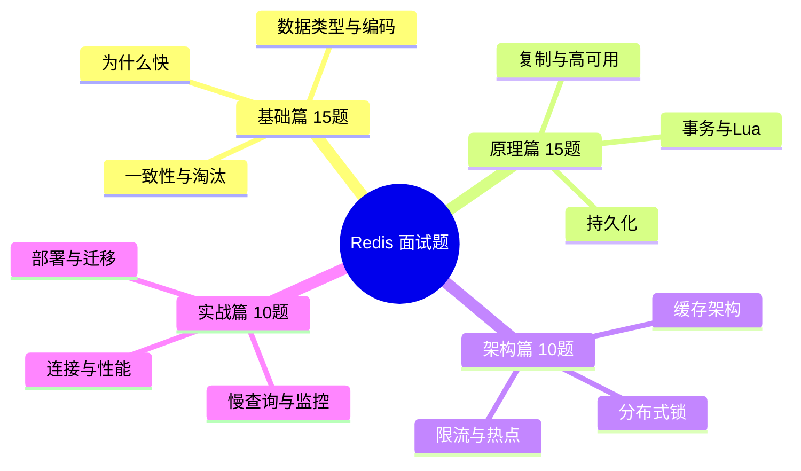
```mermaid
mindmap
  root((Redis 面试题))
    基础篇 15题
      为什么快
      数据类型与编码
      一致性与淘汰
    原理篇 15题
      持久化
      复制与高可用
      事务与Lua
    架构篇 10题
      缓存架构
      分布式锁
      限流与热点
    实战篇 10题
      慢查询与监控
      部署与迁移
      连接与性能
```

---

## 一、基础篇（15 题）

### Q01：Redis 为什么快？

**标准答案**

Redis 的高性能是三个因素叠加的结果：**纯内存操作、单线程无锁竞争、I/O 多路复用**。

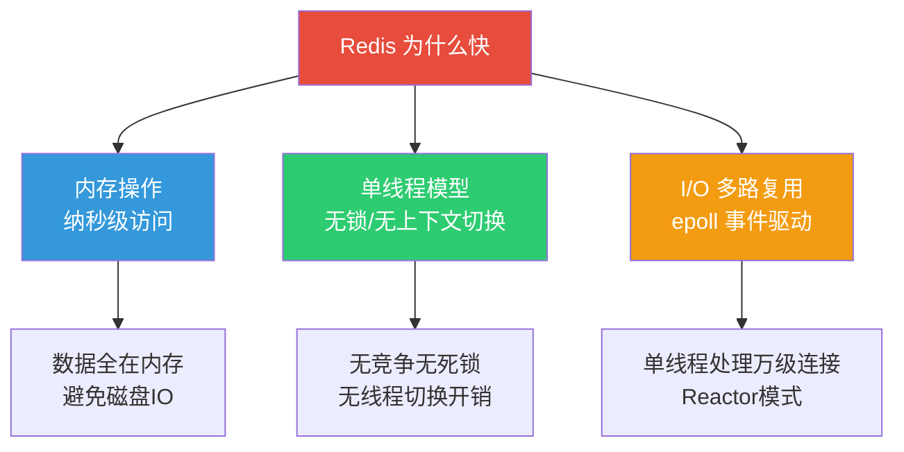
```mermaid
flowchart TB
    A[Redis 为什么快] --> B[内存操作<br/>纳秒级访问]
    A --> C[单线程模型<br/>无锁/无上下文切换]
    A --> D[I/O 多路复用<br/>epoll 事件驱动]

    B --> B1[数据全在内存<br/>避免磁盘IO]
    C --> C1[无竞争无死锁<br/>无线程切换开销]
    D --> D1[单线程处理万级连接<br/>Reactor模式]

    style A fill:#e74c3c,color:#fff
    style B fill:#3498db,color:#fff
    style C fill:#2ecc71,color:#fff
    style D fill:#f39c12,color:#fff
```

| 因素 | 说明 | 量级 |
|------|------|------|
| 内存访问 | CPU 直接读写 DRAM，无磁盘寻道 | ~100ns |
| 单线程 | 无锁竞争、无线程上下文切换 | 避免 ~5μs/次切换 |
| I/O 多路复用 | epoll 同时监听万级 fd，事件驱动 | O(1) 就绪检测 |

::: tip 核心公式
单次命令耗时 ≈ 内存访问(100ns) + 命令处理(逻辑) + 响应写入 ≈ **亚微秒级**，这就是 Redis 能做到 10 万+ QPS 的根本原因。
:::

**深度追问**

- **追问 1**：既然内存这么快，为什么不把数据库也全放内存？—— 内存成本、数据持久化需求、容量限制
- **追问 2**：Redis 6.0 的多线程是怎么回事？—— I/O 读写多线程，命令执行仍单线程，详见 Q02

**面试官考察点**：候选人是否理解 Redis 快的**根本原因**是内存而非单线程，以及能否区分 I/O 模型和执行模型的差异。

---

### Q02：Redis 单线程为什么还能这么快？

**标准答案**

Redis 的"单线程"指的是**命令执行线程**是单线程。单线程之所以够用，核心在于：

1. **瓶颈不在 CPU**：Redis 的操作主要是内存读写和网络 I/O，CPU 从来不是瓶颈
2. **避免并发开销**：无锁、无上下文切换、无死锁风险
3. **I/O 多路复用**：一个线程通过 epoll/kqueue 同时处理万级连接

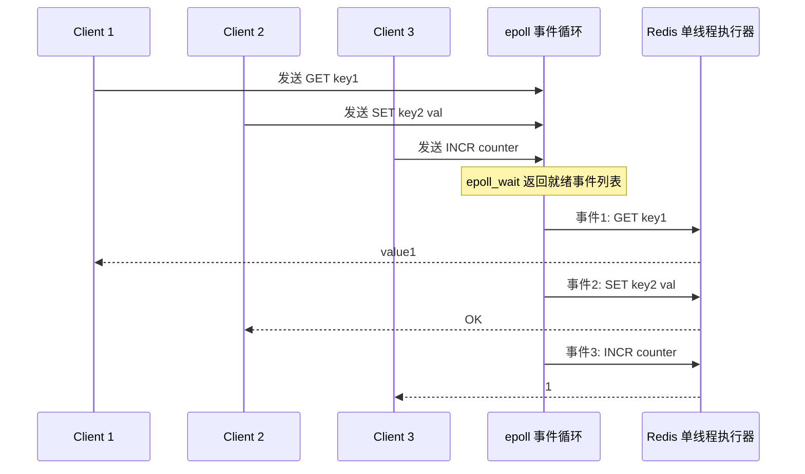
```mermaid
sequenceDiagram
    participant C1 as Client 1
    participant C2 as Client 2
    participant C3 as Client 3
    participant EP as epoll 事件循环
    participant RE as Redis 单线程执行器

    C1->>EP: 发送 GET key1
    C2->>EP: 发送 SET key2 val
    C3->>EP: 发送 INCR counter

    Note over EP: epoll_wait 返回就绪事件列表

    EP->>RE: 事件1: GET key1
    RE-->>C1: value1
    EP->>RE: 事件2: SET key2 val
    RE-->>C2: OK
    EP->>RE: 事件3: INCR counter
    RE-->>C3: 1
```

Redis 6.0 引入的多线程 I/O：

```c
// Redis 6.0 多线程 I/O 模型（简化）
// 主线程负责命令执行，I/O 线程负责读写
void handleClient(io_thread_t *io_threads) {
    while (true) {
        // I/O 线程：读取客户端请求 / 写入响应
        listNode *ln = listFirst(io_threads->pending);
        client *c = ln->value;
        if (io_threads->read) {
            readQueryFromClient(c);
        } else {
            writeToClient(c);
        }
    }
}
```

::: important Redis 6.0 多线程的本质
多线程仅用于 **I/O 读写**（readQueryFromClient / writeToClient），命令执行（processInputBuffer）仍然是单线程。这是为了保证命令执行的原子性和确定性。
:::

**深度追问**

- **追问 1**：为什么命令执行必须单线程？—— 保证原子性和操作顺序，多线程执行需要加锁，开销反而更大
- **追问 2**：如何开启 Redis 6.0 多线程？—— `io-threads 4` + `io-threads-do-reads yes`

**面试官考察点**：区分"I/O 多路复用"和"多线程 I/O"两个概念，理解 Redis 的性能模型。

---

### Q03：Redis vs Memcached 区别？

**标准答案**

| 维度 | Redis | Memcached |
|------|-------|-----------|
| 数据结构 | String/Hash/List/Set/ZSet/Stream/Bitmap... | 简单 KV |
| 持久化 | RDB + AOF | 无 |
| 线程模型 | 单线程（6.0 I/O 多线程） | 多线程 |
| 集群 | 原生 Cluster | 客户端分片 |
| 内存管理 | 自定义 zmalloc + 淘汰策略 | LRU 滑动窗口 |
| 事务 | MULTI/EXEC + Lua | CAS (add) |
| 发布订阅 | Pub/Sub + Stream | 无 |
| Lua 脚本 | 支持 | 不支持 |
| 单值上限 | 512MB | 1MB |

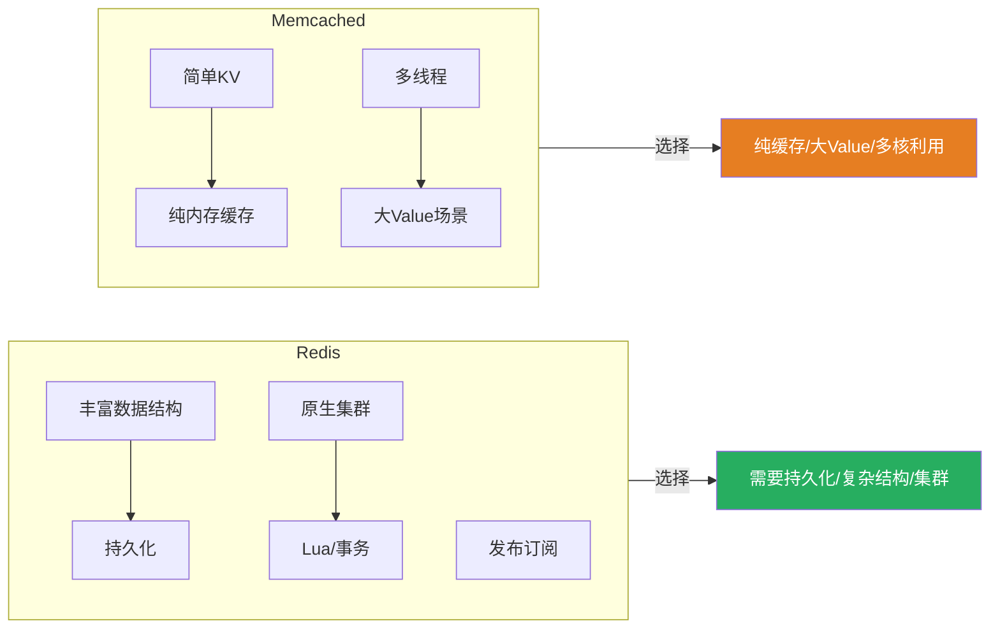
```mermaid
flowchart LR
    subgraph Redis
        R1[丰富数据结构] --> R2[持久化]
        R3[原生集群] --> R4[Lua/事务]
        R5[发布订阅]
    end
    subgraph Memcached
        M1[简单KV] --> M2[纯内存缓存]
        M3[多线程] --> M4[大Value场景]
    end

    Redis -->|选择| A[需要持久化/复杂结构/集群]
    Memcached -->|选择| B[纯缓存/大Value/多核利用]

    style A fill:#27ae60,color:#fff
    style B fill:#e67e22,color:#fff
```

::: tip 选型建议
- 需要持久化、复杂数据结构、发布订阅 → **Redis**
- 纯缓存场景、Value 较大（>100KB）、需要多核利用 → **Memcached**
- 现实中 Redis 已基本成为默认选择
:::

**深度追问**

- **追问 1**：Memcached 多线程为什么没有碾压 Redis？—— 缓存场景 CPU 不是瓶颈，Redis 单线程 + epoll 足够高效
- **追问 2**：两者在内存碎片方面有何差异？—— Memcached 使用 slab allocator 减少碎片；Redis 使用 jemalloc

**面试官考察点**：不仅罗列差异，更要说出**选型依据**和背后的**性能本质**。

---

### Q04：Redis 有哪些数据类型？

**标准答案**

Redis 提供 **5 种基础类型 + 6 种扩展类型**：

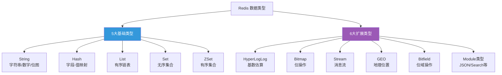
```mermaid
flowchart TB
    A[Redis 数据类型] --> B[5大基础类型]
    A --> C[6大扩展类型]

    B --> B1[String<br/>字符串/数字/位图]
    B --> B2[Hash<br/>字段-值映射]
    B --> B3[List<br/>有序链表]
    B --> B4[Set<br/>无序集合]
    B --> B5[ZSet<br/>有序集合]

    C --> C1[HyperLogLog<br/>基数估算]
    C --> C2[Bitmap<br/>位操作]
    C --> C3[Stream<br/>消息流]
    C --> C4[GEO<br/>地理位置]
    C --> C5[Bitfield<br/>位域操作]
    C --> C6[Module类型<br/>JSON/Search等]

    style B fill:#3498db,color:#fff
    style C fill:#9b59b6,color:#fff
```

| 类型 | 底层编码 | 典型场景 |
|------|---------|---------|
| String | int / embstr / raw | 缓存、计数器、分布式锁 |
| Hash | listpack / hashtable | 对象存储、配置 |
| List | listpack / quicklist | 消息队列、时间线 |
| Set | intset / hashtable | 标签、共同好友 |
| ZSet | listpack / skiplist + hashtable | 排行榜、延迟队列 |

**深度追问**

- **追问 1**：为什么 String 能存数字？—— 内部有 int 编码，数值操作直接在 ptr 上做算术
- **追问 2**：GEO 底层用什么类型？—— 本质是 ZSet，经纬度通过 GeoHash 编码为 score

**面试官考察点**：不仅背类型名称，更要说出**底层编码**和**典型场景**，展示深度理解。

---

### Q05：String 的内部编码有哪些？

**标准答案**

String 有三种内部编码，Redis 根据值的内容和长度自动选择：

| 编码 | 条件 | 内存布局 | 适用场景 |
|------|------|---------|---------|
| **int** | 值为整数且 ≤ long 范围 | ptr 直接存数值 | 计数器 |
| **embstr** | 字符串长度 ≤ 44 字节 | SDS + Object 一次分配 | 短字符串缓存 |
| **raw** | 字符串长度 > 44 字节 | SDS 和 Object 分开分配 | 长文本/JSON |

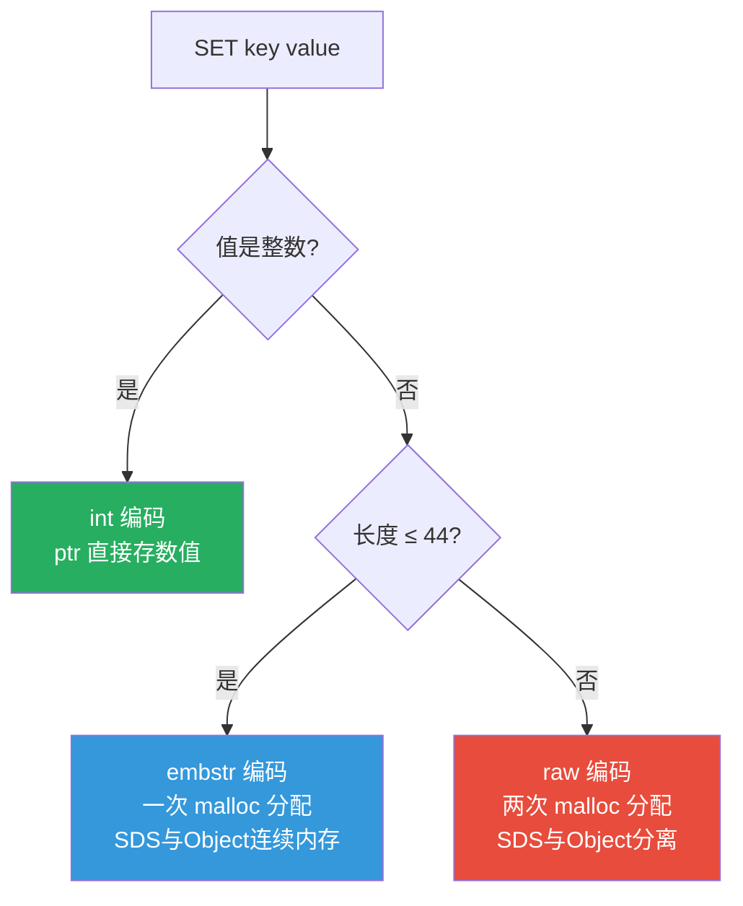
```mermaid
flowchart TB
    A[SET key value] --> B{值是整数?}
    B -->|是| C[int 编码<br/>ptr 直接存数值]
    B -->|否| D{长度 ≤ 44?}
    D -->|是| E[embstr 编码<br/>一次 malloc 分配<br/>SDS与Object连续内存]
    D -->|否| F[raw 编码<br/>两次 malloc 分配<br/>SDS与Object分离]

    style C fill:#27ae60,color:#fff
    style E fill:#3498db,color:#fff
    style F fill:#e74c3c,color:#fff
```

```
embstr 内存布局（一次分配）：
┌─────────────────────────────────────────┐
│ RedisObject (16B) │ SDS Header │ Data   │
└─────────────────────────────────────────┘

raw 内存布局（两次分配）：
┌──────────────┐      ┌────────────────────┐
│ RedisObject  │ ───→ │ SDS Header │ Data  │
└──────────────┘      └────────────────────┘
```

::: warning embstr 的限制
embstr 是只读的——一旦修改（如 APPEND），无论长度都会升级为 raw 编码。因为 embstr 的 SDS 和 Object 是连续内存，重新分配需要整体移动。
:::

**深度追问**

- **追问 1**：为什么阈值是 44 字节？—— RedisObject 16 字节 + SDS 头 3 字节 + '\0' 1 字节 = 20 字节，64 字节 jemalloc 最小分配单元减去 20 = 44
- **追问 2**：embstr 相比 raw 有什么优势？—— 一次分配减少内存碎片；连续内存对 CPU 缓存更友好

**面试官考察点**：理解 Redis 的**内存优化策略**，能否讲清 embstr/raw 的设计取舍。

---

### Q06：ZSet 的底层数据结构是什么？为什么用跳表不用红黑树？

**标准答案**

ZSet 底层使用 **跳表（skiplist）+ 哈希表** 的组合：

- **跳表**：支持范围查询（ZRANGEBYSCORE），O(logN)
- **哈希表**：支持按 member 查 score，O(1)

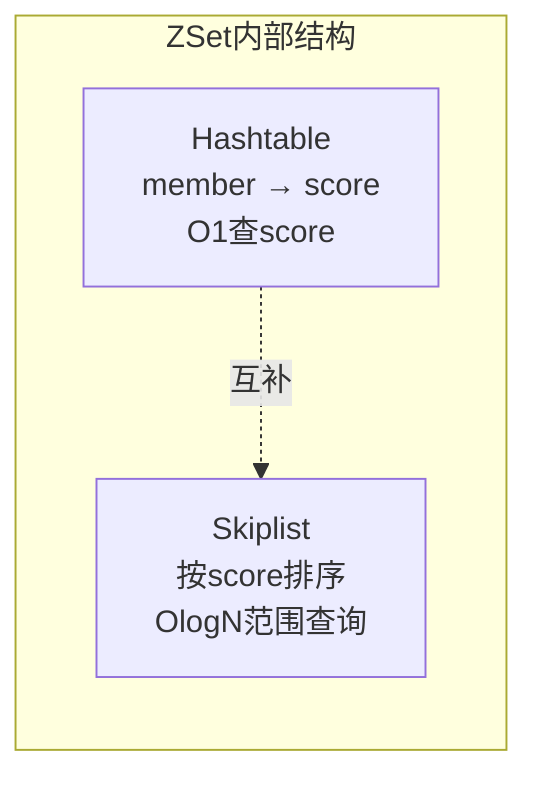
```mermaid
flowchart LR
    subgraph ZSet内部结构
        HT[Hashtable<br/>member → score<br/>O1查score]
        SL[Skiplist<br/>按score排序<br/>OlogN范围查询]
    end
    HT -.->|互补| SL
```

跳表结构示意：

```
Level 4:  1 ───────────────────────────────────────────── 21
Level 3:  1 ────────────────── 11 ─────────────────────── 21
Level 2:  1 ────── 5 ──────── 11 ──────── 17 ────────── 21
Level 1:  1 ── 3 ── 5 ── 7 ── 11 ── 13 ── 17 ── 19 ── 21
```

**为什么用跳表而不用红黑树？**

| 对比维度 | 跳表 | 红黑树 |
|---------|------|--------|
| 范围查询 | 顺着 Level 1 链表遍历即可 | 需要中序遍历，实现复杂 |
| 实现难度 | 简单，约 200 行代码 | 复杂，旋转/变色操作多 |
| 并发友好 | 局部更新，易于加锁 | 旋转影响多个节点 |
| 内存开销 | 每节点多级指针（~33% 额外） | 每节点 3 个指针（固定开销） |
| 插入/删除 | O(logN)，概率平衡 | O(logN)，强制平衡 |

::: important antirez 的原话
> "Skip lists are a probabilistic alternative to balanced trees... easier to implement, and with the added benefit that they allow for O(logN) range queries which would be quite hard to implement with a balanced tree."
> —— Salvatore Sanfilippo (antirez)
:::

**深度追问**

- **追问 1**：跳表的最大层数是多少？—— Redis 默认 32 层（`ZSKIPLIST_MAXLEVEL = 32`），概率 1/4 逐层递减
- **追问 2**：跳表节点层数如何确定？—— 随机生成，每层 1/4 概率继续，确保高层节点稀疏

**面试官考察点**：能否说清跳表 vs 红黑树的**取舍**，尤其是范围查询场景的天然优势。

---

### Q07：Hash 的内部编码及转换条件？

**标准答案**

Hash 有两种编码：

| 编码 | 条件 | 底层结构 | 时间复杂度 |
|------|------|---------|-----------|
| **listpack** | field 数 ≤ 128 且每个 value ≤ 64 字节 | 紧凑的顺序存储 | O(N) 遍历 |
| **hashtable** | 超过 listpack 阈值 | 哈希表（链地址法） | O(1) 平均 |

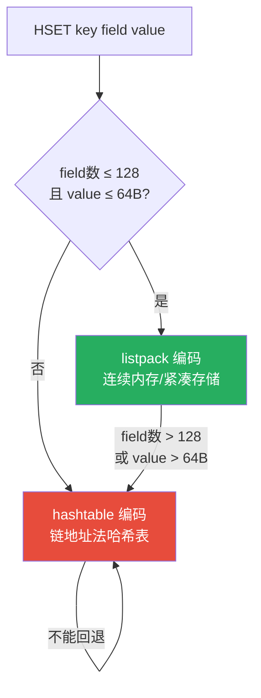
```mermaid
flowchart TB
    A[HSET key field value] --> B{field数 ≤ 128<br/>且 value ≤ 64B?}
    B -->|是| C[listpack 编码<br/>连续内存/紧凑存储]
    B -->|否| D[hashtable 编码<br/>链地址法哈希表]

    C -->|field数 > 128<br/>或 value > 64B| D
    D -->|不能回退| D

    style C fill:#27ae60,color:#fff
    style D fill:#e74c3c,color:#fff
```

listpack 内存布局：

```
┌──────┬───────┬───────┬───────┬───────┬─────┐
│ field1│ value1│ field2│ value2│  ...  │ end │
└──────┴───────┴───────┴───────┴───────┴─────┘
```

::: warning 编码转换不可逆
listpack → hashtable 是单向的，即使后续删除 field 使得数量回到阈值以下，**也不会回退**为 listpack。这是为了避免频繁转换的开销。
:::

**深度追问**

- **追问 1**：listpack 和之前的 ziplist 有什么区别？—— listpack 修改了结构，节点不再保存前一节点长度，解决了级联更新问题
- **追问 2**：阈值可以调整吗？—— 可以，`hash-max-listpack-entries` 和 `hash-max-listpack-value`

**面试官考察点**：理解 Redis 在**内存和性能之间的权衡**——listpack 省内存但遍历慢，hashtable 快但耗内存。

---

### Q08：List 的编码演进？

**标准答案**

List 的编码经历了从 ziplist → quicklist → listpack + quicklist 的演进：

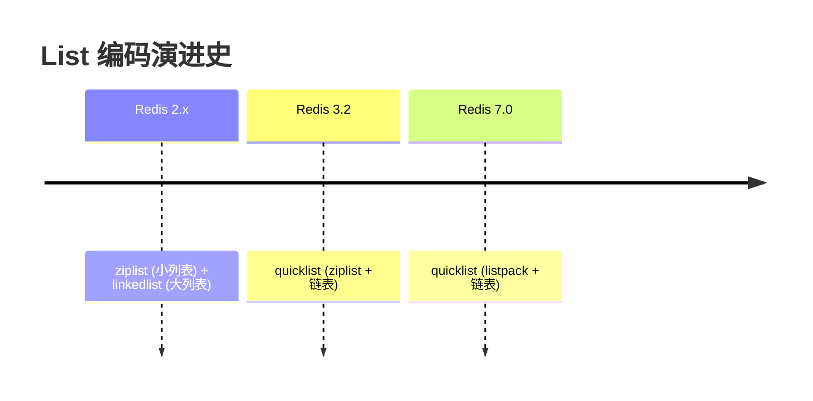
```mermaid
timeline
    title List 编码演进史
    Redis 2.x : ziplist (小列表) + linkedlist (大列表)
    Redis 3.2 : quicklist (ziplist + 链表)
    Redis 7.0 : quicklist (listpack + 链表)
```

| 版本 | 编码 | 特点 |
|------|------|------|
| Redis 2.x | ziplist / linkedlist | 小列表紧凑，大列表指针开销大 |
| Redis 3.2+ | quicklist | 双向链表 + 每节点 ziplist，兼顾内存和性能 |
| Redis 7.0+ | quicklist (listpack) | 用 listpack 替换 ziplist，消除级联更新 |

quicklist 结构：

```
quicklist
  │
  ├─ quicklistNode → ziplist/listpack [e1, e2, e3]
  │      ↑ prev           next ↓
  ├─ quicklistNode → ziplist/listpack [e4, e5]
  │      ↑ prev           next ↓
  └─ quicklistNode → ziplist/listpack [e6, e7, e8]
```

::: tip 为什么不直接用 linkedlist？
每个元素都是一个独立节点，需要 2 个指针（prev/next）+ RedisObject 头，一个元素至少占用 32 字节额外开销。quicklist 将多个元素打包进一个 ziplist/listpack 节点，大幅减少指针开销。
:::

**深度追问**

- **追问 1**：quicklist 的中间节点可以被压缩吗？—— 可以，`list-compress-depth` 控制两端不压缩的节点数，中间节点用 LZF 压缩
- **追问 2**：每个 ziplist/listpack 节点的大小如何控制？—— `list-max-listpack-size` 配置，默认 -2（8KB）

**面试官考察点**：理解 Redis 在**内存优化**上的持续迭代，以及 ziplist → listpack 演进的深层原因（级联更新）。

---

### Q09：Redis 为什么用 SDS 而不是 C 字符串？

**标准答案**

SDS（Simple Dynamic String）相比 C 字符串有五大优势：

| 维度 | C 字符串 | SDS |
|------|---------|-----|
| 获取长度 | O(N) 遍历 | O(1) 直接读 len |
| 缓冲区溢出 | 不安全（strcat 可能越界） | 安全（自动扩容） |
| 二进制安全 | 遇 '\0' 截断 | 以 len 判断结束 |
| 内存重分配 | 每次修改都 realloc | 空间预分配 + 惰性释放 |
| 兼容性 | - | 兼容 C 字符串 API |

SDS 结构定义：

```c
// Redis 5.0+ 的 SDS 结构（根据长度选择不同头部）
struct __attribute__((__packed__)) sdshdr8 {
    uint8_t len;        // 已用长度
    uint8_t alloc;      // 总分配长度（不含头部和'\0'）
    unsigned char flags; // 3位SDS类型 + 5位预留
    char buf[];         // 实际数据
};
```

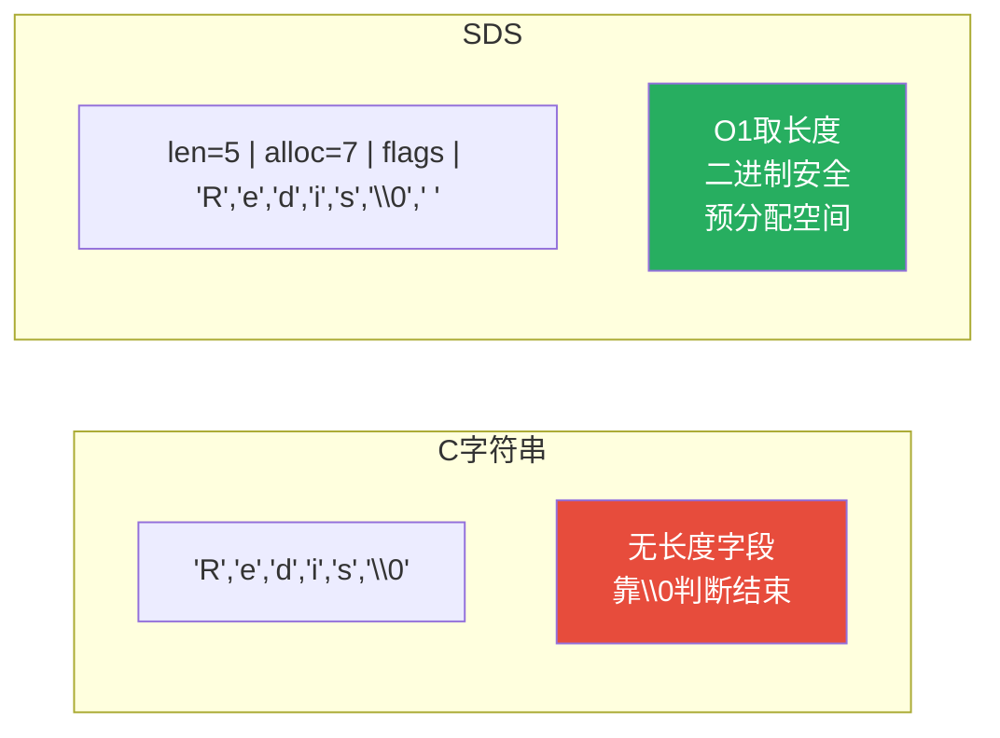
```mermaid
flowchart LR
    subgraph C字符串
        C1["'R','e','d','i','s','\\0'"]
        C2[无长度字段<br/>靠\\0判断结束]
    end
    subgraph SDS
        S1["len=5 | alloc=7 | flags | 'R','e','d','i','s','\\0',' '"]
        S2[O1取长度<br/>二进制安全<br/>预分配空间]
    end

    style C2 fill:#e74c3c,color:#fff
    style S2 fill:#27ae60,color:#fff
```

SDS 空间预分配策略：

- len < 1MB：分配 len × 2 的空间
- len ≥ 1MB：分配 len + 1MB 的空间

**深度追问**

- **追问 1**：SDS 有几种头部？—— 5 种：sdshdr5/8/16/32/64，根据字符串长度选择最小的头部
- **追问 2**：SDS 怎么兼容 C 字符串函数？—— buf 末尾始终有 '\0'，可以直接传给 strcat/printf 等 C 函数

**面试官考察点**：理解 Redis 底层对 C 标准库的**安全和性能改进**，尤其是二进制安全和 O(1) 长度。

---

### Q10：什么是渐进式 rehash？

**标准答案**

Redis 的哈希表扩容时，不是一次性把所有键迁移到新表，而是**分多次、渐进式**地完成，避免单次 rehash 导致长时间阻塞。

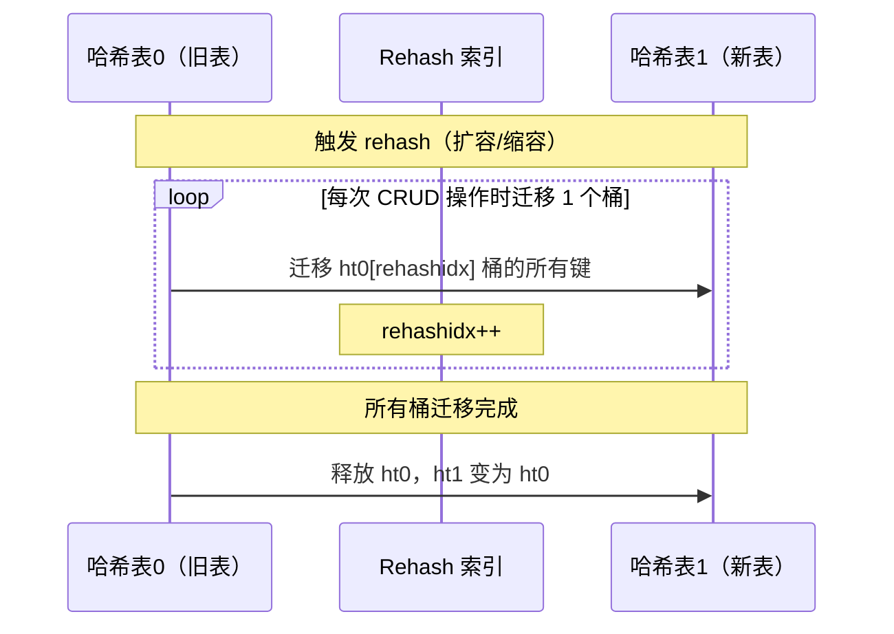
```mermaid
sequenceDiagram
    participant HT0 as 哈希表0（旧表）
    participant RE as Rehash 索引
    participant HT1 as 哈希表1（新表）

    Note over HT0,HT1: 触发 rehash（扩容/缩容）

    loop 每次 CRUD 操作时迁移 1 个桶
        HT0->>HT1: 迁移 ht0[rehashidx] 桶的所有键
        Note over RE: rehashidx++
    end

    Note over HT0,HT1: 所有桶迁移完成
    HT0->>HT1: 释放 ht0，ht1 变为 ht0
```

渐进式 rehash 期间的查找逻辑：

```c
// 伪代码：rehash 期间的查找
dictEntry *dictFind(dict *d, void *key) {
    // 先查 ht1（新表）
    entry = findInTable(d->ht[1], key);
    if (entry) return entry;
    // 再查 ht0（旧表）
    return findInTable(d->ht[0], key);
}
```

::: important rehash 期间的行为
- **查找**：先查 ht1，再查 ht0
- **新增**：只写入 ht1
- **删除/修改**：在对应的表中操作
- 每次增删改查操作附带迁移 1 个桶，加上定时器辅助迁移
:::

**深度追问**

- **追问 1**：什么时候触发 rehash？—— 负载因子 ≥ 1（无 BGSAVE）或 ≥ 5（有 BGSAVE）时扩容；< 0.1 时缩容
- **追问 2**：如果长时间没有操作，rehash 会卡住吗？—— 不会，Redis 有定时任务每 100ms 迁移 100 个桶

**面试官考察点**：理解 Redis 在**单线程模型**下如何避免阻塞操作，渐进式 rehash 是其核心设计思想。

---

### Q11：Redis 集群最大节点数为什么是 16384？

**标准答案**

Redis Cluster 使用 **16384 个槽位（slot）** 进行数据分片，每个节点负责一部分槽。16384 这个数字是权衡的结果：

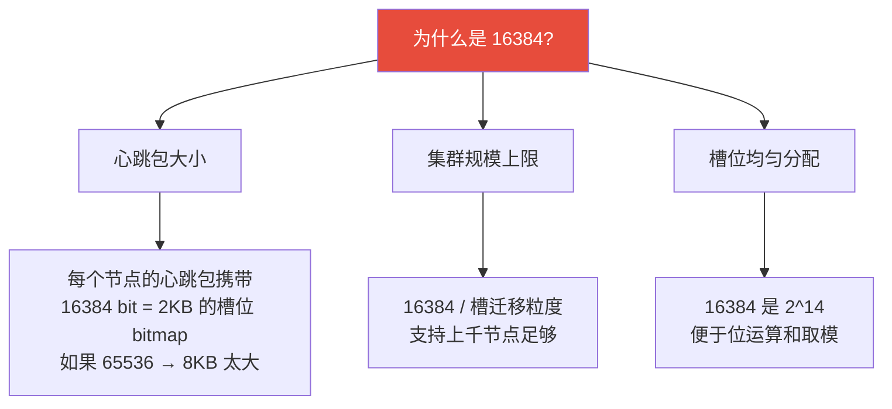
```mermaid
flowchart TB
    A[为什么是 16384?] --> B[心跳包大小]
    A --> C[集群规模上限]
    A --> D[槽位均匀分配]

    B --> B1["每个节点的心跳包携带<br/>16384 bit = 2KB 的槽位 bitmap<br/>如果 65536 → 8KB 太大"]
    C --> C1["16384 / 槽迁移粒度<br/>支持上千节点足够"]
    D --> D1["16384 是 2^14<br/>便于位运算和取模"]

    style A fill:#e74c3c,color:#fff
```

| 方案 | 心跳包 bitmap 大小 | 集群节点上限 | 备注 |
|------|-------------------|-------------|------|
| 2^12 = 4096 | 512B | ~数百 | 槽太少，迁移粒度粗 |
| 2^14 = 16384 | 2KB | ~1000+ | **当前方案** |
| 2^16 = 65536 | 8KB | ~数千 | 心跳包过大 |

::: tip antirez 的解释
> "16384 is a good compromise: the bitmap is small enough to be sent around in heartbeat packets, and 16384 slots give a reasonable granularity for rebalancing."
:::

**深度追问**

- **追问 1**：一个集群最多能有多少主节点？—— 理论上 16384（每节点 1 槽），实际建议 ≤ 1000
- **追问 2**：槽位如何分配给 key？—— `slot = CRC16(key) % 16384`

**面试官考察点**：理解**工程权衡**——不是纯理论最优，而是在实际场景下的综合考量。

---

### Q12：什么是 BigKey？如何发现和处理？

**标准答案**

BigKey 指的是**值过大**或**元素过多**的 key，会导致内存不均、阻塞、网络拥塞等问题。

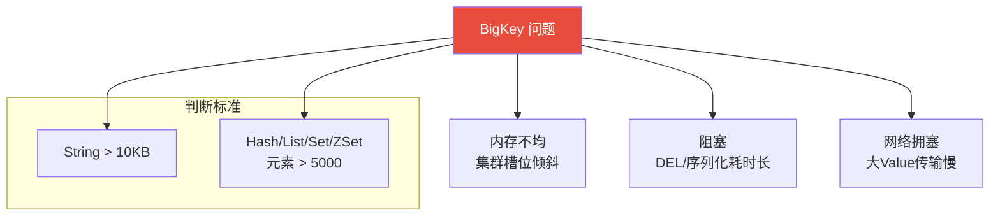
```mermaid
flowchart TB
    A[BigKey 问题] --> B[内存不均<br/>集群槽位倾斜]
    A --> C[阻塞<br/>DEL/序列化耗时长]
    A --> D[网络拥塞<br/>大Value传输慢]

    subgraph 判断标准
        E[String > 10KB]
        F[Hash/List/Set/ZSet<br/>元素 > 5000]
    end

    A --> E
    A --> F

    style A fill:#e74c3c,color:#fff
```

**发现方式**：

```bash
# 1. redis-cli --bigkeys 扫描
redis-cli --bigkeys -i 0.1

# 2. SCAN + DEBUG OBJECT 逐个检查
redis-cli SCAN 0 COUNT 100

# 3. RDB 分析工具
redis-rdb-tools / rdb-tools

# 4. memory usage 命令（Redis 4.0+）
MEMORY USAGE mykey
```

**处理方案**：

| 方案 | 操作 | 适用场景 |
|------|------|---------|
| 拆分 | 将大 Hash 拆为多个小 Hash | Hash 元素过多 |
| 压缩 | 存储前压缩（gzip/snappy） | 大 String |
| 删除 | UNLINK 异步删除 | DEL 阻塞 |
| 过期 | 设置合理 TTL | 避免长期积累 |

```bash
# UNLINK：异步删除，不阻塞主线程
UNLINK bigkey_hash

# 拆分大 Hash：按取模拆分
# 原始：user:all → {field1: val1, ..., field10000: val10000}
# 拆分：user:0 → {field1: val1, ..., field100: val100}
#       user:1 → {field101: val101, ..., field200: val200}
```

::: warning 危险操作
**绝不能对 BigKey 执行 DEL**——DEL 是同步操作，删除百万级元素的 Hash 可能阻塞数秒，导致集群故障。
:::

**深度追问**

- **追问 1**：UNLINK 和 DEL 的区别？—— UNLINK 先从 keyspace 移除引用，然后后台线程异步释放内存
- **追问 2**：如何预防 BigKey 产生？—— 上层设置 value 大小限制；监控报警；代码 review

**面试官考察点**：是否知道 BigKey 的**危害**和**安全删除方式**，这是生产环境高频问题。

---

### Q13：Redis 和数据库双写一致性问题？

**标准答案**

缓存与数据库的一致性是分布式系统中的经典难题，核心矛盾在于**两个存储无法原子更新**。

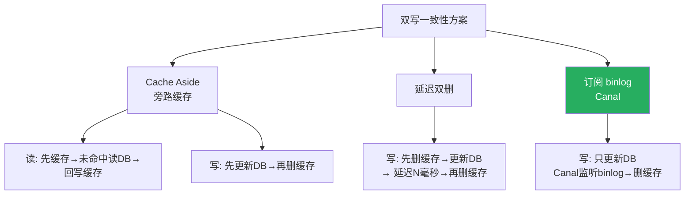
```mermaid
flowchart TB
    A[双写一致性方案] --> B[Cache Aside<br/>旁路缓存]
    A --> C[延迟双删]
    A --> D[订阅 binlog<br/>Canal]

    B --> B1[读: 先缓存→未命中读DB→回写缓存]
    B --> B2[写: 先更新DB→再删缓存]

    C --> C1[写: 先删缓存→更新DB<br/>→ 延迟N毫秒→再删缓存]

    D --> D1[写: 只更新DB<br/>Canal监听binlog→删缓存]

    style D fill:#27ae60,color:#fff
```

**方案对比**：

| 方案 | 一致性 | 复杂度 | 适用场景 |
|------|--------|--------|---------|
| Cache Aside（先更新DB再删缓存） | 最终一致 | 低 | 大多数场景 |
| 延迟双删 | 较强一致 | 中 | 读多写少 |
| Canal 订阅 binlog | 强一致感 | 高 | 金融/对一致性要求高 |

Cache Aside 的异常分析：

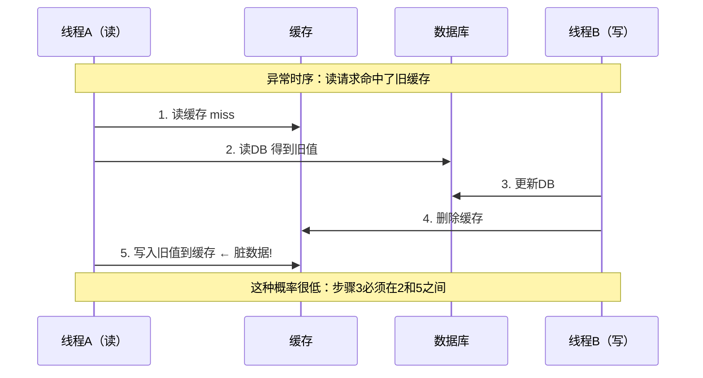
```mermaid
sequenceDiagram
    participant T1 as 线程A（读）
    participant Cache as 缓存
    participant DB as 数据库
    participant T2 as 线程B（写）

    Note over T1,T2: 异常时序：读请求命中了旧缓存

    T1->>Cache: 1. 读缓存 miss
    T1->>DB: 2. 读DB 得到旧值
    T2->>DB: 3. 更新DB
    T2->>Cache: 4. 删除缓存
    T1->>Cache: 5. 写入旧值到缓存 ← 脏数据!

    Note over T1,T2: 这种概率很低：步骤3必须在2和5之间
```

::: important 为什么是"删缓存"而非"更新缓存"？
1. **懒加载**：删除后下次读自然回填，避免写操作触发无用的缓存更新
2. **并发安全**：两个写操作并发更新缓存可能产生脏数据
3. **复杂度**：有些缓存值需要多表关联查询，更新计算成本高
:::

**深度追问**

- **追问 1**：如何保证"最终一致"的时间窗口尽量小？—— 删缓存失败时写入消息队列重试
- **追问 2**：强一致性怎么做？—— 分布式事务（2PC/TCC）或读写都走 DB + 缓存只做加速

**面试官考察点**：理解**分布式一致性的本质矛盾**，不追求强一致，而是选择合适的最终一致性方案。

---

### Q14：Redis 的过期删除策略？

**标准答案**

Redis 采用 **惰性删除 + 定期删除** 双重策略：

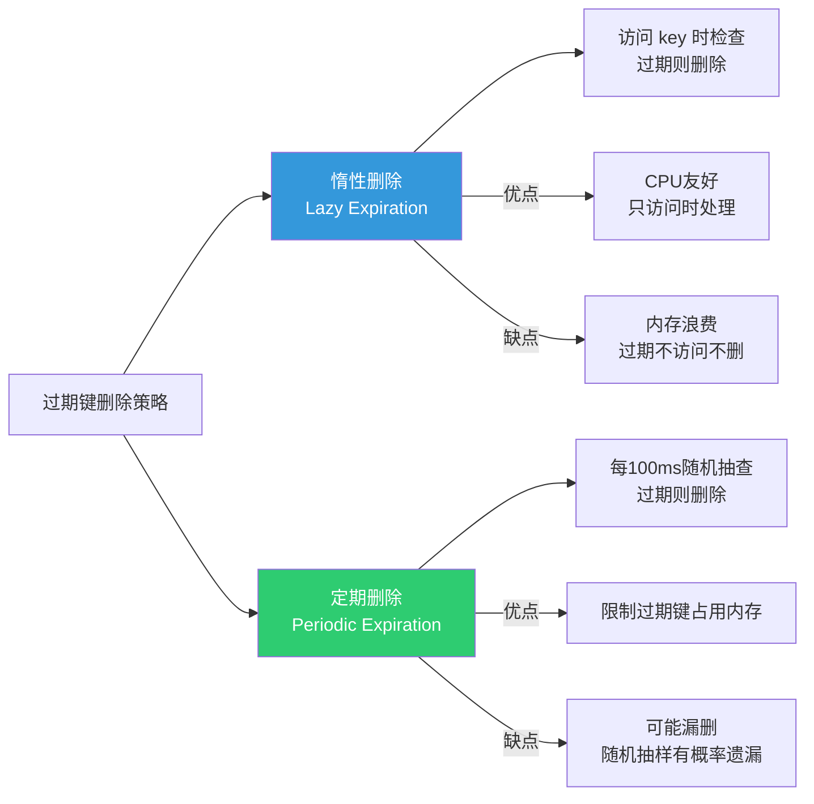
```mermaid
flowchart LR
    A[过期键删除策略] --> B[惰性删除<br/>Lazy Expiration]
    A --> C[定期删除<br/>Periodic Expiration]

    B --> B1[访问 key 时检查<br/>过期则删除]
    C --> C1[每100ms随机抽查<br/>过期则删除]

    B -->|优点| B2[CPU友好<br/>只访问时处理]
    B -->|缺点| B3[内存浪费<br/>过期不访问不删]
    C -->|优点| C2[限制过期键占用内存]
    C -->|缺点| C3[可能漏删<br/>随机抽样有概率遗漏]

    style B fill:#3498db,color:#fff
    style C fill:#2ecc71,color:#fff
```

定期删除的执行逻辑（伪代码）：

```c
void activeExpireCycle(int type) {
    for (each DB) {
        // 每次随机抽取 20 个设置了过期时间的 key
        for (i = 0; i < 20; i++) {
            key = randomSample(db->expires);
            if (isExpired(key)) deleteKey(key);
        }
        // 如果本次过期比例 > 25%，继续抽样
        if (expiredRatio > 25%) continue;
        else break; // 过期键不多，处理下一个 DB
    }
}
```

::: tip 两种策略互补
- 惰性删除保证**CPU 不浪费**在无人访问的过期键上
- 定期删除保证**内存不被**大量过期键长期占用
- 两者结合仍可能有漏网之鱼，这时就需要**内存淘汰策略**兜底
:::

**深度追问**

- **追问 1**：定期删除的 25% 阈值有什么意义？—— 自适应调节：过期键多时多花时间清理，少时快速结束
- **追问 2**：从节点如何处理过期键？—— 从节点被动等待主节点的 DEL 命令，自身不主动删除（避免数据不一致）

**面试官考察点**：理解 Redis 在**CPU 和内存之间的平衡**，以及为什么需要两种策略互补。

---

### Q15：Redis 的内存淘汰策略？

**标准答案**

当 Redis 内存使用达到 `maxmemory` 限制时，根据淘汰策略决定如何腾出空间：

| 策略 | 说明 | 适用场景 |
|------|------|---------|
| noeviction | 不淘汰，写入返回错误 | 数据不可丢失 |
| allkeys-lru | 所有 key 中淘汰最久未使用的 | 通用缓存 |
| allkeys-lfu | 所有 key 中淘汰使用频率最低的 | 热点明显的缓存 |
| allkeys-random | 所有 key 中随机淘汰 | 无访问热点 |
| volatile-lru | 过期 key 中淘汰最久未使用的 | 混合持久/临时数据 |
| volatile-lfu | 过期 key 中淘汰频率最低的 | 混合场景 |
| volatile-random | 过期 key 中随机淘汰 | 混合场景 |
| volatile-ttl | 过期 key 中淘汰 TTL 最短的 | 有明确过期需求 |

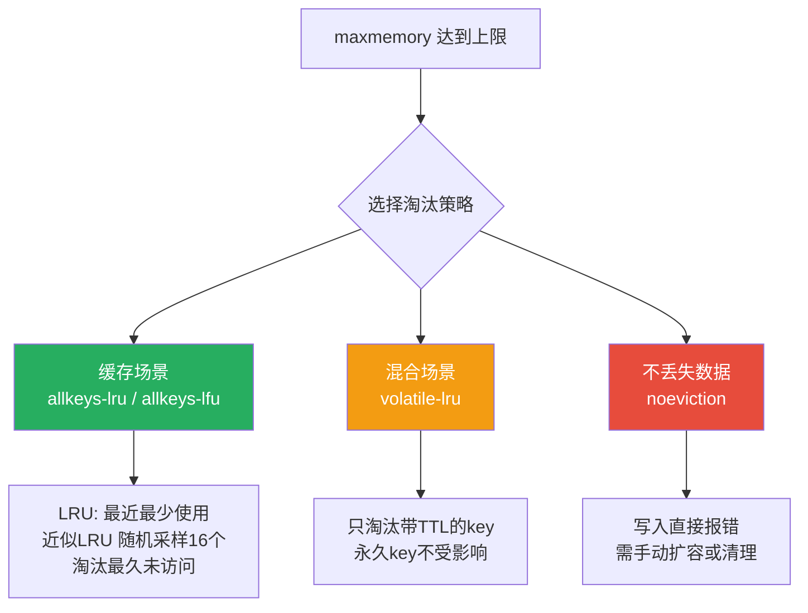
```mermaid
flowchart TB
    A[maxmemory 达到上限] --> B{选择淘汰策略}

    B --> C[缓存场景<br/>allkeys-lru / allkeys-lfu]
    B --> D[混合场景<br/>volatile-lru]
    B --> E[不丢失数据<br/>noeviction]

    C --> C1[LRU: 最近最少使用<br/>近似LRU 随机采样16个<br/>淘汰最久未访问]
    D --> D1[只淘汰带TTL的key<br/>永久key不受影响]
    E --> E1[写入直接报错<br/>需手动扩容或清理]

    style C fill:#27ae60,color:#fff
    style D fill:#f39c12,color:#fff
    style E fill:#e74c3c,color:#fff
```

Redis 的近似 LRU 实现：

```c
// Redis 近似 LRU：随机采样 N 个 key，淘汰最久未访问的
// 默认 N = 5，可通过 maxmemory-samples 调整
void evictionPoolPopulate(dict *sampledict, pool *pool) {
    for (i = 0; i < maxmemory_samples; i++) {
        key = dictGetRandomKey(sampledict);
        idle = estimateObjectIdleTime(key);
        // 插入淘汰候选池（按 idle 时间排序）
        poolInsert(pool, key, idle);
    }
    // 淘汰池中 idle 最大的 key
}
```

::: important 近似 LRU vs 精确 LRU
Redis 的 LRU 是**近似算法**——随机采样 5~10 个 key，淘汰其中最久未用的。采样数越多越接近精确 LRU，但 CPU 开销也越大。`maxmemory-samples 10` 已接近精确 LRU 效果。
:::

**深度追问**

- **追问 1**：LRU 和 LFU 怎么选？—— 访问模式均匀用 LRU；有明显热点用 LFU。LFU 通过计数器统计频率，更适合区分冷热
- **追问 2**：LFU 的计数器如何衰减？—— 每个 key 的计数器会按 `lfu-decay-time`（默认 1 分钟）周期性减半，避免历史热点永不淘汰

**面试官考察点**：理解不同淘汰策略的**适用场景**，以及 Redis 近似算法的**实现权衡**。

---

## 二、原理篇（15 题）

### Q16：RDB 和 AOF 区别？

**标准答案**

| 维度 | RDB | AOF |
|------|-----|-----|
| 持久化方式 | 二进制快照 | 写命令日志 |
| 触发方式 | SAVE/BGSAVE/自动 | always/everysec/no |
| 文件体积 | 小（二进制压缩） | 大（文本命令） |
| 恢复速度 | 快（直接加载） | 慢（重放命令） |
| 数据安全 | 可能丢失两次快照间数据 | 最多丢 1 秒数据 |
| 适用场景 | 冷备份/灾难恢复 | 数据安全优先 |


```mermaid
flowchart TB
    subgraph RDB
        R1[BGSAVE fork 子进程]
        R1 --> R2[子进程写二进制快照]
        R2 --> R3[压缩紧凑<br/>恢复快]
        R3 --> R4[可能丢失数分钟数据]
    end

    subgraph AOF
        A1[每个写命令追加]
        A1 --> A2[AOF 缓冲区]
        A2 --> A3[fsync 到磁盘]
        A3 --> A4[最多丢1秒数据<br/>文件大/恢复慢]
    end

    style RDB fill:#3498db,color:#fff
    style AOF fill:#e74c3c,color:#fff
```

BGSAVE 的 fork 原理：

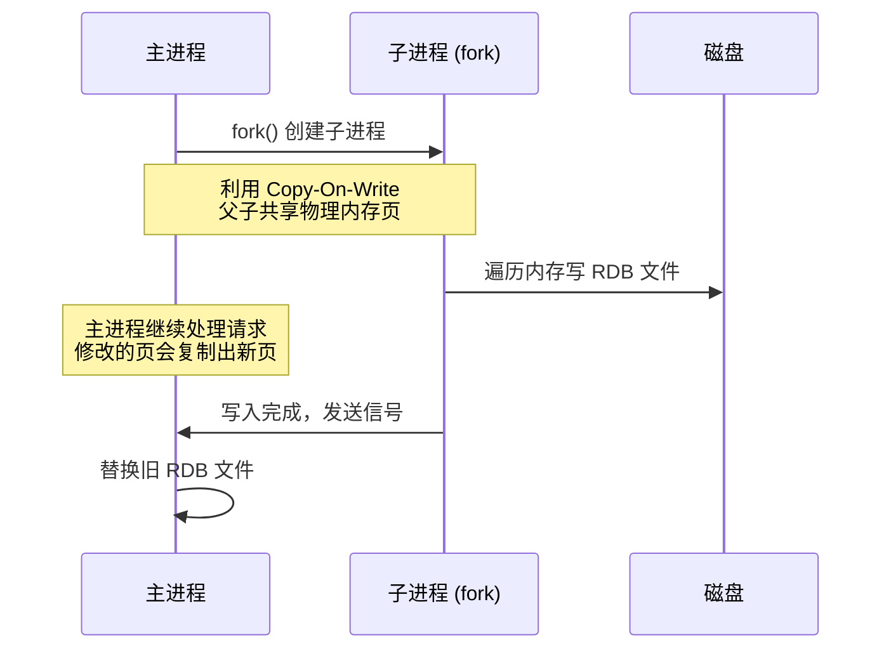
```mermaid
sequenceDiagram
    participant Main as 主进程
    participant Child as 子进程 (fork)
    participant Disk as 磁盘

    Main->>Child: fork() 创建子进程
    Note over Main,Child: 利用 Copy-On-Write<br/>父子共享物理内存页
    Child->>Disk: 遍历内存写 RDB 文件
    Note over Main: 主进程继续处理请求<br/>修改的页会复制出新页
    Child->>Main: 写入完成，发送信号
    Main->>Main: 替换旧 RDB 文件
```

::: tip 生产建议
- RDB 适合**定时备份**（每小时/每天），文件小、恢复快
- AOF 适合**数据安全**（everysec），最多丢 1 秒
- 最佳方案：**混合持久化**（RDB + AOF），见 Q18
:::

**深度追问**

- **追问 1**：BGSAVE 期间写入的数据会进入 RDB 吗？—— 不会，fork 瞬间的内存快照是固定的，之后的修改通过 COW 不影响子进程
- **追问 2**：RDB 文件格式是什么？—— Redis 特有二进制格式（REDIS + 版本 + 数据区 + CRC64 校验）

**面试官考察点**：理解两种持久化的**原理差异**和**适用场景**，以及 fork COW 机制。

---

### Q17：AOF 重写原理？

**标准答案**

AOF 重写是**压缩 AOF 文件**的机制——不是读取旧 AOF 文件压缩，而是**直接读取当前数据库状态**生成最短的写命令序列。

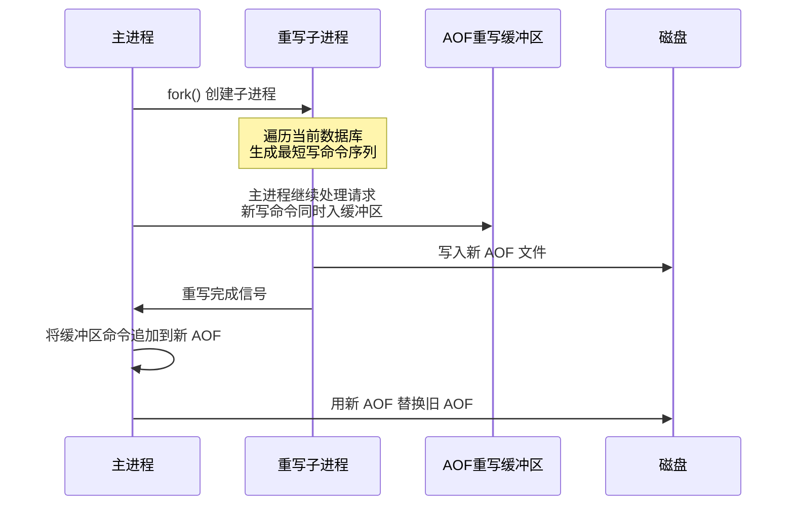
```mermaid
sequenceDiagram
    participant Main as 主进程
    participant Child as 重写子进程
    participant Buffer as AOF重写缓冲区
    participant Disk as 磁盘

    Main->>Child: fork() 创建子进程
    Note over Child: 遍历当前数据库<br/>生成最短写命令序列

    Main->>Buffer: 主进程继续处理请求<br/>新写命令同时入缓冲区

    Child->>Disk: 写入新 AOF 文件
    Child->>Main: 重写完成信号

    Main->>Main: 将缓冲区命令追加到新 AOF
    Main->>Disk: 用新 AOF 替换旧 AOF
```

重写前后对比：

```
# 重写前 AOF（6 条命令）
SET counter 1
INCR counter
INCR counter
INCR counter
DEL temp_key
HSET user:1 name "Tom"
HSET user:1 age 25
HSET user:1 name "Jerry"  # 覆盖了前面的 name

# 重写后 AOF（2 条命令）
SET counter 3
HSET user:1 name "Jerry" age 25
```

::: warning AOF 重写缓冲区的作用
fork 之后主进程继续接收写命令，这些**增量命令**必须被保存，否则重写期间的新数据会丢失。AOF 重写缓冲区就是为了解决这一问题。
:::

**深度追问**

- **追问 1**：AOF 重写触发条件？—— `auto-aof-rewrite-percentage 100`（体积翻倍）和 `auto-aof-rewrite-min-size 64mb`
- **追问 2**：重写期间主进程崩溃怎么办？—— 新 AOF 文件不完整会被丢弃，旧 AOF 文件仍完好

**面试官考察点**：理解 AOF 重写是**基于当前数据状态**而非分析旧日志，以及重写缓冲区保证数据不丢失。

---

### Q18：混合持久化是什么？

**标准答案**

混合持久化是 Redis 4.0 引入的方案，**结合 RDB 的紧凑和 AOF 的安全**：

- AOF 重写时，前半段写 RDB 格式（紧凑），后半段写 AOF 增量命令
- 恢复时先加载 RDB 部分（快），再重放 AOF 部分（少）

```mermaid
flowchart TB
    subgraph 纯AOF重写
        A1[全部为AOF命令<br/>文件大/恢复慢]
    end
    subgraph 混合持久化
        B1[RDB格式数据<br/>紧凑/加载快] --> B2[AOF增量命令<br/>重放少/安全]
    end

    style B1 fill:#3498db,color:#fff
    style B2 fill:#2ecc71,color:#fff
```

混合持久化 AOF 文件结构：

```
┌──────────────────────────┬─────────────────────────┐
│  RDB 格式（前半段）       │  AOF 格式（后半段）       │
│  REDIS0009...             │  SET key val             │
│  [二进制快照数据]          │  INCR counter            │
│  ...                      │  ...                     │
└──────────────────────────┴─────────────────────────┘
   ↑ 快速加载                   ↑ 重放增量命令
```

配置方式：

```bash
# 开启混合持久化
aof-use-rdb-preamble yes

# AOF 重写时自动生成混合格式
```

::: tip 混合持久化的优势
- 文件体积：接近纯 RDB（比纯 AOF 小 50%+）
- 恢复速度：比纯 AOF 快 2~4 倍
- 数据安全：和 AOF 一样最多丢 1 秒
:::

**深度追问**

- **追问 1**：如何判断 AOF 文件是否是混合格式？—— 文件开头是否有 RDB 魔数（REDIS）
- **追问 2**：可以只用 RDB 不用 AOF 吗？—— 可以，但可能丢失更多数据；混合持久化是推荐方案

**面试官考察点**：理解混合持久化是**取长补短**的设计，以及其在生产环境中的实际价值。

---

### Q19：主从复制全量/增量同步流程？

**标准答案**

Redis 主从复制支持**全量同步**和**增量同步**两种模式：

```mermaid
sequenceDiagram
    participant Slave as 从节点
    participant Master as 主节点

    Note over Slave,Master: 首次复制 / offset 不在缓冲区 → 全量同步

    Slave->>Master: PSYNC ? -1（首次）
    Master->>Slave: +FULLRESYNC runid offset

    Master->>Master: BGSAVE 生成 RDB
    Master->>Slave: 发送 RDB 文件
    Master->>Slave: 发送积压缓冲区增量命令
    Slave->>Slave: 清空旧数据 + 加载 RDB + 重放增量

    Note over Slave,Master: 断线重连 / offset 在缓冲区 → 增量同步

    Slave->>Master: PSYNC runid offset
    Master->>Master: 检查 offset 是否在 repl_backlog 中
    Master->>Slave: +CONTINUE（增量同步）
    Master->>Slave: 发送 offset 之后的增量数据
```

关键概念：

| 概念 | 说明 |
|------|------|
| **runid** | 主节点唯一标识，用于判断是否同一主节点 |
| **offset** | 复制偏移量，记录双方同步进度 |
| **repl_backlog** | 环形缓冲区（默认 1MB），存储最近的写命令 |

::: important repl_backlog 大小的影响
如果从节点断线时间过长，offset 已被环形缓冲区覆盖，则必须全量同步。增大 `repl-backlog-size` 可减少全量同步概率。
:::

**深度追问**

- **追问 1**：repl_backlog 大小如何设置？—— 建议设置为：`断线时间 × 主节点写入速率 × 2`
- **追问 2**：主从复制是异步还是同步的？—— 默认异步，主节点写入后立即返回，不等从节点确认

**面试官考察点**：理解全量/增量同步的**触发条件**和**数据流**，以及 repl_backlog 的关键作用。

---

### Q20：哨兵模式如何实现故障转移？

**标准答案**

Redis Sentinel 通过**监控、通知、自动故障转移**三个功能实现高可用：

```mermaid
sequenceDiagram
    participant S1 as Sentinel 1
    participant S2 as Sentinel 2
    participant S3 as Sentinel 3
    participant Master as 主节点
    participant Slave as 从节点

    Note over S1,S3: 1. 监控阶段：定期 PING

    S1->>Master: PING（每秒）
    Master--xS1: 无响应（超过 down-after-milliseconds）

    Note over S1,S3: 2. 主观下线（SDOWN）

    S1->>S2: SENTINEL is-master-down-by-addr
    S1->>S3: SENTINEL is-master-down-by-addr
    S2->>S1: 确认下线
    S3->>S1: 确认下线

    Note over S1,S3: 3. 客观下线（ODOWN）<br/>超过 quorum 个 Sentinel 确认

    Note over S1: 4. Sentinel 领导者选举<br/>（Raft 协议）

    Note over S1: 5. 故障转移
    S1->>Slave: SLAVEOF NO ONE（提升为新主）
    S1->>Slave: 通知其他从节点复制新主
    S1->>S1: 更新 Sentinel 配置
```

故障转移四步骤：

1. **选出新主节点**：优先级 → 复制偏移量最大 → runid 最小
2. **执行晋升**：`SLAVEOF NO ONE`
3. **修改其他从节点**：指向新主节点
4. **持续监控**：继续监控旧主，如果恢复则设为新主的从节点

::: important 选举新主节点的依据
- **优先级**（replica-priority）：管理员手动设置，数值越小优先级越高
- **复制偏移量**：数据最完整的从节点优先
- **runid**：前两者相同时，选 runid 字典序最小的
:::

**深度追问**

- **追问 1**：Sentinel 之间如何通信？—— 通过主从节点的 Pub/Sub 频道 `__sentinel__:hello` 交换信息
- **追问 2**：客户端如何发现新主节点？—— 客户端订阅 `+switch-master` 频道，或主动请求 Sentinel

**面试官考察点**：理解故障转移的**完整流程**，包括 SDOWN → ODOWN → 选举 → 转移的时序。

---

### Q21：Redis Cluster 的槽迁移流程？

**标准答案**

Redis Cluster 通过**槽迁移**实现数据在节点间的移动，是集群扩缩容的核心操作：

```mermaid
sequenceDiagram
    participant Source as 源节点
    participant Target as 目标节点
    participant Client as 客户端

    Note over Source,Target: 1. 标记目标节点导入
    Target->>Target: CLUSTER SETSLOT {slot} IMPORTING source_node_id

    Note over Source,Target: 2. 标记源节点迁出
    Source->>Source: CLUSTER SETSLOT {slot} MIGRATING target_node_id

    Note over Source,Target: 3. 逐个迁移 key
    Source->>Target: MIGRATE host port key db timeout

    Note over Client: 4. 迁移期间的访问
    Client->>Source: GET key（slot 迁移中）
    Source-->>Client: ASK target_node_id
    Client->>Target: ASKING + GET key
    Target-->>Client: value

    Note over Source,Target: 5. 迁移完成，更新槽归属
    Source->>Source: CLUSTER SETSLOT {slot} NODE target_node_id
    Target->>Target: CLUSTER SETSLOT {slot} NODE target_node_id
```

::: warning ASK vs MOVED
- **MOVED**：槽已确定归属新节点，客户端应永久更新路由表
- **ASK**：槽正在迁移中，仅本次重定向，不更新路由表
:::

**深度追问**

- **追问 1**：迁移过程中如何保证数据不丢失？—— MIGRATE 命令是原子的：在源节点删除和在目标节点创建是同步完成的
- **追问 2**：大批量迁移如何优化？—— 使用 `--cluster-reshard` 工具，自动批量迁移 key

**面试官考察点**：理解槽迁移的**原子性保证**和**迁移期间的路由重定向机制**。

---

### Q22：什么是复制风暴？

**标准答案**

复制风暴是指**多个从节点同时发起全量同步**，导致主节点 CPU/内存/网络负载飙升的现象。

```mermaid
flowchart TB
    A[复制风暴场景] --> B[主节点重启<br/>runid 变化]
    A --> C[网络抖动<br/>多从断线重连]
    A --> D[repl_backlog 不足<br/>所有从节点需全量同步]

    B --> E[所有从节点同时 BGSAVE<br/>主节点 fork N 次]
    C --> E
    D --> E

    E --> F[主节点 CPU 飙升<br/>内存压力剧增<br/>网络带宽打满]

    style F fill:#e74c3c,color:#fff
```

**解决方案**：

| 方案 | 说明 |
|------|------|
| 树状复制 | 从节点之间级联复制，减少主节点压力 |
| 错峰重启 | 依次重启从节点，避免同时全量同步 |
| 增大 repl_backlog | 减少全量同步的概率 |
| 监控告警 | 监控主节点 fork 频率和网络流量 |

树状复制示意：

```
        Master
       /      \
    Slave1   Slave2
     /    \
  Slave3  Slave4
```

**深度追问**

- **追问 1**：树状复制有什么缺点？—— 中间从节点故障会导致下游从节点全部全量同步
- **追问 2**：如何监控复制风暴？—— 监控 `rdb_last_bgsave_status` 和 `instantaneous_input_kbps`

**面试官考察点**：对 Redis 运维场景的**理解深度**，能否识别和防范复制风暴。

---

### Q23：什么是脑裂？如何解决？

**标准答案**

脑裂（Split Brain）是指哨兵模式下，主节点因网络分区被误判下线，新主节点已选出，但旧主节点仍在接受写入，导致**数据双写冲突**。

```mermaid
sequenceDiagram
    participant Client as 客户端
    participant Old as 旧主节点
    participant Sentinel as 哨兵集群
    participant New as 新主节点

    Note over Old,Sentinel: 网络分区

    Client->>Old: 写入请求（旧主仍在服务）
    Old->>Old: 接受写入 ← 数据不一致!

    Sentinel->>Sentinel: 判定旧主下线（SDOWN→ODOWN）
    Sentinel->>New: 提升新主节点

    Note over Old,New: 网络恢复

    Old->>Old: 被降级为从节点
    Old->>New: 全量同步旧主数据被覆盖!
```

**解决方案**：

```bash
# min-replicas-to-write 3
# min-replicas-max-lag 10
# 如果从节点数量 < 3 或延迟 > 10秒，主节点拒绝写入
min-replicas-to-write 3
min-replicas-max-lag 10
```

::: important 防脑裂的核心思路
让主节点在**可能被误判下线**的场景下主动拒绝写入——如果从节点都连不上主节点，说明网络可能分区，此时主节点停止服务是更安全的策略。
:::

**深度追问**

- **追问 1**：`min-replicas-to-write` 设为 1 可以吗？—— 不够安全，至少 2（半数以上从节点可达才能写）
- **追问 2**：脑裂恢复后数据怎么处理？—— 旧主降为从节点后会全量同步新主，脑裂期间的写入会丢失

**面试官考察点**：理解脑裂的**发生场景**和**防范配置**，以及数据丢失的应对。

---

### Q24：Redis 事务支持回滚吗？

**标准答案**

Redis 事务**不支持回滚**。这是有意为之的设计决策。

```mermaid
flowchart TB
    A[MULTI] --> B[命令入队]
    B --> C[命令入队]
    C --> D[EXEC]

    D --> E{执行结果}
    E --> F[语法错误<br/>所有命令不执行]
    E --> G[运行时错误<br/>错误命令跳过<br/>其他命令继续执行]

    style F fill:#e74c3c,color:#fff
    style G fill:#f39c12,color:#fff
```

```bash
# 语法错误：整个事务被拒绝
MULTI
SET key1 value1
INCR key1 key2   # 语法错误
EXEC
# → (error) EXECABORT Transaction discarded because of errors.

# 运行时错误：只有出错命令失败
MULTI
SET key1 "hello"
INCR key1        # 对字符串 INCR，类型错误
SET key2 "world"
EXEC
# → 1) OK
#   2) (error) ERR value is not an integer
#   3) OK    ← key2 仍然设置成功
```

::: warning 为什么不支持回滚？
antirez 的理由：
1. Redis 命令错误通常都是**编程错误**（语法/类型），不应出现在生产环境
2. 支持回滚需要额外的 undo log，增加复杂度和内存开销
3. 保持 Redis **简单快速** 的设计哲学
:::

**深度追问**

- **追问 1**：如何实现类似回滚的效果？—— 使用 Lua 脚本，出错时可以选择不执行后续命令
- **追问 2**：DISCARD 命令的作用？—— 取消事务，清空命令队列（EXEC 之前调用）

**面试官考察点**：理解 Redis 事务的**设计取舍**——牺牲回滚能力换取简单和性能。

---

### Q25：WATCH 的原理？

**标准答案**

WATCH 是 Redis 的**乐观锁**机制，基于 CAS（Compare-And-Swap）思想：

```mermaid
sequenceDiagram
    participant C1 as 客户端1
    participant C2 as 客户端2
    participant R as Redis

    C1->>R: WATCH account:A
    Note over R: 记录 account:A 的版本

    C1->>R: MULTI
    C1->>R: DECRBY account:A 100

    Note over C2: 另一个客户端修改了被 WATCH 的 key
    C2->>R: SET account:A 500
    Note over R: account:A 版本变化

    C1->>R: EXEC
    R-->>C1: (nil) ← 事务被取消!
    Note over R: 检测到 account:A 被修改<br/>拒绝执行事务
```

WATCH 的实现原理：

```c
// 伪代码：WATCH 的核心逻辑
typedef struct watchedKey {
    robj *key;       // 被监视的 key
    client *client;  // 监视该 key 的客户端
} watchedKey;

// EXEC 时的检查
void execCommand(client *c) {
    // 检查所有被 WATCH 的 key 是否被修改
    for (watchedKey *wk : c->watched_keys) {
        if (wk->key->version != wk->version_at_watch) {
            // 版本不匹配，取消事务
            discardTransaction(c);
            addReply(c, shared.nullbulk);
            return;
        }
    }
    // 版本都匹配，执行事务
    executeTransaction(c);
}
```

::: tip WATCH 的使用模式
WATCH + MULTI + EXEC 是经典的**乐观锁**模式：先观察、再提交、冲突则重试。适用于高并发但冲突概率低的场景。
:::

**深度追问**

- **追问 1**：WATCH 在 EXEC 后自动取消吗？—— 是的，无论 EXEC 成功还是失败，WATCH 都会自动 UNWATCH
- **追问 2**：WATCH 能否监视多个 key？—— 可以，任意一个被监视的 key 变化都会导致事务失败

**面试官考察点**：理解乐观锁的**适用场景**和**WATCH-MULTI-EXEC 模式**。

---

### Q26：Lua 脚本为什么是原子的？

**标准答案**

Redis 执行 Lua 脚本时，**整个脚本作为一个整体在单线程中执行**，不会被其他命令打断：

```mermaid
flowchart TB
    A[Lua 脚本执行] --> B[脚本开始]
    B --> C[Redis 命令1]
    C --> D[Redis 命令2]
    D --> E[Redis 命令3]
    E --> F[脚本结束]

    G[其他客户端命令] -.->|排队等待| H[脚本结束后执行]

    style A fill:#27ae60,color:#fff
    style G fill:#e74c3c,color:#fff
```

```bash
# 示例：原子性地检查并设置（分布式锁）
if redis.call("GET", KEYS[1]) == ARGV[1] then
    return redis.call("DEL", KEYS[1])
else
    return 0
end
```

::: warning Lua 脚本的限制
1. **不能有死循环**——Redis 提供了 `lua-time-limit`（默认 5 秒），超时后其他客户端可以执行 `SCRIPT KILL`
2. **不能有阻塞操作**——不能调用外部命令或进行 I/O
3. **慎写长脚本**——长时间占用主线程会阻塞所有客户端
:::

**深度追问**

- **追问 1**：EVAL 和 EVALSHA 有什么区别？—— EVAL 每次发送完整脚本；EVALSHA 只发送脚本 SHA1 校验和，节省带宽
- **追问 2**：Lua 脚本中如何处理错误？—— `redis.pcall` 返回错误对象不中断；`redis.call` 遇错直接抛出

**面试官考察点**：理解 Redis 单线程模型下 Lua 的**原子性保证**，以及脚本的**使用限制**。

---

### Q27：Stream 与 Pub/Sub 区别？

**标准答案**

| 维度 | Pub/Sub | Stream |
|------|---------|--------|
| 消息持久化 | 不持久，发完即忘 | 持久化到内存（可 AOF） |
| 离线消息 | 不支持 | 消费者组维护 offset |
| 消费模式 | 广播（所有订阅者都收到） | 消费者组（竞争消费） |
| 消息确认 | 无 | ACK 机制 |
| 消息堆积 | 无 | 有（需监控长度） |
| 历史消息 | 无法回溯 | 可按 ID/时间范围查询 |

```mermaid
flowchart TB
    subgraph PubSub
        P1[PUBLISH channel msg]
        P1 --> P2[Sub1 收到]
        P1 --> P3[Sub2 收到]
        P1 --> P4[Sub3 离线 → 丢失!]
    end

    subgraph Stream
        S1[XADD stream * field value]
        S1 --> S2[Consumer Group1<br/>CG1-C1 消费 msg1]
        S1 --> S3[Consumer Group2<br/>CG2-C1 消费 msg1]
        S1 --> S4[离线消费者<br/>重连后从 last_id 继续]
    end

    style P4 fill:#e74c3c,color:#fff
    style S4 fill:#27ae60,color:#fff
```

::: tip 选型建议
- 实时通知、广播场景 → **Pub/Sub**
- 消息队列、需要持久化和确认 → **Stream**
- 生产级消息队列 → 建议使用专业 MQ（Kafka/RabbitMQ），Stream 适合轻量场景
:::

**深度追问**

- **追问 1**：Stream 的消费者组如何保证消息不丢失？—— 每个 consumer group 维护 last_delivered_id，未 ACK 的消息可以 XPENDING + XCLAIM 重新投递
- **追问 2**：Stream 的消息 ID 格式？—— `毫秒时间戳-序列号`，如 `1638847656210-0`

**面试官考察点**：理解 Stream 相比 Pub/Sub 的**进化**，以及各自的**适用边界**。

---

### Q28：Redis 的 LRU 与 LFU 实现？

**标准答案**

Redis 的 LRU 和 LFU 都是**近似算法**，通过随机采样实现：

**近似 LRU**：

```c
// Redis 近似 LRU 逻辑
1. 随机采样 maxmemory-samples（默认5）个 key
2. 淘汰其中 idle 时间最长的 key
3. idle 时间 = 当前时间 - 最后访问时间（存储在 lru 字段中，22bit 精度约秒级）
```

**近似 LFU**（Redis 4.0+）：

```c
// LFU 计数器结构（复用 lru 字段，24bit）
// 高 16bit: 上次衰减时间（分钟级）
// 低 8bit: 对数计数器（0~255）

typedef struct redisObject {
    // ...
    unsigned lru:24;  // LRU: 访问时间 | LFU: 高16bit衰减时间 + 低8bit计数器
} robj;

// 计数器增长（对数增长，减缓增速）
uint8_t lfuIncr(uint8_t counter) {
    if (counter < 255) {
        double r = (double)rand() / RAND_MAX;
        double base = counter - LFU_INIT_VAL;
        if (r < 1.0 / (base * server.lfu_log_factor + 1)) {
            counter++;
        }
    }
    return counter;
}

// 计数器衰减（每 lfu-decay-time 分钟减半）
uint8_t lfuDecay(uint8_t counter) {
    if (minutes_since_last_decay > server.lfu_decay_time) {
        counter = counter / 2;
    }
    return counter;
}
```

```mermaid
flowchart LR
    A[key 被访问] --> B{LFU 计数器}
    B --> C[对数概率增长<br/>越热越难继续增长]
    B --> D[重置衰减时间]

    E[定时扫描] --> F[检查衰减时间]
    F --> G[超过 decay-time<br/>计数器减半]
```

::: important 为什么用对数计数器？
8bit 最大 255，如果线性增长很快就到上限，无法区分热点。对数增长使得越热的 key 增长越慢，形成更好的梯度。`lfu-log-factor` 控制增长速度。
:::

**深度追问**

- **追问 1**：LFU 的 8bit 计数器够用吗？—— 对数增长下，255 代表约百万次访问，足够区分冷热
- **追问 2**：如何切换 LRU 和 LFU？—— `maxmemory-policy allkeys-lfu` 或 `allkeys-lru`

**面试官考察点**：理解近似算法的**实现细节**，尤其是 LFU 的对数计数器和衰减机制。

---

### Q29：Redis 中的对象共享？

**标准答案**

Redis 通过**对象共享**机制减少内存使用——多个 key 可以指向同一个对象：

```mermaid
flowchart TB
    A[对象共享机制] --> B[整数共享池]
    A --> C[共享条件]

    B --> B1["Redis 启动时预创建<br/>0~9999 的整数对象<br/>共 10000 个"]

    C --> C1["1. 值为整数"]
    C --> C2["2. Redis 未设置 maxmemory<br/>或淘汰策略非 LRU/LFU"]
    C --> C3["3. 编码为 int"]

    style B1 fill:#3498db,color:#fff
```

```
┌─────────┐     ┌────────────────┐
│ key "a" │────→│ RedisObject    │
└─────────┘     │ type: STRING   │
                │ encoding: int  │
┌─────────┐     │ ptr: ─────→ 42 │
│ key "b" │────→│ refcount: 3    │
└─────────┘     └────────────────┘
┌─────────┐           ↑
│ key "c" │───────────┘
└─────────┘
```

::: warning 为什么有 maxmemory 时不共享？
LRU/LFU 需要每个 key 独立维护访问时间和频率。如果多个 key 共享对象，就无法分别跟踪各自的访问模式。因此设置了 maxmemory 且使用 LRU/LFU 淘汰策略时，对象共享会被禁用。
:::

**深度追问**

- **追问 1**：共享对象池的大小可以调整吗？—— 不可以，硬编码为 0~9999（`OBJ_SHARED_INTEGERS = 10000`）
- **追问 2**：为什么只共享整数不共享字符串？—— 字符串值太多无法预创建，且判断相等需要 O(N) 比较

**面试官考察点**：理解 Redis 的**内存优化**机制，以及对象共享与淘汰策略的**冲突**。

---

### Q30：什么是缓存穿透/击穿/雪崩？

**标准答案**

这是缓存系统的三大经典问题：

```mermaid
flowchart TB
    A[缓存三大问题] --> B[缓存穿透<br/>查询不存在的数据]
    A --> C[缓存击穿<br/>热点key过期]
    A --> D[缓存雪崩<br/>大量key同时过期]

    B --> B1[绕过缓存直击DB]
    C --> C1[瞬间大量请求压垮DB]
    D --> D1[DB压力骤增]

    B --> B2[解决: 布隆过滤器/空值缓存]
    C --> C2[解决: 互斥锁/永不过期]
    D --> D3[解决: 过期时间加随机/多级缓存]

    style B fill:#e74c3c,color:#fff
    style C fill:#f39c12,color:#fff
    style D fill:#9b59b6,color:#fff
```

**1. 缓存穿透**：查询一定不存在的数据

```bash
# 方案一：布隆过滤器
# 在缓存前加一层布隆过滤器，不存在的 key 直接拦截
BF.ADD whitelist "user:1001"
BF.EXISTS whitelist "user:99999"  # → 0，直接返回

# 方案二：空值缓存
SET user:99999 "" EX 60  # 缓存空值，短过期时间
```

**2. 缓存击穿**：热点 key 突然过期

```bash
# 方案一：互斥锁（SETNX）
SET lock:hotkey 1 NX EX 5
# 只有获得锁的线程去加载 DB，其他等待

# 方案二：逻辑过期（不设 TTL，数据中嵌入过期时间）
SET hotkey '{"data":"...","expire":1638847656}'
# 过期后异步刷新，先返回旧数据
```

**3. 缓存雪崩**：大量 key 同时过期

```bash
# 方案：过期时间加随机偏移
SET key1 value EX 3600+random(0,300)  # 1小时±5分钟
SET key2 value EX 3600+random(0,300)
```

| 问题 | 根因 | 核心方案 | 备选方案 |
|------|------|---------|---------|
| 穿透 | 数据不存在 | 布隆过滤器 | 空值缓存、参数校验 |
| 击穿 | 热点 key 过期 | 互斥锁 | 逻辑过期、永不过期 |
| 雪崩 | 批量同时过期 | 过期时间随机化 | 多级缓存、熔断降级 |

::: important 面试高频三连
这三个问题是缓存面试的**必考题**，需要能说出：问题现象 → 根本原因 → 解决方案 → 方案优缺点。
:::

**深度追问**

- **追问 1**：布隆过滤器的缺点？—— 有误判率（可能把不存在的判为存在），且不支持删除
- **追问 2**：互斥锁方案有什么问题？—— 可能导致请求排队，锁粒度需要控制

**面试官考察点**：这是缓存**最基础**的问题，必须能**流利作答**，包括多种解决方案和优缺点分析。

---

## 三、架构篇（10 题）

### Q31：如何设计 Redis 缓存架构？

**标准答案**

生产级 Redis 缓存架构需要考虑多个层次：

```mermaid
flowchart TB
    Client[客户端] --> LB[负载均衡]
    LB --> GW[应用网关<br/>本地缓存 L1]

    GW --> RC[Redis Cluster<br/>分布式缓存 L2]

    subgraph Redis Cluster
        M1[Master1<br/>0-5460]
        M2[Master2<br/>5461-10922]
        M3[Master3<br/>10923-16383]
        S1[Slave1]
        S2[Slave2]
        S3[Slave3]
        M1 --- S1
        M2 --- S2
        M3 --- S3
    end

    RC --> DB[(数据库)]

    style GW fill:#3498db,color:#fff
    style RC fill:#2ecc71,color:#fff
    style DB fill:#e74c3c,color:#fff
```

缓存架构设计要点：

| 层级 | 组件 | 作用 |
|------|------|------|
| L1 | 本地缓存（MemoryCache） | 纳秒级响应，容量有限 |
| L2 | Redis 分布式缓存 | 毫秒级响应，容量大 |
| L3 | 数据库 | 持久存储，响应慢 |

设计原则：

1. **分层缓存**：L1 → L2 → DB，逐级降级
2. **一致性**：Cache Aside 模式 + Canal 订阅 binlog
3. **高可用**：Cluster + 哨兵 + 多副本
4. **容量规划**：内存使用率 < 80%，预留 rehash 空间
5. **监控告警**：内存、QPS、延迟、命中率

::: tip 缓存命中率目标
- 核心业务：命中率 > 95%
- 普通业务：命中率 > 80%
- 低于 60% 需要排查是否 key 设计有问题
:::

**深度追问**

- **追问 1**：L1 和 L2 的一致性如何保证？—— L1 设短过期时间（秒级），依赖 Redis 变更时广播失效
- **追问 2**：如何评估缓存容量？—— 采样统计 key 平均大小 × 预估 key 数量 × 2（预留空间）

**面试官考察点**：考察**系统设计能力**——不只是会写 CRUD，更要能设计高可用、高性能的缓存架构。

---

### Q32：多级缓存如何实现？

**标准答案**

多级缓存通过**不同层次的缓存**实现性能与一致性的平衡：

```mermaid
flowchart LR
    A[请求] --> B{L1 本地缓存<br/>MemoryCache}
    B -->|命中| C[返回<br/>~0.01ms]
    B -->|未命中| D{L2 Redis 缓存}
    D -->|命中| E[写入L1 + 返回<br/>~1ms]
    D -->|未命中| F{L3 数据库}
    F -->|命中| G[写入L2+L1 + 返回<br/>~10ms]
    F -->|未命中| H[返回空/错误]

    style B fill:#27ae60,color:#fff
    style D fill:#3498db,color:#fff
    style F fill:#e74c3c,color:#fff
```

本地缓存选型：

| 方案 | 特点 | 适用场景 |
|------|------|---------|
| MemoryCache | .NET 内置，简单 | 小规模应用 |
| IMemoryCache + LazyCache | 支持过期策略 | 中等规模 |
| Enyim.Caching | Memcached 协议 | 需要分布式本地缓存 |

缓存一致性保障：

```csharp
// .NET 多级缓存示例
public class MultiLevelCacheService
{
    private readonly IMemoryCache _localCache;      // L1
    private readonly IConnectionMultiplexer _redis;  // L2

    public async Task<T> GetAsync<T>(string key)
    {
        // L1: 本地缓存
        if (_localCache.TryGetValue(key, out T value))
            return value;

        // L2: Redis 缓存
        var redisValue = await _redis.GetDatabase().StringGetAsync(key);
        if (redisValue.HasValue)
        {
            value = Deserialize<T>(redisValue);
            _localCache.Set(key, value, TimeSpan.FromSeconds(30)); // 短TTL
            return value;
        }

        // L3: 数据库
        value = await _repository.GetAsync<T>(key);
        if (value != null)
        {
            await _redis.GetDatabase().StringSetAsync(key, Serialize(value), TimeSpan.FromMinutes(30));
            _localCache.Set(key, value, TimeSpan.FromSeconds(30));
        }
        return value;
    }
}
```

::: warning 多级缓存的一致性挑战
L1 本地缓存在多实例部署时，各节点缓存可能不一致。解决方案：
1. L1 设置很短的 TTL（秒级）
2. Redis 变更时通过 Pub/Sub 广播失效消息
3. 接受短暂不一致（最终一致性）
:::

**深度追问**

- **追问 1**：本地缓存和 Redis 缓存的 TTL 如何设置？—— L1 < L2 < DB，例如 L1=30s, L2=30min
- **追问 2**：Pub/Sub 广播失效消息有什么问题？—— 消息可能丢失（Pub/Sub 不持久），需配合 TTL 兜底

**面试官考察点**：理解多级缓存的**一致性权衡**，以及 L1/L2 配合的**实际编码能力**。

---

### Q33：分布式锁的实现方式？

**标准答案**

分布式锁有三种主流实现：

```mermaid
flowchart TB
    A[分布式锁实现] --> B[Redis SETNX]
    A --> C[ZooKeeper]
    A --> D[etcd]

    B --> B1[简单高效<br/>AP型<br/>可能不一致]
    C --> C1[强一致<br/>CP型<br/>性能较低]
    D --> D1[强一致+租约<br/>CP型<br/>K8s生态]

    style B fill:#e74c3c,color:#fff
    style C fill:#3498db,color:#fff
    style D fill:#2ecc71,color:#fff
```

Redis 分布式锁的标准实现：

```bash
# 加锁（原子操作：SETNX + 过期时间）
SET lock:order:123 unique_value NX EX 30

# 解锁（Lua 脚本保证原子性：检查+删除）
if redis.call("GET", KEYS[1]) == ARGV[1] then
    return redis.call("DEL", KEYS[1])
else
    return 0
end
```

```csharp
// .NET StackExchange.Redis 实现
public class RedisDistributedLock
{
    private readonly IDatabase _db;
    private readonly string _lockKey;
    private readonly string _lockValue;  // 唯一标识，防止误删
    private readonly TimeSpan _expiry;

    public async Task<bool> TryAcquireAsync()
    {
        // SET lockKey lockValue NX EX 30
        return await _db.StringSetAsync(
            _lockKey, _lockValue, _expiry,
            When.NotExists, CommandFlags.DemandMaster);
    }

    public async Task ReleaseAsync()
    {
        // Lua 脚本原子释放
        var script = @"
            if redis.call('GET', KEYS[1]) == ARGV[1] then
                return redis.call('DEL', KEYS[1])
            else
                return 0
            end";
        await _db.ScriptEvaluateAsync(script,
            new RedisKey[] { _lockKey },
            new RedisValue[] { _lockValue });
    }
}
```

::: important 加锁三个要点
1. **NX**：保证互斥性，只有第一个请求能加锁
2. **EX**：设置过期时间，防止死锁（持有锁的客户端崩溃）
3. **唯一值**：防止误删其他客户端的锁
:::

**深度追问**

- **追问 1**：锁过期了但业务没执行完怎么办？—— 看门狗机制（自动续期），或 Redlock 算法
- **追问 2**：Redis 主从切换时锁会丢失吗？—— 会，主节点加锁后未同步到从节点就宕机，见 Redlock

**面试官考察点**：分布式锁是**高频考点**，必须掌握加锁/解锁的**原子性保证**和**常见陷阱**。

---

### Q34：Redlock 算法原理与争议？

**标准答案**

Redlock 是 antirez 提出的多节点分布式锁算法，旨在解决单节点故障导致锁丢失的问题：

```mermaid
flowchart TB
    A[Redlock 算法] --> B[5个独立Redis实例]
    B --> C[向每个实例请求加锁]
    C --> D{获得锁的实例数 ≥ 3?}
    D -->|是| E{锁有效时间 > 0?}
    D -->|否| F[加锁失败<br/>释放所有实例的锁]
    E -->|是| G[加锁成功]
    E -->|否| F

    style G fill:#27ae60,color:#fff
    style F fill:#e74c3c,color:#fff
```

算法步骤：

1. 记录当前时间 T1
2. 依次向 N 个（通常5个）独立 Redis 实例请求加锁（相同的 key + value + 短 TTL）
3. 计算加锁耗时 = T2 - T1
4. 如果**超过半数实例加锁成功**且**锁有效时间 > 0**，则加锁成功
5. 锁有效时间 = TTL - 加锁耗时
6. 失败时向所有实例释放锁

::: warning Martin Kleppmann 的争议
分布式系统专家 Martin Kleppmann 指出 Redlock 的问题：
1. **时钟跳变**：依赖系统时钟判断锁有效期，时钟回拨可能导致误判
2. **GC 暂停**：长时间 STW 可能导致锁过期后被其他客户端获取
3. **建议**：使用 fencing token（递增令牌）而非锁来保护资源

antirez 的回应：在合理配置下 Redlock 仍是实用的方案，极端场景需要业务层额外保护。
:::

**深度追问**

- **追问 1**：实际生产中用 Redlock 吗？—— 较少，大多数场景单节点 Redis 锁 + 续期足够
- **追问 2**：什么是 fencing token？—— 每次获取锁递增的令牌，存储层只接受更大令牌的写入

**面试官考察点**：了解 Redlock 的**原理和争议**，展现对分布式系统**理论深度**的理解。

---

### Q35：Redis 如何实现限流？

**标准答案**

Redis 实现限流有多种方案：

```mermaid
flowchart TB
    A[Redis 限流方案] --> B[固定窗口]
    A --> C[滑动窗口]
    A --> D[令牌桶]
    A --> E[漏桶]

    B --> B1[INCR + EXPIRE<br/>简单但有临界问题]
    C --> C1[ZSet 时间窗口<br/>精确但内存开销大]
    D --> D1[令牌桶算法<br/>允许突发流量]
    E --> E1[漏桶算法<br/>匀速处理]
```

**1. 固定窗口计数器**：

```bash
# 每分钟最多 100 次
key = "rate_limit:user:123:202401011200"
count = INCR key
if count == 1 then
    EXPIRE key 60
end
if count > 100 then
    return "限流"
end
```

**2. 滑动窗口（ZSet）**：

```bash
# Lua 脚本实现滑动窗口限流
local key = KEYS[1]
local limit = tonumber(ARGV[1])
local window = tonumber(ARGV[2])
local now = tonumber(ARGV[3])

-- 移除窗口外的记录
redis.call('ZREMRANGEBYSCORE', key, 0, now - window)

-- 计算窗口内请求数
local count = redis.call('ZCARD', key)

if count < limit then
    redis.call('ZADD', key, now, now .. '-' .. math.random(1000000))
    redis.call('EXPIRE', key, window / 1000)
    return 1  -- 允许
else
    return 0  -- 限流
end
```

**3. 令牌桶（Lua 脚本）**：

```bash
-- 令牌桶限流
local key = KEYS[1]
local max_tokens = tonumber(ARGV[1])
local rate = tonumber(ARGV[2])       -- 每秒补充令牌数
local now = tonumber(ARGV[3])
local requested = tonumber(ARGV[4])

local info = redis.call('HMGET', key, 'tokens', 'last_time')
local tokens = tonumber(info[1]) or max_tokens
local last_time = tonumber(info[2]) or now

-- 补充令牌
local elapsed = now - last_time
tokens = math.min(max_tokens, tokens + elapsed * rate)

if tokens >= requested then
    tokens = tokens - requested
    redis.call('HMSET', key, 'tokens', tokens, 'last_time', now)
    redis.call('EXPIRE', key, max_tokens / rate + 1)
    return 1  -- 允许
else
    redis.call('HMSET', key, 'tokens', tokens, 'last_time', now)
    return 0  -- 限流
end
```

::: tip 限流方案选型
| 场景 | 推荐方案 | 理由 |
|------|---------|------|
| API 简单限流 | 固定窗口 | 实现简单，临界问题可接受 |
| 精确限流 | 滑动窗口 | 无临界问题 |
| 允许突发 | 令牌桶 | 积攒令牌可应对突发 |
| 匀速处理 | 漏桶 | 严格控制处理速率 |
:::

**深度追问**

- **追问 1**：固定窗口的临界问题是什么？—— 窗口边界前后各来 100 请求，1 秒内实际 200 请求
- **追问 2**：分布式限流怎么做？—— 使用 Redis + Lua 原子操作，或引入 Sentinel/Gateway 限流组件

**面试官考察点**：理解**多种限流算法的原理和适用场景**，以及 Redis + Lua 的**原子性保证**。

---

### Q36：热点 Key 如何处理？

**标准答案**

热点 Key 是指被**高频访问**的 key，可能导致单个 Redis 节点负载过高：

```mermaid
flowchart TB
    A[热点 Key 问题] --> B[单节点 CPU 飙高]
    A --> C[网络带宽打满]
    A --> D[集群倾斜]

    E[发现方式] --> E1[redis-cli --hotkeys]
    E --> E2[MONITOR 命令<br/>生产慎用]
    E --> E3[代理层统计]
    E --> E4[业务日志分析]

    F[解决方案] --> F1[本地缓存<br/>减少 Redis 访问]
    F --> F2[读写分离<br/>分散读压力]
    F --> F3[Key 打散<br/>加随机后缀分片]
    F --> F4[Proxy 分流]

    style A fill:#e74c3c,color:#fff
    style F fill:#27ae60,color:#fff
```

Key 打散方案：

```bash
# 原始：所有请求访问同一个 key
GET hot_item:1001

# 打散：将 key 复制到多个 key，随机访问
SET hot_item:1001:1 value
SET hot_item:1001:2 value
SET hot_item:1001:3 value

# 客户端随机选择
slot = random_int(3)
GET hot_item:1001:{slot}
```

::: tip 本地缓存是首选方案
热点 Key 的本质是**读多写少**，本地缓存（MemoryCache）可以将 99% 的读请求拦截在应用层，完全不访问 Redis。
:::

**深度追问**

- **追问 1**：热点 Key 的数据更新怎么办？—— 本地缓存设短 TTL + Redis Pub/Sub 广播失效
- **追问 2**：如何提前预知热点 Key？—— 活动前预热 + 历史数据分析 + 人工标记

**面试官考察点**：理解热点 Key 的**多维度解决方案**，优先选择本地缓存。

---

### Q37：Redis 集群如何扩容？

**标准答案**

Redis Cluster 扩容的核心是**添加节点 + 槽迁移**：

```mermaid
sequenceDiagram
    participant Admin as 运维
    participant New as 新节点
    participant Existing as 现有集群
    participant Client as 客户端

    Admin->>New: 1. 启动新 Redis 实例
    Admin->>Existing: 2. CLUSTER MEET new_host new_port
    Note over New,Existing: 新节点加入集群

    Admin->>Existing: 3. 重新分配槽位
    Note over Existing: 计算每个节点应负责的槽数

    Admin->>Existing: 4. 槽迁移（逐个 key）
    Existing->>New: MIGRATE key

    Note over Client: 迁移期间
    Client->>Existing: GET key
    Existing-->>Client: ASK new_node
    Client->>New: ASKING + GET key

    Admin->>Existing: 5. 更新集群元数据
    Note over New,Existing: 槽归属变更广播到所有节点
```

扩容步骤：

```bash
# 1. 启动新节点
redis-server redis-7006.conf

# 2. 加入集群
redis-cli --cluster add-node 127.0.0.1:7006 127.0.0.1:7001

# 3. 分配槽位（交互式）
redis-cli --cluster reshard 127.0.0.1:7001
# 输入：迁移多少槽、目标节点、源节点

# 4. 添加从节点（可选）
redis-cli --cluster add-node 127.0.0.1:7007 127.0.0.1:7001 \
    --cluster-slave --cluster-master-id <new-node-id>
```

::: warning 扩容注意事项
1. **错峰操作**：在低峰期扩容，减少对线上影响
2. **监控迁移进度**：`CLUSTER NODES` 查看槽分配状态
3. **客户端兼容**：确保客户端支持 ASK/MOVED 重定向
4. **槽均匀分配**：确保每个主节点负责的槽数大致相等
:::

**深度追问**

- **追问 1**：缩容怎么做？—— 先迁移槽位到其他节点，再移除节点：`--cluster del-node`
- **追问 2**：扩容期间性能影响？—— 槽迁移涉及 key 的网络传输，可能增加延迟；大 key 迁移可能导致短暂阻塞

**面试官考察点**：理解集群扩容的**完整流程**和**注意事项**，具备实际运维能力。

---

### Q38：如何保证 Redis 高可用？

**标准答案**

Redis 高可用需要从**多个层次**保障：

```mermaid
flowchart TB
    A[Redis 高可用] --> B[数据层高可用]
    A --> C[服务层高可用]
    A --> D[架构层高可用]

    B --> B1[主从复制<br/>数据冗余]
    B --> B2[AOF 持久化<br/>数据不丢]

    C --> C1[哨兵/Sentinel<br/>自动故障转移]
    C --> C2[健康检查<br/>及时发现故障]

    D --> D1[Cluster 分片<br/>故障隔离]
    D --> D2[多机房部署<br/>容灾]
    D --> D3[客户端重试<br/>优雅降级]

    style A fill:#e74c3c,color:#fff
    style B fill:#3498db,color:#fff
    style C fill:#2ecc71,color:#fff
    style D fill:#f39c12,color:#fff
```

高可用方案对比：

| 方案 | 可用性 | 数据量 | 复杂度 | 适用场景 |
|------|--------|--------|--------|---------|
| 主从 + 哨兵 | 99.9% | 单机容量 | 中 | 中小规模 |
| Redis Cluster | 99.99% | 分布式 | 高 | 大规模 |
| 多机房 | 99.999% | 分布式+跨域 | 极高 | 金融/核心 |

生产环境最佳实践：

```bash
# 1. 主从复制配置
replica-serve-stale-data no     # 主节点断开后从节点拒绝读
replica-read-only yes           # 从节点只读

# 2. 哨兵配置
sentinel monitor mymaster 127.0.0.1 6379 2
sentinel down-after-milliseconds mymaster 5000
sentinel failover-timeout mymaster 30000
sentinel parallel-syncs mymaster 1    # 故障转移后1个从节点同时同步

# 3. 防脑裂
min-replicas-to-write 1
min-replicas-max-lag 10
```

::: tip 高可用的核心原则
**冗余** + **自动故障转移** + **数据持久化**。单点永远不可靠，至少要有主从 + 哨兵的部署。
:::

**深度追问**

- **追问 1**：99.99% 可用性意味着什么？—— 全年不可用时间 < 52.6 分钟
- **追问 2**：客户端如何实现故障转移？—— Sentinel 模式：从 Sentinel 获取新主地址；Cluster 模式：MOVED 重定向

**面试官考察点**：从**架构全局**理解高可用，而非仅知道某个单一技术点。

---

### Q39：Redis 在微服务中的角色？

**标准答案**

Redis 在微服务架构中扮演多种角色：

```mermaid
flowchart TB
    A[Redis 在微服务中的角色] --> B[分布式缓存]
    A --> C[分布式锁]
    A --> D[会话存储]
    A --> E[消息队列]
    A --> F[配置中心]
    A --> G[限流器]

    B --> B1[服务间共享缓存<br/>减少DB压力]
    C --> C1[防止并发重复操作<br/>分布式互斥]
    D --> D1[JWT 黑名单<br/>用户会话管理]
    E --> E1[事件通知<br/>Stream 消息]
    F --> F1[动态配置<br/>开关/特性标志]
    G --> G1[API 限流<br/>服务降级]

    style A fill:#e74c3c,color:#fff
```

微服务中 Redis 的典型用法：

```csharp
// 1. 分布式锁 - 防止重复下单
public async Task<Order> CreateOrderAsync(OrderRequest request)
{
    var lockKey = $"lock:order:{request.UserId}";
    var lockValue = Guid.NewGuid().ToString();

    if (await _redis.StringSetAsync(lockKey, lockValue, TimeSpan.FromSeconds(10),
        When.NotExists))
    {
        try
        {
            return await _orderService.CreateAsync(request);
        }
        finally
        {
            await ReleaseLockAsync(lockKey, lockValue);
        }
    }
    throw new BusinessException("操作过于频繁");
}

// 2. JWT 黑名单 - Token 主动失效
public async Task RevokeTokenAsync(string tokenId, TimeSpan expiry)
{
    await _redis.StringSetAsync($"token:blacklist:{tokenId}", "1", expiry);
}

public async Task<bool> IsTokenRevokedAsync(string tokenId)
{
    return await _redis.KeyExistsAsync($"token:blacklist:{tokenId}");
}
```

::: important Redis 不是万能的
- **不适合做主存储**：数据可能丢失，重要数据必须落 DB
- **不适合做消息队列**：不如专业 MQ（Kafka/RabbitMQ）可靠
- **不适合做配置中心**：不如 Apollo/Nacos 功能完善
- Redis 是**加速器**，不是**替代品**
:::

**深度追问**

- **追问 1**：多个微服务共享 Redis 有什么风险？—— key 冲突、资源争抢、故障影响面大；建议按服务加前缀或使用不同 Redis 实例
- **追问 2**：Redis 和服务注册发现有什么关系？—— Redis 不适合做服务注册发现，应使用 Consul/Nacos

**面试官考察点**：理解 Redis 在微服务中的**定位和边界**，避免过度依赖。

---

### Q40：Canal 同步 Redis 的方案？

**标准答案**

Canal 是阿里开源的 MySQL binlog 增量订阅组件，用于实现 **DB 变更 → 自动更新缓存**：

```mermaid
sequenceDiagram
    participant App as 应用
    participant DB as MySQL
    participant Canal as Canal Server
    participant Client as Canal Client
    participant Redis as Redis

    App->>DB: UPDATE user SET name='Tom' WHERE id=1
    DB->>DB: 写入 binlog

    Canal->>DB: 伪装为 MySQL 从节点<br/>订阅 binlog
    DB-->>Canal: 推送 binlog 事件

    Canal->>Client: 投递变更事件
    Client->>Client: 解析 binlog<br/>提取表名+主键
    Client->>Redis: DEL user:1<br/>或 SET user:1 new_value
```

架构组件：

| 组件 | 作用 |
|------|------|
| MySQL | 开启 binlog（ROW 模式） |
| Canal Server | 伪装从节点，解析 binlog |
| Canal Client | 消费变更事件，更新缓存 |

Canal Client 核心逻辑：

```java
// Canal Client 伪代码
CanalConnector connector = CanalConnectors.newSingleConnector(
    new InetSocketAddress("canal-server", 11111), "example", "", "");

while (true) {
    Message message = connector.getWithoutAck(100);
    for (Entry entry : message.getEntries()) {
        if (entry.getEntryType() == EntryType.ROWDATA) {
            RowChange rowChange = RowChange.parseFrom(entry.getStoreValue());
            String tableName = rowChange.getTable();

            for (RowData rowData : rowChange.getRowDatasList()) {
                String primaryKey = getPrimaryKey(rowData);
                String cacheKey = tableName + ":" + primaryKey;

                switch (rowChange.getEventType()) {
                    case INSERT:
                    case UPDATE:
                        redis.set(cacheKey, serialize(rowData.getAfterColumnsList()));
                        break;
                    case DELETE:
                        redis.del(cacheKey);
                        break;
                }
            }
        }
    }
    connector.ack(message.getId());
}
```

::: tip Canal 方案 vs Cache Aside
| 对比 | Cache Aside | Canal 同步 |
|------|------------|-----------|
| 一致性 | 最终一致（秒级延迟） | 近实时一致（毫秒级） |
| 侵入性 | 业务代码需处理 | 对业务透明 |
| 复杂度 | 低 | 高（需部署 Canal 集群） |
| 适用 | 一般场景 | 对一致性要求高 |
:::

**深度追问**

- **追问 1**：Canal 如何保证不丢事件？—— Canal 记录消费位点，重启后从上次位点继续
- **追问 2**：Canal 集群如何部署？—— Canal Server 高可用 + ZooKeeper 选主

**面试官考察点**：理解**数据同步的多种方案**，以及 Canal 在**最终一致性**架构中的角色。

---

## 四、实战篇（10 题）

### Q41：如何排查 Redis 慢查询？

**标准答案**

Redis 慢查询是指**命令执行时间**超过 `slowlog-log-slower-than`（默认 10ms）的命令：

```mermaid
flowchart TB
    A[慢查询排查流程] --> B[查看慢日志]
    B --> C[SLOWLOG GET 10]
    C --> D[分析慢命令类型]

    D --> E{命令类型}
    E --> F[KEYS/SMEMBERS<br/>全量扫描命令]
    E --> G[BIGKEY 操作<br/>DEL大Hash等]
    E --> H[复杂度高的命令<br/>ZRANGEBYSCORE大范围]

    F --> I[替换为 SCAN]
    G --> J[拆分/UNLINK]
    H --> K[缩小范围/优化数据结构]

    style A fill:#e74c3c,color:#fff
    style I fill:#27ae60,color:#fff
    style J fill:#27ae60,color:#fff
    style K fill:#27ae60,color:#fff
```

```bash
# 1. 查看慢日志
SLOWLOG GET 10
# 返回：日志ID、时间戳、耗时(μs)、命令、key、客户端地址

# 2. 查看慢日志长度
SLOWLOG LEN

# 3. 设置慢日志阈值
CONFIG SET slowlog-log-slower-than 10000  # 10ms

# 4. 设置慢日志最大条数
CONFIG SET slowlog-max-len 1024
```

常见慢命令及替代方案：

| 慢命令 | 原因 | 替代方案 |
|--------|------|---------|
| KEYS * | O(N) 全量扫描 | SCAN 游标迭代 |
| SMEMBERS | 返回所有成员 | SSCAN 分批获取 |
| DEL bigkey | 同步删除大量数据 | UNLINK 异步删除 |
| HGETALL | 返回所有字段 | HSCAN 分批获取 |
| LRANGE 0 -1 | 返回所有元素 | 限制范围 |
| SORT | 复杂排序操作 | 优化数据结构 |

::: warning 生产环境禁用命令
`KEYS *`、`FLUSHALL`、`FLUSHDB`、`CONFIG` 等危险命令应在 redis.conf 中通过 `rename-command` 禁用或重命名。
:::

**深度追问**

- **追问 1**：慢日志只记录命令执行时间，不包含网络延迟和排队时间？—— 正确，`slowlog` 只统计命令在 Redis 内的执行时间
- **追问 2**：如何监控命令执行延迟？—— `LATENCY DOCTOR`（Redis 2.8.13+）或 `INFO commandstats`

**面试官考察点**：具备**实际排查慢查询**的能力，知道哪些命令危险、如何替代。

---

### Q42：Redis 内存使用率如何优化？

**标准答案**

Redis 内存优化从**编码选择、数据结构、配置调整**三个维度入手：

```mermaid
flowchart TB
    A[内存优化] --> B[编码优化]
    A --> C[数据结构优化]
    A --> D[配置优化]

    B --> B1[利用 listpack/ziplist<br/>小数据量紧凑存储]
    B --> B2[int 编码存整数<br/>embstr 存短字符串]

    C --> C1[Hash 替代 String<br/>存储对象属性]
    C --> C2[BitMap 替代 Set<br/>存储布尔标记]
    C --> C3[HyperLogLog 替代 Set<br/>存储去重计数]

    D --> D1[调整 maxmemory-samples]
    D --> D2[开启 lazyfree]
    D --> D3[设置合理过期时间]

    style A fill:#27ae60,color:#fff
```

**关键优化技巧**：

**1. Hash 替代 String 存储对象**：

```bash
# String 方式：每个属性一个 key（大量 RedisObject 开销）
SET user:1:name "Tom"     # 16B Object + SDS
SET user:1:age "25"       # 16B Object + SDS
SET user:1:email "a@b.c"  # 16B Object + SDS
# 总计：3 × (16 + SDS) + 3 × key 的 SDS ≈ 200+ 字节

# Hash 方式：一个 key 存所有属性（listpack 紧凑存储）
HSET user:1 name "Tom" age "25" email "a@b.c"
# 总计：1 × RedisObject + listpack ≈ 60 字节
```

**2. BitMap 替代 Set**：

```bash
# Set 方式：存储 1 亿用户的在线状态
# 每个元素 ~64 字节 → 约 6.4GB
SADD online_users user1 user2 ...

# BitMap 方式：每个用户 1 bit
# 1 亿 / 8 = 12.5MB
SETBIT online_bitmap 100000001 1
GETBIT online_bitmap 100000001
```

::: important 内存优化的核心思路
1. **减少 RedisObject 开销**：合并多个小 key 为 Hash
2. **利用紧凑编码**：确保数据量小时使用 listpack/intset
3. **选择合适的数据结构**：BitMap/HyperLogLog 等省内存结构
4. **合理设置 TTL**：及时释放不再使用的数据
:::

**深度追问**

- **追问 1**：如何查看单个 key 的内存占用？—— `MEMORY USAGE key`（Redis 4.0+）
- **追问 2**：jemalloc 如何影响 Redis 内存？—— jemalloc 按 size class 分配，小数据可能浪费 20%~50% 空间

**面试官考察点**：理解 Redis **内存模型**，能从编码和数据结构层面优化内存使用。

---

### Q43：如何监控 Redis？

**标准答案**

Redis 监控需要覆盖**多个维度**：

```mermaid
flowchart TB
    A[Redis 监控体系] --> B[性能指标]
    A --> C[内存指标]
    A --> D[持久化指标]
    A --> E[复制指标]
    A --> F[集群指标]

    B --> B1[QPS / 延迟 / 命中率]
    C --> C1[使用率 / 淘汰 / 碎片率]
    D --> D1[RDB/AOF 状态 / fork 耗时]
    E --> E1[延迟 / offset / 连接状态]
    F --> F1[槽分布 / 节点状态 / 迁移进度]

    style A fill:#e74c3c,color:#fff
```

关键监控指标：

| 维度 | 指标 | 告警阈值 |
|------|------|---------|
| 性能 | `instantaneous_ops_per_sec` | > 80% 最大容量 |
| 性能 | `latency_percentiles_usec` | P99 > 10ms |
| 内存 | `used_memory / maxmemory` | > 80% |
| 内存 | `mem_fragmentation_ratio` | > 1.5 |
| 持久化 | `rdb_last_bgsave_status` | != ok |
| 持久化 | `aof_last_bgrewrite_status` | != ok |
| 复制 | `replication_offset_diff` | 主从差距 > 1MB |
| 客户端 | `connected_clients` | > 80% maxclients |

监控方案：

```bash
# 1. INFO 命令（核心监控数据源）
redis-cli INFO memory
redis-cli INFO stats
redis-cli INFO replication

# 2. LATENCY 延迟监控
redis-cli LATENCY DOCTOR
redis-cli LATENCY HISTORY command

# 3. Redis Exporter + Prometheus + Grafana
# 开源监控栈
```

```yaml
# Prometheus redis_exporter 配置示例
scrape_configs:
  - job_name: 'redis'
    static_configs:
      - targets: ['redis-exporter:9121']
```

::: tip 生产监控最佳实践
1. **采集频率**：每 10~30 秒一次 INFO
2. **关键告警**：内存使用率 > 80%、主从断开、持久化失败
3. **可视化**：Grafana Dashboard 展示趋势
4. **日志**：记录慢日志和错误日志
:::

**深度追问**

- **追问 1**：内存碎片率 > 1.5 怎么处理？—— `MEMORY PURGE`（Redis 4.0+）或重启实例
- **追问 2**：如何监控 Redis 集群健康？—— `CLUSTER INFO` + `CLUSTER NODES` 定期采集

**面试官考察点**：具备**生产级监控思维**，知道看什么指标、设什么阈值。

---

### Q44：StackExchange.Redis 常见问题？

**标准答案**

StackExchange.Redis（SE.Redis）是 .NET 最流行的 Redis 客户端，但有一些常见陷阱：

```mermaid
flowchart TB
    A[SE.Redis 常见问题] --> B[超时问题]
    A --> C[连接复用]
    A --> D[集群路由]
    A --> E[异步死锁]

    B --> B1[同步调用阻塞<br/>线程池耗尽]
    C --> C1[ConnectionMultiplexer<br/>必须单例]
    D --> D1[MOVED 重定向<br/>自动处理]
    E --> E1[Task.Wait / .Result<br/>可能导致死锁]

    style B fill:#e74c3c,color:#fff
    style E fill:#f39c12,color:#fff
```

**1. 超时问题**：

```csharp
// 错误：同步调用在高并发下容易超时
var value = db.StringGet("key");  // 同步阻塞

// 正确：使用异步方法
var value = await db.StringGetAsync("key");

// 配置超时
var config = ConfigurationOptions.Parse("localhost:6379");
config.SyncTimeout = 5000;    // 同步超时 5s
config.AsyncTimeout = 10000;  // 异步超时 10s
config.ConnectTimeout = 5000; // 连接超时 5s
```

**2. ConnectionMultiplexer 必须单例**：

```csharp
// 正确：单例 + 依赖注入
services.AddSingleton<IConnectionMultiplexer>(sp =>
    ConnectionMultiplexer.Connect("localhost:6379"));

// 错误：每次请求创建新连接
using var redis = ConnectionMultiplexer.Connect("localhost:6379");
```

**3. 避免异步死锁**：

```csharp
// 危险：ASP.NET 中 .Result 可能死锁
var result = db.StringGetAsync("key").Result;

// 安全：全程 async/await
var result = await db.StringGetAsync("key");
```

::: important SE.Redis 的管道复用模型
SE.Redis 使用**单连接多路复用**——一个 ConnectionMultiplexer 只创建一个物理连接（per endpoint），所有命令通过管道并发发送。这意味着：
- 不需要连接池（一个连接足以支持高并发）
- 但同步调用会阻塞线程，导致线程池饥饿
:::

**深度追问**

- **追问 1**：FireAndForget 是什么？—— 不等响应立即返回，适用于不需要结果的命令（如 INCR 日志）
- **追问 2**：如何排查 SE.Redis 超时？—— 开启 `config.AbortOnConnectFail = false` + 查看 `GetStatus()`

**面试官考察点**：是否在 .NET + Redis 实战中有**踩坑经验**，能否正确使用 SE.Redis。

---

### Q45：Pipeline 为什么能提升性能？

**标准答案**

Pipeline 通过**批量发送命令**减少网络往返次数（RTT），从而大幅提升吞吐量：

```mermaid
sequenceDiagram
    participant C as 客户端
    participant R as Redis

    Note over C,R: 普通模式：每个命令一次 RTT

    C->>R: SET key1 val1
    R-->>C: OK
    C->>R: SET key2 val2
    R-->>C: OK
    C->>R: SET key3 val3
    R-->>C: OK
    Note over C,R: 3 次 RTT

    Note over C,R: Pipeline 模式：批量发送

    C->>R: SET key1 val1\nSET key2 val2\nSET key3 val3
    R-->>C: OK\nOK\nOK
    Note over C,R: 1 次 RTT
```

```csharp
// StackExchange.Redis Pipeline
var batch = db.CreateBatch();
var task1 = batch.StringSetAsync("key1", "val1");
var task2 = batch.StringSetAsync("key2", "val2");
var task3 = batch.StringSetAsync("key3", "val3");
batch.Execute();  // 一次性发送所有命令

await Task.WhenAll(task1, task2, task3);
```

性能对比：

| 模式 | 1000 次 SET | 网络往返 |
|------|------------|---------|
| 逐条发送 | ~1000ms | 1000 RTT |
| Pipeline | ~5ms | 1 RTT |
| 提升 | **200 倍** | 1000 → 1 |

::: warning Pipeline 不是原子的
Pipeline 中的命令仍然是逐个执行的，中间可能穿插其他客户端的命令。如果需要原子性，应使用 **MULTI/EXEC** 或 **Lua 脚本**。
:::

**深度追问**

- **追问 1**：Pipeline 有大小限制吗？—— 没有硬性限制，但过大的 Pipeline 会占用大量内存和网络带宽，建议每批 100~500 条
- **追问 2**：Pipeline vs MULTI？—— Pipeline 减少网络 RTT；MULTI 保证原子性；两者可以组合使用

**面试官考察点**：理解 Pipeline 的**本质是减少 RTT**，以及它与事务的**区别**。

---

### Q46：Redis 的连接池如何配置？

**标准答案**

不同 Redis 客户端的连接池策略不同：

```mermaid
flowchart TB
    A[Redis 连接池] --> B[StackExchange.Redis<br/>单连接多路复用]
    A --> C[CSRedis<br/>连接池]
    A --> D[Lettuce Java<br/>连接池]

    B --> B1[1个物理连接<br/>管道并发<br/>无需池化]
    C --> C1[N个物理连接<br/>轮询分配<br/>高并发场景]

    style B fill:#3498db,color:#fff
    style C fill:#2ecc71,color:#fff
```

**StackExchange.Redis**（无需连接池）：

```csharp
// SE.Redis 使用单连接多路复用，不需要传统连接池
var mux = ConnectionMultiplexer.Connect(new ConfigurationOptions
{
    EndPoints = { "localhost:6379" },
    AbortOnConnectFail = false,    // 连接失败不抛异常，自动重连
    ConnectRetry = 3,              // 重试次数
    ConnectTimeout = 5000,         // 连接超时
    SyncTimeout = 5000,            // 同步超时
    AsyncTimeout = 10000,          // 异步超时
    KeepAlive = 60,                // 心跳间隔（秒）
    ConfigCheckSeconds = 60        // 配置检查间隔
});
```

**CSRedis**（连接池模式）：

```csharp
// CSRedis 使用连接池
var csredis = new CSRedis.CSRedisClient(
    "localhost:6379,poolsize=50,preheat=10,idle_timeout=60000");

// 参数说明：
// poolsize: 连接池大小（默认 50）
// preheat: 预热连接数（启动时创建）
// idle_timeout: 空闲超时（毫秒）
```

::: tip 如何选择连接池大小？
- SE.Redis：1 个连接即可（多路复用），高并发可能需要按 CPU 核数创建多个 ConnectionMultiplexer
- CSRedis：建议 = CPU 核数 × 2 + 磁盘数，一般 20~100
- 公式：`poolsize = (CPU核心数 * 2) + 有效磁盘数`
:::

**深度追问**

- **追问 1**：连接泄漏怎么排查？—— `INFO clients` 查看 `connected_clients`，持续增长说明有泄漏
- **追问 2**：SE.Redis 的多路复用在什么场景下不够用？—— 发布订阅 + 普通命令混合使用时，Pub/Sub 会独占连接

**面试官考察点**：理解不同客户端的**连接模型差异**，以及合理的**参数配置**。

---

### Q47：生产环境 Redis 如何部署？

**标准答案**

生产环境 Redis 部署需要考虑**高可用、性能、安全**：

```mermaid
flowchart TB
    A[生产部署架构] --> B[主从 + 哨兵<br/>中小规模]
    A --> C[Redis Cluster<br/>大规模]

    B --> B1[1主2从 + 3哨兵<br/>最小高可用单元]
    C --> C1[3主3从<br/>最小Cluster单元]

    subgraph 安全配置
        S1[requirepass]
        S2[rename-command]
        S3[bind 限制]
        S4[防火墙]
    end

    subgraph 性能配置
        P1[关闭 RDB 自动保存]
        P2[AOF everysec]
        P3[关闭 THP]
        P4[调整 vm.overcommit_memory]
    end
```

**最小高可用部署方案**：

| 方案 | 节点数 | 适用场景 |
|------|--------|---------|
| 主从 + 哨兵 | 6 台（1主2从 + 3哨兵） | QPS < 5 万 |
| Cluster 3主3从 | 6 台 | QPS > 5 万 |
| Cluster 6主6从 | 12 台 | QPS > 10 万 |

**关键配置**：

```bash
# redis.conf 生产配置

# 网络
bind 0.0.0.0
protected-mode yes
port 6379
tcp-backlog 511

# 安全
requirepass your_strong_password
rename-command FLUSHALL ""
rename-command FLUSHDB ""
rename-command KEYS ""

# 内存
maxmemory 4gb
maxmemory-policy allkeys-lru
maxmemory-samples 10

# 持久化
save ""                 # 关闭自动 RDB
appendonly yes
appendfsync everysec
aof-use-rdb-preamble yes

# 慢日志
slowlog-log-slower-than 10000
slowlog-max-len 1024

# 客户端
maxclients 10000
timeout 300
```

**Linux 内核优化**：

```bash
# 关闭透明大页（避免 fork 延迟）
echo never > /sys/kernel/mm/transparent_hugepage/enabled

# 允许 overcommit（避免 fork 失败）
sysctl vm.overcommit_memory=1

# TCP 连接队列
sysctl net.core.somaxconn=65535

# TCP keepalive
sysctl net.ipv4.tcp_keepalive_time=600
```

::: important 部署清单
1. 硬件：物理机 > 虚拟机 > 容器（避免超卖）
2. 网络：万兆内网，延迟 < 0.1ms
3. 磁盘：SSD（AOF fsync 性能）
4. 监控：Prometheus + Grafana + 告警
5. 备份：定时 RDB 备份到异地
:::

**深度追问**

- **追问 1**：Redis 可以部署在 Docker 中吗？—— 可以，但要注意 fork/COW 的内存限制，建议 `--memory` 设置为物理内存的 2 倍
- **追问 2**：物理机 vs 虚拟机对 Redis 的影响？—— 虚拟机可能有 CPU steal time 和内存气球，影响延迟稳定性

**面试官考察点**：具备**生产环境部署**的实操能力，了解 OS 层面和 Redis 层面的关键配置。

---

### Q48：Redis 数据迁移方案？

**标准答案**

数据迁移是 Redis 运维中的常见需求：

```mermaid
flowchart TB
    A[数据迁移方案] --> B[在线迁移<br/>不停服]
    A --> C[离线迁移<br/>停服窗口]

    B --> B1[Redis-shake<br/>阿里开源]
    B --> B2[migrate工具<br/>单 key 迁移]

    C --> C1[RDB 文件拷贝<br/>跨集群]
    C --> C2[AOF 重放]

    style B fill:#27ae60,color:#fff
    style C fill:#f39c12,color:#fff
```

**方案对比**：

| 方案 | 停服 | 速度 | 数据一致 | 适用场景 |
|------|------|------|---------|---------|
| redis-shake | 不停服 | 快 | 最终一致 | 跨集群/云迁移 |
| SCAN + DUMP/RESTORE | 不停服 | 中 | 最终一致 | 小规模/部分迁移 |
| RDB 拷贝 | 需停服 | 快 | 完全一致 | 冷迁移 |
| AOF 重放 | 需停服 | 慢 | 完全一致 | 小数据量 |

**redis-shake 迁移示例**：

```toml
# redis-shake 配置文件
[source]
type = "standalone"
address = "192.168.1.1:6379"
password = "xxx"

[target]
type = "cluster"
address = "192.168.2.1:6379"
password = "xxx"

[advance]
# 并发写入数
parallel = 32
# 过滤 db
filter_db = ""
```

```bash
# 启动迁移
./redis-shake shake.toml
```

::: tip 迁移注意事项
1. **双写期间**：迁移过程中新数据可能写入旧集群，需要同步
2. **校验数据**：迁移后比对 key 数量和抽样校验值
3. **灰度切流**：先切 10% 流量到新集群，观察无异常后全量切流
4. **回滚方案**：保留旧集群，随时可回切
:::

**深度追问**

- **追问 1**：如何验证迁移完整性？—— `DBSIZE` 对比 key 数量 + `DEBUG DIGEST` 校验数据摘要
- **追问 2**：跨云迁移如何处理网络延迟？—— 压缩传输 + 增量同步 + 灰度切流

**面试官考察点**：具备**数据迁移的实操经验**，知道如何保证数据完整和业务连续性。

---

### Q49：Redis key 过期了为什么内存没释放？

**标准答案**

这是 Redis 过期策略的特性导致的——过期 key 不会立即释放内存：

```mermaid
flowchart TB
    A[key 过期但内存未释放] --> B[惰性删除<br/>未访问不删]
    A --> C[从节点<br/>等待主节点DEL]
    A --> D[大Hash中的field<br/>不触发整体过期]

    B --> B1[等访问时才检查并删除]
    C --> C1[从节点不主动删除过期key<br/>等待主节点同步DEL命令]
    D --> D1[HSET中的field<br/>不单独过期]

    style A fill:#e74c3c,color:#fff
```

**原因分析**：

| 原因 | 说明 | 解决 |
|------|------|------|
| 惰性删除 | 未被访问的过期 key 不删除 | 等待定期删除或手动清理 |
| 定期删除漏网 | 随机抽样可能遗漏 | 增大 `hz` 参数或手动 SCAN |
| 从节点延迟 | 从节点不主动删，等主节点 DEL | 主节点正常即可，从节点可读脏数据 |
| BigKey 内部 | Hash/List 元素无独立过期 | 使用独立 key 或业务层清理 |

```bash
# 手动扫描过期 key
redis-cli SCAN 0 MATCH "session:*" COUNT 1000

# 调整定期删除频率
CONFIG SET hz 20  # 默认 10，增大可加速过期清理

# 查看过期 key 数量
INFO keyspace
# keyspace_db0:keys=100000,expires=80000,avg_ttl=...
```

::: important 关键认知
Redis 的过期策略是**概率性的**，不保证立即释放内存。如果内存压力很大，需要依赖**内存淘汰策略**兜底。
:::

**深度追问**

- **追问 1**：`hz` 参数调大有什么副作用？—— CPU 占用增加，每秒执行更多次定期删除循环
- **追问 2**：如何查看设置了过期时间的 key 数量？—— `INFO keyspace` 中的 `expires` 字段

**面试官考察点**：理解 Redis 过期策略的**非确定性**，以及从节点的过期行为。

---

### Q50：如何选择合适的持久化方案？

**标准答案**

根据业务场景选择持久化方案：

```mermaid
flowchart TB
    A[选择持久化方案] --> B{数据可以丢失吗?}

    B -->|不可丢失| C{数据量?}
    B -->|可以丢失部分| D{恢复速度要求?}
    B -->|纯缓存| E[关闭持久化]

    C -->|大| F[RDB + AOF 混合]
    C -->|小| G[AOF everysec]

    D -->|快| H[RDB only]
    D -->|不急| I[AOF everysec]

    style E fill:#95a5a6,color:#fff
    style F fill:#27ae60,color:#fff
    style G fill:#3498db,color:#fff
```

**方案对比**：

| 方案 | 数据安全 | 恢复速度 | 性能影响 | 适用场景 |
|------|---------|---------|---------|---------|
| RDB only | 可能丢数分钟 | 快（秒级） | 低 | 冷备份/容忍丢失 |
| AOF everysec | 最多丢1秒 | 慢（分钟级） | 中 | 数据安全优先 |
| AOF always | 几乎不丢 | 慢 | 高 | 极端安全要求 |
| 混合持久化 | 最多丢1秒 | 较快 | 中 | **推荐方案** |
| 关闭持久化 | 全丢 | N/A | 无 | 纯缓存 |

**推荐配置**：

```bash
# 推荐方案：混合持久化
save ""                     # 关闭自动 RDB
appendonly yes              # 开启 AOF
appendfsync everysec        # 每秒 fsync
aof-use-rdb-preamble yes   # 开启混合持久化
auto-aof-rewrite-percentage 100
auto-aof-rewrite-min-size 64mb

# 额外：定时手动 RDB 备份（crontab）
# 0 * * * * redis-cli BGSAVE
```

::: tip 纯缓存场景的特殊处理
如果 Redis 只做缓存（数据都在 DB），可以：
1. 关闭持久化：`save ""` + `appendonly no`
2. 使用 `allkeys-lru` 淘汰策略
3. 重启后由业务层自动回填
4. 性能提升约 20%~30%
:::

**深度追问**

- **追问 1**：AOF always 为什么不推荐？—— 每个写命令都 fsync，性能下降约 80%，通常 everysec 足够
- **追问 2**：RDB 备份策略怎么定？—— 每小时 BGSAVE 一次，保留最近 24 小时的 RDB 文件

**面试官考察点**：能根据**业务场景**做出合理的持久化方案选择，而非一味追求最高安全性。

---

## 附录：面试速查表

```mermaid
mindmap
  root((Redis 面试速查))
    为什么快
      内存
      单线程
      多路复用
    数据结构
      SDS vs C字符串
      跳表 vs 红黑树
      listpack/hashtable
    持久化
      RDB快照
      AOF日志
      混合持久化
    高可用
      主从复制
      哨兵故障转移
      Cluster分片
    缓存问题
      穿透→布隆过滤器
      击穿→互斥锁
      雪崩→随机过期
    分布式锁
      SETNX+过期+唯一值
      Lua原子释放
      Redlock争议
    实战
      慢查询排查
      内存优化
      Pipeline
```

| 题号 | 关键词 | 一句话答案 |
|------|--------|-----------|
| Q01 | 为什么快 | 内存+单线程+多路复用 |
| Q02 | 单线程够用 | 瓶颈不在CPU，命令执行单线程保证原子性 |
| Q03 | vs Memcached | Redis丰富数据结构+持久化+集群 |
| Q04 | 数据类型 | 5基础+6扩展 |
| Q05 | String编码 | int/embstr/raw，阈值44字节 |
| Q06 | ZSet跳表 | 跳表+哈希表，范围查询友好 |
| Q07 | Hash编码 | listpack↔hashtable，不可逆 |
| Q08 | List演进 | ziplist→quicklist→listpack+quicklist |
| Q09 | SDS | O(1)长度+二进制安全+预分配 |
| Q10 | 渐进式rehash | 分批迁移避免阻塞 |
| Q11 | 16384槽 | 心跳包大小和集群规模的权衡 |
| Q12 | BigKey | 拆分/UNLINK/压缩 |
| Q13 | 双写一致 | Cache Aside先更新DB再删缓存 |
| Q14 | 过期策略 | 惰性+定期 |
| Q15 | 淘汰策略 | allkeys-lru通用/lfu热点明显 |
| Q16 | RDB vs AOF | 快照vs日志，安全性和速度互换 |
| Q17 | AOF重写 | 基于当前数据生成最短命令 |
| Q18 | 混合持久化 | RDB格式+AOF增量 |
| Q19 | 主从复制 | PSYNC全量/增量+repl_backlog |
| Q20 | 哨兵转移 | SDOWN→ODOWN→选举→晋升 |
| Q21 | 槽迁移 | ASK重定向+MIGRATE原子操作 |
| Q22 | 复制风暴 | 树状复制+错峰重启 |
| Q23 | 脑裂 | min-replicas-to-write防双写 |
| Q24 | 事务回滚 | 不支持，设计决策 |
| Q25 | WATCH | 乐观锁CAS机制 |
| Q26 | Lua原子 | 单线程整体执行不中断 |
| Q27 | Stream vs Pub/Sub | 持久化+消费者组 vs 即发即忘 |
| Q28 | LRU/LFU | 近似算法+采样+对数计数器 |
| Q29 | 对象共享 | 0~9999整数池，maxmemory时禁用 |
| Q30 | 穿透击穿雪崩 | 布隆过滤器/互斥锁/随机过期 |
| Q31 | 缓存架构 | L1本地+L2 Redis+L3 DB |
| Q32 | 多级缓存 | 本地短TTL+Redis长TTL+Pub/Sub失效 |
| Q33 | 分布式锁 | SETNX+EX+唯一值+Lua释放 |
| Q34 | Redlock | 多数派加锁+时钟争议 |
| Q35 | 限流 | 固定窗口/滑动窗口/令牌桶/漏桶 |
| Q36 | 热点Key | 本地缓存+Key打散+读写分离 |
| Q37 | 扩容 | 加节点+槽迁移 |
| Q38 | 高可用 | 主从+哨兵+Cluster+多机房 |
| Q39 | 微服务角色 | 缓存/锁/会话/限流，不是万能的 |
| Q40 | Canal同步 | binlog订阅→自动更新缓存 |
| Q41 | 慢查询 | SLOWLOG+替代危险命令 |
| Q42 | 内存优化 | Hash替String+BitMap+紧凑编码 |
| Q43 | 监控 | INFO+Prometheus+Grafana |
| Q44 | SE.Redis | 单例+异步+避免.Result |
| Q45 | Pipeline | 减少RTT，不保证原子性 |
| Q46 | 连接池 | SE.Redis多路复用/CSRedis连接池 |
| Q47 | 生产部署 | 主从+哨兵+OS优化+安全配置 |
| Q48 | 数据迁移 | redis-shake在线迁移+灰度切流 |
| Q49 | 过期未释放 | 惰性删除+从节点被动+hz参数 |
| Q50 | 持久化选型 | 混合持久化推荐/纯缓存可关闭 |

---

> **参考资料**
> - [Redis 官方文档](https://redis.io/docs/)
> - [Redis 设计与实现](http://redisbook.com/) — 黄健宏
> - [Redis 深度历险](https://book.douban.com/subject/30389004/) — 钱文品
> - 《Redis 开发与运维》 — 付磊、张益军
> - 《Redis 5 设计与源码分析》 — 陈雷
> - [Redis 源码](https://github.com/redis/redis) — antirez
> - [How to do distributed locking — Martin Kleppmann](https://martin.kleppmann.com/2016/02/08/how-to-do-distributed-locking.html)
> - [Is Redlock safe? — antirez](http://antirez.com/news/101)
