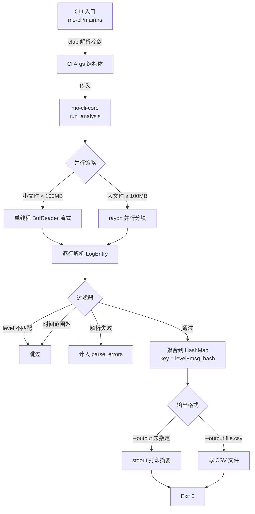
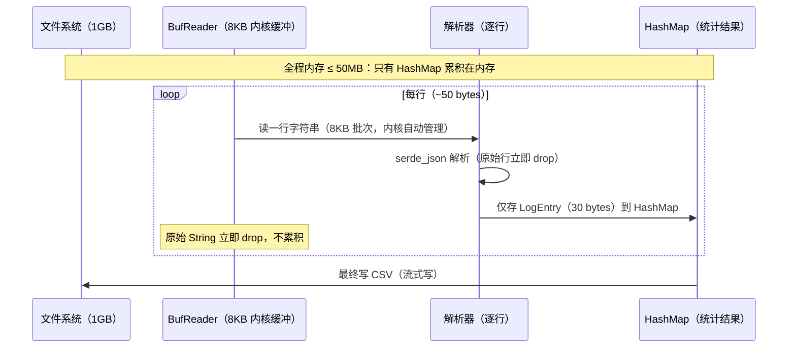

# MoCLI · 项目计划

> **角色**：【Arch】主导

---

## 一、Workspace Crate 划分

MoCLI 是一个 CLI 工具，不需要 Web 框架，但仍采用 Workspace 结构以体现**生产级工程习惯**。

| Crate | 类型 | 职责 |
|-------|------|------|
| `mo-cli-core` | `lib` | 核心业务逻辑：解析、过滤、统计、CSV 输出。可被测试、基准测试独立引用 |
| `mo-cli` | `bin` | 入口：clap 参数解析、调用 core、rayon 并行、错误格式化输出 |

**为什么拆成两个 crate？**

- 测试和 benchmark 只依赖 `mo-cli-core`，不依赖 `clap`，编译更快
- `mo-cli-core` 作为 `lib` 可被未来的 `mo-cli-server`（gRPC 服务化版本）复用
- 工具链 `cargo doc` 对 `lib` 生成文档，对 `bin` 跳过

---

## 二、架构图（Mermaid）

### 整体数据流



### 内存控制原理



---

## 三、目录结构

```
mo-cli/                          ← Workspace 根
├── Cargo.toml                   ← [workspace] 声明 + 共享依赖
├── Cargo.lock                   ← 二进制 workspace，必须提交
├── deny.toml                    ← cargo-deny：许可证 + 安全审计
├── .cargo/
│   └── config.toml              ← Rust flags（嵌入式预留）
├── .github/
│   └── workflows/
│       └── ci.yml               ← CI：fmt/clippy/test/msrv/audit/bench
├── crates/
│   ├── mo-cli-core/             ← 核心库
│   │   ├── Cargo.toml
│   │   ├── src/
│   │   │   ├── lib.rs           ← pub use 导出，模块声明
│   │   │   ├── error.rs         ← thiserror 错误枚举
│   │   │   ├── types.rs         ← LogEntry, LogLevel, FilterArgs, ReportRow
│   │   │   ├── parser.rs        ← parse_log_line：serde_json 解析
│   │   │   ├── filter.rs        ← apply_filter：level + 时间段过滤
│   │   │   ├── aggregator.rs    ← aggregate：HashMap 聚合 + rayon 并行版
│   │   │   ├── reporter.rs      ← write_csv：csv crate 写出
│   │   │   └── runner.rs        ← run_analysis：串联整条流水线
│   │   ├── tests/
│   │   │   ├── integration.rs   ← 完整流水线集成测试
│   │   │   └── fixtures/
│   │   │       ├── sample.jsonl     ← 100 行标准测试数据
│   │   │       └── malformed.jsonl  ← 含非 JSON 行，测试容错
│   │   └── benches/
│   │       └── parse_bench.rs   ← criterion: 解析速度 + 并行加速比
│   └── mo-cli/                  ← 二进制入口
│       ├── Cargo.toml
│       └── src/
│           └── main.rs          ← clap 解析 + 调用 runner
├── docker/
│   └── Dockerfile               ← 多阶段构建
└── .env.example                 ← 说明可用环境变量（LOG_LEVEL 等）
```

---

## 四、完整 Cargo.toml

### Workspace 根 `mo-cli/Cargo.toml`

```toml
[workspace]
members  = ["crates/*"]
resolver = "2"

[workspace.package]
version      = "0.1.0"
edition      = "2021"
authors      = ["Mo Engineering <dev@mo.io>"]
license      = "MIT"
repository   = "https://github.com/mo/mo-cli"
rust-version = "1.78"

[workspace.dependencies]
# 错误处理
thiserror = "1"
anyhow    = "1"

# CLI 参数
clap = { version = "4", features = ["derive", "env"] }

# 序列化（日志解析）
serde      = { version = "1", features = ["derive"] }
serde_json = "1"

# 时间处理（--from / --to 过滤）
chrono = { version = "0.4", features = ["serde"] }

# 并行处理
rayon = "1.10"

# CSV 写出
csv = "1"

# 日志
tracing            = "0.1"
tracing-subscriber = { version = "0.3", features = ["env-filter"] }

# 测试
rstest   = "0.21"
insta    = { version = "1", features = ["json"] }
proptest = "1"
tempfile = "3"

# Benchmark
criterion = { version = "0.5", features = ["html_reports"] }

# ── 全局 Lint ─────────────────────────────────────────────────────────
[workspace.lints.rust]
unsafe_code                   = "forbid"
missing_debug_implementations = "warn"
missing_docs                  = "warn"
unreachable_pub               = "warn"

[workspace.lints.clippy]
await_holding_lock       = "deny"
mem_forget               = "warn"
redundant_clone          = "warn"
cast_possible_truncation = "warn"
cast_sign_loss           = "warn"
todo                     = "warn"
use_self                 = "warn"
pedantic                 = { level = "warn", priority = -1 }
nursery                  = { level = "warn", priority = -1 }

# ── Profile ───────────────────────────────────────────────────────────
[profile.release]
opt-level     = 3
lto           = "thin"
codegen-units = 1
strip         = "symbols"
panic         = "abort"

[profile.dev]
opt-level = 1

[profile.bench]
inherits = "release"
debug    = true
```

### `crates/mo-cli-core/Cargo.toml`

```toml
[package]
name        = "mo-cli-core"
description = "MoCLI 核心解析与统计逻辑（lib，供 binary 和 bench 调用）"
# workspace.package 字段自动继承
version.workspace      = true
edition.workspace      = true
authors.workspace      = true
license.workspace      = true
repository.workspace   = true
rust-version.workspace = true

[lints]
workspace = true

[dependencies]
thiserror.workspace = true
anyhow.workspace    = true
serde.workspace     = true
serde_json.workspace = true
chrono.workspace    = true
rayon.workspace     = true
csv.workspace       = true
tracing.workspace   = true

[dev-dependencies]
rstest.workspace   = true
insta.workspace    = true
proptest.workspace = true
tempfile.workspace = true

[[bench]]
name    = "parse_bench"
harness = false
```

### `crates/mo-cli/Cargo.toml`

```toml
[package]
name        = "mo-cli"
description = "MoCLI · GB 级 JSON 日志分析工具"
version.workspace      = true
edition.workspace      = true
authors.workspace      = true
license.workspace      = true
repository.workspace   = true
rust-version.workspace = true

[lints]
workspace = true

[dependencies]
mo-cli-core = { path = "../mo-cli-core" }
clap.workspace    = true
anyhow.workspace  = true
tracing.workspace = true
tracing-subscriber.workspace = true
```

---

## 五、里程碑

| # | 里程碑 | 核心交付物 | AC |
|---|--------|-----------|-----|
| M1 | Workspace 骨架 + 类型定义 | `types.rs` + `error.rs`，`cargo check` 通过 | — |
| M2 | 解析器 + 过滤器 | `parser.rs` + `filter.rs`，单元测试全绿 | AC3, AC4 |
| M3 | 聚合器 + CSV 输出 | `aggregator.rs` + `reporter.rs` + `runner.rs` | AC2, AC5 |
| M4 | CLI 入口 + 流式接入 | `main.rs` + `--help` 输出 | AC1, AC2 |
| M5 | rayon 并行 + Benchmark | `aggregate_parallel` + criterion 报告 | AC6 |
| M6 | 测试 + CI + Dockerfile | `tests/` + ci.yml + Dockerfile | AC7 |

---

## 六、验收标准（完整列表）

```
AC1：mo-cli --help 显示所有参数及说明（--level / --from / --to / --output / --threads）
AC2：能流式处理 1GB 日志文件，内存占用全程 < 50MB（BufReader 逐行，不 collect Vec）
AC3：支持 --level error|warn|info 过滤日志级别（大小写不敏感）
AC4：支持 --from 2024-01-01T00:00:00 --to 2024-01-02T00:00:00 时间段过滤
AC5：输出 CSV 报告（--output report.csv）包含：timestamp_first, level, message, count
AC6：使用 rayon 并行处理时，速度 > 单线程 2x（criterion benchmark 测试，≥100MB 数据集）
AC7：cargo nextest run 全绿，cargo clippy --deny warnings 零警告
```

---

## 七、关键技术决策

| 决策点 | 选择 | 理由 | 未选项 |
|--------|------|------|--------|
| 并行方案 | `rayon` | 数据并行，`.par_iter()` 一行改造，无需 async 运行时 | `tokio::task::spawn_blocking`（过重） |
| 日志解析 | `serde_json` + `serde` derive | 零运行时开销，编译期字段绑定 | `simd-json`（收益小，依赖复杂） |
| 时间处理 | `chrono` | 最成熟的 Rust 时间库，serde 支持内置 | `time` crate（API 不稳定） |
| CSV 写出 | `csv` crate | 正确处理转义、换行，一行写入 | `format!` 手拼（容易出 CSV 注入） |
| 错误处理 | `thiserror` + `anyhow` | core 用 thiserror（类型安全），main 用 anyhow（快速展示） | 纯 `Box<dyn Error>`（无上下文） |
| 内存策略 | `BufReader` 逐行 + `HashMap` 聚合 | 内存 = O(唯一 key 数量)，与文件大小无关 | 全量 `Vec` 收集（内存 = O(文件大小)） |
| 并行分块 | `rayon::ParallelBridge` | 把 `BufRead::lines()` 迭代器直接转并行，无需手动分块 | `memmap2` + 手动分割（实现复杂，边界处理难） |
