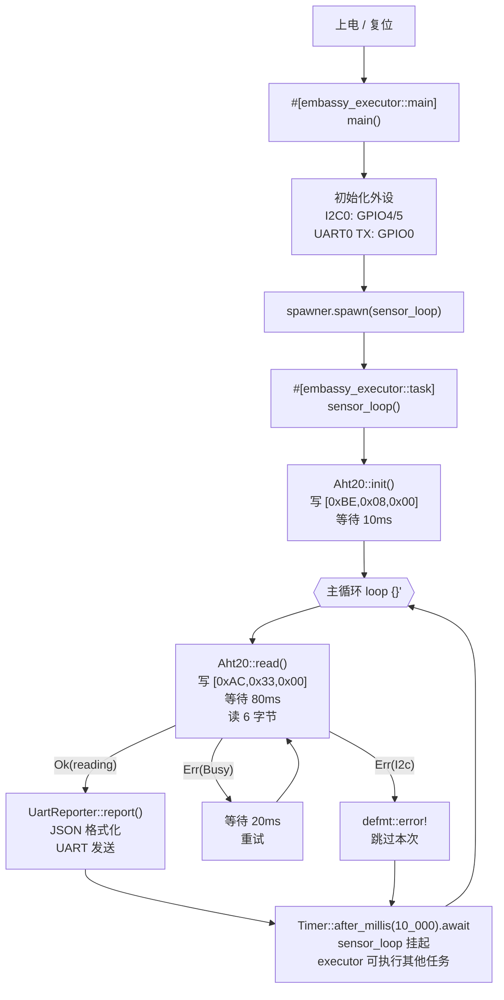

# MoNode · 项目计划

> **角色**：【Arch】主导  
> **产出**：目录结构 + 完整 Cargo.toml + memory.x + .cargo/config.toml + 核心类型设计 + 任务架构图

---

## 一、目录结构

MoNode 是单 crate 项目（无需 Workspace，只有一个二进制目标）：

```
mo-node/                         ← 项目根目录
├── .cargo/
│   └── config.toml              ← cross-compile target + rustflags
├── src/
│   ├── main.rs                  ← Embassy entry point + 外设初始化 + task spawn  ★
│   ├── error.rs                 ← SensorError enum（no_std thiserror-free）
│   ├── sensor/
│   │   ├── mod.rs               ← pub mod aht20;
│   │   └── aht20.rs             ← AHT20 I²C 驱动（init + read）                  ★
│   └── reporter/
│       ├── mod.rs               ← pub mod uart;
│       └── uart.rs              ← UART JSON 上报（report 函数）                   ★
├── Cargo.toml
├── Cargo.lock                   ← binary crate，必须提交
├── memory.x                     ← RP2040 链接脚本（BOOT2/FLASH/RAM 分区）
└── build.rs                     ← 将 memory.x 复制到 OUT_DIR

★ 新增 / 核心文件
```

---

## 二、完整 Cargo.toml

```toml
[package]
name        = "mo-node"
version     = "0.1.0"
edition     = "2021"
rust-version = "1.78"          # MSRV：Embassy 0.9 要求 Rust ≥ 1.75
license     = "MIT"
description = "MoNode：Embassy on RP2040 温湿度传感器节点"
# repository = "https://github.com/mo/mo-node"

# ── 嵌入式目标不进行 cargo test（集成测试在真实硬件上跑）────────────────
[[bin]]
name  = "mo-node"
test  = false
bench = false

# ── 依赖 ─────────────────────────────────────────────────────────────────
[dependencies]

# Embassy 核心：RP2040 HAL
embassy-rp = { version = "0.9.0", features = [
    "defmt",               # defmt 日志支持
    "time-driver",         # 启用软件 Timer（embassy-time 后端）
    "critical-section-impl", # 提供 CriticalSection 实现
] }

# Embassy 异步执行器（Cortex-M 裸机版）
embassy-executor = { version = "0.9.0", features = [
    "arch-cortex-m",       # Cortex-M 架构支持
    "executor-thread",     # 启用线程模式执行器（main task 用）
    "integrated-timers",   # 将 embassy-time 集成到执行器
    "defmt",
] }

# 时间抽象（Timer::after_millis / Instant::now）
embassy-time = { version = "0.4.0", features = [
    "defmt",
    "defmt-timestamp-uptime",  # defmt 日志带启动后时间戳
] }

# Cortex-M 运行时（提供 reset handler、断点指令等）
cortex-m    = { version = "0.7.7", features = ["inline-asm"] }
cortex-m-rt = "0.7.3"

# embedded-hal 异步抽象（I²C trait）
embedded-hal-async = "1.0"
embedded-hal       = "1.0"

# no_std 固定容量集合（JSON 格式化用 String<N>）
heapless = { version = "0.9.2", features = ["defmt-03"] }

# 调试输出：defmt over RTT（不占 UART）
defmt     = "0.3.8"
defmt-rtt = "0.4.0"

# 调试模式 panic：通过 RTT 输出文件/行号，然后断点
panic-probe = { version = "0.3.2", features = ["print-defmt"] }

# ── 开发/测试专用依赖 ──────────────────────────────────────────────────
[dev-dependencies]
# 单元测试在宿主机上跑（no_std 纯逻辑测试）

# ── Feature 开关 ──────────────────────────────────────────────────────
[features]
default = []

# ── 编译 Profile ──────────────────────────────────────────────────────
[profile.release]
opt-level     = "z"     # 优先缩小代码体积（Flash < 80KB）
lto           = true    # 全程序链接时优化，内联+裁剪死代码
codegen-units = 1       # 单翻译单元，最大优化效果
debug         = 2       # 保留调试符号供 defmt/probe-rs 解析（不增加 Flash）
panic         = "abort" # 非展开 panic，省去 unwind 代码（节省 ~4KB）

[profile.dev]
opt-level = 1           # 稍微优化，避免 no_std + defmt 初始化时 stack overflow
debug     = 2
lto       = false

# ── Lint 配置 ────────────────────────────────────────────────────────
[lints.rust]
unsafe_code = "forbid"   # RP2040 代码无需 unsafe（Embassy HAL 封装好了）

[lints.clippy]
pedantic = { level = "warn", priority = -1 }
```

---

## 三、`.cargo/config.toml`

```toml
# .cargo/config.toml
# 交叉编译配置：所有 cargo 命令默认针对 RP2040 的 Cortex-M0+ 目标

[build]
target = "thumbv6m-none-eabi"   # Cortex-M0+ 没有硬件浮点，用 thumb2 指令集 v6M

[target.thumbv6m-none-eabi]
rustflags = [
    "-C", "link-arg=--nmagic",  # 禁止 .text/.data 4KB 对齐（节省 Flash）
    "-C", "link-arg=-Tlink.x",  # cortex-m-rt 提供的链接脚本（依赖 memory.x）
    "-C", "link-arg=-Tdefmt.x", # defmt 的 linker section（日志字符串存 Flash）
]
runner = "probe-rs run --chip RP2040"  # cargo run 直接烧录 + 连接 RTT

[unstable]
build-std = ["core"]            # 为 thumbv6m-none-eabi 编译 core 库（无法用预编译版本）
```

> **`probe-rs` 安装**：`cargo install probe-rs-tools --locked`  
> 烧录后用 `probe-rs attach --chip RP2040` 查看 defmt RTT 日志。

---

## 四、`memory.x`（RP2040 链接脚本）

```ld
/* memory.x — RP2040 Flash/RAM 分区描述
 * RP2040 Flash 通过 XIP（eXecute In Place）映射到 0x10000000
 * 前 256 字节（0x100）是 Boot Stage 2（负责配置外部 Flash 时序）
 */
MEMORY {
    BOOT2 : ORIGIN = 0x10000000, LENGTH = 0x100       /* Boot2: 256 bytes */
    FLASH : ORIGIN = 0x10000100, LENGTH = 2048K - 0x100  /* 可用 Flash: ~2MB */
    RAM   : ORIGIN = 0x20000000, LENGTH = 256K         /* SRAM0+1: 256KB */
}

/* Boot2 Section：cortex-m-rt 会将 .boot2 段放在链接脚本指定的区域 */
SECTIONS {
    .boot2 ORIGIN(BOOT2) : {
        KEEP(*(.boot2));
    } > BOOT2
}
```

> **C# 类比**：`memory.x` 相当于 IL2CPP 的内存布局配置，告诉链接器各段放在哪个物理地址。

---

## 五、`build.rs`

```rust
// build.rs — 将 memory.x 复制到链接器搜索路径
use std::{env, fs, path::PathBuf};

fn main() {
    let out = PathBuf::from(env::var("OUT_DIR").unwrap());

    // 将 memory.x 复制到 target/<triple>/debug+release/build 目录
    // cortex-m-rt 的 link.x 会 INCLUDE 这里
    fs::copy("memory.x", out.join("memory.x")).unwrap();
    println!("cargo:rustc-link-search={}", out.display());

    // memory.x 变更时重新运行 build.rs
    println!("cargo:rerun-if-changed=memory.x");
}
```

---

## 六、核心类型设计

### `SensorReading`（温湿度读数）

```rust
/// 传感器一次采集的结果。
///
/// 使用整数 × 10 表示一位小数，避免浮点运算：
/// - temperature_decidegrees = 253 → 25.3°C
/// - humidity_decipercent   = 601 → 60.1%RH
#[derive(Debug, Clone, Copy, defmt::Format)]
pub struct SensorReading {
    /// 温度（°C × 10），范围 -500 ~ +850（-50.0°C ~ +85.0°C）
    pub temperature_decidegrees: i16,
    /// 相对湿度（%RH × 10），范围 0 ~ 1000
    pub humidity_decipercent: u16,
}
```

**为什么整数而非浮点？**

RP2040（Cortex-M0+）没有硬件 FPU，浮点运算通过软件库（`libgcc` soft-float）实现，每次运算 ~50 条指令，且将 `libgcc_s` 链接进来会额外增加 ~8KB Flash。整数 × 10 的方案：
- 零额外 Flash 开销
- Cortex-M0+ 单周期 32-bit 乘法
- JSON 格式化时手动插入小数点

### `SensorError`（错误类型）

```rust
/// AHT20 传感器操作可能产生的错误。
#[derive(Debug, defmt::Format)]
#[non_exhaustive]  // 未来可能新增错误码
pub enum SensorError {
    /// I²C 总线通信错误（地址 NACK、总线仲裁失败等）
    I2c,
    /// 传感器响应格式不符合预期（状态字节或数据异常）
    InvalidResponse,
    /// 传感器处于 Busy 状态（测量未完成，status byte bit7 = 1）
    Busy,
    /// 传感器未完成初始化校准（calibration bit = 0）
    NotCalibrated,
}
```

### `UartMessage`（UART 上报的消息结构）

```rust
/// UART JSON 消息格式（在 uart.rs 中 inline 格式化，不需要独立结构体）
///
/// 输出示例：{"ts":12345,"temp":25.3,"hum":60.1}\r\n
///
/// 字段说明：
/// - ts:   上电后毫秒数（embassy_time::Instant::now().as_millis()），u64
/// - temp: 温度，带符号，1 位小数（整数 × 10 格式化输出）
/// - hum:  湿度，无符号，1 位小数
```

---

## 七、Embassy 任务架构设计

### 任务约束：不能有泛型参数

`#[embassy_executor::task]` 要求被标注的函数**没有泛型类型参数**：

```rust
// ❌ 不允许：泛型会导致 Future 大小在编译期不确定
#[embassy_executor::task]
async fn sensor_loop<I: I2cTrait>(i2c: I) { ... }

// ✅ 正确：使用具体的 HAL 类型
#[embassy_executor::task]
async fn sensor_loop(
    i2c: embassy_rp::i2c::I2c<'static, I2C0, embassy_rp::i2c::Async>,
    uart_tx: embassy_rp::uart::UartTx<'static, UART0, embassy_rp::uart::Blocking>,
) -> ! { ... }
```

**原因**：Embassy executor 在编译期为每个 task 分配固定大小的 `TaskStorage<F>` 结构体。泛型参数 `I` 会导致 Future 大小因类型而异，破坏静态分配假设。

### 任务图（Mermaid）



### 外设生命周期（RP2040 Peripheral 单例）

```
embassy_rp::init(Default::default())
    │ 返回 Peripherals（消耗型单例，每个外设只能被取一次）
    │
    ├── p.I2C0      → i2c::I2c::new_async(...)  → I2c<'static, I2C0, Async>
    ├── p.UART0     → UartTx::new(...)            → UartTx<'static, UART0, Blocking>
    ├── p.PIN_0     → UartTx TX 引脚（消耗）
    ├── p.PIN_4     → I2c SDA 引脚（消耗）
    └── p.PIN_5     → I2c SCL 引脚（消耗）
```

`'static` 生命周期来自 RP2040 外设寄存器的内存地址永不失效（硬件固定地址）。

---

## 八、数据流与 AHT20 I²C 时序

```
sensor_loop task
    │
    ├─ AHT20 初始化（上电一次）
    │   I2C WRITE 0x38: [0xBE, 0x08, 0x00]   ← 初始化命令
    │   Timer::after_millis(10)               ← 等待 10ms
    │
    └─ 每 10 秒采集循环
        │
        ├─ I2C WRITE 0x38: [0xAC, 0x33, 0x00]  ← 触发测量
        ├─ Timer::after_millis(80)               ← 等待 80ms（测量时间）
        ├─ I2C READ  0x38: [b0,b1,b2,b3,b4,b5]  ← 读取 6 字节
        │   b0:       status byte
        │             bit7 = Busy（0=就绪，1=测量中）
        │             bit3 = Calibrated（1=已校准）
        │   b1,b2:    湿度高 16 位
        │   b3[7:4]:  湿度低 4 位 }  → raw_hum (20 bit)
        │   b3[3:0]:  温度高 4 位 }
        │   b4,b5:    温度低 16 位   → raw_temp (20 bit)
        │
        ├─ 整数换算（Cortex-M0+ 无 FPU，纯整数运算）
        │   raw_hum  = (b1<<12) | (b2<<4) | (b3>>4)
        │   raw_temp = ((b3 & 0x0F)<<16) | (b4<<8) | b5
        │   humidity_decipercent   = (raw_hum  * 1_000) >> 20  → 单位 0.1%RH
        │   temperature_decidegrees= (raw_temp * 2_000) >> 20 - 500 → 单位 0.1°C
        │
        └─ UART TX: {"ts":N,"temp":T.t,"hum":H.h}\r\n
```

---

## 九、里程碑计划

| 步骤 | 任务 | 预计产出 |
|------|------|---------|
| 1 | 创建项目骨架（`cargo new + memory.x + .cargo/config.toml`） | `cargo build --release` 成功（空 main）|
| 2 | `error.rs`：SensorError 枚举 | 类型定义完成 |
| 3 | `sensor/aht20.rs`：AHT20 驱动（init + read） | 固件烧录后 defmt 日志看到原始值 |
| 4 | `reporter/uart.rs`：JSON 格式化 + UART 发送 | 串口监视器看到输出 |
| 5 | `main.rs`：Embassy 初始化 + spawn task | 端到端联调 |
| 6 | Flash 尺寸验证：`cargo size --release` < 80KB | AC1 达标 |
| 7 | `cargo clippy --target thumbv6m-none-eabi --deny warnings` | AC7 达标 |
