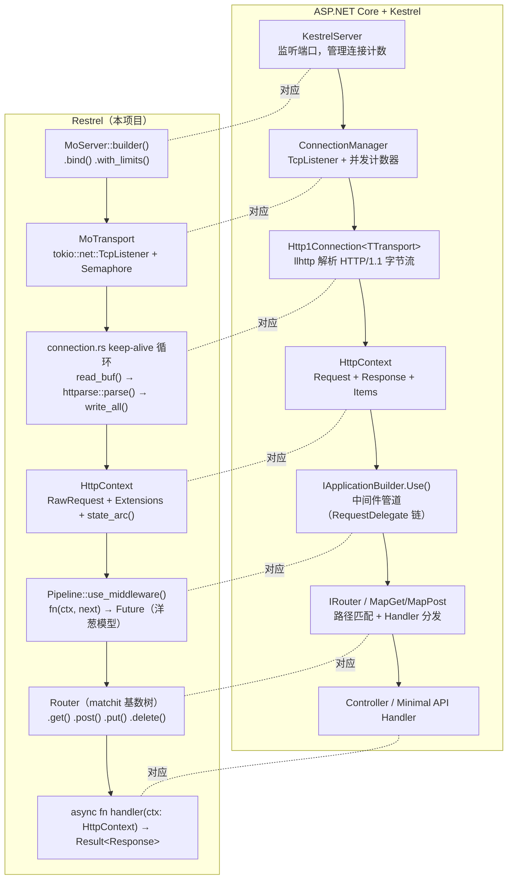

# 01 · Restrel 立项

## 一、【PM】为什么要自己做，而不是直接用 axum？

axum 已经是生产级 Web 框架，直接用完全可行。但对于从 C# 转来的开发者，有一个认知黑洞：

> **ASP.NET Core 的请求是怎么从 TCP 字节流变成 `HttpContext` 的？**

这个问题的答案藏在 **Kestrel** 里。Kestrel 是 ASP.NET Core 内置的 HTTP 服务器，负责：

- 接受 TCP 连接 → 用 `llhttp`（C 库）解析 HTTP/1.1 字节流 → 构造 `HttpContext`
- 把 `HttpContext` 推入中间件管道（`IApplicationBuilder.Use(...)`）
- 最终交给路由 + 控制器处理

Restrel Phase 3 的目标是：**用 Rust 从 TCP 层开始，一层一层复刻 Kestrel 的架构**——
包括手写 HTTP/1.1 字节流解析，而不是调用已有框架代替这一层。

> 注：axum 在 `hyper` 之上，`hyper` 在 `httparse` 之上。
> Restrel 直接使用 `httparse`，和 Kestrel 使用 `llhttp` 处于同一抽象层级。

---

## 二、【PM】Kestrel 架构全景 vs Restrel 对应关系



---

## 三、【PM】技术层次图

```
┌────────────────────────────────────────────────────┐
│  应用层  handlers/（Service CRUD, Health）           │  ← 你写业务逻辑
├────────────────────────────────────────────────────┤
│  路由层  Router（matchit 基数树，O(log n) 匹配）     │  ← 对应 IRouter
├────────────────────────────────────────────────────┤
│  中间件  Pipeline（tracing → auth → cors → router）  │  ← 对应 IApplicationBuilder
├────────────────────────────────────────────────────┤
│  解析层  parser.rs + serializer.rs                  │  ← 对应 llhttp + Http1OutputProducer
│          httparse::parse() + write_all()            │
├────────────────────────────────────────────────────┤
│  连接层  transport.rs（TcpListener + Semaphore）    │  ← 对应 ConnectionManager
│          connection.rs（keep-alive 请求循环）        │  ← 对应 Http1Connection.ProcessRequestsAsync
├────────────────────────────────────────────────────┤
│  系统层  tokio（epoll/kqueue 异步 IO）               │  ← 对应 libuv / IOCP
└────────────────────────────────────────────────────┘
```

---

## 四、【PM】验收标准（AC）

| # | 验收项 | 量化指标 |
|---|--------|---------|
| AC1 | **Transport**：TCP 监听 + 并发连接数限制（Semaphore）| 超过 `max_connections` 时新连接阻塞，不 panic |
| AC2 | **HTTP 解析**：`httparse` 手写 HTTP/1.1 解析，keep-alive 状态机 | `curl -v` 可见 `connection: keep-alive`；同一 TCP 复用 |
| AC3 | **HttpContext**：路由参数提取 + 类型安全 Extensions | 路径参数 `/services/:id` 正确提取 |
| AC4 | **中间件管道**：`use_middleware` 链式组合，调用顺序正确 | tracing 中间件记录每个请求 |
| AC5 | **Router**：`GET/POST/PUT/DELETE` + 路径变量匹配 | `cargo test` 路由测试全绿 |
| AC6 | **优雅关闭**：`SIGTERM` 后停止 accept，等待 in-flight 请求完成 | `CancellationToken` 触发，in-flight 请求正常返回 |
| AC7 | **Service CRUD + sqlx**：PostgreSQL 持久化 | testcontainers 集成测试通过 |
| AC8 | **P99 < 15ms**（不含 DB 查询） | criterion benchmark；框架层开销 P99 < 0.3ms |

---

## 五、【PM】与 Kestrel 对比：关键差异

| 方面 | Kestrel (C#) | Restrel (Rust) |
|------|-------------|-------------|
| HTTP 解析库 | llhttp（C 语言，P/Invoke 调用）| httparse（纯 Rust，同等抽象层级）|
| 缓冲区管理 | `System.IO.Pipelines`（PipeReader/PipeWriter）| `bytes::BytesMut`（零拷贝 split_to）|
| keep-alive 循环 | `Http1Connection.ProcessRequestsAsync()` while 循环 | `connection.rs` async loop |
| 连接处理 | 每连接一个 `PipeReader`（System.IO.Pipelines）| 每连接一个 `tokio::task`（协程，~4KB 栈）|
| 中间件组合 | `RequestDelegate` 委托链 | `async fn(ctx, next)` 闭包链（编译期单态化）|
| 共享状态 | `IServiceCollection` DI + `IServiceScope` | `Arc<AppState>` 存入 `HttpContext`，handler 取出 |
| 优雅关闭 | `CancellationToken` + `IHostedService.StopAsync` | `tokio_util::CancellationToken`；Semaphore 归零等待 |
| 内存模型 | GC 负责，Request 对象随时 GC | 每个 Request 精确生命周期，handler 返回后立即释放 |

---

## 六、【PM】llhttp vs httparse：同一层级的对比

Kestrel 真正令人印象深刻的地方在于它**手写了 HTTP 解析层**：

```csharp
// Kestrel 内部（简化）：Http1Connection.cs
// llhttp 是 Node.js HTTP 解析库，Kestrel 通过 P/Invoke 调用其 C 代码
var parseResult = LLHttp.ParseRequest(buffer.Span, out var consumed, out var examined);
if (parseResult == ParseResult.Incomplete) {
    reader.AdvanceTo(consumed, examined);  // 告知 PipeReader 消费了多少
    continue;
}
// 解析完成：headers 在 _httpRequestHeaders，body 暂未读
```

Restrel 在 Rust 中复刻这一层：

```rust
// parser.rs（Restrel）：等价的 Partial 状态机
loop {
    match httparse::Request::new(&mut headers).parse(&buf) {
        Ok(httparse::Status::Complete(n)) => {
            let _ = buf.split_to(n);  // 消费 headers 区（等价 reader.AdvanceTo）
            break; // 解析完成
        }
        Ok(httparse::Status::Partial) => {
            reader.read_buf(&mut buf).await?;  // 数据不足，继续读 socket
        }
        Err(e) => return Err(ServerError::BadRequest(e.to_string())),
    }
}
```

两者在逻辑上完全等价：都是"尝试解析 → 数据不足 → 读更多 → 再试"的状态机循环。
