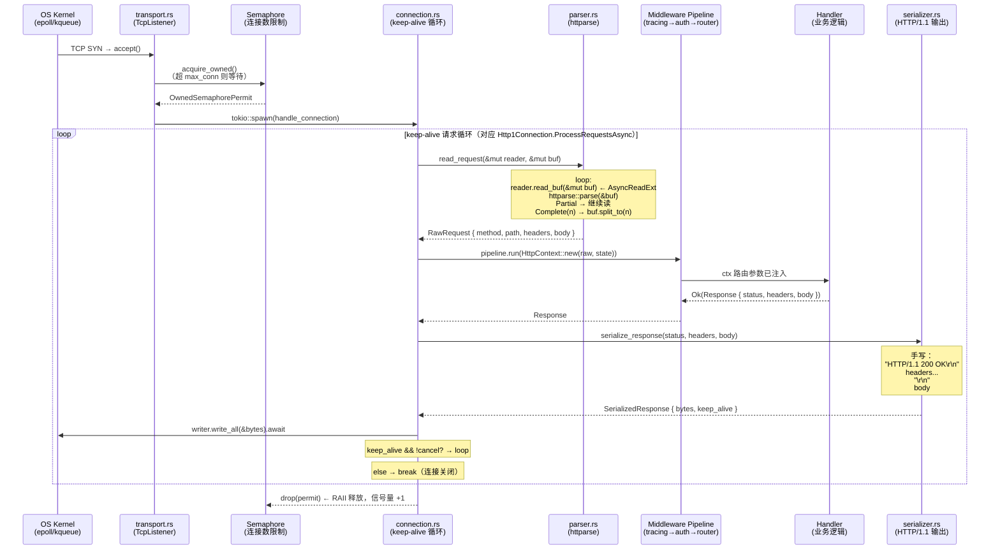
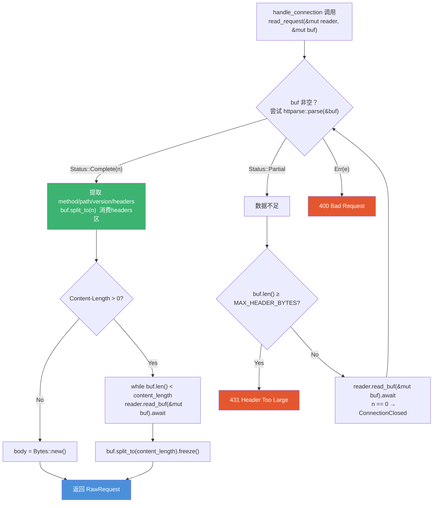

# 02 · Restrel 项目计划

## 一、【Arch】目录结构

```
mo-server/
├── Cargo.toml                    # workspace
├── Cargo.lock
├── deny.toml
├── .env.example
├── .github/workflows/ci.yml
├── docker/Dockerfile
├── docker-compose.yml
├── migrations/
│   └── 20240301000001_create_services.sql
└── crates/
    ├── mo-server-core/           # 纯 lib：框架核心（无业务代码）
    │   ├── Cargo.toml
    │   └── src/
    │       ├── lib.rs
    │       ├── error.rs          # ServerError（统一错误类型）
    │       ├── parser.rs         # ★ HTTP/1.1 请求解析（httparse + BytesMut 状态机）
    │       ├── serializer.rs     # ★ HTTP/1.1 响应序列化（手写 status line + headers + body）
    │       ├── context.rs        # HttpContext（对应 Kestrel 的 HttpContext）
    │       ├── response.rs       # Response 类型 + 便利构造函数
    │       ├── middleware.rs     # Middleware trait + Pipeline + FnMiddleware
    │       └── router.rs         # Router：matchit 基数树（对应 IRouter）
    └── mo-server/                # bin：服务器 + 业务逻辑
        ├── Cargo.toml
        └── src/
            ├── main.rs           # 入口：初始化 tracing + 启动 MoServer
            ├── server.rs         # MoServer + ServerBuilder（对应 WebApplicationBuilder）
            ├── transport.rs      # MoTransport：TcpListener + Semaphore accept 循环
            ├── connection.rs     # ★ keep-alive 请求处理循环（对应 Http1Connection）
            ├── limits.rs         # ServerLimits（对应 KestrelServerLimits）
            ├── config.rs         # figment 分层配置
            ├── state.rs          # AppState：PgPool + config
            ├── db/
            │   └── service_repo.rs
            ├── handlers/
            │   ├── services.rs
            │   └── health.rs
            └── middleware/
                ├── tracing_mw.rs   # 请求日志（对应 UseHttpLogging）
                └── auth_mw.rs      # JWT（对应 UseAuthentication）
```

★ 标注的是本次新增的核心层，对应 Kestrel 中最关键但通常被框架隐藏的部分。

---

## 二、【Arch】TCP 字节流到 HTTP 响应：完整请求生命周期



---

## 三、【Arch】parser.rs：Partial 状态机（对应 llhttp 调用层）



**与 Kestrel 对应关系：**

| Kestrel                           | Restrel                                 |
|-----------------------------------|---------------------------------------|
| `llhttp_execute()` P/Invoke 调用  | `httparse::Request::parse(&buf)`      |
| `PipeReader.ReadAsync()`          | `reader.read_buf(&mut buf).await`     |
| `reader.AdvanceTo(consumed, examined)` | `buf.split_to(n)`               |
| `Http1MessageBody.ConsumeAsync()` | `read_body()` 中的 while 循环         |
| Buffer 跨请求持久（keep-alive）   | `BytesMut buf` 传 `&mut` 跨调用持久   |

---

## 四、【Arch】中间件管道（对应 IApplicationBuilder 链）

```mermaid
graph LR
    REQ["RawRequest"] --> CTX["HttpContext::new()"]
    CTX --> T["TracingMiddleware<br/>注入 trace_id<br/>记录延迟"]
    T --> A["AuthMiddleware<br/>提取 Bearer token<br/>验证 JWT → Claims"]
    A --> R["Router<br/>matchit.at(path)<br/>提取路由参数"]
    R --> H["Handler<br/>业务逻辑"]
    H --> R2["Router 返回"]
    R2 --> A2["AuthMiddleware 返回"]
    A2 --> T2["TracingMiddleware<br/>记录 status + latency"]
    T2 --> RESP["Response → serialize_response()"]

    style T fill:#4a90d9,color:#fff
    style A fill:#e4572e,color:#fff
    style R fill:#3cb371,color:#fff
    style H fill:#ffa500,color:#fff
```



Pipeline 编译为 fold 闭包链（零虚表开销）：

```rust
// middleware.rs：把中间件列表折叠为单个 Next 闭包
// 对应 C# IApplicationBuilder.Build() → RequestDelegate 委托链
pub fn build(self, terminal: Next) -> Next {
    self.middlewares.into_iter().rev().fold(
        terminal,
        |next, mw| {
            Arc::new(move |ctx: HttpContext| -> BoxFuture<'static, _> {
                let next = next.clone();
                let mw   = mw.clone();
                Box::pin(async move { mw.handle(ctx, next).await })
            })
        },
    )
}
```

---

## 五、【Arch】Cargo.toml 完整配置

### 根 Workspace

```toml
[workspace]
members  = ["crates/*"]
resolver = "2"

[workspace.package]
version      = "0.1.0"
edition      = "2021"
rust-version = "1.78"

[workspace.dependencies]
# ── 异步运行时 ──────────────────────────────────────────────────────
tokio        = { version = "1.38", features = ["full"] }
tokio-util   = { version = "0.7",  features = ["sync"] }  # CancellationToken

# ── HTTP 解析（不用 hyper 框架，直接用底层解析库）────────────────────
# httparse 与 Kestrel 使用的 llhttp 处于同一抽象层级：
#   Kestrel: llhttp（C 库，P/Invoke）→ PipeReader 缓冲区
#   Restrel:   httparse（纯 Rust）     → BytesMut 缓冲区
httparse     = "1"
bytes        = "1"    # BytesMut：零拷贝缓冲区（等同 System.IO.Pipelines）

# ── 路由（matchit：axum 内部使用的同款基数树）────────────────────────
matchit      = "0.8"

# ── 数据库 ──────────────────────────────────────────────────────────
sqlx         = { version = "0.7", features = [
    "postgres", "runtime-tokio", "macros", "migrate", "uuid", "chrono"
] }

# ── 序列化 ──────────────────────────────────────────────────────────
serde        = { version = "1", features = ["derive"] }
serde_json   = "1"

# ── 错误处理 ────────────────────────────────────────────────────────
thiserror    = "1"
anyhow       = "1"

# ── 日志 ────────────────────────────────────────────────────────────
tracing               = "0.1"
tracing-subscriber    = { version = "0.3", features = ["env-filter", "json"] }

# ── 鉴权 ────────────────────────────────────────────────────────────
jsonwebtoken = "9"

# ── 配置 ────────────────────────────────────────────────────────────
figment      = { version = "0.10", features = ["toml", "env"] }

# ── 类型工具 ────────────────────────────────────────────────────────
uuid         = { version = "1", features = ["v4", "serde"] }
chrono       = { version = "0.4", features = ["serde"] }

# ── 测试 ────────────────────────────────────────────────────────────
rstest                    = "0.21"
testcontainers            = "0.17"
testcontainers-modules    = { version = "0.4", features = ["postgres"] }
criterion                 = { version = "0.5", features = ["async_tokio"] }

[workspace.lints.rust]
unsafe_code = "forbid"

[workspace.lints.clippy]
await_holding_lock = "deny"
pedantic           = { level = "warn", priority = -1 }

[profile.release]
opt-level     = 3
lto           = "thin"
codegen-units = 1
strip         = "symbols"
panic         = "abort"
```

### crates/mo-server-core/Cargo.toml

```toml
[package]
name    = "mo-server-core"
version.workspace = true
edition.workspace = true

[dependencies]
tokio.workspace     = true
httparse.workspace  = true    # HTTP/1.1 解析（替代 hyper）
bytes.workspace     = true    # BytesMut 零拷贝缓冲区
matchit.workspace   = true
serde.workspace     = true
serde_json.workspace = true
thiserror.workspace = true
tracing.workspace   = true
uuid.workspace      = true
sqlx.workspace      = true    # AppState 需要知道 sqlx Error 类型

[lints]
workspace = true
```

### crates/mo-server/Cargo.toml

```toml
[package]
name    = "mo-server"
version.workspace = true
edition.workspace = true

[[bin]]
name = "mo-server"
path = "src/main.rs"

[dependencies]
mo-server-core = { path = "../mo-server-core" }

tokio.workspace          = true
tokio-util.workspace     = true
bytes.workspace          = true
httparse.workspace       = true
sqlx.workspace           = true
serde.workspace          = true
serde_json.workspace     = true
thiserror.workspace      = true
anyhow.workspace         = true
tracing.workspace              = true
tracing-subscriber.workspace   = true
jsonwebtoken.workspace   = true
figment.workspace        = true
uuid.workspace           = true
chrono.workspace         = true

[dev-dependencies]
rstest.workspace                  = true
testcontainers.workspace          = true
testcontainers-modules.workspace  = true
criterion.workspace               = true

[[bench]]
name    = "handler_bench"
harness = false

[lints]
workspace = true
```

---

## 六、【Arch】关键类型设计

```rust
// ─── 1. RawRequest（parser.rs 输出，对应 Kestrel 解析完成后的原始 HTTP 数据）
pub struct RawRequest {
    pub method:  String,
    pub path:    String,
    pub version: u8,           // 0 = HTTP/1.0  1 = HTTP/1.1
    pub headers: HashMap<String, String>,
    pub body:    Bytes,        // Content-Length 字节已完整读取
}

// ─── 2. HttpContext（对应 Kestrel HttpContext，在中间件管道中传递）
pub struct HttpContext {
    raw:              RawRequest,
    pub route_params: HashMap<String, String>,
    pub extensions:   Extensions,   // 类型安全的 key-value（等同 HttpContext.Items）
    state:            Arc<dyn Any + Send + Sync>,  // 类型擦除的应用状态
}

impl HttpContext {
    /// 获取应用状态（对应 C# HttpContext.RequestServices.GetRequiredService<T>()）
    pub fn state_arc<T: Any + Send + Sync + 'static>(&self) -> Option<Arc<T>> {
        Arc::clone(&self.state).downcast::<T>().ok()
    }
}

// ─── 3. Response（中间件链返回，序列化前的原始表示）
pub struct Response {
    pub status:  u16,
    pub headers: Vec<(String, String)>,
    pub body:    Bytes,
}

// ─── 4. Middleware（对应 RequestDelegate）
pub type Next = Arc<dyn Fn(HttpContext) -> BoxFuture<'static, Result<Response, ServerError>>
                    + Send + Sync>;

pub trait Middleware: Send + Sync + 'static {
    fn handle(&self, ctx: HttpContext, next: Next)
        -> BoxFuture<'static, Result<Response, ServerError>>;
}

// ─── 5. Router（对应 IRouter + MapGet）
pub struct Router {
    // 每个 Method 字符串对应一棵 matchit 基数树
    routes: HashMap<String, matchit::Router<BoxHandler>>,
}

pub type BoxHandler = Arc<
    dyn Fn(HttpContext) -> BoxFuture<'static, Result<Response, ServerError>> + Send + Sync
>;

// ─── 6. MoServer（对应 WebApplication）
pub struct MoServer {
    listener:  TcpListener,
    pipeline:  Arc<Next>,      // 编译好的中间件链（含 Router 作为最后节点）
    state:     Arc<AppState>,
    limits:    ServerLimits,
    cancel:    CancellationToken,
    semaphore: Arc<Semaphore>,
}

// Builder 模式组装（链式 API）
impl ServerBuilder {
    pub fn bind(mut self, addr: &str) -> Self { ... }
    pub fn with_limits(mut self, l: ServerLimits) -> Self { ... }
    pub fn use_middleware<F, Fut>(mut self, f: F) -> Self { ... }  // 接受 async fn
    pub fn map_get(mut self, path: &str, h: impl Handler) -> Self { ... }
    pub async fn run(self) -> anyhow::Result<()> { ... }  // 启动服务器
}
```

---

## 七、【Arch】ServerLimits（对应 KestrelServerLimits）

```rust
// 对应 C# 的 KestrelServerLimits
#[derive(Clone)]
pub struct ServerLimits {
    /// 最大并发连接数（超出则 accept 等待 Semaphore permit）
    /// 对应 KestrelServerLimits.MaxConcurrentConnections
    pub max_concurrent_connections: usize,

    /// Keep-alive 空闲超时（等待下一个请求的最长时间）
    /// 对应 KestrelServerLimits.KeepAliveTimeout（Kestrel 默认 130s）
    pub keep_alive_timeout: Duration,

    /// 最大请求 body 大小（超出 → 413）
    /// 对应 KestrelServerLimits.MaxRequestBodySize
    pub max_request_body_size: usize,

    /// 最大请求头总大小（超出 → 431）
    /// 对应 KestrelServerLimits.MaxRequestHeadersTotalSize（Kestrel 默认 32KB）
    pub max_header_bytes: usize,
}

impl Default for ServerLimits {
    fn default() -> Self {
        Self {
            max_concurrent_connections: 1000,
            keep_alive_timeout:         Duration::from_secs(75),
            max_request_body_size:      1024 * 1024,   // 1MB
            max_header_bytes:           32 * 1024,     // 32KB（与 Kestrel 默认值一致）
        }
    }
}
```

---

## 八、【Arch】BytesMut 与 System.IO.Pipelines 对比

Kestrel 使用 `System.IO.Pipelines` 管理 TCP 字节流，Restrel 用 `bytes::BytesMut`。两者的核心思路完全一致：**零拷贝、按需消费**。

| 操作 | System.IO.Pipelines (C#) | bytes::BytesMut (Rust) |
|------|--------------------------|------------------------|
| 等待数据到达 | `reader.ReadAsync()` | `tokio::io::AsyncReadExt::read_buf()` |
| 告知已消费多少 | `reader.AdvanceTo(consumed)` | `buf.split_to(n)` (直接消费) |
| 获取已读数据 | `result.Buffer.Slice(0, n)` | `&buf[..n]` |
| 读取 body 后剩余数据 | Buffer 自动追踪 | `buf` 继续保留剩余字节 |
| 跨请求复用缓冲区 | Pipe 生命周期 = 连接生命周期 | `BytesMut buf` 在 connection loop 中持久 |

**关键差异**：`System.IO.Pipelines` 是生产者-消费者双管道模型（`PipeWriter` 负责从网络读，`PipeReader` 负责解析），Restrel 用更直接的 `AsyncReadExt::read_buf` 将两个角色合并——这足以满足教学目标，也更容易理解。
