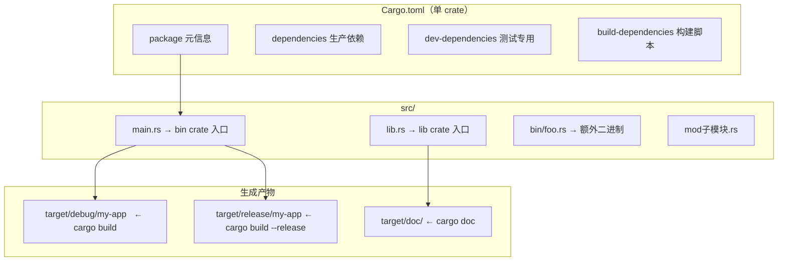

# 02 · Hello World 与 Cargo 基础

## 一、【PM】为什么要先学 Cargo？

C# 开发者已经习惯了 Visual Studio 的一键创建项目，`dotnet new`，NuGet 管理依赖。Rust 的 **Cargo** 做的是同一件事，而且做得更彻底：

- 创建项目（`cargo new`）
- 管理依赖（`Cargo.toml`）
- 编译（`cargo build`）
- 运行（`cargo run`）
- 测试（`cargo test`）
- 发布（`cargo publish`）

理解 Cargo 是写任何 Rust 代码的前提。它比 `dotnet` CLI 更统一，没有 `.sln` 和 `.csproj` 分离的概念，也不需要"解决方案"这一层。

---

## 二、【Arch】Cargo 项目结构图



### Cargo.lock vs Cargo.toml

| 文件 | 作用 | 是否提交 git |
|------|------|-------------|
| `Cargo.toml` | 声明**范围**依赖（`"1.0"` 表示 1.x 最新）| 必须提交 |
| `Cargo.lock` | 锁定**精确**版本（可重现构建）| lib crate 不提交；bin/workspace 必须提交 |

C# 对应：`Cargo.toml` ≈ `.csproj`，`Cargo.lock` ≈ `packages.lock.json`。

---

## 三、【Dev】Hello World → 有意义的程序

### 场景 1：最小 Hello World

```bash
cargo new hello-mo    # 创建 bin crate（等同 dotnet new console）
cd hello-mo
cargo run             # 编译 + 运行（第一次慢，之后增量快）
```

```rust
// src/main.rs — cargo new 自动生成
fn main() {
    println!("Hello, world!");
}
```

**C# 对比**：

```csharp
// Program.cs（顶级语句，C# 9+）
Console.WriteLine("Hello, world!");
```

```rust
// Rust —— fn main() 是唯一入口，没有隐式顶级语句
fn main() {
    println!("Hello, world!");   // 宏，不是函数（注意感叹号）
}
```

**关键区别**：`println!` 末尾有 `!`，这表示它是一个**宏（macro）**，不是普通函数。宏在编译期展开，可以接受可变数量参数，内置格式化。

### 场景 2：格式化输出对比

```csharp
// C# — 字符串插值
string name = "Mo";
int age = 30;
Console.WriteLine($"我叫 {name}，今年 {age} 岁");

// 对齐格式
Console.WriteLine($"{name,-10} {age,5}");   // 左对齐10位 右对齐5位
```

```rust
// Rust — {} 占位符（Display trait），{:?} 调试输出，{:#?} 美化调试
let name = "Mo";
let age: i32 = 30;
println!("我叫 {}，今年 {} 岁", name, age);

// 命名参数（Rust 1.58+）
println!("我叫 {name}，今年 {age} 岁");   // 与 C# 插值语法类似

// 对齐格式
println!("{name:<10} {age:>5}");   // 左对齐 右对齐（: 后面是格式说明）
println!("{age:05}");              // 补零：00030

// 调试输出（打印结构体等）
let vec = vec![1, 2, 3];
println!("{:?}", vec);    // [1, 2, 3]
println!("{:#?}", vec);   // 美化多行输出
```

### 场景 3：Cargo.toml 添加依赖

```toml
# Cargo.toml
[package]
name    = "hello-mo"
version = "0.1.0"
edition = "2021"

[dependencies]
# 等同 NuGet: Install-Package serde -Version 1.*
serde = { version = "1", features = ["derive"] }

[dev-dependencies]
# 仅测试时编译（等同 dotnet add package --no-restore，类别 Test）
rstest = "0.21"
```

```bash
cargo add serde --features derive   # 等同 dotnet add package serde（自动修改 Cargo.toml）
cargo add --dev rstest              # 添加 dev 依赖
```

### 场景 4：模块系统（C# namespace 对应）

```csharp
// C# — namespace 按目录自动组织
namespace HelloMo.Utils {
    public static class Greeter {
        public static string Greet(string name) => $"Hello, {name}!";
    }
}
```

```rust
// Rust — 模块需要显式声明，文件即模块

// src/main.rs
mod utils;   // 声明 utils 模块，对应 src/utils.rs 或 src/utils/mod.rs

fn main() {
    let msg = utils::greeter::greet("Mo");
    println!("{}", msg);
}

// src/utils/mod.rs
pub mod greeter;   // 声明子模块，对应 src/utils/greeter.rs

// src/utils/greeter.rs
/// 生成问候语。
pub fn greet(name: &str) -> String {
    format!("Hello, {}!", name)   // format! 返回 String（不打印）
}
```

**模块访问规则**：

| Rust | C# 等价 |
|------|---------|
| `pub` | `public` |
| `pub(crate)` | `internal` |
| 无修饰（默认）| `private` |
| `pub(super)` | 父模块可见（无直接等价）|

### 场景 5：常用 Cargo 命令速查

```bash
# 创建
cargo new my-app          # bin crate（有 main.rs）
cargo new my-lib --lib    # lib crate（有 lib.rs）

# 构建
cargo build               # debug 模式（快编译，慢运行）
cargo build --release     # release 模式（慢编译，快运行，生产用）
cargo check               # 只检查类型，不生成二进制（最快，CI 用）

# 运行
cargo run                 # 编译 + 运行（debug）
cargo run --release       # release 模式运行
cargo run -- --arg1 val   # 传参数给程序（-- 后面是程序参数）

# 测试
cargo test                # 运行所有测试
cargo test filter_name    # 运行名字含 filter_name 的测试
cargo test -- --nocapture # 显示 println! 输出

# 工具
cargo fmt                 # 格式化代码（等同 dotnet format）
cargo clippy              # 代码审查（比编译器更多建议）
cargo doc --open          # 生成并打开文档
cargo add serde           # 添加依赖（需 cargo-edit 工具）
cargo tree                # 查看依赖树（等同 nuget why）
cargo update              # 更新 Cargo.lock 到最新兼容版本
```

---

## 四、Rustlings 对应练习

```bash
rustlings watch exercises/intro/
rustlings watch exercises/variables/
rustlings watch exercises/functions/
```

| 练习文件 | 考察点 |
|---------|--------|
| `intro1.rs` | 修复第一个 Rust 编译错误 |
| `intro2.rs` | `println!` 宏的占位符 |
| `variables1.rs`–`variables6.rs` | `let` / `let mut` / 类型标注 / shadowing |
| `functions1.rs`–`functions5.rs` | 函数定义、参数、返回值 |
| `if1.rs` / `if2.rs` | `if` 是表达式（可放在 `let` 右边）|

---

## 五、Rust by Example 速查

对应章节：[1. Hello World](https://doc.rust-lang.org/rust-by-example/hello.html) 和 [14. Cargo](https://doc.rust-lang.org/rust-by-example/cargo.html)

```rust
// Rust by Example 1.2.1：调试输出
#[derive(Debug)]   // 自动实现 Debug trait，才能用 {:?}
struct Point { x: f32, y: f32 }

fn main() {
    let p = Point { x: 3.3, y: 7.2 };
    println!("{:?}", p);    // Point { x: 3.3, y: 7.2 }
    println!("{:#?}", p);   // 美化多行格式
}
```

---

## 六、【QA】常见错误

| 错误 | 原因 | 修复 |
|------|------|------|
| `error: cannot find macro println in this scope` | 拼写成 `println` 忘了 `!` | 改为 `println!` |
| `^^ expected ';'` | `println!()` 末尾漏分号 | 加 `;` |
| `note: this error originates in the macro` | 格式字符串参数数量不对 | 检查 `{}` 数量和参数数量是否一致 |
| `error: use of undeclared crate or module` | 用了依赖但忘了在 `Cargo.toml` 声明 | `cargo add 包名` |
| `cannot find module in this scope` | 用了 `mod foo` 但没有 `src/foo.rs` 文件 | 创建对应文件 |

---

## 七、【QA】自测题

**Q1**：以下代码输出什么？

```rust
let x = 5;
let x = x + 1;     // shadowing：同名新绑定，与 mut 不同
let x = x * 2;
println!("{}", x);
```

A. 编译错误：`x` 是不可变的  
B. 12  
C. 5  
D. 运行时 panic

<details><summary>答案</summary>

**B（12）**。Rust 的 **shadowing** 允许用相同名字创建新绑定，每个 `let x` 是新变量。第一个 `x = 5`，第二个 `x = 6`，第三个 `x = 12`。C# 中同一作用域不能用同名变量，Rust 允许（常用于类型转换）。

</details>

**Q2**：`cargo build` 和 `cargo build --release` 的主要区别是什么？

A. `--release` 开启了优化，编译慢但运行快；debug 编译快但携带调试信息 + 无优化  
B. `--release` 只能生成库，debug 生成可执行程序  
C. 两者完全相同，只是输出目录不同  
D. `--release` 会自动运行测试

<details><summary>答案</summary>

**A**。debug 模式（默认）：编译快，包含 `overflow` 检查，携带调试符号，适合开发期。release 模式：启用 LTO、内联优化，去掉调试符号，运行速度通常快 10-100x，适合生产部署。

</details>

**Q3**：以下哪种写法可以把 `"hello"` 这个字符串格式化进新的 `String`，而不打印出来？

A. `println!("value: {}", "hello")`  
B. `format!("value: {}", "hello")`  
C. `print!("value: {}", "hello")`  
D. `write!("value: {}", "hello")`

<details><summary>答案</summary>

**B**。`format!` 返回一个 `String`（不打印），相当于 C# 的 `string.Format()` 或 `$"..."` 赋值给变量。`println!` 和 `print!` 直接写到 stdout，`write!` 写到指定 `Write` 实现（如文件）。

</details>
