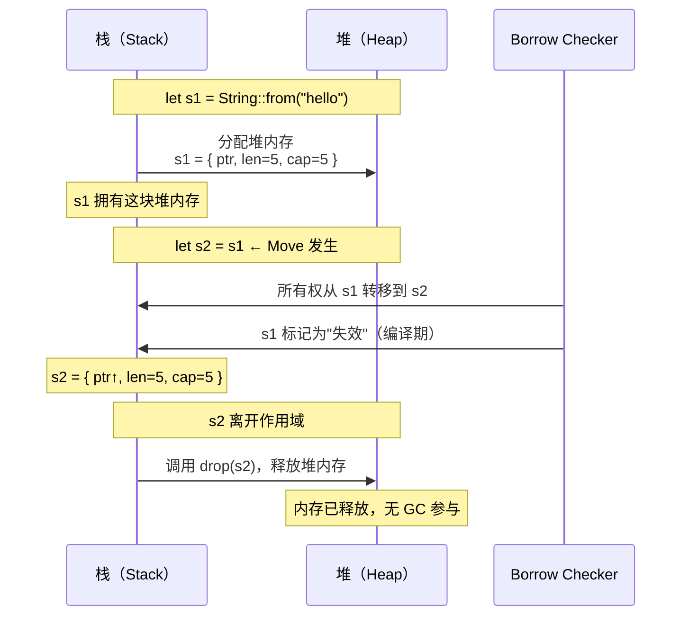

# 03 · 所有权与 Move 语义

## 一、【PM】为什么要有"所有权"？

C# 有 GC：你创建对象，GC 在合适的时候回收内存，你从不关心内存何时释放。

Rust 没有 GC。它用**编译期规则**替代运行时垃圾回收：

- 每块内存有且仅有一个"所有者（Owner）"
- 所有者离开作用域时，内存**立即**释放（调用 `drop()`）
- 如果想"传递"数据，要么**转移所有权（Move）**，要么**借用（Borrow）**

这套规则让 Rust 在**零成本**的前提下实现了内存安全——没有 GC 暂停，没有悬垂指针，没有 use-after-free。

**C# 类比**：想象每个对象都绑定了一个`IDisposable`，且编译器强制保证你绝对不会忘记调用 `Dispose()`，也绝对不会双重释放。

## 二、【Arch】所有权内存模型图



### 栈与堆的区别

| | 栈（Stack）| 堆（Heap）|
|--|-----------|-----------|
| 分配方式 | 编译时确定大小，自动分配 | 运行时动态分配 |
| 速度 | 极快（移动栈指针）| 慢（需要分配器） |
| 所有权规则 | 基本类型（`i32`, `bool`）实现 `Copy`，赋值是复制 | `String`, `Vec` 等，赋值是 Move |
| C# 类比 | 值类型（`int`, `struct`）| 引用类型（`class`，堆分配）|

## 三、【Dev】对比代码：C# vs Rust

### 场景 1：基本类型赋值

```csharp
// C# —— 值类型复制
int a = 5;
int b = a;    // 复制值
Console.WriteLine(a);  // 5，a 仍然有效
```

```rust
// Rust —— i32 实现了 Copy trait，赋值是复制（和 C# 值类型相同）
let a: i32 = 5;
let b = a;   // a 的值被复制给 b（不是 Move，因为 i32: Copy）
println!("{}", a);  // 5，a 仍然有效 ✅
```

### 场景 2：String 赋值（【核心区别】）

```csharp
// C# —— 引用类型赋值是复制引用，两个变量指向同一对象
string s1 = "hello";
string s2 = s1;      // s2 和 s1 指向同一个字符串对象
Console.WriteLine(s1); // ✅ 正常
Console.WriteLine(s2); // ✅ 正常
// GC 最终在两个引用都失效后回收内存
```

```rust
// Rust —— String 赋值是 Move，s1 的所有权转移给 s2
let s1 = String::from("hello");
let s2 = s1;   // ← Move！s1 失效，s2 接管堆内存

// println!("{}", s1);  // ❌ 编译错误：value borrowed here after move
println!("{}", s2);     // ✅ 正常
// s2 离开作用域，堆内存被释放
```

**编译错误原文**：

```
error[E0382]: borrow of moved value: `s1`
 --> src/main.rs:5:20
  |
2 |     let s1 = String::from("hello");
  |         -- move occurs because `s1` has type `String`
3 |     let s2 = s1;
  |              -- value moved here
4 |
5 |     println!("{}", s1);
  |                    ^^ value borrowed here after move
```

### 场景 3：函数参数传递

```csharp
// C# —— 传引用类型，函数内外共享同一对象
static void Print(string s) { Console.WriteLine(s); }

string msg = "hello";
Print(msg);
Console.WriteLine(msg); // ✅ msg 仍然有效
```

```rust
// Rust —— 传 String 默认 Move，函数接管所有权
fn print_string(s: String) {
    println!("{}", s);
}   // ← 函数结束，s 离开作用域，String 被 drop！

let msg = String::from("hello");
print_string(msg);       // msg 的所有权进入函数
// println!("{}", msg);  // ❌ 编译错误：msg 已被 move 进函数
```

**解决方案（三选一）**：

```rust
// 方案A：函数返回所有权（适合函数需要完全接管数据）
fn print_and_return(s: String) -> String {
    println!("{}", s);
    s  // 把所有权还回去
}
let msg = String::from("hello");
let msg = print_and_return(msg); // 重新绑定
println!("{}", msg); // ✅

// 方案B：传引用（最推荐，下一章讲，这里先了解）
fn print_ref(s: &String) {
    println!("{}", s);  // 只读借用，不取得所有权
}
let msg = String::from("hello");
print_ref(&msg);        // 传引用
println!("{}", msg);    // ✅ msg 仍然有效

// 方案C：克隆（有性能开销，谨慎使用）
let msg = String::from("hello");
print_string(msg.clone()); // 深拷贝一份给函数
println!("{}", msg);       // ✅ 原来的 msg 仍然有效
```

### 场景 4：Copy vs Move 的类型

```rust
// 实现了 Copy trait 的类型：赋值是复制（不是Move）
let x: i32 = 5;
let y = x;   // Copy，x y 独立
println!("{} {}", x, y); // ✅

// 基本类型都实现了 Copy：i8 i16 i32 i64 i128 u8 u16 u32 u64 u128
// f32 f64 bool char
// 元组（所有元素都是Copy时）：(i32, bool) 是 Copy

// 没有实现 Copy 的类型：赋值是 Move
// String, Vec<T>, Box<T>, HashMap<K,V>（因为它们拥有堆内存）

// 自定义 struct 默认不是 Copy，需要手动派生：
#[derive(Copy, Clone)]  // 只有所有字段都是 Copy 时才允许派生 Copy
struct Point {
    x: f32,
    y: f32,
}
let p1 = Point { x: 1.0, y: 2.0 };
let p2 = p1;  // Copy（p1 仍然有效）
```

## 四、Rustlings 对应练习

```bash
# 安装 rustlings
cargo install rustlings
rustlings init
cd rustlings

# 运行所有权相关练习
rustlings watch exercises/move_semantics/
```

| 练习文件 | 考察点 |
|---------|--------|
| `move_semantics1.rs` | 基本 Move—将 `Vec` 传入函数后还能用吗 |
| `move_semantics2.rs` | 克隆 vs Move |
| `move_semantics3.rs` | 函数参数的所有权设计 |
| `move_semantics4.rs` | 不用 `.clone()` 的解法 |
| `move_semantics5.rs` | 引用 vs 所有权混合场景 |

## 五、Rust by Example 速查

对应章节：[Rust by Example - 4. Ownership and Moves](https://doc.rust-lang.org/rust-by-example/scope/move.html)

核心示例（官方）：

```rust
// Rust by Example 4.1：Ownership and moves
fn destroy_box(c: Box<i32>) {
    println!("Destroying a box that contains {}", c);
    // 函数结束，c 被销毁（drop），堆内存释放
}

fn main() {
    let x = 5u32;         // 栈上数据
    let y = x;            // 复制（i32 是 Copy）
    println!("x={}, y={}", x, y); // 两个都有效

    let a = Box::new(5i32); // 堆分配
    println!("a contains: {}", a);

    let b = a;            // a 的所有权 Move 给 b
    // println!("{}", a); // ❌ a 失效
    destroy_box(b);       // b 的所有权 Move 进函数，函数结束后释放
    // destroy_box(b);    // ❌ 不能再次 Move 已失效的 b
}
```

## 六、【QA】常见编译错误

| Error Code | 含义 | 触发场景 | 修复方案 |
|-----------|------|---------|---------|
| E0382 | move 后使用 | `let s2=s1; println!("{}", s1);` | 改用 `&s1`（借用）或 `s1.clone()` |
| E0505 | 所有权在借用期间被 Move | 函数持有借用时 Move 外部变量 | 先结束借用，再 Move |
| E0507 | 无法 Move 已借用的数据 | `*ref = val` 移动解引用值 | 使用 `std::mem::replace` |

## 七、【QA】自测题

**Q1**：以下代码能编译吗？

```rust
let v1 = vec![1, 2, 3];
let v2 = v1;
println!("{:?}", v1);
```

A. 能编译，打印 `[1, 2, 3]`  
B. 编译错误：`v1` 在 Move 后使用  
C. 运行时 panic  
D. 能编译，但 `v1` 打印为空

<details><summary>答案</summary>

**B**。`Vec<i32>` 没有实现 `Copy`（因为它拥有堆内存），所以 `let v2 = v1` 触发 Move，`v1` 之后不再有效。C# 中 `List<int>` 赋值只是复制引用，两个变量都能继续使用。

</details>

**Q2**：下面哪种类型在赋值时是 Copy（不是 Move）？

```rust
let a = 42i32;
let b = String::from("hi");
let c = vec![1, 2];
let d = (1i32, true);
```

A. 只有 `a`  
B. `a` 和 `b`  
C. `a` 和 `d`  
D. 全部都是 Copy

<details><summary>答案</summary>

**C**。`i32` 实现了 `Copy`；`(i32, bool)` 中所有字段都是 `Copy`，所以元组也是 `Copy`。`String` 和 `Vec<i32>` 拥有堆内存，是 Move 语义。

</details>

**Q3**：如何在不 clone 的情况下，让函数使用 `String` 而不夺走调用者的所有权？

A. 把 `String` 改成 `str`  
B. 传 `&String`（不可变引用），函数声明接受 `&String`  
C. 传 `&str`（字符串切片），更惯用  
D. B 和 C 都可以，C 更惯用

<details><summary>答案</summary>

**D**。`&String` 和 `&str` 都是借用，不转移所有权。但 Rust 惯用法更推荐接受 `&str`，因为它既接受 `&String`（自动解引用），又接受字符串字面量 `"hello"`，API 更通用。

</details>
