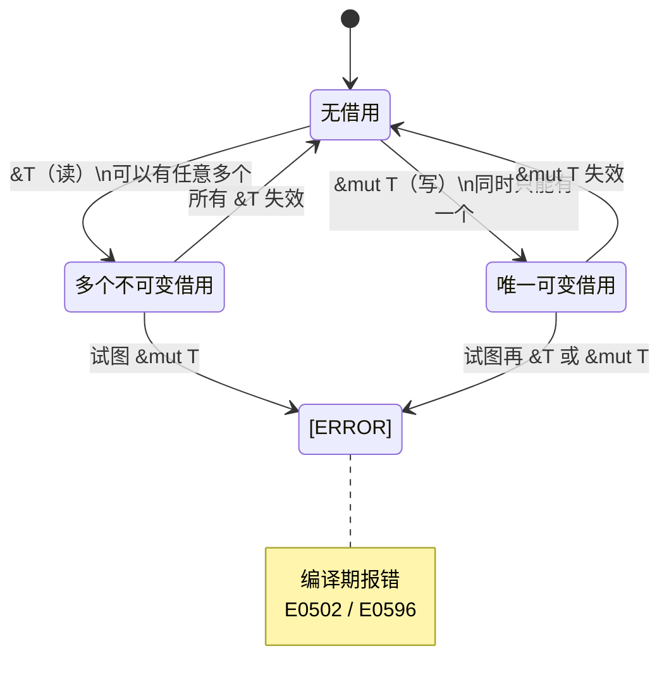

# 04 · 借用与引用规则

## 一、【PM】为什么需要"借用"？

上一章学了 Move：把数据"给"函数后，调用者就不能再用了。但现实中最常见的需求是**"让函数看一眼，但我还要用"**——这就是借用（Borrow）。

借用规则解决了 C 语言中最常见的两类内存 bug：
- **悬垂引用（dangling pointer）**：引用指向的数据已被释放
- **数据竞争（data race）**：多个线程同时读写同一内存

Rust 的借用检查器在**编译期**就排除这两类 bug，代价为零（无运行时开销）。

**C# 类比**：C# 的 `ref` 参数类似不可变引用，但编译器不做严格的生命周期检查；C# 7+ 的 `ref struct` + `Span<T>` 开始引入类似概念，但不如 Rust 系统化。

---

## 二、【Arch】借用规则内存模型



**两条核心规则**（同时必须满足）：

```
规则 1：同一时间，可以有无数个不可变引用（&T）OR 唯一一个可变引用（&mut T）
规则 2：引用的生命周期 ⊆ 被引用数据的生命周期（防止悬垂引用）
```

---

## 三、【Dev】对比代码：C# vs Rust

### 场景 1：不可变引用（只读借用）

```csharp
// C# — 传引用类型不转移所有权（引用语义）
static int Sum(List<int> numbers) {   // 只读，但无编译保证不会修改
    return numbers.Sum();
}
var list = new List<int> { 1, 2, 3 };
Console.WriteLine(Sum(list));      // ✅
Console.WriteLine(list.Count);    // ✅ list 仍可用（C# 引用语义）
```

```rust
// Rust — &T：不可变引用，编译器保证函数内不能修改
fn sum(numbers: &Vec<i32>) -> i32 {   // 接受不可变引用
    numbers.iter().sum()
}
// 更 Rust 惯用法：接受 &[i32] 切片（更通用）
fn sum_slice(numbers: &[i32]) -> i32 {
    numbers.iter().sum()
}

let nums = vec![1, 2, 3];
println!("{}", sum(&nums));       // 传引用（不转移所有权）
println!("{:?}", nums);           // ✅ nums 仍然有效
// sum 函数签名中没有 &mut，编译器保证函数内部不能修改 nums
```

### 场景 2：可变引用

```csharp
// C# — ref 参数（可变）
static void AddOne(ref int value) {
    value += 1;
}
int x = 5;
AddOne(ref x);
Console.WriteLine(x);   // 6
```

```rust
// Rust — &mut T：可变引用，编译器保证同时只有一个
fn add_one(value: &mut i32) {
    *value += 1;   // * 解引用，修改实际值（C# ref 隐式解引用）
}
let mut x = 5;      // 必须声明 mut，才能传 &mut
add_one(&mut x);    // 显式传 &mut
println!("{}", x);  // 6 ✅
```

### 场景 3：借用规则冲突（核心难点）

```rust
let mut s = String::from("hello");

let r1 = &s;         // 不可变借用 #1
let r2 = &s;         // 不可变借用 #2（多个不可变借用 OK）
println!("{} {}", r1, r2);  // ✅ 最后使用 r1、r2 的位置

// 关键：r1 和 r2 在上面 println! 之后生命周期结束（NLL：Non-Lexical Lifetimes）
let r3 = &mut s;     // ✅ 可以：r1 r2 已失效，现在可以创建可变借用
println!("{}", r3);
```

```rust
// ❌ 错误示例：不可变和可变借用同时存在
let mut s = String::from("hello");
let r1 = &s;          // 不可变借用
let r2 = &mut s;      // ❌ 编译错误：r1 还活着
println!("{} {}", r1, r2);
```

**编译错误原文**：

```
error[E0502]: cannot borrow `s` as mutable because it is also borrowed as immutable
 --> src/main.rs:5:14
  |
3 |     let r1 = &s;
  |              -- immutable borrow occurs here
4 |     let r2 = &mut s;
  |              ^^^^^^ mutable borrow occurs here
5 |     println!("{} {}", r1, r2);
  |                       -- immutable borrow later used here
```

### 场景 4：悬垂引用（编译期阻止）

```csharp
// C# — 这段代码不会有问题（GC 保活对象）
static string GetString() {
    var s = "hello";
    return s;   // GC 不会回收，因为还有引用
}
```

```rust
// Rust — 尝试返回局部变量的引用：编译失败
// ❌ 这段代码无法编译
fn dangle() -> &String {            // 想返回 String 的引用
    let s = String::from("hello");  // s 在函数内创建
    &s                              // 试图返回 s 的引用
}   // ← s 在这里被 drop，引用将指向已释放内存 → 编译器拒绝

// ✅ 正确做法：返回所有权（不返回引用）
fn no_dangle() -> String {
    let s = String::from("hello");
    s   // 转移所有权给调用方，s 不在这里 drop
}
```

**编译错误原文**：

```
error[E0106]: missing lifetime specifier
 --> src/main.rs:1:16
  |
1 | fn dangle() -> &String {
  |                ^ expected named lifetime parameter
help: consider using the `'static` lifetime, but...
```

### 场景 5：切片（Slice）—— 引用数据的一部分

```csharp
// C# — Span<T> / Memory<T>（.NET 5+）
string s = "hello world";
var span = s.AsSpan(0, 5);   // [0..5) = "hello"
Console.WriteLine(span.ToString());
```

```rust
// Rust — &str 就是字符串切片（&[u8] 的 UTF-8 视图）
let s = String::from("hello world");

let hello = &s[0..5];    // &str 切片：字节 0–4（含）
let world = &s[6..11];   // 等同 &s[6..]（省略结尾时到末尾）
println!("{} {}", hello, world);   // hello world

// 切片的借用特性：与原 String 共享内存，零拷贝
// 切片有效期内，不能修改原 String
let mut s = String::from("hello");
let slice = &s[0..3];       // 不可变借用
// s.push_str(" world");   // ❌ 编译错误：s 被 slice 借用着
println!("{}", slice);      // 先用完 slice，借用结束
s.push_str(" world");       // ✅ 现在 slice 已失效，可以修改
```

---

## 四、Rustlings 对应练习

```bash
rustlings watch exercises/borrowing/
```

| 练习文件 | 考察点 |
|---------|--------|
| `borrowing1.rs` | 函数接受引用，调用方保留所有权 |
| `borrowing2.rs` | 可变引用的唯一性规则 |
| `quiz2.rs` | 综合：所有权 + 借用选择 |

---

## 五、Rust by Example 速查

对应章节：[4.3 Borrowing](https://doc.rust-lang.org/rust-by-example/scope/borrow.html)

```rust
// Rust by Example 核心示例
fn borrow(s: &String) { println!("{}", s); }   // 借用
fn mutate(s: &mut String) { s.push_str(" world"); }

fn main() {
    let mut s = String::from("hello");
    borrow(&s);          // 不可变借用，s 仍然有效
    mutate(&mut s);      // 可变借用，完成后 s = "hello world"
    println!("{}", s);   // ✅
}
```

---

## 六、【QA】常见编译错误

| Error Code | 含义 | 触发 | 修复 |
|-----------|------|------|------|
| E0502 | 不可变借用期间试图创建可变借用 | `let r1=&s; let r2=&mut s;` | 确保 r1 最后使用点在 r2 之前 |
| E0596 | 对不可变变量解引用赋值 | `fn f(s: &String) { *s = ...; }` | 改为 `&mut String` |
| E0515 | 返回对局部变量的引用 | `fn f() -> &T { let x = ...; &x }` | 返回 `T`（转移所有权） |
| E0308 | 类型不匹配（传了 T，期望 &T）| `f(s)` 而函数期望 `f(s: &String)` | 改为 `f(&s)` |

---

## 七、【QA】自测题

**Q1**：以下代码能编译吗？

```rust
let mut v = vec![1, 2, 3];
let first = &v[0];           // 不可变借用
v.push(4);                   // 可变操作
println!("{}", first);
```

A. 能编译，打印 1  
B. 编译错误：不可变借用和可变操作冲突  
C. 运行时 panic  
D. 能编译，但 first 指向的值变了

<details><summary>答案</summary>

**B**。`v.push(4)` 需要对 `v` 的可变借用，但此时 `first` 持有 `v[0]` 的不可变借用，两者冲突。即使写 `println!` 在 `push` 之前也不行，因为借用持续到最后使用点（`println!`）。

注意：这个规则不是纯粹为了防止"使用旧值"，而是因为 `push` 可能触发 Vec 的内存重新分配，导致 `first` 变成悬垂引用——这才是真正的安全隐患。C# 的 `List<T>` 在遍历期间修改会在运行时抛 `InvalidOperationException`（运行时检查），Rust 在编译期阻止（更安全、零开销）。

</details>

**Q2**：以下两种写法哪个更符合 Rust 惯用法？

```rust
// 写法 A
fn print_len(s: &String) { println!("{}", s.len()); }

// 写法 B
fn print_len(s: &str) { println!("{}", s.len()); }
```

A. 写法 A，类型更明确  
B. 写法 B，更通用（能接受 &String、字面量、切片）  
C. 两者等价  
D. 写法 A，性能更好

<details><summary>答案</summary>

**B**。`&str` 更通用：它能接受 `&String`（自动解引用 coercion）、`"hello"` 字面量（`&'static str`）、任何字符串切片。`&String` 只接受 `String` 的引用。函数参数"接受最宽泛的输入"是 Rust 惯用法（对数组用 `&[T]` 而非 `&Vec<T>`，对字符串用 `&str` 而非 `&String`）。

</details>

**Q3**：下面代码中，`r3` 的创建为什么是合法的？

```rust
let mut s = String::from("hello");
let r1 = &s;
let r2 = &s;
println!("{} {}", r1, r2);   // r1、r2 最后使用点
let r3 = &mut s;             // 这行合法吗？
println!("{}", r3);
```

A. 不合法，r1 r2 还没离开作用域（大括号没闭合）  
B. 合法，因为 r1 r2 在 println! 之后不再被使用（NLL）  
C. 不合法，mut 和不可变引用不能在同一函数中共存  
D. 合法，但会产生未定义行为

<details><summary>答案</summary>

**B**。Rust 2018+ 引入了 **NLL（Non-Lexical Lifetimes）**：引用的有效范围不再以词法大括号为界，而是到**最后一次使用点**。`r1` 和 `r2` 最后被使用是在第一个 `println!`，之后借用失效，所以 `r3 = &mut s` 是合法的。如果把最后的 `println!("{}", r3)` 改成 `println!("{} {}", r1, r3)`，就会编译失败。

</details>
