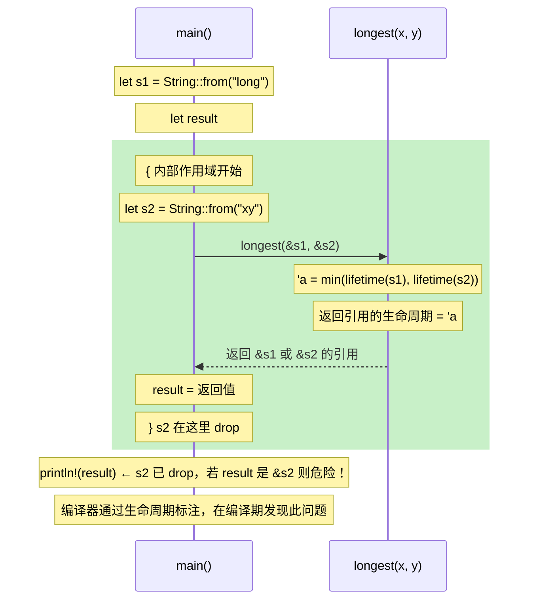

# 05 · 生命周期标注

## 一、【PM】为什么需要生命周期标注？

生命周期是 Rust 中最让 C# 开发者感到陌生的概念——因为 C# 里根本不存在这个东西（GC 替你管了）。

**生命周期解决的核心问题**：当函数返回一个引用时，编译器需要知道"这个引用来自哪个输入参数"——只有这样才能验证返回引用的有效期不超过数据本身。

大多数情况下，编译器能**自动推断（lifetime elision）**，你不需要手写标注。只有当函数有**多个引用参数**且**返回引用**时，编译器需要你帮它说清楚。

**一句话理解**：生命周期标注不改变任何运行时行为，它只是在告诉编译器"这个输出引用的有效期和哪个输入参数一样"。

---

## 二、【Arch】生命周期作用域图



**生命周期省略规则（Elision Rules）**——以下情况不需要手写标注：

```
规则 1：每个引用参数都有自己独立的生命周期
规则 2：如果只有一个引用参数，返回值的生命周期等于该参数
规则 3：如果有 &self 或 &mut self 参数，返回值生命周期等于 self
```

---

## 三、【Dev】对比代码：C# 没有，Rust 有

### 场景 1：为什么需要标注——最长字符串函数

```csharp
// C# — 不需要考虑生命周期（GC 保活）
static string Longest(string x, string y) {
    return x.Length >= y.Length ? x : y;
}
```

```rust
// Rust — 返回引用时需要标注：返回值来自 x 还是 y？
// ❌ 没有标注，编译器无法推断返回引用的来源
fn longest(x: &str, y: &str) -> &str {   // 编译错误
    if x.len() >= y.len() { x } else { y }
}

// ✅ 加上 'a：告诉编译器"返回值的生命周期和 x、y 中较短的一样"
fn longest<'a>(x: &'a str, y: &'a str) -> &'a str {
    if x.len() >= y.len() { x } else { y }
}

// 使用
fn main() {
    let s1 = String::from("long string");
    let result;
    {
        let s2 = String::from("xyz");
        result = longest(s1.as_str(), s2.as_str());
        println!("{}", result);   // ✅ 在 s2 有效期内使用
    }
    // println!("{}", result);   // ❌ s2 已 drop，result 可能是 &s2 → 编译错误
}
```

**关键理解**：`'a` 不是具体的时间长度，它是一个**约束**：返回值的有效期 ≤ x 和 y 中较短的那个。

### 场景 2：结构体中的生命周期

```csharp
// C# — 结构体包含 string 引用是常规操作
class Excerpt {
    public string Part { get; init; }
}
```

```rust
// Rust — 结构体存储引用时，必须标注：该引用来自哪个生命周期
// 'a 表示："只要 part 引用有效，Excerpt 就有效"
struct Excerpt<'a> {
    part: &'a str,
}

impl<'a> Excerpt<'a> {
    // 生命周期省略规则 3：有 &self，返回值生命周期等于 self
    fn level(&self) -> i32 { 3 }
    fn announce(&self, announcement: &str) -> &str {
        println!("Attention: {}", announcement);
        self.part   // 返回 &self.part，生命周期由省略规则推断
    }
}

fn main() {
    let novel = String::from("Call me Ishmael. Some years ago...");
    let first_sentence;
    {
        let i = novel.find('.').unwrap_or(novel.len());
        first_sentence = &novel[..i];
    }
    let e = Excerpt { part: first_sentence };
    println!("{}", e.part);   // ✅ novel 仍然有效
}
```

### 场景 3：'static 生命周期

```rust
// 'static：程序整个运行期间都有效（字符串字面量就是 'static）
let s: &'static str = "I have a static lifetime.";
// 字符串字面量存储在二进制的只读数据段，程序存在则永远有效

// 常见误区：函数参数要求 'static 表示"我要永久拥有这个"
// 通常意味着应该用 String（拥有所有权），而不是 &'static str
fn takes_static(s: &'static str) { println!("{}", s); }
// 大多数场景不需要 'static，看到要求 'static 先思考为什么
```

### 场景 4：生命周期 + 泛型 + Trait Bound 组合

```rust
use std::fmt::Display;

// 生命周期、泛型、Trait Bound 可以同时出现（实际工程偶尔会遇到）
fn longest_with_announce<'a, T>(
    x: &'a str,
    y: &'a str,
    ann: T,         // T 是泛型，要求实现 Display
) -> &'a str
where
    T: Display,
{
    println!("Announcement: {}", ann);
    if x.len() >= y.len() { x } else { y }
}
```

### 场景 5：何时不需要标注（省略规则）

```rust
// 规则 1+2：一个输入引用 → 输出生命周期自动等于输入
fn first_word(s: &str) -> &str {
    let bytes = s.as_bytes();
    for (i, &b) in bytes.iter().enumerate() {
        if b == b' ' { return &s[0..i]; }
    }
    &s[..]
}
// 等价于：fn first_word<'a>(s: &'a str) -> &'a str {...}
// 但编译器自动推断，不需要你写

// 规则 3：有 &self → 输出生命周期等于 self
struct Config { value: String }
impl Config {
    fn get(&self) -> &str {   // 返回 &self.value 的引用
        &self.value
    }
    // 等价于：fn get<'a>(&'a self) -> &'a str
}
```

---

## 四、Rustlings 对应练习

```bash
rustlings watch exercises/lifetimes/
```

| 练习文件 | 考察点 |
|---------|--------|
| `lifetimes1.rs` | 为函数返回值添加生命周期标注 |
| `lifetimes2.rs` | 结构体中的生命周期 |
| `lifetimes3.rs` | 综合：多引用参数的生命周期推断 |

---

## 五、Rust by Example 速查

对应章节：[9.1 Scoping rules - Lifetimes](https://doc.rust-lang.org/rust-by-example/scope/lifetime.html)

---

## 六、【QA】常见错误

| Error | 场景 | 根因 | 修复 |
|-------|------|------|------|
| E0106 `missing lifetime specifier` | 函数有多引用参数且返回引用 | 编译器无法推断返回引用的来源 | 添加 `'a` 标注 |
| E0597 `does not live long enough` | 局部变量引用超出其作用域 | 被引用的变量比引用先 drop | 延长变量作用域或改为返回所有权 |
| E0491 `in type... which does not outlive` | 结构体包含引用但未标注生命周期 | 编译器不知道结构体有效期 | `struct Foo<'a> { field: &'a T }` |

---

## 七、【QA】自测题

**Q1**：以下函数需要生命周期标注吗？

```rust
fn greet(name: &str) -> String {
    format!("Hello, {}!", name)
}
```

A. 需要，返回了引用  
B. 不需要，返回的是 `String`（拥有所有权），不是引用  
C. 需要，有 `&str` 参数  
D. 编译错误

<details><summary>答案</summary>

**B**。函数返回的是 `String`（拥有所有权的类型），不是引用。生命周期只在返回**引用**时才需要考虑。

</details>

**Q2**：为什么 `'a` 代表两个引用"中较短的生命周期"？

```rust
fn longest<'a>(x: &'a str, y: &'a str) -> &'a str {
    if x.len() >= y.len() { x } else { y }
}
```

A. Rust 规定 `'a` 总是等于最短的那个  
B. 因为返回值可能是 x 也可能是 y，安全起见取较短的，保证在两者都有效期间使用  
C. `'a` 等于最长的那个  
D. `'a` 是运行时确定的

<details><summary>答案</summary>

**B**。由于返回值可能是 `x` 的引用也可能是 `y` 的引用（运行时决定），编译器必须保守地选择**两者中较短**的生命周期。这样无论实际返回哪个，调用方在使用 result 期间，两者都还有效。

</details>

**Q3**：以下代码能编译吗？

```rust
fn main() {
    let s1 = String::from("long string");
    let result;
    {
        let s2 = String::from("xy");
        result = longest(s1.as_str(), s2.as_str());
    }   // s2 在这里 drop
    println!("{}", result);   // 在 s2 drop 之后使用 result
}
```

A. 能编译，result 实际上是 &s1（更长的那个）  
B. 编译错误：result 的生命周期不能超过 s2  
C. 运行时报错  
D. 能编译，但打印结果不确定

<details><summary>答案</summary>

**B**。虽然运行时 result 确实等于 `&s1`（因为 s1 更长），但编译器在**编译期**不做运行时推断。由于 `longest` 标注 `'a` = min(s1 的生命周期, s2 的生命周期)，而 s2 在 `}` 后失效，所以 `result` 的生命周期也被认为在那里失效。`println!` 在 `}` 之后，编译失败。这正是生命周期标注的价值：在编译期捕获"如果数据以另一种方式组合就会出错"的场景。

</details>
