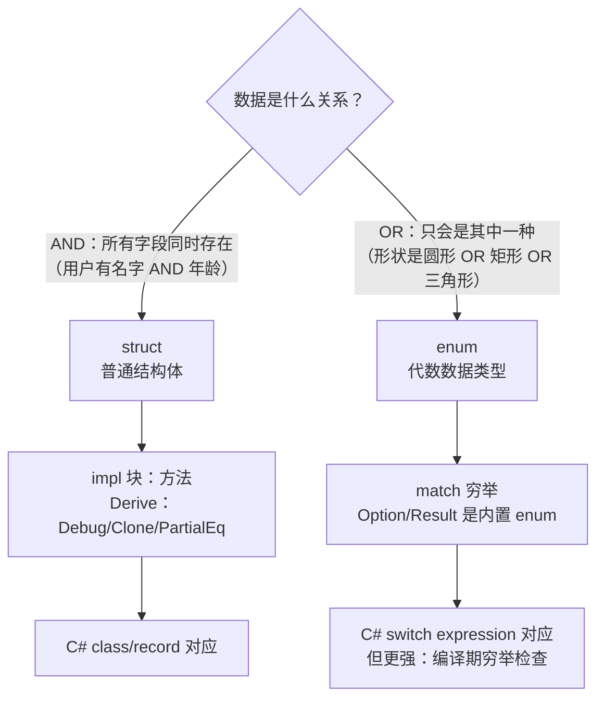

# 06 · 结构体与枚举

## 一、【PM】为什么枚举是 Rust 的核心特性？

C# 的 `enum` 只能是数值（`int`、`long`）的别名，每个变体没有附加数据。Rust 的 `enum` 是**代数数据类型（ADT）**，每个变体可以携带不同类型和数量的数据。

这带来了根本性的改变：`Option<T>`（代替 null）和 `Result<T, E>`（代替异常）都是枚举，`if let`、`match` 的穷举性检查让"忘记处理某个 case"成为编译错误。

C# 8+ 的 `switch expression` + 模式匹配是在向 Rust 靠拢，但 Rust 的类型系统从设计之初就以 ADT 为核心。

---

## 二、【Arch】结构体 vs 枚举适用场景



---

## 三、【Dev】对比代码：C# vs Rust

### 场景 1：基本结构体

```csharp
// C# record（不可变值对象）
public record Point(double X, double Y);
public record struct Point(double X, double Y);  // 值类型 record

// C# class（可变）
public class User {
    public string Name { get; set; }
    public int Age { get; set; }
    public string Email { get; set; }
}
var u = new User { Name = "Mo", Age = 30, Email = "mo@mo.io" };
```

```rust
// Rust struct（默认不可变）
#[derive(Debug, Clone, PartialEq)]  // 自动实现常用 trait
struct User {
    name:  String,
    age:   u32,
    email: String,
}

// 构造：字段名必须全部初始化（无默认值，除非手动实现 Default）
let user1 = User {
    name:  String::from("Mo"),
    age:   30,
    email: String::from("mo@mo.io"),
};

// 结构体更新语法（类比 C# with 表达式）
let user2 = User {
    email: String::from("other@mo.io"),
    ..user1   // 其余字段从 user1 复制/移动
};
// 注意：user1.name 被 Move 进 user2，user1 不再完整有效

// 元组结构体（NewType 模式）
struct Meters(f64);
struct Kilograms(f64);
let distance = Meters(100.0);
// let wrong: Meters = Kilograms(100.0);  // ❌ 类型不同，编译错误
```

### 场景 2：方法（impl 块）

```csharp
// C# — 方法直接在类/记录体内定义
public class Rectangle {
    public double Width { get; }
    public double Height { get; }
    public Rectangle(double w, double h) { Width = w; Height = h; }

    public double Area() => Width * Height;
    public bool IsSquare() => Width == Height;
    public static Rectangle Square(double size) => new(size, size);
}
```

```rust
// Rust — 方法在 impl 块定义（与数据定义分离）
#[derive(Debug)]
struct Rectangle {
    width:  f64,
    height: f64,
}

impl Rectangle {
    // 关联函数（无 self，类似 C# 静态工厂方法）
    fn square(size: f64) -> Self {
        Self { width: size, height: size }
    }

    // 方法（有 &self，不可变借用）—— C# 的普通方法
    fn area(&self) -> f64 {
        self.width * self.height
    }

    fn is_square(&self) -> bool {
        (self.width - self.height).abs() < f64::EPSILON
    }

    // 可变方法（&mut self）
    fn scale(&mut self, factor: f64) {
        self.width  *= factor;
        self.height *= factor;
    }
}

let r = Rectangle::square(5.0);      // 关联函数：用 :: 调用
println!("{}", r.area());            // 方法：用 . 调用，自动解引用
let mut r2 = Rectangle { width: 3.0, height: 4.0 };
r2.scale(2.0);
```

### 场景 3：枚举——代数数据类型

```csharp
// C# — oneOf 通常用抽象类层次或 discriminated union 库实现
public abstract record Shape;
public record Circle(double Radius) : Shape;
public record Rectangle(double W, double H) : Shape;
public record Triangle(double Base, double Height) : Shape;

double Area(Shape s) => s switch {
    Circle c     => Math.PI * c.Radius * c.Radius,
    Rectangle r  => r.W * r.H,
    Triangle t   => 0.5 * t.Base * t.Height,
    _            => throw new ArgumentException("unknown shape")
};
```

```rust
// Rust — enum 原生支持代数数据类型，每个变体可带不同数据
#[derive(Debug)]
enum Shape {
    Circle   { radius: f64 },           // 具名字段
    Rectangle { width: f64, height: f64 },
    Triangle(f64, f64),                 // 元组形式（base, height）
}

impl Shape {
    fn area(&self) -> f64 {
        match self {
            Shape::Circle { radius }            => std::f64::consts::PI * radius * radius,
            Shape::Rectangle { width, height }  => width * height,
            Shape::Triangle(base, height)       => 0.5 * base * height,
            // 不需要 _ 分支：match 要求穷举，漏掉任何变体编译报错
        }
    }
}

let shapes = vec![
    Shape::Circle { radius: 3.0 },
    Shape::Rectangle { width: 4.0, height: 5.0 },
    Shape::Triangle(6.0, 8.0),
];
for s in &shapes {
    println!("{:?} area = {:.2}", s, s.area());
}
```

### 场景 4：Option\<T\>——代替 null

```csharp
// C# — nullable 可空类型
string? name = null;
int length = name?.Length ?? 0;          // null 条件运算符
string upper = name?.ToUpper() ?? "N/A"; // ?. 和 ??
```

```rust
// Rust — Option<T>，强制处理 None（无 null）
let name: Option<String> = None;

// 方式 1：match 完整处理（最显式）
match &name {
    Some(n) => println!("名字：{}", n),
    None    => println!("无名字"),
}

// 方式 2：if let（只关心 Some 的情况）— 类比 C# is 模式
if let Some(n) = &name {
    println!("名字：{}", n);
}

// 方式 3：unwrap_or（提供默认值）— 类比 C# ??
let length = name.as_ref().map(|s| s.len()).unwrap_or(0);

// 方式 4：? 运算符（在返回 Option 的函数中传播 None）— 类比 C# if (x == null) return null
fn get_username(id: u32) -> Option<String> {
    let user = find_user(id)?;   // None 时直接返回 None
    Some(user.name)
}
```

### 场景 5：match 模式匹配详解

```rust
let number = 13;

// match 是表达式，返回值
let description = match number {
    1            => "one",
    2 | 3 | 5    => "prime",       // 多值 OR
    4..=12       => "small",       // 范围（含两端）
    n if n < 0   => "negative",   // 守卫条件
    _            => "other",       // 通配符（必须穷举）
};
println!("{} is {}", number, description);

// 解构 struct
let p = Point { x: 0, y: 7 };
let Point { x, y } = p;   // 解构绑定
println!("{} {}", x, y);

// 解构 enum + 绑定值
enum Message {
    Quit,
    Move { x: i32, y: i32 },
    Write(String),
    ChangeColor(i32, i32, i32),
}

fn process(msg: Message) {
    match msg {
        Message::Quit              => println!("quit"),
        Message::Move { x, y }    => println!("move to ({}, {})", x, y),
        Message::Write(text)       => println!("write: {}", text),
        Message::ChangeColor(r, g, b) => println!("color: {},{},{}", r, g, b),
    }
}
```

---

## 四、Rustlings 对应练习

```bash
rustlings watch exercises/structs/
rustlings watch exercises/enums/
```

| 练习文件 | 考察点 |
|---------|--------|
| `structs1.rs`–`structs3.rs` | 定义、方法、Display impl |
| `enums1.rs`–`enums3.rs` | 枚举定义、Option、match |
| `quiz3.rs` | 综合 struct + enum + match |

---

## 五、Rust by Example 速查

对应章节：[3. Custom Types](https://doc.rust-lang.org/rust-by-example/custom_types.html)

---

## 六、【QA】常见错误

| 错误 | 触发 | 修复 |
|------|------|------|
| `non-exhaustive patterns` | match 漏了某个枚举变体 | 补齐所有变体或加 `_` 通配符 |
| `cannot move out of shared reference` | match `&MyEnum` 时试图 Move 内部值 | 在 `&self` 的 match 中用引用模式 `&MyEnum::Foo(ref v)` 或 derive `Clone` |
| `struct update syntax moves the whole struct` | `..other` 后 other 含 non-Copy 字段 | 手动 clone 需要的字段，或让 struct 实现 Clone |
| `expected struct X, found enum variant X::Y` | 直接用变体名当类型 | 用完整路径 `Shape::Circle` 或 `use Shape::*` |

---

## 七、【QA】自测题

**Q1**：以下枚举 `Coin` 中，match 语句覆盖了哪些变体才能编译通过？

```rust
enum Coin { Penny, Nickel, Dime, Quarter(String) }

fn value(coin: Coin) -> u32 {
    match coin {
        Coin::Penny   => 1,
        Coin::Nickel  => 5,
        Coin::Dime    => 10,
        // Coin::Quarter 未处理
    }
}
```

A. 可以编译，未匹配的变体返回 0  
B. 编译错误：`non-exhaustive patterns: Coin::Quarter(_) not covered`  
C. 运行时 panic  
D. 可以编译，但行为未定义

<details><summary>答案</summary>

**B**。Rust 的 `match` 要求**穷举**所有可能变体，漏掉任何一个都是编译错误（不是运行时错误）。这是 ADT + 穷举检查的核心价值：重构时新增枚举变体，所有未处理的 match 都会报错，不会遗漏。修复：加 `Coin::Quarter(state) => 25`。

</details>

**Q2**：`Option<T>` 和 C# 的 `T?` 最本质的区别是什么？

A. Option 性能更好  
B. C# 的 `T?` 只有在编译时开启 nullable 检查才有效果；Rust 的 `Option` 是类型系统的一部分，在任何情况下都必须显式处理  
C. Option 只用于引用类型，T? 可以用于值类型  
D. 没有区别，只是语法不同

<details><summary>答案</summary>

**B**。C# 的 nullable 注解（`string?`）是可选的，可以通过 `#nullable disable` 关闭，或用 `null!` 表达式忽略。Rust 没有 null，`Option<T>` 是类型系统强制要求——代码不处理 `None` 就无法编译，无论是否开启任何编译器选项。

</details>

**Q3**：以下代码中 `if let` 的语义是什么？

```rust
let config: Option<&str> = Some("production");
if let Some(env) = config {
    println!("env: {}", env);
}
```

A. 如果 config 不等于 None，就执行 if 块  
B. 等同于：如果 config 模式匹配 `Some(env)`，则绑定 env 并执行 if 块  
C. 总是执行 if 块，env 绑定到 None 时为空字符串  
D. 是语法糖，等同于 `config.unwrap()`

<details><summary>答案</summary>

**B**。`if let Some(env) = config` 是模式匹配的简化写法，等同于：
```rust
match config {
    Some(env) => { println!("env: {}", env); }
    None      => {}   // 不关心 None 时用 if let
}
```
`env` 只在 `Some` 时绑定，`None` 时整个 if 块跳过。

</details>
