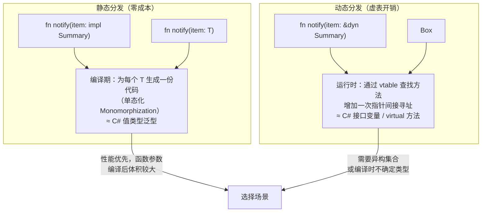

# 07 · Trait 与泛型

## 一、【PM】Trait 比 interface 强在哪？

C# 的 `interface` 只能对**类/结构体**定义约束；Rust 的 `trait` 可以**为任何类型实现**，甚至包括已有类型（孤儿规则允许的情况下）。

三个核心优势：

1. **默认实现**：C# 8 才加，Rust 从诞生起就有
2. **Blanket impl**：为所有满足条件的类型批量实现 trait，无需修改具体类
3. **零成本抽象**：静态分发（`impl Trait`/泛型）在编译期解析，无运行时开销；只有 `dyn Trait` 才有虚表开销
   
泛型 + Trait Bound = C# 的泛型约束（`where T : IComparable<T>`），但 Rust 在**单态化（monomorphization）**时为每个类型生成专门代码，不依赖 JIT。

---

## 二、【Arch】静态分发 vs 动态分发



---

## 三、【Dev】对比代码：C# vs Rust

### 场景 1：定义和实现 Trait

```csharp
// C# — interface + 默认实现（C# 8+）
public interface ISummary {
    string Summary();
    string Preview() => Summary()[..50] + "...";    // 默认实现
}

public class Article : ISummary {
    public string Title { get; set; }
    public string Content { get; set; }
    public string Summary() => $"{Title}: {Content[..100]}";
}
```

```rust
// Rust — trait + 默认实现
pub trait Summary {
    /// 生成摘要（必须实现）
    fn summary(&self) -> String;

    /// 预览（有默认实现，子类可覆盖）
    fn preview(&self) -> String {
        format!("{}...", &self.summary()[..50.min(self.summary().len())])
    }
}

#[derive(Debug)]
struct Article {
    title:   String,
    content: String,
}

impl Summary for Article {
    fn summary(&self) -> String {
        format!("{}: {}", self.title, &self.content[..100.min(self.content.len())])
    }
    // preview() 使用默认实现，无需覆盖
}

#[derive(Debug)]
struct Tweet {
    username: String,
    content:  String,
}

impl Summary for Tweet {
    fn summary(&self) -> String {
        format!("{}: {}", self.username, self.content)
    }
    // 覆盖默认 preview
    fn preview(&self) -> String {
        format!("Tweet by @{}", self.username)
    }
}
```

### 场景 2：Trait 作为参数（静态分发）

```csharp
// C# — 泛型约束
static void Notify<T>(T item) where T : ISummary {
    Console.WriteLine($"Breaking news! {item.Summary()}");
}

// 或用接口变量（动态分发）
static void Notify(ISummary item) { ... }
```

```rust
// 写法 1：impl Trait（语法糖，推荐用于简单场景）
pub fn notify(item: &impl Summary) {
    println!("Breaking news! {}", item.summary());
}

// 写法 2：泛型 + Trait Bound（等价，多参数时用）
pub fn notify_generic<T: Summary>(item: &T) {
    println!("Breaking news! {}", item.summary());
}

// 写法 3：where 子句（多约束时更清晰）
pub fn notify_where<T>(item: &T)
where
    T: Summary + std::fmt::Debug,   // T 同时满足多个约束
{
    println!("{:?} summary: {}", item, item.summary());
}

// 写法 4：动态分发（运行时多态，异构集合必须用）
pub fn notify_dyn(item: &dyn Summary) {
    println!("{}", item.summary());
}

// 使用
let article = Article { title: "Rust".into(), content: "awesome".into() };
let tweet   = Tweet { username: "mo".into(), content: "hello".into() };

notify(&article);
notify(&tweet);

// 异构集合（只能用 dyn）
let items: Vec<Box<dyn Summary>> = vec![
    Box::new(article),
    Box::new(tweet),
];
for item in &items { println!("{}", item.summary()); }
```

### 场景 3：返回 impl Trait

```csharp
// C# — 通常返回接口类型（动态分发）
ISummary CreateSummary() => new Article { ... };
```

```rust
// Rust — 返回 impl Trait（静态分发，但调用方不知道具体类型）
fn create_article() -> impl Summary {
    Article {
        title:   "Rust is Great".into(),
        content: "Here's why...".into(),
    }
}
// 注意：同一函数不能根据条件返回不同具体类型（用 Box<dyn> 解决）

// 返回 Box<dyn Trait>（运行时多态）
fn make_summary(use_tweet: bool) -> Box<dyn Summary> {
    if use_tweet {
        Box::new(Tweet { username: "mo".into(), content: "hi".into() })
    } else {
        Box::new(Article { title: "hello".into(), content: "world".into() })
    }
}
```

### 场景 4：Blanket Implementation

```rust
// 为所有实现了 Display 的类型，自动实现 Summary
// C# 无法做到（不能为已有类型的接口做批量 blanket impl）
use std::fmt::Display;

impl<T: Display> Summary for T {
    fn summary(&self) -> String {
        self.to_string()
    }
}

// 现在 i32、String、f64 都自动有了 summary() 方法（因为它们都实现了 Display）
println!("{}", 42i32.summary());       // "42"
println!("{}", "hello".summary());    // "hello"
```

### 场景 5：常用标准库 Trait

```rust
// Display — 用户可读的字符串（类比 C# ToString()）
use std::fmt;
impl fmt::Display for Point {
    fn fmt(&self, f: &mut fmt::Formatter<'_>) -> fmt::Result {
        write!(f, "({}, {})", self.x, self.y)
    }
}

// From / Into — 类型转换（类比 C# implicit/explicit operator）
impl From<(f64, f64)> for Point {
    fn from((x, y): (f64, f64)) -> Self { Self { x, y } }
}
let p: Point = (1.0, 2.0).into();   // Into 由 From 自动实现

// Iterator — 迭代器（下一章详解）
// Clone — 深拷贝
// PartialEq / Eq — 相等性比较（类比 IEquatable<T>）
// PartialOrd / Ord — 大小比较（类比 IComparable<T>）
// Hash — 哈希（用于 HashMap key，类比 GetHashCode）
// Default — 默认值（类比 new T()）

// 一键 derive 常用 trait
#[derive(Debug, Clone, PartialEq, Eq, Hash, Default)]
struct Point { x: i32, y: i32 }
```

### 场景 6：泛型结构体

```csharp
// C# — 泛型类
public class Pair<T> {
    public T First { get; }
    public T Second { get; }
    public Pair(T first, T second) { First = first; Second = second; }
}
```

```rust
// Rust — 泛型结构体
struct Pair<T> {
    first:  T,
    second: T,
}

impl<T> Pair<T> {
    fn new(first: T, second: T) -> Self {
        Self { first, second }
    }
}

// 只有当 T 实现了特定 trait 时，才有这个方法
impl<T: std::fmt::Display + PartialOrd> Pair<T> {
    fn cmp_display(&self) {
        if self.first >= self.second {
            println!("largest: {}", self.first);
        } else {
            println!("largest: {}", self.second);
        }
    }
}

let pair = Pair::new(5, 10);
pair.cmp_display();   // ✅ i32 实现了 Display + PartialOrd
```

---

## 四、Rustlings 对应练习

```bash
rustlings watch exercises/traits/
rustlings watch exercises/generics/
```

| 练习文件 | 考察点 |
|---------|--------|
| `traits1.rs` | 为类型实现 trait |
| `traits2.rs` | 默认方法实现 |
| `traits3.rs` | Trait 作为参数 |
| `traits4.rs` | 返回 impl Trait |
| `traits5.rs` | 多 Trait Bound |
| `generics1.rs`–`generics2.rs` | 泛型函数、泛型结构体 |

---

## 五、Rust by Example 速查

对应章节：[14. Traits](https://doc.rust-lang.org/rust-by-example/trait.html)

---

## 六、【QA】常见错误

| 错误 | 触发 | 修复 |
|------|------|------|
| `the trait ... cannot be made into an object` | 把含关联函数（无 self）的 trait 用作 `dyn T` | 把关联函数改为有 `self` 的方法，或用泛型 |
| `trait bound ... not satisfied` | 泛型参数 T 未实现所需 trait | 在泛型签名加 `T: TraitName` |
| `cannot return impl Trait from this function` | 条件返回不同具体类型 | 改用 `Box<dyn Trait>` |
| `only auto traits can be used as additional traits in a trait object` | `Box<dyn Trait1 + Trait2>` 第二个 trait 不是 auto trait | 创建新 trait 继承两者：`trait Combined: Trait1 + Trait2 {}` |

---

## 七、【QA】自测题

**Q1**：以下两种写法有什么核心区别？

```rust
fn f1(item: &impl Summary) { ... }
fn f2(item: &dyn Summary) { ... }
```

A. 写法相同，只是语法糖  
B. `impl Trait` 是静态分发（编译期确定类型），`dyn Trait` 是动态分发（运行时虚表）  
C. `dyn Trait` 性能更好  
D. `impl Trait` 只能用于参数，`dyn Trait` 只能用于返回值

<details><summary>答案</summary>

**B**。`impl Trait`（等同于泛型）在编译期为每个传入类型生成特化代码（单态化），无运行时开销，但二进制体积稍大。`dyn Trait` 通过虚函数表（vtable）在运行时查找方法，有一次额外的指针间接寻址，但允许异构集合（`Vec<Box<dyn Summary>>`）。

</details>

**Q2**：Rust 的 `trait` 相比 C# 的 `interface`，最大的额外能力是什么？

A. trait 支持字段  
B. trait 可以为**已有外部类型**实现（只要不违反孤儿规则）  
C. trait 性能更好  
D. trait 可以多继承

<details><summary>答案</summary>

**B**。孤儿规则（Orphan Rule）：在 crate A 中，可以为 crate A 定义的类型实现任何 trait，也可以为任何类型实现 crate A 定义的 trait；但不能为**外部类型**实现**外部 trait**。这允许例如：为标准库的 `Vec<T>` 在你自己的 crate 中实现你自定义的 `Summary` trait，C# 无法做到（无法为 `List<T>` 实现你自己的接口，除非继承）。

</details>

**Q3**：以下 `largest` 函数有什么问题？

```rust
fn largest<T>(list: &[T]) -> T {
    let mut largest = list[0];   // ← 问题
    for &item in list.iter() {
        if item > largest { largest = item; }
    }
    largest
}
```

A. 没问题，可以编译  
B. 编译错误：T 不一定实现了 `PartialOrd`（`>` 操作符需要）  
C. 编译错误：T 不一定实现了 `Copy`（赋值 `list[0]` 可能是 Move）  
D. B 和 C 都对：需要 `T: PartialOrd + Copy`

<details><summary>答案</summary>

**D**。需要两个约束：
1. `T: PartialOrd`：`>` 运算符需要此 trait
2. `T: Copy`：`list[0]` 是 Move（对不实现 Copy 的类型），从借用切片中 Move 会报错；实现 Copy 后才能按值复制

修复：`fn largest<T: PartialOrd + Copy>(list: &[T]) -> T`

</details>
