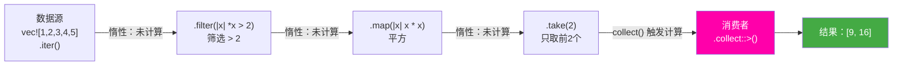

# 09 · 迭代器与闭包

## 一、【PM】Rust 迭代器 = 零成本 LINQ

C# 开发者最熟悉的 LINQ（`Where` / `Select` / `Aggregate`）在 Rust 中有直接对应：`filter` / `map` / `fold`。但有一个关键区别：

**Rust 的迭代器是惰性的，且在编译期单态化为等效的 for 循环代码——没有任何运行时开销。**

C# 的 LINQ 也是惰性的，但通过 `IEnumerable<T>` 接口调用，有虚调用开销（不过 JIT 能优化很多）。Rust 的迭代器通过泛型 + 内联完全消除这层开销，这就是"零成本抽象"的含义。

---

## 二、【Arch】迭代器适配器链



**关键原则**：迭代器适配器（`filter`, `map`, `take`...）都是**惰性**的，不计算。只有**消费者**（`collect`, `sum`, `for_each`, `fold`...）才触发计算。

---

## 三、【Dev】对比代码：C# LINQ vs Rust Iterator

### 场景 1：基本 map / filter / collect

```csharp
// C# LINQ
var numbers = new[] { 1, 2, 3, 4, 5 };
var result = numbers
    .Where(n => n % 2 == 0)    // 过滤偶数
    .Select(n => n * n)        // 平方
    .ToList();                 // 触发执行
// [4, 16]
```

```rust
// Rust — 几乎一一对应
let numbers = vec![1, 2, 3, 4, 5];
let result: Vec<i32> = numbers
    .iter()               // 创建不可变引用迭代器（&i32）
    .filter(|&&n| n % 2 == 0)   // 双 & 是因为: iter() 给 &&i32，filter 接受 &&i32
    .map(|&n| n * n)      // 解引用后平方
    .collect();           // 触发计算，收集到 Vec
// [4, 16]

// 更清晰的写法：先 cloned/copied 把 &i32 变成 i32
let result: Vec<i32> = numbers
    .iter()
    .copied()              // &i32 → i32（i32 impl Copy，所以 copied() 可用）
    .filter(|&n| n % 2 == 0)
    .map(|n| n * n)
    .collect();

// into_iter()：消费 Vec，拿走所有权，闭包接受 i32 而非 &i32
let result: Vec<i32> = numbers.into_iter()
    .filter(|n| n % 2 == 0)
    .map(|n| n * n)
    .collect();
```

### 场景 2：三种迭代器方式

```rust
let v = vec![1, 2, 3];

// iter()  → &T   不可变引用，v 仍然有效
for x in v.iter() {
    println!("{}", x);  // x: &i32
}
println!("{:?}", v);    // ✅ v 仍然有效

// iter_mut() → &mut T  可变引用
let mut v = vec![1, 2, 3];
for x in v.iter_mut() {
    *x *= 2;   // 修改原 Vec
}
println!("{:?}", v);   // [2, 4, 6]

// into_iter() → T  消费所有权（Vec 会被 drop）
let v = vec![String::from("a"), String::from("b")];
for s in v.into_iter() {
    println!("{}", s);  // s: String（拥有所有权）
}
// println!("{:?}", v);   // ❌ v 已被消费
```

### 场景 3：常用适配器 LINQ 对照

```csharp
var items = new[] { 1, 2, 3, 4, 5 };
items.Where(x => x > 2)                    // filter
items.Select(x => x * 2)                   // map
items.SelectMany(x => new[] {x, x*2})      // flat_map
items.Skip(2)                               // skip
items.Take(3)                               // take
items.Sum()                                 // sum()
items.Count()                               // count()
items.First()                               // next() 或 find
items.FirstOrDefault(x => x > 3)           // find
items.OrderBy(x => x)                      // sorted()（需 collect 后排序）
items.Distinct()                            // 需 .collect::<HashSet<_>>()
items.Zip(other, (a,b) => (a,b))           // zip
items.Aggregate(0, (acc, x) => acc + x)    // fold(0, |acc, x| acc + x)
items.All(x => x > 0)                      // all(|x| *x > 0)
items.Any(x => x > 3)                      // any(|x| *x > 3)
items.Max()                                 // max()
items.Min()                                 // min()
```

```rust
let items = vec![1i32, 2, 3, 4, 5];

// fold（等同 Aggregate）
let sum = items.iter().fold(0, |acc, &x| acc + x);    // 15

// flat_map（等同 SelectMany）
let expanded: Vec<i32> = items.iter()
    .flat_map(|&x| vec![x, x * 2])
    .collect();  // [1,2, 2,4, 3,6, 4,8, 5,10]

// zip（合并两个迭代器）
let a = vec![1, 2, 3];
let b = vec!["one", "two", "three"];
let zipped: Vec<_> = a.iter().zip(b.iter()).collect();  // [(1,"one"), (2,"two"), ...]

// enumerate（带索引，类比 Select((x, i) => ...)）
for (i, &val) in items.iter().enumerate() {
    println!("{}: {}", i, val);
}

// chain（连接两个迭代器）
let more = vec![6, 7, 8];
let all: Vec<_> = items.iter().chain(more.iter()).collect();

// flatten（嵌套迭代器展平）
let nested = vec![vec![1, 2], vec![3, 4], vec![5]];
let flat: Vec<i32> = nested.into_iter().flatten().collect();   // [1,2,3,4,5]
```

### 场景 4：闭包（Closure）

```csharp
// C# — Lambda / 委托
Func<int, int> double_it = x => x * 2;
Action<string> greet = name => Console.WriteLine($"Hello, {name}!");

// 捕获外部变量
int factor = 3;
Func<int, int> multiply = x => x * factor;   // 捕获 factor（值复制）
```

```rust
// Rust — 闭包（根据捕获方式自动选择 Fn/FnMut/FnOnce）
let double_it = |x| x * 2;           // 类型推断
let greet = |name: &str| println!("Hello, {}!", name);

// Fn：不可变借用捕获（最常见，可多次调用）
let factor = 3;
let multiply = |x| x * factor;        // 借用 factor（&i32）
println!("{}", multiply(5));   // 15
println!("{}", multiply(10));  // 30（可多次调用）
println!("{}", factor);        // ✅ factor 仍然有效

// FnMut：可变借用捕获
let mut count = 0;
let mut increment = || { count += 1; count };   // 可变借用 count
println!("{}", increment());   // 1
println!("{}", increment());   // 2

// FnOnce：Move 捕获（只能调用一次）
let name = String::from("Mo");
let greet_once = move || println!("Hello, {}!", name);  // name 被 Move 进闭包
greet_once();
// println!("{}", name);   // ❌ name 已被 Move 进闭包

// 闭包作为参数
fn apply<F: Fn(i32) -> i32>(f: F, x: i32) -> i32 { f(x) }
println!("{}", apply(|x| x * x, 5));   // 25
```

### 场景 5：自定义迭代器（实现 Iterator trait）

```csharp
// C# — IEnumerable<T> + yield return
IEnumerable<int> Counter(int max) {
    for (int i = 1; i <= max; i++)
        yield return i;
}
```

```rust
// Rust — 手动实现 Iterator trait
struct Counter {
    count: u32,
    max:   u32,
}

impl Counter {
    fn new(max: u32) -> Self { Self { count: 0, max } }
}

impl Iterator for Counter {
    type Item = u32;   // 关联类型：迭代器产出的元素类型

    fn next(&mut self) -> Option<Self::Item> {
        if self.count < self.max {
            self.count += 1;
            Some(self.count)   // Some：还有元素
        } else {
            None               // None：迭代结束
        }
    }
    // 其他方法（sum, map, filter...）由 Iterator trait 的 默认实现提供
    // 只需实现 next()，就能用所有适配器
}

let c = Counter::new(5);
let sum: u32 = c.sum();   // 1+2+3+4+5 = 15

let pairs: Vec<_> = Counter::new(5).zip(Counter::new(5).skip(1)).collect();
// [(1,2), (2,3), (3,4), (4,5)]
```

---

## 四、Rustlings 对应练习

```bash
rustlings watch exercises/iterators/
rustlings watch exercises/closures/
```

| 练习文件 | 考察点 |
|---------|--------|
| `iterators1.rs` | next() 手动调用 |
| `iterators2.rs` | map 转换字符串 |
| `iterators3.rs` | flat_map / Result 迭代 |
| `iterators4.rs` | fold 实现阶乘 |
| `iterators5.rs` | 综合：统计、转换 |
| `closures1.rs`–`closures3.rs` | 闭包捕获规则 |

---

## 五、Rust by Example 速查

对应章节：[9.2 Closures](https://doc.rust-lang.org/rust-by-example/fn/closures.html) 和 [18.1 Iterators](https://doc.rust-lang.org/rust-by-example/trait/iter.html)

---

## 六、【QA】常见错误

| 错误 | 触发 | 修复 |
|------|------|------|
| `cannot move out of shared reference` | `.iter().map(|s| s.len())` 后 s 是 `&String` | 用 `copied()` 或在 map 中不 Move |
| `expected closure that implements Fn, found FnMut` | 函数期望 `Fn` 但闭包捕获可变 | 将闭包改为 `Fn` 兼容，or 函数接受 `FnMut` |
| `cannot borrow as mutable...` | `iter()` 后试图修改元素 | 改为 `iter_mut()` |
| 迭代器不能重用 | `for _ in iter { ... }` 后再 `iter.count()` | 迭代器被消费后失效，重新创建 |

---

## 七、【QA】自测题

**Q1**：以下代码为什么不打印任何东西？

```rust
let v = vec![1, 2, 3, 4, 5];
v.iter().filter(|&&x| x > 3).map(|&x| x * 2);
// 没有调用 collect 或 for_each
```

A. filter 和 map 会立即执行，但结果被丢弃  
B. 迭代器适配器是惰性的，没有消费者就不会执行  
C. 编译错误  
D. 运行时 panic

<details><summary>答案</summary>

**B**，而且编译器会给出警告：`unused `Map` that must be used`。适配器（`filter`、`map`）构建了一个迭代器链，但不触发执行。必须用消费者（`collect()`, `for_each()`, `sum()`, `count()` 等）才会真正计算。这是惰性求值的核心，与 C# LINQ 相同。

</details>

**Q2**：`iter()` / `iter_mut()` / `into_iter()` 分别在什么场景下使用？

A. 都一样，只是名字不同  
B. iter() 借用，iter_mut() 可变借用，into_iter() 消费所有权  
C. iter() 只用于 Vec，into_iter() 用于其他集合  
D. into_iter() 性能最好，始终用 into_iter()

<details><summary>答案</summary>

**B**：
- `iter()`：产出 `&T`，集合保持所有权，之后仍可使用，适合只读遍历
- `iter_mut()`：产出 `&mut T`，可在迭代中修改元素，适合就地变换
- `into_iter()`：产出 `T`，消费集合（集合被 drop），适合不再需要原集合时，避免 clone

</details>

**Q3**：`Fn`、`FnMut`、`FnOnce` 三个 trait 的关系是什么？

A. 完全独立，互不兼容  
B. `FnOnce ⊇ FnMut ⊇ Fn`（Fn 最严格，FnOnce 最宽松）  
C. `Fn ⊇ FnMut ⊇ FnOnce`  
D. 根据调用次数动态选择

<details><summary>答案</summary>

**B**。继承关系：`Fn: FnMut` 且 `FnMut: FnOnce`，即：
- 实现了 `Fn` 的闭包（不可变捕获）自动也实现 `FnMut` 和 `FnOnce`
- 实现了 `FnMut` 的闭包（可变捕获）自动也实现 `FnOnce`
- 只实现 `FnOnce` 的闭包（Move 捕获）只能调用一次

函数参数要求 `Fn` 最严格（能传 `Fn`、`FnMut`、`FnOnce` 实例），`FnOnce` 最宽松（能接受任何闭包）。实际中：线程 `spawn` 要求 `FnOnce + Send + 'static`；大多数迭代器适配器接受 `FnMut`。

</details>
