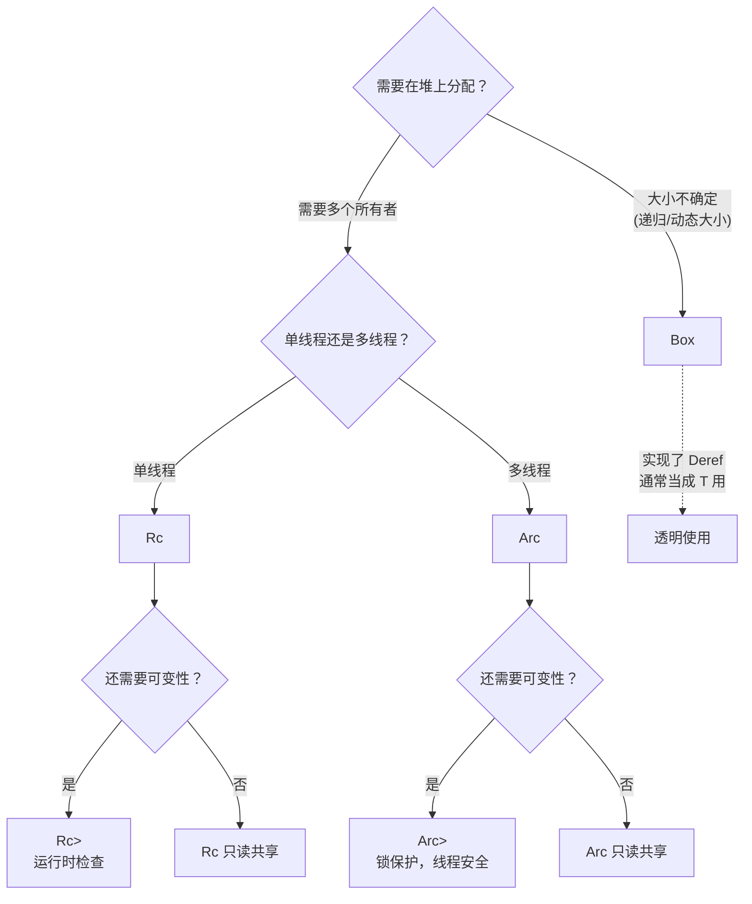

# 10 · 智能指针与内部可变性

## 一、【PM】什么时候需要智能指针？

Rust 默认的所有权规则满足 90% 的场景，但有三种情况需要更复杂的内存管理：

| 场景 | 问题 | 解法 |
|------|------|------|
| 递归数据结构（树、链表）| 编译期大小未知 | `Box<T>` —— 堆分配 |
| 多个所有者（共享状态）| Rust 默认只有一个所有者 | `Rc<T>`（单线程）/ `Arc<T>`（多线程）|
| 需要在不可变结构中修改字段 | 借用规则允许：借用时不可变 | `RefCell<T>`（运行时借用检查）|

**注意**：智能指针是"在确实需要时的工具"，不是默认选项。遇到借用报错时，先思考是否能重构代码（调整所有权、传引用），不要直接跳到 `Rc<RefCell<T>>`——那通常意味着设计需要重新思考。

---

## 二、【Arch】智能指针选择决策图



---

## 三、【Dev】对比代码：C# vs Rust

### 场景 1：Box\<T\>——堆分配与递归类型

```csharp
// C# — 所有类（class）天然在堆上，无需特殊标注
class Node {
    public int Value { get; set; }
    public Node? Next { get; set; }   // 引用类型，可以表示递归结构
}
```

```rust
// Rust — 编译器需要知道每个类型的大小
// ❌ 以下定义编译失败：List 大小无法确定（递归）
enum List {
    Cons(i32, List),   // List 的大小 = i32 + List 的大小 = 无穷大
    Nil,
}

// ✅ 用 Box<T>：Box 大小固定（一个指针），打破递归
enum List {
    Cons(i32, Box<List>),   // Box<List> = 一个指针大小（固定）
    Nil,
}

let list = List::Cons(
    1,
    Box::new(List::Cons(
        2,
        Box::new(List::Cons(3, Box::new(List::Nil)))
    ))
);

// Box 实现了 Deref，透明使用（* 解引用）
let b = Box::new(5);
println!("{}", *b);    // 5（自动解引用，通常直接写 b 就行）
println!("{}", b + 1); // 自动 Deref 到 i32，可直接运算
// b 离开作用域 → Box 和堆上的 5 都被 drop（RAII）
```

### 场景 2：Rc\<T\>——单线程共享所有权

```csharp
// C# — 所有引用类型天然共享（GC 管理），无需特殊标注
var a = new Node(5);
var b = a;   // b 和 a 指向同一对象

// Rust 默认不允许：一个所有者
let a = String::from("hello");
let b = a;   // Move，a 失效
```

```rust
use std::rc::Rc;

// Rc<T>：引用计数，单线程多所有者
// 类比 C# 的引用类型（但 Rust 主动计数，GC 被动追踪）
let a = Rc::new(String::from("hello"));
let b = Rc::clone(&a);   // 引用计数 +1（浅拷贝 Rc，不拷贝 String）
let c = Rc::clone(&a);   // 引用计数 +1

println!("引用计数：{}", Rc::strong_count(&a));   // 3

println!("{} {} {}", a, b, c);   // 三个变量共享同一 String
// a、b、c 都 drop 后，最后一个 drop 时 String 被释放

// ⚠️ Rc<T> 不能跨线程（没有实现 Send）
// 因此 Rc 是单线程的引用计数，无原子操作开销
```

### 场景 3：Arc\<T\>——多线程共享所有权

```csharp
// C# — 共享状态在多线程中天然可传（CLR 对象天生跨线程）
var shared = new Config { MaxConn = 100 };
Task.Run(() => Console.WriteLine(shared.MaxConn));
```

```rust
use std::sync::Arc;
use std::thread;

// Arc<T>：原子引用计数，可跨线程（实现了 Send + Sync）
let config = Arc::new(String::from("production"));

let handles: Vec<_> = (0..4).map(|i| {
    let config = Arc::clone(&config);   // 每个线程拿一份 Arc（引用计数 +1，不拷贝数据）
    thread::spawn(move || {
        println!("线程 {} 使用配置：{}", i, config);
    })
}).collect();

for h in handles { h.join().unwrap(); }
println!("主线程计数：{}", Arc::strong_count(&config));   // 1（子线程都 drop 了）
```

### 场景 4：RefCell\<T\>——内部可变性

```csharp
// C# — 类字段默认可变，没有这个概念
class Counter { int count = 0; public void Inc() { count++; } }
```

```rust
use std::cell::RefCell;

// RefCell<T>：把借用检查**推迟到运行时**
// 用于：不可变结构（&self）中需要修改内部状态的场景
// ⚠️ 运行时违反借用规则 → panic（不是编译错误）

// 典型用例：缓存（第一次计算后存储结果）
struct Cache {
    data:            Vec<i32>,
    computed_sum:    RefCell<Option<i32>>,   // 延迟计算的缓存
}

impl Cache {
    fn sum(&self) -> i32 {   // 注意：&self 不可变
        // borrow()：运行时不可变借用；borrow_mut()：可变借用
        if let Some(s) = *self.computed_sum.borrow() {
            return s;   // 已缓存，直接返回
        }
        let s: i32 = self.data.iter().sum();
        *self.computed_sum.borrow_mut() = Some(s);   // 写入缓存（修改内部状态）
        s
    }
}

let c = Cache {
    data: vec![1, 2, 3, 4, 5],
    computed_sum: RefCell::new(None),
};
println!("{}", c.sum());   // 15（计算）
println!("{}", c.sum());   // 15（从缓存返回）
```

### 场景 5：Rc\<RefCell\<T\>\> 和 Arc\<Mutex\<T\>\>

```csharp
// C# — 共享可变状态：直接修改类字段（线程安全需要 lock）
class SharedState { public int Count { get; set; } }
lock (locker) { state.Count++; }
```

```rust
use std::rc::Rc;
use std::cell::RefCell;

// Rc<RefCell<T>>：单线程共享 + 可变（多个所有者，各自可修改）
let shared = Rc::new(RefCell::new(Vec::<i32>::new()));

let a = Rc::clone(&shared);
let b = Rc::clone(&shared);

a.borrow_mut().push(1);   // 通过 a 修改
b.borrow_mut().push(2);   // 通过 b 修改

println!("{:?}", shared.borrow());   // [1, 2]

// ⚠️ 同时持有 borrow 和 borrow_mut 会在运行时 panic！
// let r1 = shared.borrow();
// let r2 = shared.borrow_mut();  // panic: already borrowed

// Arc<Mutex<T>>：多线程共享 + 可变（生产代码常见）
use std::sync::{Arc, Mutex};
use std::thread;

let counter = Arc::new(Mutex::new(0i32));
let handles: Vec<_> = (0..10).map(|_| {
    let c = Arc::clone(&counter);
    thread::spawn(move || {
        let mut val = c.lock().unwrap();   // 获取锁，返回 MutexGuard（自动 unlock）
        *val += 1;
        // MutexGuard 离开作用域，锁自动释放（RAII）
    })
}).collect();
for h in handles { h.join().unwrap(); }
println!("最终计数：{}", *counter.lock().unwrap());   // 10
```

### 场景 6：Deref 强制转换

```rust
// Deref 允许 Box<T> / Rc<T> / Arc<T> 在绝大多数地方当 T 用
fn print_str(s: &str) { println!("{}", s); }

let boxed = Box::new(String::from("hello"));
print_str(&boxed);    // &Box<String> → &String → &str（两次 Deref）
// 编译器自动插入 Deref 强制转换，无需手写 &**boxed
```

---

## 四、Rustlings 对应练习

```bash
rustlings watch exercises/smart_pointers/
```

| 练习文件 | 考察点 |
|---------|--------|
| `box1.rs` | Box 解决递归类型 |
| `rc1.rs` | Rc 共享所有权 |
| `arc1.rs` | Arc 跨线程共享 |
| `cow1.rs` | Cow（写时克隆）|

---

## 五、Rust by Example 速查

对应章节：[19. Std Library Types - Box](https://doc.rust-lang.org/rust-by-example/std/box.html)

---

## 六、【QA】常见错误

| 错误 | 触发 | 修复 |
|------|------|------|
| `Rc<T> cannot be sent between threads safely` | 把 Rc 传给 `thread::spawn` | 改用 `Arc<T>` |
| `already borrowed: BorrowMutError` (panic) | 持有 `borrow()` 期间调用 `borrow_mut()` | 确保可变借用前所有不可变借用已 drop |
| `cannot borrow as mutable` | 结构体字段没有 `RefCell` 包裹，但 `&self` 方法试图修改 | 用 `RefCell<T>` 包裹需要内部可变的字段 |
| `value: the size of ... cannot be known at compile time` | 递归类型没有堆分配打破循环 | 用 `Box<T>` 包裹递归字段 |

---

## 七、【QA】自测题

**Q1**：`Rc<T>` 和 `Arc<T>` 的核心区别是什么，选择依据是什么？

A. Arc 存储在堆上，Rc 存储在栈上  
B. Rc 使用非原子引用计数（无同步开销），不能跨线程；Arc 使用原子操作，能跨线程，但有性能开销  
C. 功能完全相同，Arc 是 Rc 的超集，始终用 Arc  
D. Rc 用于基本类型，Arc 用于引用类型

<details><summary>答案</summary>

**B**。选择依据：单线程用 `Rc`（无原子操作开销，编译器静态保证线程安全），多线程用 `Arc`（原子引用计数，`Send + Sync`）。"始终 Arc"虽然能工作，但引入了不必要的原子操作开销，且隐藏了并发设计意图。编译器会在你错误使用 Rc 跨线程时报错，所以选错不会造成安全问题。

</details>

**Q2**：`RefCell<T>` 的借用规则和普通借用规则有什么区别？

A. RefCell 完全绕过借用规则，可以任意修改  
B. 普通借用（&T/&mut T）在**编译期**检查；RefCell 把检查推迟到**运行时**，违规时 panic  
C. RefCell 只允许不可变借用  
D. 没有区别，只是语法不同

<details><summary>答案</summary>

**B**。`RefCell<T>` 并没有消除借用规则，只是把检查时机从编译期推迟到运行时：调用 `borrow()` 时计数器 +1，调用 `borrow_mut()` 时检查计数器为 0（否则 panic）。这意味着 RefCell 的错误是运行时 panic，而不是编译错误——在生产代码中要**非常谨慎**。只有在编译器无法分析但逻辑上正确的场景（如缓存、回调图）才用 RefCell。

</details>

**Q3**：以下 `Box<T>` 的主要使用场景是什么（选最准确的）？

```rust
enum Tree {
    Leaf(i32),
    Node(Box<Tree>, Box<Tree>),
}
```

A. 提高性能（堆比栈快）  
B. 允许在编译期大小未知的类型（递归/动态大小）在栈上存储  
C. Box 打破递归大小推断，使编译器知道 `Tree` 的大小是固定的（一个指针 + 指针）  
D. 绕过借用检查器

<details><summary>答案</summary>

**C**。如果 `Node` 直接包含 `Tree`，`Tree` 的大小 = i32 + Tree + Tree = 无穷大，编译器无法确定。`Box<Tree>` 大小固定（在 64 位系统上 = 8 字节指针），打破递归。堆分配并不更快（实际上有 malloc 开销），这里用 Box 是为了**类型系统的递归终止条件**，不是性能优化。

</details>
