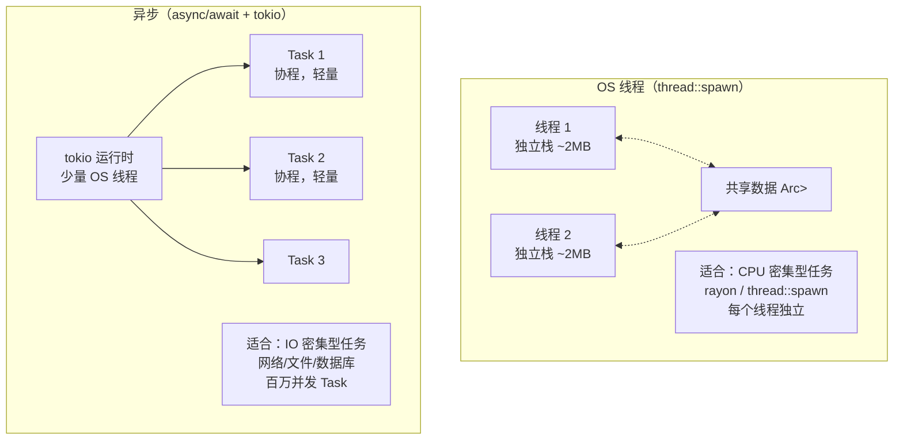

# 11 · 并发安全与异步基础

## 一、【PM】Rust 并发：编译期排除数据竞争

C# 的并发安全依靠**运行时**：`lock`、`Monitor`、`Interlocked`——都是在运行时捕获竞争条件（或者靠程序员自律）。

Rust 在**编译期**通过两个 marker trait 排除整类并发 bug：

- `Send`：类型可以**安全地**跨线程转移所有权
- `Sync`：类型可以**安全地**在多线程中共享引用（`&T` 是 `Send` 即 `T: Sync`）

大多数类型自动实现 `Send + Sync`，少数不安全的类型（`Rc`、`Cell`、`RefCell`）**不实现**，编译器阻止你不小心跨线程使用它们。这是编译期并发安全检查，零运行时开销。

---

## 二、【Arch】线程并发 vs 异步并发



---

## 三、【Dev】对比代码：C# vs Rust

### 场景 1：OS 线程

```csharp
// C# — Task.Run / Thread
var thread = new Thread(() => Console.WriteLine("new thread"));
thread.Start();
thread.Join();

// 传数据
string msg = "hello";
Task.Run(() => Console.WriteLine(msg));   // 捕获引用，CLR 保活
```

```rust
use std::thread;

// 基本线程
let handle = thread::spawn(|| {
    println!("新线程");
});
handle.join().unwrap();   // 等待线程完成

// 向线程传数据：必须 move（线程可能比当前作用域活得更长）
let msg = String::from("hello");
let handle = thread::spawn(move || {   // move：把 msg 所有权转移进闭包
    println!("{}", msg);               // msg: String（已 Move 进线程）
});
handle.join().unwrap();
// println!("{}", msg);   // ❌ msg 已被 Move 进线程
```

### 场景 2：Mutex\<T\> 线程安全共享

```csharp
// C# — lock 语句（显式 Monitor.Enter/Exit）
private readonly object _lock = new();
private int _count = 0;

void Increment() {
    lock (_lock) { _count++; }
}
```

```rust
use std::sync::{Arc, Mutex};
use std::thread;

// Rust — Mutex<T>：锁和数据绑定，不能绕开锁访问数据
let counter = Arc::new(Mutex::new(0i32));

let handles: Vec<_> = (0..8).map(|_| {
    let counter = Arc::clone(&counter);
    thread::spawn(move || {
        for _ in 0..100 {
            let mut val = counter.lock().unwrap();  // 获取锁，阻塞直到获得
            *val += 1;
        }   // MutexGuard drop → 锁自动释放（RAII，不会忘记 unlock）
    })
}).collect();

for h in handles { h.join().unwrap(); }
println!("结果：{}", *counter.lock().unwrap());   // 800

// 对比 C#：C# 的 lock 是 "锁代码块"；Rust 的 Mutex 是 "锁数据"
// Rust 不能不上锁直接访问 Mutex<T> 内部的数据——API 设计上就不允许
```

### 场景 3：Channel 消息传递

```csharp
// C# — Channel<T>（System.Threading.Channels）
var channel = Channel.CreateUnbounded<string>();
var writer = channel.Writer;
var reader = channel.Reader;

// 发送
await writer.WriteAsync("hello");

// 接收
var msg = await reader.ReadAsync();
```

```rust
use std::sync::mpsc;   // multi-producer, single-consumer
use std::thread;

// 创建 channel：tx（发送端）+ rx（接收端）
let (tx, rx) = mpsc::channel();

// 多个发送端（clone tx）
let tx2 = tx.clone();
thread::spawn(move || {
    tx.send("hello from thread 1".to_string()).unwrap();
});
thread::spawn(move || {
    tx2.send("hello from thread 2".to_string()).unwrap();
});

// 接收端（阻塞等待）
for msg in rx {   // rx 实现了 Iterator，直到所有 tx drop 时迭代结束
    println!("{}", msg);
}
```

### 场景 4：async/await 基础

```csharp
// C# — async Task<T>
async Task<string> FetchDataAsync(string url) {
    using var client = new HttpClient();
    return await client.GetStringAsync(url);
}

// 主入口
await FetchDataAsync("https://example.com");
```

```rust
// 需要 tokio 运行时（Cargo.toml: tokio = { version = "1", features = ["full"] }）
use tokio;

// async fn 声明异步函数（返回 Future，不立即执行）
async fn fetch_data(url: &str) -> Result<String, reqwest::Error> {
    // await：在此处暂停协程，让出控制权（不阻塞线程）
    let body = reqwest::get(url).await?.text().await?;
    Ok(body)
}

// #[tokio::main] 宏：创建 tokio 运行时，把 main 变成 async
#[tokio::main]
async fn main() {
    match fetch_data("https://example.com").await {
        Ok(body) => println!("响应：{}", &body[..100]),
        Err(e)   => eprintln!("错误：{}", e),
    }
}
```

### 场景 5：并发执行多个异步任务

```csharp
// C# — Task.WhenAll 并发执行
var t1 = FetchAsync("url1");
var t2 = FetchAsync("url2");
var results = await Task.WhenAll(t1, t2);
```

```rust
use tokio;

async fn fetch(url: &str) -> String {
    // 模拟异步操作
    tokio::time::sleep(std::time::Duration::from_millis(100)).await;
    format!("data from {}", url)
}

#[tokio::main]
async fn main() {
    // tokio::join!：并发执行多个 Future（等同 Task.WhenAll）
    let (r1, r2, r3) = tokio::join!(
        fetch("url1"),
        fetch("url2"),
        fetch("url3"),
    );
    println!("{} {} {}", r1, r2, r3);

    // tokio::spawn：完全独立的 Task（等同 Task.Run）
    let handle = tokio::spawn(async {
        tokio::time::sleep(std::time::Duration::from_millis(50)).await;
        "background task done"
    });
    let result = handle.await.unwrap();
    println!("{}", result);

    // futures::future::join_all：动态数量的 Future（等同 Task.WhenAll(tasks)）
    // let futures: Vec<_> = urls.iter().map(|u| fetch(u)).collect();
    // let results = futures::future::join_all(futures).await;
}
```

### 场景 6：Send + Sync 编译期保证

```rust
use std::sync::Arc;
use std::thread;

// ✅ Arc<String>：String 实现 Send + Sync，Arc 保证线程安全计数
let s = Arc::new(String::from("hello"));
let s2 = Arc::clone(&s);
thread::spawn(move || println!("{}", s2)).join().unwrap();

// ❌ Rc<String>：Rc 没有实现 Send，编译器阻止跨线程
use std::rc::Rc;
let rc = Rc::new(String::from("hello"));
// thread::spawn(move || println!("{}", rc));
// error[E0277]: `Rc<String>` cannot be sent between threads safely

// ❌ 裸 RefCell：没有实现 Sync，不能作为 &T 共享给多线程
use std::cell::RefCell;
let cell = RefCell::new(0);
// thread::spawn(|| cell.borrow_mut());   // 编译错误

// 这些错误全部在**编译期**产生，运行时不会有数据竞争 bug
```

### 场景 7：async 关键概念——Future 惰性

```rust
// Rust async fn 返回的是 Future（状态机），不是运行中的任务
// 类比 C# 的 Lazy<Task>：不 await 就不执行

async fn expensive_work() -> i32 {
    println!("开始工作...");
    tokio::time::sleep(std::time::Duration::from_secs(1)).await;
    42
}

#[tokio::main]
async fn main() {
    let future = expensive_work();   // ← 此时不打印，不执行
    println!("Future 已创建但未执行");

    let result = future.await;       // ← 这里才开始执行
    println!("结果：{}", result);    // 结果：42
}

// C# 对比：
// var task = ExpensiveWork();     // async 函数立刻开始执行（热启动 Hot Task）
// await task;                     // 等待完成
// Rust 的 Future 是"冷启动"，.await 才启动热身 → 更高效
```

---

## 四、Rustlings 对应练习

```bash
rustlings watch exercises/threads/
```

| 练习 | 考察点 |
|------|--------|
| `threads1.rs` | `thread::spawn` + `join` |
| `threads2.rs` | `Arc<Mutex<T>>` 共享计数器 |
| `threads3.rs` | `mpsc::channel` 消息传递 |

---

## 五、Rust by Example 速查

对应章节：[20.1 Threads](https://doc.rust-lang.org/rust-by-example/std_misc/threads.html) 和 [Async Book](https://rust-lang.github.io/async-book/)

---

## 六、【QA】常见错误

| 错误 | 触发 | 修复 |
|------|------|------|
| `Rc<T> cannot be sent between threads safely` | 把 Rc 传进 `thread::spawn` | 改用 `Arc<T>` |
| `closure may outlive the current function` | spawn 捕获了当前函数的局部变量引用 | 加 `move` 关键字，转移所有权进闭包 |
| `future cannot be sent between threads safely` | async 闭包或 spawn 中用了不实现 Send 的类型（如 `Rc`、`RefCell`）| 改用线程安全替代（`Arc`、`Mutex`）|
| `this function is not async` | 在非 async 函数中用 `await` | 函数加 `async` 关键字 |
| `no async runtime found` | 没有 `#[tokio::main]` 或 `tokio::runtime::Runtime` | 入口加 `#[tokio::main]`，或手动创建 Runtime |

---

## 七、【QA】自测题

**Q1**：以下代码中，`move` 关键字为什么是必须的？

```rust
let data = vec![1, 2, 3];
let handle = thread::spawn(move || {
    println!("{:?}", data);
});
handle.join().unwrap();
```

A. 性能优化  
B. 线程可能比当前作用域活得更长，data 的引用可能失效；move 把 data 所有权转移进线程  
C. 语法要求，不加会语法错误  
D. 没有实际效果，可以去掉

<details><summary>答案</summary>

**B**。如果不加 `move`，闭包会借用 `data`（`&data`）。但线程的生命周期可能超过 `data` 所在的作用域——这正是悬垂引用！Rust 编译器阻止这种情况。加 `move` 后，`data` 的所有权完全转移进闭包（进而进入线程），编译器确认线程拥有数据，生命周期明确。

</details>

**Q2**：Rust 的 `Future`（async）和 C# 的 `Task` 最本质的区别是什么？

A. Future 性能更好  
B. Rust 的 Future 是"冷启动"（不 .await 就不执行）；C# 的 async 方法是"热启动"（调用即开始执行）  
C. Future 只能用于 IO，Task 可以用于 CPU  
D. 没有区别，只是语法不同

<details><summary>答案</summary>

**B**。在 Rust 中，`async fn foo()` 调用后返回一个 Future（状态机对象），**不执行任何代码**，直到被 `.await` 或被运行时 poll。这使得 Future 可以高效地被取消（直接 drop），不需要 `CancellationToken`。C# 的 `async` 方法在被调用后会立刻开始同步执行到第一个 `await` 点（热启动）。这种区别在组合多个 Future 时有重要影响（取消、超时等）。

</details>

**Q3**：什么时候用 `thread::spawn`，什么时候用 `tokio::spawn`？

A. 两者完全等价，随便用  
B. CPU 密集型用 `thread::spawn`（真正并行）；IO 密集型用 `tokio::spawn`（协程，单线程内并发）  
C. `tokio::spawn` 总是更好  
D. `thread::spawn` 更快，总是用 thread

<details><summary>答案</summary>

**B**。
- **`thread::spawn`**：创建 OS 线程（2MB 栈，上下文切换开销），适合 CPU 密集型（计算、加密、压缩）。`rayon` 内部用线程池。
- **`tokio::spawn`**：创建异步 Task（协程，极轻量），在少量 OS 线程上多路复用，适合 IO 密集型（网络、数据库、文件）。百万 Task 可以跑在 8 个线程上。

错误混用：在 tokio 任务中做 CPU 密集计算会阻塞整个 tokio 线程，阻碍其他 IO 任务调度。解法：`tokio::task::spawn_blocking(|| cpu_intensive_work())` 把 CPU 任务移到专用线程池。

</details>

---

## 八、入门实战阶段总结

恭喜！完成 Phase 1 全部 11 章，你现在掌握了：

| 知识点 | 关键概念 |
|--------|---------|
| 所有权 + Move | 每块内存唯一所有者，离开作用域 drop |
| 借用规则 | 多个 &T **或** 唯一 &mut T，编译期保证 |
| 生命周期 | 引用有效期 ≤ 数据有效期，返回引用时标注 |
| 结构体 + 枚举 | ADT：struct(AND) + enum(OR)，match 穷举 |
| Trait + 泛型 | 零成本抽象，`impl Trait` 静态分发 |
| 错误处理 | `Result<T,E>` + `?`，thiserror + anyhow |
| 迭代器 + 闭包 | 惰性链式操作，`Fn/FnMut/FnOnce` |
| 智能指针 | `Box/Rc/Arc` + `RefCell/Mutex` |
| 并发安全 | `Send + Sync` 编译期保证，async/await 基础 |

**下一站**：Phase 2 —— MoCLI 项目，把这些概念在真实工程场景中组合实践。
