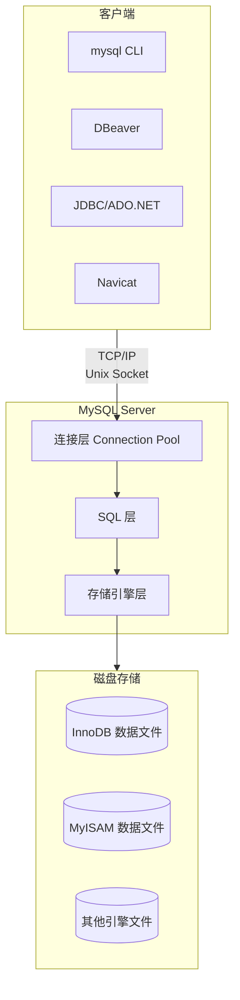
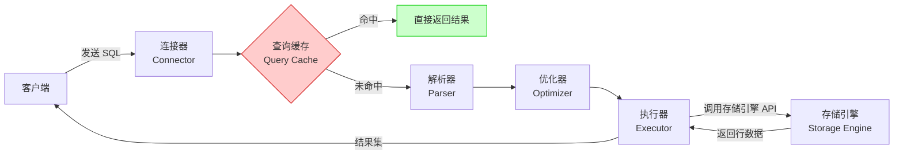
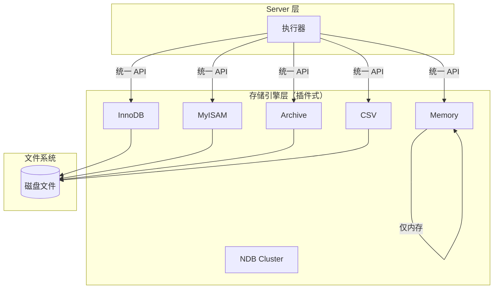
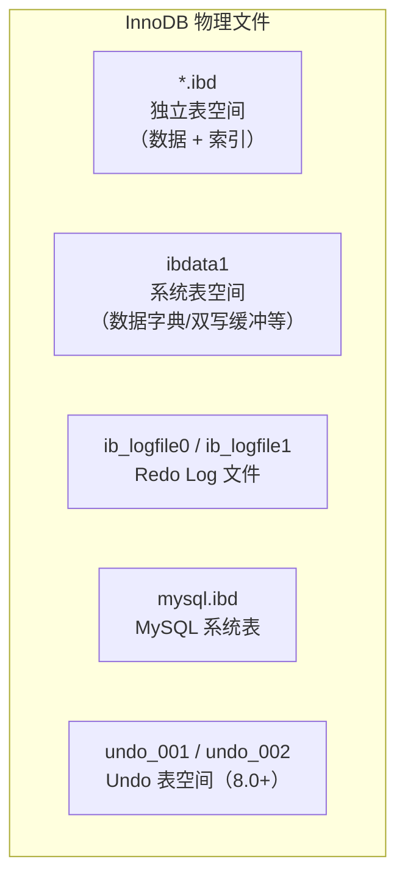
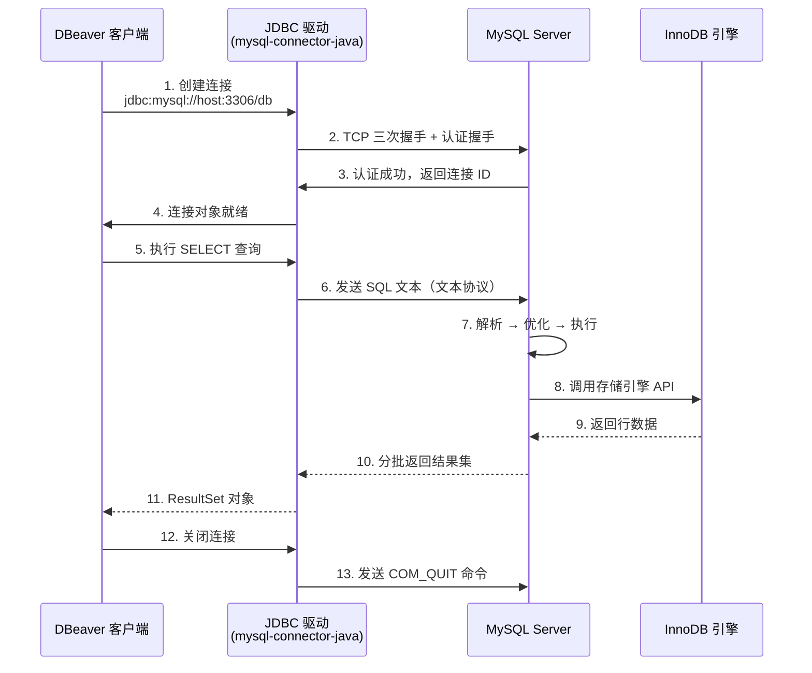
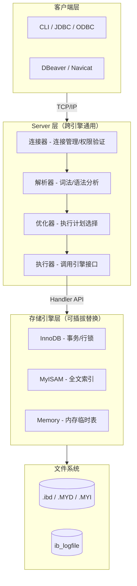

# MySQL 架构体系

一条 SQL 从客户端发出到结果返回，经历了哪些环节？为什么 MySQL 能同时支持 InnoDB 和 MyISAM？理解 MySQL 的分层架构，是掌握数据库内核的第一步。

## 1. MySQL C/S 架构概览

MySQL 采用经典的 **Client/Server** 架构，客户端与服务器通过 TCP/IP 或 Unix Socket 通信。



::: tip 客户端工具推荐
[DBeaver](https://github.com/dbeaver/dbeaver) 是一款开源的通用数据库管理工具，支持 MySQL、PostgreSQL、SQLite 等多种数据库。它底层通过 JDBC 驱动连接 MySQL，是理解 MySQL C/S 架构的优秀实践案例。
:::

## 2. Server 层：SQL 处理的核心

Server 层是 MySQL 的"大脑"，负责连接管理、SQL 解析、查询优化和执行调度。**所有跨存储引擎的功能都在这一层实现**，包括解析器、优化器、执行器等。

### 2.1 一条 SQL 的完整旅程



::: warning 查询缓存已在 MySQL 8.0 中移除
Query Cache 在高并发场景下成为性能瓶颈——任何对表的修改都会导致该表所有缓存失效。MySQL 8.0 彻底移除了该功能，相关参数 `query_cache_type` 也不再存在。生产环境请勿依赖查询缓存，应通过合理的索引设计和 Buffer Pool 调优来提升查询性能。
:::

### 2.2 连接器（Connector）

连接器负责与客户端建立连接、管理连接和权限验证。

```sql
-- 查看当前连接信息
SHOW PROCESSLIST;

-- 输出示例
-- +----+------+-----------------+------+---------+------+-------+------------------+
-- | Id | User | Host            | db   | Command | Time | State | Info             |
-- +----+------+-----------------+------+---------+------+-------+------------------+
-- |  5 | root | localhost:56712 | test | Query   |    0 | NULL  | SHOW PROCESSLIST |
-- |  8 | app  | 192.168.1.10    | prod | Sleep   |   30 | NULL  | NULL             |
-- +----+------+-----------------+------+---------+------+-------+------------------+
```

**连接生命周期关键点：**

| 阶段 | 说明 |
|------|------|
| 建立连接 | 三次握手 + 权限验证（用户名/密码/Host） |
| 执行查询 | 读取该用户权限表，缓存在连接对象中 |
| 空闲状态 | `SHOW PROCESSLIST` 中 Command 列为 Sleep |
| 连接断开 | 客户端主动断开或 `wait_timeout` 超时（默认 8 小时） |

```sql
-- 修改空闲连接超时时间（单位：秒）
SET GLOBAL wait_timeout = 28800;
SET GLOBAL interactive_timeout = 28800;
```

::: important 长连接内存问题
MySQL 执行过程中使用的内存在连接对象中管理，长连接积累可能导致 OOM。解决方案：
1. 定期断开长连接重连
2. MySQL 5.7+ 执行 `mysql_reset_connection` 重置连接资源
:::

### 2.3 解析器（Parser）

解析器将 SQL 文本转换为 MySQL 能理解的数据结构，分为**词法分析**和**语法分析**两步。


```sql
-- 语法错误示例
SELECT * FORM users;
-- ERROR 1064 (42000): You have an error in your SQL syntax;
-- check the manual near 'FORM users' at line 1

-- 语义错误示例（表不存在）
SELECT * FROM non_exist_table;
-- ERROR 1146 (42S02): Table 'test.non_exist_table' doesn't exist
```

### 2.4 优化器（Optimizer）

优化器决定 SQL 的执行方案——选择哪个索引、多表 Join 的连接顺序等。

```sql
-- 同一条 SQL，优化器可能选择不同的执行计划
EXPLAIN SELECT * FROM orders WHERE user_id = 100 AND status = 'PAID';

-- 可能走 user_id 索引，也可能走 status 索引
-- 优化器基于统计信息计算代价，选择代价最小的方案
```

::: tip 优化器不是万能的
优化器基于统计信息做决策，当统计信息过时或不准确时，可能选错执行计划。生产中遇到慢查询，可使用 `ANALYZE TABLE` 更新统计信息，或使用 `FORCE INDEX` 强制指定索引。
:::

### 2.5 执行器（Executor）

执行器根据执行计划调用存储引擎接口，逐行获取数据并返回结果集。

```sql
-- 执行器的工作流程（以全表扫描为例）：
-- 1. 调用存储引擎接口，获取第一行
-- 2. 判断是否满足 WHERE 条件
-- 3. 满足则存入结果集，不满足则跳过
-- 4. 获取下一行，重复步骤 2-3，直到最后一行
-- 5. 返回结果集给客户端

-- 有索引的情况：
-- 1. 调用存储引擎接口，定位到满足条件的第一行
-- 2. 判断是否满足 WHERE 的其他条件
-- 3. 重复获取下一行，直到条件不满足
-- 4. 返回结果集
```

**执行器与存储引擎的交互接口：**

| 接口 | 说明 |
|------|------|
| `handler::rnd_next()` | 全表扫描，逐行读取 |
| `handler::index_read()` | 索引等值查询 |
| `handler::index_next()` | 索引范围扫描，读取下一行 |
| `handler::index_first()` | 读取索引第一条记录 |
| `handler::write_row()` | 插入一行 |
| `handler::update_row()` | 更新一行 |
| `handler::delete_row()` | 删除一行 |

## 3. 存储引擎层：插件式架构

MySQL 最独特的设计是**插件式存储引擎架构**——Server 层统一处理 SQL，存储引擎层负责数据的实际存取。这意味着你可以根据业务需求选择不同的引擎。

### 3.1 插件式架构示意



```sql
-- 查看当前 MySQL 支持的存储引擎
SHOW ENGINES;

-- 关键输出字段
-- +--------------------+---------+------------------------------------------------------------+
-- | Engine             | Support | Comment                                                    |
-- +--------------------+---------+------------------------------------------------------------+
-- | InnoDB             | DEFAULT | Supports transactions, row-level locking, and foreign keys  |
-- | MyISAM             | YES     | MyISAM storage engine                                      |
-- | MEMORY             | YES     | Hash based, stored in memory, useful for temporary tables  |
-- | ARCHIVE            | YES     | Archive storage engine                                     |
-- | CSV                | YES     | CSV storage engine                                         |
-- +--------------------+---------+------------------------------------------------------------+

-- 指定表的存储引擎
CREATE TABLE users (
    id BIGINT PRIMARY KEY AUTO_INCREMENT,
    name VARCHAR(64) NOT NULL,
    email VARCHAR(128)
) ENGINE = InnoDB DEFAULT CHARSET = utf8mb4;

-- 修改表的存储引擎
ALTER TABLE users ENGINE = InnoDB;
```

### 3.2 InnoDB vs MyISAM 详细对比

| 特性 | InnoDB | MyISAM |
|------|--------|--------|
| 事务支持 | 支持（ACID） | 不支持 |
| 锁粒度 | 行级锁 | 表级锁 |
| 外键 | 支持 | 不支持 |
| MVCC | 支持 | 不支持 |
| 崩溃恢复 | Redo Log + Undo Log | 依赖操作系统 |
| 全文索引 | 支持（5.6+） | 支持 |
| 聚簇索引 | 主键即聚簇索引 | 非聚簇，索引和数据分离 |
| 存储文件 | `.ibd`（数据+索引） | `.MYD`（数据）+ `.MYI`（索引） |
| COUNT(*) | 需遍历索引 | 有专门变量，极快 |
| AUTO_INCREMENT | 支持事务级自增 | 表级，INSERT 后立即提交 |
| 适用场景 | OLTP、高并发读写 | 只读或低并发读、日志表 |

```sql
-- InnoDB 表：行级锁演示
-- 会话 A
BEGIN;
UPDATE users SET name = 'Alice' WHERE id = 1;  -- 锁定 id=1 这一行
-- 不提交，会话 B 尝试更新 id=2 的行不会阻塞

-- 会话 B
UPDATE users SET name = 'Bob' WHERE id = 2;  -- ✅ 不阻塞（不同行）
UPDATE users SET name = 'Charlie' WHERE id = 1;  -- ❌ 阻塞等待（同一行）

-- MyISAM 表：表级锁
-- 会话 A 对 myisam_table 加写锁
LOCK TABLES myisam_table WRITE;
-- 会话 B 对 myisam_table 的任何操作都会阻塞
-- 即使操作不同行也会阻塞
UNLOCK TABLES;
```

::: warning 不要在新项目中使用 MyISAM
MyISAM 不支持事务和行级锁，在并发场景下性能和安全性都无法保障。MySQL 5.5 起默认引擎已改为 InnoDB，MySQL 8.0 中系统表也全部迁移至 InnoDB。MyISAM 仅在极少数只读归档场景下尚有价值。
:::

## 4. 物理文件结构

### 4.1 InnoDB 存储文件



```sql
-- 查看数据文件位置
SHOW VARIABLES LIKE 'datadir';
-- +---------------+------------------------+
-- | Variable_name | Value                  |
-- +---------------+------------------------+
-- | datadir       | /var/lib/mysql/        |
-- +---------------+------------------------+

-- 查看独立表空间配置
SHOW VARIABLES LIKE 'innodb_file_per_table';
-- +---------------------------+-------+
-- | Variable_name             | Value |
-- +---------------------------+-------+
-- | innodb_file_per_table     | ON    |
-- +---------------------------+-------+

-- 查看表的物理文件
SELECT
    TABLE_SCHEMA AS db,
    TABLE_NAME AS table_name,
    ENGINE,
    TABLE_ROWS,
    DATA_LENGTH / 1024 / 1024 AS data_mb,
    INDEX_LENGTH / 1024 / 1024 AS index_mb
FROM information_schema.TABLES
WHERE TABLE_SCHEMA = 'test' AND TABLE_NAME = 'users';
```

### 4.2 MyISAM 存储文件

| 文件 | 用途 |
|------|------|
| `.MYD` | MyISAM Data，存储表数据 |
| `.MYI` | MyISAM Index，存储索引数据 |
| `.frm` | 表结构定义文件（8.0 已移除，元数据存于数据字典） |

## 5. 从 DBeaver 看客户端与服务器的交互

[DBeaver](https://github.com/dbeaver/dbeaver) 作为开源数据库管理工具，其与 MySQL 的交互过程是理解 C/S 架构的绝佳案例：



::: tip DBeaver 中的实用功能
- **ER 图**：Database → ER Diagram，可视化表关系
- **执行计划**：右键 SQL → Explain Execution Plan
- **会话管理**：Database → Active Connections，查看当前连接
- **数据导出**：右键表 → Export Data，支持 CSV/SQL/JSON 等格式
:::

## 6. 总结：架构分层与职责



| 层次 | 核心职责 | 关键组件 |
|------|---------|---------|
| 客户端层 | 发送 SQL、接收结果 | mysql CLI、DBeaver、JDBC 驱动 |
| 连接层 | 连接管理、权限验证 | 连接池、线程管理 |
| SQL 层 | 解析、优化、执行 | 解析器、优化器、执行器 |
| 存储引擎层 | 数据存取 | InnoDB、MyISAM、Memory |
| 文件系统 | 持久化存储 | .ibd、.MYD、Redo Log |

## 面试技巧

::: important 高频考点
1. **MySQL 分层架构**：Server 层 + 存储引擎层，Server 层处理 SQL 逻辑，存储引擎层负责数据存取。这是理解所有后续内容的基础。
2. **一条 SQL 的执行流程**：连接器 → 解析器 → 优化器 → 执行器 → 存储引擎。能清晰画出这个流程图是面试加分项。
3. **查询缓存为什么被移除**：高并发下缓存失效风暴（一次写操作导致整表缓存失效），收益远低于维护成本。
4. **InnoDB vs MyISAM**：事务支持、锁粒度、崩溃恢复是核心区别。面试中通常以"为什么选 InnoDB"的形式出现。
5. **存储引擎插件式架构的意义**：同一套 SQL 层代码，不同引擎有不同的存储和检索实现。理解这一点才能理解 InnoDB 为什么有聚簇索引而 MyISAM 没有。
6. **连接器权限缓存的坑**：连接建立后权限修改不会立即生效，需要重新连接。
:::

::: tip 参考资源
- [小林coding - MySQL 架构](https://xiaolincoding.com/mysql/)：图解 MySQL 架构体系，适合面试速查
- [MySQL 8.0 官方文档 - Architecture](https://dev.mysql.com/doc/refman/8.0/en/pluggable-storage-engine-overview.html)：存储引擎插件架构说明
- [DBeaver 源码](https://github.com/dbeaver/dbeaver)：开源数据库客户端，理解 C/S 交互
:::
