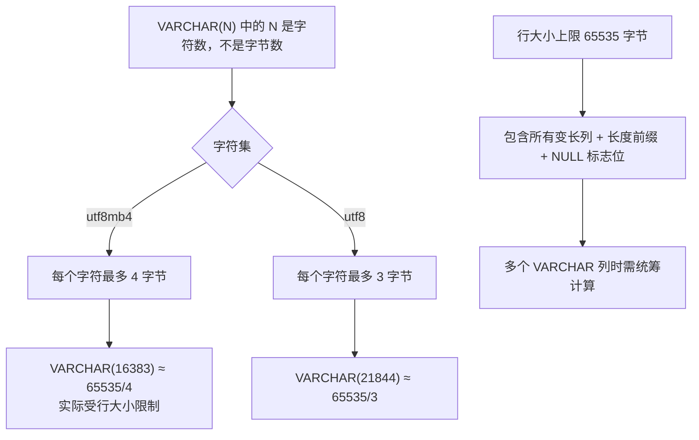
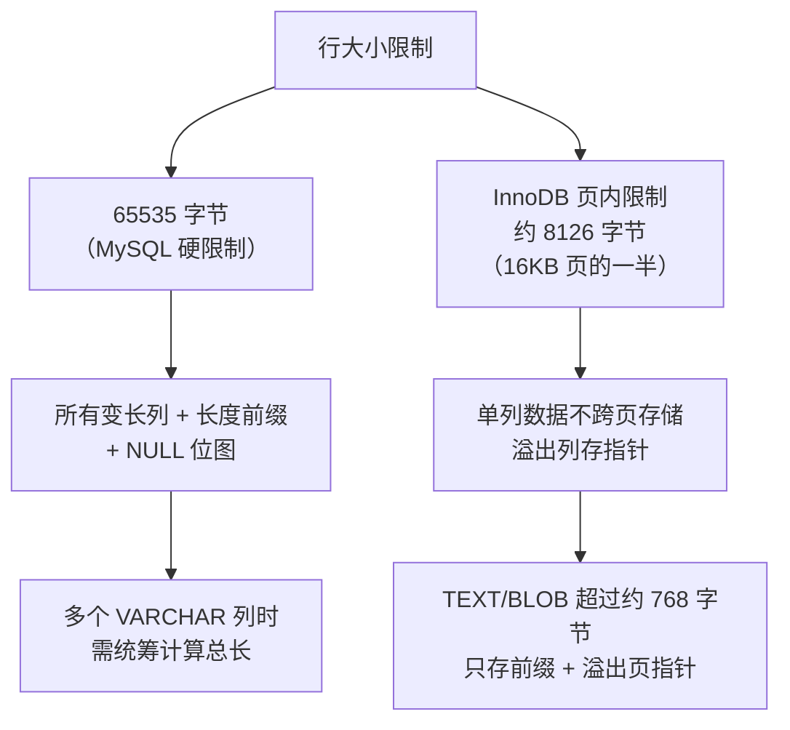
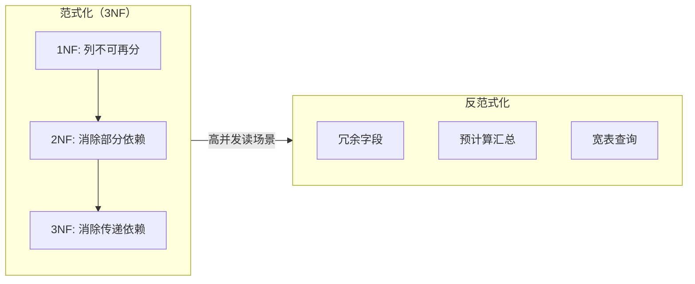

# 数据类型与表设计

选错数据类型，轻则浪费存储，重则导致精度丢失、索引失效甚至数据截断。本文梳理 MySQL 常用数据类型的选型要点，并给出表设计的实战建议。

## 1. 数值类型

### 1.1 整数类型

| 类型 | 字节 | 有符号范围 | 无符号范围 | 典型场景 |
|------|------|-----------|-----------|---------|
| TINYINT | 1 | -128 ~ 127 | 0 ~ 255 | 状态枚举、布尔 |
| SMALLINT | 2 | -32768 ~ 32767 | 0 ~ 65535 | 年龄、排序值 |
| MEDIUMINT | 3 | -8388608 ~ 8388607 | 0 ~ 16777215 | 中等范围 ID |
| INT | 4 | -2^31 ~ 2^31-1 | 0 ~ 2^32-1 | 主键、外键、数量 |
| BIGINT | 8 | -2^63 ~ 2^63-1 | 0 ~ 2^64-1 | 大 ID、金额（分） |

```sql
-- 创建用户表，展示整型选型
CREATE TABLE users (
    id         BIGINT UNSIGNED NOT NULL AUTO_INCREMENT,
    age        TINYINT UNSIGNED COMMENT '0~255 足够',
    status     TINYINT         COMMENT '-128~127, 负值表示异常状态',
    point      INT UNSIGNED    DEFAULT 0 COMMENT '积分',
    PRIMARY KEY (id)
) ENGINE = InnoDB DEFAULT CHARSET = utf8mb4;

-- INT(11) 的 display width 不影响存储范围！
-- MySQL 8.0.17+ 已废弃 display width，仅保留用于元数据兼容
CREATE TABLE demo (
    a INT(11),   -- 存储范围仍是 -2^31 ~ 2^31-1
    b INT(1),    -- 和 INT(11) 占用相同空间，范围相同
    c INT        -- 推荐写法，省略 display width
);
```

::: warning INT(11) 不是长度限制
`INT(11)` 中的 11 是**显示宽度**（display width），仅在搭配 `ZEROFILL` 时有视觉作用，不影响存储范围和取值范围。`INT(1)` 和 `INT(11)` 存储的值完全相同。MySQL 8.0.17 起已废弃 display width，新代码请直接写 `INT`。
:::

### 1.2 定点数与浮点数

| 类型 | 字节 | 精度 | 适用场景 |
|------|------|------|---------|
| FLOAT | 4 | 约 7 位有效数字 | 科学计算，可接受精度损失 |
| DOUBLE | 8 | 约 15 位有效数字 | 统计分析 |
| DECIMAL(M,D) | 变长 | 精确 | **金额、财务** |

```sql
-- 金额存储：DECIMAL 是唯一正确选择
CREATE TABLE orders (
    id           BIGINT UNSIGNED PRIMARY KEY AUTO_INCREMENT,
    total_amount DECIMAL(12, 2) NOT NULL COMMENT '总金额，最大 9999999999.99',
    discount     DECIMAL(5, 2)   DEFAULT 0.00 COMMENT '折扣金额',
    pay_method   TINYINT         NOT NULL COMMENT '支付方式'
) ENGINE = InnoDB;

-- 浮点数精度陷阱
SELECT 0.1 + 0.2;  -- 结果: 0.3（凑巧正确）
SELECT 0.1 * 0.2;  -- 结果: 0.020000...（精度丢失）

-- DECIMAL 精确计算
SELECT CAST(0.1 AS DECIMAL(10,2)) * CAST(0.2 AS DECIMAL(10,2));
-- 结果: 0.02
```

::: important 金额存储的两种方案
1. **DECIMAL(12,2)**：直观，SQL 层直接计算，存储占用较大
2. **BIGINT 存分**：1.23 元存为 123，存储紧凑、计算快、无精度问题，但需要应用层做换算

生产推荐 BIGINT 存分，兼顾性能和精度。
:::

## 2. 字符串类型

### 2.1 类型对比

| 类型 | 最大长度 | 存储特点 | 典型场景 |
|------|---------|---------|---------|
| CHAR(N) | 255 字符 | 定长，不足补空格 | MD5、手机号、固定编码 |
| VARCHAR(N) | 65535 字节 | 变长，1-2 字节长度前缀 | 用户名、地址、描述 |
| TINYTEXT | 255 字节 | 变长，1 字节长度前缀 | 短文本 |
| TEXT | 65535 字节 | 变长，2 字节长度前缀 | 文章内容 |
| MEDIUMTEXT | 16 MB | 变长，3 字节长度前缀 | 长文章、富文本 |
| LONGTEXT | 4 GB | 变长，4 字节长度前缀 | 超大文本（极少用） |
| BLOB 系列 | 同 TEXT | 二进制存储 | 图片、序列化数据 |

```sql
CREATE TABLE articles (
    id         BIGINT UNSIGNED PRIMARY KEY AUTO_INCREMENT,
    title      VARCHAR(200)  NOT NULL COMMENT '标题',
    author     VARCHAR(64)   NOT NULL,
    content    MEDIUMTEXT    COMMENT '正文，支持长文',
    summary    VARCHAR(500)  COMMENT '摘要',
    cover_url  VARCHAR(512)  COMMENT '封面图 URL',
    tags       JSON          COMMENT '标签数组，8.0+ 特性',
    created_at DATETIME(3)   NOT NULL DEFAULT CURRENT_TIMESTAMP(3)
) ENGINE = InnoDB DEFAULT CHARSET = utf8mb4;
```

### 2.2 VARCHAR 长度选择的坑



```sql
-- 行大小超限演示
CREATE TABLE too_big (
    a VARCHAR(22000),  -- utf8mb4 下约 88000 字节
    b VARCHAR(22000)
);
-- ERROR 1118 (42000): Row size too large.
-- The maximum row size is 65535 bytes, including BLOBs.

-- 正确做法：合理规划列长度
CREATE TABLE reasonable (
    a VARCHAR(255),   -- 名称类
    b VARCHAR(512),   -- 短描述
    c TEXT             -- 长文本单独存
) ENGINE = InnoDB DEFAULT CHARSET = utf8mb4;
```

::: warning VARCHAR(N) 对索引的影响
InnoDB 索引键长度限制为 3072 字节（utf8mb4 下约 768 个字符）。VARCHAR 过长会导致无法创建索引或索引被截断。建议索引列的 VARCHAR 长度不超过 255。
:::

## 3. 日期与时间类型

### 3.1 类型对比

| 类型 | 字节 | 格式 | 范围 | 时区处理 |
|------|------|------|------|---------|
| DATE | 3 | YYYY-MM-DD | 1000-01-01 ~ 9999-12-31 | 无 |
| TIME | 3 | HH:MM:SS | -838:59:59 ~ 838:59:59 | 无 |
| DATETIME | 8 | YYYY-MM-DD HH:MM:SS | 1000-01-01 00:00:00 ~ 9999-12-31 23:59:59 | **不转换**，存什么读什么 |
| TIMESTAMP | 4 | YYYY-MM-DD HH:MM:SS | 1970-01-01 00:00:01 ~ 2038-01-19 03:14:07 | **自动转换**，存 UTC 读本地 |
| YEAR | 1 | YYYY | 1901 ~ 2155 | 无 |

```sql
CREATE TABLE time_demo (
    id           BIGINT UNSIGNED PRIMARY KEY AUTO_INCREMENT,
    created_at   DATETIME(3)    NOT NULL DEFAULT CURRENT_TIMESTAMP(3),
    updated_at   DATETIME(3)     NOT NULL DEFAULT CURRENT_TIMESTAMP(3) ON UPDATE CURRENT_TIMESTAMP(3),
    published_at TIMESTAMP       NULL COMMENT '发布时间，自动时区转换',
    birthday     DATE            NOT NULL,
    work_years   YEAR            COMMENT '入职年份'
) ENGINE = InnoDB;

-- DATETIME vs TIMESTAMP 时区行为
SET time_zone = '+08:00';  -- 北京时间
INSERT INTO time_demo (published_at) VALUES ('2025-01-15 10:30:00');

SET time_zone = '+00:00';  -- UTC
SELECT published_at FROM time_demo;
-- 结果: 2025-01-15 02:30:00  （自动从 +08 转为 +00）

-- DATETIME 不受时区影响
-- 存入 2025-01-15 10:30:00，读取始终是 2025-01-15 10:30:00
```

::: important DATETIME vs TIMESTAMP 选型建议
- **业务时间**（订单创建、文章发布）：用 `DATETIME(3)`，不随时区变化，含义明确
- **系统时间**（记录变更、日志时间戳）：用 `TIMESTAMP`，自动时区转换，4 字节更紧凑
- **TIMESTAMP 2038 问题**：范围只到 2038-01-19，超出范围必须用 DATETIME
- **小数秒精度**：`DATETIME(3)` 表示毫秒，`DATETIME(6)` 表示微秒，推荐至少保留 3 位
:::

## 4. JSON 类型（MySQL 8.0+）

```sql
CREATE TABLE products (
    id          BIGINT UNSIGNED PRIMARY KEY AUTO_INCREMENT,
    name        VARCHAR(200) NOT NULL,
    attrs       JSON COMMENT '动态属性',
    created_at  DATETIME(3)  NOT NULL DEFAULT CURRENT_TIMESTAMP(3),
    INDEX idx_name ((CAST(attrs->>'$.brand' AS CHAR(64))))  -- 函数索引
) ENGINE = InnoDB DEFAULT CHARSET = utf8mb4;

-- 插入 JSON 数据
INSERT INTO products (name, attrs) VALUES
('iPhone 16', '{"brand": "Apple", "color": "太空灰", "storage": 256, "specs": {"cpu": "A18", "ram": 8}}'),
('Galaxy S24', '{"brand": "Samsung", "color": "暮光紫", "storage": 128, "specs": {"cpu": "Snapdragon 8 Gen 3", "ram": 12}}');

-- JSON 查询
SELECT name, attrs->>'$.brand' AS brand, attrs->'$.storage' AS storage
FROM products
WHERE attrs->>'$.brand' = 'Apple';

-- JSON 修改
UPDATE products
SET attrs = JSON_SET(attrs, '$.storage', 512)
WHERE id = 1;

-- JSON 表函数（8.0.14+），展开嵌套数据
SELECT jt.*
FROM products,
     JSON_TABLE(attrs, '$.specs' COLUMNS(
         cpu VARCHAR(64) PATH '$.cpu',
         ram INT PATH '$.ram'
     )) AS jt;
```

::: tip JSON 的适用场景
JSON 类型适合**稀疏属性**（不同商品有不同属性），但不适合频繁查询过滤的字段。对 JSON 字段的查询无法直接使用索引，必须借助**生成列 + 索引**或 MySQL 8.0 的**函数索引**。
:::

## 5. 字符集与排序规则

### 5.1 utf8 vs utf8mb4

| 字符集 | 每字符最大字节 | 支持 Emoji | 状态 |
|--------|--------------|-----------|------|
| utf8 (utf8mb3) | 3 | ❌ | MySQL 8.0 已标记废弃 |
| utf8mb4 | 4 | ✅ | **推荐** |

```sql
-- utf8 无法存储 Emoji 的演示
SET NAMES utf8;
INSERT INTO users (name) VALUES ('张三😀');
-- ERROR 1366 (HY000): Incorrect string value

-- utf8mb4 正确存储
SET NAMES utf8mb4;
INSERT INTO users (name) VALUES ('张三😀');  -- ✅ 成功
```

### 5.2 排序规则（Collation）

```sql
-- 常用排序规则
-- utf8mb4_general_ci：不区分大小写， accent-insensitive（é=e），速度快
-- utf8mb4_unicode_ci：不区分大小写，Unicode 正确排序，略慢
-- utf8mb4_0900_ai_ci：MySQL 8.0 默认，基于 Unicode 9.0，accent-insensitive
-- utf8mb4_bin：区分大小写，二进制比较

-- 大小写敏感比较
SELECT 'Hello' = 'hello';  -- utf8mb4_0900_ai_ci: 1（不区分）
SELECT BINARY 'Hello' = 'hello';  -- 0（区分）

-- 指定排序规则
SELECT * FROM users ORDER BY name COLLATE utf8mb4_zh_0900_as_cs;
-- zh: 中文拼音排序, as: accent-sensitive, cs: case-sensitive
```

::: important 生产环境统一设置
```sql
-- my.cnf 配置
[mysqld]
character_set_server = utf8mb4
collation_server = utf8mb4_0900_ai_ci

[client]
default-character-set = utf8mb4
```
数据库、表、列、连接四个层面的字符集必须一致，否则可能出现乱码或索引失效。
:::

## 6. 行大小限制

MySQL 行大小硬限制为 **65535 字节**（所有列总和），InnoDB 页内限制为页大小的一半（默认 8KB）。



```sql
-- 计算行大小
-- VARCHAR(255) utf8mb4 = 255 * 4 + 2 = 1022 字节
-- 64 个这样的列 = 64 * 1022 = 65408 字节 < 65535 ✅
-- 65 个 = 65 * 1022 = 66430 字节 > 65535 ❌

-- 溢出页机制
-- VARCHAR / TEXT 超过约 768 字节时，前 768 字节存于页内
-- 剩余数据存于溢出页，页内仅保留 20 字节指针
-- 这是 TEXT 类型不影响 65535 行限制的原因
```

## 7. 表设计实战

### 7.1 三范式 vs 反范式



```sql
-- 3NF 设计：订单与订单项分离
CREATE TABLE orders (
    id          BIGINT UNSIGNED PRIMARY KEY AUTO_INCREMENT,
    user_id     BIGINT UNSIGNED NOT NULL,
    total_amount DECIMAL(12, 2) NOT NULL,
    status      TINYINT        NOT NULL DEFAULT 0,
    created_at  DATETIME(3)    NOT NULL DEFAULT CURRENT_TIMESTAMP(3),
    INDEX idx_user (user_id),
    INDEX idx_status_created (status, created_at)
) ENGINE = InnoDB DEFAULT CHARSET = utf8mb4;

CREATE TABLE order_items (
    id          BIGINT UNSIGNED PRIMARY KEY AUTO_INCREMENT,
    order_id    BIGINT UNSIGNED NOT NULL,
    product_id  BIGINT UNSIGNED NOT NULL,
    product_name VARCHAR(200) NOT NULL COMMENT '冗余：防止商品改名影响历史订单',
    quantity    INT UNSIGNED  NOT NULL,
    unit_price  DECIMAL(10, 2) NOT NULL COMMENT '冗余：下单时快照',
    INDEX idx_order (order_id),
    INDEX idx_product (product_id)
) ENGINE = InnoDB DEFAULT CHARSET = utf8mb4;

-- 反范式设计：查询频繁的统计字段冗余到主表
ALTER TABLE orders ADD COLUMN item_count INT UNSIGNED DEFAULT 0 COMMENT '冗余：避免 COUNT(order_items)';
ALTER TABLE users ADD COLUMN order_count INT UNSIGNED DEFAULT 0 COMMENT '冗余：避免关联统计';
```

### 7.2 从 DBeaver 看表结构设计

使用 [DBeaver](https://github.com/dbeaver/dbeaver) 可以可视化查看表结构和 ER 关系：

1. 连接数据库后，右键数据库 → **ER Diagram** → 生成实体关系图
2. 双击表 → **Data** 标签页查看实际数据，**Properties** 查看列定义
3. 右键表 → **Generate SQL** → 查看建表 DDL

::: tip 表设计检查清单
- [ ] 主键使用 `BIGINT UNSIGNED AUTO_INCREMENT` 或雪花 ID
- [ ] 所有字段 `NOT NULL` + 合理 DEFAULT，避免 NULL 带来的索引和统计问题
- [ ] 金额用 `DECIMAL` 或 `BIGINT 存分`
- [ ] 时间用 `DATETIME(3)` 或 `TIMESTAMP`
- [ ] 字符集统一 `utf8mb4`
- [ ] VARCHAR 长度按实际业务上限设置，不要一味给大
- [ ] TEXT/BLOB 不与高频查询列同表，考虑分表
- [ ] 适当冗余减少 JOIN，特别是高并发读场景
:::

## 面试技巧

::: important 高频考点
1. **INT(11) 的含义**：display width，不影响存储和范围，8.0.17+ 已废弃。很多面试者答错。
2. **DATETIME vs TIMESTAMP**：TIMESTAMP 4 字节、自动时区转换、2038 限制；DATETIME 8 字节、不受时区影响。核心区别是时区处理方式。
3. **utf8 vs utf8mb4**：MySQL 的 utf8 是 utf8mb3（最多 3 字节），不支持 Emoji；utf8mb4 才是真正的 UTF-8。MySQL 8.0 已废弃 utf8mb3。
4. **VARCHAR 最大长度**：65535 字节限制（非字符数），受字符集和行内其他列影响。
5. **金额存储**：DECIMAL vs BIGINT 存分，后者更推荐。FLOAT/DOUBLE 绝对不能用于金额。
6. **3NF 与反范式**：面试常问"什么时候违反第三范式"，答案：高并发读场景下适当冗余减少 JOIN。
7. **JSON 类型**：8.0 新增，适合稀疏属性，查询需借助函数索引。
:::

::: tip 参考资源
- [小林coding - MySQL 数据类型](https://xiaolincoding.com/mysql/)：面试常考的数据类型对比
- [MySQL 8.0 官方文档 - Data Types](https://dev.mysql.com/doc/refman/8.0/en/data-types.html)：完整类型参考
- [DBeaver](https://github.com/dbeaver/dbeaver)：可视化查看表结构和 ER 图
:::
