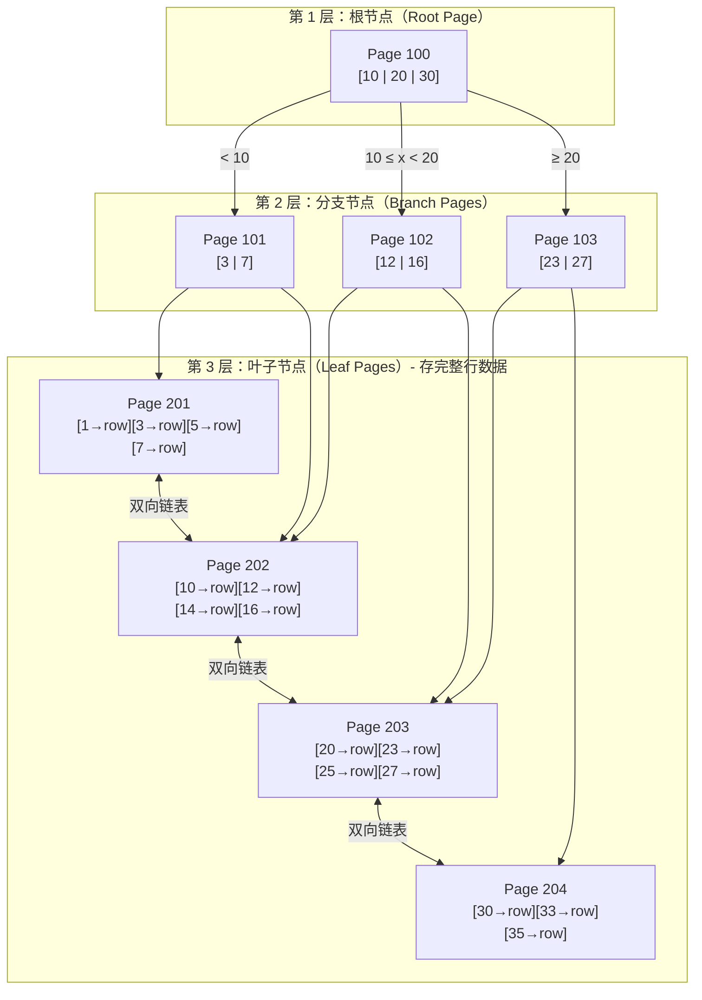
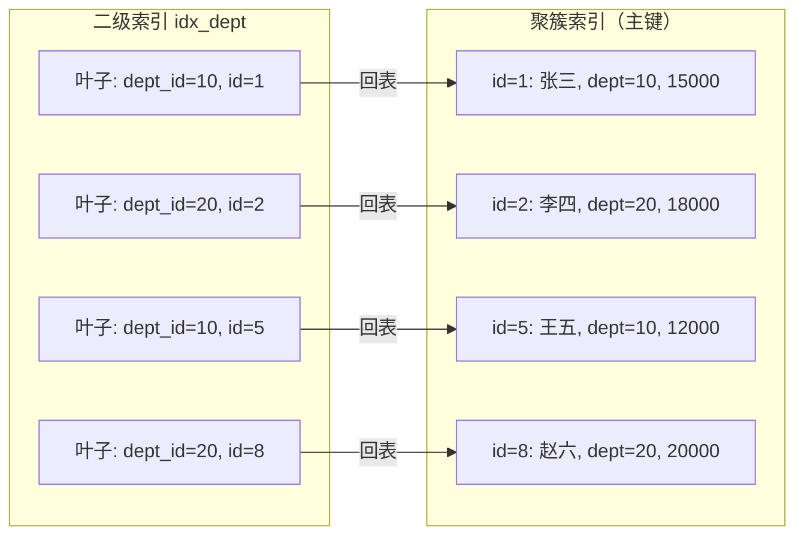
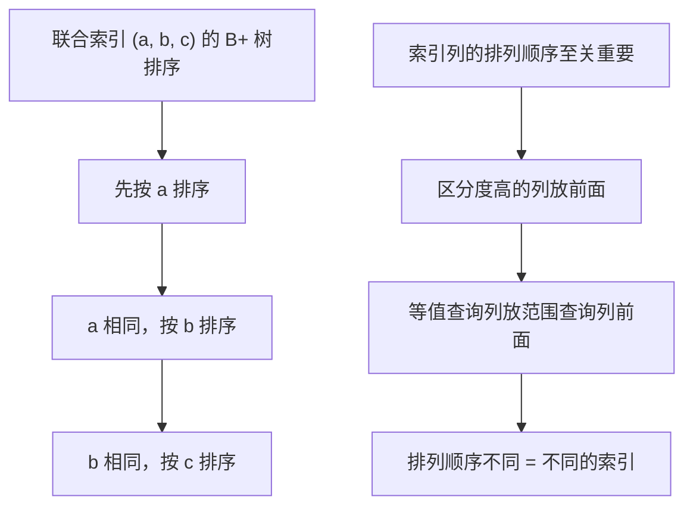
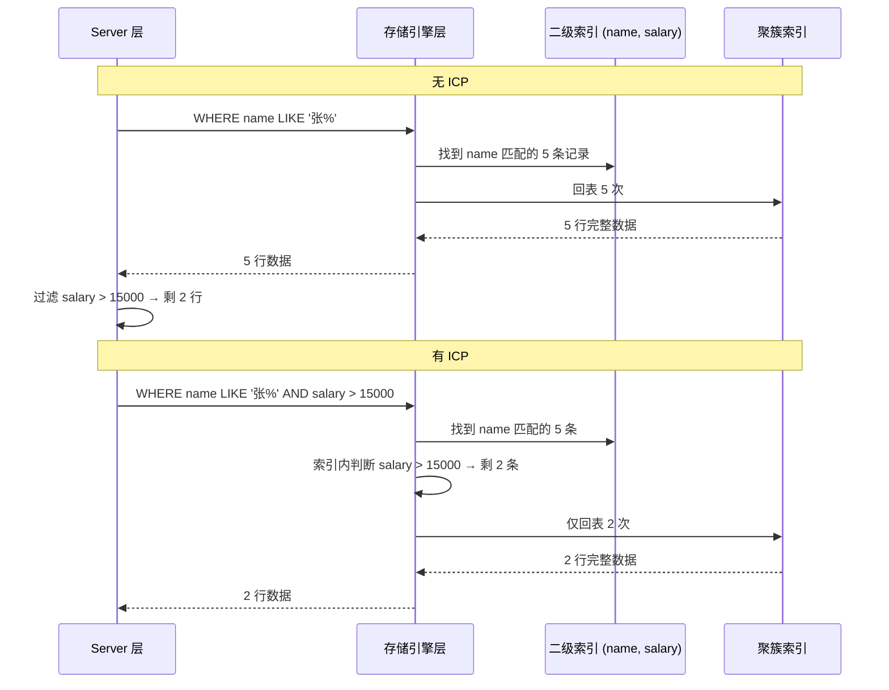

# 索引原理

索引是 MySQL 性能调优的核心。理解 B+ 树结构、聚簇索引与二级索引的区别、索引下推与覆盖索引等机制，才能在面试和实战中设计出高效的索引方案。

## 1. B+ 树结构

### 1.1 为什么选择 B+ 树

| 结构 | 磁盘 IO 次数 | 范围查询 | 数据位置 |
|------|-------------|---------|---------|
| 二叉搜索树 | O(logN) 但树太高 | 需中序遍历 | 节点内 |
| Hash 索引 | O(1) | ❌ 不支持 | 桶内 |
| B 树 | O(logN) | 需中序遍历 | **所有节点** |
| B+ 树 | O(logN) 更矮 | ✅ 叶子链表 | **仅叶子节点** |

B+ 树的优势：
- **非叶子节点只存键值**，单个页能容纳更多键，树更矮，IO 更少
- **叶子节点链表**，范围查询只需顺序扫描
- **数据只存叶子**，查询路径长度一致，性能稳定

### 1.2 B+ 树三层结构示意



::: tip B+ 树能存多少行？
InnoDB 默认页大小 16KB。假设主键 BIGINT（8 字节）+ 指针（6 字节）= 14 字节/键：
- **非叶子节点**：16KB / 14B ≈ 1170 个键
- **叶子节点**：假设行 1KB，16KB / 1KB ≈ 16 行
- **三层 B+ 树**：1170 × 1170 × 16 ≈ **2190 万行**
- 只需 3 次 IO 即可从 2000 万行中找到任意一行！
:::

## 2. 聚簇索引 vs 二级索引

### 2.1 聚簇索引（Clustered Index）

InnoDB 的聚簇索引就是**主键索引**，叶子节点存储**完整的行数据**。一张表只有一个聚簇索引。

```sql
CREATE TABLE employees (
    id         BIGINT UNSIGNED PRIMARY KEY AUTO_INCREMENT,
    name       VARCHAR(64)  NOT NULL,
    dept_id    INT UNSIGNED NOT NULL,
    salary     DECIMAL(10, 2) NOT NULL,
    hire_date  DATE         NOT NULL,
    INDEX idx_dept (dept_id),
    INDEX idx_name_salary (name, salary)
) ENGINE = InnoDB DEFAULT CHARSET = utf8mb4;

-- 聚簇索引结构：
-- 叶子节点按 id 顺序存储完整行：
-- [1|张三|10|15000|2023-01-15] → [2|李四|20|18000|2023-03-20] → ...
```

### 2.2 二级索引（Secondary Index）

二级索引的叶子节点存储**主键值**，不是完整行数据。查询非索引列需要**回表**。



```sql
-- 通过二级索引查询需要回表
SELECT * FROM employees WHERE dept_id = 10;
-- 执行过程：
-- 1. 在 idx_dept 中找到 dept_id=10 的所有主键: [1, 5]
-- 2. 用主键回到聚簇索引查找完整行（回表 2 次）

-- 只查主键和索引列，不需要回表（覆盖索引）
SELECT id, dept_id FROM employees WHERE dept_id = 10;
-- 执行过程：
-- 1. 在 idx_dept 中找到 dept_id=10 的记录
-- 2. 叶子节点已有 id 和 dept_id，无需回表 ✅
```

### 2.3 为什么推荐自增主键

| 主键类型 | 页分裂 | 空间碎片 | 二级索引体积 |
|---------|--------|---------|-------------|
| 自增 INT/BIGINT | 无（顺序追加） | 无 | 小（4/8 字节） |
| UUID / 随机字符串 | **频繁分裂** | **大量碎片** | 大（36 字节） |
| 业务 ID（如订单号） | 视有序程度 | 可能较多 | 中等 |

```sql
-- 自增主键：顺序写入，页不分裂
-- [页1: 1,2,3...100] → [页2: 101,102...200] → ...

-- UUID 主键：随机插入，频繁页分裂
-- 页1: [1,3a5b...,7f2e...,99]  → 中间插入导致分裂
-- 页1': [1,3a5b...,52c1]  页2: [7f2e...,99] → 浪费空间
```

::: important 主键选型建议
1. **首选自增 BIGINT**：顺序写入无页分裂，二级索引紧凑
2. **避免 UUID 做主键**：36 字节 + 随机写入 = 页分裂 + 二级索引膨胀
3. **分布式场景**：雪花算法（Snowflake ID）兼顾有序和分布式唯一
:::

## 3. 索引类型与使用

### 3.1 联合索引与最左前缀

联合索引 `(a, b, c)` 按 a → b → c 顺序组织 B+ 树，遵循**最左前缀法则**。

```sql
-- 联合索引
CREATE INDEX idx_abc ON t1 (a, b, c);

-- 能走索引
WHERE a = 1;                    -- ✅ 匹配 a
WHERE a = 1 AND b = 2;          -- ✅ 匹配 a, b
WHERE a = 1 AND b = 2 AND c = 3;-- ✅ 匹配 a, b, c
WHERE a = 1 AND c = 3;          -- ✅ 匹配 a，c 无法用索引

-- 不能走索引
WHERE b = 2;                    -- ❌ 缺少最左列 a
WHERE b = 2 AND c = 3;          -- ❌ 缺少最左列 a
WHERE c = 3;                    -- ❌ 缺少最左列 a

-- 范围查询会中断后续列的索引使用
WHERE a = 1 AND b > 2 AND c = 3; -- ✅ a, b 用索引，c 无法用
```



### 3.2 覆盖索引（Covering Index）

当查询所需的所有列都在索引中，无需回表，称为覆盖索引。

```sql
-- 联合索引 idx_name_salary (name, salary)
SELECT name, salary FROM employees WHERE name = '张三';
-- Extra: Using index  ← 覆盖索引，无需回表

SELECT * FROM employees WHERE name = '张三';
-- Extra: NULL  ← 需要回表获取 dept_id, hire_date 等列

-- 优化：通过调整联合索引列来覆盖查询
CREATE INDEX idx_name_salary_dept ON employees (name, salary, dept_id);
SELECT name, salary, dept_id FROM employees WHERE name = '张三';
-- Extra: Using index  ← 覆盖索引
```

::: tip 覆盖索引是性能利器
`EXPLAIN` 中 `Extra` 列出现 `Using index` 表示触发了覆盖索引。减少回表意味着减少大量随机 IO，对于高并发查询场景效果显著。
:::

### 3.3 索引下推（Index Condition Pushdown, ICP）

MySQL 5.6 引入的优化，在**存储引擎层**提前过滤，减少回表次数。

```sql
-- 联合索引 (name, salary)
SELECT * FROM employees WHERE name LIKE '张%' AND salary > 15000;

-- 无 ICP（5.6 之前）：
-- 1. 存储引擎通过 name LIKE '张%' 找到所有匹配的主键
-- 2. 回表获取完整行
-- 3. Server 层再过滤 salary > 15000
-- 回表次数 = name LIKE '张%' 匹配的行数

-- 有 ICP（5.6+）：
-- 1. 存储引擎通过 name LIKE '张%' 找到匹配记录
-- 2. 在索引内直接判断 salary > 15000（下推条件）
-- 3. 只对同时满足两个条件的记录回表
-- 回表次数 = name LIKE '张%' AND salary > 15000 的行数（更少）
```



::: important ICP 触发条件
- `EXPLAIN` 中 `Extra` 列显示 `Using index condition`
- 仅适用于二级索引（聚簇索引无回表概念）
- 联合索引的最左前缀列用于检索，后续列用于条件过滤
- 子查询条件不能下推
:::

### 3.4 索引合并（Index Merge）

MySQL 可以对同一张表的多个索引合并使用：

```sql
-- 两个单列索引
CREATE INDEX idx_a ON t1 (a);
CREATE INDEX idx_b ON t1 (b);

-- Index Merge Intersection（交集）
SELECT * FROM t1 WHERE a = 1 AND b = 2;
-- 同时用 idx_a 和 idx_b 查找，取交集后回表
-- Extra: Using intersect(idx_a,idx_b)

-- Index Merge Union（并集）
SELECT * FROM t1 WHERE a = 1 OR b = 2;
-- Extra: Using union(idx_a,idx_b)

-- Index Merge Sort-Union（排序并集）
SELECT * FROM t1 WHERE a > 1 OR b < 5;
-- 各索引范围扫描后排序合并
-- Extra: Using sort_union(idx_a,idx_b)
```

::: warning 索引合并不如联合索引
Index Merge 看似能用多个单列索引，但效果远不如一个精心设计的联合索引。OR 条件尤其危险——如果查询频繁，应建立合适的联合索引代替依赖 Index Merge。
:::

## 4. EXPLAIN 详解

```sql
EXPLAIN SELECT e.name, d.dept_name
FROM employees e
JOIN departments d ON e.dept_id = d.id
WHERE e.salary > 10000 AND d.dept_name = '技术部';
```

| 列 | 含义 | 关键值 |
|----|------|--------|
| id | 查询序号 | 子查询/JOIN 越大越先执行 |
| select_type | 查询类型 | SIMPLE / PRIMARY / SUBQUERY / DERIVED |
| table | 访问的表 | 衍生表为 `<derivedN>` |
| partitions | 匹配的分区 | 非分区表为 NULL |
| **type** | **访问类型** | **从好到差：** system > const > eq_ref > ref > range > index > ALL |
| possible_keys | 可能使用的索引 | NULL 表示无可用索引 |
| key | 实际使用的索引 | NULL 表示未用索引 |
| key_len | 使用的索引长度 | 判断联合索引用了几列 |
| ref | 与索引比较的列 | const / 列名 |
| rows | 预估扫描行数 | 越小越好 |
| filtered | 过滤比例 | 100 最佳，10 表示 90% 被丢弃 |
| **Extra** | **额外信息** | Using index / Using where / Using filesort / Using temporary |

### type 列详解

```sql
-- system / const：最多一行匹配
SELECT * FROM employees WHERE id = 1;
-- type: const（主键/唯一索引等值查询）

-- eq_ref：关联查询中，每次匹配一行
SELECT * FROM employees e JOIN departments d ON e.dept_id = d.id;
-- d 表 type: eq_ref（主键关联）

-- ref：非唯一索引等值查询
SELECT * FROM employees WHERE dept_id = 10;
-- type: ref（dept_id 非唯一）

-- range：索引范围扫描
SELECT * FROM employees WHERE salary BETWEEN 10000 AND 20000;
-- type: range

-- index：全索引扫描
SELECT id FROM employees;
-- type: index（扫描二级索引，比 ALL 好）

-- ALL：全表扫描
SELECT * FROM employees;
-- type: ALL（最差，必须优化）
```

### Extra 列关键值

| Extra 值 | 含义 | 优化建议 |
|----------|------|---------|
| Using index | 覆盖索引 | ✅ 最佳 |
| Using index condition | 索引下推 | ✅ 已优化 |
| Using where | Server 层过滤 | 检查能否下推到索引 |
| Using filesort | 额外排序 | ⚠️ 检查 ORDER BY 是否走索引 |
| Using temporary | 使用临时表 | ❌ 需优化，常见于 GROUP BY + DISTINCT |

## 5. 索引失效的常见场景

```sql
-- 1. 对索引列使用函数
SELECT * FROM employees WHERE YEAR(hire_date) = 2023;
-- ❌ 失效，改为：
SELECT * FROM employees WHERE hire_date >= '2023-01-01' AND hire_date < '2024-01-01';

-- 2. 隐式类型转换
SELECT * FROM employees WHERE id = '1';  -- id 是 BIGINT
-- ❌ 字符串转数字，索引失效（MySQL 将 '1' 转为 1）
-- ✅ 保持类型一致：WHERE id = 1

-- 3. LIKE 左模糊
SELECT * FROM employees WHERE name LIKE '%张';
-- ❌ 左模糊无法走 B+ 树
-- ✅ 右模糊可以：WHERE name LIKE '张%'
-- ✅ 全文索引或搜索引擎解决左模糊需求

-- 4. OR 条件中有一方无索引
SELECT * FROM employees WHERE id = 1 OR salary = 15000;
-- ❌ salary 无索引，整条语句退化为全表扫描
-- ✅ 为 salary 建索引，或拆为两条 UNION

-- 5. 不满足最左前缀
-- 联合索引 (a, b, c)
SELECT * FROM t1 WHERE b = 2;
-- ❌ 跳过最左列 a

-- 6. NOT IN / NOT EXISTS / != / <>
SELECT * FROM employees WHERE dept_id != 10;
-- ❌ 优化器可能放弃索引，取决于数据分布

-- 7. IS NOT NULL（视数据分布）
SELECT * FROM employees WHERE dept_id IS NOT NULL;
-- ⚠️ 如果大部分行都不为 NULL，优化器认为全表扫描更快
```

::: important 索引失效不等于一定不用索引
MySQL 优化器会根据统计信息判断。即使索引可用，如果优化器认为全表扫描更快（如数据量小或选择性低），也会放弃索引。关键是看 `EXPLAIN` 的实际执行计划。
:::

## 6. 实际索引设计案例

参考 [DBeaver](https://github.com/dbeaver/dbeaver) 的数据库管理场景，为通用业务系统设计索引：

```sql
-- 电商订单表索引设计
CREATE TABLE ec_orders (
    id             BIGINT UNSIGNED PRIMARY KEY AUTO_INCREMENT,
    order_no       VARCHAR(32)    NOT NULL COMMENT '订单号，如 SN20250115001',
    user_id        BIGINT UNSIGNED NOT NULL,
    status         TINYINT        NOT NULL DEFAULT 0 COMMENT '0待付 1已付 2已发 3完成 4取消',
    total_amount   DECIMAL(12, 2) NOT NULL,
    created_at     DATETIME(3)    NOT NULL DEFAULT CURRENT_TIMESTAMP(3),
    updated_at     DATETIME(3)    NOT NULL DEFAULT CURRENT_TIMESTAMP(3) ON UPDATE CURRENT_TIMESTAMP(3),

    -- 唯一索引：订单号
    UNIQUE INDEX uk_order_no (order_no),

    -- 联合索引：用户查询自己的订单（高频）
    INDEX idx_user_created (user_id, created_at),

    -- 联合索引：后台按状态+时间筛选
    INDEX idx_status_created (status, created_at),

    -- 覆盖索引：订单列表页只需部分字段
    INDEX idx_user_status (user_id, status, created_at, total_amount)
) ENGINE = InnoDB DEFAULT CHARSET = utf8mb4;
```

## 面试技巧

::: important 高频考点
1. **B+ 树 vs B 树**：B+ 树数据只在叶子、叶子有链表、查询路径等长。这是最基础的问题。
2. **聚簇索引 vs 二级索引**：聚簇索引存完整行、二级索引存主键值需回表。面试必问。
3. **为什么推荐自增主键**：避免页分裂 + 二级索引紧凑。两个理由都要说。
4. **最左前缀法则**：联合索引 `(a,b,c)` 能走哪些查询、不能走哪些查询。面试常给 SQL 判断是否走索引。
5. **覆盖索引**：`Using index`，查询列全在索引中无需回表。面试手写 SQL 优化题常用。
6. **索引下推 ICP**：5.6 引入，存储引擎层提前过滤减少回表。面试加分项。
7. **索引失效场景**：函数、隐式转换、左模糊、OR 侧无索引、不满足最左前缀。高频考点。
8. **EXPLAIN 的 type 列**：从好到差排序，至少说出 const/ref/range/index/ALL 的含义。
:::

::: tip 参考资源
- [小林coding - MySQL 索引](https://xiaolincoding.com/mysql/)：图解 B+ 树与索引优化
- [MySQL 8.0 官方文档 - Optimization](https://dev.mysql.com/doc/refman/8.0/en/optimization.html)：索引优化官方指南
- [DBeaver](https://github.com/dbeaver/dbeaver)：使用 ER Diagram 功能可视化索引设计
:::
