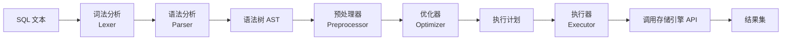
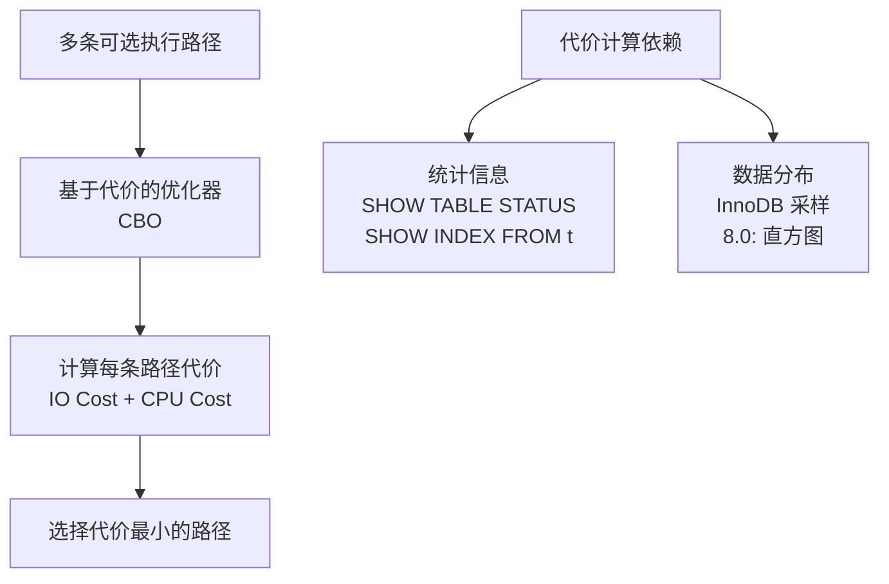
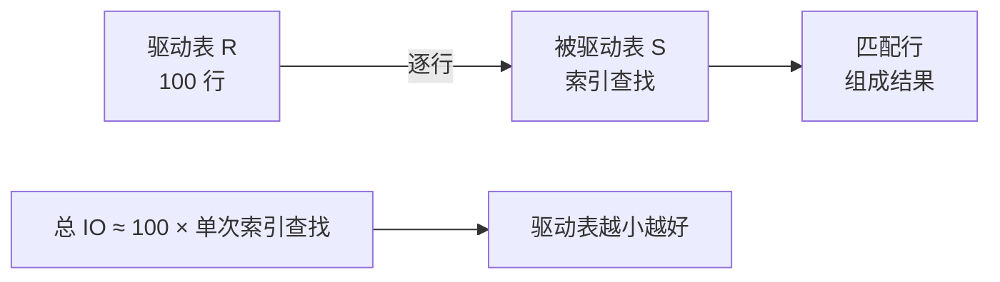
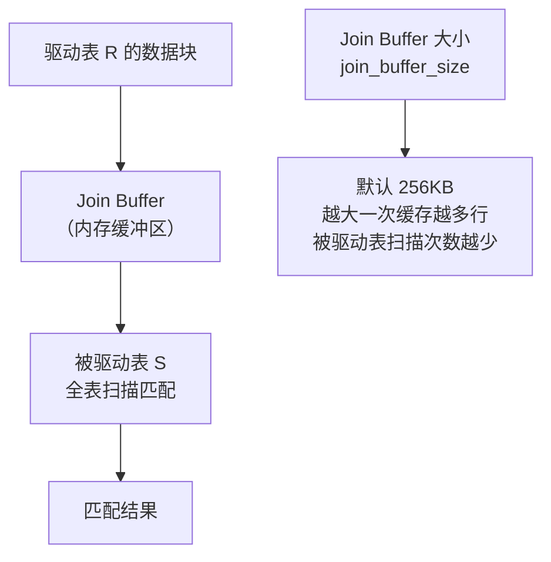
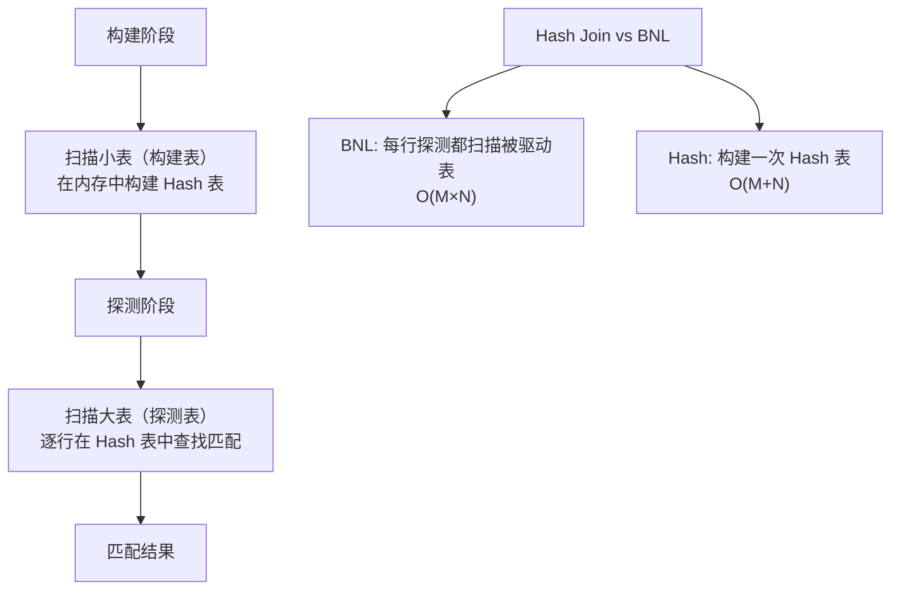
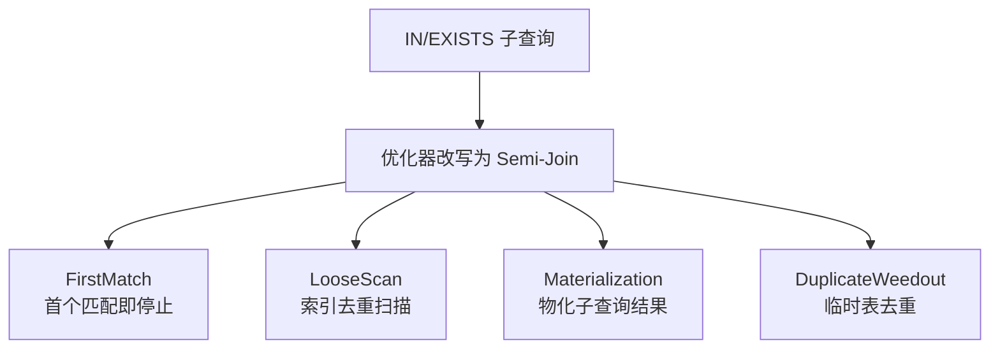

# SQL 执行与优化器

SQL 从文本到结果集，要经过解析、预处理、优化和执行四个阶段。理解优化器的工作原理和 EXPLAIN 的每个字段，是 SQL 调优的必备技能。

## 1. SQL 执行管道



### 1.1 解析器：词法分析 + 语法分析

**词法分析**将 SQL 文本拆分为 Token 序列：

```sql
SELECT name, salary FROM employees WHERE salary > 10000;
-- Token 序列：
-- [SELECT] [name] [,] [salary] [FROM] [employees] [WHERE] [salary] [>] [10000] [;]
--   关键字    列名      列名   关键字  表名    关键字   列名  操作符  数字
```

**语法分析**根据语法规则将 Token 组装成 AST（抽象语法树），并检查语法是否合法。

```sql
-- 语法错误
SELECT * FORM employees;
-- ERROR 1064: near 'FORM employees' — FORM 不是有效关键字

-- 语义错误（预处理器检查）
SELECT * FROM non_exist_table;
-- ERROR 1146: Table 'test.non_exist_table' doesn't exist
```

### 1.2 预处理器

预处理器在语法树基础上进行**语义检查**：

| 检查项 | 说明 |
|--------|------|
| 表/列是否存在 | 对应 `ERROR 1146` / `ERROR 1054` |
| 列歧义 | 多表 JOIN 时列名不明确 |
| 权限验证 | SELECT 权限、列级权限 |
| 星号展开 | `SELECT *` 展开为所有列名 |

### 1.3 优化器

优化器决定**执行计划**——选择哪个索引、JOIN 顺序、是否使用临时表等。



## 2. 基于代价的优化器（CBO）

### 2.1 代价模型

MySQL 使用 **Cost-Based Optimizer**，代价 = IO Cost + CPU Cost。

```sql
-- 查看优化器代价常量
SELECT * FROM mysql.server_cost;
SELECT * FROM mysql.engine_cost;

-- server_cost 示例
-- +------------------------------+------------+---------------------+---------+
-- | cost_name                    | cost_value | default_value       | comment |
-- +------------------------------+------------+---------------------+---------+
-- | disk_temptable_create_cost   |       NULL |                20.0 |         |
-- | disk_temptable_row_cost      |       NULL |                 0.5 |         |
-- | key_compare_cost             |       NULL |              0.05  |         |
-- | memory_temptable_create_cost |       NULL |                 1.0 |         |
-- | memory_temptable_row_cost    |       NULL |               0.1  |         |
-- | row_evaluate_cost            |       NULL |               0.1  |         |
-- +------------------------------+------------+---------------------+---------+
```

**代价估算公式：**

```
全表扫描代价 ≈ 聚簇索引页数 × IO_COST + 行数 × row_evaluate_cost

索引扫描代价 ≈ 索引层级数 × IO_COST + 预估行数 × row_evaluate_cost + 回表行数 × IO_COST
```

### 2.2 统计信息

优化器的决策依赖统计信息，统计信息不准确会导致选错执行计划。

```sql
-- 查看表统计信息
SHOW TABLE STATUS LIKE 'employees';
-- Rows: 98542  -- 预估行数（非精确值）
-- Data_length: 15859712  -- 数据文件大小

-- 查看索引统计信息
SHOW INDEX FROM employees;
-- Cardinality: 48  -- 索引列不同值的预估数量
-- Cardinality 越高，选择性越好，索引越有效

-- 更新统计信息
ANALYZE TABLE employees;
-- 重新采样索引 Cardinality 和表的 Rows

-- MySQL 8.0 直方图（更精确的数据分布）
ANALYZE TABLE employees UPDATE HISTOGRAM ON salary WITH 256 BUCKETS;
SELECT * FROM information_schema.COLUMN_STATISTICS
WHERE TABLE_NAME = 'employees' AND COLUMN_NAME = 'salary';
```

::: warning 统计信息过时导致的问题
- 大量 INSERT/DELETE 后，统计信息可能偏离实际
- 优化器可能选择全表扫描而非索引扫描
- 解决：定期 `ANALYZE TABLE` 或在大量 DML 后手动执行
:::

## 3. EXPLAIN 详解

### 3.1 EXPLAIN 输出格式

```sql
EXPLAIN SELECT * FROM employees WHERE dept_id = 10 AND salary > 10000;

-- +----+-------------+-----------+------------+-------+-------------------+-------------------+---------+------+------+----------+-----------------------+
-- | id | select_type | table     | partitions | type  | possible_keys     | key               | key_len | ref  | rows | filtered | Extra                 |
-- +----+-------------+-----------+------------+-------+-------------------+-------------------+---------+------+------+----------+-----------------------+
-- |  1 | SIMPLE      | employees | NULL       | ref   | idx_dept,idx_sal  | idx_dept          | 4       | const|  120 |    33.33 | Using index condition |
-- +----+-------------+-----------+------------+-------+-------------------+-------------------+---------+------+------+----------+-----------------------+
```

### 3.2 各列详解

#### id

查询序号，值越大越先执行。相同 id 从上往下执行。

```sql
-- 子查询产生不同 id
EXPLAIN SELECT * FROM employees
WHERE dept_id = (SELECT id FROM departments WHERE dept_name = '技术部');

-- id=1: employees 表（后执行）
-- id=2: departments 表（先执行，子查询）
```

#### select_type

| 值 | 含义 |
|----|------|
| SIMPLE | 简单查询（无 UNION / 子查询） |
| PRIMARY | 最外层查询 |
| SUBQUERY | 非相关子查询 |
| DEPENDENT SUBQUERY | 相关子查询（性能差） |
| DERIVED | FROM 子句中的子查询（派生表） |
| UNION | UNION 中的第二个及之后的 SELECT |
| UNION RESULT | UNION 的结果 |

#### type（访问类型）

从最优到最差排序：

```
system > const > eq_ref > ref > fulltext > ref_or_null > index_merge >
range > index > ALL
```

| type | 含义 | 示例 |
|------|------|------|
| system | 表中只有一行 | `SELECT * FROM dual` |
| const | 主键/唯一索引等值查询 | `WHERE id = 1` |
| eq_ref | JOIN 中被驱动表的主键/唯一索引 | `JOIN ... ON t1.id = t2.id` |
| ref | 非唯一索引等值查询 | `WHERE dept_id = 10` |
| range | 索引范围扫描 | `WHERE salary BETWEEN 10000 AND 20000` |
| index | 全索引扫描 | `SELECT id FROM t1` |
| ALL | 全表扫描 | `SELECT * FROM t1`（无 WHERE） |

#### key_len 计算与联合索引用法

```sql
-- 联合索引 idx_abc (a INT, b VARCHAR(64), c INT)
-- 计算规则：
-- INT: 4 字节 + 1 字节(NULL) = 5
-- VARCHAR(64) utf8mb4: 64*4 + 2(长度) + 1(NULL) = 259
-- INT: 4 字节 + 1 字节(NULL) = 5

EXPLAIN SELECT * FROM t1 WHERE a = 1;
-- key_len = 5 → 只用了 a

EXPLAIN SELECT * FROM t1 WHERE a = 1 AND b = 'test';
-- key_len = 5 + 259 = 264 → 用了 a, b

EXPLAIN SELECT * FROM t1 WHERE a = 1 AND b = 'test' AND c = 3;
-- key_len = 264 + 5 = 269 → 用了 a, b, c

EXPLAIN SELECT * FROM t1 WHERE a = 1 AND c = 3;
-- key_len = 5 → 只用了 a，c 无法用（违反最左前缀）
```

::: tip 通过 key_len 判断联合索引用了几列
key_len 是实际使用的索引字节数。对比各列的字节数就能判断联合索引用了几列。这是分析 EXPLAIN 的关键技能。
:::

#### Extra 详解

| Extra 值 | 含义 | 优化建议 |
|----------|------|---------|
| Using index | 覆盖索引 | ✅ 最佳 |
| Using index condition | 索引下推 ICP | ✅ 已优化 |
| Using where | Server 层过滤 | 检查能否下推 |
| Using filesort | 额外排序（非索引排序） | ⚠️ 检查 ORDER BY |
| Using temporary | 使用临时表 | ❌ 需优化 |
| Using MRR | Multi-Range Read 优化 | ✅ 减少随机 IO |
| FirstMatch | 半连接优化（8.0+） | ✅ 子查询优化 |

### 3.3 EXPLAIN FORMAT=TREE（8.0.16+）

```sql
EXPLAIN FORMAT=TREE
SELECT * FROM employees WHERE dept_id = 10 AND salary > 10000;

-- -> Filter: (employees.salary > 10000.00)
--     -> Index lookup on employees using idx_dept (dept_id=10)
--        -> Cost: 24.50 rows: 120
```

### 3.4 EXPLAIN ANALYZE（8.0.18+）

```sql
EXPLAIN ANALYZE
SELECT * FROM employees WHERE dept_id = 10 AND salary > 10000;

-- -> Filter: (employees.salary > 10000.00)
--     (actual time=0.15..0.42 rows=40 loops=1)
--     -> Index lookup on employees using idx_dept (dept_id=10)
--         (actual time=0.12..0.30 rows=120 loops=1)
--         Cost: 24.50 rows: 120

-- actual time: 实际执行时间
-- rows: 实际返回行数
-- loops: 循环次数
```

## 4. OPTIMIZER_TRACE

```sql
-- 开启 optimizer trace
SET optimizer_trace = 'enabled=on';

-- 执行查询
SELECT * FROM employees WHERE dept_id = 10 AND salary > 10000;

-- 查看 trace
SELECT * FROM information_schema.OPTIMIZER_TRACE\G

-- 关键输出
-- {
--   "steps": [
--     {
--       "join_preparation": { ... },
--       "join_optimization": {
--         "steps": [
--           { "condition_processing": { ... } },
--           { "refine_plan": { ... } }
--         ],
--         "best_plan": {
--           "query_block": {
--             "table": "employees",
--             "best_access_path": {
--               "considered_access_paths": [
--                 { "access_type": "ref", "index": "idx_dept", "cost": 24.5 },
--                 { "access_type": "scan", "cost": 150.2 }
--               ],
--               "chosen_access_method": { "access_type": "ref", "index": "idx_dept" }
--             }
--           }
--         }
--       }
--     }
--   ]
-- }

-- 关闭
SET optimizer_trace = 'enabled=off';
```

::: tip OPTIMIZER_TRACE 是分析优化器决策的终极工具
当 EXPLAIN 无法解释"为什么选了这个索引"时，OPTIMIZER_TRACE 会展示优化器考虑的所有候选方案及其代价计算过程。适合排查优化器选错索引的问题。
:::

## 5. JOIN 优化

### 5.1 Nested Loop Join（NLJ）

最基础的 JOIN 算法：对驱动表的每一行，到被驱动表中查找匹配行。



```sql
-- Nested Loop Join
SELECT * FROM employees e JOIN departments d ON e.dept_id = d.id;

-- 执行过程：
-- 1. 扫描 employees（驱动表）
-- 2. 对每行 e.dept_id，在 departments.id 上做等值查找
-- 3. 被驱动表有索引时，每次查找 ≈ 树高度次 IO
```

### 5.2 Block Nested Loop Join（BNL）

当被驱动表 JOIN 列**无索引**时，使用 Join Buffer 缓存驱动表数据，减少被驱动表扫描次数。



```sql
-- BNL 示例：dept_id 无索引
SELECT * FROM employees e JOIN departments d ON e.dept_name = e.name;
-- Extra: Using join buffer (Block Nested Loop)

-- 查看 join_buffer_size
SHOW VARIABLES LIKE 'join_buffer_size';
-- +------------------+--------+
-- | Variable_name    | Value  |
-- +------------------+--------+
-- | join_buffer_size | 262144 |  -- 256KB
-- +------------------+--------+
```

### 5.3 Index Nested Loop Join（INL）

被驱动表 JOIN 列有索引时的最优路径。

```sql
-- INL 示例：departments.id 有主键索引
EXPLAIN SELECT * FROM employees e JOIN departments d ON e.dept_id = d.id;
-- e 表: type=ALL（全表扫描，驱动表）
-- d 表: type=eq_ref（主键查找，被驱动表）

-- 优化：确保被驱动表 JOIN 列有索引
-- 优化：小表做驱动表（减少循环次数）
```

### 5.4 Hash Join（8.0.18+）

MySQL 8.0.18 引入 Hash Join 替代 BNL，性能显著提升。



```sql
-- Hash Join 自动使用（8.0.18+，当无索引可用时）
EXPLAIN FORMAT=TREE
SELECT * FROM employees e JOIN departments d ON e.dept_name = e.name;
-- -> Inner hash join (no matching index)
--     -> Scan on d
--     -> Hash on e
```

::: important JOIN 优化要点
1. **被驱动表 JOIN 列建索引**：这是最有效的优化
2. **小表做驱动表**：减少循环次数
3. **用 EXPLAIN 检查 type**：被驱动表至少 ref，ALL 意味着 BNL/Hash Join
4. **8.0+ 优先用 Hash Join**：自动替代 BNL，无需索引也能高效
:::

## 6. 子查询优化

### 6.1 子查询类型与优化策略

```sql
-- 1. 标量子查询（返回单值）→ 优化为缓存
SELECT * FROM employees
WHERE salary = (SELECT MAX(salary) FROM employees);

-- 2. 相关子查询（依赖外层）→ 优化为 Semi-Join
SELECT * FROM departments d
WHERE EXISTS (SELECT 1 FROM employees e WHERE e.dept_id = d.id AND e.salary > 15000);

-- 3. IN 子查询 → 优化为 Semi-Join（5.6+）
SELECT * FROM employees
WHERE dept_id IN (SELECT id FROM departments WHERE region = '华东');

-- 4. NOT EXISTS → 优化为 Anti-Join
SELECT * FROM departments d
WHERE NOT EXISTS (SELECT 1 FROM employees e WHERE e.dept_id = d.id);
```

### 6.2 Semi-Join 优化策略（5.6+）



```sql
-- 查看 Semi-Join 策略
SET optimizer_trace = 'enabled=on';
SELECT * FROM departments WHERE id IN (SELECT dept_id FROM employees WHERE salary > 15000);
SELECT TRACE FROM information_schema.OPTIMIZER_TRACE\G
-- 搜索 "semijoin" 关键字查看选择的策略
SET optimizer_trace = 'enabled=off';
```

::: warning 避免相关子查询
相关子查询每行外层结果都要执行一次子查询，性能极差。应改写为 JOIN：

```sql
-- 差：相关子查询
SELECT * FROM orders o
WHERE EXISTS (SELECT 1 FROM order_items oi WHERE oi.order_id = o.id AND oi.price > 1000);

-- 好：改写为 JOIN
SELECT DISTINCT o.* FROM orders o
JOIN order_items oi ON oi.order_id = o.id AND oi.price > 1000;
```
:::

## 7. 排序优化（filesort vs 索引排序）

```sql
-- 索引排序（最佳）：ORDER BY 列在索引中且顺序一致
-- 联合索引 idx_status_created (status, created_at)
SELECT * FROM employees WHERE status = 1 ORDER BY created_at;
-- Extra: Using index（覆盖索引）或无 filesort

-- filesort：无法利用索引排序
SELECT * FROM employees ORDER BY salary;
-- Extra: Using filesort

-- filesort 的两种算法
-- 1. 双路排序（旧版）：读取行指针 + ORDER BY 列 → 排序 → 回表读取完整行
-- 2. 单路排序（优化）：一次性读取所有需要的列到 Sort Buffer → 排序 → 直接返回

-- Sort Buffer 大小
SHOW VARIABLES LIKE 'sort_buffer_size';
-- 默认 256KB，不足时使用临时文件（磁盘排序，性能差）
```

## 面试技巧

::: important 高频考点
1. **SQL 执行流程**：连接器 → 解析器（词法+语法）→ 预处理器 → 优化器 → 执行器。面试第一题常考。
2. **CBO 代价模型**：IO Cost + CPU Cost，依赖统计信息。统计信息不准导致选错索引。
3. **EXPLAIN 全字段**：type 列从好到差排序、key_len 计算联合索引用了几列、Extra 含义。面试常给 EXPLAIN 结果让你分析。
4. **key_len 计算方法**：INT=4+1(NULL)，VARCHAR(N)=N*4+2+1(NULL)。这是判断联合索引用了几列的关键。
5. **NLJ vs BNL vs Hash Join**：被驱动表有索引用 NLJ（INL），无索引用 BNL（8.0前）或 Hash Join（8.0+）。小表做驱动表。
6. **OPTIMIZER_TRACE**：面试加分项，能说出用这个工具分析优化器为什么选错索引。
7. **子查询优化**：IN/EXISTS 会被改写为 Semi-Join；相关子查询应改写为 JOIN。
:::

::: tip 参考资源
- [小林coding - SQL 执行与优化](https://xiaolincoding.com/mysql/)：图解优化器与执行计划
- [MySQL 8.0 官方文档 - Optimizer](https://dev.mysql.com/doc/refman/8.0/en/optimizer-overview.html)：优化器架构与代价模型
- [DBeaver](https://github.com/dbeaver/dbeaver)：使用 Explain Execution Plan 功能可视化执行计划
:::
