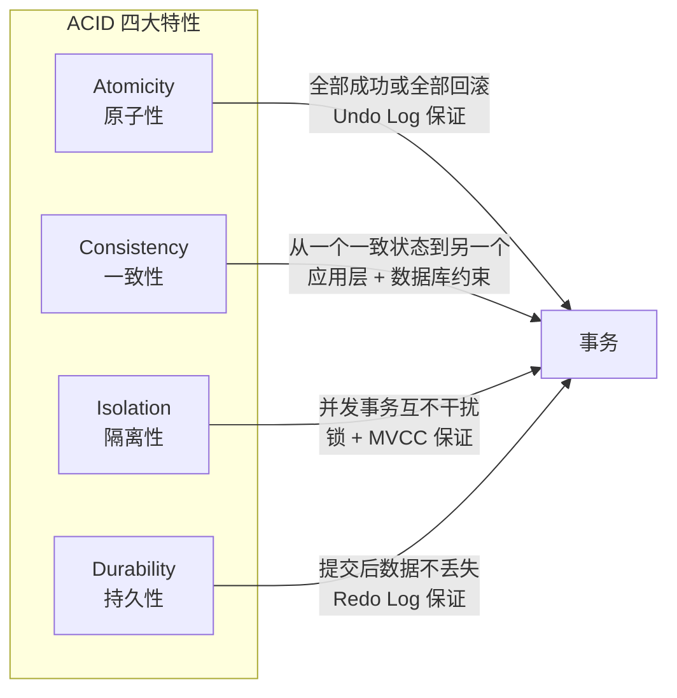
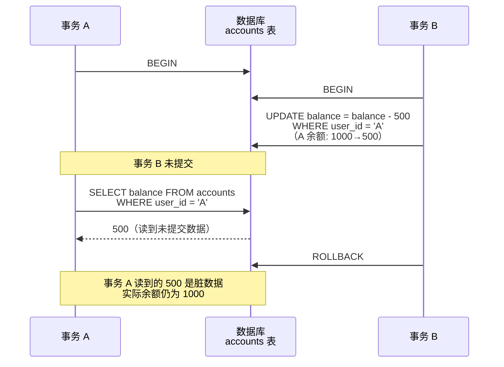
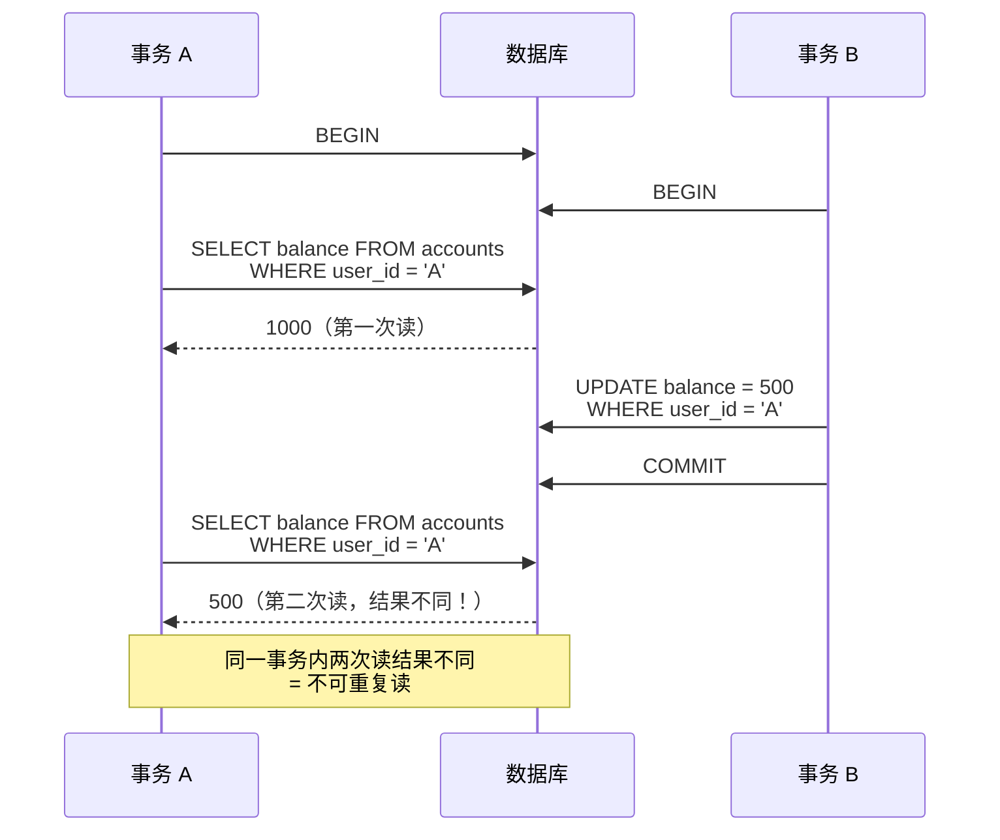
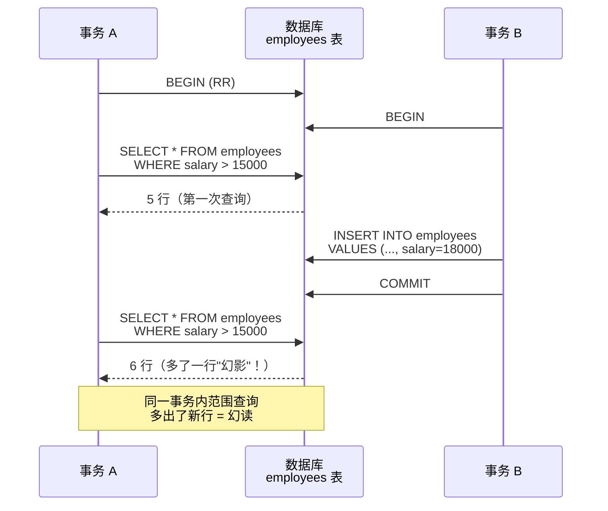
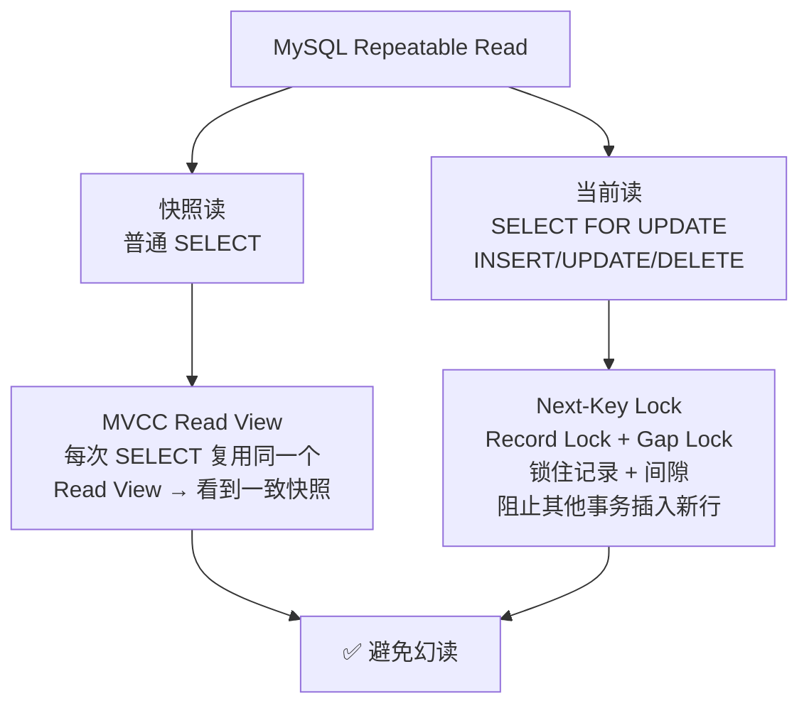
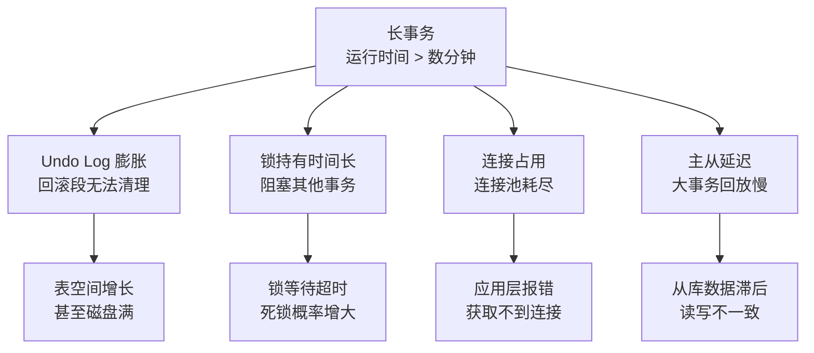

# 事务与 ACID

事务是数据库区别于文件系统的核心特性。理解 ACID 的含义、四种隔离级别的区别、以及三种读问题的成因，是数据库知识的基石。

## 1. ACID 详解



### 1.1 原子性（Atomicity）

事务中的操作**要么全部成功，要么全部回滚**，不存在部分执行的状态。

```sql
-- 转账场景：A 扣钱 + B 加钱 必须同时成功或同时失败
BEGIN;
UPDATE accounts SET balance = balance - 500 WHERE user_id = 'A';
UPDATE accounts SET balance = balance + 500 WHERE user_id = 'B';
COMMIT;

-- 如果第二条失败，第一条也会回滚
-- 原子性由 Undo Log 保证：回滚时逆序执行 Undo Log 中的反向操作
```

### 1.2 一致性（Consistency）

事务执行前后，数据库从一个一致状态变为另一个一致状态。一致性由**原子性 + 隔离性 + 持久性 + 应用层约束**共同保证。

```sql
-- 一致性约束：余额不能为负
ALTER TABLE accounts ADD CONSTRAINT chk_balance CHECK (balance >= 0);

BEGIN;
UPDATE accounts SET balance = balance - 500 WHERE user_id = 'A';
-- 如果 A 余额不足 500，CHECK 约束报错，事务回滚
-- 保证了余额不可能出现负数（一致性）
COMMIT;
```

### 1.3 隔离性（Isolation）

并发事务之间互不干扰，一个事务的中间状态对其他事务不可见。

```sql
-- 隔离性由锁 + MVCC 共同保证
-- MySQL 默认隔离级别：Repeatable Read（可重复读）
SHOW VARIABLES LIKE 'transaction_isolation';
-- +-----------------------+-----------------+
-- | Variable_name         | Value           |
-- +-----------------------+-----------------+
-- | transaction_isolation | REPEATABLE-READ |
-- +-----------------------+-----------------+
```

### 1.4 持久性（Durability）

事务一旦提交，数据**永久保存**，即使系统崩溃也不丢失。

```sql
-- 持久性由 Redo Log 保证
-- 提交时先写 Redo Log（WAL），再写数据页
-- 崩溃恢复时重放 Redo Log 恢复已提交的数据
```

::: important ACID 的实现基础
| 特性 | 实现机制 | 日志 |
|------|---------|------|
| 原子性 | Undo Log | 回滚段 |
| 一致性 | 约束 + AID 共同保证 | - |
| 隔离性 | 锁 + MVCC | Undo Log（版本链） |
| 持久性 | Redo Log + WAL | ib_logfile |
:::

## 2. 事务隔离级别

### 2.1 四种隔离级别

| 隔离级别 | 脏读 | 不可重复读 | 幻读 | 性能 |
|---------|------|-----------|------|------|
| Read Uncommitted（读未提交） | ❌ 可能 | ❌ 可能 | ❌ 可能 | 最高 |
| Read Committed（读已提交） | ✅ 避免 | ❌ 可能 | ❌ 可能 | 高 |
| **Repeatable Read（可重复读）** | ✅ 避免 | ✅ 避免 | ✅ 避免* | 中 |
| Serializable（串行化） | ✅ 避免 | ✅ 避免 | ✅ 避免 | 最低 |

> *MySQL 的 RR 级别通过 MVCC + Gap Lock 基本避免幻读，但存在特殊场景下的幻读。

### 2.2 三种读问题详解

#### 脏读（Dirty Read）

一个事务读到了另一个事务**未提交**的数据。



```sql
-- Read Uncommitted 级别下可复现
SET SESSION TRANSACTION ISOLATION LEVEL READ UNCOMMITTED;
```

#### 不可重复读（Non-Repeatable Read）

同一事务内，两次读同一行数据**结果不同**（被其他已提交事务修改）。



```sql
-- Read Committed 级别下可复现
SET SESSION TRANSACTION ISOLATION LEVEL READ COMMITTED;
```

#### 幻读（Phantom Read）

同一事务内，两次**范围查询**结果不同（被其他已提交事务插入了新行）。



```sql
-- MySQL RR 级别通过以下机制避免幻读：
-- 1. 快照读（普通 SELECT）：MVCC Read View 保证看到的一致性快照
-- 2. 当前读（SELECT ... FOR UPDATE）：Gap Lock 锁住间隙，阻止插入
```

### 2.3 MySQL RR 级别如何避免幻读



::: warning RR 级别的幻读特例
以下场景仍可能出现幻读：

```sql
-- 事务 A
BEGIN;
SELECT * FROM employees WHERE id = 999;  -- 不存在（快照读）
-- 此时 Read View 已创建

-- 事务 B
INSERT INTO employees VALUES (999, '新员工', ...);
COMMIT;

-- 事务 A
UPDATE employees SET name = '改名' WHERE id = 999;  -- 当前读，能更新成功！
SELECT * FROM employees WHERE id = 999;  -- 现在能读到了（自己更新的）
-- 幻读发生！
```
原因：UPDATE 是当前读，能读到其他事务已提交的新行。更新后该行对当前事务可见。
:::

## 3. 隔离级别操作

```sql
-- 查看当前隔离级别
SELECT @@transaction_isolation;

-- 设置会话级隔离级别
SET SESSION TRANSACTION ISOLATION LEVEL READ COMMITTED;
SET SESSION TRANSACTION ISOLATION LEVEL REPEATABLE READ;
SET SESSION TRANSACTION ISOLATION LEVEL SERIALIZABLE;

-- 设置全局隔离级别
SET GLOBAL TRANSACTION ISOLATION LEVEL READ COMMITTED;

-- 语法变体（5.7 兼容）
SET SESSION TRANSACTION ISOLATION LEVEL READ COMMITTED;
-- 等价于
SET SESSION tx_isolation = 'READ-COMMITTED';  -- 5.7 变量名

-- 在事务中修改隔离级别（8.0+）
-- 注意：必须在事务外设置，不能在事务进行中修改
```

## 4. 长事务的危害



```sql
-- 查看运行中的事务
SELECT * FROM information_schema.INNODB_TRX\G

-- 关键字段
-- trx_id: 事务 ID
-- trx_state: RUNNING / LOCK WAIT
-- trx_started: 开始时间
-- trx_query: 正在执行的 SQL
-- trx_tables_locked: 锁定的表数
-- trx_rows_locked: 锁定的行数

-- 查看长事务（运行超过 60 秒）
SELECT
    trx_id,
    trx_state,
    trx_started,
    TIMESTAMPDIFF(SECOND, trx_started, NOW()) AS duration_sec,
    trx_query
FROM information_schema.INNODB_TRX
HAVING duration_sec > 60;

-- 杀掉长事务
KILL <thread_id>;  -- 从 SHOW PROCESSLIST 获取
```

::: important 长事务的预防措施
1. 事务内不要有 RPC 调用、文件 IO 等耗时操作
2. 事务范围尽量小，只包含必要的 SQL
3. 设置 `innodb_kill_idle_transaction`（Percona）或使用中间件超时
4. 监控 `information_schema.INNODB_TRX`，告警运行超过阈值的事务
:::

## 5. Savepoint

Savepoint 允许在事务中设置保存点，回滚到指定位置而非整个事务。

```sql
BEGIN;

-- 操作 1
UPDATE accounts SET balance = balance - 500 WHERE user_id = 'A';
SAVEPOINT sp1;

-- 操作 2
UPDATE accounts SET balance = balance - 200 WHERE user_id = 'A';
SAVEPOINT sp2;

-- 操作 3
INSERT INTO transfer_log (from_user, amount) VALUES ('A', 200);

-- 发现操作 3 有问题，回滚到 sp2
ROLLBACK TO sp2;
-- 操作 3 撤销，操作 1 和 2 保留

-- 继续操作
UPDATE accounts SET balance = balance + 500 WHERE user_id = 'B';

COMMIT;
-- 最终：操作 1、2、B 加钱生效，操作 3 被回滚
```

```sql
-- 删除 Savepoint
RELEASE SAVEPOINT sp1;
-- 释放后不能再 ROLLBACK TO sp1
```

::: tip Savepoint 的使用场景
- 复杂事务中部分操作可能失败，但不需要回滚整个事务
- 批量操作中逐条尝试，失败回滚到保存点继续下一条
- 应用层实现"软事务"：部分成功部分失败时，只回滚失败的部分
:::

## 6. 事务的隐式提交

以下 SQL 会**隐式提交**当前事务：

```sql
-- DDL 语句会隐式提交
BEGIN;
UPDATE accounts SET balance = balance - 500 WHERE user_id = 'A';
ALTER TABLE accounts ADD COLUMN remark VARCHAR(200);  -- 隐式 COMMIT！
ROLLBACK;  -- 无效！ALTER TABLE 前的 UPDATE 已提交

-- 其他隐式提交语句
-- CREATE / ALTER / DROP / RENAME TABLE
-- CREATE INDEX / DROP INDEX
-- TRUNCATE TABLE
-- LOCK TABLES / UNLOCK TABLES
-- LOAD DATA INFILE
-- START TRANSACTION（开启新事务时隐式提交旧事务）
```

::: warning 事务中不要执行 DDL
DDL 会导致隐式提交，破坏事务的原子性。如果必须在事务中修改表结构，请先完成 DML 事务，再单独执行 DDL。
:::

## 面试技巧

::: important 高频考点
1. **ACID 含义与实现**：原子性（Undo Log）、一致性（AID + 约束）、隔离性（锁 + MVCC）、持久性（Redo Log）。面试必问。
2. **四种隔离级别**：RU / RC / RR / Serializable，分别解决哪些读问题。能画表格。
3. **三种读问题**：脏读（读未提交）、不可重复读（同行被改）、幻读（范围多行）。用例子说明。
4. **MySQL RR 如何避免幻读**：MVCC（快照读）+ Gap Lock（当前读）。面试高频。
5. **RR 级别的幻读特例**：先快照读（不存在）→ 再当前读（UPDATE）→ 出现幻读。这个细节是面试加分项。
6. **长事务危害**：Undo Log 膨胀、锁持有时间长、主从延迟。面试常结合实际场景问。
7. **隐式提交**：DDL 会隐式 COMMIT，事务中不要执行 DDL。
:::

::: tip 参考资源
- [小林coding - 事务隔离](https://xiaolincoding.com/mysql/)：图解三种读问题与隔离级别
- [MySQL 8.0 官方文档 - Transaction Isolation](https://dev.mysql.com/doc/refman/8.0/en/innodb-transaction-isolation-levels.html)：隔离级别官方说明
- [DBeaver](https://github.com/dbeaver/dbeaver)：事务管理可视化，查看当前活动事务
:::
