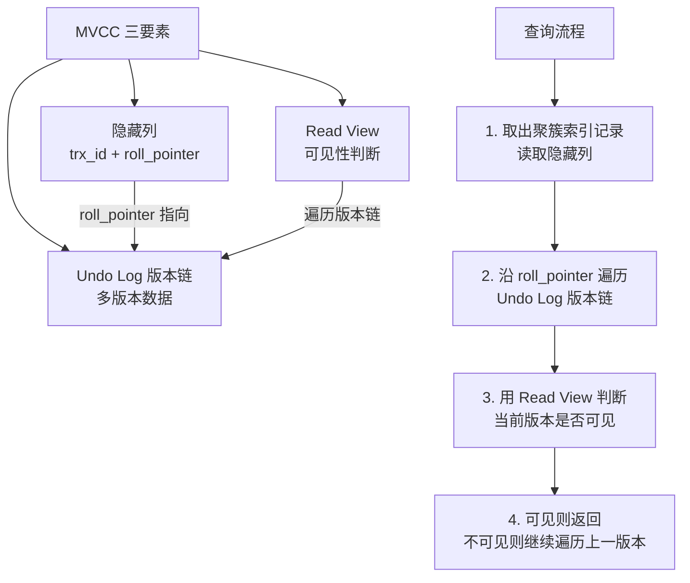
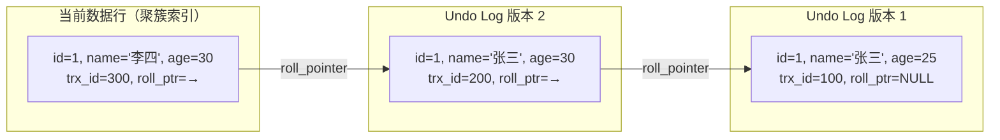
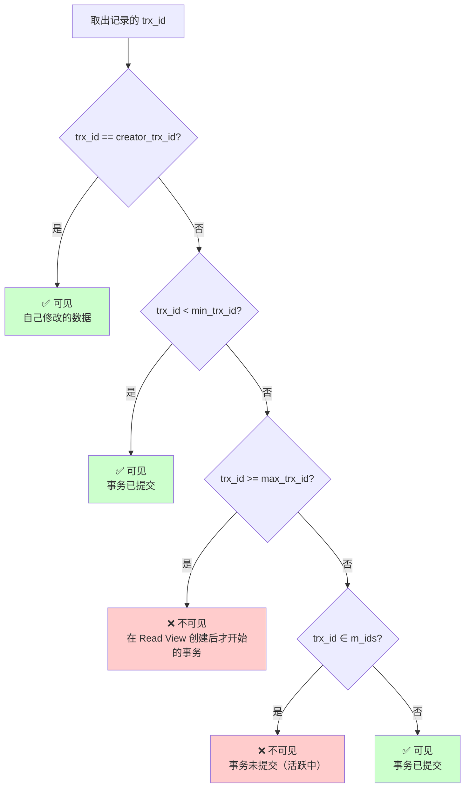
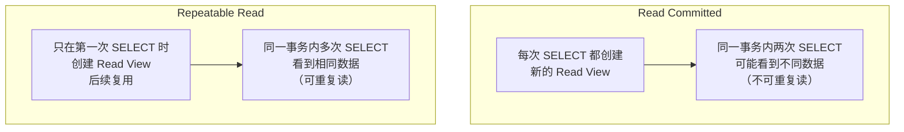
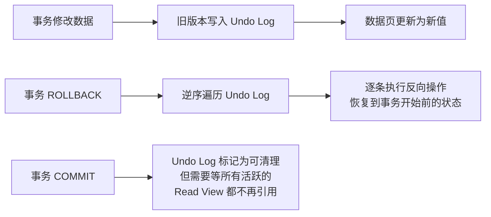
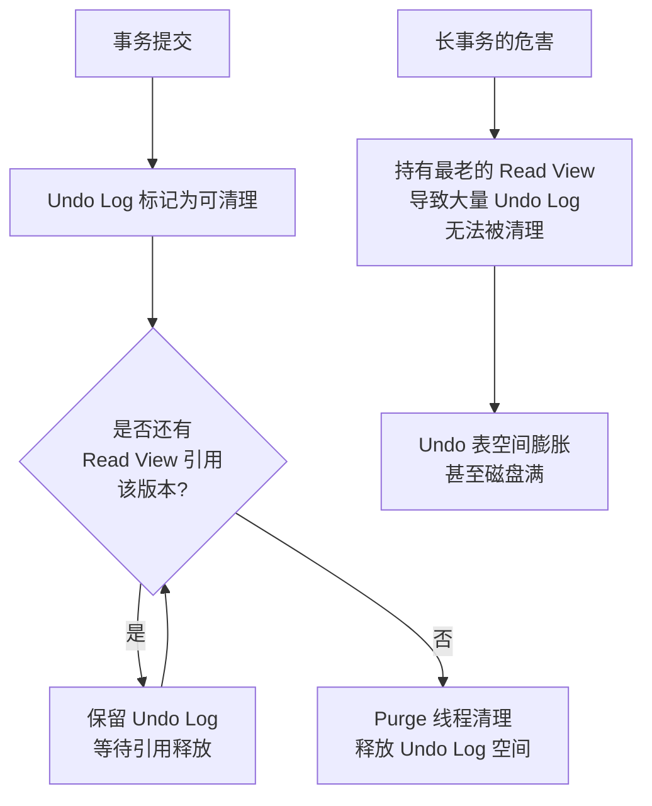

# MVCC 多版本并发控制

MVCC（Multi-Version Concurrency Control）是 InnoDB 实现高并发的核心机制。通过隐藏列、Undo Log 版本链和 Read View，实现了"读不阻塞写、写不阻塞读"。

## 1. MVCC 整体架构



## 2. 隐藏列

InnoDB 为每行记录自动添加两个隐藏列（聚簇索引中）：

| 隐藏列 | 大小 | 含义 |
|--------|------|------|
| `DB_TRX_ID` | 6 字节 | 最后修改该行的事务 ID |
| `DB_ROLL_PTR` | 7 字节 | 回滚指针，指向 Undo Log 中该行的上一版本 |
| `DB_ROW_ID` | 6 字节 | 隐藏主键（无显式主键时使用） |

```sql
-- 创建测试表
CREATE TABLE mvcc_demo (
    id   INT PRIMARY KEY,
    name VARCHAR(64),
    age  INT
) ENGINE = InnoDB;

-- 插入数据（事务 ID = 100）
INSERT INTO mvcc_demo VALUES (1, '张三', 25);

-- 此时行的隐藏列：
-- | id | name | age | DB_TRX_ID | DB_ROLL_PTR |
-- |  1 | 张三 |  25 |        100 | NULL        |  ← 首次插入，无上一版本
```

## 3. Undo Log 版本链

每次修改一行数据时，旧版本被写入 Undo Log，通过 `DB_ROLL_PTR` 串联成版本链。

```sql
-- 事务 100: 插入
INSERT INTO mvcc_demo VALUES (1, '张三', 25);
-- DB_TRX_ID=100, DB_ROLL_PTR=NULL

-- 事务 200: 修改 name
UPDATE mvcc_demo SET name = '李四' WHERE id = 1;
-- DB_TRX_ID=200, DB_ROLL_PTR → Undo Log 中的旧版本

-- 事务 300: 修改 age
UPDATE mvcc_demo SET age = 30 WHERE id = 1;
-- DB_TRX_ID=300, DB_ROLL_PTR → Undo Log 中的旧版本
```



::: tip 版本链的方向
版本链从**最新版本指向最旧版本**，查询时从最新版本开始遍历，找到第一个对当前事务可见的版本即返回。旧版本存储在 Undo Log 中，不占用数据页空间。
:::

## 4. Read View 机制

Read View 是事务进行**快照读**时创建的可见性判断依据。

### 4.1 Read View 的核心字段

| 字段 | 含义 |
|------|------|
| `creator_trx_id` | 创建该 Read View 的事务 ID |
| `m_ids` | 创建 Read View 时，所有**活跃（未提交）**事务的 ID 列表 |
| `min_trx_id` | `m_ids` 中最小的事务 ID |
| `max_trx_id` | 创建 Read View 时系统应分配给下一个事务的 ID（当前最大事务 ID + 1） |

### 4.2 可见性判断规则



### 4.3 完整步骤演示

假设当前状态：

| 事务 ID | 状态 |
|---------|------|
| 100 | 已提交 |
| 200 | 已提交 |
| 300 | 活跃（未提交） |
| 400 | 活跃（未提交） |

此时事务 500 执行 `SELECT`，创建 Read View：

```
creator_trx_id = 500
m_ids = [300, 400]
min_trx_id = 300
max_trx_id = 501（下一个事务 ID）
```

**遍历版本链：**

| 版本 | trx_id | 判断过程 | 结果 |
|------|--------|---------|------|
| 当前行 | 300 | 300 ∈ m_ids → 活跃未提交 | ❌ 不可见 |
| 版本 2 | 200 | 200 < min_trx_id(300) → 已提交 | ✅ 可见，返回 |

事务 500 看到的是 `name='张三', age=30`（版本 2 的数据）。

## 5. RC vs RR：Read View 的创建时机

**这是 RC 和 RR 隔离级别的核心区别**，也是面试最高频的问题。



### 5.1 RC 级别：每次 SELECT 新建 Read View

```sql
-- 隔离级别：READ COMMITTED
SET SESSION TRANSACTION ISOLATION LEVEL READ COMMITTED;

-- 事务 A
BEGIN;
-- 此时无活跃事务，创建 Read View A: m_ids=[]

-- 事务 B
BEGIN;
UPDATE mvcc_demo SET age = 35 WHERE id = 1;
-- trx_id=600, 未提交

-- 事务 A
SELECT age FROM mvcc_demo WHERE id = 1;
-- Read View A: m_ids=[600], min=600, max=601
-- 最新版本 trx_id=600 ∈ m_ids → 不可见
-- 遍历到上一版本 trx_id=200 < min=600 → 可见，返回 age=30

-- 事务 B
COMMIT;

-- 事务 A（同一事务内再次查询）
SELECT age FROM mvcc_demo WHERE id = 1;
-- 创建新的 Read View B: m_ids=[], min=∞, max=601
-- 最新版本 trx_id=600 < min → 可见，返回 age=35
-- ⚠️ 同一事务内两次读结果不同 → 不可重复读！
COMMIT;
```

### 5.2 RR 级别：整个事务复用一个 Read View

```sql
-- 隔离级别：REPEATABLE READ
SET SESSION TRANSACTION ISOLATION LEVEL REPEATABLE READ;

-- 事务 A
BEGIN;
-- 第一次 SELECT 创建 Read View: m_ids=[]

-- 事务 B
BEGIN;
UPDATE mvcc_demo SET age = 40 WHERE id = 1;
-- trx_id=700, 未提交

-- 事务 A
SELECT age FROM mvcc_demo WHERE id = 1;
-- 复用 Read View: m_ids=[700], min=700, max=701
-- 最新版本 trx_id=700 ∈ m_ids → 不可见
-- 遍历上一版本 trx_id=600 < min=700 → 可见，返回 age=35

-- 事务 B
COMMIT;

-- 事务 A（同一事务内再次查询）
SELECT age FROM mvcc_demo WHERE id = 1;
-- 复用同一个 Read View: m_ids=[700], min=700, max=701
-- 最新版本 trx_id=700 ∈ m_ids → 不可见（即使事务 B 已提交！）
-- 遍历上一版本 trx_id=600 < min=700 → 可见，返回 age=35
-- ✅ 两次读结果相同 → 可重复读！
COMMIT;
```

::: important RC vs RR 的唯一区别
**RC 每次查询创建新 Read View，RR 只在第一次查询创建并复用。** 这就是 RC 允许不可重复读而 RR 不允许的根本原因。版本链和可见性判断规则完全相同。
:::

## 6. Undo Log 与快速回滚

Undo Log 不仅服务于 MVCC，还负责事务回滚。



```sql
-- Undo Log 存储位置
-- MySQL 5.6: 共享表空间 ibdata1
-- MySQL 5.7+: 独立 Undo 表空间（需手动开启）
-- MySQL 8.0+: 默认独立 Undo 表空间

SHOW VARIABLES LIKE 'innodb_undo_tablespaces';
-- MySQL 8.0 默认值: 2 (undo_001, undo_002)

-- 查看 Undo Log 空间使用
SELECT
    tablespace_name,
    file_name,
    ROUND(file_size / 1024 / 1024, 2) AS size_mb
FROM information_schema.FILES
WHERE file_name LIKE '%undo%';
```

## 7. Purge 线程清理

Undo Log 不能在事务提交后立即删除——可能还有其他事务的 Read View 在引用旧版本。



```sql
-- 查看 Purge 线程状态
SHOW ENGINE INNODB STATUS\G
-- 搜索 "TRANSACTIONS" 部分
-- Trx id counter: 800
-- Purge done for trx's n:o < 750  ← 已清理到 750 之前的事务
-- Undo n:o < 0:128  ← Undo Log 清理进度

-- 如果 Purge 进度严重滞后
-- 说明存在长事务持有旧 Read View
-- 查找长事务：
SELECT trx_id, trx_state, trx_started
FROM information_schema.INNODB_TRX
ORDER BY trx_started ASC;
```

::: warning 长事务是 Undo Log 膨胀的元凶
一个长事务持有最老的 Read View，会导致从该事务开始到当前的所有 Undo Log 都无法被 Purge 线程清理。这是生产环境最常见的 MySQL 磁盘空间问题之一。
:::

## 8. MVCC 与当前读

MVCC 只对**快照读**（普通 SELECT）生效。**当前读**总是读取最新已提交数据，不走 MVCC。

| 操作 | 类型 | 说明 |
|------|------|------|
| `SELECT * FROM t` | 快照读 | 走 MVCC，读 Read View 可见版本 |
| `SELECT * FROM t FOR UPDATE` | 当前读 | 读最新已提交数据，加 X 锁 |
| `SELECT * FROM t LOCK IN SHARE MODE` | 当前读 | 读最新已提交数据，加 S 锁 |
| `UPDATE / DELETE` | 当前读 | 先读最新数据再修改，加锁 |

```sql
-- 快照读 vs 当前读
BEGIN;

-- 快照读：走 MVCC
SELECT * FROM mvcc_demo WHERE id = 1;  -- 可能读到旧版本

-- 当前读：读最新已提交数据
SELECT * FROM mvcc_demo WHERE id = 1 FOR UPDATE;  -- 总是读到最新版本

-- UPDATE 也是当前读
UPDATE mvcc_demo SET age = 40 WHERE id = 1;
-- 先读最新 age 值，再修改

COMMIT;
```

## 面试技巧

::: important 高频考点
1. **MVCC 三要素**：隐藏列（trx_id + roll_pointer）、Undo Log 版本链、Read View。必考。
2. **Read View 可见性规则**：trx_id < min_trx_id → 可见；trx_id >= max_trx_id → 不可见；trx_id ∈ m_ids → 不可见；否则可见。必须能画出判断流程图。
3. **RC vs RR 的区别**：RC 每次 SELECT 新建 Read View，RR 只在第一次创建后复用。这是面试最高频的问题。
4. **Undo Log 版本链**：roll_pointer 从新到旧串联，遍历时找第一个可见版本返回。
5. **Purge 线程**：提交的 Undo Log 不立即删除，等所有 Read View 不再引用后才清理。长事务导致 Undo Log 膨胀。
6. **快照读 vs 当前读**：普通 SELECT 走 MVCC，FOR UPDATE / LOCK IN SHARE MODE / UPDATE / DELETE 走当前读。
7. **为什么 RR 能避免不可重复读**：因为复用同一个 Read View，即使其他事务提交了修改，当前事务的 Read View 仍然认为其不可见。
:::

::: tip 参考资源
- [小林coding - MVCC](https://xiaolincoding.com/mysql/)：图解 Read View 可见性判断
- [MySQL 8.0 官方文档 - InnoDB MVCC](https://dev.mysql.com/doc/refman/8.0/en/innodb-multi-versioning.html)：MVCC 官方说明
- [DBeaver](https://github.com/dbeaver/dbeaver)：查看 InnoDB 状态和事务信息
:::
