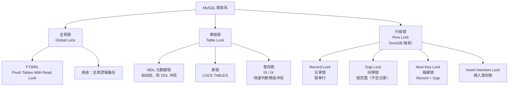
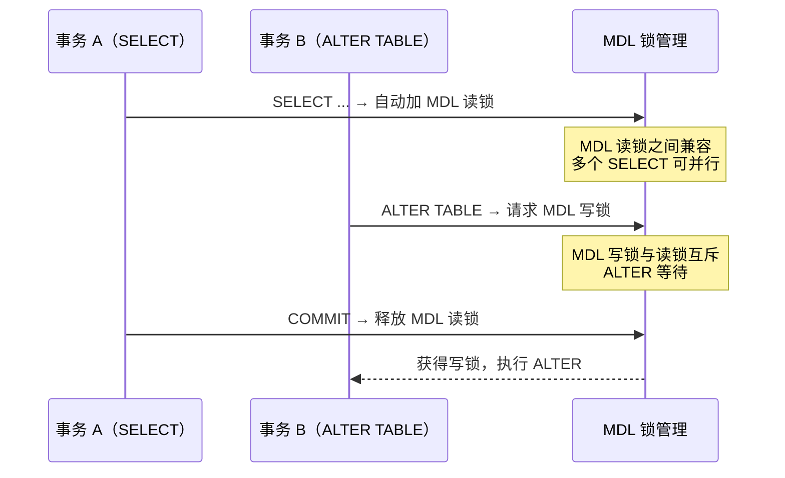
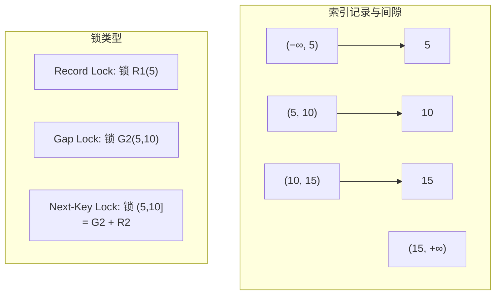
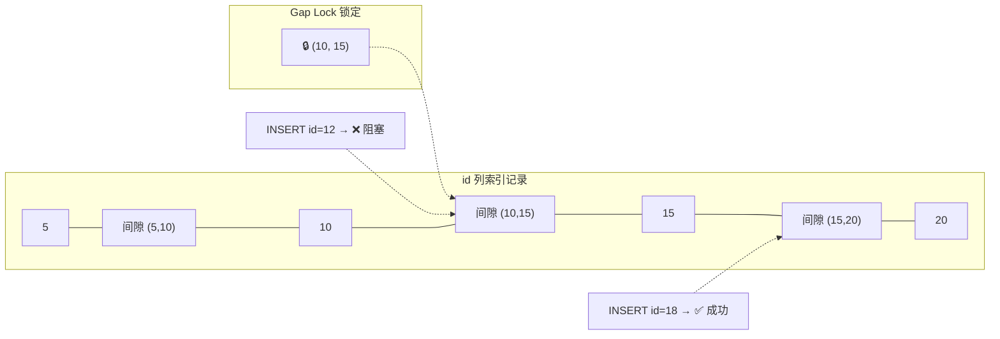
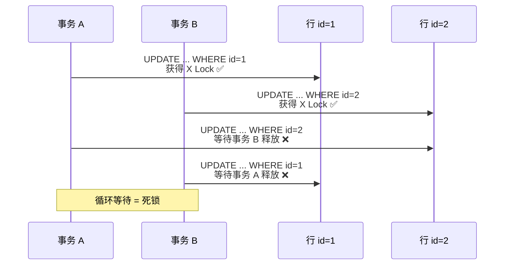

# 锁机制

锁是 InnoDB 实现事务隔离性的底层机制。理解全局锁、表锁、行锁的粒度差异，掌握 Record Lock、Gap Lock、Next-Key Lock 的加锁规则，才能解决生产中的锁等待、死锁问题。

## 1. MySQL 锁层次总览



## 2. 全局锁

全局锁对整个数据库实例加锁，让整个库处于只读状态。

```sql
-- 加全局锁
FLUSH TABLES WITH READ LOCK;  -- FTWRL

-- 此时：
-- 所有 DML（INSERT/UPDATE/DELETE）被阻塞
-- 所有 DDL（ALTER/DROP）被阻塞
-- SELECT 可以正常执行

-- 释放
UNLOCK TABLES;

-- 典型用途：mysqldump 全库逻辑备份
-- mysqldump --single-transaction → 推荐（InnoDB 下用 RR + MVCC 代替 FTWRL）
-- mysqldump --lock-all-tables → 使用 FTWRL
```

::: warning FTWRL vs --single-transaction
- **FTWRL**：整个库只读，影响所有业务，不推荐
- **--single-transaction**：InnoDB 下使用 `START TRANSACTION WITH CONSISTENT SNAPSHOT`，利用 MVCC 做一致性快照，不阻塞读写
- 只有 MyISAM 等不支持事务的引擎才需要 FTWRL
:::

## 3. 表级锁

### 3.1 MDL 元数据锁

MySQL 5.5 引入，**自动加锁**，防止 DML 与 DDL 冲突。



```sql
-- 查看MDL等待
SELECT * FROM performance_schema.metadata_locks\G

-- 典型问题：长查询阻塞 ALTER TABLE
-- 事务 A: 长时间 SELECT 未提交
-- 事务 B: ALTER TABLE → 等待 MDL 写锁
-- 事务 C: 后续所有 SELECT 也被阻塞！（等待 MDL 读锁排队）
-- 现象：整个表无法访问

-- 解决方案：
-- 1. 设置 MDL 锁等待超时
SET SESSION lock_wait_timeout = 5;  -- 5 秒超时
-- 2. 在业务低峰期执行 DDL
-- 3. 使用 pt-online-schema-change 在线 DDL
```

::: important MDL 阻塞的雪崩效应
一个长查询持有 MDL 读锁 → ALTER 等待 MDL 写锁 → 后续所有请求（包括 SELECT）都被阻塞。这是生产中最常见的"整个表不可用"的原因。**DDL 操作务必在低峰期执行**。
:::

### 3.2 意向锁（Intention Lock）

意向锁是**表级锁**，用于快速判断表级锁与行级锁是否冲突。

| 意向锁 | 含义 | 兼容性 |
|--------|------|--------|
| IS（意向共享） | 事务打算加行级 S 锁 | 与表级 S 锁兼容 |
| IX（意向排他） | 事务打算加行级 X 锁 | 与表级 S/X 锁互斥 |

```sql
-- 意向锁自动添加，无需手动操作
-- 事务 A: SELECT * FROM t WHERE id=1 FOR UPDATE;
-- → 自动在表上加 IX 锁，在 id=1 行上加 X Record Lock

-- 事务 B: LOCK TABLES t READ;
-- → 需要表级 S 锁，检查是否有 IX 锁 → 有则等待

-- 意向锁的作用：避免逐行检查行锁
-- 没有意向锁：LOCK TABLES READ 需要检查每行是否有 X 锁 → O(N)
-- 有意向锁：只需检查表级是否有 IX 锁 → O(1)
```

### 3.3 LOCK TABLES

```sql
-- 表级读锁
LOCK TABLES employees READ;
-- 当前会话只能读 employees，不能写
-- 其他会话可以读，不能写

-- 表级写锁
LOCK TABLES employees WRITE;
-- 只有当前会话能读写，其他会话完全阻塞

-- 解锁
UNLOCK TABLES;
```

::: warning InnoDB 下很少用 LOCK TABLES
InnoDB 的行级锁已经提供了细粒度的并发控制，`LOCK TABLES` 主要用于 MyISAM 等不支持行锁的引擎。InnoDB 生产环境应避免使用 `LOCK TABLES`。
:::

## 4. InnoDB 行级锁

### 4.1 行锁类型

| 锁类型 | 锁定对象 | 兼容性 |
|--------|---------|--------|
| Record Lock（记录锁） | 单条索引记录 | S-S 兼容，S-X / X-X 互斥 |
| Gap Lock（间隙锁） | 索引记录之间的间隙 | Gap 锁之间兼容（仅阻止 INSERT） |
| Next-Key Lock（临键锁） | Record + Gap（左开右闭） | InnoDB 默认行锁算法 |



### 4.2 Record Lock（记录锁）

锁定**索引上的一条记录**。

```sql
-- 等值查询命中唯一索引 → 退化为 Record Lock
BEGIN;
SELECT * FROM employees WHERE id = 1 FOR UPDATE;
-- 只锁 id=1 这一行（聚簇索引上的 X Record Lock）
-- 其他行不受影响

-- 非唯一索引等值查询
SELECT * FROM employees WHERE dept_id = 10 FOR UPDATE;
-- idx_dept 上的 Next-Key Lock + 聚簇索引上的 Record Lock
```

### 4.3 Gap Lock（间隙锁）

锁定两条索引记录之间的**间隙**，阻止其他事务在该间隙中**插入**新记录。

```sql
-- employees 表 id 列有值: 5, 10, 15, 20
BEGIN;

-- 在 id=10 和 id=15 之间的间隙加 Gap Lock
SELECT * FROM employees WHERE id > 10 AND id < 15 FOR UPDATE;
-- Gap Lock 锁定 (10, 15) 这个间隙

-- 其他事务尝试插入
-- 事务 B:
INSERT INTO employees (id, name) VALUES (12, 'test');
-- ❌ 阻塞！id=12 在 (10, 15) 间隙内

INSERT INTO employees (id, name) VALUES (18, 'test');
-- ✅ 成功！id=18 不在锁定间隙内
```



::: important Gap Lock 不互斥
Gap Lock 之间是兼容的——多个事务可以同时对同一间隙加 Gap Lock。Gap Lock 的目的是**阻止 INSERT**，而不是阻止读。事务 A 对间隙加 Gap Lock，事务 B 也可以对同一间隙加 Gap Lock，但两者都不能在该间隙 INSERT。
:::

### 4.4 Next-Key Lock（临键锁）

Next-Key Lock = **Record Lock + Gap Lock**，是 InnoDB 默认的行锁算法，锁定范围是**左开右闭**区间。

```sql
-- employees 表 dept_id 索引有值: 10, 20, 30
-- 每个索引值对应的 Next-Key Lock 区间：
-- (−∞, 10], (10, 20], (20, 30], (30, +∞)

BEGIN;
SELECT * FROM employees WHERE dept_id = 20 FOR UPDATE;

-- 加锁情况：
-- 1. idx_dept 上的 Next-Key Lock: (10, 20]  ← 锁定记录 20 及其前间隙
-- 2. idx_dept 上的 Gap Lock: (20, 30)        ← 防止在 20 后插入新值
-- 3. 聚簇索引上的 Record Lock: id = ?        ← 锁定对应行

-- 为什么还要加 (20, 30) 的 Gap Lock？
-- 防止幻读：如果在 (20, 30) 插入 dept_id=25 的新行，
-- 再次查询 WHERE dept_id=20 的范围可能包含该行
```

### 4.5 加锁规则总结（基于何登成的研究）

在 **Repeatable Read** 隔离级别下，InnoDB 的加锁规则：

| 规则 | 说明 |
|------|------|
| 加锁的基本单位是 Next-Key Lock | 默认加 Next-Key Lock |
| 查找过程中**访问到的对象**才会加锁 | 没扫描到的索引记录不加锁 |
| 等值查询，唯一索引，命中记录 → 退化为 Record Lock | 精确匹配唯一值 |
| 等值查询，向右遍历到最后不满足条件时 → Next-Key Lock 退化为 Gap Lock | 右边界不锁定记录本身 |
| 范围查询 → 每个访问到的索引记录加 Next-Key Lock | 不会退化 |

```sql
-- 规则演示
-- 表 t 有字段 id(PK) = 5, 10, 15, 20

-- 1. 唯一索引等值查询，命中 → Record Lock
SELECT * FROM t WHERE id = 10 FOR UPDATE;
-- 锁: id=10 的 Record Lock

-- 2. 唯一索引等值查询，未命中 → Gap Lock
SELECT * FROM t WHERE id = 12 FOR UPDATE;
-- 锁: (10, 15) 的 Gap Lock（id=12 不存在，遍历到 15 退化为 Gap Lock）

-- 3. 非唯一索引等值查询
-- 假设 c 列有值 5, 10, 10, 15, 20
SELECT * FROM t WHERE c = 10 FOR UPDATE;
-- 锁: (5, 10] 的 Next-Key Lock + (10, 15) 的 Gap Lock

-- 4. 范围查询
SELECT * FROM t WHERE id >= 10 FOR UPDATE;
-- 锁: (5, 10], (10, 15], (15, 20], (20, +∞) 四个 Next-Key Lock
```

## 5. Insert Intention Lock（插入意向锁）

插入意向锁是一种**特殊的 Gap Lock**，在 INSERT 操作时设置，表示**意图在间隙中插入**。

```sql
-- 事务 A
BEGIN;
SELECT * FROM t WHERE id > 10 AND id < 15 FOR UPDATE;
-- Gap Lock 锁定 (10, 15)

-- 事务 B
INSERT INTO t VALUES (12, 'test');
-- 等待：需要插入意向锁，与事务 A 的 Gap Lock 冲突

-- 事务 C
INSERT INTO t VALUES (13, 'test2');
-- 也等待：与事务 B 的插入意向锁不冲突（不同行）
-- 但都等待事务 A 的 Gap Lock 释放

-- 事务 A COMMIT → 事务 B 和 C 获得插入意向锁，可以并发插入
```

::: tip 插入意向锁的意义
插入意向锁表明"我打算在这个间隙插入一行"，多个事务在不同位置插入不会互相阻塞（插入不同行）。只有当 Gap Lock 已经锁定了该间隙时，插入意向锁才会被阻塞。
:::

## 6. 死锁

### 6.1 死锁产生条件



### 6.2 InnoDB 死锁检测

InnoDB 自动检测死锁，并回滚代价最小的事务。

```sql
-- 查看死锁日志
SHOW ENGINE INNODB STATUS\G
-- 搜索 "LATEST DETECTED DEADLOCK" 部分
--
-- *** (1) TRANSACTION:
-- TRANSACTION 800021, ACTIVE 2 sec starting index read
-- MySQL thread id 8, OS thread handle 140234567890, query id 123 localhost root updating
-- UPDATE t SET name='A' WHERE id=2
-- *** (1) WAITING FOR THIS LOCK TO BE GRANTED:
-- RECORD LOCKS space id 58 page no 4 n bits 72 index PRIMARY of table `test`.`t`
-- Record lock, heap no 3 PHYSICAL RECORD: ...  (X Lock waiting)
-- *** (2) TRANSACTION:
-- TRANSACTION 800022, ACTIVE 1 sec starting index read
-- MySQL thread id 9, OS thread handle 140234567891, query id 124 localhost root updating
-- UPDATE t SET name='B' WHERE id=1
-- *** (2) HOLDS THE LOCK(S):
-- RECORD LOCKS space id 58 page no 4 n bits 72 index PRIMARY of table `test`.`t`
-- Record lock, heap no 3 PHYSICAL RECORD: ...  (X Lock holds)
-- *** (2) WAITING FOR THIS LOCK TO BE GRANTED:
-- RECORD LOCKS space id 58 page no 4 n bits 72 index PRIMARY of table `test`.`t`
-- Record lock, heap no 2 PHYSICAL RECORD: ...  (X Lock waiting)
-- *** WE ROLL BACK TRANSACTION (2)
```

### 6.3 死锁处理策略

```sql
-- 查看死锁检测配置
SHOW VARIABLES LIKE 'innodb_deadlock_detect';
-- +------------------------+-------+
-- | Variable_name          | Value |
-- +------------------------+-------+
-- | innodb_deadlock_detect | ON    |  -- 默认开启
-- +------------------------+-------+

-- 锁等待超时
SHOW VARIABLES LIKE 'innodb_lock_wait_timeout';
-- +--------------------------+-------+
-- | Variable_name            | Value |
-- +--------------------------+-------+
-- | innodb_lock_wait_timeout | 50   |  -- 默认 50 秒
-- +--------------------------+-------+

-- 设置更短的超时（生产推荐 5-10 秒）
SET GLOBAL innodb_lock_wait_timeout = 5;
```

### 6.4 死锁预防

| 策略 | 说明 |
|------|------|
| 固定加锁顺序 | 所有事务按相同顺序访问表和行 |
| 小事务 | 减少锁持有时间 |
| 合理索引 | 避免行锁升级为表锁（无索引时退化为表锁） |
| 降低隔离级别 | RC 不加 Gap Lock，死锁概率降低 |
| 乐观锁 | 使用版本号替代行锁 |

```sql
-- 1. 固定加锁顺序
-- ✅ 好的做法：所有事务都按 id 升序加锁
BEGIN;
SELECT * FROM accounts WHERE id = 1 FOR UPDATE;
SELECT * FROM accounts WHERE id = 2 FOR UPDATE;
-- 不会死锁

-- ❌ 差的做法：不同事务加锁顺序不同
-- 事务 A: 先锁 id=1 再锁 id=2
-- 事务 B: 先锁 id=2 再锁 id=1 → 可能死锁

-- 2. 合理索引
-- ❌ 无索引 → 锁全表
DELETE FROM employees WHERE name = '张三';
-- 如果 name 无索引，InnoDB 对每行加 Next-Key Lock → 等于锁全表

-- ✅ 有索引 → 只锁匹配行
CREATE INDEX idx_name ON employees (name);
DELETE FROM employees WHERE name = '张三';
-- 只锁 name='张三' 相关的行

-- 3. 乐观锁
UPDATE products SET stock = stock - 1, version = version + 1
WHERE id = 100 AND version = 5;
-- 受影响行数 = 0 → 并发冲突，重试
```

## 7. 锁监控

```sql
-- 1. 查看正在等待的锁（8.0+）
SELECT * FROM performance_schema.data_lock_waits\G
SELECT * FROM performance_schema.data_locks\G

-- 5.7 使用
SELECT * FROM information_schema.INNODB_LOCK_WAITS;
SELECT * FROM information_schema.INNODB_LOCKS;

-- 2. 查看锁等待关系
SELECT
    r.trx_id AS waiting_trx,
    r.trx_mysql_thread_id AS waiting_thread,
    b.trx_id AS blocking_trx,
    b.trx_mysql_thread_id AS blocking_thread,
    r.trx_query AS waiting_query
FROM information_schema.INNODB_LOCK_WAITS w
JOIN information_schema.INNODB_TRX r ON w.requesting_trx_id = r.trx_id
JOIN information_schema.INNODB_TRX b ON w.blocking_trx_id = b.trx_id;

-- 3. 查看行锁统计
SHOW STATUS LIKE 'Innodb_row_lock%';
-- +-------------------------------+--------+
-- | Variable_name                 | Value  |
-- +-------------------------------+--------+
-- | Innodb_row_lock_current_waits | 0      |  -- 当前等待的行锁数
-- | Innodb_row_lock_time          | 125680 |  -- 总等待时间(ms)
-- | Innodb_row_lock_time_avg      | 6284   |  -- 平均等待时间(ms)
-- | Innodb_row_lock_time_max       | 51000  |  -- 最大等待时间(ms)
-- | Innodb_row_lock_waits         | 20     |  -- 总等待次数
-- +-------------------------------+--------+
```

::: tip 锁监控最佳实践
1. 监控 `Innodb_row_lock_time_avg`，超过阈值告警
2. 定期检查 `performance_schema.data_lock_waits`，发现长时间等待
3. 死锁日志保留，定期分析死锁模式
4. DBeaver 可以在 GUI 中查看活动事务和锁等待
:::

## 面试技巧

::: important 高频考点
1. **MySQL 锁层次**：全局锁 → 表锁（MDL、意向锁）→ 行锁（Record/Gap/Next-Key）。面试常问锁的分类。
2. **MDL 锁的坑**：长查询 + ALTER TABLE = 整个表不可用。这是生产事故的高频原因。
3. **Record Lock vs Gap Lock vs Next-Key Lock**：Record 锁行、Gap 锁间隙防插入、Next-Key = Record + Gap。必须能解释清楚。
4. **Gap Lock 不互斥**：多个事务可以同时对同一间隙加 Gap Lock，但都不能插入。面试加分项。
5. **加锁规则**：默认 Next-Key Lock → 唯一索引等值命中退化为 Record Lock → 等值未命中退化为 Gap Lock。面试常考 SQL 加锁分析。
6. **死锁检测与处理**：InnoDB 自动检测、回滚代价最小的事务。`innodb_deadlock_detect` 和 `innodb_lock_wait_timeout`。
7. **无索引导致锁升级**：DELETE/UPDATE 无索引条件 → 锁全表。这是最常见的事故原因。
:::

::: tip 参考资源
- [小林coding - MySQL 锁](https://xiaolincoding.com/mysql/)：图解各种锁与加锁规则
- [MySQL 8.0 官方文档 - InnoDB Locking](https://dev.mysql.com/doc/refman/8.0/en/innodb-locking.html)：锁类型官方说明
- [DBeaver](https://github.com/dbeaver/dbeaver)：通过会话管理查看锁等待
:::
