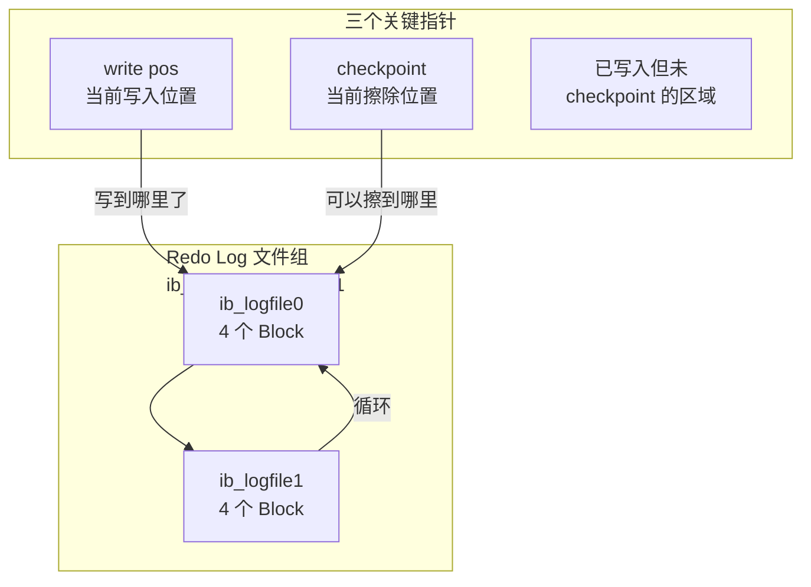
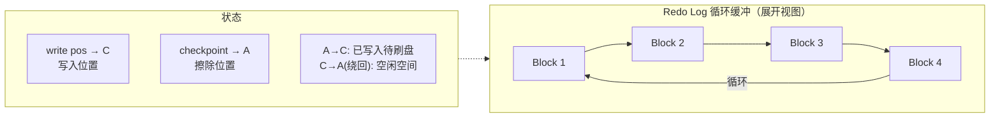
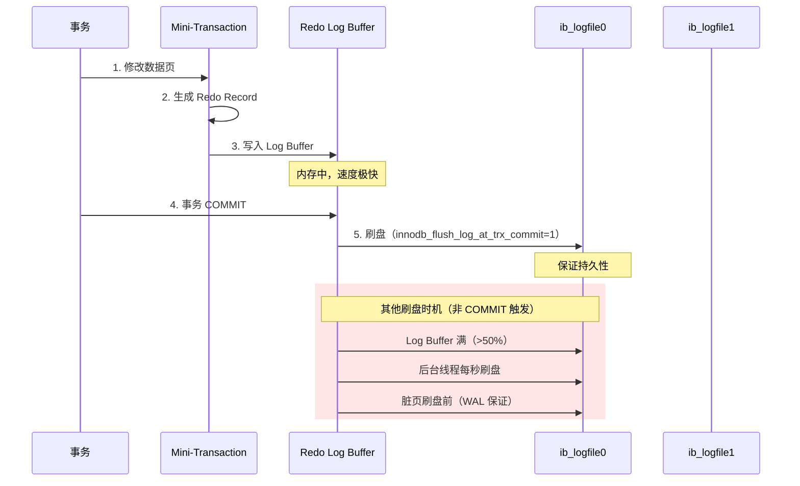
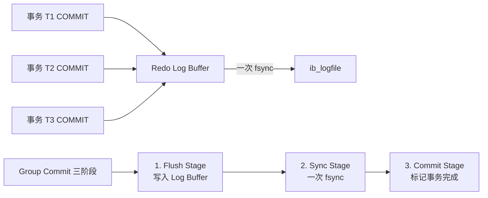
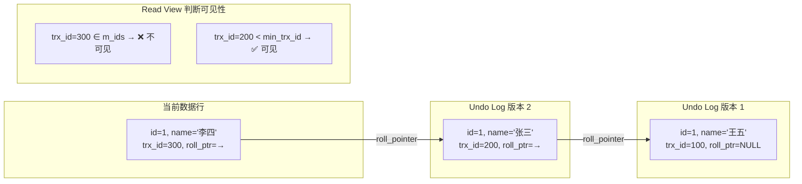
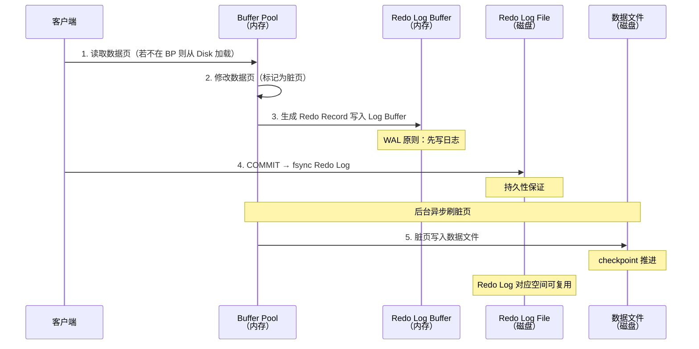
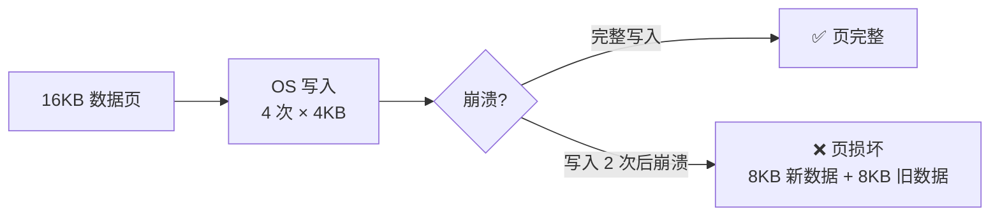
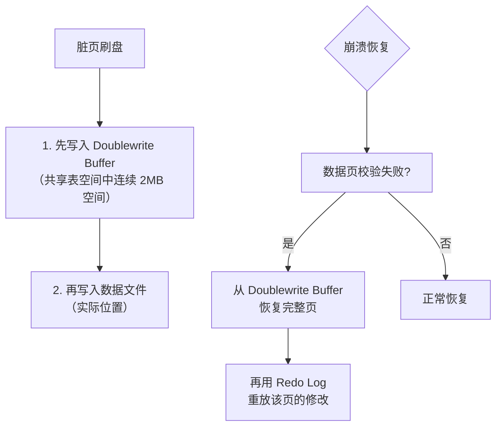
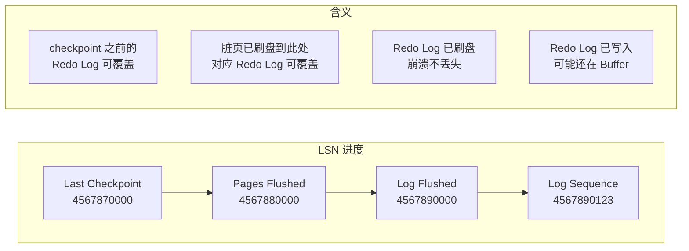
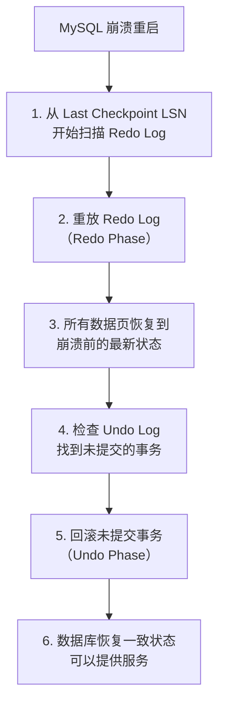

# Redo Log 与 Undo Log

Redo Log 保证持久性，Undo Log 保证原子性——两条日志是 InnoDB 事务的基石。理解 WAL 原则、Redo Log 的循环写入机制、以及 Undo Log 的版本链，才能深入掌握 InnoDB 的崩溃恢复和数据一致性。

## 1. WAL 原则（Write-Ahead Logging）

WAL 是 InnoDB 最核心的设计原则：**先写日志，再写数据**。


::: important 为什么先写日志再写数据？
- **Redo Log 是顺序 IO**：追加写入，无需寻道，速度接近内存
- **数据页刷盘是随机 IO**：需要找到对应页位置，速度慢一个数量级
- 如果先写数据再写日志，崩溃时可能数据已写但日志未写 → 数据不一致
- WAL 保证了：只要日志写了，数据一定能恢复
:::

## 2. Redo Log

### 2.1 Redo Log 的作用

保证事务**持久性**：崩溃后通过 Redo Log 重放已提交事务的修改。

```sql
-- Redo Log 记录的是"物理修改"：
-- "对表空间 X 的页 Y 的偏移 Z 处，写入值 V"
-- 不是 SQL 语句，而是页级别的物理变更

-- 示例：
-- UPDATE employees SET name = '李四' WHERE id = 1;
-- Redo Log 记录：
-- [表空间ID, 页号, 偏移量, 修改前的值, 修改后的值]
```

### 2.2 循环写入结构

Redo Log 采用**固定大小、循环写入**的方式，不需要无限增长。





```sql
-- 查看 Redo Log 配置
SHOW VARIABLES LIKE 'innodb_log_file_size';
-- +---------------------------+------------+
-- | Variable_name             | Value      |
-- +---------------------------+------------+
-- | innodb_log_file_size      | 50331648  |  -- 48MB（默认）
-- +---------------------------+------------+

SHOW VARIABLES LIKE 'innodb_log_files_in_group';
-- +---------------------------+-------+
-- | Variable_name             | Value |
-- +---------------------------+-------+
-- | innodb_log_files_in_group | 2     |  -- 2 个文件
-- +---------------------------+-------+

-- 总 Redo Log 空间 = innodb_log_file_size × innodb_log_files_in_group
-- = 48MB × 2 = 96MB

-- 查看 Redo Log 产能
SHOW ENGINE INNODB STATUS\G
-- 搜索 "LOG" 部分
-- Log sequence number (LSN): 当前已写入的 LSN
-- Log flushed up to: 已刷盘的 LSN
-- Pages flushed up to: 脏页刷盘对应的 LSN
-- Last checkpoint at: checkpoint 位置
```

::: warning Redo Log 空间不足的后果
当 write pos 追上 checkpoint 时，Redo Log 空间用尽，InnoDB 必须**暂停写入**，强制刷脏页推进 checkpoint。这会导致性能急剧下降。生产环境建议 Redo Log 总空间至少能容纳 1 小时的写入量。
:::

### 2.3 Redo Log 写入流程



```sql
-- innodb_flush_log_at_trx_commit 配置
SHOW VARIABLES LIKE 'innodb_flush_log_at_trx_commit';
-- +--------------------------------+-------+
-- | Variable_name                  | Value |
-- +--------------------------------+-------+
-- | innodb_flush_log_at_trx_commit | 1     |
-- +--------------------------------+-------+

-- 值说明：
-- 0: 每秒刷盘（崩溃可能丢 1 秒数据）
-- 1: 每次 COMMIT 刷盘（最安全，默认）
-- 2: 每次 COMMIT 写 OS 缓存 + 每秒 fsync（OS 崩溃可能丢数据）
```

::: important 生产必须设为 1
`innodb_flush_log_at_trx_commit = 1` 是 ACID 持久性的保证。设为 0 或 2 在 MySQL 进程崩溃时可能丢失已提交的数据。只有在明确接受数据丢失风险（如日志表）时才能降低。
:::

### 2.4 Group Commit

多个事务同时提交时，只需一次 fsync 即可将多个事务的 Redo Log 刹盘。



```sql
-- Group Commit 效果
-- 10 个事务并发提交，只需 1 次 fsync
-- 而非 10 次 fsync → TPS 提升 10 倍

-- binlog_group_commit 相关参数
SHOW VARIABLES LIKE 'binlog_group_commit_sync_delay';
-- 延迟多少微秒再 fsync，让更多事务凑一批
-- 默认 0（不延迟），可设为 1000-10000 微秒
```

## 3. Undo Log

### 3.1 Undo Log 的两个作用

| 作用 | 说明 |
|------|------|
| 事务回滚 | 逆序执行 Undo Log 中的反向操作，恢复到事务开始前 |
| MVCC 版本链 | 为快照读提供历史版本数据 |

```sql
-- Undo Log 记录的是"逻辑反向操作"：
-- INSERT → Undo Log 记录 DELETE
-- DELETE → Undo Log 记录 INSERT
-- UPDATE name='李四' → Undo Log 记录 UPDATE name='张三'

-- 插入操作
INSERT INTO employees (id, name) VALUES (1, '张三');
-- Undo Log: <DELETE, id=1>

-- 更新操作
UPDATE employees SET name = '李四' WHERE id = 1;
-- Undo Log: <UPDATE, id=1, name='张三'>

-- 删除操作
DELETE FROM employees WHERE id = 1;
-- Undo Log: <INSERT, id=1, name='李四'>
```

### 3.2 Undo Log 与 MVCC



### 3.3 Undo Log 存储

```sql
-- MySQL 8.0 Undo 表空间
SHOW VARIABLES LIKE 'innodb_undo_tablespaces';
-- +---------------------------+-------+
-- | Variable_name             | Value |
-- +---------------------------+-------+
-- | innodb_undo_tablespaces   | 2     |
-- +---------------------------+-------+

-- Undo 表空间文件
-- undo_001, undo_002

-- 自动截断（8.0+）
SHOW VARIABLES LIKE 'innodb_undo_log_truncate';
-- +--------------------------+-------+
-- | Variable_name            | Value |
-- +--------------------------+-------+
-- | innodb_undo_log_truncate | ON    |
-- +--------------------------+-------+

-- 当 Undo 表空间超过阈值时自动截断
SHOW VARIABLES LIKE 'innodb_max_undo_log_size';
-- +--------------------------+------------+
-- | Variable_name            | Value      |
-- +--------------------------+------------+
-- | innodb_max_undo_log_size | 1073741824 |  -- 1GB
-- +--------------------------+------------+
```

## 4. Buffer Pool、Redo Log 与磁盘的交互



::: tip 核心交互原则
1. **WAL**：修改数据页前，先写 Redo Log
2. **刷脏页前**：必须确保对应的 Redo Log 已刷盘（否则崩溃无法恢复）
3. **COMMIT 时**：只保证 Redo Log 刷盘，不保证数据页刷盘
4. **崩溃恢复**：从 checkpoint 的 LSN 开始，重放 Redo Log 中已提交事务的修改
:::

## 5. Doublewrite Buffer（双写缓冲）

### 5.1 部分写问题

InnoDB 页大小 16KB，而操作系统 IO 通常是 4KB。如果在写页的过程中崩溃，可能只写了一部分（partial page write/torn page），导致数据页损坏。



### 5.2 Doublewrite 机制



```sql
-- 查看 Doublewrite 状态
SHOW VARIABLES LIKE 'innodb_doublewrite';
-- +-------------------+-------+
-- | Variable_name     | Value |
-- +-------------------+-------+
-- | innodb_doublewrite| ON    |
-- +-------------------+-------+

-- SHOW ENGINE INNODB STATUS 中的 Doublewrite 信息
-- BUFFER POOL AND MEMORY
-- ...
-- Doublewrite buffer: 2MB, 128 pages
```

::: important Doublewrite 的代价
Doublewrite 每个脏页写两次（一次到双写缓冲，一次到实际位置），增加约 5-10% 的 IO 开销。但这是保证数据完整性的必要代价。MySQL 8.0.20+ 支持对特定表空间禁用双写。
:::

## 6. LSN（Log Sequence Number）

LSN 是 Redo Log 的**全局单调递增**序号，贯穿 InnoDB 的整个恢复体系。

```sql
-- 查看 LSN
SHOW ENGINE INNODB STATUS\G
-- Log sequence number: 4567890123    ← 当前已写入的 LSN
-- Log flushed up to:     4567890000  ← 已刷盘的 LSN
-- Pages flushed up to:   4567880000  ← 脏页刷盘对应的 LSN
-- Last checkpoint at:    4567870000  ← checkpoint 位置的 LSN
```



**LSN 与崩溃恢复的关系：**

1. 崩溃后从 `Last checkpoint LSN` 开始扫描 Redo Log
2. 重放所有 LSN > checkpoint 的 Redo Record → 恢复已提交事务
3. 对未提交事务，通过 Undo Log 回滚 → 保证原子性

## 7. 崩溃恢复流程



```sql
-- 崩溃恢复相关配置
SHOW VARIABLES LIKE 'innodb_flush_log_at_trx_commit';
-- = 1: 保证已提交事务不丢失

SHOW VARIABLES LIKE 'innodb_doublewrite';
-- = ON: 防止部分写问题

SHOW VARIABLES LIKE 'innodb_fast_shutdown';
-- +----------------------+-------+
-- | Variable_name        | Value |
-- +----------------------+-------+
-- | innodb_fast_shutdown | 1     |
-- +----------------------+-------+
-- 0: 慢关闭（刷所有脏页再关）
-- 1: 快速关闭（刷部分，崩溃恢复快）
-- 2: 最快（几乎不刷，崩溃恢复慢）
```

## 8. Redo Log vs Undo Log 对比

| 特性 | Redo Log | Undo Log |
|------|----------|----------|
| 作用 | 保证持久性 | 保证原子性 + MVCC |
| 记录内容 | 物理修改（页级变更） | 逻辑反向操作 |
| 写入方式 | 顺序追加（循环） | 随机写入（回滚段） |
| 空间管理 | 固定大小，循环覆写 | 需 Purge 线程清理 |
| 崩溃恢复 | 重放已提交事务 | 回滚未提交事务 |
| 与 WAL 关系 | 先写 Redo Log 再写数据页 | 修改前先写 Undo Log |
| 存储文件 | ib_logfile0/1 | undo_001/002 |
| 组提交 | 支持 Group Commit | 不支持 |

## 面试技巧

::: important 高频考点
1. **WAL 原则**：先写日志再写数据，Redo Log 顺序 IO 比数据页随机 IO 快一个数量级。面试最基础的题。
2. **Redo Log 循环写入**：write pos 追上 checkpoint 时性能急剧下降。要理解三个指针的含义。
3. **innodb_flush_log_at_trx_commit**：0/1/2 三个值的含义，生产必须为 1。
4. **Doublewrite**：解决部分写问题，16KB 页可能只写了一半。先写双写缓冲再写数据文件。
5. **LSN**：全局递增序号，贯穿 Redo Log、脏页刷盘、checkpoint。理解四个 LSN 的进度关系。
6. **Undo Log 双重作用**：事务回滚 + MVCC 版本链。面试必问。
7. **崩溃恢复流程**：Redo Phase（重放）→ Undo Phase（回滚）。必须能完整描述。
8. **Redo Log vs Undo Log**：物理 vs 逻辑、顺序 vs 随机、持久性 vs 原子性。对比题。
:::

::: tip 参考资源
- [小林coding - Redo Log 与 Undo Log](https://xiaolincoding.com/mysql/)：图解 WAL 与循环写入
- [MySQL 8.0 官方文档 - InnoDB Redo Log](https://dev.mysql.com/doc/refman/8.0/en/innodb-redo-log.html)：Redo Log 官方说明
- [DBeaver](https://github.com/dbeaver/dbeaver)：通过 InnoDB Status 查看日志状态
:::
