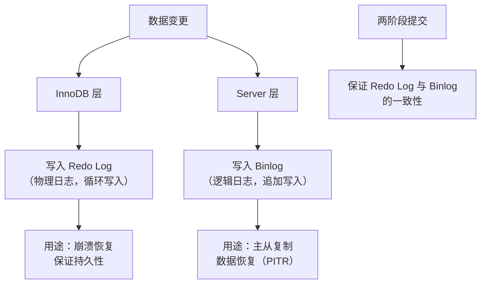
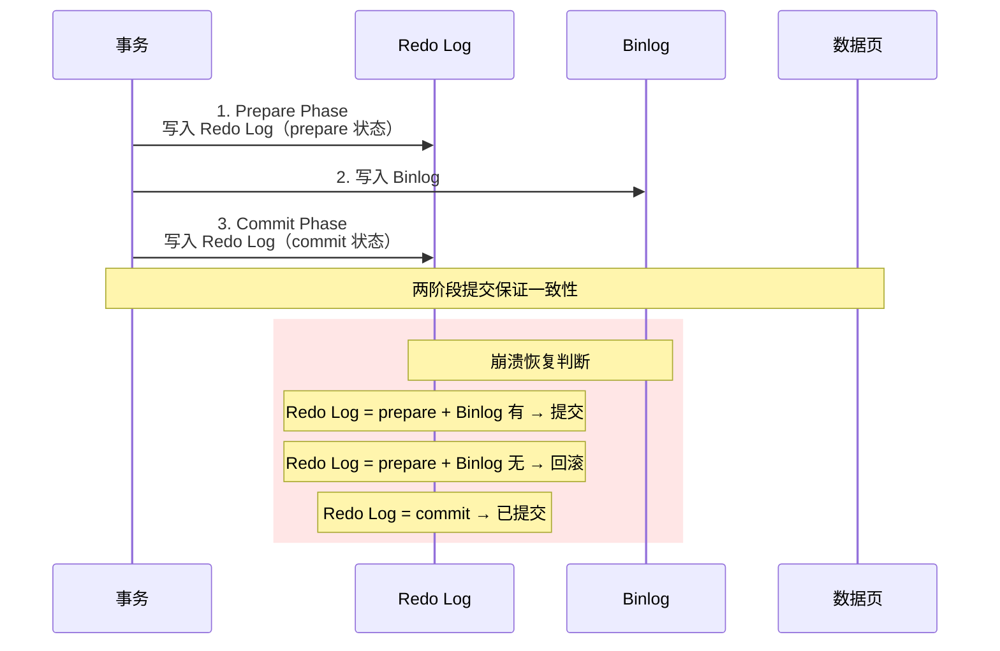
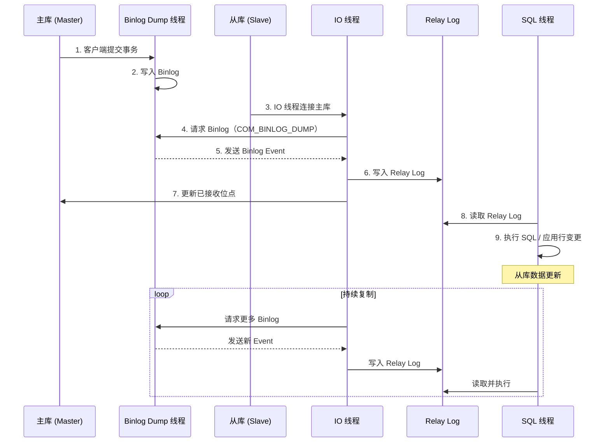
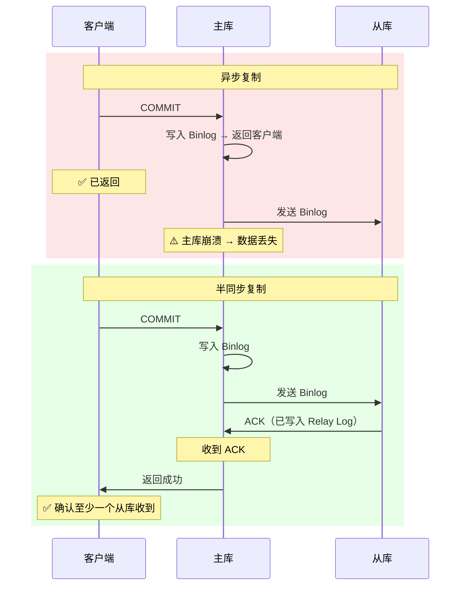
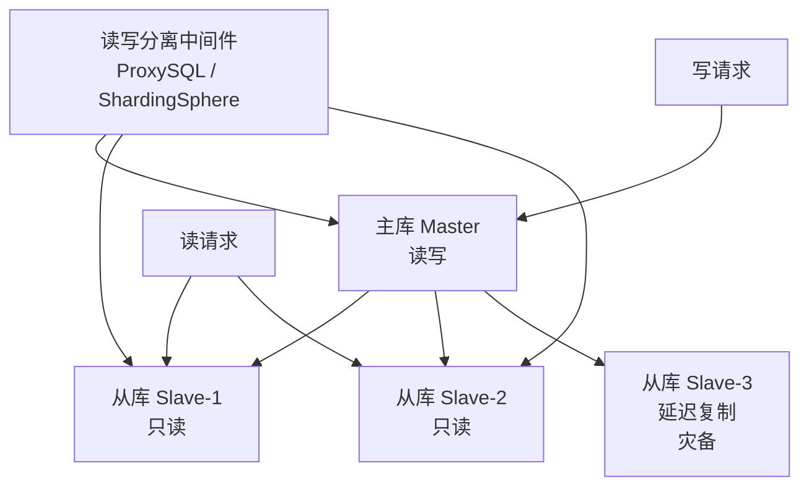

# Binlog 与主从复制

Binlog 是 MySQL Server 层的逻辑日志，记录所有数据变更操作。它不仅是主从复制的数据源，还是数据恢复的最后一道防线。理解 Binlog 的三种格式、GTID 机制、以及主从复制的完整链路，是构建高可用 MySQL 架构的基础。

## 1. Binlog vs Redo Log

| 特性 | Binlog | Redo Log |
|------|--------|----------|
| 归属层次 | Server 层 | InnoDB 存储引擎层 |
| 记录内容 | 逻辑变更（SQL 或行变更） | 物理变更（页级修改） |
| 写入方式 | 追加写入，文件写满换新文件 | 循环写入，固定空间 |
| 用途 | 主从复制、数据恢复 | 崩溃恢复（保证持久性） |
| 空间管理 | 可保留多个文件 | 固定大小，循环覆写 |
| 引擎支持 | 所有引擎 | 仅 InnoDB |
| 事务一致性 | 可能跨文件 | Group Commit 保证 |



## 2. 两阶段提交

Binlog 和 Redo Log 是两个独立的日志系统，必须保证一致性——否则主从数据不一致。



```sql
-- 查看两阶段提交相关参数
SHOW VARIABLES LIKE 'innodb_support_xa';
-- MySQL 8.0 中始终开启，无法关闭

-- sync_binlog 参数
SHOW VARIABLES LIKE 'sync_binlog';
-- +---------------+-------+
-- | Variable_name | Value |
-- +---------------+-------+
-- | sync_binlog   | 1     |  -- 每次 COMMIT 都 fsync
-- +---------------+-------+
-- 0: 由 OS 刷盘（最快，可能丢 binlog）
-- 1: 每次 COMMIT fsync（最安全，默认）
-- N: 每 N 次 COMMIT fsync
```

::: important 生产必须 sync_binlog=1
与 `innodb_flush_log_at_trx_commit=1` 一样，`sync_binlog=1` 保证主从数据不丢失。如果降低这两个参数，主库崩溃后可能丢失已提交的数据，导致从库无法同步。
:::

## 3. Binlog 三种格式

### 3.1 格式对比

| 格式 | 记录内容 | 空间 | 一致性 | 性能 | 主从安全 |
|------|---------|------|--------|------|---------|
| STATEMENT | SQL 文本 | 小 | ❌ 不安全 | 高 | ⚠️ 可能不一致 |
| ROW | 行变更（before+after） | 大 | ✅ 安全 | 中 | ✅ 安全 |
| MIXED | 默认 STATEMENT，不安全时切 ROW | 中 | ✅ 基本安全 | 中高 | ✅ 基本安全 |

```sql
-- 查看当前格式
SHOW VARIABLES LIKE 'binlog_format';
-- +---------------+-------+
-- | Variable_name | Value |
-- +---------------+-------+
-- | binlog_format | ROW   |  -- 8.0 默认
-- +---------------+-------+

-- 设置格式
SET GLOBAL binlog_format = ROW;
```

### 3.2 STATEMENT 格式

```sql
-- 记录执行的 SQL 语句
UPDATE employees SET salary = salary * 1.1 WHERE dept_id = 10;

-- Binlog 内容：
-- # at 256
-- #250115 10:30:00 server id 1  end_log_pos 350  Query
-- use `test`;
-- UPDATE employees SET salary = salary * 1.1 WHERE dept_id = 10;
```

::: warning STATEMENT 格式的不安全场景
```sql
-- 1. NOW() / RAND() / UUID() 等不确定函数
INSERT INTO logs (msg, created_at) VALUES ('test', NOW());
-- 主库: created_at = '2025-01-15 10:30:00'
-- 从库: created_at = '2025-01-15 10:30:05'  ← 执行时间不同！

-- 2. LIMIT 无 ORDER BY
DELETE FROM logs LIMIT 10;
-- 主库和从库可能删除不同的 10 行

-- 3. 存储过程 / 触发器
-- 内部逻辑可能依赖主库特定状态
```
:::

### 3.3 ROW 格式

```sql
-- 记录每行的变更前后值
UPDATE employees SET salary = 16500 WHERE id = 1;
-- salary 从 15000 改为 16500

-- Binlog 内容：
-- ### UPDATE `test`.`employees`
-- ### WHERE
-- ###   @1=1 (INT)
--   @4=15000.00 (DECIMAL)
-- ### SET
--   @4=16500.00 (DECIMAL)

-- INSERT 记录所有列的值
-- DELETE 记录被删除行的所有列值
```

::: tip ROW 格式的优势
1. 主从数据绝对一致（记录的是行级变更，不是 SQL）
2. 不受不确定函数影响
3. 可以通过 `mysqlbinlog --base64-output=DECODE-ROWS -v` 解码查看
4. 生产环境推荐 ROW 格式
:::

### 3.4 MIXED 格式

默认使用 STATEMENT 格式，遇到以下场景自动切换为 ROW：

- 使用不确定函数（NOW()、RAND()、UUID()）
- 使用 USER()、CURRENT_USER()
- 使用 LOAD_FILE()
- 使用 INSERT DELAYED
- 使用存储过程/触发器

## 4. Binlog Event 结构


```sql
-- 使用 mysqlbinlog 查看内容
-- STATEMENT 格式
mysqlbinlog --start-datetime="2025-01-15 10:00:00" \
            --stop-datetime="2025-01-15 11:00:00" \
            /var/lib/mysql/mysql-bin.000123

-- ROW 格式（解码查看）
mysqlbinlog --base64-output=DECODE-ROWS -v \
            /var/lib/mysql/mysql-bin.000123

-- 查看当前 Binlog 文件
SHOW BINARY LOGS;
-- +------------------+-----------+
-- | Log_name         | File_size |
-- +------------------+-----------+
-- | mysql-bin.000123 | 1073741824|
-- | mysql-bin.000124 | 536870912 |
-- +------------------+-----------+

-- 查看当前正在写入的 Binlog
SHOW MASTER STATUS;
-- +------------------+----------+--------------+------------------+
-- | File             | Position | Binlog_Do_DB | Binlog_Ignore_DB |
-- +------------------+----------+--------------+------------------+
-- | mysql-bin.000124 | 1024     |              |                  |
-- +------------------+----------+--------------+------------------+

-- 查看 Binlog 中的事件
SHOW BINLOG EVENTS IN 'mysql-bin.000124';
-- +------------------+-----+----------------+-----------+-------------+
-- | Log_name         | Pos | Event_type     | Server_id | Info        |
-- +------------------+-----+----------------+-----------+-------------+
-- | mysql-bin.000124 | 4   | Format_desc    | 1         | ...         |
-- | mysql-bin.000124 | 123 | Query          | 1         | BEGIN       |
-- | mysql-bin.000124 | 256 | Table_map      | 1         | test.employees|
-- | mysql-bin.000124 | 512 | Write_rows     | 1         | ...         |
-- | mysql-bin.000124 | 640 | Xid            | 1         | COMMIT      |
-- +------------------+-----+----------------+-----------+-------------+
```

## 5. GTID（Global Transaction ID）

### 5.1 GTID 概念

MySQL 5.6 引入，为每个事务分配**全局唯一 ID**，极大简化主从复制管理。

```
GTID 格式: server_uuid:transaction_id
示例: 3E11FA47-CAAC-11E1-9CF7-E3E3E3E3E3E3:1-5

server_uuid: 服务器实例唯一标识
transaction_id: 该实例上事务的递增序号
```

```sql
-- 查看服务器 UUID
SHOW VARIABLES LIKE 'server_uuid';
-- +---------------+--------------------------------------+
-- | Variable_name | Value                                |
-- +---------------+--------------------------------------+
-- | server_uuid   | 3E11FA47-CAAC-11E1-9CF7-E3E3E3E3E3E3 |
-- +---------------+--------------------------------------+

-- 开启 GTID
SHOW VARIABLES LIKE 'gtid_mode';
-- +---------------+-------+
-- | Variable_name | Value |
-- +---------------+-------+
-- | gtid_mode     | ON    |  -- 8.0 默认 ON
-- +---------------+-------+

-- 查看已执行的 GTID
SHOW MASTER STATUS;
-- Executed_Gtid_Set: 3E11FA47-CAAC-11E1-9CF7-E3E3E3E3E3E3:1-105

-- 从库查看已执行的 GTID
SHOW SLAVE STATUS\G
-- Retrieved_Gtid_Set: 3E11FA47-CAAC-11E1-9CF7-E3E3E3E3E3E3:1-105
-- Executed_Gtid_Set: 3E11FA47-CAAC-11E1-9CF7-E3E3E3E3E3E3:1-100
-- 差值 = 待回放的事务
```

::: tip GTID 的核心价值
1. **自动定位复制位点**：无需手动指定 binlog file + position
2. **主从切换简化**：新主库的 GTID 集合自动包含所有已提交事务
3. **避免事务重复执行**：从库已执行的 GTID 不会再执行
4. **崩溃恢复简化**：从库重启后自动从断点继续
:::

## 6. 主从复制架构

### 6.1 复制原理



### 6.2 三个线程的职责

| 线程 | 所在服务器 | 职责 |
|------|-----------|------|
| Binlog Dump | 主库 | 读取 Binlog 发送给从库 |
| IO Thread | 从库 | 接收 Binlog 写入 Relay Log |
| SQL Thread | 从库 | 读取 Relay Log 并执行 |

```sql
-- 主库查看复制状态
SHOW PROCESSLIST;
-- +----+------+------------------+------+-------------+-------+
-- | Id | User | Host             | db   | Command     | Time  |
-- +----+------+------------------+------+-------------+-------+
-- |  5 | repl | slave-host:33060 | NULL | Binlog Dump | 3600  |
-- +----+------+------------------+------+-------------+-------+

-- 从库查看复制状态
SHOW SLAVE STATUS\G
-- *************************** 1. row ***************************
--              Slave_IO_State: Waiting for master to send event
--                  Master_Host: 192.168.1.100
--                  Master_User: repl
--                  Master_Port: 3306
--                Connect_Retry: 60
--              Master_Log_File: mysql-bin.000124
--          Read_Master_Log_Pos: 1024
--               Relay_Log_File: relay-bin.000002
--                Relay_Log_Pos: 512
--        Relay_Master_Log_File: mysql-bin.000124
--             Slave_IO_Running: Yes      ← IO 线程状态
--            Slave_SQL_Running: Yes      ← SQL 线程状态
--              Replicate_Do_DB:
--          Seconds_Behind_Master: 0       ← 复制延迟（秒）
```

### 6.3 搭建主从复制

```sql
-- ============ 主库配置 ============
-- my.cnf
-- [mysqld]
-- server-id = 1
-- log-bin = mysql-bin
-- binlog-format = ROW
-- gtid-mode = ON
-- enforce-gtid-consistency = ON

-- 创建复制用户
CREATE USER 'repl'@'%' IDENTIFIED BY 'Repl@123456';
GRANT REPLICATION SLAVE ON *.* TO 'repl'@'%';

-- 锁定主库获取位点（或使用 GTID 自动定位）
FLUSH TABLES WITH READ LOCK;
SHOW MASTER STATUS;
-- 记录 File 和 Position
UNLOCK TABLES;

-- ============ 从库配置 ============
-- my.cnf
-- [mysqld]
-- server-id = 2
-- relay-log = relay-bin
-- read-only = ON
-- gtid-mode = ON
-- enforce-gtid-consistency = ON

-- 方式一：基于位点
CHANGE MASTER TO
    MASTER_HOST = '192.168.1.100',
    MASTER_PORT = 3306,
    MASTER_USER = 'repl',
    MASTER_PASSWORD = 'Repl@123456',
    MASTER_LOG_FILE = 'mysql-bin.000124',
    MASTER_LOG_POS = 1024;

-- 方式二：基于 GTID（推荐）
CHANGE MASTER TO
    MASTER_HOST = '192.168.1.100',
    MASTER_PORT = 3306,
    MASTER_USER = 'repl',
    MASTER_PASSWORD = 'Repl@123456',
    MASTER_AUTO_POSITION = 1;  -- 自动位点

-- 启动复制
START SLAVE;

-- 验证
SHOW SLAVE STATUS\G
-- Slave_IO_Running: Yes
-- Slave_SQL_Running: Yes
-- Seconds_Behind_Master: 0
```

## 7. 半同步复制

异步复制中，主库写入 Binlog 后立即返回客户端，不等待从库确认。如果主库崩溃，可能丢失尚未同步的数据。



```sql
-- 安装半同步插件（主库）
INSTALL PLUGIN rpl_semi_sync_master SONAME 'semisync_master.so';
SET GLOBAL rpl_semi_sync_master_enabled = ON;
SET GLOBAL rpl_semi_sync_master_timeout = 10000;  -- 10 秒超时

-- 安装半同步插件（从库）
INSTALL PLUGIN rpl_semi_sync_slave SONAME 'semisync_slave.so';
SET GLOBAL rpl_semi_sync_slave_enabled = ON;

-- 查看半同步状态
SHOW VARIABLES LIKE 'rpl_semi_sync_master_enabled';
SHOW STATUS LIKE 'Rpl_semi_sync_master_status';
SHOW STATUS LIKE 'Rpl_semi_sync_master_clients';  -- 半同步从库数量
```

::: important 半同步复制的退化
当半同步从库超时未响应时，主库会自动**退化为异步复制**，不再等待 ACK。这意味着半同步复制**不能完全保证数据不丢失**，只是降低了丢失概率。MySQL 5.7 引入 **After Sync** 模式（`rpl_semi_sync_master_wait_point=AFTER_SYNC`），先等 ACK 再提交事务，安全性更高。
:::

## 8. 延迟复制

延迟复制让从库落后主库指定时间，用于**误操作恢复**。

```sql
-- 设置从库延迟 1 小时
STOP SLAVE;
CHANGE MASTER TO MASTER_DELAY = 3600;  -- 3600 秒 = 1 小时
START SLAVE;

-- 查看延迟
SHOW SLAVE STATUS\G
-- SQL_Delay: 3600
-- SQL_Remaining_Delay: 3540

-- 误操作恢复场景
-- 10:00 DBA 误删表
-- 10:05 发现问题
-- 从库延迟 1 小时，当前数据为 9:05 的快照 → 未执行误删操作
-- 从从库导出数据恢复到主库
```

::: tip 延迟复制的最佳实践
- 延迟时间设置：通常 1-4 小时
- 延迟从库不对外提供读服务，专用于灾备
- 需要恢复时，停止 SQL 线程 → 导出数据 → 恢复到主库
:::

## 9. Binlog 与数据恢复（PITR）

Point-In-Time Recovery：将数据库恢复到任意时间点。

```sql
-- 场景：14:00 误删了 orders 表，需要恢复到 13:59:59 的状态

-- 步骤 1：恢复全量备份
mysql -u root -p < full_backup_20250115_1200.sql

-- 步骤 2：用 mysqlbinlog 重放 Binlog（从备份点到误操作前）
mysqlbinlog --start-datetime="2025-01-15 12:00:00" \
            --stop-datetime="2025-01-15 13:59:59" \
            /var/lib/mysql/mysql-bin.000123 \
            /var/lib/mysql/mysql-bin.000124 \
| mysql -u root -p

-- 使用 GTID 恢复
mysqlbinlog --include-gtids="3E11FA47:1-200" \
            /var/lib/mysql/mysql-bin.000123 \
| mysql -u root -p

-- 排除误操作的 GTID
mysqlbinlog --exclude-gtids="3E11FA47:201" \
            /var/lib/mysql/mysql-bin.000123 \
| mysql -u root -p
```


::: warning PITR 的前提
1. **定期全量备份** + **保留足够多的 Binlog**
2. `sync_binlog=1` 保证 Binlog 不丢失
3. 备份后记录 Binlog 位点或 GTID，以便精确重放
4. 建议使用 `mysqldump --single-transaction --master-data=2` 或 `mysqlbackup`
:::

## 10. 复制拓扑与读写分离



```sql
-- 从库设置只读
SET GLOBAL read_only = ON;
SET GLOBAL super_read_only = ON;  -- 阻止 SUPER 权限写

-- 从库压力分担
-- 使用 ProxySQL 路由：
-- 写请求 → 主库
-- 读请求 → 从库（轮询/权重）

-- 注意：从库延迟可能导致读写不一致
-- 写入后立即读取可能读不到最新数据
-- 解决方案：
-- 1. 关键读强制走主库
-- 2. 等待从库追上（Seconds_Behind_Master = 0）
-- 3. 使用半同步复制降低延迟
```

## 面试技巧

::: important 高频考点
1. **Binlog vs Redo Log**：Server 层 vs 引擎层、逻辑 vs 物理、追加 vs 循环、复制/恢复 vs 崩溃恢复。对比题必考。
2. **两阶段提交**：Redo Log prepare → Binlog → Redo Log commit。保证两者一致，否则主从数据不一致。
3. **三种 Binlog 格式**：STATEMENT（不安全）、ROW（安全，推荐）、MIXED。面试常问 STATEMENT 为什么不安全。
4. **主从复制三个线程**：Binlog Dump（主库）、IO Thread（从库接收）、SQL Thread（从库执行）。必须能画出复制流程图。
5. **GTID**：全局唯一事务 ID，简化主从切换和位点管理。面试加分项。
6. **半同步复制**：至少一个从库确认收到才返回客户端，超时退化为异步。AFTER_SYNC 更安全。
7. **PITR**：全量备份 + 重放 Binlog 恢复到任意时间点。前提是保留足够多的 Binlog。
8. **主从延迟**：大事务、从库性能差、单 SQL 线程回放。解决方案：并行复制、分库分表。
:::

::: tip 参考资源
- [小林coding - MySQL 主从复制](https://xiaolincoding.com/mysql/)：图解复制原理与 Binlog
- [MySQL 8.0 官方文档 - Replication](https://dev.mysql.com/doc/refman/8.0/en/replication.html)：复制官方文档
- [DBeaver](https://github.com/dbeaver/dbeaver)：管理主从复制拓扑，监控复制状态
:::
