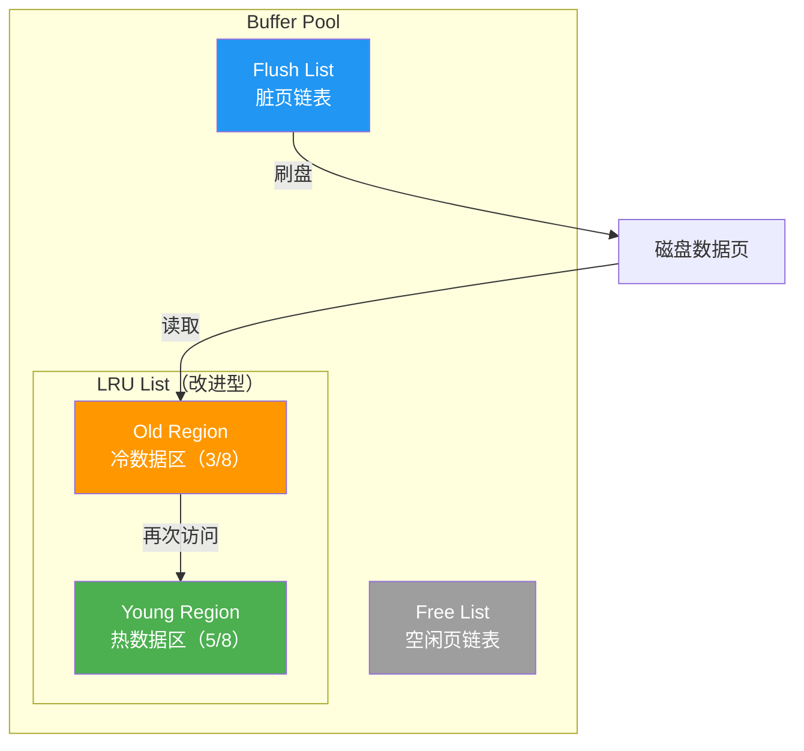
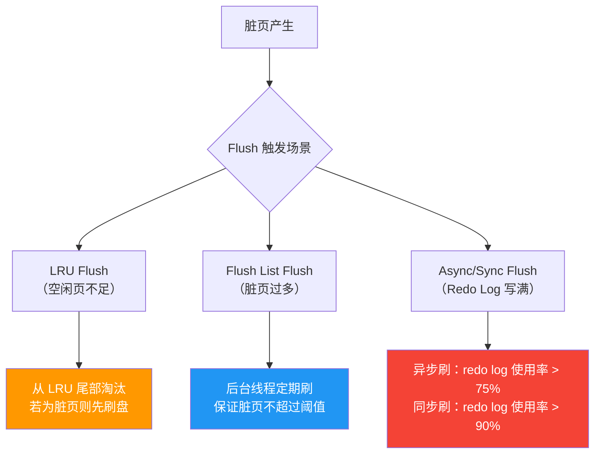
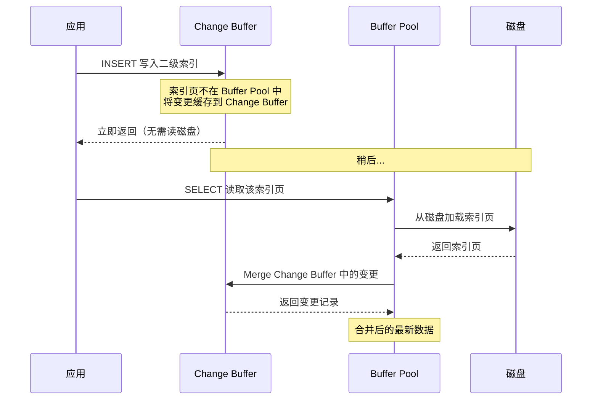

# InnoDB 内存架构

InnoDB 的性能秘密，一大半藏在内存里。Buffer Pool 是 MySQL 最重要的内存结构，理解它的 LRU 改进、Flush 策略、Change Buffer 机制，是调优和排障的基石。

> 参考资料：[小林coding - InnoDB 内存架构](https://xiaolincoding.com/mysql/base/innodb.html) | [MySQL 官方文档 - InnoDB Buffer Pool](https://dev.mysql.com/doc/refman/8.0/en/innodb-buffer-pool.html)

## 1. Buffer Pool 总览

Buffer Pool 是 InnoDB 缓存磁盘数据页的内存区域。数据库对页的读写操作，优先在 Buffer Pool 中进行，而非直接操作磁盘。

```sql
-- 查看 Buffer Pool 大小（字节）
SHOW VARIABLES LIKE 'innodb_buffer_pool_size';

-- 查看 Buffer Pool 状态
SHOW STATUS LIKE 'Innodb_buffer_pool%';
```

```sql
-- 生产环境建议设置为物理内存的 60%~80%
-- 32GB 内存的服务器示例
SET GLOBAL innodb_buffer_pool_size = 21474836480;  -- 20GB
```

### Buffer Pool 内部结构



::: tip Buffer Pool 链表三兄弟
- **Free List**：空闲页链表，启动时所有页都在这里
- **LRU List**：最近使用链表，管理数据页的淘汰策略
- **Flush List**：脏页链表，记录被修改但尚未刷盘的页
:::

## 2. LRU List 改进策略

传统 LRU 存在两个严重问题：

| 问题 | 说明 |
|------|------|
| **预读失效** | 预读到 Buffer Pool 的页没有被访问，却把热数据挤出去 |
| **Buffer Pool 污染** | 全表扫描读取大量数据，热数据被全部挤出 |

InnoDB 将 LRU List 划分为 **Young Region** 和 **Old Region**，中间点（midpoint）按 5:3 划分：


### 2.1 冷数据区首次访问

磁盘读取的页**不是直接放入 Young Region**，而是插入 Old Region 的头部：

```sql
-- Old Region 占 LRU 的比例（默认 3/8 = 37%）
SHOW VARIABLES LIKE 'innodb_old_blocks_pct';
-- innodb_old_blocks_pct = 37
```

### 2.2 预读失效防护

页首次进入 Old Region 后，必须等待 `innodb_old_blocks_time`（默认 1 秒）后再次被访问，才能晋升到 Young Region：

```sql
-- 首次访问后，多少毫秒内再次访问才不晋升
SHOW VARIABLES LIKE 'innodb_old_blocks_time';
-- innodb_old_blocks_time = 1000（1秒）
```

::: warning 为什么需要时间窗口？
全表扫描时，同一页可能在极短时间内被连续读取多次，但扫描结束后再也不用。如果直接晋升，热数据就会被挤掉。1 秒的等待窗口能有效过滤这种"伪热"数据。
:::

### 2.3 热数据区保护

Young Region 的页被访问时不会直接移到链表头部，而是**只有在距上次访问超过 1/4 LRU 长度时才前移**，避免频繁移动链表节点的开销。

## 3. Buffer Pool 实例分区

当 Buffer Pool 大于 1GB 时，InnoDB 会将其拆分为多个实例，减少锁竞争：

```sql
-- 查看实例数
SHOW VARIABLES LIKE 'innodb_buffer_pool_instances';

-- 建议配置规则
-- innodb_buffer_pool_size >= 1GB 时，设置 innodb_buffer_pool_instances
-- 每个实例至少 1GB
```

```sql
-- 32GB Buffer Pool 的推荐配置
SET GLOBAL innodb_buffer_pool_size = 32212254720;     -- 30GB
SET GLOBAL innodb_buffer_pool_instances = 8;           -- 8个实例，每个约3.75GB
```

::: important 实例数选择
- Buffer Pool < 1GB：实例数只能是 1
- 1GB ~ 8GB：建议 2~4 个实例
- 8GB 以上：建议 4~8 个实例
- 实例数并非越多越好，过多会导致各实例空间太小
:::

## 4. Flush 策略

InnoDB 有三种刷脏场景：



### 4.1 LRU Flush

当 Free List 中没有空闲页时，需要从 LRU List 的 Old Region 尾部淘汰页面。如果淘汰的页是脏页，需要先刷盘：

```sql
-- 控制 LRU 尾部每次刷脏的页数
SHOW VARIABLES LIKE 'innodb_lru_scan_depth';
-- 默认 1024，值越大刷盘越激进，但 CPU 开销越大
```

### 4.2 Flush List Flush

后台线程（Page Cleaner Thread）定期从 Flush List 中刷脏页：

```sql
-- 控制后台刷脏的频率（每秒刷脏页数）
SHOW VARIABLES LIKE 'innodb_io_capacity';
-- SSD 建议 10000~20000，HDD 建议 200~400

-- 刷脏速度上限
SHOW VARIABLES LIKE 'innodb_io_capacity_max';
```

### 4.3 Async/Sync Flush

Redo Log 文件空间不足时，必须强制刷脏以释放日志空间：

| Redo Log 使用率 | 动作 | 对查询影响 |
|----------------|------|-----------|
| < 75% | 无需刷盘 | 无 |
| 75% ~ 90% | 异步刷盘，不阻塞查询 | 几乎无 |
| > 90% | 同步刷盘，阻塞所有写操作 | 严重 |

```sql
-- 查看 redo log 刷盘情况
SHOW STATUS LIKE 'Innodb_redo_log%';
```

::: warning Redo Log 写满是灾难
当 redo log 写满触发同步刷盘时，所有写操作被阻塞，数据库会出现明显的性能抖动。这就是为什么 innodb_io_capacity 要根据磁盘性能正确配置。
:::

## 5. Change Buffer

Change Buffer 是 Buffer Pool 中的一片区域，用于缓存**非唯一二级索引**的 DML 操作（INSERT/DELETE/UPDATE），等将来页面被读取时再合并（merge）。



### 5.1 为什么只针对非唯一二级索引？

- **唯一索引**：INSERT 时必须检查唯一性，必须把索引页读入 Buffer Pool，无法避免随机 IO
- **非唯一二级索引**：不涉及唯一性校验，变更可以延迟合并

```sql
-- Change Buffer 占 Buffer Pool 的最大比例
SHOW VARIABLES LIKE 'innodb_change_buffer_max_size';
-- 默认 25，即 25%

-- Change Buffer 类型：inserts、deletes、purges、changes（all）、none
SHOW VARIABLES LIKE 'innodb_change_buffering';
-- 默认 all
```

::: tip Change Buffer 适用场景
- **适合**：写多读少，非唯一二级索引多的表（如日志表、审计表）
- **不适合**：写后立即读的场景（Change Buffer 刚写入就被 merge，白白浪费了缓存空间）
:::

## 6. 自适应哈希索引（AHI）

InnoDB 会自动监控对 Buffer Pool 中页的访问模式，如果发现某些页被频繁以相同模式访问，就自动为其建立哈希索引：

```sql
-- 查看自适应哈希索引状态
SHOW VARIABLES LIKE 'innodb_adaptive_hash_index';

-- 查看 AHI 使用情况
SHOW ENGINE INNODB STATUS\G
-- 查找 "INSERT BUFFER AND ADAPTIVE HASH INDEX" 段
```

```sql
-- AHI 的监控信息
SELECT * FROM performance_schema.table_handles
WHERE TABLE_NAME = 'your_table';
```

::: warning AHI 的利与弊
- **利**：等值查询和范围查询速度可提升 2~10 倍
- **弊**：占用 Buffer Pool 空间；高并发 DML 时 AHI 的 latch 争用可能成为瓶颈
- 生产建议：如果发现 AHI 相关的锁争用（通过 `SHOW ENGINE INNODB STATUS` 观察），可以关闭
:::

## 7. Log Buffer

Log Buffer 是 redo log 写入磁盘前的缓冲区：


```sql
-- Log Buffer 大小
SHOW VARIABLES LIKE 'innodb_log_buffer_size';
-- 默认 16MB，生产建议 64~256MB

-- 刷盘策略
-- 0：每秒刷盘（可能丢 1 秒数据）
-- 1：每次事务提交刷盘（最安全）
-- 2：每次提交写入 OS Cache，每秒 fsync
SHOW VARIABLES LIKE 'innodb_flush_log_at_trx_commit';
```

| innodb_flush_log_at_trx_commit | 安全性 | 性能 | 适用场景 |
|------|------|------|------|
| 0 | 低（丢 1 秒数据） | 高 | 从库 |
| 1 | 高（不丢数据） | 低 | 主库（推荐） |
| 2 | 中（OS 崩溃才丢） | 中 | 折中方案 |

::: important 生产必设
主库务必设置 `innodb_flush_log_at_trx_commit = 1`，否则数据库崩溃时可能丢失已提交事务的数据。这是金融级数据安全的基本要求。
:::

## 8. Buffer Pool 命中率监控

```sql
-- 计算 Buffer Pool 命中率
SHOW STATUS LIKE 'Innodb_buffer_pool_read%';
-- 命中率 = 1 - Innodb_buffer_pool_reads / Innodb_buffer_pool_read_requests

-- 实时监控
SELECT
    (1 - (SELECT VARIABLE_VALUE FROM performance_schema.global_status
           WHERE VARIABLE_NAME = 'Innodb_buffer_pool_reads')
         / (SELECT VARIABLE_VALUE FROM performance_schema.global_status
            WHERE VARIABLE_NAME = 'Innodb_buffer_pool_read_requests')
    ) * 100 AS 'Buffer Pool Hit Rate %';
```

::: tip 命中率标准
- **> 99%**：健康
- **95% ~ 99%**：需关注，可能需要增大 Buffer Pool
- **< 95%**：严重，大量磁盘读取，必须调优
:::

## 9. 使用 dbeaver 监控 Buffer Pool

[dbeaver](https://github.com/dbeaver/dbeaver) 提供了直观的数据库状态监控：

1. 连接 MySQL 后，右键数据库 → **Edit Connection** → **Connection Settings**
2. 在 SQL 编辑器中执行 `SHOW ENGINE INNODB STATUS` 查看 Buffer Pool 详细信息
3. 使用 dbeaver 的 **ER Diagram** 功能可视化表结构，辅助索引优化

```sql
-- 在 dbeaver 中一键查看 Buffer Pool 核心指标
SELECT
    POOL_ID,
    POOL_SIZE AS '页数',
    FREE_BUFFERS AS '空闲页',
    DATABASE_PAGES AS '数据页',
    OLD_DATABASE_PAGES AS 'Old 区页数',
    MODIFY_FACTOR AS '脏页比例'
FROM information_schema.INNODB_BUFFER_POOL_STATS;
```

## 10. 面试技巧

::: tip 面试高频问题
1. **InnoDB 的 LRU 和传统 LRU 有什么区别？**
   - 划分 Young/Old 区，新页先入 Old 区，避免全表扫描污染热数据
   - Old 区页需等待 innodb_old_blocks_time 后再次访问才晋升
   - Young 区页不必每次都移到头部，减少链表操作开销

2. **Change Buffer 有什么用？为什么不缓存主键索引？**
   - 缓存非唯一二级索引的 DML，减少随机 IO
   - 唯一索引需要做唯一性检查，必须读入原页，无法避免 IO

3. **innodb_flush_log_at_trx_commit 设置为 0 会怎样？**
   - 每秒刷盘一次，MySQL 崩溃最多丢 1 秒数据
   - 主库必须设 1，从库可以设 0 或 2

4. **Buffer Pool 命中率低怎么办？**
   - 加大 innodb_buffer_pool_size
   - 检查是否有全表扫描（explain 查看type列）
   - 合理建立索引，减少回表
:::

---

> 本文参考了 [小林coding](https://xiaolincoding.com/mysql/base/innodb.html) 的图解思路和 [MySQL 8.0 官方文档](https://dev.mysql.com/doc/refman/8.0/en/innodb-buffer-pool.html)。推荐使用 [dbeaver](https://github.com/dbeaver/dbeaver) 进行 Buffer Pool 状态监控。
