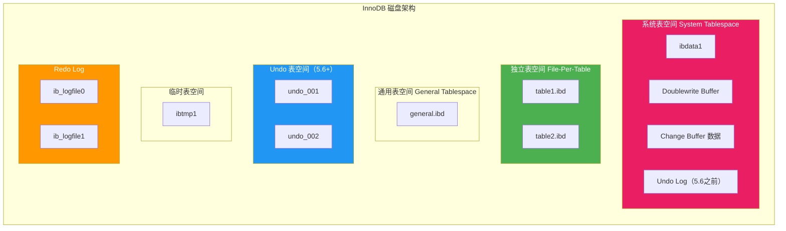
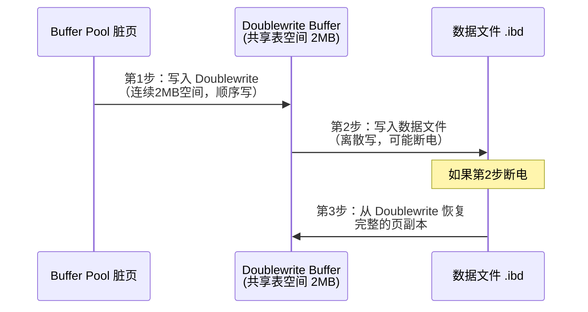
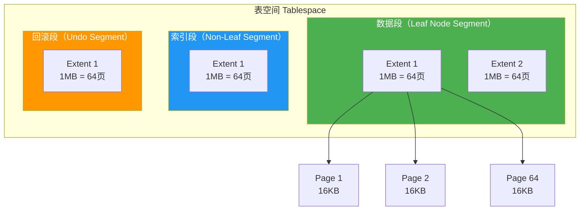
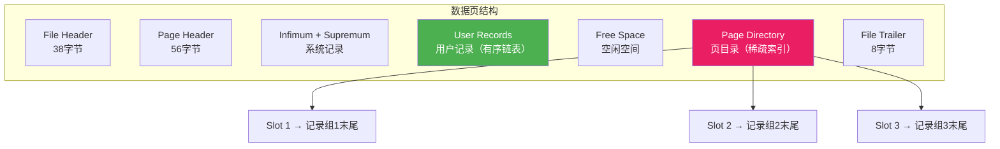

# InnoDB 磁盘架构

Buffer Pool 是内存里的"快车道"，磁盘架构才是数据最终的"保险柜"。理解 InnoDB 的表空间体系、段区页层次结构、Doublewrite 和 Redo Log 文件，是掌握 InnoDB 可靠性与存储管理的根基。

> 参考资料：[小林coding - InnoDB 磁盘架构](https://xiaolincoding.com/mysql/base/innodb.html) | [MySQL 官方文档 - InnoDB Disk Architecture](https://dev.mysql.com/doc/refman/8.0/en/innodb-disk-architecture.html)

## 1. 表空间体系

InnoDB 的所有数据都存储在表空间（Tablespace）中，表空间是 InnoDB 磁盘架构的顶层逻辑容器。



### 1.1 系统表空间（System Tablespace）

系统表空间是 InnoDB 的"心脏"，文件名为 `ibdata1`，存储以下关键数据：

| 内容 | 说明 |
|------|------|
| 数据字典 | 表、列、索引的元数据 |
| Doublewrite Buffer | 崩溃恢复的关键结构 |
| Change Buffer | 二级索引变更缓存（持久化部分） |
| Undo Log（5.6 之前） | 回滚日志，5.6+ 可独立表空间 |

```sql
-- 查看系统表空间文件
SHOW VARIABLES LIKE 'innodb_data_file_path';
-- 默认: ibdata1:12M:autoextend

-- 系统表空间大小（不建议自动扩展过大）
SHOW VARIABLES LIKE 'innodb_autoextend_increment';
-- 默认 64MB
```

::: warning ibdata1 膨胀问题
系统表空间一旦分配就不会缩小。如果大量使用系统表空间存储表数据，DELETE 后空间无法回收。解决方案：开启 `innodb_file_per_table`。
:::

### 1.2 独立表空间（File-Per-Table）

每张表的数据和索引存储在独立的 `.ibd` 文件中，这是 MySQL 5.6+ 的推荐配置：

```sql
-- 开启独立表空间（5.6+ 默认开启）
SHOW VARIABLES LIKE 'innodb_file_per_table';
-- innodb_file_per_table = ON
```

```sql
-- 查看表的物理文件
SELECT
    TABLE_NAME,
    ENGINE,
    TABLESPACE_NAME,
    DATA_LENGTH / 1024 / 1024 AS '数据大小(MB)',
    INDEX_LENGTH / 1024 / 1024 AS '索引大小(MB)'
FROM information_schema.TABLES
WHERE TABLE_SCHEMA = 'your_db' AND TABLE_NAME = 'your_table';
```

::: tip 为什么推荐独立表空间？
- **空间回收**：DROP TABLE / TRUNCATE 可直接删除 `.ibd` 文件释放空间
- **文件管理**：可以将大表放到不同磁盘，分散 IO 压力
- **备份恢复**：可单独备份某张表
- **OPTIMIZE TABLE**：重建表时能回收碎片空间
:::

### 1.3 通用表空间（General Tablespace）

MySQL 5.7+ 引入，允许多张表共享一个表空间文件：

```sql
-- 创建通用表空间
CREATE TABLESPACE ts_orders
ADD DATAFILE 'ts_orders.ibd'
ENGINE = InnoDB;

-- 将表放入通用表空间
CREATE TABLE orders (
    id BIGINT PRIMARY KEY,
    order_no VARCHAR(32)
) TABLESPACE ts_orders;

-- 将已有表移入通用表空间
ALTER TABLE orders TABLESPACE ts_orders;
```

### 1.4 Undo 表空间

MySQL 5.6+ 允许 Undo Log 存储在独立表空间中，5.7+ 支持在线 truncate：

```sql
-- 查看 Undo 表空间配置
SHOW VARIABLES LIKE 'innodb_undo_tablespaces';
-- 8.0 默认 2

-- 8.0 在线截断 Undo 表空间
SHOW VARIABLES LIKE 'innodb_undo_log_truncate';
-- 默认 ON
```

### 1.5 临时表空间

存储临时表和内部临时结果，文件名为 `ibtmp1`：

```sql
-- 临时表空间大小
SHOW VARIABLES LIKE 'innodb_temp_data_file_path';
-- 默认: ibtmp1:12M:autoextend

-- 重启后临时表空间会自动重建为初始大小
```

## 2. Doublewrite Buffer

Doublewrite（双写）是 InnoDB 解决页写入不完整（partial write）问题的机制。磁盘 IO 的最小单位是扇区（512B），而 InnoDB 页是 16KB，如果写入 16KB 时断电，可能出现"写了一半"的脏页。



```sql
-- 查看 Doublewrite 状态
SHOW STATUS LIKE 'Innodb_dblwr%';
-- Innodb_dblwr_pages_written: 已双写的页数
-- Innodb_dblwr_writes: 双写次数
```

::: important Doublewrite 代价
- 增加约 5%~10% 的写 IO 开销
- 但换来了崩溃恢复时页级数据完整性
- SSD 上可以设置 `innodb_doublewrite = OFF` 来优化性能（SSD 本身有原子写能力）
:::

## 3. Redo Log 文件

Redo Log 记录的是"物理修改"——某个页的某个偏移量改了什么值，用于崩溃恢复时重做（redo）已提交的事务。

```sql
-- Redo Log 配置
SHOW VARIABLES LIKE 'innodb_log_file_size';     -- 单个文件大小
SHOW VARIABLES LIKE 'innodb_log_files_in_group'; -- 文件数量
SHOW VARIABLES LIKE 'innodb_log_group_home_dir';  -- 存储路径
```

```sql
-- 8.0 动态调整 redo log 大小
ALTER INSTANCE SET GLOBAL innodb_redo_log_capacity = 4294967296; -- 4GB
```

| 参数 | 推荐值 | 说明 |
|------|--------|------|
| innodb_log_file_size | 1GB~4GB | 太小会导致频繁 checkpoint |
| innodb_log_files_in_group | 2（默认） | 一般不需要修改 |
| innodb_redo_log_capacity | 4GB+ | 8.0 新参数，替代上面两个 |

## 4. 段 → 区 → 页 层次结构

InnoDB 的存储空间按**段（Segment）→ 区（Extent）→ 页（Page）** 三级层次管理：



### 4.1 段（Segment）

| 段类型 | 说明 |
|--------|------|
| 数据段 | B+ 树叶子节点，存储实际行数据 |
| 索引段 | B+ 树非叶子节点，存储索引键值 |
| 回滚段 | 存储 Undo Log |

### 4.2 区（Extent）

- 每个区固定 **1MB**，由 **64 个连续的 16KB 页**组成
- 表空间分配空间以区为单位
- 新建表时先分配碎片区（fragment extent），数据量大了再分配完整区

```sql
-- 查看表的区信息
SELECT
    SPACE,
    PAGE_TYPE,
    COUNT(*) AS PAGE_COUNT
FROM information_schema.INNODB_BUFFER_PAGE
WHERE TABLE_NAME LIKE '%your_table%'
GROUP BY SPACE, PAGE_TYPE;
```

### 4.3 页（Page）

页是 InnoDB 磁盘管理的最小单位，默认 **16KB**：

```sql
-- 查看页大小
SHOW VARIABLES LIKE 'innodb_page_size';
-- 默认 16384（16KB），可选 4K/8K/16K/32K/64K
```

| 页类型 | 说明 |
|--------|------|
| 数据页 | 存储行记录 |
| 索引页 | 存储索引键值 |
| Undo 页 | 存储 Undo Log |
| Insert Buffer 页 | 存储 Change Buffer |
| 系统 页 | 存储数据字典等 |
| Blob 页 | 存储溢出数据 |

## 5. Page Directory

每个数据页内部有一个 **Page Directory（页目录）**，将页内的记录分组，每组最后一条记录的偏移量存储在目录中，形成稀疏索引。



::: tip Page Directory 加速查找
页内查找记录时，先通过 Page Directory 二分查找定位到 Slot（粗粒度），再在 Slot 对应的记录组内遍历（细粒度），时间复杂度从 O(n) 降低到 O(log n)。
:::

## 6. 文件格式：Barracuda vs Antelope

| 格式 | 支持的行格式 | MySQL 版本 |
|------|-------------|-----------|
| Antelope | REDUNDANT、COMPACT | 5.6 及之前默认 |
| Barracuda | DYNAMIC、COMPRESSED | 5.7+ 默认 |

```sql
-- 查看表的行格式
SELECT TABLE_NAME, ROW_FORMAT
FROM information_schema.TABLES
WHERE TABLE_SCHEMA = 'your_db';

-- 修改行格式
ALTER TABLE your_table ROW_FORMAT = DYNAMIC;
```

## 7. innodb_file_per_table 最佳实践

```sql
-- 1. 确认开启
SHOW VARIABLES LIKE 'innodb_file_per_table';

-- 2. 回收碎片空间
OPTIMIZE TABLE your_table;
-- 等价于 ALTER TABLE your_table ENGINE=InnoDB;
-- 重建表，回收 .ibd 文件中的碎片

-- 3. 查看碎片率
SELECT
    TABLE_NAME,
    DATA_FREE / 1024 / 1024 AS '碎片空间(MB)',
    DATA_LENGTH / 1024 / 1024 AS '数据大小(MB)',
    ROUND(DATA_FREE / (DATA_LENGTH + INDEX_LENGTH + DATA_FREE) * 100, 2) AS '碎片率%'
FROM information_schema.TABLES
WHERE TABLE_SCHEMA = 'your_db'
    AND ENGINE = 'InnoDB'
HAVING 碎片空间(MB) > 10
ORDER BY 碎片空间(MB) DESC;
```

::: warning DELETE 后空间不会自动释放
- InnoDB 的 DELETE 只标记删除，不会释放磁盘空间
- 空间会在后续 INSERT 中复用（页内重用）
- 要真正回收磁盘空间，需要 `OPTIMIZE TABLE` 或 `ALTER TABLE ... ENGINE=InnoDB`
- 注意：OPTIMIZE TABLE 会锁表，线上操作需用 `pt-online-schema-change`
:::

## 8. 使用 dbeaver 管理表空间

在 [dbeaver](https://github.com/dbeaver/dbeaver) 中可以方便地查看和管理表空间：

1. **查看表空间信息**：展开数据库节点 → 右键表 → **View Diagram** 查看表结构
2. **查看表文件大小**：右键表 → **View Table Data** → 查看 Data Length / Index Length
3. **执行维护 SQL**：SQL 编辑器中直接执行 `OPTIMIZE TABLE` 等语句

```sql
-- 在 dbeaver 中查看所有 InnoDB 表的空间使用情况
SELECT
    TABLE_SCHEMA AS '数据库',
    TABLE_NAME AS '表名',
    ENGINE AS '引擎',
    TABLE_ROWS AS '行数',
    ROUND(DATA_LENGTH / 1024 / 1024, 2) AS '数据(MB)',
    ROUND(INDEX_LENGTH / 1024 / 1024, 2) AS '索引(MB)',
    ROUND(DATA_FREE / 1024 / 1024, 2) AS '碎片(MB)',
    ROW_FORMAT AS '行格式'
FROM information_schema.TABLES
WHERE ENGINE = 'InnoDB'
    AND TABLE_SCHEMA NOT IN ('mysql', 'information_schema', 'performance_schema', 'sys')
ORDER BY DATA_LENGTH + INDEX_LENGTH DESC
LIMIT 20;
```

## 9. 面试技巧

::: tip 面试高频问题
1. **InnoDB 的表空间有哪几种？**
   - 系统表空间（ibdata1）、独立表空间（.ibd）、通用表空间、Undo 表空间、临时表空间

2. **什么是 Doublewrite？为什么需要？**
   - 解决 partial write 问题。16KB 页写入可能只写了一半就断电
   - 先写入 Doublewrite Buffer（2MB 连续空间），再写入数据文件
   - 崩溃恢复时从 Doublewrite 找完整副本

3. **DELETE 之后磁盘空间会释放吗？**
   - 不会。InnoDB 只标记删除，空间留给后续 INSERT 复用
   - 需 `OPTIMIZE TABLE` 或 `ALTER TABLE ... ENGINE=InnoDB` 重建表才能回收

4. **段、区、页分别是什么？**
   - 段：逻辑单位，一个 B+ 树有数据段和索引段
   - 区：1MB = 64 个连续页，是空间分配单位
   - 页：16KB，磁盘管理最小单位

5. **innodb_file_per_table 要不要开？**
   - 必须开。独立表空间支持空间回收、独立备份、文件分散 IO
:::

---

> 本文参考了 [小林coding](https://xiaolincoding.com/mysql/base/innodb.html) 和 [MySQL 8.0 官方文档](https://dev.mysql.com/doc/refman/8.0/en/innodb-disk-architecture.html)。推荐使用 [dbeaver](https://github.com/dbeaver/dbeaver) 管理和监控表空间。
