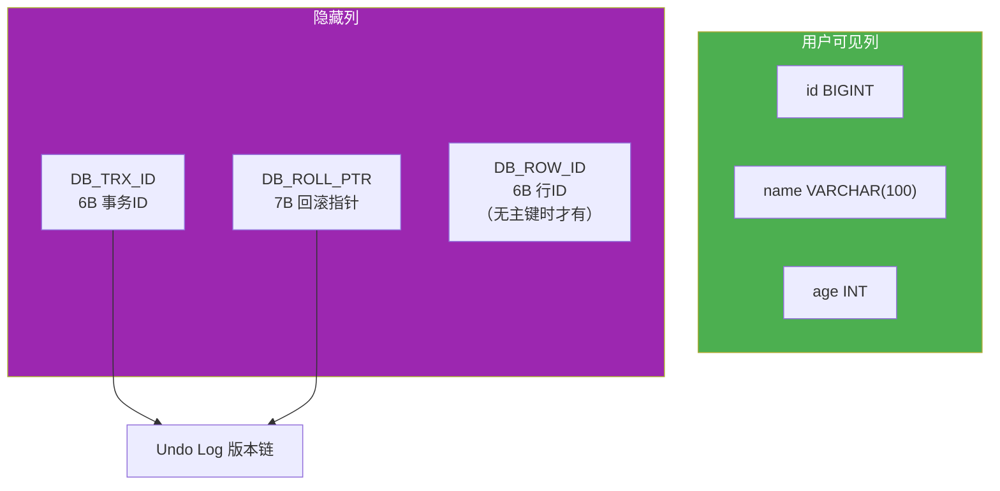
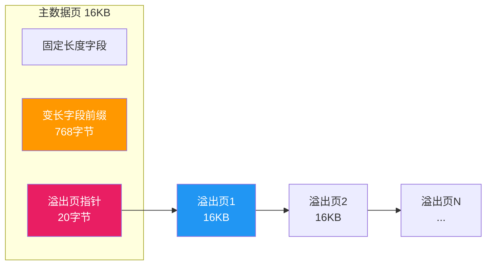
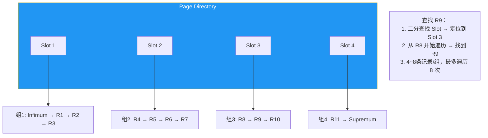

# InnoDB 行格式与数据页

行格式决定了数据在页中如何存储，直接影响存储效率和查询性能。理解 COMPACT/DYNAMIC 行格式的内部结构、溢出页机制和数据页的组织方式，是深入 InnoDB 存储引擎的必经之路。

> 参考资料：[小林coding - InnoDB 行格式](https://xiaolincoding.com/mysql/base/row_format.html) | [MySQL 官方文档 - InnoDB Row Formats](https://dev.mysql.com/doc/refman/8.0/en/innodb-row-format.html)

## 1. 行格式概览

InnoDB 支持四种行格式：

| 行格式 | 文件格式 | MySQL 版本 | 说明 |
|--------|---------|-----------|------|
| REDUNDANT | Antelope | 古老格式 | 兼容保留，不推荐使用 |
| COMPACT | Antelope | 5.0+ | 紧凑存储，减少 20% 空间 |
| DYNAMIC | Barracuda | 5.7+ 默认 | 溢出页优化，长字段全部 off-page |
| COMPRESSED | Barracuda | 5.7+ | 页级压缩，CPU 开销大 |

```sql
-- 查看表的行格式
SELECT TABLE_NAME, ROW_FORMAT
FROM information_schema.TABLES
WHERE TABLE_SCHEMA = 'your_db';

-- 创建表时指定行格式
CREATE TABLE users (
    id BIGINT PRIMARY KEY,
    name VARCHAR(100),
    bio TEXT
) ROW_FORMAT = DYNAMIC;

-- 修改行格式
ALTER TABLE users ROW_FORMAT = DYNAMIC;
```

## 2. COMPACT 行格式

COMPACT 是理解行格式的核心，它的记录结构如下：


### 2.1 变长字段长度列表

VARCHAR、TEXT 等变长类型需要记录其实际长度。存储规则：

| 字段最大长度（M） | 长度字节数 | 说明 |
|-----------------|-----------|------|
| M ≤ 255 | 1 字节 | 单字节足够 |
| 255 < M ≤ 65535 | 2 字节 | 需要双字节 |

::: tip 逆序存储
变长字段长度列表采用**逆序存储**（字段顺序与定义顺序相反），这样记录头信息的偏移量就是固定的，无需解析变长部分即可定位。
:::

### 2.2 NULL 值 Bitmap

NULL 值不占用实际数据空间，只用 bitmap 中的 1 bit 标记：

```sql
-- 假设表有 10 个字段，NULL bitmap 占 ceil(10/8) = 2 字节
CREATE TABLE null_demo (
    id INT PRIMARY KEY,
    c1 VARCHAR(50),
    c2 VARCHAR(50),
    c3 INT,
    c4 TEXT,
    c5 DATETIME,
    c6 VARCHAR(100),
    c7 INT,
    c8 VARCHAR(50),
    c9 TEXT
) ROW_FORMAT = COMPACT;
```

::: important NULL 值的存储优势
- NULL 值在 bitmap 中只占 1 bit，不占用数据区空间
- 这也是为什么建议将不确定是否使用的字段设为 NULL 而非空字符串
- 但 NULL 值会影响索引效率（索引中需要额外存储 NULL 标记）
:::

### 2.3 记录头信息

记录头信息固定 5 字节（40 bit），关键字段：

| 字段 | 位数 | 说明 |
|------|------|------|
| delete_flag | 1 | 是否被删除 |
| min_rec_flag | 1 | B+ 树非叶子节点最小记录标记 |
| n_owned | 4 | 该记录拥有的记录数（Page Directory 用） |
| heap_no | 13 | 在页中的堆号 |
| record_type | 3 | 0=普通，1=B+ 树非叶子，2=Infimum，3=Supremum |
| next_record | 16 | 下一条记录的偏移量 |

```sql
-- 通过 dbeaver 的 SQL 编辑器查看记录头信息
-- 需要使用 innodb_ruby 等工具解析 page，MySQL 本身不直接提供
-- 替代方案：查看 information_schema 中的行信息
SELECT * FROM information_schema.INNODB_BUFFER_PAGE
WHERE TABLE_NAME LIKE '%your_table%' LIMIT 10;
```

### 2.4 隐藏列

每条记录都包含 3 个隐藏列（如果表没有显式主键）：

| 隐藏列 | 大小 | 说明 |
|--------|------|------|
| DB_TRX_ID | 6 字节 | 最后修改该行的事务 ID |
| DB_ROLL_PTR | 7 字节 | 回滚指针，指向 Undo Log 中的上一版本 |
| DB_ROW_ID | 6 字节 | 隐藏自增 ID（仅当无显式主键时） |



::: warning 一定要定义主键
- 没有主键时，InnoDB 用 DB_ROW_ID 作为聚簇索引键
- DB_ROW_ID 是全局共享的（并非表级自增），性能和可维护性都差
- 优先级：显式主键 > 唯一非空索引 > 自动生成 DB_ROW_ID
:::

## 3. 溢出页（Overflow Page）

InnoDB 页大小默认 16KB，如果一行数据太大，无法完整放入一个页中，就会使用溢出页。

### 3.1 溢出阈值

COMPACT 格式的溢出规则：

- 如果一行数据超过页大小的约一半（约 **7682 字节**），变长字段会被移到溢出页
- 前缀部分（768 字节）仍然保留在原页，后面跟着指向溢出页的 20 字节指针



### 3.2 DYNAMIC 格式的溢出优化

DYNAMIC（5.7+ 默认）对溢出策略做了优化：

| 对比项 | COMPACT | DYNAMIC |
|--------|---------|---------|
| 长字段前缀 | 保留 768 字节 | **不保留**前缀，仅存 20 字节指针 |
| 溢出判断 | 行超 7682 字节时部分溢出 | 行超 7682 字节时**整列**溢出 |
| 单页行数 | 长字段前缀占用空间，单页行数少 | 页内更紧凑，单页行数更多 |

```sql
-- 查看是否有溢出页
SELECT
    TABLE_NAME,
    AVG_ROW_LENGTH,
    DATA_LENGTH / 1024 / 1024 AS '数据大小(MB)'
FROM information_schema.TABLES
WHERE TABLE_SCHEMA = 'your_db'
    AND (AVG_ROW_LENGTH > 8000 OR DATA_FREE > 0);
```

### 3.3 VARCHAR 最大长度

VARCHAR 理论最大长度 65535 字节，但实际受以下限制：

```sql
-- 测试 VARCHAR 最大长度
CREATE TABLE varchar_test (
    -- 单列最大：65535 - 2(长度) - 1(NULL bitmap) - 6(DB_TRX_ID) - 7(DB_ROLL_PTR) = 65527
    -- 但还要考虑字符集：utf8mb4 下 1 字符最多 4 字节
    c1 VARCHAR(16383)  -- utf8mb4: 16383 * 4 = 65532 字节
) ROW_FORMAT = DYNAMIC CHARSET = utf8mb4;
```

::: warning VARCHAR 超限会怎样？
- 如果 VARCHAR 长度定义超过行最大限制，MySQL 会自动将其转为 TEXT
- TEXT/BLOB 列本身存储在溢出页，主记录只存 20 字节指针
:::

## 4. REDUNDANT 行格式

REDUNDANT 是最古老的格式，与 COMPACT 的主要区别：

| 对比项 | REDUNDANT | COMPACT |
|--------|-----------|---------|
| 字段长度存储 | 每个字段都存长度偏移 | 仅变长字段存长度 |
| NULL 处理 | NULL 存固定占位 | NULL 只占 bitmap 1 bit |
| 记录头 | 6 字节 | 5 字节 |
| 空间效率 | 低 | 高（约省 20%） |

```sql
-- 不推荐使用 REDUNDANT，仅了解即可
ALTER TABLE old_table ROW_FORMAT = REDUNDANT;
```

## 5. 数据页内部结构

一个 16KB 的数据页由以下 7 个部分组成：


### 5.1 File Header（38 字节）

| 字段 | 大小 | 说明 |
|------|------|------|
| FIL_PAGE_OFFSET | 4 | 页号（全局唯一） |
| FIL_PAGE_PREV | 4 | 前一页页号（B+ 树叶子节点双向链表） |
| FIL_PAGE_NEXT | 4 | 后一页页号 |
| FIL_PAGE_LSN | 8 | 页面最后修改的 LSN |
| FIL_PAGE_TYPE | 2 | 页类型 |
| FIL_PAGE_SPACE | 4 | 表空间 ID |

### 5.2 Infimum + Supremum

每个数据页都有两条系统记录：

- **Infimum**：比页内所有用户记录都小的"最小记录"
- **Supremum**：比页内所有用户记录都大的"最大记录"


### 5.3 User Records

用户记录通过 `next_record` 指针形成**按主键排序的单向链表**。删除的记录仍在链表中，但 `delete_flag = 1`，组成"垃圾链表"供新记录复用。

### 5.4 Page Directory 与二分查找

Page Directory 是页内的"小索引"，将记录分组后存储每组最后一条记录的位置：



::: tip Page Directory 查找过程
1. 通过 **二分查找** 在 Page Directory 中定位 Slot
2. 从 Slot 指向的记录开始**单向遍历**
3. 每组 4~8 条记录，遍历次数有限
4. 整体复杂度：O(log n) + O(1) ≈ O(log n)
:::

### 5.5 File Trailer（8 字节）

| 字段 | 大小 | 说明 |
|------|------|------|
| 校验和 | 4 | 与 File Header 的校验和比对 |
| LSN | 4 | 与 File Header 的 LSN 比对 |

File Trailer 的作用是确保页的完整性：如果页写入过程中断电，校验和不一致，InnoDB 会丢弃该页，从 Doublewrite Buffer 或 Redo Log 恢复。

## 6. 行格式与索引的关系

```sql
-- 创建示例表，观察不同行格式下的存储差异
CREATE TABLE row_demo_compact (
    id INT PRIMARY KEY,
    name VARCHAR(50),
    description VARCHAR(500),
    bio TEXT
) ROW_FORMAT = COMPACT;

CREATE TABLE row_demo_dynamic (
    id INT PRIMARY KEY,
    name VARCHAR(50),
    description VARCHAR(500),
    bio TEXT
) ROW_FORMAT = DYNAMIC;

-- 插入相同数据后对比
INSERT INTO row_demo_compact VALUES (1, '张三', '一段描述', REPEAT('很长很长的bio', 1000));
INSERT INTO row_demo_dynamic VALUES (1, '张三', '一段描述', REPEAT('很长很长的bio', 1000));

-- 在 dbeaver 中查看表统计信息
SELECT TABLE_NAME, ROW_FORMAT, AVG_ROW_LENGTH, DATA_LENGTH
FROM information_schema.TABLES
WHERE TABLE_NAME LIKE 'row_demo%';
```

## 7. 使用 dbeaver 分析行格式

在 [dbeaver](https://github.com/dbeaver/dbeaver) 中可以方便地查看和管理行格式：

1. 右键表 → **Edit Table** → 查看 **Storage** 选项卡中的 Row Format
2. 使用 SQL 编辑器执行 `SHOW TABLE STATUS` 查看行格式和平均行长度
3. 使用 ER Diagram 功能可视化表关系，辅助分析溢出风险

```sql
-- 在 dbeaver 中一键查看所有表的行格式
SHOW TABLE STATUS FROM your_db;
-- 关注 Row_format、Avg_row_length、Data_length 列
```

## 8. 面试技巧

::: tip 面试高频问题
1. **COMPACT 行格式的记录由哪几部分组成？**
   - 变长字段长度列表 + NULL 值 bitmap + 记录头信息 + 隐藏列 + 实际列数据
   - 逆序存储变长字段长度，便于固定偏移量访问记录头

2. **什么是溢出页？COMPACT 和 DYNAMIC 有什么区别？**
   - 行数据超过页大小约一半时，变长字段移到溢出页
   - COMPACT 保留 768 字节前缀 + 溢出指针
   - DYNAMIC 仅存 20 字节溢出指针，页内更紧凑

3. **数据页内如何快速查找记录？**
   - Page Directory 将记录分组，每组 4~8 条
   - 先二分查找 Slot，再在组内遍历
   - 复杂度 O(log n)

4. **InnoDB 的隐藏列有什么用？**
   - DB_TRX_ID：事务 ID，MVCC 的核心
   - DB_ROLL_PTR：回滚指针，指向 Undo Log 版本链
   - DB_ROW_ID：无主键时的隐藏行 ID

5. **VARCHAR(65535) 真的能存 65535 个字符吗？**
   - 不能。65535 是字节数限制，utf8mb4 下最多约 16383 个字符
   - 还要扣除行格式开销（长度字节、隐藏列等）
   - 超限会自动转为 TEXT 类型
:::

---

> 本文参考了 [小林coding](https://xiaolincoding.com/mysql/base/row_format.html) 和 [MySQL 8.0 官方文档](https://dev.mysql.com/doc/refman/8.0/en/innodb-row-format.html)。推荐使用 [dbeaver](https://github.com/dbeaver/dbeaver) 管理和查看行格式信息。
