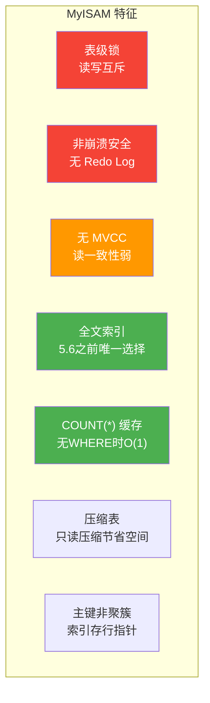
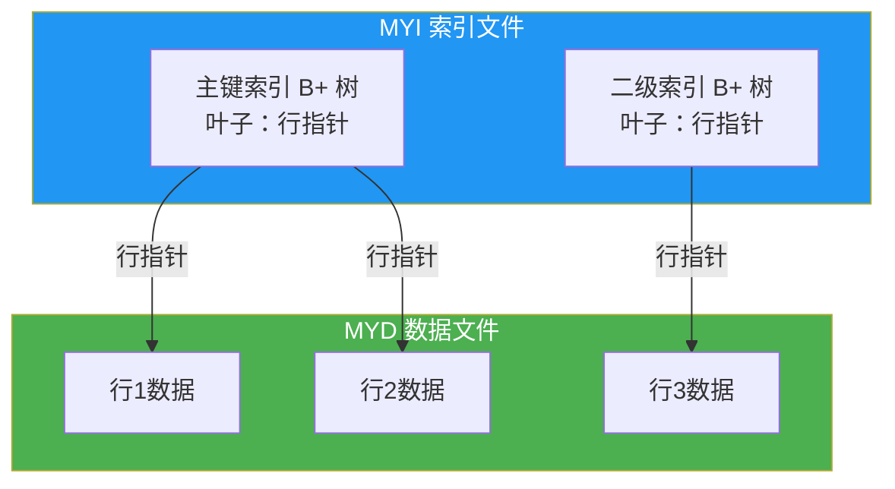
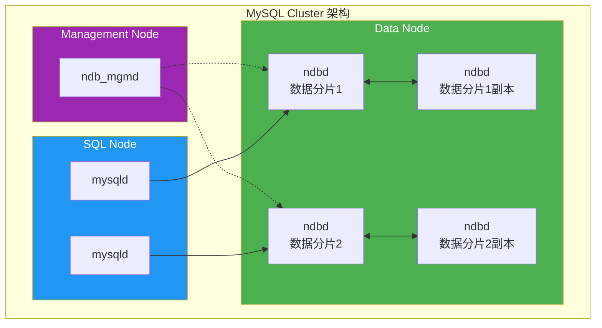
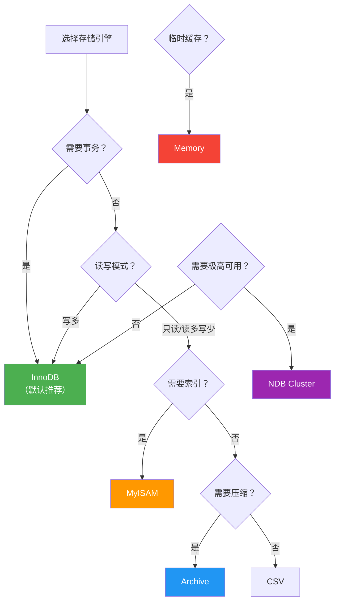

# MyISAM 与其他引擎

InnoDB 不是 MySQL 的唯一选择。MyISAM 曾经是 MySQL 的默认引擎，还有 Memory、Archive、NDB 等特殊场景引擎。理解各引擎的特性差异，才能在不同业务场景中做出正确的选型决策。

> 参考资料：[小林coding - 存储引擎](https://xiaolincoding.com/mysql/base/innodb.html) | [MySQL 官方文档 - Alternative Storage Engines](https://dev.mysql.com/doc/refman/8.0/en/storage-engines.html)

## 1. MyISAM 架构

MyISAM 是 MySQL 最古老的存储引擎之一，5.5 之前是默认引擎，5.5 之后被 InnoDB 取代。

### 1.1 文件结构

MyISAM 每张表由三个文件组成：

| 文件 | 说明 |
|------|------|
| `.frm` | 表结构定义文件（所有引擎共用，8.0 移入数据字典） |
| `.MYD` | 数据文件（MYData） |
| `.MYI` | 索引文件（MYIndex） |

```sql
-- 查看表的引擎
SELECT TABLE_NAME, ENGINE
FROM information_schema.TABLES
WHERE TABLE_SCHEMA = 'your_db';

-- 创建 MyISAM 表
CREATE TABLE myisam_demo (
    id INT PRIMARY KEY,
    name VARCHAR(50),
    created_at DATETIME
) ENGINE = MyISAM;
```

### 1.2 MyISAM 核心特征



```sql
-- MyISAM 的表级锁演示
-- 会话1：加读锁
LOCK TABLE myisam_demo READ;
-- 会话2：可以读，不能写（阻塞）
-- 会话1：释放锁
UNLOCK TABLES;

-- 会话1：加写锁
LOCK TABLE myisam_demo WRITE;
-- 会话2：读和写都阻塞
```

::: warning MyISAM 表级锁的代价
- 读锁与写锁互斥：一个写操作会阻塞整张表的读写
- 并发写入性能极差：不适合 OLTP 场景
- 适合读多写少的场景（如报表、日志分析）
:::

### 1.3 MyISAM 索引结构

MyISAM 的索引都是"非聚簇"的——二级索引和主键索引结构相同，叶子节点存储的是**行指针**（数据文件中的偏移量），而非主键值。



## 2. MyISAM vs InnoDB 全面对比

| 维度 | MyISAM | InnoDB |
|------|--------|--------|
| **锁粒度** | 表级锁 | 行级锁（默认） |
| **事务** | 不支持 | 支持 ACID |
| **崩溃安全** | 否，需 REPAIR TABLE | 是，Redo Log + Doublewrite |
| **MVCC** | 不支持 | 支持 |
| **外键** | 不支持 | 支持 |
| **聚簇索引** | 否，索引存行指针 | 是，主键即数据 |
| **全文索引** | 支持（5.6前唯一选择） | 5.6+ 支持 |
| **COUNT(*)** | 无 WHERE 时 O(1) | 需要遍历（8.0 优化） |
| **压缩表** | 支持只读压缩 | 不支持页级压缩 |
| **空间回收** | DELETE 后需 OPTIMIZE | 独立表空间可回收 |
| **索引缓存** | 仅缓存索引（Key Buffer） | 缓存索引+数据（Buffer Pool） |
| **数据缓存** | 无 | Buffer Pool |
| **AUTO_INCREMENT** | 表级，串行 | 插入时自增，可批量 |
| **DELETE** | 逐行删除，重建索引 | 标记删除，后台 purge |
| **UPDATE** | 可能碎片化 | 原地更新（in-place） |
| **行格式** | Dynamic/Fixed/Compressed | Dynamic/Compact/Compressed |
| **BLOB/TEXT** | 存储效率低 | 溢出页，更高效 |
| **热备份** | 需锁表 | 在线热备（XtraBackup） |
| **复制** | 基于语句复制可能有隐患 | 基于行复制更可靠 |
| **GIS** | 基础支持 | 8.0 增强支持 |

```sql
-- 查看当前 MySQL 支持的引擎
SHOW ENGINES;

-- 将 MyISAM 表转为 InnoDB
ALTER TABLE myisam_demo ENGINE = InnoDB;
-- 注意：转换期间表会被锁定，大表需用 pt-online-schema-change
```

## 3. 何时选择 MyISAM

虽然 InnoDB 是通用推荐，但以下场景 MyISAM 仍有优势：

### 3.1 只读或读多写少的表

```sql
-- 日志表：写入后几乎不修改，大量范围查询
CREATE TABLE access_log (
    id BIGINT AUTO_INCREMENT PRIMARY KEY,
    ip VARCHAR(45),
    url VARCHAR(500),
    status_code SMALLINT,
    created_at DATETIME,
    KEY idx_created (created_at)
) ENGINE = MyISAM;
```

### 3.2 COUNT(*) 无 WHERE 条件

```sql
-- MyISAM 存储了表的行数，COUNT(*) 不需要遍历
SELECT COUNT(*) FROM access_log;  -- MyISAM: O(1)
-- InnoDB 需要遍历索引，因为 MVCC 下不同事务看到的行数可能不同

-- 但带 WHERE 时两者都需要扫描
SELECT COUNT(*) FROM access_log WHERE status_code = 200;  -- 都需要扫描
```

### 3.3 压缩只读表

```sql
-- MyISAM 支持压缩表，节省存储空间
-- 压缩后只读，适合归档数据
-- 使用 myisampack 工具
-- myisampack access_log  -- 命令行操作
```

::: important MyISAM 使用建议
- 新项目一律使用 InnoDB，不要主动选择 MyISAM
- 如果有只读归档需求，优先考虑 InnoDB + 表压缩
- 已有的 MyISAM 表应该逐步迁移到 InnoDB
:::

## 4. Memory 引擎

Memory（原名 HEAP）引擎将数据完全存储在内存中，重启后数据丢失。

```sql
CREATE TABLE session_cache (
    session_id VARCHAR(128) PRIMARY KEY,
    user_id INT,
    data JSON,
    expire_at DATETIME
) ENGINE = Memory;
```

| 特性 | 说明 |
|------|------|
| 存储 | 完全内存，重启丢失 |
| 索引 | 支持 Hash 索引和 B-Tree 索引 |
| 锁 | 表级锁 |
| BLOB/TEXT | 不支持 |
| 适用场景 | 临时缓存、会话存储 |

::: warning Memory 引擎的局限
- 不支持 BLOB/TEXT/JSON 类型
- 表级锁，并发性能差
- 重启数据丢失
- MySQL 8.0 推荐用 **TempTable** 引擎替代内部临时表
:::

```sql
-- Hash 索引 vs B-Tree 索引（Memory 引擎特有选择）
CREATE TABLE hash_demo (
    id INT,
    name VARCHAR(50),
    KEY USING HASH (id)     -- Hash 索引：等值查询极快
) ENGINE = Memory;

CREATE TABLE btree_demo (
    id INT,
    name VARCHAR(50),
    KEY USING BTREE (id)    -- B-Tree 索引：支持范围查询
) ENGINE = Memory;
```

## 5. Archive 引擎

Archive 引擎专为高压缩比、只写入的场景设计：

```sql
CREATE TABLE audit_archive (
    id BIGINT AUTO_INCREMENT PRIMARY KEY,
    action VARCHAR(50),
    detail TEXT,
    created_at DATETIME
) ENGINE = Archive;
```

| 特性 | 说明 |
|------|------|
| 压缩 | zlib 压缩，压缩比通常 5:1~10:1 |
| 操作 | 只支持 INSERT 和 SELECT |
| 索引 | 不支持索引 |
| 锁 | 行级锁（INSERT 时不阻塞 SELECT） |
| 适用场景 | 审计日志、归档数据 |

## 6. NDB Cluster 引擎

NDB（Network Database）是 MySQL Cluster 的存储引擎，提供分布式、share-nothing 架构：



| 特性 | 说明 |
|------|------|
| 架构 | 分布式、share-nothing |
| 可用性 | 99.999% 可用性目标 |
| 数据分布 | 自动分片，支持跨节点 JOIN |
| 事务 | 支持，但跨节点事务性能差 |
| 适用场景 | 电信级高可用、实时系统 |

::: warning NDB 的取舍
- 优势：高可用、自动分片、无单点故障
- 劣势：跨节点 JOIN 性能差、内存消耗大、运维复杂
- 国内生产环境更常见 InnoDB + 中间件分库分表方案
:::

## 7. CSV 引擎

```sql
CREATE TABLE csv_demo (
    id INT NOT NULL,
    name VARCHAR(50) NOT NULL,
    age INT NOT NULL
) ENGINE = CSV;

-- CSV 文件可直接用 Excel 打开
-- 所有列必须为 NOT NULL
-- 不支持索引
```

## 8. Federated 引擎

Federated 引擎提供远程表访问能力，不存储本地数据，所有操作转发到远程 MySQL：

```sql
-- 创建远程表映射
CREATE SERVER remote_server
FOREIGN DATA WRAPPER mysql
OPTIONS (
    HOST '192.168.1.100',
    PORT 3306,
    USER 'readonly',
    PASSWORD 'secret',
    DATABASE 'remote_db'
);

CREATE TABLE federated_demo (
    id INT PRIMARY KEY,
    name VARCHAR(50)
) ENGINE = Federated
CONNECTION = 'remote_server/federated_demo';
```

::: warning Federated 引擎风险
- 远程服务器故障会导致本地查询失败
- 不支持事务、不缓存数据
- 生产环境不推荐使用，推荐使用 CDC 工具（如 Canal）实现数据同步
:::

## 9. 引擎选型决策图



## 10. SHOW ENGINE STATUS

```sql
-- 查看 InnoDB 状态（最重要）
SHOW ENGINE INNODB STATUS\G

-- 查看 MyISAM 状态
SHOW ENGINE MYISAM STATUS;

-- 查看所有引擎状态概览
SELECT
    ENGINE,
    SUPPORT,
    TRANSACTIONS,
    LOCKS,
    SAVEPOINTS
FROM information_schema.ENGINES;
```

## 11. 使用 dbeaver 查看引擎信息

在 [dbeaver](https://github.com/dbeaver/dbeaver) 中可以方便地查看和切换存储引擎：

1. **查看引擎列表**：展开数据库连接 → 右键 → **Edit Connection** → 查看支持的引擎
2. **修改表引擎**：右键表 → **Edit Table** → **Storage** 选项卡 → 选择引擎
3. **ER 图**：选中多张表 → 右键 → **View Diagram**，可视化表关系

```sql
-- 在 dbeaver 中批量查看表的引擎
SELECT
    TABLE_SCHEMA AS '数据库',
    TABLE_NAME AS '表名',
    ENGINE AS '引擎',
    TABLE_ROWS AS '行数',
    ROUND(DATA_LENGTH / 1024 / 1024, 2) AS '数据(MB)',
    TABLE_COMMENT AS '备注'
FROM information_schema.TABLES
WHERE TABLE_SCHEMA NOT IN ('mysql', 'information_schema', 'performance_schema', 'sys')
ORDER BY ENGINE, TABLE_SCHEMA, TABLE_NAME;
```

## 12. 面试技巧

::: tip 面试高频问题
1. **MyISAM 和 InnoDB 的核心区别？**
   - InnoDB：行级锁、事务、MVCC、崩溃安全、聚簇索引
   - MyISAM：表级锁、无事务、无 MVCC、非崩溃安全、非聚簇索引

2. **什么时候还用 MyISAM？**
   - 几乎不用了。InnoDB 5.6+ 支持全文索引后，MyISAM 最后的优势也没了
   - 唯一理由：COUNT(*) 无 WHERE 时 O(1)（但这是微小优化）

3. **Memory 引擎和临时表有什么关系？**
   - Memory 引擎是用户可显式创建的内存表
   - 内部临时表（ORDER BY/GROUP BY 产生的）不一定用 Memory 引擎
   - 8.0 推荐用 TempTable 引擎替代

4. **NDB Cluster 为什么在国内不流行？**
   - 运维复杂度高，跨节点 JOIN 性能差
   - 国内更倾向 InnoDB + ShardingSphere/MyCAT 分库分表

5. **如何将 MyISAM 表安全迁移到 InnoDB？**
   - 小表：`ALTER TABLE t ENGINE=InnoDB`（锁表）
   - 大表：用 `pt-online-schema-change` 在线转换
   - 迁移前检查是否有全文索引、空间索引等兼容性问题
:::

---

> 本文参考了 [小林coding](https://xiaolincoding.com/mysql/base/innodb.html) 和 [MySQL 8.0 官方文档](https://dev.mysql.com/doc/refman/8.0/en/storage-engines.html)。推荐使用 [dbeaver](https://github.com/dbeaver/dbeaver) 管理和切换存储引擎。
