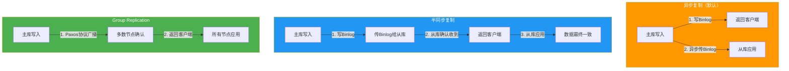
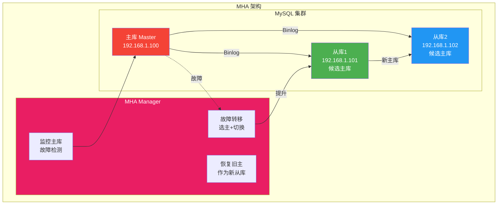
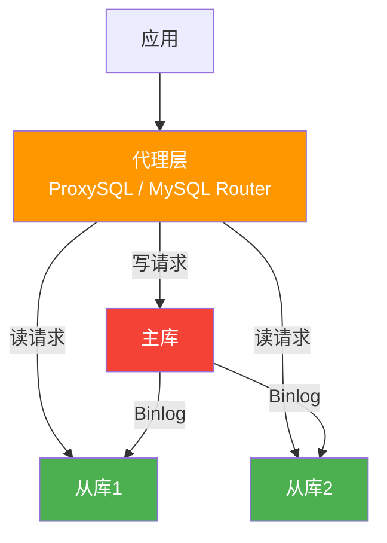
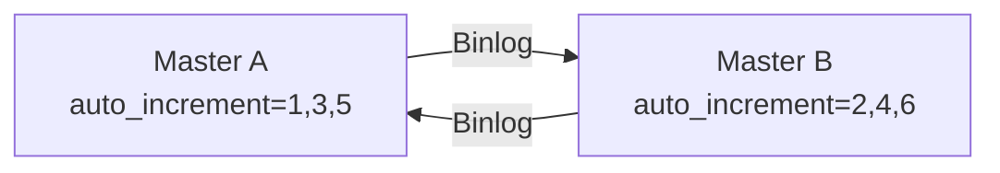

# 主从复制与读写分离

单机 MySQL 无法同时满足高可用和高并发。主从复制通过将数据同步到从库实现读扩展，读写分离将读请求路由到从库减轻主库压力，二者结合是 MySQL 生产环境的标准架构。

> 参考资料：[小林coding - MySQL 主从复制](https://xiaolincoding.com/mysql/base/innodb.html) | [MySQL 官方文档 - Replication](https://dev.mysql.com/doc/refman/8.0/en/replication.html)

## 1. 复制架构深入

### 1.1 三种复制模式



| 复制模式 | 数据安全 | 性能 | 一致性 | 适用场景 |
|---------|---------|------|--------|---------|
| 异步复制 | 低（主库崩溃可能丢数据） | 高 | 弱 | 从库、非关键业务 |
| 半同步复制 | 中（至少一个从库收到） | 中 | 中 | 主库推荐 |
| Group Replication | 高（多数节点确认） | 较低 | 强 | 金融级高可用 |

### 1.2 异步复制详细流程

```mermaid
sequenceDiagram
    participant Client as 客户端
    participant Master as 主库
    participant Binlog as Binlog文件
    participant IO as 从库 IO Thread
    participant Relay as Relay Log
    participant SQL as 从库 SQL Thread

    Client->>Master: 1. BEGIN; UPDATE ...; COMMIT
    Master->>Binlog: 2. 写入 Binlog
    Master-->>Client: 3. 返回提交成功

    IO->>Binlog: 4. 请求Binlog事件
    Binlog-->>IO: 5. 返回Binlog事件
    IO->>Relay: 6. 写入Relay Log

    SQL->>Relay: 7. 读取Relay Log
    SQL->>SQL: 8. 重放SQL事件
```

```sql
-- 主库配置
-- my.cnf
-- server-id = 1
-- log-bin = mysql-bin
-- binlog-format = ROW

-- 创建复制用户
CREATE USER 'repl'@'%' IDENTIFIED BY 'Repl@123456';
GRANT REPLICATION SLAVE ON *.* TO 'repl'@'%';

-- 查看主库状态
SHOW MASTER STATUS;
```

```sql
-- 从库配置
-- my.cnf
-- server-id = 2
-- relay-log = relay-bin
-- read-only = ON
-- super-read-only = ON（防止super用户误写）

-- 配置复制
CHANGE MASTER TO
    MASTER_HOST = '192.168.1.100',
    MASTER_PORT = 3306,
    MASTER_USER = 'repl',
    MASTER_PASSWORD = 'Repl@123456',
    MASTER_LOG_FILE = 'mysql-bin.000003',
    MASTER_LOG_POS = 154;

START SLAVE;

-- 查看从库状态
SHOW SLAVE STATUS\G
```

### 1.3 半同步复制配置

```sql
-- 主库安装半同步插件
INSTALL PLUGIN rpl_semi_sync_master SONAME 'semisync_master.so';
SET GLOBAL rpl_semi_sync_master_enabled = ON;
SET GLOBAL rpl_semi_sync_master_timeout = 1000;  -- 1秒超时降级为异步

-- 从库安装半同步插件
INSTALL PLUGIN rpl_semi_sync_slave SONAME 'semisync_slave.so';
SET GLOBAL rpl_semi_sync_slave_enabled = ON;

-- 查看半同步状态
SHOW STATUS LIKE 'Rpl_semi_sync_master%';
-- Rpl_semi_sync_master_clients: 半同步从库数量
-- Rpl_semi_sync_master_yes_tx: 半同步成功的事务数
-- Rpl_semi_sync_master_no_tx: 降级为异步的事务数
```

::: warning 半同步复制降级
如果主库在 `rpl_semi_sync_master_timeout` 时间内没有收到从库的确认，会降级为异步复制。这意味着半同步不保证 100% 数据不丢失，只是降低了概率。
:::

## 2. GTID 复制

GTID（Global Transaction Identifier）为每个事务分配全局唯一 ID，简化了复制管理：

```
GTID格式: server_uuid:transaction_id
示例: 3E11FA47-71CA-11E1-9E33-C80AA9429562:1-5
```

```sql
-- GTID 配置
-- my.cnf
-- gtid-mode = ON
-- enforce-gtid-consistency = ON
-- log-slave-updates = ON

-- 使用 GTID 建立复制（无需指定 binlog 文件和位置）
CHANGE MASTER TO
    MASTER_HOST = '192.168.1.100',
    MASTER_PORT = 3306,
    MASTER_USER = 'repl',
    MASTER_PASSWORD = 'Repl@123456',
    MASTER_AUTO_POSITION = 1;  -- 关键：自动定位GTID

START SLAVE;
```

::: tip GTID 的优势
- **自动定位**：无需手动查找 binlog 文件和位置
- **故障恢复简单**：从库自动跳过已执行的事务
- **主从切换安全**：新主库的 GTID 集合是原主库的超集
- **方便验证一致性**：比较主从库的 `gtid_executed` 集合
:::

```sql
-- 查看已执行的 GTID 集合
SHOW GLOBAL VARIABLES LIKE 'gtid_executed';

-- 查看从库的复制延迟
SHOW SLAVE STATUS\G
-- 关注：
-- Retrieved_Gtid_Set: 已接收的GTID集合
-- Executed_Gtid_Set: 已执行的GTID集合
-- Seconds_Behind_Master: 复制延迟秒数
```

## 3. 复制延迟原因与监控

### 3.1 常见延迟原因

| 原因 | 说明 | 解决方案 |
|------|------|---------|
| 主库并行写，从库单线程回放 | 5.6 之前从库只有 1 个 SQL Thread | 开启多线程复制 |
| 大事务 | 一个事务修改百万行 | 拆分大事务 |
| 从库硬件差 | 从库配置低于主库 | 对等硬件配置 |
| 从库执行查询 | 从库的慢查询阻塞回放 | 从库只读，控制查询复杂度 |
| 网络延迟 | 主从网络不稳定 | 优化网络，使用半同步 |

### 3.2 多线程复制

```sql
-- 5.7+ 基于组提交的并行复制（推荐）
SHOW VARIABLES LIKE 'slave_parallel_type';
-- DATABASE：按库并行（5.6默认）
-- LOGICAL_CLOCK：按组提交并行（5.7+推荐）

SET GLOBAL slave_parallel_type = LOGICAL_CLOCK;
SET GLOBAL slave_parallel_workers = 8;  -- 并行线程数

-- 8.0 writeset 并行复制（更强）
SET GLOBAL transaction_write_set_extraction = XXHASH64;
```

### 3.3 延迟监控

```sql
-- 基础监控
SHOW SLAVE STATUS\G
-- Seconds_Behind_Master: 延迟秒数（不够准确）

-- 精确监控：使用 GTID 计算
SELECT
    NOW() - MAX(t.timestamp) AS '延迟秒数'
FROM (
    SELECT
        FROM_UNIXTIME(@@global.gtid_executed) AS timestamp
) t;

-- Performance Schema 监控
SELECT * FROM performance_schema.replication_connection_status;
SELECT * FROM performance_schema.replication_applier_status;
```

::: important Seconds_Behind_Master 的陷阱
- 当从库 IO Thread 正常但 SQL Thread 延迟时，该值准确
- 当 IO Thread 也延迟（网络中断）时，该值可能为 0（不表示真实延迟）
- 网络断开后重连，该值会跳变
- 推荐结合 GTID 差异来评估真实延迟
:::

## 4. MHA 高可用架构

MHA（Master High Availability）是 MySQL 最经典的高可用方案：



### MHA 故障切换流程

1. **检测**：Manager 每 N 秒 ping 主库，连续失败则判定主库宕机
2. **选主**：从延迟最小的从库中选出新主库
3. **补数据**：从旧主库的 Binlog 中恢复未复制的事务（如果可连接）
4. **切换**：将其他从库指向新主库
5. **通知**：更新 VIP 或修改应用配置

::: warning MHA 的局限
- MHA Manager 本身是单点，需要额外高可用
- 故障切换不是自动的，需要配置脚本更新 VIP
- 社区版已不活跃，国内大厂多自研高可用组件（如 Orchestrator）
:::

## 5. 读写分离

### 5.1 代理层方案



#### ProxySQL 配置示例

```sql
-- ProxySQL Admin 配置（在 ProxySQL 管理端执行）
INSERT INTO mysql_servers (hostgroup_id, hostname, port, weight)
VALUES
    (10, '192.168.1.100', 3306, 1),   -- 写组
    (20, '192.168.1.101', 3306, 1),   -- 读组
    (20, '192.168.1.102', 3306, 1);   -- 读组

-- 配置读写分离规则
INSERT INTO mysql_query_rules (rule_id, active, match_pattern, destination_hostgroup, apply)
VALUES
    (1, 1, '^SELECT.*FOR UPDATE', 10, 1),  -- 写组
    (2, 1, '^SELECT', 20, 1);               -- 读组

LOAD MYSQL SERVERS TO RUNTIME;
LOAD MYSQL QUERY RULES TO RUNTIME;
```

#### MySQL Router 配置

```ini
# mysqlrouter.conf
[routing:rw]
bind_address = 0.0.0.0
bind_port = 6446
destinations = 192.168.1.100:3306
mode = read-write

[routing:ro]
bind_address = 0.0.0.0
bind_port = 6447
destinations = 192.168.1.101:3306,192.168.1.102:3306
mode = read-only
```

### 5.2 应用层方案

```java
// Spring Boot + MyBatis 读写分离示例
@Configuration
public class DataSourceConfig {

    @Bean
    @Primary
    public DataSource masterDataSource() {
        // 主库数据源
        HikariDataSource ds = new HikariDataSource();
        ds.setJdbcUrl("jdbc:mysql://192.168.1.100:3306/db");
        ds.setUsername("app_user");
        ds.setPassword("password");
        return ds;
    }

    @Bean
    public DataSource slaveDataSource() {
        // 从库数据源（可配置多个做负载均衡）
        HikariDataSource ds = new HikariDataSource();
        ds.setJdbcUrl("jdbc:mysql://192.168.1.101:3306/db");
        ds.setUsername("app_user");
        ds.setPassword("password");
        return ds;
    }

    @Bean
    public RoutingDataSource routingDataSource() {
        Map<Object, Object> targetDataSources = new HashMap<>();
        targetDataSources.put("master", masterDataSource());
        targetDataSources.put("slave", slaveDataSource());
        RoutingDataSource routing = new RoutingDataSource();
        routing.setDefaultTargetDataSource(masterDataSource());
        routing.setTargetDataSources(targetDataSources);
        return routing;
    }
}
```

::: tip 代理层 vs 应用层
| 维度 | 代理层 | 应用层 |
|------|--------|--------|
| 改造成本 | 低（应用无感知） | 高（需改代码） |
| 性能损耗 | 多一次网络跳转 | 直连数据库 |
| 运维复杂度 | 需维护代理服务 | 应用自行管理 |
| 灵活性 | 有限 | 高（可按业务定制） |
:::

## 6. 多源复制

MySQL 5.7+ 支持一个从库同时接收多个主库的数据：

```sql
-- 配置多源复制
CHANGE MASTER TO
    MASTER_HOST = '192.168.1.100',
    MASTER_USER = 'repl',
    MASTER_PASSWORD = 'Repl@123456',
    FOR CHANNEL 'channel_order';

CHANGE MASTER TO
    MASTER_HOST = '192.168.1.200',
    MASTER_USER = 'repl',
    MASTER_PASSWORD = 'Repl@123456',
    FOR CHANNEL 'channel_user';

START SLAVE FOR CHANNEL 'channel_order';
START SLAVE FOR CHANNEL 'channel_user';

-- 查看各通道状态
SHOW SLAVE STATUS FOR CHANNEL 'channel_order'\G
SHOW SLAVE STATUS FOR CHANNEL 'channel_user'\G
```

## 7. 延迟从库（Delayed Replica）

用于误操作恢复——从库故意延迟 N 秒，主库误删数据时从库还有原始数据：

```sql
-- 配置延迟 3600 秒（1小时）的从库
CHANGE MASTER TO
    MASTER_HOST = '192.168.1.100',
    MASTER_USER = 'repl',
    MASTER_PASSWORD = 'Repl@123456',
    MASTER_DELAY = 3600;

START SLAVE;

-- 查看延迟配置
SHOW SLAVE STATUS\G
-- SQL_Delay: 3600
-- SQL_Remaining_Delay: 剩余延迟秒数
```

::: important 延迟从库的价值
- 误操作（DROP TABLE、DELETE 无 WHERE）后，可以从延迟从库恢复数据
- 延迟时间根据业务 RTO 设置，通常 1~4 小时
- 代价：延迟从库的数据不是最新的，不能用于读查询
:::

## 8. 循环复制与风险

双主互为主从（Master-Master）看似解决单点写入，但存在严重问题：



```sql
-- 双主自增ID错开配置
-- Master A
SET GLOBAL auto_increment_increment = 2;  -- 步长2
SET GLOBAL auto_increment_offset = 1;     -- 起始1

-- Master B
SET GLOBAL auto_increment_increment = 2;  -- 步长2
SET GLOBAL auto_increment_offset = 2;     -- 起始2
```

::: warning 循环复制的风险
- **数据冲突**：两边同时更新同一行
- **复制风暴**：Binlog 循环传播
- **脑裂**：网络分区后两边各自写入
- 生产环境不推荐双主写入，应使用单主+高可用切换
:::

## 9. 使用 dbeaver 管理复制

在 [dbeaver](https://github.com/dbeaver/dbeaver) 中可以方便地管理主从复制：

1. **查看复制状态**：SQL 编辑器执行 `SHOW SLAVE STATUS\G`
2. **管理多实例**：dbeaver 支持同时连接多个 MySQL 实例，方便对比数据
3. **ER 图对比**：使用 ER Diagram 对比主从库的表结构是否一致

```sql
-- 在 dbeaver 中一键检查复制健康度
SELECT
    @@server_id AS server_id,
    IF(@@read_only = 1, '从库', '主库') AS role,
    (SELECT VARIABLE_VALUE FROM performance_schema.global_status
     WHERE VARIABLE_NAME = 'Threads_connected') AS connections,
    (SELECT VARIABLE_VALUE FROM performance_schema.global_status
     WHERE VARIABLE_NAME = 'Uptime') AS uptime_seconds;
```

## 10. 面试技巧

::: tip 面试高频问题
1. **MySQL 主从复制的原理？**
   - 主库写 Binlog → 从库 IO Thread 拉取写 Relay Log → SQL Thread 重放
   - 三种模式：异步（默认）、半同步、Group Replication

2. **如何减少主从延迟？**
   - 开启多线程复制（LOGICAL_CLOCK / writeset）
   - 拆分大事务
   - 从库硬件与主库对等
   - 从库设为只读，控制复杂查询

3. **半同步复制和异步复制的区别？**
   - 半同步：主库等至少一个从库确认收到 Binlog 才返回客户端
   - 超时降级为异步，不保证 100% 不丢数据

4. **什么是 GTID？有什么好处？**
   - 全局事务 ID，格式 server_uuid:trx_id
   - 好处：自动定位、故障恢复简单、主从切换安全

5. **读写分离如何处理主从延迟导致的读不到？**
   - 强制走主库：关键业务（如支付后查询）读主库
   - 等待 GTID：`SELECT WAIT_FOR_EXECUTED_GTID_SET(gtid, timeout)`
   - 中间件缓存：ProxySQL 的 query cache
:::

---

> 本文参考了 [小林coding](https://xiaolincoding.com/mysql/base/innodb.html) 和 [MySQL 8.0 官方文档](https://dev.mysql.com/doc/refman/8.0/en/replication.html)。推荐使用 [dbeaver](https://github.com/dbeaver/dbeaver) 管理和监控主从复制状态。
