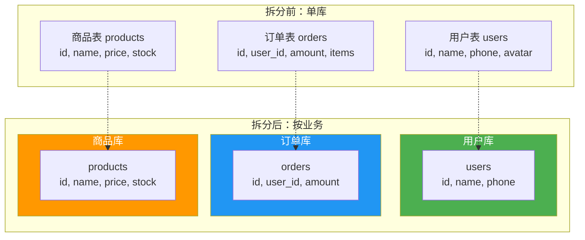
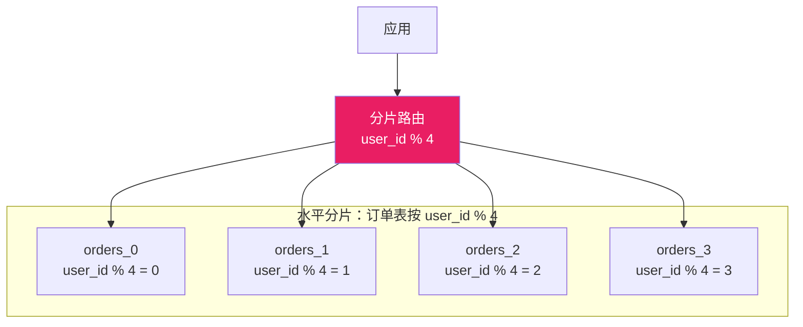
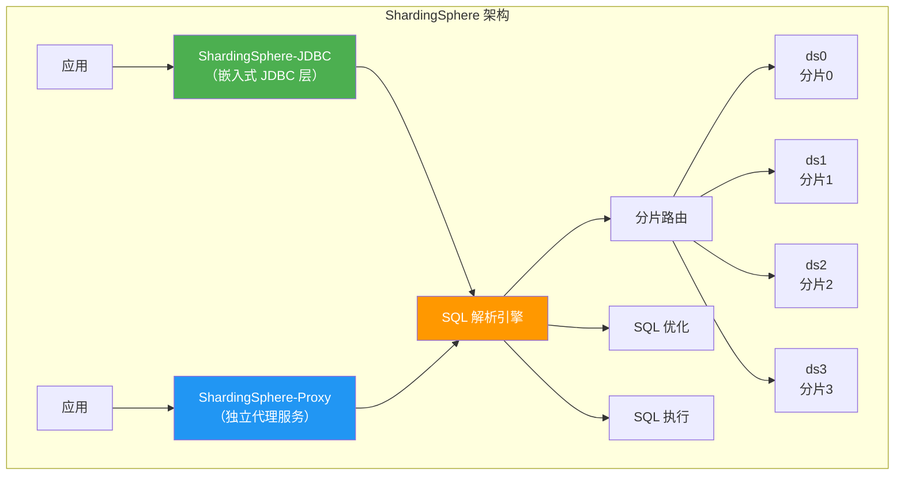
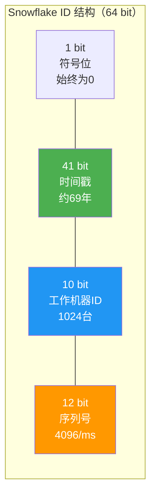
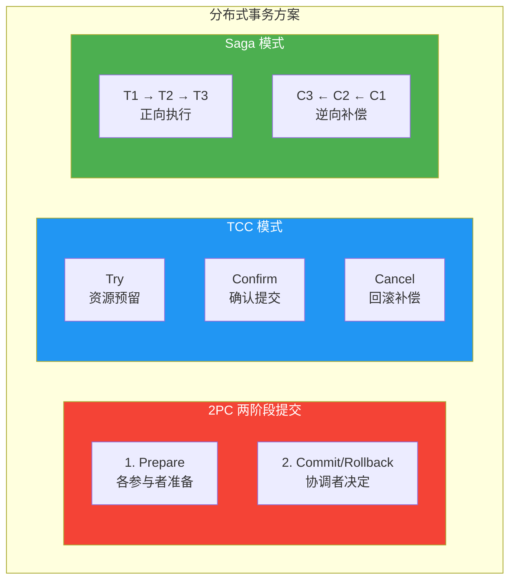
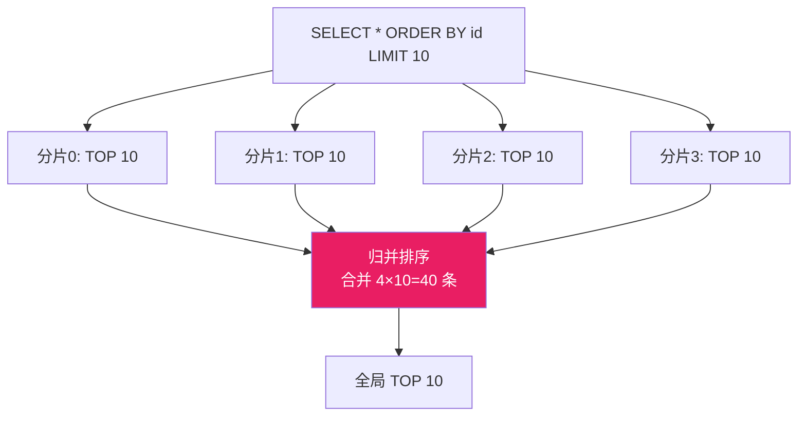
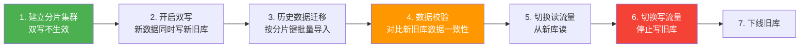

# 分库分表

当单表数据量超过千万级，查询性能急剧下降，单机存储和写入能力也到达瓶颈。分库分表是解决大数据量问题的终极手段，但也带来了分布式事务、跨库 JOIN、全局排序等新挑战。

> 参考资料：[小林coding - MySQL 分库分表](https://xiaolincoding.com/mysql/base/innodb.html) | [ShardingSphere 官方文档](https://shardingsphere.apache.org/document/current/cn/overview/)

## 1. 何时需要分库分表

| 信号 | 阈值 | 说明 |
|------|------|------|
| 单表行数 | > 5000 万行 | B+ 树层级增加，索引效率下降 |
| 数据文件 | > 50GB | 备份恢复时间长，OPTIMIZE 困难 |
| 慢查询多 | 优化后仍 > 500ms | 索引已无法解决 |
| 写入瓶颈 | QPS > 5000 | 单机写入上限 |
| 磁盘空间 | > 80% | 无法水平扩展 |

::: warning 先优化，再分片
分库分表是最后的手段，在此之前应该：
1. 优化 SQL 和索引
2. 引入缓存（Redis）
3. 读写分离
4. 归档冷数据
只有在以上手段都无法满足时才考虑分片。
:::

## 2. 垂直分片 vs 水平分片

### 2.1 垂直分片（按业务拆分）



### 2.2 水平分片（按键值拆分）



| 对比 | 垂直分片 | 水平分片 |
|------|---------|---------|
| 拆分依据 | 业务模块 | 分片键（如 user_id） |
| 数据分布 | 不同表到不同库 | 相同表到不同库 |
| 跨库 JOIN | 需要 | 需要 |
| 扩展性 | 有限 | 理论无限 |
| 复杂度 | 较低 | 较高 |

## 3. 分片键选择

分片键（Sharding Key）决定了数据如何分布，选择原则：

| 原则 | 说明 |
|------|------|
| 高频查询字段 | 用 WHERE 中最常出现的字段 |
| 数据均匀 | 避免热点（如按日期分片，最新数据集中） |
| 避免跨片 | 尽量让一次查询落在一个分片上 |
| 不可变 | 分片键值不能 UPDATE |

```sql
-- 常见分片策略
-- 1. 取模分片（最常用）
-- user_id % 4 → 分片 0,1,2,3

-- 2. 范围分片
-- id 1~1000000 → 分片0
-- id 1000001~2000000 → 分片1

-- 3. 一致性哈希
-- hash(user_id) % 2^32 → 环上映射

-- 4. 枚举分片
-- region = 'beijing' → 分片0
-- region = 'shanghai' → 分片1
```

::: important 分片键是关键决策
分片键一旦确定就很难更改（需要全量数据迁移）。选择时要综合考虑查询模式、数据分布和扩展需求。对于订单系统，`user_id` 是最常见的分片键——同一用户的订单在同一分片，查询不跨库。
:::

## 4. ShardingSphere 架构

[Apache ShardingSphere](https://github.com/apache/shardingsphere) 是当前最流行的分库分表中间件：



### ShardingSphere-JDBC 配置示例

```yaml
# application-sharding.yml
spring:
  shardingsphere:
    datasource:
      names: ds0,ds1
      ds0:
        type: com.zaxxer.hikari.HikariDataSource
        jdbc-url: jdbc:mysql://192.168.1.100:3306/order_db0
        username: app
        password: App@123
      ds1:
        type: com.zaxxer.hikari.HikariDataSource
        jdbc-url: jdbc:mysql://192.168.1.101:3306/order_db1
        username: app
        password: App@123

    rules:
      sharding:
        tables:
          t_order:
            actual-data-nodes: ds$->{0..1}.t_order_$->{0..3}
            table-strategy:
              standard:
                sharding-column: user_id
                sharding-algorithm-name: order-table-mod
            database-strategy:
              standard:
                sharding-column: user_id
                sharding-algorithm-name: order-db-mod
            key-generate-strategy:
              column: id
              key-generator-name: snowflake

        sharding-algorithms:
          order-table-mod:
            type: MOD
            props:
              sharding-count: 4
          order-db-mod:
            type: MOD
            props:
              sharding-count: 2

        key-generators:
          snowflake:
            type: SNOWFLAKE
            props:
              worker-id: 1
```

## 5. 分布式 ID 方案

分库分表后，自增主键无法保证全局唯一，需要分布式 ID 方案：

### 5.1 方案对比

| 方案 | 唯一性 | 趋势递增 | 性能 | 依赖 | 说明 |
|------|--------|---------|------|------|------|
| UUID | 全局唯一 | 否 | 高 | 无 | 无序，索引效率差 |
| Snowflake | 全局唯一 | 是 | 高 | 时钟 | 最常用方案 |
| Leaf（美团） | 全局唯一 | 是 | 高 | ZK/DB | 号段模式+Snowflake |
| 数据库号段 | 全局唯一 | 是 | 中 | DB | 简单可靠 |
| Redis INCR | 全局唯一 | 是 | 高 | Redis | 依赖 Redis 可用性 |

### 5.2 Snowflake 算法



```java
// Snowflake 简化实现
public class SnowflakeIdGenerator {
    private final long epoch = 1609459200000L; // 2021-01-01
    private final long workerIdBits = 10L;
    private final long sequenceBits = 12L;

    private final long maxWorkerId = ~(-1L << workerIdBits);      // 1023
    private final long sequenceMask = ~(-1L << sequenceBits);      // 4095

    private final long workerIdShift = sequenceBits;
    private final long timestampShift = sequenceBits + workerIdBits;

    private long workerId;
    private long sequence = 0L;
    private long lastTimestamp = -1L;

    public synchronized long nextId() {
        long timestamp = System.currentTimeMillis() - epoch;

        if (timestamp == lastTimestamp) {
            sequence = (sequence + 1) & sequenceMask;
            if (sequence == 0) {
                timestamp = waitNextMillis(lastTimestamp);
            }
        } else {
            sequence = 0L;
        }

        lastTimestamp = timestamp;
        return (timestamp << timestampShift)
             | (workerId << workerIdShift)
             | sequence;
    }

    private long waitNextMillis(long lastTimestamp) {
        long timestamp = System.currentTimeMillis() - epoch;
        while (timestamp <= lastTimestamp) {
            timestamp = System.currentTimeMillis() - epoch;
        }
        return timestamp;
    }
}
```

::: warning Snowflake 时钟回拨问题
如果服务器 NTP 同步导致时钟回拨，可能生成重复 ID。解决方案：
- 回拨小（< 5ms）：等待追平
- 回拨大：报错或使用历史最大时间戳
- 美团 Leaf 的 Leaf-snowflake 模式通过 ZK 分配 workerId 并检测时钟回拨
:::

## 6. 跨分片 JOIN

分库分表后，跨库 JOIN 无法直接执行，常见解决方案：

| 方案 | 说明 | 适用场景 |
|------|------|---------|
| 冗余字段 | 将 JOIN 需要的字段冗余到本表 | 宽表查询 |
| 全局表 | 小表广播到所有分片 | 字典表、配置表 |
| ER 分片 | 关联表按相同分片键分布 | 订单+订单详情 |
| 应用层组装 | 分别查询后在内存中 JOIN | 灵活但代码复杂 |
| 中间件支持 | ShardingSphere 的绑定表 | 推荐 |

```yaml
# ShardingSphere 绑定表配置
rules:
  sharding:
    binding-tables:
      - t_order, t_order_item  # 相同分片键，避免笛卡尔积
    tables:
      t_order:
        actual-data-nodes: ds$->{0..1}.t_order_$->{0..3}
        table-strategy:
          standard:
            sharding-column: user_id
            sharding-algorithm-name: order-mod
      t_order_item:
        actual-data-nodes: ds$->{0..1}.t_order_item_$->{0..3}
        table-strategy:
          standard:
            sharding-column: user_id  # 与 t_order 相同分片键
            sharding-algorithm-name: order-mod
```

## 7. 分布式事务

### 7.1 三种方案对比



| 方案 | 一致性 | 性能 | 实现复杂度 | 适用场景 |
|------|--------|------|-----------|---------|
| 2PC | 强一致 | 低（同步阻塞） | 低 | XA 事务，短事务 |
| TCC | 最终一致 | 高 | 高（需写3个方法） | 资金类业务 |
| Saga | 最终一致 | 高 | 中 | 长事务，可补偿业务 |

### 7.2 ShardingSphere 分布式事务配置

```yaml
# ShardingSphere XA 事务配置
spring:
  shardingsphere:
    props:
      transaction:
        type: XA  # 或 BASE（Saga）

# 代码中使用
# @Transactional 注解即可，ShardingSphere 自动管理分布式事务
```

::: important 分布式事务的取舍
- 分布式事务有性能损耗，不要滥用
- 优先通过业务设计避免分布式事务（如冗余字段、本地消息表）
- 非资金类业务优先用最终一致性（Saga/消息队列）
:::

## 8. 全局排序与分页

分库分表后 `ORDER BY ... LIMIT` 无法直接使用——每个分片只能返回局部排序结果：

```sql
-- 错误：每个分片各取10条，合并后不保证全局有序
SELECT * FROM t_order ORDER BY created_at DESC LIMIT 10;

-- ShardingSphere 自动处理流程：
-- 1. 向所有分片发送 ORDER BY created_at DESC LIMIT 10
-- 2. 合并各分片结果
-- 3. 全局排序取前10条
```



::: warning 深分页问题
`LIMIT 1000000, 10` 需要从每个分片取 1000010 条记录，内存和网络开销巨大。解决方案：
- 游标分页（基于上一页最后一条的 ID）
- ElasticSearch 做搜索和排序，MySQL 存明细
- 禁止深分页查询
:::

## 9. 数据迁移到分片集群



```sql
-- 历史数据迁移脚本示例
-- 按分片键分批导出
SELECT * FROM old_db.orders
WHERE user_id % 4 = 0
AND id > ?  -- 游标分页
ORDER BY id
LIMIT 1000;

-- 导入到对应分片
INSERT INTO ds0.t_order_0 SELECT ...;
```

## 10. 使用 dbeaver 管理分片集群

在 [dbeaver](https://github.com/dbeaver/dbeaver) 中可以方便地管理分片集群：

1. **多连接管理**：为每个分片建立独立连接
2. **ER 图**：可视化分片表的关联关系
3. **数据导出**：使用 dbeaver 的 Export 功能导出各分片数据
4. **SQL 编辑器**：执行校验 SQL，对比各分片数据量

```sql
-- 在 dbeaver 中快速检查各分片数据分布
-- 需要连接到各分片分别执行
SELECT
    '分片0' AS shard,
    COUNT(*) AS cnt,
    MIN(user_id) AS min_uid,
    MAX(user_id) AS max_uid
FROM t_order_0
UNION ALL
SELECT '分片1', COUNT(*), MIN(user_id), MAX(user_id) FROM t_order_1
UNION ALL
SELECT '分片2', COUNT(*), MIN(user_id), MAX(user_id) FROM t_order_2
UNION ALL
SELECT '分片3', COUNT(*), MIN(user_id), MAX(user_id) FROM t_order_3;
```

## 11. 面试技巧

::: tip 面试高频问题
1. **什么时候需要分库分表？**
   - 单表 > 5000 万行、慢查询优化无效、写入 QPS 到顶
   - 先优化 SQL/索引/缓存/读写分离，分库分表是最后手段

2. **分片键怎么选？**
   - 高频查询字段、数据分布均匀、避免跨片查询
   - 选定后很难更改，需慎重评估

3. **Snowflake ID 有什么问题？**
   - 时钟回拨可能导致 ID 重复
   - workerId 需要分配管理
   - 解决：Leaf 方案、ZK 协调

4. **跨库 JOIN 怎么解决？**
   - 冗余字段、全局表、ER 分片（绑定表）、应用层组装
   - ShardingSphere 绑定表是最优雅的方案

5. **分库分表后如何做分布式事务？**
   - 2PC：强一致但性能差
   - TCC：高性能但实现复杂
   - Saga：最终一致，适合长事务
   - 优先通过业务设计避免分布式事务
:::

---

> 本文参考了 [小林coding](https://xiaolincoding.com/mysql/base/innodb.html) 和 [Apache ShardingSphere](https://github.com/apache/shardingsphere) 官方文档。推荐使用 [dbeaver](https://github.com/dbeaver/dbeaver) 管理分片集群。
