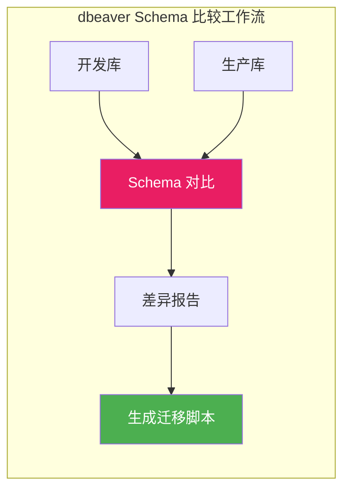
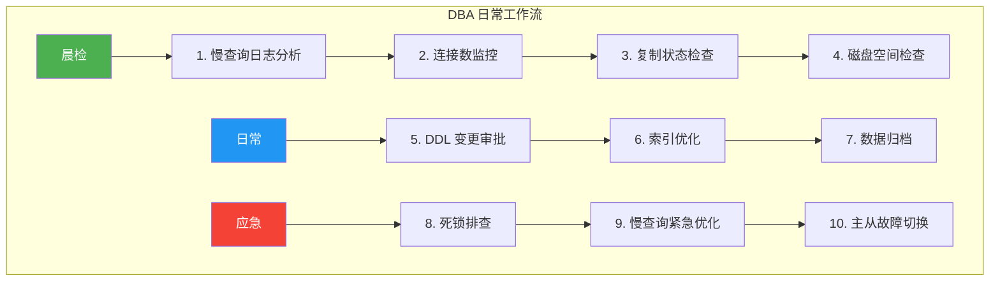

# dbeaver 数据库管理实战

工欲善其事，必先利其器。[dbeaver](https://github.com/dbeaver/dbeaver) 是最流行的开源数据库管理工具，支持 MySQL、PostgreSQL、Oracle 等数十种数据库。本文以 MySQL 场景为主，展示 dbeaver 在 DBA 日常工作中的实战用法。

> 参考资料：[dbeaver GitHub](https://github.com/dbeaver/dbeaver) | [dbeaver 官方文档](https://dbeaver.io/docs/)

## 1. 安装与连接配置

### 1.1 安装方式

```bash
# Windows: 下载安装包
# https://dbeaver.io/download/

# macOS: Homebrew
brew install --cask dbeaver-community

# Linux: Snap
sudo snap install dbeaver-ce

# 或下载 deb/rpm 包
# https://dbeaver.io/download/
```

### 1.2 创建 MySQL 连接

1. 启动 dbeaver → 点击 **新建连接** → 选择 **MySQL**
2. 填写连接信息：

| 字段 | 示例 | 说明 |
|------|------|------|
| Host | 192.168.1.100 | 主库地址 |
| Port | 3306 | 默认端口 |
| Database | your_db | 数据库名 |
| Username | dba_user | 用户名 |
| Password | ****** | 密码 |

3. **SSL 选项卡**：生产环境建议启用 SSL
4. **驱动属性**：设置编码和超时

```properties
# 驱动属性推荐配置
characterEncoding=utf8mb4
useSSL=true
connectTimeout=10000
socketTimeout=30000
autoReconnect=true
```

::: tip 连接池配置
dbeaver 内置连接池，可在 **连接设置 → 连接初始化** 中配置：
- **最大连接数**：建议 5~10
- **Keep-Alive**：勾选，避免连接超时断开
- **Auto-Commit**：按需设置，DBA 操作建议关闭
:::

## 2. SQL 编辑器

dbeaver 的 SQL 编辑器是日常使用最频繁的功能：

### 2.1 自动补全

| 快捷键 | 功能 |
|--------|------|
| `Ctrl + Space` | 代码补全 |
| `Ctrl + Space` (再按) | 切换补全类型 |
| `Alt + /` | 词语补全 |

补全范围：
- 表名、列名
- SQL 关键字
- 函数名
- 数据库名

### 2.2 SQL 格式化

```sql
-- 格式化前
SELECT id,name,age FROM users WHERE age>18 AND status='active' ORDER BY created_at DESC LIMIT 10;

-- 格式化后（Ctrl+Shift+F）
SELECT
    id,
    name,
    age
FROM users
WHERE age > 18
    AND status = 'active'
ORDER BY created_at DESC
LIMIT 10;
```

### 2.3 执行模式

| 模式 | 快捷键 | 说明 |
|------|--------|------|
| 执行 | `Ctrl + Enter` | 执行当前语句 |
| 执行脚本 | `Alt + X` | 执行全部语句 |
| 执行到光标 | `Ctrl + Shift + Enter` | 执行到光标位置 |
| Explain Plan | `Ctrl + Shift + E` | 查看执行计划 |

::: important 安全执行习惯
- 生产环境执行 UPDATE/DELETE 前，先 `SELECT` 确认范围
- 开启事务模式：**窗口 → 首选项 → 数据库 → SQL 编辑器 → 事务模式**
- 大批量操作前先 `EXPLAIN` 检查
:::

## 3. ER 图生成

ER 图是理解数据库结构的利器：

### 3.1 生成方式

1. 选中数据库或表 → 右键 → **View Diagram**
2. 或选中多张表 → 右键 → **Generate ER Diagram**

### 3.2 ER 图功能

| 功能 | 说明 |
|------|------|
| 表关系线 | 自动识别外键关系 |
| 布局调整 | 右键 → Layout → 自动排列 |
| 导出 | 导出为 PNG/SVG/PDF |
| 表过滤 | 可选择只显示特定表 |


## 4. 数据导入导出

### 4.1 导出数据

1. 右键表 → **Export Data**
2. 支持格式：CSV、SQL INSERT、JSON、XML、Excel

```sql
-- 导出为 SQL INSERT
-- 右键表 → Export Data → SQL → 配置：
-- Include CREATE TABLE: 按需
-- Include INSERT: 是
-- Row Limit: 按需
-- Encoding: UTF-8
```

### 4.2 导入数据

1. 右键表 → **Import Data**
2. 支持：CSV、Excel、SQL Script、JSON

::: warning 大数据量导入
- 导入百万行以上数据时，dbeaver 可能卡顿
- 推荐使用命令行工具：`mysql -u root -p db < data.sql`
- 或使用 `LOAD DATA INFILE`（速度是 INSERT 的 20 倍）
:::

```sql
-- 高速导入（命令行）
LOAD DATA INFILE '/tmp/orders.csv'
INTO TABLE orders
FIELDS TERMINATED BY ','
ENCLOSED BY '"'
LINES TERMINATED BY '\n'
IGNORE 1 ROWS;
```

## 5. 会话管理

dbeaver 可以查看和管理 MySQL 的客户端会话：

```sql
-- 查看当前所有连接
SHOW PROCESSLIST;

-- 查看完整信息
SHOW FULL PROCESSLIST;

-- 杀死有问题的连接
KILL 12345;  -- 连接 ID
```

在 dbeaver 中：
1. 展开数据库连接 → **System Objects** → **Processes**
2. 可以查看每个连接的 SQL、执行时间、状态
3. 右键 → **Kill Process** 终止问题连接

::: important 生产操作注意
- KILL 连接前确认不是关键业务
- 优先使用 `KILL QUERY <id>`（只终止语句，不断开连接）
- 记录操作日志以备审计
:::

## 6. 表结构查看与管理

### 6.1 查看表结构

1. 展开数据库 → **Tables** → 双击表名
2. **Data** 选项卡：查看数据
3. **Properties** 选项卡：查看表属性
4. **ER Diagram** 选项卡：查看关系图

### 6.2 管理索引

1. 右键表 → **Edit Table** → **Indexes** 选项卡
2. 可以添加、删除、修改索引
3. 查看索引的列、类型、唯一性

```sql
-- 在 dbeaver 中快速查看表的所有索引
SHOW INDEX FROM your_table;

-- 查看索引基数（cardinality 越高，索引选择性越好）
SELECT
    INDEX_NAME,
    COLUMN_NAME,
    SEQ_IN_INDEX,
    CARDINALITY,
    NULLABLE
FROM information_schema.STATISTICS
WHERE TABLE_SCHEMA = 'your_db'
    AND TABLE_NAME = 'your_table'
ORDER BY INDEX_NAME, SEQ_IN_INDEX;
```

### 6.3 查看执行计划

在 dbeaver 中有三种方式查看执行计划：

```sql
-- 方式1: EXPLAIN
EXPLAIN SELECT * FROM orders WHERE status = 'PAID';

-- 方式2: EXPLAIN ANALYZE（8.0+，显示实际执行时间和行数）
EXPLAIN ANALYZE SELECT * FROM orders WHERE status = 'PAID';

-- 方式3: dbeaver 可视化执行计划
-- SQL 编辑器中点击工具栏的 "Explain Plan" 按钮
-- 以树形结构展示，更直观
```

## 7. Schema 比较

dbeaver 可以对比两个数据库的 Schema 差异：

1. 选中两个数据库 → 右键 → **Compare**
2. 对比结果包括：
   - 新增/删除的表
   - 列差异
   - 索引差异
   - 外键差异



::: tip Schema 比较的应用场景
- 发布前对比开发库和生产库的差异
- 主从库 Schema 一致性校验
- 版本升级前后的 Schema 变更确认
:::

## 8. DBA 日常工作流



### 8.1 晨检 SQL 脚本

```sql
-- 在 dbeaver 中保存为晨检脚本，每天执行

-- 1. 昨日慢查询 Top 5
SELECT
    DIGEST_TEXT AS 'SQL',
    COUNT_STAR AS '执行次数',
    ROUND(SUM_TIMER_WAIT / 1000000000, 2) AS '总耗时(秒)',
    ROUND(AVG_TIMER_WAIT / 1000000000, 3) AS '平均耗时(秒)'
FROM performance_schema.events_statements_summary_by_digest
WHERE LAST_SEEN >= DATE_SUB(NOW(), INTERVAL 1 DAY)
ORDER BY SUM_TIMER_WAIT DESC
LIMIT 5;

-- 2. 当前连接数
SELECT COUNT(*) AS '当前连接' FROM information_schema.PROCESSLIST;

-- 3. 从库状态
SHOW SLAVE STATUS\G

-- 4. 磁盘空间
SELECT
    TABLE_SCHEMA AS '数据库',
    ROUND(SUM(DATA_LENGTH + INDEX_LENGTH) / 1024 / 1024 / 1024, 2) AS '大小(GB)'
FROM information_schema.TABLES
GROUP BY TABLE_SCHEMA
ORDER BY SUM(DATA_LENGTH + INDEX_LENGTH) DESC;
```

### 8.2 分析慢查询工作流

1. 在 dbeaver 中打开 `sys.statements_with_runtimes_in_95th_percentile`
2. 找到最慢的 SQL
3. 在 SQL 编辑器中执行 `EXPLAIN ANALYZE`
4. 根据执行计划添加索引
5. 再次 `EXPLAIN` 验证优化效果

## 9. dbeaver 快捷键速查

| 快捷键 | 功能 |
|--------|------|
| `Ctrl + \` | 新建SQL编辑器 |
| `Ctrl + Enter` | 执行当前语句 |
| `Ctrl + Shift + E` | 查看执行计划 |
| `Ctrl + Shift + F` | 格式化SQL |
| `Ctrl + Space` | 代码补全 |
| `Ctrl + /` | 注释/取消注释 |
| `Ctrl + D` | 删除当前行 |
| `Ctrl + F` | 查找替换 |
| `F5` | 刷新对象树 |
| `Ctrl + Shift + X` | 执行脚本 |
| `Alt + ←/→` | 切换SQL编辑器 |

## 10. 面试技巧

::: tip 面试高频问题
1. **你平时用什么工具管理 MySQL？**
   - dbeaver：日常管理、SQL 编辑、ER 图、数据导出
   - 命令行：脚本化操作、批量执行
   - Percona Toolkit：慢查询分析、在线 DDL

2. **dbeaver 的执行计划怎么看？**
   - 点击 Explain Plan 按钮，以树形结构展示
   - 关注 type 列（ALL/index/range/ref/eq_ref/const）
   - 关注 Extra 列（Using filesort/Using temporary/Using index）

3. **生产环境用 dbeaver 需要注意什么？**
   - 使用只读账号查询，避免误操作
   - UPDATE/DELETE 前先 SELECT 确认范围
   - 开启事务模式，执行前先确认
   - 不在高峰期执行大查询
:::

---

> 推荐使用 [dbeaver](https://github.com/dbeaver/dbeaver) 作为 MySQL 日常管理工具，开源免费，功能强大。更多技巧参考 [dbeaver 官方文档](https://dbeaver.io/docs/)。
