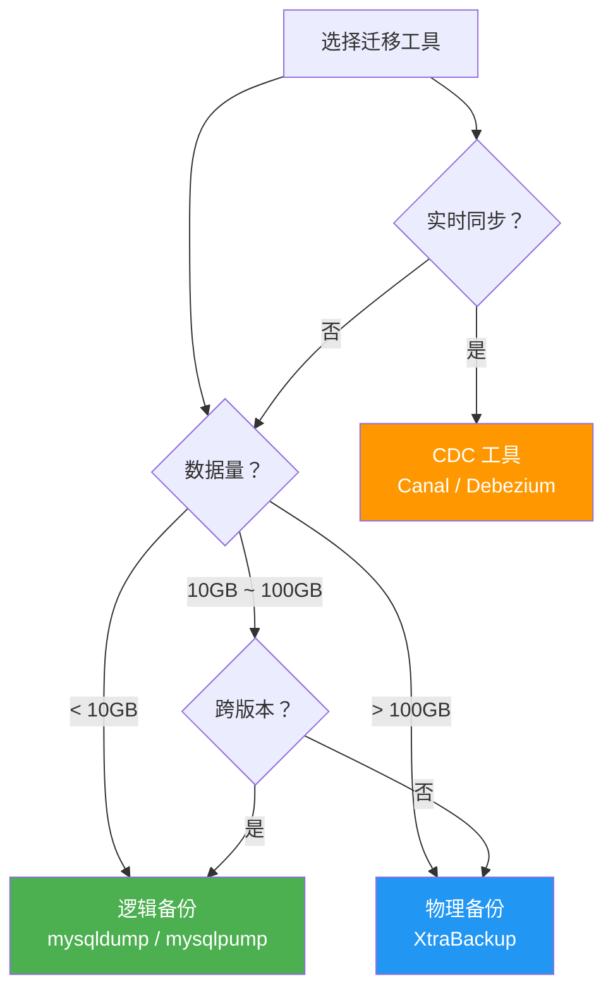
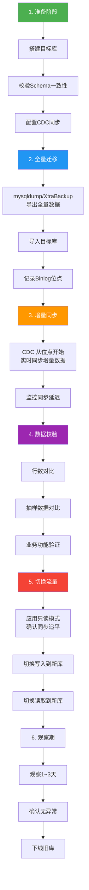

# MySQL 数据迁移实战

数据迁移是 DBA 的高危操作——数据是核心资产，迁移出错可能导致数据丢失、业务中断。本文系统梳理 MySQL 数据迁移的工具选择、跨版本升级要点、CDC 实时同步方案和零停机迁移策略。

> 参考资料：[小林coding - MySQL](https://xiaolincoding.com/mysql/) | [MySQL 官方文档 - Data Migration](https://dev.mysql.com/doc/refman/8.0/en/mysqldump.html)

## 1. 迁移工具对比

| 工具 | 类型 | 锁表 | 速度 | 适用场景 |
|------|------|------|------|---------|
| mysqldump | 逻辑备份 | 可控（--single-transaction） | 慢 | 小库、跨版本 |
| mysqlpump | 逻辑备份 | 可控 | 较快（并行） | 中等库 |
| Percona XtraBackup | 物理备份 | 不锁表 | 快 | 大库、同版本 |
| mydumper | 逻辑备份 | 可控 | 快（并行） | 中大库 |
| pt-archiver | 增量归档 | 行级锁 | 慢 | 数据归档 |
| Canal/Debezium | CDC | 无 | 实时 | 实时同步 |



## 2. mysqldump 详解

mysqldump 是最经典的逻辑备份工具，几乎适用于所有迁移场景。

### 2.1 基本用法

```bash
# 全库导出
mysqldump -u root -p --all-databases > all_db.sql

# 单库导出
mysqldump -u root -p your_db > your_db.sql

# 单表导出
mysqldump -u root -p your_db orders > orders.sql

# 仅表结构
mysqldump -u root -p --no-data your_db > schema.sql

# 仅数据
mysqldump -u root -p --no-create-info your_db > data.sql
```

### 2.2 生产推荐参数

```bash
# 生产环境推荐命令
mysqldump -u root -p \
  --single-transaction \    # InnoDB一致性快照，不锁表
  --routines \              # 导出存储过程和函数
  --triggers \              # 导出触发器
  --events \                # 导出事件
  --set-gtid-purged=OFF \   # 不设置GTID（按需）
  --max-allowed-packet=1G \ # 大数据包支持
  --net-buffer-length=32768 \ # 网络缓冲区
  --quick \                 # 逐行导出，不缓存全表
  your_db > your_db.sql
```

::: important --single-transaction 的原理
- 使用 `START TRANSACTION WITH CONSISTENT SNAPSHOT` 获取一致性视图
- 只对 InnoDB 表有效，MyISAM 表仍会锁表
- 导出期间不能执行 DDL（ALTER/DROP TABLE），否则一致性被破坏
:::

### 2.3 导入数据

```bash
# 基本导入
mysql -u root -p your_db < your_db.sql

# 加速导入
mysql -u root -p \
  --max-allowed-packet=1G \
  --net-buffer-length=32768 \
  your_db < your_db.sql

# 导入时关闭外键检查（加速）
SET FOREIGN_KEY_CHECKS = 0;
SET UNIQUE_CHECKS = 0;
SET AUTOCOMMIT = 0;
SOURCE your_db.sql;
COMMIT;
SET FOREIGN_KEY_CHECKS = 1;
SET UNIQUE_CHECKS = 1;
```

## 3. Percona XtraBackup

XtraBackup 是大库迁移的首选——物理备份、不锁表、速度快。

### 3.1 全量备份与恢复

```bash
# 全量备份
xtrabackup --backup \
  --target-dir=/backup/full \
  --user=root --password=xxx

# 准备备份（应用redo log，使备份一致）
xtrabackup --prepare \
  --target-dir=/backup/full

# 恢复（必须先停止MySQL）
systemctl stop mysql
xtrabackup --copy-back \
  --target-dir=/backup/full
chown -R mysql:mysql /var/lib/mysql
systemctl start mysql
```

### 3.2 增量备份

```bash
# 增量备份（基于上次全量）
xtrabackup --backup \
  --target-dir=/backup/inc1 \
  --incremental-basedir=/backup/full \
  --user=root --password=xxx

# 恢复增量
xtrabackup --prepare --apply-log-only \
  --target-dir=/backup/full
xtrabackup --prepare \
  --target-dir=/backup/full \
  --incremental-dir=/backup/inc1
xtrabackup --copy-back \
  --target-dir=/backup/full
```

::: warning XtraBackup 版本匹配
- XtraBackup 版本必须与 MySQL 版本匹配
- MySQL 8.0 用 xtrabackup 8.0.x
- MySQL 5.7 用 xtrabackup 2.4.x
- 版本不匹配可能导致备份失败或恢复后数据损坏
:::

## 4. 跨版本迁移（5.7 → 8.0）

### 4.1 不兼容变更清单

| 变更 | 5.7 | 8.0 | 影响 |
|------|-----|-----|------|
| 默认字符集 | latin1 | utf8mb4 | 排序规则变化 |
| 默认认证插件 | mysql_native_password | caching_sha2_password | 客户端连接失败 |
| 保留字 | - | `RANK`, `ROW_NUMBER`, `SYSTEM` | SQL 报错 |
| GROUP BY | 非标准行为 | 标准SQL | 查询结果不同 |
| 外键约束 | 有限检查 | 严格检查 | 导入失败 |
| 索引长度 | 前缀索引可超767 | 默认 innodb_large_prefix=ON | 索引超限 |
| 临时表 | 内部临时表用 MEMORY | 用 TempTable | 性能差异 |

### 4.2 迁移检查

```sql
-- MySQL Shell 升级检查工具（8.0 推荐）
-- 安装 MySQL Shell 后执行
mysqlsh --user root --password --execute "
  util.checkForServerUpgrade('root@localhost:3306', {
    'password': 'xxx',
    'outputFormat': 'JSON'
  });
"
```

```sql
-- 手动检查保留字冲突
SELECT TABLE_NAME, COLUMN_NAME
FROM information_schema.COLUMNS
WHERE COLUMN_NAME IN (
    'RANK', 'ROW_NUMBER', 'DENSE_RANK', 'SYSTEM',
    'GROUPS', 'CUBE', 'LATERAL', 'RECURSIVE', 'WINDOW'
);

-- 检查字符集
SELECT TABLE_NAME, COLUMN_NAME, CHARACTER_SET_NAME, COLLATION_NAME
FROM information_schema.COLUMNS
WHERE CHARACTER_SET_NAME IS NOT NULL
    AND CHARACTER_SET_NAME NOT IN ('utf8mb4', 'binary')
    AND TABLE_SCHEMA = 'your_db';
```

### 4.3 字符集迁移

```sql
-- 将 latin1/utf8 表转为 utf8mb4
ALTER TABLE your_table
CONVERT TO CHARACTER SET utf8mb4 COLLATE utf8mb4_unicode_ci;

-- 全库转换（生成SQL）
SELECT CONCAT(
    'ALTER TABLE ', TABLE_SCHEMA, '.', TABLE_NAME,
    ' CONVERT TO CHARACTER SET utf8mb4 COLLATE utf8mb4_unicode_ci;'
) AS migration_sql
FROM information_schema.TABLES
WHERE TABLE_SCHEMA = 'your_db'
    AND TABLE_TYPE = 'BASE TABLE';
```

::: warning utf8 → utf8mb4 注意事项
- MySQL 的 `utf8` 是 3 字节编码，不是真正的 UTF-8
- `utf8mb4` 才是 4 字节完整 UTF-8，支持 emoji
- 转换后索引键长度可能超限（utf8mb4 下 VARCHAR(255) = 1020 字节 > 767 字节）
- 需要检查并调整前缀索引长度
:::

## 5. 跨数据库迁移（Oracle/PG → MySQL）

### 5.1 数据类型映射

| Oracle | PostgreSQL | MySQL | 说明 |
|--------|-----------|-------|------|
| NUMBER(p,s) | NUMERIC(p,s) | DECIMAL(p,s) | 精确数值 |
| NUMBER | BIGINT | BIGINT | 大整数 |
| VARCHAR2(n) | VARCHAR(n) | VARCHAR(n) | 变长字符串 |
| CLOB | TEXT | LONGTEXT | 大文本 |
| BLOB | BYTEA | LONGBLOB | 二进制大对象 |
| DATE | TIMESTAMP | DATETIME | 日期时间 |
| TIMESTAMP | TIMESTAMP | DATETIME(6) | 精确时间戳 |
| BOOLEAN | BOOLEAN | TINYINT(1) | 布尔 |
| SERIAL | SERIAL | INT AUTO_INCREMENT | 自增 |
| RAW | BYTEA | VARBINARY | 二进制 |

### 5.2 SQL 方言差异

```sql
-- Oracle → MySQL SQL 适配

-- 1. 字符串拼接
-- Oracle: 'a' || 'b'
-- MySQL: CONCAT('a', 'b')

-- 2. 分页
-- Oracle: ROWNUM <= 10
-- MySQL: LIMIT 10

-- 3. 空值处理
-- Oracle: NVL(col, 0)
-- MySQL: IFNULL(col, 0) 或 COALESCE(col, 0)

-- 4. 日期函数
-- Oracle: SYSDATE
-- MySQL: NOW()

-- 5. 序列
-- Oracle: SEQUENCE.NEXTVAL
-- MySQL: AUTO_INCREMENT 或自定义序列表

-- 6. 递归查询
-- Oracle: CONNECT BY
-- MySQL 8.0: WITH RECURSIVE CTE
```

::: tip 使用 dbeaver 辅助跨库迁移
[dbeaver](https://github.com/dbeaver/dbeaver) 支持跨数据库的 Schema 对比和数据迁移：
1. 同时连接源数据库和目标 MySQL
2. 右键源表 → **Export Data** → 选择目标 MySQL 连接
3. dbeaver 自动处理类型映射
:::

## 6. CDC 实时同步

CDC（Change Data Capture）通过解析 Binlog 实现实时数据同步，是零停机迁移的核心组件。

### 6.1 Canal 架构

```mermaid
graph TB
    subgraph Canal["Canal 实时同步架构"]
        MySQL["MySQL 主库<br/>Binlog ROW模式"]
        Canal["Canal Server<br/>模拟从库协议<br/>解析Binlog"]
        MQ["消息队列<br/>Kafka / RocketMQ"]
        Consumer["消费端<br/>写入目标库"]
        Target["目标 MySQL<br/>或数据仓库"]
    end

    MySQL -->|"Binlog"| Canal
    Canal -->|"JSON格式"| MQ
    MQ --> Consumer
    Consumer --> Target

    style Canal fill:#FF9800,color:#fff
    style MQ fill:#2196F3,color:#fff
```

### 6.2 Canal 配置

```properties
# canal.properties
canal.serverMode = kafka
canal.destinations = example
canal.mq.servers = kafka:9092
canal.mq.topic = canal_topic

# instance.properties
canal.instance.master.address = 192.168.1.100:3306
canal.instance.dbUsername = canal
canal.instance.dbPassword = Canal@123
canal.instance.filter.regex = your_db\\..*
canal.instance.binlog.format = ROW
```

### 6.3 Debezium 配置

```json
// Debezium MySQL Connector 配置
{
  "name": "mysql-connector",
  "config": {
    "connector.class": "io.debezium.connector.mysql.MySqlConnector",
    "database.hostname": "192.168.1.100",
    "database.port": "3306",
    "database.user": "debezium",
    "database.password": "Debezium@123",
    "database.server.id": "184054",
    "database.server.name": "mysql_source",
    "database.include.list": "your_db",
    "database.history.kafka.bootstrap.servers": "kafka:9092",
    "database.history.kafka.topic": "schema-changes"
  }
}
```

## 7. 零停机迁移策略



### 7.1 关键步骤详解

**步骤2：全量迁移时记录位点**

```bash
# 使用 mysqldump 时自动记录位点
mysqldump -u root -p \
  --single-transaction \
  --master-data=2 \    # 记录 Binlog 位点为注释
  --flush-logs \       # 切换新 Binlog 文件
  your_db > full_backup.sql

# 查看记录的位点
head -30 full_backup.sql | grep "CHANGE MASTER"
-- CHANGE MASTER TO MASTER_LOG_FILE='mysql-bin.000123', MASTER_LOG_POS=4567;
```

**步骤5：切换流量**

```sql
-- 旧库设为只读，确保所有写入停止
SET GLOBAL read_only = ON;
SET GLOBAL super_read_only = ON;

-- 确认 CDC 同步追平
SHOW SLAVE STATUS FOR CHANNEL 'canal'\G
-- Seconds_Behind_Master = 0

-- 切换应用到新库
-- 修改应用配置或切换 VIP
```

## 8. 常见陷阱

### 8.1 字符集转换

```sql
-- 错误：直接导入可能导致乱码
mysql -u root -p your_db < dump.sql

-- 正确：指定字符集
mysql -u root -p --default-character-set=utf8mb4 your_db < dump.sql

-- 导出时也要指定
mysqldump -u root -p --default-character-set=utf8mb4 your_db > dump.sql
```

### 8.2 AUTO_INCREMENT 重置

```sql
-- 迁移后自增值可能重置
-- 检查当前自增值
SHOW TABLE STATUS LIKE 'your_table';
-- Auto_increment 列

-- 手动设置
ALTER TABLE your_table AUTO_INCREMENT = 100001;
```

### 8.3 外键导入顺序

```sql
-- 导入时外键检查可能导致失败（表A引用表B，但B还没导入）
-- 解决：先关闭外键检查
SET FOREIGN_KEY_CHECKS = 0;
SOURCE dump.sql;
SET FOREIGN_KEY_CHECKS = 1;

-- 或在 mysqldump 时自动处理（默认会加入 SET FOREIGN_KEY_CHECKS=0）
```

## 9. 数据校验

迁移完成后必须进行数据校验：

```sql
-- 1. 行数校验
SELECT COUNT(*) FROM source_db.orders;
SELECT COUNT(*) FROM target_db.orders;

-- 2. 校验和对比
SELECT
    BIT_XOR(CAST(CRC32(CONCAT_WS(',', id, order_no, amount)) AS UNSIGNED)) AS checksum
FROM orders;

-- 3. pt-table-checksum（推荐）
-- 在主库执行，自动对比主从数据
pt-table-checksum --host=192.168.1.100 --user=percona --password=xxx

-- 4. 抽样数据对比
SELECT * FROM orders WHERE id IN (1, 100, 1000, 10000, 100000)
ORDER BY id;
```

::: important 校验是必须步骤
- 迁移不校验等于没有迁移
- 至少做行数对比 + 抽样数据对比
- 关键业务表建议全量 checksum 校验
:::

## 10. 使用 dbeaver 辅助迁移

[dbeaver](https://github.com/dbeaver/dbeaver) 在迁移过程中可以辅助：

1. **Schema 对比**：对比源库和目标库的表结构差异
2. **数据导出导入**：小表用 dbeaver 的 Export/Import 功能
3. **SQL 执行**：在两个连接间执行校验 SQL
4. **ER 图**：验证目标库的表关系是否正确

```sql
-- 在 dbeaver 中快速校验两库的表数量
-- 源库
SELECT COUNT(*) AS '源库表数量' FROM information_schema.TABLES
WHERE TABLE_SCHEMA = 'source_db' AND TABLE_TYPE = 'BASE TABLE';

-- 目标库
SELECT COUNT(*) AS '目标库表数量' FROM information_schema.TABLES
WHERE TABLE_SCHEMA = 'target_db' AND TABLE_TYPE = 'BASE TABLE';
```

## 11. 面试技巧

::: tip 面试高频问题
1. **mysqldump 和 XtraBackup 的区别？**
   - mysqldump：逻辑备份，跨版本兼容，速度慢，适合小库
   - XtraBackup：物理备份，不锁表，速度快，需版本匹配

2. **MySQL 5.7 升级到 8.0 需要注意什么？**
   - 默认字符集变为 utf8mb4
   - 默认认证插件变为 caching_sha2_password
   - 新增保留字可能导致 SQL 报错
   - GROUP BY 行为变化
   - 使用 MySQL Shell 的升级检查工具

3. **如何实现零停机迁移？**
   - 全量导出 + 记录 Binlog 位点
   - CDC 实时同步增量数据
   - 数据校验确认一致性
   - 只读切换 + 追平 + 流量切换

4. **数据迁移后如何校验？**
   - 行数对比
   - 校验和对比（CRC32）
   - pt-table-checksum
   - 抽样数据对比
   - 业务功能验证

5. **Canal 的工作原理？**
   - 伪装成 MySQL 从库，接收 Binlog 事件
   - 解析 Binlog 为 JSON 格式
   - 发送到消息队列供消费端写入目标库
:::

---

> 本文参考了 [小林coding](https://xiaolincoding.com/mysql/) 和 [MySQL 8.0 官方文档](https://dev.mysql.com/doc/refman/8.0/en/mysqldump.html)。推荐使用 [dbeaver](https://github.com/dbeaver/dbeaver) 辅助数据迁移和校验。
