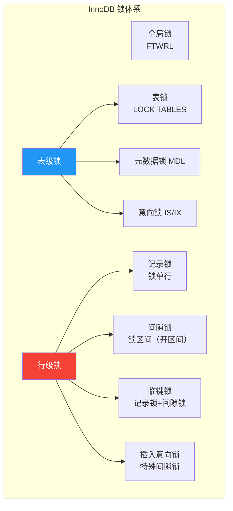

# MySQL 面试题精选

整理 30 道高频 MySQL 面试题，涵盖基础、索引、事务、锁、复制、优化六大主题。每题配简洁答案和关键图解，助你高效备战。

> 参考资料：[小林coding - MySQL](https://xiaolincoding.com/mysql/) | [MySQL 官方文档](https://dev.mysql.com/doc/refman/8.0/en/) | [dbeaver](https://github.com/dbeaver/dbeaver)

## 一、基础篇（5 题）

### Q1：MySQL 一条 SQL 的执行流程是什么？


**答案**：连接器 → 查询缓存（8.0 已移除）→ 解析器（词法/语法分析）→ 优化器（选择索引、决定 JOIN 顺序）→ 执行器（校验权限、调用引擎接口）→ 存储引擎（读写数据）。

**关键点**：优化器是"大脑"，决定走哪个索引、JOIN 顺序；执行器是"手脚"，负责实际调用引擎。

---

### Q2：InnoDB 和 MyISAM 的核心区别？

| 维度 | InnoDB | MyISAM |
|------|--------|--------|
| 事务 | 支持 ACID | 不支持 |
| 锁 | 行级锁 | 表级锁 |
| 崩溃安全 | Redo Log + Doublewrite | 需 REPAIR |
| MVCC | 支持 | 不支持 |
| 聚簇索引 | 主键即数据 | 索引存行指针 |
| 外键 | 支持 | 不支持 |

**答案**：核心区别在于 InnoDB 支持事务、行级锁、MVCC、崩溃安全，是 OLTP 场景的唯一选择。MyISAM 仅适合只读或读多写少场景。

---

### Q3：MySQL 的数据类型如何选择？

| 场景 | 推荐 | 避免 |
|------|------|------|
| 整数 | INT / BIGINT | 不用字符串存数字 |
| 金额 | DECIMAL(19,2) | 不用 FLOAT/DOUBLE |
| 短字符串 | VARCHAR | 不用 CHAR（除非定长） |
| 长文本 | TEXT | 不用 VARCHAR(10000) |
| 时间 | DATETIME / TIMESTAMP | 不用 VARCHAR 存时间 |
| 布尔 | TINYINT(1) | 不用 ENUM |

**答案**：金额用 DECIMAL，时间用 DATETIME/TIMESTAMP，短字符串用 VARCHAR，避免用字符串存数字和时间。TIMESTAMP 占 4 字节但范围小（2038 年），DATETIME 占 8 字节范围大。

---

### Q4：CHAR 和 VARCHAR 的区别？

**答案**：CHAR 是定长，不足补空格，最大 255 字符，适合 MD5、手机号等定长数据。VARCHAR 是变长，按实际长度存储，最大 65535 字节，适合名称、地址等变长数据。VARCHAR 需额外 1~2 字节记录长度。

---

### Q5：DATETIME 和 TIMESTAMP 的区别？

| 维度 | DATETIME | TIMESTAMP |
|------|----------|-----------|
| 存储 | 8 字节 | 4 字节 |
| 范围 | 1000~9999 年 | 1970~2038 年 |
| 时区 | 不受时区影响 | 存 UTC，读时转换 |
| 默认值 | 无 | CURRENT_TIMESTAMP |

**答案**：TIMESTAMP 存 UTC 时间戳，查询时自动转当前时区，4 字节但 2038 年溢出。DATETIME 不受时区影响，8 字节范围更大。业务时间用 DATETIME，记录时间用 TIMESTAMP。

---

## 二、索引篇（5 题）

### Q6：为什么 MySQL 用 B+ 树而不是 B 树？


**答案**：三个核心原因：
1. **IO 次数更少**：B+ 树非叶子节点只存键值不存数据，同样磁盘页能存更多键值，树更矮
2. **范围查询更快**：叶子节点用双向链表连接，范围查询只需找到起点后顺序扫描
3. **查询性能稳定**：B 树数据可能在非叶子节点，查询深度不确定；B+ 树数据都在叶子，查询路径长度一致

---

### Q7：什么是聚簇索引？和非聚簇索引的区别？

**答案**：聚簇索引的叶子节点存储完整的行数据，一张表只能有一个（通常是主键）。非聚簇索引（二级索引）的叶子节点存储主键值，查询非索引列需要回表。


**关键点**：回表是随机 IO，覆盖索引可以避免回表。

---

### Q8：什么是最左前缀原则？

**答案**：联合索引 (a, b, c) 相当于 (a)、(a, b)、(a, b, c) 三个索引。查询条件必须从最左列开始匹配，中间不能跳过。

```sql
-- 索引：INDEX idx_abc (a, b, c)

-- 能用索引
WHERE a = 1
WHERE a = 1 AND b = 2
WHERE a = 1 AND b = 2 AND c = 3

-- 不能用索引（跳过了 a）
WHERE b = 2
WHERE b = 2 AND c = 3

-- 部分用索引（只用 a 列）
WHERE a = 1 AND c = 3
```

**关键点**：遇到范围查询（>、<、BETWEEN）后，后面的列无法用索引。

---

### Q9：什么是覆盖索引？

**答案**：查询的列全部包含在索引中，无需回表获取数据。Explain 的 Extra 列显示 `Using index`。

```sql
-- 索引：INDEX idx_user_status (user_id, status)

-- 覆盖索引：查询列都在索引中
SELECT user_id, status FROM orders WHERE user_id = 100;
-- Extra: Using index

-- 非覆盖索引：amount 不在索引中，需要回表
SELECT user_id, status, amount FROM orders WHERE user_id = 100;
-- Extra: NULL
```

---

### Q10：什么是索引下推（ICP）？

**答案**：Index Condition Pushdown 是 MySQL 5.6+ 的优化，将部分 WHERE 条件下推到存储引擎层过滤，减少回表次数。

```sql
-- 索引：INDEX idx_name_age (name, age)
-- 查询：WHERE name LIKE '张%' AND age = 25

-- 无 ICP：存储引擎按 name LIKE '张%' 取出所有行，Server 层再过滤 age=25
-- 有 ICP：存储引擎直接按 name LIKE '张%' AND age=25 过滤，只返回匹配行
```

**关键点**：ICP 只适用于二级索引，减少回表次数。

---

## 三、事务篇（5 题）

### Q11：事务的 ACID 是什么？

| 特性 | 说明 | 实现方式 |
|------|------|---------|
| 原子性 A | 事务要么全部成功，要么全部回滚 | Undo Log |
| 一致性 C | 事务前后数据满足完整性约束 | A+I+D 共同保证 |
| 隔离性 I | 并发事务之间互不干扰 | 锁 + MVCC |
| 持久性 D | 提交后数据永久保存 | Redo Log |

**答案**：A 由 Undo Log 保证（回滚），I 由锁和 MVCC 保证（隔离），D 由 Redo Log 保证（恢复），C 是 A+I+D 的结果。一致性是目标，其余三个是手段。

---

### Q12：MySQL 的四种隔离级别？

| 隔离级别 | 脏读 | 不可重复读 | 幻读 | InnoDB 实现 |
|---------|------|-----------|------|-------------|
| READ UNCOMMITTED | 可能 | 可能 | 可能 | 无特殊处理 |
| READ COMMITTED | 不会 | 可能 | 可能 | MVCC（每次读新快照） |
| REPEATABLE READ | 不会 | 不会 | 可能* | MVCC（事务开始快照）+ 间隙锁 |
| SERIALIZABLE | 不会 | 不会 | 不会 | 锁定所有范围 |

*InnoDB 的 RR 级别通过间隙锁在很大程度上避免了幻读。

**答案**：InnoDB 默认 RR 级别，通过 MVCC 实现快照读避免不可重复读，通过间隙锁避免当前读的幻读。RC 级别每次 SELECT 生成新 Read View，RR 级别只在首次 SELECT 生成。

---

### Q13：什么是 MVCC？如何实现？

**答案**：MVCC（多版本并发控制）让读操作不阻塞写、写操作不阻塞读。核心实现：

1. **隐藏列**：每行记录 DB_TRX_ID（事务ID）和 DB_ROLL_PTR（回滚指针）
2. **Undo Log 版本链**：通过 ROLL_PTR 串联历史版本
3. **Read View**：记录当前活跃事务列表，判断哪个版本对当前事务可见


**可见性规则**：trx_id < min_id → 可见；trx_id > max_id → 不可见；min_id ≤ trx_id ≤ max_id 且不在活跃列表 → 可见。

---

### Q14：RC 和 RR 的 Read View 有什么区别？

**答案**：
- **RC**：每次 SELECT 都创建新的 Read View，能看到其他事务已提交的最新数据
- **RR**：只在事务首次 SELECT 时创建 Read View，整个事务期间复用同一快照

这就是 RC 会出现不可重复读（两次 SELECT 间其他事务提交了数据）而 RR 不会的原因。

---

### Q15：Redo Log 和 Undo Log 的区别？

| 维度 | Redo Log | Undo Log |
|------|----------|----------|
| 作用 | 崩溃恢复，保证持久性 | 事务回滚，保证原子性 |
| 记录内容 | 物理日志：页的修改 | 逻辑日志：反向 SQL |
| 写入时机 | 事务执行中 | 事务执行中 |
| 生命周期 | 循环写，会覆盖 | 事务提交后待 purge |

**答案**：Redo Log 记录"页 X 偏移 Y 改为值 Z"（物理日志），用于崩溃恢复重做。Undo Log 记录"INSERT → DELETE, UPDATE → 反向 UPDATE"（逻辑日志），用于事务回滚和 MVCC 版本链。

---

## 四、锁篇（5 题）

### Q16：InnoDB 有哪几种锁？



**答案**：
- 全局锁：`FLUSH TABLES WITH READ LOCK`，全库只读
- 表级锁：表锁、MDL（自动加）、意向锁（自动加）
- 行级锁：记录锁（锁行）、间隙锁（锁间隙防插入）、临键锁（记录+间隙，默认）、插入意向锁（并发插入优化）

---

### Q17：什么是间隙锁？为什么需要？

**答案**：间隙锁锁定索引记录之间的间隙，防止其他事务在该间隙插入新记录，从而避免幻读。

```sql
-- 表中有 id: 5, 10, 15
-- 事务A
SELECT * FROM t WHERE id > 5 AND id < 10 FOR UPDATE;
-- 加间隙锁：(5, 10)

-- 事务B
INSERT INTO t VALUES (7);  -- 阻塞！7在间隙(5,10)内
INSERT INTO t VALUES (3);  -- 成功，3不在间隙内
```

**关键点**：间隙锁之间不冲突，只和插入意向锁冲突。RR 级别自动开启，RC 级别关闭。

---

### Q18：什么时候会加行锁？什么时候加表锁？

**答案**：
- **行锁**：通过索引条件检索数据时加行锁
- **表锁**：不走索引时，InnoDB 无法定位行，退化为表锁

```sql
-- name 列无索引
UPDATE users SET age = 20 WHERE name = '张三';
-- 退化为表锁！所有行被锁住

-- name 列有索引
UPDATE users SET age = 20 WHERE name = '张三';
-- 只锁 name='张三' 的行
```

::: warning 不走索引的 UPDATE/DELETE 是灾难
- 全表扫描 + 表级锁 = 所有行被锁
- 生产环境必须确保 UPDATE/DELETE 的 WHERE 条件走索引
:::

---

### Q19：如何排查死锁？

**答案**：

```sql
-- 1. 查看最近一次死锁信息
SHOW ENGINE INNODB STATUS\G
-- 查找 "LATEST DETECTED DEADLOCK" 段

-- 2. 开启死锁日志
SET GLOBAL innodb_print_all_deadlocks = ON;

-- 3. 分析死锁日志
-- 关注：事务1持有锁A等待锁B，事务2持有锁B等待锁A
```

**死锁解决策略**：
1. 按固定顺序访问表和行
2. 保持事务简短，减少锁持有时间
3. 合理使用索引，避免锁升级
4. 设置 `innodb_lock_wait_timeout`，超时自动回滚

---

### Q20：乐观锁和悲观锁的区别？

| 维度 | 悲观锁 | 乐观锁 |
|------|--------|--------|
| 思想 | 假定冲突一定发生 | 假定冲突很少发生 |
| 实现 | SELECT ... FOR UPDATE | 版本号/CAS |
| 锁开销 | 有（加锁释放锁） | 无（提交时检查） |
| 适用 | 写多冲突多 | 读多冲突少 |

```sql
-- 悲观锁
SELECT * FROM orders WHERE id = 1 FOR UPDATE;
-- 其他事务等待

-- 乐观锁（版本号）
UPDATE orders SET amount = 100, version = version + 1
WHERE id = 1 AND version = 5;
-- 影响行数=0则冲突，需重试
```

---

## 五、复制篇（5 题）

### Q21：MySQL 主从复制的原理？

**答案**：三个线程协作：
1. **Binlog Dump Thread**（主库）：发送 Binlog 事件
2. **IO Thread**（从库）：接收 Binlog 写入 Relay Log
3. **SQL Thread**（从库）：读取 Relay Log 重放 SQL

```
主库 → Binlog → IO Thread → Relay Log → SQL Thread → 从库数据
```

---

### Q22：异步复制、半同步复制、全同步复制的区别？

| 模式 | 主库等待 | 数据安全 | 性能 |
|------|---------|---------|------|
| 异步 | 不等待 | 低 | 高 |
| 半同步 | 等至少1个从库确认 | 中 | 中 |
| 全同步 | 等所有从库确认 | 高 | 低 |

**答案**：MySQL 默认异步复制，主库写入 Binlog 即返回。半同步至少等一个从库确认收到 Binlog。全同步 MySQL 不原生支持，Group Replication 是 Paxos 协议的多数派确认。

---

### Q23：如何减少主从延迟？

**答案**：
1. 开启多线程复制（`slave_parallel_workers = 8`）
2. 使用 LOGICAL_CLOCK 或 writeset 并行模式
3. 拆分大事务
4. 从库硬件与主库对等
5. 从库只读，控制复杂查询

---

### Q24：什么是 GTID？有什么好处？

**答案**：GTID = server_uuid:transaction_id，全局唯一标识事务。

好处：
- 自动定位：无需手动指定 binlog 位点
- 故障恢复简单：自动跳过已执行事务
- 主从切换安全：GTID 集合保证数据一致性
- 便于验证：对比主从 `gtid_executed` 集合

---

### Q25：主从切换如何保证数据不丢失？

**答案**：
1. 使用半同步复制，至少一个从库确认
2. 主库配置 `sync_binlog = 1` + `innodb_flush_log_at_trx_commit = 1`（双1）
3. 切换前确认从库已追平（`Seconds_Behind_Master = 0`）
4. 使用 GTID 避免位点错误
5. 使用 MHA/Orchestrator 等工具自动化切换

---

## 六、优化篇（5 题）

### Q26：如何优化一条慢 SQL？

**答案**：系统化四步法：

1. **EXPLAIN 分析**：查看 type、key、rows、Extra
2. **添加索引**：复合索引、覆盖索引、前缀索引
3. **优化 SQL**：避免 SELECT *、子查询改 JOIN、大 IN 改 EXISTS
4. **参数调优**：Buffer Pool、IO Capacity、连接池

```sql
-- 优化前
SELECT * FROM orders WHERE DATE(created_at) = '2025-01-01';
-- type: ALL，函数导致索引失效

-- 优化后
SELECT id, order_no, amount FROM orders
WHERE created_at >= '2025-01-01' AND created_at < '2025-01-02';
-- type: range，使用了索引
```

---

### Q27：EXPLAIN 的 type 列有哪些值？含义？

| type | 含义 | 性能 |
|------|------|------|
| system | 单行系统表 | 最好 |
| const | 主键/唯一索引等值查询 | 极好 |
| eq_ref | JOIN 时主键/唯一索引 | 好 |
| ref | 非唯一索引等值查询 | 好 |
| range | 索引范围扫描 | 较好 |
| index | 全索引扫描 | 一般 |
| ALL | 全表扫描 | 最差 |

**答案**：至少要达到 range 级别，ref/eq_ref 是理想状态，ALL 必须优化。

---

### Q28：innodb_buffer_pool_size 如何设置？

**答案**：
- 专用 MySQL 服务器：物理内存的 **70%~80%**
- 共享服务器：物理内存的 **50%~60%**
- 留足内存给 OS、其他进程、Buffer Pool 的控制结构

监控命中率 > 99% 为健康。低于 95% 需增大。

---

### Q29：如何选择合适的索引？

**答案**：

| 原则 | 说明 |
|------|------|
| 选择性高 | 区分度大的列（如 user_id > status） |
| 覆盖查询 | 索引包含 SELECT 的列，避免回表 |
| 最左匹配 | 联合索引按等值→范围排序 |
| 长字符串 | 前缀索引 `INDEX(name(20))` |
| 排序分组 | ORDER BY / GROUP BY 列建索引 |

```sql
-- 联合索引设计示例
-- 查询：WHERE user_id = ? AND status = ? ORDER BY created_at
-- 索引：INDEX idx_user_status_created (user_id, status, created_at)
-- 等值条件放前面，排序字段放最后
```

---

### Q30：如何避免索引失效？

**答案**：常见 8 种索引失效场景：

```sql
-- 1. 函数操作
WHERE YEAR(created_at) = 2025     -- ✗ 索引失效
WHERE created_at >= '2025-01-01'  -- ✓ 索引有效

-- 2. 隐式类型转换
WHERE varchar_col = 123           -- ✗ 字符串列用数字查
WHERE varchar_col = '123'         -- ✓

-- 3. LIKE 左模糊
WHERE name LIKE '%张'             -- ✗ 索引失效
WHERE name LIKE '张%'             -- ✓ 索引有效

-- 4. OR 条件（部分无索引）
WHERE indexed_col = 1 OR non_indexed_col = 2  -- ✗

-- 5. 不等于
WHERE status != 0                 -- ✗ 通常失效

-- 6. NOT IN
WHERE id NOT IN (1, 2, 3)        -- ✗ 通常失效

-- 7. 联合索引跳过左列
INDEX(a, b, c): WHERE b = 1      -- ✗ 跳过 a

-- 8. IS NOT NULL（某些场景）
WHERE col IS NOT NULL             -- ✗ 可能失效
```

---

## 面试总结


::: tip 面试回答框架
1. **先给结论**：一句话回答核心问题
2. **展开细节**：原理、机制、实现
3. **举例子**：SQL 示例或场景说明
4. **说取舍**：优缺点、适用场景
5. **联系实际**：生产案例或踩坑经验
:::

---

> 面试题参考了 [小林coding](https://xiaolincoding.com/mysql/) 的图解思路和 [MySQL 8.0 官方文档](https://dev.mysql.com/doc/refman/8.0/en/)。日常练习推荐使用 [dbeaver](https://github.com/dbeaver/dbeaver) 实操验证。
