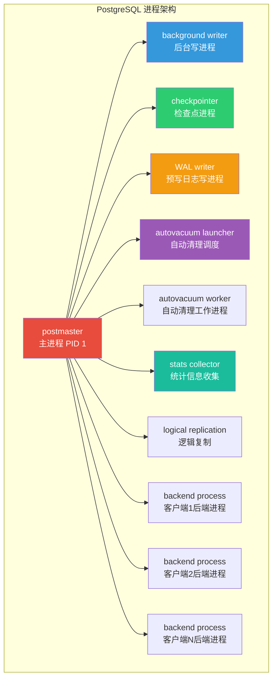
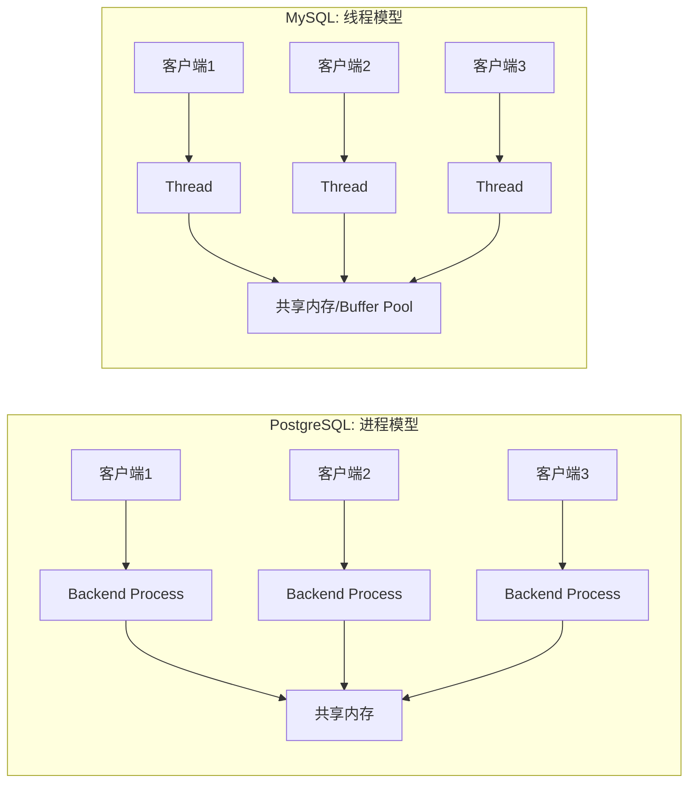
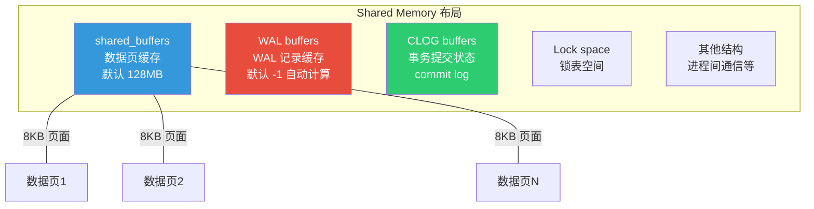
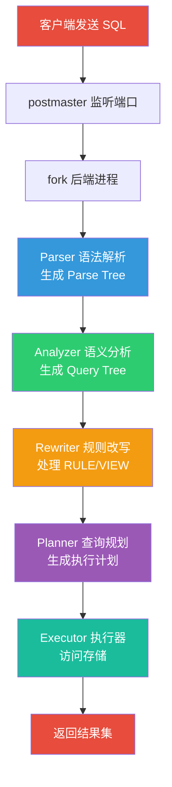
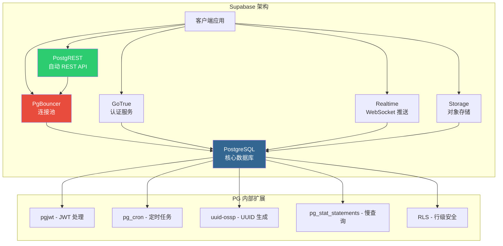

# PostgreSQL 架构体系

::: tip 核心观点
PostgreSQL 采用**进程-per-连接**模型，而非 MySQL 的线程-per-连接。理解其进程架构和共享内存布局，是掌握 PG 性能调优和故障排查的基础。
:::

## 进程模型

PostgreSQL 是一个多进程架构的数据库系统。启动后，你会看到一系列后台进程各司其职：



### 各进程职责

| 进程 | 职责 | 关键参数 |
|------|------|----------|
| **postmaster** | 主进程，监听连接、fork 后端进程、管理子进程 | `port`, `listen_addresses` |
| **background writer** | 定期将 shared_buffers 中的脏页刷到磁盘 | `bgwriter_delay`, `bgwriter_lru_maxpages` |
| **checkpointer** | 执行检查点，确保数据一致性恢复点 | `checkpoint_timeout`, `max_wal_size` |
| **WAL writer** | 定期将 WAL 缓冲区刷写到 WAL 文件 | `wal_writer_delay`, `wal_writer_flush_after` |
| **autovacuum launcher** | 调度 autovacuum worker 进程 | `autovacuum_naptime`, `autovacuum_max_workers` |
| **stats collector** | 收集表/索引的统计信息（pg_stat_*） | `track_counts`, `track_activities` |
| **logical replication** | 逻辑复制应用的 worker 进程 | `max_replication_slots` |

::: warning 进程 vs 线程
PostgreSQL 每个客户端连接对应一个独立的操作系统进程（backend process），而不是线程。这意味着：
- **隔离性好**：一个后端进程崩溃不会影响其他连接
- **资源开销大**：每个进程占用独立内存，连接数受限（通常不超过 500-1000）
- **需要连接池**：生产环境必须使用 PgBouncer 或连接池
:::

### 与 MySQL 的线程模型对比



| 对比项 | PostgreSQL | MySQL (InnoDB) |
|--------|-----------|----------------|
| 连接模型 | 每连接一进程 | 每连接一线程 |
| 崩溃隔离 | 进程级隔离，互不影响 | 线程共享地址空间，一个 bug 可能拖垮全局 |
| 内存开销 | 进程独立内存，开销较大 | 线程共享内存，开销较小 |
| 连接上限 | 默认 100，生产建议 < 500 | 可达数千连接 |
| 连接池 | **必须**使用 PgBouncer | 可选，线程池插件可用 |

## 共享内存

PostgreSQL 启动时向操作系统申请一块共享内存，所有后端进程通过它进行通信和缓存：



### 关键内存参数

```sql
-- 查看当前共享内存配置
SHOW shared_buffers;       -- 数据缓存，建议设为物理内存的 25%
SHOW wal_buffers;          -- WAL 缓冲区，默认 -1 (shared_buffers 的 1/32)
SHOW effective_cache_size; -- 查询规划器参考值，建议物理内存的 50-75%

-- 查看共享内存使用情况
SELECT name, setting, unit, short_desc
FROM pg_settings
WHERE name IN ('shared_buffers', 'wal_buffers', 'huge_pages');
```

```
    name      | setting | unit |              short_desc
--------------+---------+------+--------------------------------------
 shared_buffers | 16384  | 8kB  | Size of shared memory buffer pool
 wal_buffers   | 512     | 8kB  | Size of WAL buffers
 huge_pages    | try     |      | Use huge pages for shared memory
```

::: important shared_buffers 调优原则
1. **不要超过物理内存的 25%**：PG 依赖操作系统页缓存做二级缓存，留内存给 OS
2. **Linux 建议启用 Huge Pages**：减少 TLB miss，大内存场景效果显著
3. **Windows 不支持 Huge Pages**：shared_buffers 上限建议更低

参考：[PostgreSQL 官方文档 - Resource Consumption](https://www.postgresql.org/docs/16/runtime-config-resource.html)
:::

## 一条 SQL 的旅程

当客户端发送一条 SQL 到 PostgreSQL，它会经历以下完整路径：



### 各阶段详解

```sql
-- 示例查询
SELECT u.name, COUNT(o.id) AS order_count
FROM users u
JOIN orders o ON u.id = o.user_id
WHERE u.created_at > '2025-01-01'
GROUP BY u.name
ORDER BY order_count DESC
LIMIT 10;
```

**1. Parser（语法解析）**

检查 SQL 语法是否合法，生成解析树（Parse Tree）。不检查表/列是否存在：

```
SelectStmt:
  targetList: [ColumnRef(name), FuncCall(COUNT, ColumnRef(id))]
  fromClause: [JoinExpr(users u, orders o, = u.id o.user_id)]
  whereClause: ColumnRef(created_at) > '2025-01-01'
  groupClause: [ColumnRef(name)]
  sortClause: [FuncCall(COUNT) DESC]
  limitCount: 10
```

**2. Analyzer（语义分析）**

从系统目录（`pg_class`, `pg_attribute` 等）解析表名、列名、类型，生成查询树（Query Tree）：

```sql
-- Analyzer 依赖的系统目录
SELECT relname, relpages, reltuples FROM pg_class WHERE relname = 'users';
SELECT attname, atttypid FROM pg_attribute WHERE attrelid = 'users'::regclass;
```

**3. Rewriter（规则改写）**

处理 VIEW 展开和 RULE 规则：

```sql
-- 如果查询的是视图，Rewriter 会展开视图定义
CREATE VIEW active_users AS
    SELECT * FROM users WHERE status = 'active';

-- 查询 active_users 会被改写为查询 users + WHERE 条件
```

**4. Planner（查询规划）**

这是最复杂的阶段，生成多种执行计划并选择成本最低的：

```sql
-- 查看规划器生成的执行计划
EXPLAIN
SELECT u.name, COUNT(o.id) AS order_count
FROM users u
JOIN orders o ON u.id = o.user_id
WHERE u.created_at > '2025-01-01'
GROUP BY u.name
ORDER BY order_count DESC
LIMIT 10;
```

```
                                    QUERY PLAN
----------------------------------------------------------------------------------
 Limit  (cost=58.90..58.92 rows=10 width=72)
   ->  Sort  (cost=58.90..59.15 rows=100 width=72)
         Sort Key: (count(o.id)) DESC
         ->  HashAggregate  (cost=56.40..57.90 rows=100 width=72)
               Group Key: u.name
               ->  Hash Join  (cost=12.75..53.90 rows=500 width=72)
                     Hash Cond: (o.user_id = u.id)
                     ->  Seq Scan on orders o  (cost=0.00..30.40 rows=2040 width=8)
                     ->  Hash  (cost=12.50..12.50 rows=200 width=72)
                           ->  Seq Scan on users u  (cost=0.00..12.50 rows=200 width=72)
                                 Filter: (created_at > '2025-01-01'::date)
```

**5. Executor（执行器）**

按照执行计划访问存储，返回结果。执行器有两种模式：
- **火山模型（Volcano）**：每个算子调用 `next()` 获取一行，逐行处理
- **对于大型数据集**：使用并行查询

## Supabase 的 PG 架构扩展

[Supabase](https://github.com/supabase/supabase) 是基于 PostgreSQL 的开源 Firebase 替代品，它在原生 PG 架构上增加了几个关键组件：



### 关键设计决策

```sql
-- Supabase 的连接池配置（PgBouncer）
-- 为什么需要连接池？因为 PG 进程模型不适合大量并发连接
-- PgBouncer 配置示例
[databases]
supabase = host=127.0.0.1 port=5432 dbname=postgres

[pgbouncer]
pool_mode = transaction      -- 事务级池化，最高效
max_client_conn = 1000       -- 允许 1000 客户端连接
default_pool_size = 20       -- 每数据库/用户 20 个 PG 连接
```

```sql
-- Supabase 的行级安全策略（RLS）- 核心安全机制
ALTER TABLE public.profiles ENABLE ROW LEVEL SECURITY;

CREATE POLICY "Users can view own profile"
    ON public.profiles FOR SELECT
    USING (auth.uid() = id);

CREATE POLICY "Users can update own profile"
    ON public.profiles FOR UPDATE
    USING (auth.uid() = id);
```

::: tip PostgREST 如何工作
[PostgREST](https://github.com/PostgREST/postgrest) 直接连接 PostgreSQL，将数据库表和函数映射为 RESTful API：

- `GET /users` → `SELECT * FROM users;`
- `POST /users` → `INSERT INTO users ...;`
- `PATCH /users?id=eq.1` → `UPDATE users SET ... WHERE id = 1;`
- `DELETE /users?id=eq.1` → `DELETE FROM users WHERE id = 1;`

它利用 PG 的 RLS 确保安全性，不需要额外的 ORM 层。
:::

## 实战：观察 PG 进程

```bash
# 查看 PostgreSQL 所有进程
ps aux | grep postgres

# 输出示例：
# postgres: postmaster    (主进程)
# postgres: checkpointer  (检查点)
# postgres: background writer (后台写)
# postgres: walwriter     (WAL 写)
# postgres: autovacuum launcher (自动清理调度)
# postgres: stats collector   (统计收集)
# postgres: db_user 127.0.0.1(54321) INSERT (后端进程)
```

```sql
-- 查看当前所有后端进程（连接）
SELECT pid, usename, application_name, client_addr,
       state, query, backend_start
FROM pg_stat_activity
WHERE pid <> pg_backend_pid();  -- 排除自身

-- 查看后端进程正在等待的事件
SELECT pid, wait_event_type, wait_event, query
FROM pg_stat_activity
WHERE wait_event_type IS NOT NULL;
```

```
 pid  | wait_event_type | wait_event  |              query
------+-----------------+-------------+----------------------------------
 1234 | IO              | DataFileRead| SELECT * FROM large_table ...
 1235 | Lock            | relation    | LOCK TABLE users IN ...
 1236 | Client          | ClientRead  | <idle>
```

## 面试技巧

::: tip 面试高频问题
1. **PG 为什么用进程模型而非线程？**
   - 历史原因（1980s 起源），进程提供更好的崩溃隔离
   - 一个后端进程 segfault 不会影响其他连接
   - 代价是连接数受限，必须配合连接池使用

2. **shared_buffers 为什么建议只设 25%？**
   - PG 依赖 OS 页缓存作为二级缓存
   - 数据读写路径：shared_buffers → OS page cache → 磁盘
   - 设太大反而造成 double buffering 和内存压力

3. **一条 SELECT 的完整执行流程？**
   - 客户端 → postmaster fork → Parser → Analyzer → Rewriter → Planner → Executor → 返回
   - 面试时重点讲 Planner 阶段（成本估算、执行计划选择）

4. **Supabase 为什么选择 PG 而不是 MySQL？**
   - PG 的扩展性（RLS、JSONB、PostGIS）
   - PG 的进程模型配合 PgBouncer 适合 SaaS 多租户
   - PostgREST 可以直接将 PG 函数暴露为 API
:::

## 参考资料

- [PostgreSQL 官方文档 - Architecture](https://www.postgresql.org/docs/16/runtime.html)
- [PostgreSQL 官方文档 - Resource Consumption](https://www.postgresql.org/docs/16/runtime-config-resource.html)
- [Supabase GitHub](https://github.com/supabase/supabase)
- [PostgREST GitHub](https://github.com/PostgREST/postgrest)
- 《PostgreSQL 指南：内幕探索》- 进程与内存架构章节
