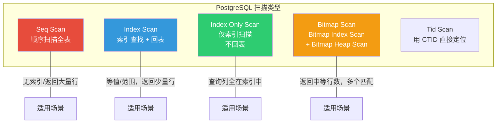
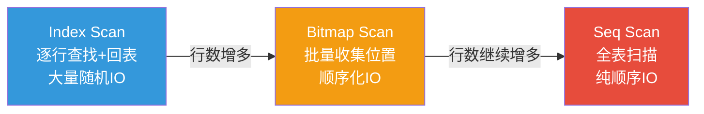
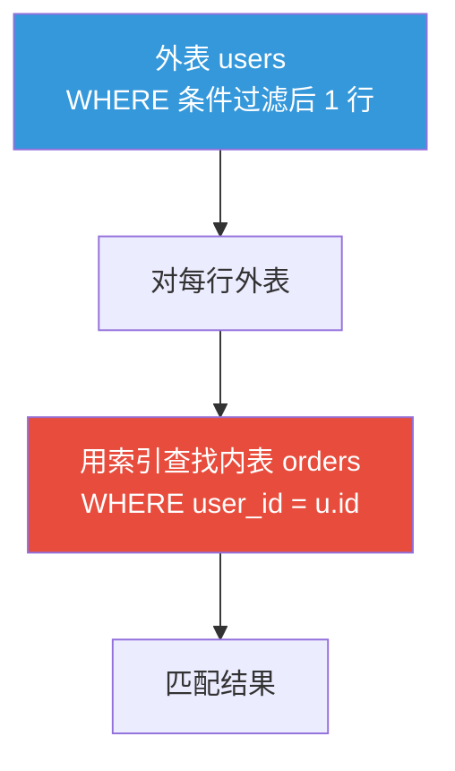
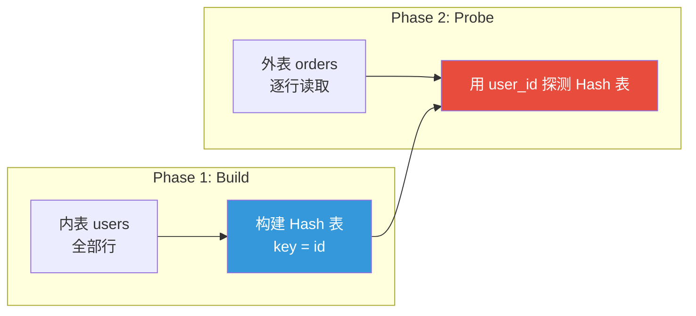
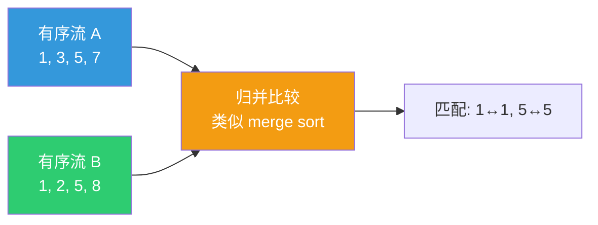

# 查询优化

::: tip 核心观点
查询优化的核心不是"加索引"，而是**读懂 EXPLAIN 输出，理解规划器的决策逻辑**。PostgreSQL 的成本模型和统计信息决定了执行计划，调优的本质是让规划器做出正确选择。
:::

## EXPLAIN 详解

### 基本用法

```sql
-- 只看计划，不实际执行
EXPLAIN SELECT * FROM orders WHERE user_id = 1;

-- 实际执行 + 统计信息（调优必备）
EXPLAIN (ANALYZE, BUFFERS) SELECT * FROM orders WHERE user_id = 1;

-- 推荐的完整格式
EXPLAIN (ANALYZE, BUFFERS, FORMAT TEXT)
SELECT * FROM orders WHERE user_id = 1;
```

```
                                              QUERY PLAN
------------------------------------------------------------------------------------------------------
 Index Scan using idx_orders_user_id on orders  (cost=0.29..8.31 rows=1 width=40) (actual time=0.015..0.016 rows=1 loops=1)
   Index Cond: (user_id = 1)
   Buffers: shared hit=4
 Planning Time: 0.082 ms
 Execution Time: 0.033 ms
```

### 成本模型解读

```
Index Scan (cost=0.29..8.31 rows=1 width=40)
             ↑       ↑      ↑        ↑
          启动成本  总成本  预估行数  预估行宽
```

| 指标 | 含义 | 单位 |
|------|------|------|
| **startup cost** | 返回第一行前的成本 | 任意单位（磁盘页读取 = 1.0） |
| **total cost** | 返回所有行的总成本 | 同上 |
| **rows** | 预估返回行数 | 基于 `pg_statistics` |
| **width** | 预估每行字节数 | 基于列统计 |

```sql
-- 查看表的统计信息（规划器的依据）
SELECT attname, n_distinct, null_frac, avg_width
FROM pg_stats
WHERE tablename = 'orders';

-- 手动更新统计信息
ANALYZE orders;

-- 更详细的分析
VACUUM ANALYZE orders;
```

::: important ANALYZE vs VACUUM ANALYZE
- `ANALYZE`：只更新统计信息，不清理死元组
- `VACUUM ANALYZE`：先清理死元组，再更新统计信息
- **统计信息过时会导致规划器选错执行计划**，这是性能突降的常见原因
- 参考文档：[Statistics Used by the Planner](https://www.postgresql.org/docs/16/planner-stats.html)
:::

## 扫描类型



### Seq Scan（顺序扫描）

```sql
EXPLAIN ANALYZE SELECT * FROM orders;

-- Seq Scan on orders  (cost=0.00..1542.00 rows=100000 width=40)
-- 全表扫描，逐行读取
-- 什么时候合理？返回表中大部分数据时，比索引+回表更快
```

### Index Scan（索引扫描）

```sql
EXPLAIN ANALYZE SELECT * FROM orders WHERE user_id = 1;

-- Index Scan using idx_orders_user_id on orders
-- 先从 B-Tree 索引找到行位置，再回表取完整行
-- 适合返回少量行
```

### Index Only Scan（仅索引扫描）

```sql
-- 覆盖索引：查询列全部在索引中
CREATE INDEX idx_orders_user_amount ON orders (user_id, amount);

EXPLAIN ANALYZE SELECT user_id, amount FROM orders WHERE user_id = 1;

-- Index Only Scan using idx_orders_user_amount on orders
-- 不需要回表！直接从索引返回数据
-- 但需要 VM（Visibility Map）确认所有行对所有事务可见
```

### Bitmap Scan（位图扫描）

```sql
EXPLAIN ANALYZE SELECT * FROM orders WHERE user_id < 100;

-- Bitmap Heap Scan on orders  (cost=12.75..245.60 rows=500 width=40)
--   ->  Bitmap Index Scan using idx_orders_user_id
--        Index Cond: (user_id < 100)

-- 工作流程：
-- 1. Bitmap Index Scan: 从索引收集所有匹配行的 CTID
-- 2. 排序 CTID（按物理位置），使磁盘访问顺序化
-- 3. Bitmap Heap Scan: 按排序后的位置批量访问数据页
-- 适合返回中等数量的行（比 Index Scan 少随机 IO）
```



## JOIN 方法

### Nested Loop Join（嵌套循环）

```sql
EXPLAIN ANALYZE
SELECT u.name, o.amount
FROM users u
JOIN orders o ON u.id = o.user_id
WHERE u.id = 1;

-- Nested Loop  (cost=0.58..16.65 rows=5 width=72)
--   ->  Index Scan using users_pkey on users u
--        Index Cond: (id = 1)
--   ->  Index Scan using idx_orders_user_id on orders o
--        Index Cond: (user_id = u.id)

-- 适合：外表小（几行），内表有索引
-- 复杂度：O(外表行数 × 内表查找次数)
```



### Hash Join（哈希连接）

```sql
EXPLAIN ANALYZE
SELECT u.name, o.amount
FROM users u
JOIN orders o ON u.id = o.user_id;

-- Hash Join  (cost=37.00..1234.56 rows=5000 width=72)
--   Hash Cond: (o.user_id = u.id)
--   ->  Seq Scan on orders o
--   ->  Hash
--         ->  Seq Scan on users u

-- 适合：等值连接，内表可以放入内存
-- 原理：对内表构建 Hash 表，外表逐行探测
```



### Merge Join（归并连接）

```sql
EXPLAIN ANALYZE
SELECT u.name, o.amount
FROM users u
JOIN orders o ON u.id = o.user_id
ORDER BY u.id;

-- Merge Join  (cost=0.86..2345.67 rows=5000 width=72)
--   Merge Cond: (u.id = o.user_id)
--   ->  Index Scan using users_pkey on users u
--   ->  Index Scan using idx_orders_user_id on orders o

-- 适合：两边都有序的数据（索引或排序后），等值连接
-- 原理：两个有序队列归并，像合并排序
```



### JOIN 方法选择

| 方法 | 条件 | 时间复杂度 | 内存需求 |
|------|------|-----------|---------|
| **Nested Loop** | 任意条件，外表小 | O(M × N) | O(1) |
| **Hash Join** | 等值连接，内表可入内存 | O(M + N) | O(内表) |
| **Merge Join** | 等值连接，两边有序 | O(M + N) | O(1)~O(排序) |

## CTE 优化

```sql
-- PG 12 之前：CTE 总是物化（先执行，存临时表）
-- PG 12+：默认内联（像子查询一样优化）

-- 物化 CTE（显式声明，适合复杂计算只执行一次）
EXPLAIN
WITH user_orders AS MATERIALIZED (
    SELECT user_id, COUNT(*) AS order_count, SUM(amount) AS total
    FROM orders
    GROUP BY user_id
)
SELECT u.name, uo.order_count, uo.total
FROM users u
JOIN user_orders uo ON u.id = uo.user_id;

-- 内联 CTE（默认行为，允许优化器下推条件）
EXPLAIN
WITH user_orders AS (
    SELECT user_id, COUNT(*) AS order_count, SUM(amount) AS total
    FROM orders
    GROUP BY user_id
)
SELECT u.name, uo.order_count, uo.total
FROM users u
JOIN user_orders uo ON u.id = uo.user_id
WHERE u.id = 1;  -- 条件下推到 CTE 内部
```

::: tip 何时用 MATERIALIZED
- CTE 结果被引用多次 → 物化避免重复计算
- CTE 非常复杂，物化后可加速后续操作
- 大多数情况下用默认内联即可，让优化器自由选择
:::

## 分区裁剪

```sql
-- 分区表查询，规划器自动跳过无关分区
CREATE TABLE orders (
    id         integer GENERATED ALWAYS AS IDENTITY,
    user_id    integer NOT NULL,
    amount     numeric(10, 2),
    created_at timestamptz DEFAULT now(),
    PRIMARY KEY (id, created_at)
) PARTITION BY RANGE (created_at);

CREATE TABLE orders_2025_q1 PARTITION OF orders
    FOR VALUES FROM ('2025-01-01') TO ('2025-04-01');
CREATE TABLE orders_2025_q2 PARTITION OF orders
    FOR VALUES FROM ('2025-04-01') TO ('2025-07-01');

-- 查询单个分区
EXPLAIN SELECT * FROM orders WHERE created_at = '2025-05-15';
-- Append
--   ->  Seq Scan on orders_2025_q2    ← 只扫描 Q2 分区

-- 查询跨分区
EXPLAIN SELECT * FROM orders
WHERE created_at BETWEEN '2025-03-01' AND '2025-05-31';
-- Append
--   ->  Seq Scan on orders_2025_q1    ← Q1
--   ->  Seq Scan on orders_2025_q2    ← Q2
```

## 并行查询

```sql
-- PG 9.6+ 支持并行查询
-- 查看并行配置
SHOW max_parallel_workers_per_gather;  -- 默认 2
SHOW max_parallel_workers;              -- 默认 8
SHOW parallel_tuple_cost;              -- 默认 0.1
SHOW min_parallel_table_scan_size;     -- 默认 8MB

-- 并行 Seq Scan
EXPLAIN ANALYZE SELECT COUNT(*) FROM orders;
-- Finalize Aggregate  (actual time=152.3..152.3 rows=1 loops=1)
--   ->  Gather  (actual time=152.2..152.2 rows=3 loops=1)
--         Workers Planned: 2
--         Workers Launched: 2
--         ->  Partial Aggregate  (actual time=148.1..148.1 rows=1 loops=3)
--               ->  Parallel Seq Scan on orders  (actual time=0.01..120.3 rows=33333 loops=3)
```

```mermaid
flowchart TD
    Q[查询: SELECT COUNT(*) FROM orders] --> G[Gather 节点<br/>汇总 worker 结果]
    G --> W1[Worker 1<br/>扫描 1/3 数据]
    G --> W2[Worker 2<br/>扫描 1/3 数据]
    G --> W3[Leader<br/>扫描 1/3 数据]
    W1 --> R[部分聚合结果]
    W2 --> R2[部分聚合结果]
    W3 --> R3[部分聚合结果]
    R --> G
    R2 --> G
    R3 --> G
    G --> F[最终结果]

    style G fill:#e74c3c,color:#fff
    style W1 fill:#3498db,color:#fff
    style W2 fill:#2ecc71,color:#fff
    style W3 fill:#f39c12,color:#fff
```

::: warning 并行查询的限制
- 不适用于：DDL、游标、CTE 物化、函数内
- 数据量太小时不会并行（低于 `min_parallel_table_scan_size`）
- OLTP 场景慎用：并行查询占用多个 worker，影响并发
- 参考文档：[Parallel Query](https://www.postgresql.org/docs/16/parallel-query.html)
:::

## pg_stat_statements

```sql
-- 启用扩展
CREATE EXTENSION IF NOT EXISTS pg_stat_statements;

-- 查看最慢的 10 条查询
SELECT query,
       calls,
       round(total_exec_time::numeric, 2) AS total_ms,
       round(mean_exec_time::numeric, 2) AS avg_ms,
       round(max_exec_time::numeric, 2) AS max_ms,
       rows
FROM pg_stat_statements
ORDER BY total_exec_time DESC
LIMIT 10;

-- 查看最耗 IO 的查询
SELECT query,
       round(shared_blks_hit::numeric / nullif(shared_blks_hit + shared_blks_read, 0) * 100, 2) AS cache_hit_pct,
       shared_blks_read,
       shared_blks_hit
FROM pg_stat_statements
WHERE shared_blks_read > 0
ORDER BY shared_blks_read DESC
LIMIT 10;

-- 重置统计
SELECT pg_stat_statements_reset();
```

## GEQO（遗传查询优化器）

```sql
-- 当 JOIN 表数量超过阈值时，PG 使用遗传算法而非穷举
SHOW geqo_threshold;  -- 默认 12

-- 12 个表以下的 JOIN：穷举所有计划，选最优
-- 12 个表以上的 JOIN：GEQO 随机搜索，不保证最优但够快

-- 生产环境建议保持默认
-- 如果复杂 JOIN 性能不稳定，可尝试调高 geqo_threshold
SET geqo_threshold = 20;
```

## 常见优化案例

### 案例1：OFFSET 分页优化

```sql
-- ❌ 慢：OFFSET 需要扫描跳过的所有行
SELECT * FROM orders ORDER BY id OFFSET 100000 LIMIT 10;

-- ✅ 快：用 keyset 分页
SELECT * FROM orders WHERE id > 100000 ORDER BY id LIMIT 10;
```

### 案例2：OR 条件改写

```sql
-- ❌ 慢：OR 可能导致规划器放弃索引
SELECT * FROM orders
WHERE user_id = 1 OR status = 'cancelled';

-- ✅ 快：UNION ALL 让两个条件各用索引
SELECT * FROM orders WHERE user_id = 1
UNION ALL
SELECT * FROM orders WHERE status = 'cancelled' AND user_id <> 1;
```

### 案例3：子查询提升

```sql
-- ❌ 可能慢：相关子查询
SELECT u.name,
       (SELECT COUNT(*) FROM orders o WHERE o.user_id = u.id)
FROM users u;

-- ✅ 通常更快：JOIN + GROUP BY
SELECT u.name, COALESCE(o.cnt, 0) AS order_count
FROM users u
LEFT JOIN (SELECT user_id, COUNT(*) AS cnt FROM orders GROUP BY user_id) o
ON u.id = o.user_id;
```

## 面试技巧

::: tip 面试高频问题
1. **EXPLAIN 输出中 cost 的含义？**
   - cost = 启动成本..总成本，单位是相对的（磁盘页读取 = 1.0）
   - 不是时间，是规划器的估算，用于比较不同计划
   - ANALYZE 的 actual time 才是真实执行时间

2. **Index Scan 和 Bitmap Scan 怎么选？**
   - 少量行 → Index Scan（直接回表）
   - 中等行 → Bitmap Scan（批量回表，减少随机 IO）
   - 大量行 → Seq Scan（全表顺序读最快）
   - 规划器根据统计信息自动选择

3. **三种 JOIN 方法的适用场景？**
   - Nested Loop：外表小 + 内表有索引
   - Hash Join：等值连接 + 内表可入内存
   - Merge Join：两边有序 + 等值连接

4. **统计信息为什么重要？**
   - 规划器完全依赖统计信息估算成本
   - 统计过时 → 估算错误 → 选错计划 → 性能暴跌
   - autovacuum 自动更新统计，但大表变更后建议手动 ANALYZE

5. **CTE 在 PG 12+ 有什么变化？**
   - PG 12 前：CTE 总是物化（优化屏障）
   - PG 12+：默认内联，像子查询一样可优化
   - 需要物化时用 `AS MATERIALIZED` 显式声明
:::

## 参考资料

- [PostgreSQL 官方文档 - Using EXPLAIN](https://www.postgresql.org/docs/16/using-explain.html)
- [PostgreSQL 官方文档 - Planner Statistics](https://www.postgresql.org/docs/16/planner-stats.html)
- [PostgreSQL 官方文档 - Parallel Query](https://www.postgresql.org/docs/16/parallel-query.html)
- [PostgreSQL 官方文档 - pg_stat_statements](https://www.postgresql.org/docs/16/pgstatstatements.html)
- [Supabase GitHub](https://github.com/supabase/supabase)
