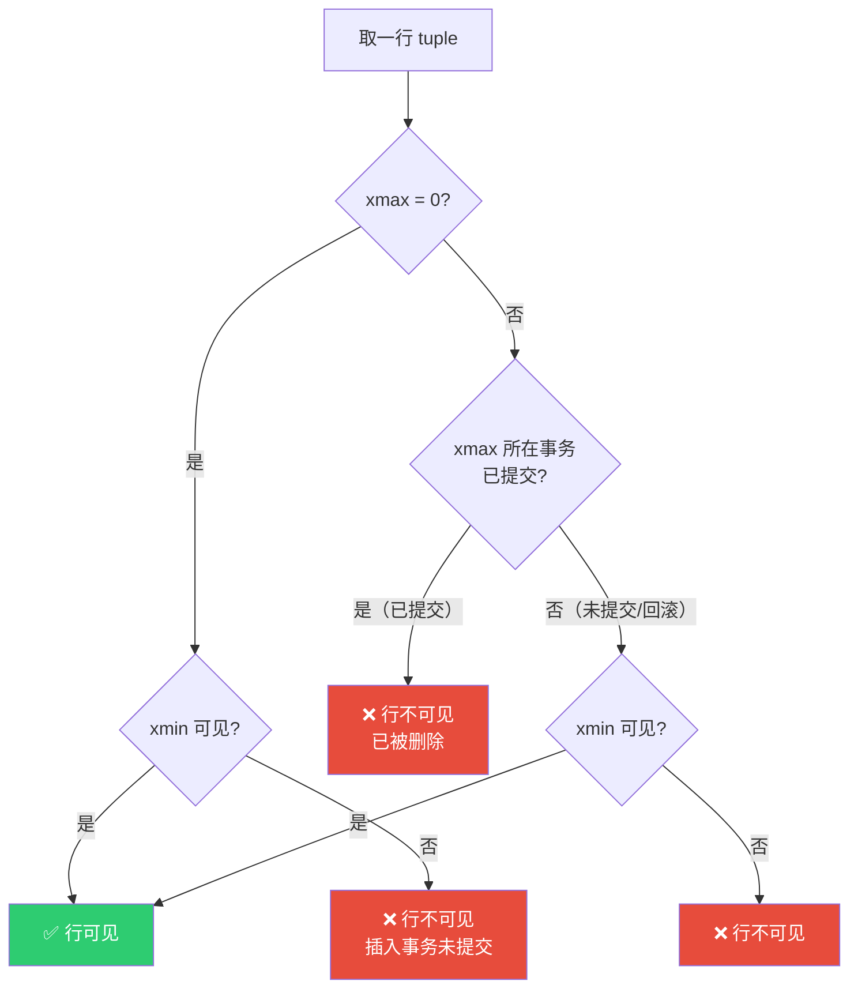
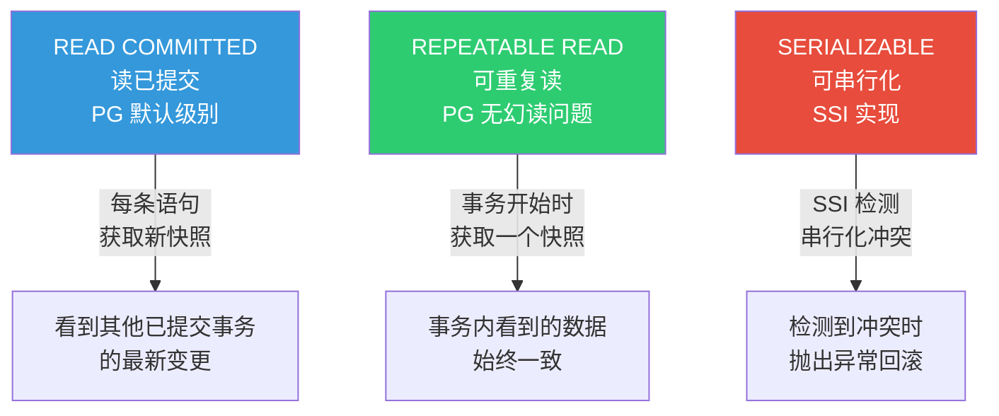
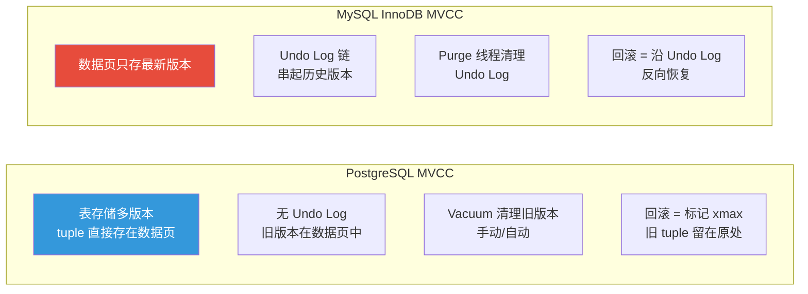

# MVCC 与事务

::: tip 核心观点
PostgreSQL 的 MVCC 实现与 MySQL 完全不同——没有 Undo Log，而是**在表本身存储多个版本的行（tuple）**。理解 xmin/xmax 的可见性规则，是排查数据异常和 Vacuum 问题的前提。
:::

## MVCC 基础

### 行版本（Tuple）结构

PG 中每一行数据（tuple）都带有事务信息头：

```sql
-- 查看行的 xmin/xmax
SELECT id, name, xmin, xmax, cmin, cmax
FROM users
LIMIT 5;
```

```
 id | name  | xmin  | xmax  | cmin | cmax
----+-------+-------+-------+------+-----
  1 | Alice | 100   | 0     | 0    | 0
  2 | Bob   | 101   | 0     | 0    | 0
  3 | Carol | 102   | 105   | 0    | 0
```

| 字段 | 含义 | 值 |
|------|------|-----|
| **xmin** | 插入该行的事务 ID | 100 表示 txn 100 插入 |
| **xmax** | 删除/更新该行的事务 ID | 0 = 仍可见；非 0 = 已被删除 |
| **cmin** | 插入该行的命令序号（事务内） | 0 = 第一条命令 |
| **cmax** | 删除该行的命令序号（事务内） | 0 = 未删除 |

### 可见性判断流程



### 完整示例

```sql
-- 准备测试数据
CREATE TABLE accounts (
    id      integer GENERATED ALWAYS AS IDENTITY PRIMARY KEY,
    name    text NOT NULL,
    balance numeric(10, 2) NOT NULL DEFAULT 0
);

INSERT INTO accounts (name, balance) VALUES ('Alice', 1000.00), ('Bob', 500.00);

-- 查看 xmin/xmax
SELECT id, name, balance, xmin, xmax FROM accounts;
--  id | name  | balance  | xmin | xmax
-- ----+-------+----------+------+-----
--   1 | Alice |  1000.00 |  100 |   0
--   2 | Bob   |   500.00 |  100 |   0

-- 事务 A：更新 Alice 余额（未提交）
BEGIN;
SELECT txid_current();  -- 假设 101
UPDATE accounts SET balance = 800.00 WHERE name = 'Alice';
-- 不提交

-- 另一个会话查看
SELECT id, name, balance, xmin, xmax FROM accounts WHERE name = 'Alice';
--  id | name  | balance  | xmin | xmax
-- ----+-------+----------+------+-----
--   1 | Alice |  1000.00 |  100 | 101   ← 旧版本：xmax=101 表示被 txn 101 标记删除
-- （新版本 xmin=101 对我们不可见，因为 101 未提交）

-- 事务 A 提交
COMMIT;

-- 再次查看
SELECT id, name, balance, xmin, xmax FROM accounts WHERE name = 'Alice';
--  id | name  | balance | xmin | xmax
-- ----+-------+---------+------+-----
--   1 | Alice |  800.00 |  101 |   0  ← 新版本可见
-- （旧版本 xmin=100, xmax=101 已不可见，等待 Vacuum 清理）
```

## 事务 ID 回卷（Wraparound）

```sql
-- 事务 ID 是 32 位整数，最大约 21 亿
-- 超过后会回卷到 0，导致可见性判断混乱

-- 查看当前事务 ID 和回卷风险
SELECT txid_current(),
       age(datfrozenxid) AS tx_age,
       2000000000 - age(datfrozenxid) AS tx_until_wraparound
FROM pg_database WHERE datname = current_database();

-- 查看每个表的冻结年龄
SELECT relname,
       age(relfrozenxid) AS age,
       pg_size_pretty(pg_total_relation_size(oid)) AS size
FROM pg_class
WHERE relkind IN ('r', 't')  -- 普通表和 TOAST 表
  AND age(relfrozenxid) > 100000000  -- 超过 1 亿的表需要关注
ORDER BY age DESC;
```

::: warning 事务 ID 回卷是 PG 最严重的故障
- 当 `age(relfrozenxid)` 接近 20 亿时，PG 会**强制停写**以防止数据损坏
- 此时数据库变为只读，必须执行 `VACUUM FREEZE` 恢复
- **预防**：确保 autovacuum 正常运行，监控 `age(relfrozenxid)`
- 参考文档：[Preventing Transaction ID Wraparound Failures](https://www.postgresql.org/docs/16/routine-vacuuming.html#VACUUM-FOR-WRAPAROUND)
:::

### Vacuum Freeze 机制

```sql
-- Vacuum 的 freeze 操作：将旧 tuple 的 xmin 标记为 "FrozenXID"
-- FrozenXID 永远可见，不再参与年龄计算

-- 手动冻结（紧急恢复用）
VACUUM FREEZE accounts;

-- 查看冻结配置
SHOW vacuum_freeze_min_age;        -- 默认 5000 万，超过此年龄可冻结
SHOW vacuum_freeze_table_age;      -- 默认 1.5 亿，超过此年龄触发全表 freeze
SHOW autovacuum_freeze_max_age;    -- 默认 2 亿，超过此年龄强制 autovacuum
```

## 事务隔离级别



### READ COMMITTED（读已提交）

```sql
-- PG 默认隔离级别
SHOW default_transaction_isolation;  -- read committed

-- 特点：每条 SQL 语句获取新的快照
-- 会话 A
BEGIN;
SELECT balance FROM accounts WHERE name = 'Alice';  -- 800.00

-- 会话 B（同时）
UPDATE accounts SET balance = 900.00 WHERE name = 'Alice';
COMMIT;

-- 会话 A 再次查询（同一事务内）
SELECT balance FROM accounts WHERE name = 'Alice';  -- 900.00 ← 看到了 B 的修改！

COMMIT;
```

### REPEATABLE READ（可重复读）

```sql
-- 会话 A
BEGIN ISOLATION LEVEL REPEATABLE READ;
SELECT balance FROM accounts WHERE name = 'Alice';  -- 900.00

-- 会话 B（同时）
UPDATE accounts SET balance = 700.00 WHERE name = 'Alice';
COMMIT;

-- 会话 A 再次查询（同一事务内）
SELECT balance FROM accounts WHERE name = 'Alice';  -- 900.00 ← 仍然是旧值！

-- 会话 A 尝试修改（会报错）
UPDATE accounts SET balance = 600.00 WHERE name = 'Alice';
-- ERROR: could not serialize access due to concurrent update

COMMIT;
```

::: important PG 的 REPEATABLE READ 不会幻读
SQL 标准定义 REPEATABLE READ 允许幻读，但 PG 的实现实际上**阻止了幻读**：

```sql
-- 会话 A
BEGIN ISOLATION LEVEL REPEATABLE READ;
SELECT COUNT(*) FROM accounts WHERE balance > 800;  -- 1 行

-- 会话 B
INSERT INTO accounts (name, balance) VALUES ('Carol', 900.00);
COMMIT;

-- 会话 A
SELECT COUNT(*) FROM accounts WHERE balance > 800;  -- 仍然是 1 行，不会幻读
COMMIT;
```

PG 的 MVCC 快照机制天然阻止了幻读。这是 PG 相对 MySQL 的一个优势。
:::

### SERIALIZABLE（可串行化）

```sql
-- PG 使用 SSI（Serializable Snapshot Isolation）实现
-- 检测写冲突并回滚

-- 会话 A
BEGIN ISOLATION LEVEL SERIALIZABLE;
SELECT balance FROM accounts WHERE name = 'Alice';  -- 700.00

-- 会话 B
BEGIN ISOLATION LEVEL SERIALIZABLE;
SELECT balance FROM accounts WHERE name = 'Alice';  -- 700.00
UPDATE accounts SET balance = 600.00 WHERE name = 'Alice';
COMMIT;

-- 会话 A
UPDATE accounts SET balance = 500.00 WHERE name = 'Alice';
-- ERROR: could not serialize access due to concurrent update

COMMIT;
```

## 与 MySQL MVCC 的对比



| 对比项 | PostgreSQL | MySQL (InnoDB) |
|--------|-----------|----------------|
| 多版本存储 | 数据页中直接存多个 tuple | 数据页 + Undo Log 链 |
| 旧版本位置 | 与新版本同在表数据页 | Undo Log 表空间 |
| 回滚机制 | 标记 xmax，tuple 仍在 | 沿 Undo Log 链反向恢复 |
| 清理机制 | Vacuum（自动/手动） | Purge 线程（自动） |
| 表膨胀 | **是**，更新产生死元组 | 否，数据页紧凑 |
| 长事务影响 | 表膨胀 + Vacuum 延迟 | Undo Log 膨胀 |
| SELECT 性能 | 需要检查可见性 | 读取最新版本 + 沿 Undo Log |

::: warning PG 的表膨胀问题
PG 的 MVCC 最大缺点是**表膨胀**：频繁 UPDATE/DELETE 会产生大量死元组（dead tuples），即使 Vacuum 后，数据页也可能存在空洞。

解决方案：
- 定期 `VACUUM` 或确保 autovacuum 正常
- 严重膨胀时用 `pg_repack` 或 `VACUUM FULL` 重建表
- 监控 `pg_stat_user_tables.n_dead_tup`
:::

## HOT 更新优化

```sql
-- HOT (Heap-Only Tuple) Update
-- 当 UPDATE 不修改索引列时，PG 可以在同一数据页内创建新版本
-- 不需要更新索引！这大幅减少 IO

-- HOT 更新条件：
-- 1. 新旧 tuple 在同一个数据页
-- 2. 没有修改任何索引列

-- 查看表的 HOT 更新比例
SELECT relname,
       n_tup_upd AS total_updates,
       n_tup_hot_upd AS hot_updates,
       round(n_tup_hot_upd::numeric / nullif(n_tup_upd, 0) * 100, 1) AS hot_pct
FROM pg_stat_user_tables
ORDER BY n_tup_upd DESC;
```

```
 relname | total_updates | hot_updates | hot_pct
---------+---------------+-------------+---------
 orders  |       1500000 |     1200000 | 80.0%
 users   |        500000 |      450000 | 90.0%
 logs    |       3000000 |      600000 | 20.0%
```

::: tip 提高 HOT 更新比例
1. **不要更新索引列**：只更新非索引列可以触发 HOT
2. **增大 fillfactor**：默认 100%，降到 80-90% 留空间给 HOT 更新
3. **选择合适的索引列**：避免对频繁更新的列建索引

```sql
-- 设置 fillfactor（需要重建表）
ALTER TABLE orders SET (fillfactor = 85);
VACUUM FULL orders;
```
:::

## Autovacuum 机制

```sql
-- 查看 autovacuum 配置
SHOW autovacuum;                  -- 默认 on
SHOW autovacuum_naptime;          -- 默认 1min（每分钟检查一次）
SHOW autovacuum_max_workers;      -- 默认 3 个 worker
SHOW autovacuum_vacuum_threshold; -- 默认 50（50 次更新触发）
SHOW autovacuum_vacuum_scale_factor; -- 默认 0.2（20% 行变更触发）

-- 触发条件：dead tuples > threshold + scale_factor * reltuples
-- 例如：10 万行的表，dead tuples > 50 + 0.2 * 100000 = 20050 时触发

-- 查看各表的 autovacuum 状态
SELECT relname,
       n_dead_tup,
       n_live_tup,
       last_vacuum,
       last_autovacuum,
       last_analyze,
       last_autoanalyze
FROM pg_stat_user_tables
ORDER BY n_dead_tup DESC;
```

```sql
-- 为大表调整 autovacuum 阈值
-- 默认 20% 对大表太保守（1 亿行的表要 2000 万 dead tuples 才触发）
ALTER TABLE large_logs SET (
    autovacuum_vacuum_scale_factor = 0.01,   -- 1% 就触发
    autovacuum_analyze_scale_factor = 0.01
);

-- 或者直接设固定阈值
ALTER TABLE large_logs SET (
    autovacuum_vacuum_threshold = 100000,
    autovacuum_vacuum_scale_factor = 0
);
```

```sql
-- 监控 Vacuum 进度（PG 12+）
SELECT pid,
       datname,
       relid::regclass AS table_name,
       phase,
       round(heap_blks_scanned::numeric / nullif(heap_blks_total, 0) * 100, 1) AS scan_pct,
       round(heap_blks_vacuumed::numeric / nullif(heap_blks_total, 0) * 100, 1) AS vacuum_pct
FROM pg_stat_progress_vacuum;
```

## 面试技巧

::: tip 面试高频问题
1. **PG 的 MVCC 和 MySQL 有什么区别？**
   - PG：多版本存在数据页（tuple），无 Undo Log
   - MySQL：最新版本在数据页，历史版本在 Undo Log 链
   - PG 的代价是表膨胀，MySQL 的代价是 Undo Log 膨胀

2. **什么是事务 ID 回卷？怎么预防？**
   - 32 位事务 ID 耗尽后回卷，导致可见性混乱
   - autovacuum freeze 自动处理
   - 监控 `age(relfrozenxid)`，确保 autovacuum 正常运行

3. **PG 的 REPEATABLE READ 和 SQL 标准有什么不同？**
   - SQL 标准允许幻读，PG 实际阻止了幻读
   - PG 的快照机制天然阻止幻读（严格来说已达到 SERIALIZABLE 效果）

4. **HOT 更新是什么？**
   - Heap-Only Tuple：不修改索引列时，新版本放在同一数据页
   - 不需要更新索引，大幅减少 IO
   - 提高 fillfactor 可以增加 HOT 更新概率

5. **autovacuum 不工作怎么办？**
   - 检查 `autovacuum` 是否开启
   - 大表的 scale_factor 太大，调低或设固定阈值
   - 检查是否有长事务阻止 Vacuum（`pg_stat_activity`）
   - 检查是否有锁冲突
:::

## 参考资料

- [PostgreSQL 官方文档 - MVCC](https://www.postgresql.org/docs/16/mvcc.html)
- [PostgreSQL 官方文档 - Routine Vacuuming](https://www.postgresql.org/docs/16/routine-vacuuming.html)
- [PostgreSQL 官方文档 - Transaction Isolation](https://www.postgresql.org/docs/16/transaction-iso.html)
- [Supabase GitHub](https://github.com/supabase/supabase)
