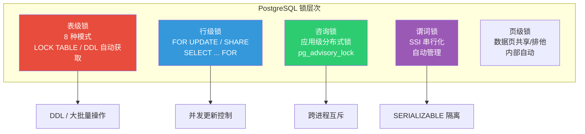
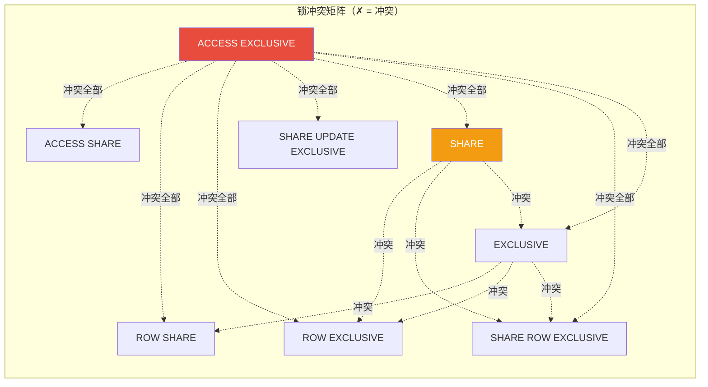
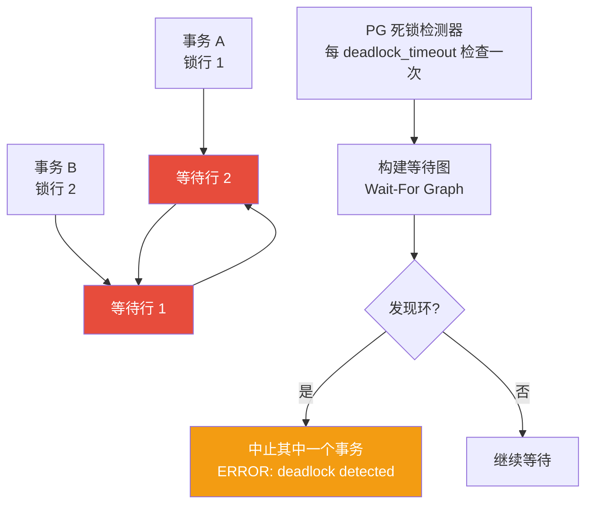

# 锁机制

::: tip 核心观点
PostgreSQL 的锁体系从表级到行级、从常规锁到咨询锁，层次分明。PG 的行锁实现尤其独特——**不在磁盘存储锁信息**，而是利用 xmax 字段标记，这使得行锁的成本极低但语义完整。
:::

## 锁层次总览



## 表级锁

### 8 种锁模式（强度递增）

| 锁模式 | 获取方式 | 典型场景 |
|--------|---------|---------|
| ACCESS SHARE | `SELECT` | 最轻量，普通查询 |
| ROW SHARE | `SELECT FOR UPDATE/SHARE` | 准备更新 |
| ROW EXCLUSIVE | `UPDATE / DELETE / INSERT` | DML 操作 |
| SHARE UPDATE EXCLUSIVE | `VACUUM / ANALYZE` | 维护操作 |
| SHARE | `CREATE INDEX`（不加 CONCURRENTLY） | 建索引（阻塞写入） |
| SHARE ROW EXCLUSIVE | `CREATE TRIGGER`（某些情况） | 较少见 |
| EXCLUSIVE | `CREATE INDEX CONCURRENTLY` | 阻塞大部分操作 |
| ACCESS EXCLUSIVE | `ALTER TABLE / DROP TABLE / LOCK TABLE` | 最重，完全排他 |

### 锁冲突矩阵



```sql
-- 手动获取表级锁
BEGIN;
LOCK TABLE orders IN ACCESS EXCLUSIVE MODE;  -- 完全锁表
-- 执行操作
COMMIT;

-- 常见：迁移时锁表防止新数据写入
LOCK TABLE users IN SHARE MODE;  -- 允许读，阻塞写
```

## 行级锁

### FOR UPDATE / SHARE 系列

```sql
-- FOR UPDATE：排他行锁（最常用）
BEGIN;
SELECT * FROM accounts WHERE id = 1 FOR UPDATE;  -- 锁定该行
UPDATE accounts SET balance = balance - 100 WHERE id = 1;
COMMIT;

-- FOR NO KEY UPDATE：弱排他锁（不阻塞 SELECT FOR SHARE）
-- UPDATE 语句默认获取此锁
BEGIN;
SELECT * FROM accounts WHERE id = 1 FOR NO KEY UPDATE;
-- 其他会话仍可 SELECT ... FOR KEY SHARE
COMMIT;

-- FOR SHARE：共享行锁（读锁）
BEGIN;
SELECT * FROM accounts WHERE id = 1 FOR SHARE;  -- 阻止其他人 FOR UPDATE
COMMIT;

-- FOR KEY SHARE：最弱共享锁（仅锁外键引用）
BEGIN;
SELECT * FROM accounts WHERE id = 1 FOR KEY SHARE;  -- 阻止 DELETE，允许 UPDATE 非键列
COMMIT;
```

### NOWAIT 和 SKIP LOCKED

```sql
-- FOR UPDATE NOWAIT：锁不到就立即报错，不等
BEGIN;
SELECT * FROM accounts WHERE id = 1 FOR UPDATE NOWAIT;
-- 如果行已被锁：ERROR: could not obtain lock on row
COMMIT;

-- FOR UPDATE SKIP LOCKED：跳过已锁的行
BEGIN;
SELECT * FROM accounts
WHERE status = 'pending'
ORDER BY id
LIMIT 10
FOR UPDATE SKIP LOCKED;  -- 跳过被锁的行，返回未锁的
-- 适合：工作队列、并发任务分配
COMMIT;
```

::: tip SKIP LOCKED 是并发队列的最佳实践
```sql
-- 工作队列：多个 worker 并发领取任务
UPDATE tasks
SET status = 'processing', worker_id = 1
WHERE id IN (
    SELECT id FROM tasks
    WHERE status = 'pending'
    ORDER BY priority DESC, id
    LIMIT 10
    FOR UPDATE SKIP LOCKED
);
```
不需要应用层分布式锁，数据库原生支持并发安全的任务分配。
:::

### 行锁的实现原理

```sql
-- PG 的行锁不在磁盘存储锁信息！
-- 而是利用 tuple 的 xmax 字段：

-- 1. FOR UPDATE：将 xmax 设置为当前事务 ID
--    其他事务看到 xmax != 0，知道该行被锁
-- 2. 释放锁：事务提交时，xmax 保持不变（标记删除）
--    事务回滚时，xmax 被清除

-- 验证：
BEGIN;
SELECT txid_current();  -- 假设 200
SELECT * FROM accounts WHERE id = 1 FOR UPDATE;

-- 另一个会话查看
SELECT id, xmin, xmax FROM accounts WHERE id = 1;
-- id | xmin | xmax
-- ----+------+-----
--  1 |  100 |  200   ← xmax=200 表示被 txn 200 锁定/删除

ROLLBACK;  -- 回滚后 xmax 恢复为 0
```

## 死锁检测



```sql
-- 死锁演示
-- 会话 A
BEGIN;
UPDATE accounts SET balance = balance - 100 WHERE id = 1;  -- 锁行 1

-- 会话 B（同时）
BEGIN;
UPDATE accounts SET balance = balance - 100 WHERE id = 2;  -- 锁行 2

-- 会话 A（继续）
UPDATE accounts SET balance = balance + 100 WHERE id = 2;  -- 等待行 2...

-- 会话 B（继续）
UPDATE accounts SET balance = balance + 100 WHERE id = 1;  -- 死锁！
-- ERROR: deadlock detected
-- DETAIL: Process 12345 waits for ShareLock on transaction 200; blocked by process 12346.
```

```sql
-- 死锁检测配置
SHOW deadlock_timeout;  -- 默认 1s，多久检查一次死锁

-- 查看当前锁等待
SELECT blocked.pid AS blocked_pid,
       blocked.query AS blocked_query,
       blocking.pid AS blocking_pid,
       blocking.query AS blocking_query
FROM pg_stat_activity blocked
JOIN pg_locks blocked_locks ON blocked.pid = blocked_locks.pid
JOIN pg_locks blocking_locks
    ON blocked_locks.locktype = blocking_locks.locktype
    AND blocked_locks.database IS NOT DISTINCT FROM blocking_locks.database
    AND blocked_locks.relation IS NOT DISTINCT FROM blocking_locks.relation
    AND blocked_locks.page IS NOT DISTINCT FROM blocking_locks.page
    AND blocked_locks.tuple IS NOT DISTINCT FROM blocking_locks.tuple
    AND blocked_locks.pid != blocking_locks.pid
JOIN pg_stat_activity blocking ON blocking_locks.pid = blocking.pid
WHERE NOT blocked_locks.granted;
```

## pg_locks 视图

```sql
-- 查看当前所有锁
SELECT locktype,
       database::regclass,
       relation::regclass,
       pid,
       mode,
       granted
FROM pg_locks
WHERE pid != pg_backend_pid()
ORDER BY pid, locktype;

-- 常用：查看被阻塞的会话
SELECT pid,
       usename,
       application_name,
       wait_event_type,
       wait_event,
       query,
       state
FROM pg_stat_activity
WHERE wait_event_type = 'Lock';
```

```
 pid  | wait_event_type | wait_event |              query
------+-----------------+------------+----------------------------------
 1234 | Lock            | relation   | ALTER TABLE users ADD COLUMN ...
 1235 | Lock            | tuple      | UPDATE accounts SET balance ...
```

## 咨询锁（Advisory Locks）

```sql
-- 咨询锁：应用级分布式锁，与数据无关
-- 适合：跨进程互斥、限流、分布式锁

-- 会话级锁（随会话释放）
SELECT pg_advisory_lock(12345);          -- 获取锁（阻塞等待）
SELECT pg_try_advisory_lock(12345);      -- 尝试获取（立即返回 bool）
SELECT pg_advisory_unlock(12345);        -- 释放锁

-- 事务级锁（随事务结束释放）
SELECT pg_advisory_xact_lock(12345);     -- 事务内有效
-- COMMIT / ROLLBACK 后自动释放

-- 使用两个 int4 作为 key
SELECT pg_advisory_lock(1, 100);         -- (1, 100) 组合键
SELECT pg_advisory_unlock(1, 100);

-- 使用 int8 作为 key
SELECT pg_advisory_lock(123456789012345);
```

::: tip 咨询锁实战：防止重复执行
```sql
-- 定时任务防重入
CREATE OR REPLACE FUNCTION run_daily_report()
RETURNS void AS $$
BEGIN
    -- 尝试获取锁，失败说明已有实例在执行
    IF NOT pg_try_advisory_xact_lock(20250604) THEN
        RAISE NOTICE 'Report already running';
        RETURN;
    END IF;

    -- 执行报表逻辑
    INSERT INTO daily_reports (date, data)
    SELECT CURRENT_DATE, json_agg(row_to_json(daily_stats))
    FROM daily_stats
    WHERE report_date = CURRENT_DATE;
END;
$$ LANGUAGE plpgsql;
```
咨询锁的优势：不依赖表数据，性能好，适合分布式场景。
:::

## 实战：并发订单处理

```sql
-- 场景：电商高并发下单，防止超卖
CREATE TABLE products (
    id       integer GENERATED ALWAYS AS IDENTITY PRIMARY KEY,
    name     text NOT NULL,
    stock    integer NOT NULL DEFAULT 0,
    CONSTRAINT positive_stock CHECK (stock >= 0)
);

INSERT INTO products (name, stock) VALUES ('限量球鞋', 10);

-- ❌ 错误写法：先查后改，有超卖风险
BEGIN;
SELECT stock FROM products WHERE id = 1;  -- 读到 stock=10
-- （另一个事务也读到 10，都认为够卖）
UPDATE products SET stock = stock - 1 WHERE id = 1;  -- 卖了两次！
COMMIT;

-- ✅ 方案 1：原子 UPDATE + 检查
UPDATE products SET stock = stock - 1
WHERE id = 1 AND stock >= 1
RETURNING *;
-- 如果返回 0 行，说明库存不足

-- ✅ 方案 2：SELECT FOR UPDATE 锁行
BEGIN;
SELECT stock FROM products WHERE id = 1 FOR UPDATE;  -- 锁行
UPDATE products SET stock = stock - 1 WHERE id = 1 AND stock >= 1;
COMMIT;

-- ✅ 方案 3：SKIP LOCKED 并发安全扣减
UPDATE products SET stock = stock - 1
WHERE id = 1 AND stock >= 1
AND id IN (
    SELECT id FROM products
    WHERE id = 1 AND stock >= 1
    FOR UPDATE SKIP LOCKED
)
RETURNING *;
```

## 面试技巧

::: tip 面试高频问题
1. **PG 的行锁存在哪里？**
   - 不在磁盘存储！利用 tuple 的 xmax 字段标记
   - 好处：无需额外锁表空间，行锁数量无限制
   - 代价：锁信息随事务结束丢失（不可跨事务查询锁历史）

2. **FOR UPDATE 的四种模式？**
   - `FOR UPDATE`：最强排他锁
   - `FOR NO KEY UPDATE`：弱排他，不阻塞 FOR KEY SHARE
   - `FOR SHARE`：共享锁
   - `FOR KEY SHARE`：最弱，仅锁外键引用列

3. **SKIP LOCKED 有什么用？**
   - 并发任务分配、工作队列的最佳选择
   - 跳过已锁行，返回可用行
   - 不保证公平性（可能饥饿），但保证无阻塞

4. **咨询锁和普通锁的区别？**
   - 咨询锁：应用定义语义，与数据无关，不会自动释放（除非用 xact 版本）
   - 普通锁：PG 自动管理，事务结束释放
   - 咨询锁适合分布式互斥，普通锁适合数据一致性

5. **如何避免死锁？**
   - 固定加锁顺序（总是先锁 id 小的行）
   - 减少事务持锁时间
   - 使用 NOWAIT/SKIP LOCKED 替代无限等待
:::

## 参考资料

- [PostgreSQL 官方文档 - Explicit Locking](https://www.postgresql.org/docs/16/explicit-locking.html)
- [PostgreSQL 官方文档 - pg_locks](https://www.postgresql.org/docs/16/view-pg-locks.html)
- [PostgreSQL 官方文档 - Advisory Locks](https://www.postgresql.org/docs/16/explicit-locking.html#ADVISORY-LOCKS)
- [Supabase GitHub](https://github.com/supabase/supabase)
