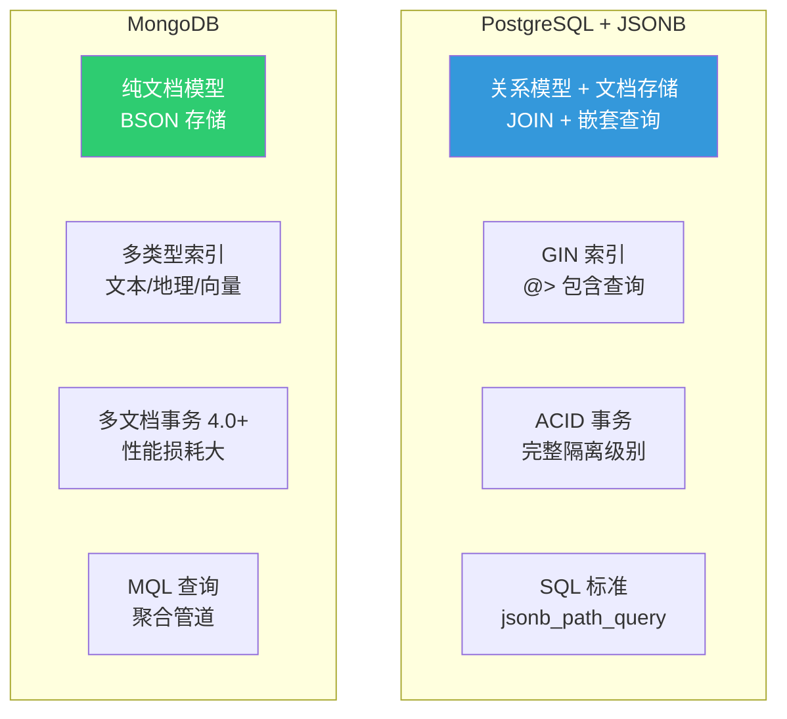

# JSONB 全攻略

::: tip 核心观点
JSONB 是 PostgreSQL 对 NoSQL 世界的回答——在关系型数据库中原生支持文档存储和查询，配合 GIN 索引性能不输 MongoDB。Supabase 大量使用 JSONB 存储元数据，PostgREST 直接将 JSONB 字段映射为 API 响应。
:::

## JSON vs JSONB

```sql
-- json：文本存储，每次查询需要重新解析
-- jsonb：二进制存储，插入时解析一次，查询更快

CREATE TABLE documents (
    id      integer GENERATED ALWAYS AS IDENTITY PRIMARY KEY,
    data_j  json,      -- 文本格式
    data_b  jsonb      -- 二进制格式
);

INSERT INTO documents (data_j, data_b) VALUES
    ('{"name": "Alice", "age": 30, "tags": ["dev", "pg"]}',
     '{"name": "Alice", "age": 30, "tags": ["dev", "pg"]}');

-- jsonb 插入稍慢（需要解析），查询快得多
-- jsonb 会去除空白、规范化键顺序、去重键
SELECT '{"b":2, "a":1, "a":3}'::json;
-- {"b":2, "a":1, "a":3}      ← 保留原样（含重复键）

SELECT '{"b":2, "a":1, "a":3}'::jsonb;
-- {"a": 3, "b": 1}           ← 键排序、去重（取最后一个值）
```

| 对比项 | json | jsonb |
|--------|------|-------|
| 存储格式 | 文本原样 | 二进制解析后 |
| 插入速度 | 稍快 | 稍慢（需解析） |
| 查询速度 | 慢（需实时解析） | 快 |
| 索引支持 | 无 | GIN / btree_gin |
| 键顺序 | 保留 | 排序 |
| 重复键 | 保留 | 取最后一个 |
| 空白 | 保留 | 去除 |

::: important 始终使用 jsonb
除非需要保留原始 JSON 格式（如审计日志原文），否则**永远用 jsonb**。参考：[JSON Types](https://www.postgresql.org/docs/16/datatype-json.html)
:::

## JSONB 操作符

### 提取操作符

```sql
CREATE TABLE products (
    id     integer GENERATED ALWAYS AS IDENTITY PRIMARY KEY,
    name   text NOT NULL,
    attrs  jsonb NOT NULL DEFAULT '{}'
);

INSERT INTO products (name, attrs) VALUES
    ('MacBook Pro', '{"cpu": "M3 Pro", "ram": 18, "colors": ["银色", "深空黑"], "specs": {"weight": 1.55, "screen": 14.2}, "price": 14999}'),
    ('iPhone 15', '{"cpu": "A17 Pro", "ram": 8, "colors": ["黑色", "蓝色", "绿色"], "specs": {"weight": 0.171, "screen": 6.1}, "price": 7999}'),
    ('AirPods Pro', '{"cpu": "H2", "colors": ["白色"], "specs": {"weight": 0.0056, " ANC": true}, "price": 1899}');

-- -> 提取为 JSONB 类型
SELECT attrs->'cpu' FROM products;           -- "M3 Pro" (jsonb)
SELECT attrs->'colors'->0 FROM products WHERE name = 'MacBook Pro';  -- "银色" (jsonb)

-- ->> 提取为 TEXT 类型
SELECT attrs->>'cpu' FROM products;          -- M3 Pro (text)
SELECT attrs->'specs'->>'screen' FROM products WHERE name = 'iPhone 15';  -- 6.1 (text)

-- #> 路径提取（JSONB）
SELECT attrs#>'{specs,weight}' FROM products WHERE name = 'MacBook Pro';  -- 1.55

-- #>> 路径提取（TEXT）
SELECT attrs#>>'{specs,weight}' FROM products WHERE name = 'MacBook Pro'; -- 1.55
```

### 比较操作符

```sql
-- @> 包含（最常用！可以用 GIN 索引加速）
SELECT name FROM products WHERE attrs @> '{"cpu": "M3 Pro"}';
-- MacBook Pro

SELECT name FROM products WHERE attrs @> '{"colors": ["银色"]}';
-- MacBook Pro（数组包含检查）

-- <@ 被包含
SELECT name FROM products WHERE '{"cpu": "M3 Pro", "ram": 18}' <@ attrs;
-- MacBook Pro（attrs 包含所有指定键值）

-- ? 键存在
SELECT name FROM products WHERE attrs ? 'price';
-- 全部（都有 price 键）

-- ?| 任一键存在
SELECT name FROM products WHERE attrs ?| ARRAY['cpu', 'gpu'];
-- MacBook Pro, iPhone 15, AirPods Pro（都有 cpu）

-- ?& 所有键存在
SELECT name FROM products WHERE attrs ?& ARRAY['cpu', 'ram'];
-- MacBook Pro, iPhone 15（AirPods 没有 ram 键）
```

### 操作符速查表

| 操作符 | 右侧类型 | 描述 | 示例 |
|--------|---------|------|------|
| `->` | int/text | 提取元素（JSONB） | `attrs->'cpu'` |
| `->>` | int/text | 提取元素（TEXT） | `attrs->>'cpu'` |
| `#>` | text[] | 路径提取（JSONB） | `attrs#>'{specs,weight}'` |
| `#>>` | text[] | 路径提取（TEXT） | `attrs#>>'{specs,weight}'` |
| `@>` | jsonb | 左侧包含右侧 | `'{"a":1}' @> '{"a":1}'` |
| `<@` | jsonb | 左侧被右侧包含 | `'{"a":1}' <@ '{"a":1,"b":2}'` |
| `?` | text | 键存在 | `attrs ? 'price'` |
| `?\|` | text[] | 任一键存在 | `attrs ?\| ARRAY['a','b']` |
| `?&` | text[] | 所有键存在 | `attrs ?& ARRAY['a','b']` |
| `\|`\| | jsonb | 合并（右侧覆盖） | `a \| \| b` |
| `-` | text/int | 删除键/索引 | `attrs - 'price'` |

## JSONB 索引

### GIN 默认索引

```sql
-- 默认 GIN 索引：支持所有 JSONB 操作符（@>, ?, ?|, ?&）
CREATE INDEX idx_products_attrs ON products USING GIN (attrs);

-- 查询 @> 包含
EXPLAIN SELECT name FROM products WHERE attrs @> '{"cpu": "M3 Pro"}';
-- Bitmap Index Scan using idx_products_attrs on products
--   Index Cond: (attrs @> '{"cpu": "M3 Pro"}'::jsonb)
```

### jsonb_path_ops 索引

```sql
-- jsonb_path_ops：更小更快，但仅支持 @> 操作符
CREATE INDEX idx_products_attrs_path ON products USING GIN (attrs jsonb_path_ops);

-- 索引大小对比
SELECT indexrelname,
       pg_size_pretty(pg_relation_size(indexrelid)) AS size
FROM pg_stat_user_indexes
WHERE indexrelname LIKE 'idx_products_attrs%';

--  indexrelname                 | size
-- ------------------------------+-------
--  idx_products_attrs           | 32 kB    (默认 GIN)
--  idx_products_attrs_path      | 16 kB    (path_ops，小一半！)
```

::: tip 选择哪种 GIN 索引？
- **只用 `@>` 查询** → `jsonb_path_ops`（更小更快）
- **需要 `?`, `?|`, `?&`** → 默认 GIN
- **最佳实践**：大多数场景用 `@>` 就够了，优先 `jsonb_path_ops`
:::

### btree_gin 索引

```sql
-- 需要同时做 JSONB @> 和普通列 = 查询
CREATE EXTENSION IF NOT EXISTS btree_gin;

CREATE INDEX idx_products_category_attrs
ON products USING GIN (category_id, attrs jsonb_path_ops);

-- 查询：先按 category_id 过滤，再按 attrs 包含
SELECT * FROM products
WHERE category_id = 1 AND attrs @> '{"cpu": "M3 Pro"}';
```

## JSONPath（PG 12+）

```sql
-- JSONPath 是 SQL/JSON 标准，PG 12+ 支持
-- 语法：'$' = 根, '.' = 键, '[n]' = 索引, '.**' = 递归

-- jsonb_path_query：返回所有匹配
SELECT jsonb_path_query(attrs, '$.specs.weight') FROM products;
-- 1.55
-- 0.171
-- 0.0056

-- jsonb_path_query_first：返回第一个匹配
SELECT jsonb_path_query_first(attrs, '$.specs.screen') FROM products
WHERE name = 'MacBook Pro';
-- 14.2

-- 条件过滤
SELECT name, jsonb_path_query(attrs, '$.colors[*]' text)
FROM products
WHERE jsonb_path_exists(attrs, '$.colors[*] ? (@ == "银色")');

-- 数值比较
SELECT name
FROM products
WHERE jsonb_path_exists(attrs, '$.price ? (@ > 10000)');
-- MacBook Pro

-- 递归搜索（.** ）
SELECT name, jsonb_path_query(attrs, '$.**.weight') AS weight
FROM products;
-- 递归查找所有 weight 字段，无论嵌套多深
```

```sql
-- jsonb_path_match：用于 WHERE 条件
SELECT name, attrs->>'cpu' AS cpu
FROM products
WHERE jsonb_path_match(attrs, '$.price > 5000');

-- 处理可能不存在的路径
SELECT name,
       jsonb_path_query_first(attrs, '$.ram ? (@ > 10)') AS large_ram
FROM products;
-- 不存在的路径返回 NULL，不会报错
```

## JSONB 修改函数

```sql
-- jsonb_set：修改指定路径的值
SELECT jsonb_set(attrs, '{price}', '12999'::jsonb)
FROM products WHERE name = 'MacBook Pro';
-- {"cpu": "M3 Pro", "ram": 18, ..., "price": 12999}

-- jsonb_insert：在指定路径插入（默认追加，设 after=true 在后面插入）
SELECT jsonb_insert(attrs, '{colors,0}', '"午夜色"'::jsonb)
FROM products WHERE name = 'MacBook Pro';
-- colors: ["午夜色", "银色", "深空黑"]

-- 在末尾追加
SELECT jsonb_insert(attrs, '{colors,-1}', '"午夜色"'::jsonb, true)
FROM products WHERE name = 'MacBook Pro';
-- colors: ["银色", "深空黑", "午夜色"]

-- 删除键
SELECT attrs - 'price' FROM products WHERE name = 'MacBook Pro';
-- 去掉 price 字段

-- jsonb_strip_nulls：去除 null 值
SELECT jsonb_strip_nulls('{"a": 1, "b": null, "c": {"d": null, "e": 2}}');
-- {"a": 1, "c": {"e": 2}}

-- || 合并（右侧覆盖左侧）
SELECT '{"a": 1, "b": 2}'::jsonb || '{"b": 3, "c": 4}'::jsonb;
-- {"a": 1, "b": 3, "c": 4}
```

### 实际更新操作

```sql
-- 更新 JSONB 字段中的某个键
UPDATE products
SET attrs = jsonb_set(attrs, '{price}', '13999'::jsonb)
WHERE name = 'MacBook Pro';

-- 向 JSONB 数组追加元素
UPDATE products
SET attrs = jsonb_set(attrs, '{colors}', (attrs->'colors') || '"午夜色"'::jsonb)
WHERE name = 'MacBook Pro';

-- 删除 JSONB 中的键
UPDATE products
SET attrs = attrs - 'price'
WHERE name = 'AirPods Pro';
```

## JSONB vs MongoDB



| 对比项 | PG JSONB | MongoDB |
|--------|----------|---------|
| 文档大小限制 | 1 GB（行大小限制） | 16 MB |
| 嵌套深度 | 无限制 | 100 层 |
| 索引类型 | GIN (默认/path_ops) | 多种专用索引 |
| 事务 | 完整 ACID | 4.0+ 支持（性能损耗） |
| JOIN | 原生支持 | $lookup（性能差） |
| 查询语言 | SQL + JSONPath | MQL 聚合管道 |
| 适合场景 | 结构+半结构混合 | 纯文档/嵌套深 |

::: tip 什么时候选 PG JSONB 而不是 MongoDB？
1. **大部分数据是结构化的**，只有少部分需要灵活 schema → PG JSONB
2. **需要 JOIN 和复杂查询** → PG
3. **需要强 ACID 保证** → PG
4. **纯文档、嵌套极深、schema 完全动态** → MongoDB
5. **Supabase/PostgREST 技术栈** → 必然 PG JSONB
:::

## Supabase 的 JSONB 使用

```sql
-- Supabase 的 auth.users 表大量使用 JSONB
-- raw_app_meta_data: 存储应用级元数据（角色、权限等）
-- raw_user_meta_data: 存储用户自定义数据

-- 示例：用户元数据
UPDATE auth.users
SET raw_user_meta_data = jsonb_set(
    raw_user_meta_data,
    '{preferences}',
    '{"theme": "dark", "language": "zh-CN"}'::jsonb
)
WHERE id = 'user-uuid';

-- 查询：偏好深色主题的用户
SELECT id, raw_user_meta_data->>'email' AS email
FROM auth.users
WHERE raw_user_meta_data @> '{"preferences": {"theme": "dark"}}';

-- Supabase Realtime 也依赖 JSONB
-- 变更事件以 JSONB 格式通过 WebSocket 推送
-- {
--   "type": "UPDATE",
--   "table": "products",
--   "record": {"id": 1, "name": "MacBook Pro", "attrs": {...}},
--   "old_record": {"id": 1, "name": "MacBook Pro", "attrs": {...}}
-- }
```

## JSONB 全文搜索

```sql
-- 方法1：tsvector 生成列 + GIN 索引
CREATE TABLE articles (
    id      integer GENERATED ALWAYS AS IDENTITY PRIMARY KEY,
    title   text NOT NULL,
    content jsonb NOT NULL DEFAULT '{}',
    tsv     tsvector GENERATED ALWAYS AS (
        setweight(to_tsvector('simple', coalesce(title, '')), 'A') ||
        setweight(to_tsvector('simple',
            coalesce(
                content->>'body',
                content->>'description',
                array_to_string(ARRAY(SELECT jsonb_array_elements_text(content->'tags')), ' '),
                ''
            )
        ), 'B')
    ) STORED
);

CREATE INDEX idx_articles_tsv ON articles USING GIN (tsv);

-- 全文搜索 JSONB 内容
SELECT title, ts_rank(tsv, query) AS rank
FROM articles, plainto_tsquery('simple', 'PostgreSQL 优化') query
WHERE tsv @@ query
ORDER BY rank DESC;

-- 方法2：pg_trgm 模糊搜索 JSONB 文本
CREATE EXTENSION IF NOT EXISTS pg_trgm;

CREATE INDEX idx_articles_content_trgm ON articles
    USING GIN ((content->>'body') gin_trgm_ops);

SELECT title FROM articles
WHERE (content->>'body') % 'PostgreSQL优化';  -- 模糊匹配
```

## 性能基准

```sql
-- 创建测试数据：10 万行 JSONB
CREATE TABLE benchmark (
    id     integer GENERATED ALWAYS AS IDENTITY PRIMARY KEY,
    data   jsonb NOT NULL
);

INSERT INTO benchmark (data)
SELECT jsonb_build_object(
    'category', (ARRAY['电子', '服装', '食品', '家居'])[1 + (i % 4)],
    'price', (random() * 10000)::numeric(10, 2),
    'tags', ARRAY[(ARRAY['热销', '新品', '折扣', '包邮'])[1 + (i % 4)]],
    'specs', jsonb_build_object('weight', (random() * 10)::numeric(4, 2))
)
FROM generate_series(1, 100000) AS i;

-- 无索引：顺序扫描
EXPLAIN ANALYZE
SELECT * FROM benchmark WHERE data @> '{"category": "电子"}';
-- Seq Scan on benchmark (actual time=0.01..85.23 rows=25000 loops=1)

-- GIN jsonb_path_ops 索引
CREATE INDEX idx_benchmark_data ON benchmark USING GIN (data jsonb_path_ops);

-- 有索引：索引扫描
EXPLAIN ANALYZE
SELECT * FROM benchmark WHERE data @> '{"category": "电子"}';
-- Bitmap Heap Scan (actual time=0.05..3.21 rows=25000 loops=1)
--   ->  Bitmap Index Scan using idx_benchmark_data
```

## 面试技巧

::: tip 面试高频问题
1. **json 和 jsonb 的区别？**
   - json 文本存储，jsonb 二进制存储
   - jsonb 查询快、支持索引、去除空白/排序/去重
   - jsonb 插入稍慢（需解析），但查询优势远大于插入开销

2. **@> 操作符为什么重要？**
   - `@>` 是 JSONB 最核心的操作符（包含查询）
   - 可以用 GIN jsonb_path_ops 索引加速
   - 嵌套键值、数组包含都支持

3. **jsonb_path_ops 和默认 GIN 索引怎么选？**
   - 只用 `@>` → jsonb_path_ops（索引更小、查询更快）
   - 需要 `?`, `?|`, `?&` → 默认 GIN

4. **JSONB 和 MongoDB 怎么选？**
   - 需要关系+文档混合 → PG JSONB
   - 需要 JOIN + ACID → PG
   - 纯文档、嵌套极深 → MongoDB

5. **JSONB 的文档大小限制？**
   - PG 单行最大约 1 GB（包含所有列）
   - MongoDB 单文档 16 MB
   - 实际建议 JSONB 字段控制在几 KB 到几 MB
:::

## 参考资料

- [PostgreSQL 官方文档 - JSON Types](https://www.postgresql.org/docs/16/datatype-json.html)
- [PostgreSQL 官方文档 - JSON Functions](https://www.postgresql.org/docs/16/functions-json.html)
- [PostgreSQL 官方文档 - GIN for JSONB](https://www.postgresql.org/docs/16/gin-implementation.html#GIN-FAST-UPDATE)
- [Supabase GitHub](https://github.com/supabase/supabase)
- [PostgREST GitHub](https://github.com/PostgREST/postgrest)
