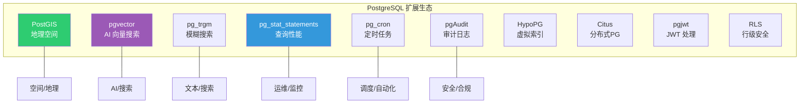

# 扩展生态

::: tip 核心观点
PostgreSQL 的扩展系统是它区别于其他数据库的最大优势——从地理空间到 AI 向量搜索，从模糊匹配到定时任务，几乎任何功能都可以通过扩展加入。理解扩展生态，就是在理解 PG 的能力边界。
:::

## 扩展系统概述



### 扩展管理

```sql
-- 查看已安装的扩展
SELECT extname, extversion FROM pg_extension;

-- 查看可用的扩展
SELECT name, default_version, installed_version, comment
FROM pg_available_extensions
ORDER BY name;

-- 安装扩展
CREATE EXTENSION IF NOT EXISTS extension_name;

-- 安装到指定 schema
CREATE EXTENSION IF NOT EXISTS extension_name SCHEMA my_schema;

-- 卸载扩展
DROP EXTENSION IF EXISTS extension_name;

-- 更新扩展
ALTER EXTENSION extension_name UPDATE;
```

::: important 扩展安装前提
- 扩展的 `.control` 文件和 `.so`/`.dll` 文件必须已在系统中
- 在 Docker/云环境中，需要使用包含扩展的镜像
- Supabase 预装了大量常用扩展，开箱即用
- 参考文档：[Extension Infrastructure](https://www.postgresql.org/docs/16/extend-extensions.html)
:::

## PostGIS

PostGIS 是 PostgreSQL 最流行的扩展，将 PG 变成功能完整的空间数据库：

```sql
-- 安装
CREATE EXTENSION IF NOT EXISTS postgis;

-- 验证
SELECT PostGIS_Full_Version();

-- 创建空间表
CREATE TABLE stores (
    id        integer GENERATED ALWAYS AS IDENTITY PRIMARY KEY,
    name      text NOT NULL,
    category  text NOT NULL,
    location  geometry(Point, 4326) NOT NULL,  -- WGS84 坐标系
    area      geometry(Polygon, 4326)
);

-- 插入空间数据（经度 纬度）
INSERT INTO stores (name, category, location) VALUES
    ('星巴克国贸店', '咖啡', ST_SetSRID(ST_MakePoint(116.4614, 39.9092), 4326)),
    ('瑞幸望京店', '咖啡', ST_SetSRID(ST_MakePoint(116.4802, 39.9941), 4326)),
    ('全家便利店', '零售', ST_SetSRID(ST_MakePoint(116.4551, 39.9115), 4326));
```

```sql
-- GiST 索引（空间查询必需）
CREATE INDEX idx_stores_location ON stores USING GiST (location);

-- 附近搜索（5km 内的咖啡店）
SELECT name,
       ST_Distance(location::geography, ST_MakePoint(116.46, 39.91)::geography) AS dist_meters
FROM stores
WHERE category = '咖啡'
  AND ST_DWithin(location::geography, ST_MakePoint(116.46, 39.91)::geography, 5000)
ORDER BY dist_meters;

-- 范围查询（某区域内）
SELECT name FROM stores
WHERE ST_Contains(
    ST_MakeEnvelope(116.45, 39.90, 116.47, 39.92, 4326),
    location
);

-- 计算面积
SELECT name, ST_Area(area::geography) AS area_sqm FROM regions;
```

::: tip PostGIS vs 专用 GIS 数据库
PostGIS 提供了 OGC 标准的完整空间功能，包括：
- 空间索引（GiST/SP-GiST）
- 空间函数（距离、面积、相交、缓冲区）
- 栅格数据（postgis_raster）
- 拓扑分析（postgis_topology）
- 地理编码（postgis_tiger_geocoder）

多数场景下 PostGIS 可以替代专用 GIS 系统。
:::

## pg_trgm

pg_trgm（Trigram）提供基于三元组的模糊搜索和相似度匹配：

```sql
CREATE EXTENSION IF NOT EXISTS pg_trgm;

-- 三元组原理：将字符串拆分为连续三个字符的子串
-- "PostgreSQL" → "  p", " po", "pos", "ost", "stg", "tgr", "gre", "res", "esq", "sql", "ql "
-- 模糊匹配基于三元组的重叠度

CREATE TABLE contacts (
    id   integer GENERATED ALWAYS AS IDENTITY PRIMARY KEY,
    name text NOT NULL
);

INSERT INTO contacts (name) VALUES
    ('张三丰'), ('张三'), ('张山'), ('李四'), ('王五');

-- 模糊搜索
SELECT name, similarity(name, '张三') AS sim
FROM contacts
WHERE name % '张三'        -- % = 相似度超过阈值
ORDER BY sim DESC;
--  name  | sim
-- -------+-----
--  张三   | 1.0
--  张三丰 | 0.5
--  张山   | 0.5

-- 调整相似度阈值
SHOW pg_trgm.similarity_threshold;  -- 默认 0.3
SET pg_trgm.similarity_threshold = 0.5;

-- GIN 索引加速模糊搜索
CREATE INDEX idx_contacts_name_trgm ON contacts USING GIN (name gin_trgm_ops);

-- LIKE 优化（中缀/后缀匹配也能用索引）
SELECT * FROM contacts WHERE name LIKE '%三%';
-- 可以用 GIN pg_trgm 索引！B-Tree 做不到
```

## pg_stat_statements

pg_stat_statements 是 PG 最重要的性能监控扩展：

```sql
-- 安装（需要修改 shared_preload_libraries）
-- postgresql.conf:
-- shared_preload_libraries = 'pg_stat_statements'
-- pg_stat_statements.track = all

CREATE EXTENSION IF NOT EXISTS pg_stat_statements;

-- 最慢的 10 条查询
SELECT query,
       calls,
       round(total_exec_time::numeric, 2) AS total_ms,
       round(mean_exec_time::numeric, 2) AS avg_ms,
       round(max_exec_time::numeric, 2) AS max_ms,
       rows,
       round((100 * shared_blks_hit::numeric /
              nullif(shared_blks_hit + shared_blks_read, 0))::numeric, 2) AS cache_hit_pct
FROM pg_stat_statements
ORDER BY total_exec_time DESC
LIMIT 10;

-- 查询次数最多
SELECT query, calls, round(mean_exec_time::numeric, 2) AS avg_ms
FROM pg_stat_statements
ORDER BY calls DESC
LIMIT 10;

-- IO 最重
SELECT query, shared_blks_read + local_blks_read AS total_blks_read
FROM pg_stat_statements
ORDER BY shared_blks_read + local_blks_read DESC
LIMIT 10;

-- 重置统计
SELECT pg_stat_statements_reset();
```

## pg_cron

pg_cron 在数据库内运行定时任务，无需外部调度器：

```sql
-- 安装（需要 shared_preload_libraries）
CREATE EXTENSION IF NOT EXISTS pg_cron;

-- 每天凌晨 2 点清理过期数据
SELECT cron.schedule(
    'cleanup-expired',
    '0 2 * * *',       -- cron 表达式
    $$DELETE FROM sessions WHERE expires_at < now()$$
);

-- 每小时更新统计
SELECT cron.schedule(
    'update-stats',
    '0 * * * *',
    $$ANALYZE orders$$
);

-- 每周一凌晨 3 点生成分区
SELECT cron.schedule(
    'create-weekly-partition',
    '0 3 * * 1',
    $$
    CREATE TABLE orders_2025_w24 PARTITION OF orders
        FOR VALUES FROM ('2025-06-09') TO ('2025-06-16');
    $$
);

-- 查看已调度的任务
SELECT * FROM cron.job;

-- 取消任务
SELECT cron.unschedule('cleanup-expired');
```

## pgAudit

pgAudit 提供详细的审计日志，满足合规要求：

```sql
-- 安装（需要 shared_preload_libraries）
-- postgresql.conf:
-- shared_preload_libraries = 'pgaudit'
-- pgaudit.log = 'all'             -- 记录所有操作
-- pgaudit.log_catalog = off       -- 不记录系统目录操作

-- 按会话级别控制审计
SET pgaudit.log = 'write';         -- 审计写操作 (INSERT/UPDATE/DELETE)
SET pgaudit.log = 'read,write';    -- 审计读写
SET pgaudit.log = 'ddl';           -- 审计 DDL
SET pgaudit.log = 'role';          -- 审计角色操作

-- 审计日志写入 PG 日志文件
-- 2025-06-04 10:30:00 UTC [12345]: [5-1] AUDIT: SESSION,1,1,WRITE,INSERT,,,
--   INSERT INTO accounts (name, balance) VALUES ('Alice', 1000);
```

::: tip pgAudit vs PG 原生日志
- PG 原生日志（`log_statement = 'all'`）：记录所有 SQL，但无结构化字段
- pgAudit：结构化日志，包含操作类型、对象、角色等字段
- 合规场景（金融、医疗）必须用 pgAudit
:::

## pgvector

pgvector 为 PG 添加向量相似度搜索，是 AI 应用的核心扩展：

```sql
-- 安装
CREATE EXTENSION IF NOT EXISTS vector;

-- 创建带向量列的表
CREATE TABLE documents (
    id         integer GENERATED ALWAYS AS IDENTITY PRIMARY KEY,
    content    text NOT NULL,
    embedding  vector(1536) NOT NULL  -- OpenAI text-embedding-ada-002 维度
);

-- 插入向量
INSERT INTO documents (content, embedding) VALUES
    ('PostgreSQL is the most advanced open source database',
     '[0.1, 0.2, 0.3, ...]'::vector),  -- 实际是 1536 维
    ('MySQL is a popular relational database',
     '[0.15, 0.25, 0.28, ...]'::vector);

-- 向量相似度搜索（余弦距离）
SELECT content, 1 - (embedding <=> '[0.12, 0.22, 0.31, ...]'::vector) AS similarity
FROM documents
ORDER BY embedding <=> '[0.12, 0.22, 0.31, ...]'::vector  -- <=> = 余弦距离
LIMIT 5;

-- 索引类型
-- HNSW（PG 15+，推荐）
CREATE INDEX idx_documents_embedding_hnsw
ON documents USING hnsw (embedding vector_cosine_ops);

-- IVFFlat（PG 13+）
CREATE INDEX idx_documents_embedding_ivfflat
ON documents USING ivfflat (embedding vector_cosine_ops)
WITH (lists = 100);
```

| 索引类型 | 构建速度 | 查询速度 | 召回率 | 适用场景 |
|---------|---------|---------|--------|---------|
| **HNSW** | 慢 | 快 | 高 | 推荐默认选择 |
| **IVFFlat** | 快 | 中 | 中 | 数据频繁变更 |

## HypoPG

HypoPG 创建虚拟索引来测试索引效果，不消耗实际资源：

```sql
CREATE EXTENSION IF NOT EXISTS hypopg;

-- 查看当前查询计划
EXPLAIN SELECT * FROM orders WHERE user_id = 1;
-- Seq Scan on orders

-- 创建虚拟索引
SELECT hypopg_create_index('CREATE INDEX idx_orders_user_id ON orders (user_id)');

-- 查看虚拟索引是否改变计划
EXPLAIN SELECT * FROM orders WHERE user_id = 1;
-- Index Scan using idx_orders_user_id on orders  ← 可以用索引！

-- 查看所有虚拟索引
SELECT * FROM hypopg();

-- 估算虚拟索引大小
SELECT indexname, hypopg_estimate_size(indexrelid) AS est_bytes
FROM hypopg();

-- 删除所有虚拟索引
SELECT hypopg_reset();
```

::: tip HypoPG 的使用场景
- **评估索引价值**：先创建虚拟索引，看执行计划是否改善
- **避免盲目建索引**：建大表索引耗时很长，先验证再执行
- 参考文档：[HypoPG](https://hypopg.readthedocs.io/)
:::

## Citus

Citus 将 PG 扩展为分布式数据库，适合大规模数据处理：

```sql
-- 安装
CREATE EXTENSION IF NOT EXISTS citus;

-- 选择分布列
SELECT create_distributed_table('orders', 'user_id');

-- Citus 自动将数据按 user_id 哈希分布到多个节点
-- 协调节点自动路由查询到正确的分片

-- 共置表（colocation）：相同分布键的表 JOIN 在本地执行
SELECT create_distributed_table('order_items', 'order_id',
    colocate_with => 'orders');

-- 引用表（小表广播到所有节点）
SELECT create_reference_table('products');

-- 分布式查询
SELECT u.name, SUM(o.amount) AS total
FROM users u
JOIN orders o ON u.id = o.user_id
GROUP BY u.name;
-- 自动下推到各分片执行，汇总结果
```

## 自定义扩展

```sql
-- PG 扩展的最小结构：
-- 1. 扩展控制文件 (my_ext.control)
-- 2. SQL 脚本 (my_ext--1.0.sql)
-- 3. C 代码 (my_ext.c)（如果需要自定义函数）

-- my_ext.control
-- comment = 'My custom extension'
-- default_version = '1.0'
-- module_pathname = '$libdir/my_ext'
-- relocatable = true

-- my_ext--1.0.sql
-- CREATE FUNCTION my_function(text) RETURNS text
--     AS 'my_ext', 'my_function'
--     LANGUAGE C STRICT;

-- 编译安装后
CREATE EXTENSION my_ext;
```

## Supabase 预装扩展

```sql
-- 查看 Supabase 预装的扩展
SELECT name, default_version, comment
FROM pg_available_extensions
WHERE installed_version IS NOT NULL
ORDER BY name;

-- 常用预装扩展：
-- pgcrypto    - 加密函数
-- pgjwt       - JWT 编解码
-- uuid-ossp   - UUID 生成
-- pg_stat_statements - 查询监控
-- pg_trgm     - 模糊搜索
-- plpgsql     - 存储过程语言
-- postgis     - 地理空间
-- pg_cron     - 定时任务
-- vector      - 向量搜索
-- supabase_vault - 密钥管理
```

## 面试技巧

::: tip 面试高频问题
1. **PG 的扩展系统有什么优势？**
   - 可插拔：按需加载，不影响核心
   - 标准 API：CREATE EXTENSION 统一管理
   - C 函数：可以访问 PG 内部 API，高性能
   - 社区丰富：数百个高质量扩展

2. **PostGIS 适合什么场景？**
   - LBS 应用（附近的人/店）
   - 地理围栏
   - 路径规划
   - 空间分析（面积、距离、相交）

3. **pgvector 和专用向量数据库（如 Milvus）的区别？**
   - pgvector：PG 生态，事务+JOIN+向量一体化
   - Milvus：纯向量，性能更高，但无事务
   - 小规模（百万级）→ pgvector 足够
   - 大规模（亿级）→ 专用向量数据库

4. **pg_stat_statements 怎么用？**
   - 需要在 `shared_preload_libraries` 中加载
   - 按 total_exec_time 找最慢查询
   - 按 calls 找高频查询
   - 按 shared_blks_read 找 IO 重查询

5. **HypoPG 解决什么问题？**
   - 大表建索引耗时太长，不敢盲建
   - 先用 HypoPG 虚拟索引验证执行计划
   - 确认有用再真正创建
:::

## 参考资料

- [PostgreSQL 官方文档 - Extensions](https://www.postgresql.org/docs/16/extend-extensions.html)
- [PostGIS 官方文档](https://postgis.net/documentation/)
- [pgvector GitHub](https://github.com/pgvector/pgvector)
- [pg_stat_statements](https://www.postgresql.org/docs/16/pgstatstatements.html)
- [HypoPG](https://hypopg.readthedocs.io/)
- [Citus GitHub](https://github.com/citusdata/citus)
- [Supabase Extensions](https://github.com/supabase/supabase)
