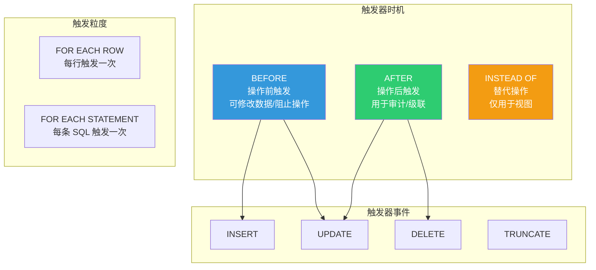

# 存储过程与函数

::: tip 核心观点
PostgreSQL 的函数/存储过程不仅是业务逻辑的载体，更是 PostgREST 等 REST API 框架的核心——PG 函数直接暴露为 HTTP 端点。掌握 PL/pgSQL 和触发器，是深入使用 PG 的必经之路。
:::

## PL/pgSQL 基础

### 函数 vs 存储过程

```sql
-- FUNCTION：必须返回值，可以在 SQL 中调用，不能包含 COMMIT/ROLLBACK（PG 11 前）
-- PROCEDURE（PG 11+）：可以不返回值，可以包含 COMMIT/ROLLBACK，用 CALL 调用

-- 函数示例
CREATE FUNCTION add(a integer, b integer)
RETURNS integer AS $$
BEGIN
    RETURN a + b;
END;
$$ LANGUAGE plpgsql;

SELECT add(1, 2);  -- 3

-- 存储过程示例（PG 11+）
CREATE PROCEDURE transfer_money(
    from_id integer,
    to_id   integer,
    amount  numeric
)
LANGUAGE plpgsql AS $$
BEGIN
    UPDATE accounts SET balance = balance - amount WHERE id = from_id;
    UPDATE accounts SET balance = balance + amount WHERE id = to_id;
    COMMIT;  -- 存储过程内可以提交
END;
$$;

CALL transfer_money(1, 2, 100.00);
```

### 变量声明与赋值

```sql
CREATE FUNCTION demo_variables()
RETURNS text AS $$
DECLARE
    -- 变量声明
    user_name   text;
    user_count  integer := 0;          -- 带默认值
    balance     numeric(10, 2);
    created_at  timestamptz := now();  -- 函数调用作为默认值
    row_data    users%ROWTYPE;         -- 行类型（匹配表结构）
    user_id     users.id%TYPE;         -- 列类型
BEGIN
    -- 赋值
    user_name := 'Alice';

    -- SELECT INTO 赋值
    SELECT name, balance INTO user_name, balance
    FROM accounts WHERE id = 1;

    -- 查询整行
    SELECT * INTO row_data FROM users WHERE id = 1;
    user_name := row_data.name;

    RETURN user_name;
END;
$$ LANGUAGE plpgsql;
```

### 控制流

```sql
CREATE FUNCTION discount_price(
    price    numeric,
    vip_level integer
)
RETURNS numeric AS $$
BEGIN
    -- IF/ELSIF/ELSE
    IF vip_level = 3 THEN
        RETURN price * 0.7;
    ELSIF vip_level = 2 THEN
        RETURN price * 0.8;
    ELSIF vip_level = 1 THEN
        RETURN price * 0.9;
    ELSE
        RETURN price;
    END IF;
END;
$$ LANGUAGE plpgsql;

-- CASE 表达式（更简洁）
CREATE FUNCTION discount_price_v2(
    price    numeric,
    vip_level integer
)
RETURNS numeric AS $$
BEGIN
    RETURN CASE vip_level
        WHEN 3 THEN price * 0.7
        WHEN 2 THEN price * 0.8
        WHEN 1 THEN price * 0.9
        ELSE price
    END;
END;
$$ LANGUAGE plpgsql;
```

### 循环

```sql
CREATE FUNCTION generate_numbers(n integer)
RETURNS integer[] AS $$
DECLARE
    result integer[] := '{}';
    i      integer := 1;
BEGIN
    -- LOOP + EXIT
    LOOP
        result := result || i;
        i := i + 1;
        EXIT WHEN i > n;
    END LOOP;

    -- WHILE 循环
    i := 1;
    WHILE i <= n LOOP
        -- 处理
        i := i + 1;
    END LOOP;

    -- FOR 循环（整数范围）
    FOR i IN 1..n LOOP
        -- 处理
        NULL;
    END LOOP;

    -- FOR IN 循环（查询结果）
    DECLARE
        rec record;
    BEGIN
        FOR rec IN SELECT * FROM users WHERE active = true LOOP
            result := result || rec.id;
        END LOOP;
    END;

    RETURN result;
END;
$$ LANGUAGE plpgsql;
```

## 函数参数与返回值

### OUT/INOUT 参数

```sql
-- OUT 参数：通过参数返回值
CREATE FUNCTION get_user_stats(
    user_id    integer,
    OUT order_count integer,
    OUT total_amount numeric
)
AS $$
BEGIN
    SELECT COUNT(*), COALESCE(SUM(amount), 0)
    INTO order_count, total_amount
    FROM orders
    WHERE orders.user_id = get_user_stats.user_id;
END;
$$ LANGUAGE plpgsql;

SELECT * FROM get_user_stats(1);
-- order_count | total_amount
-- -------------+--------------
--           5 |      2999.00

-- INOUT 参数：既传入又传出
CREATE FUNCTION double_value(val INOUT integer)
AS $$
BEGIN
    val := val * 2;
END;
$$ LANGUAGE plpgsql;
```

### RETURN QUERY

```sql
-- 返回结果集
CREATE FUNCTION get_active_users()
RETURNS SETOF users AS $$
BEGIN
    RETURN QUERY
        SELECT * FROM users WHERE status = 'active';

    -- 也可以逐行返回
    -- RETURN NEXT row_variable;
END;
$$ LANGUAGE plpgsql;

SELECT * FROM get_active_users();

-- 返回自定义类型
CREATE FUNCTION search_products(keyword text)
RETURNS TABLE(id integer, name text, price numeric) AS $$
BEGIN
    RETURN QUERY
        SELECT p.id, p.name, (p.attrs->>'price')::numeric
        FROM products p
        WHERE p.name ILIKE '%' || keyword || '%';
END;
$$ LANGUAGE plpgsql;
```

### 简单 SQL 函数（自动内联）

```sql
-- 纯 SQL 函数会被规划器内联（像宏一样展开），性能最优
CREATE FUNCTION get_user_email(user_id integer)
RETURNS text AS $$
    SELECT email FROM users WHERE id = get_user_email.user_id;
$$ LANGUAGE sql;

-- 等价于直接写子查询，但可复用
SELECT * FROM orders WHERE user_email = get_user_email(1);

-- 复杂 PL/pgSQL 函数不会被内联
-- 只有简单的 SQL 语言函数才会
```

::: tip 优先用 SQL 语言函数
如果逻辑只需要一条 SQL，用 `LANGUAGE sql` 而非 `LANGUAGE plpgsql`：
- SQL 函数可以被规划器内联和优化
- PL/pgSQL 函数是黑盒，规划器无法优化内部
- 参考文档：[SQL Functions vs PL/pgSQL](https://www.postgresql.org/docs/16/xfunc-sql.html)
:::

## 触发器函数

### 触发器类型



### 审计触发器

```sql
-- 审计日志表
CREATE TABLE audit_log (
    id          integer GENERATED ALWAYS AS IDENTITY PRIMARY KEY,
    table_name  text NOT NULL,
    operation   text NOT NULL,     -- INSERT/UPDATE/DELETE
    old_data    jsonb,
    new_data    jsonb,
    changed_by  text DEFAULT current_user,
    changed_at  timestamptz DEFAULT now()
);

-- 通用审计触发器函数
CREATE OR REPLACE FUNCTION audit_trigger_func()
RETURNS trigger AS $$
BEGIN
    IF TG_OP = 'INSERT' THEN
        INSERT INTO audit_log (table_name, operation, new_data)
        VALUES (TG_TABLE_NAME, 'INSERT', to_jsonb(NEW));
        RETURN NEW;
    ELSIF TG_OP = 'UPDATE' THEN
        INSERT INTO audit_log (table_name, operation, old_data, new_data)
        VALUES (TG_TABLE_NAME, 'UPDATE', to_jsonb(OLD), to_jsonb(NEW));
        RETURN NEW;
    ELSIF TG_OP = 'DELETE' THEN
        INSERT INTO audit_log (table_name, operation, old_data)
        VALUES (TG_TABLE_NAME, 'DELETE', to_jsonb(OLD));
        RETURN OLD;
    END IF;
END;
$$ LANGUAGE plpgsql;

-- 绑定触发器
CREATE TRIGGER trg_users_audit
    AFTER INSERT OR UPDATE OR DELETE ON users
    FOR EACH ROW EXECUTE FUNCTION audit_trigger_func();
```

### 自动更新 updated_at

```sql
CREATE OR REPLACE FUNCTION update_updated_at()
RETURNS trigger AS $$
BEGIN
    NEW.updated_at = now();
    RETURN NEW;
END;
$$ LANGUAGE plpgsql;

-- 绑定到需要自动更新的表
CREATE TRIGGER trg_users_updated_at
    BEFORE UPDATE ON users
    FOR EACH ROW
    EXECUTE FUNCTION update_updated_at();

-- 现在每次 UPDATE users，updated_at 自动更新
UPDATE users SET name = 'Alice' WHERE id = 1;
-- updated_at 自动设为 now()
```

### 数据验证触发器

```sql
CREATE OR REPLACE FUNCTION validate_order()
RETURNS trigger AS $$
BEGIN
    -- BEFORE INSERT/UPDATE 验证
    IF NEW.amount <= 0 THEN
        RAISE EXCEPTION 'Order amount must be positive, got %', NEW.amount;
    END IF;

    IF NEW.status NOT IN ('pending', 'paid', 'shipped', 'cancelled') THEN
        RAISE EXCEPTION 'Invalid order status: %', NEW.status;
    END IF;

    -- 状态流转验证
    IF TG_OP = 'UPDATE' AND OLD.status IS DISTINCT FROM NEW.status THEN
        IF NOT (
            (OLD.status = 'pending' AND NEW.status IN ('paid', 'cancelled')) OR
            (OLD.status = 'paid' AND NEW.status IN ('shipped', 'cancelled')) OR
            (OLD.status = 'shipped' AND NEW.status = 'completed')
        ) THEN
            RAISE EXCEPTION 'Invalid status transition: % → %', OLD.status, NEW.status;
        END IF;
    END IF;

    RETURN NEW;
END;
$$ LANGUAGE plpgsql;

CREATE TRIGGER trg_validate_order
    BEFORE INSERT OR UPDATE ON orders
    FOR EACH ROW EXECUTE FUNCTION validate_order();
```

## 异常处理

```sql
CREATE OR REPLACE FUNCTION safe_transfer(
    from_id integer,
    to_id   integer,
    amount  numeric
)
RETURNS boolean AS $$
DECLARE
    from_balance numeric;
BEGIN
    -- 获取转出账户余额并锁定
    SELECT balance INTO from_balance
    FROM accounts WHERE id = from_id
    FOR UPDATE;

    IF from_balance < amount THEN
        RAISE EXCEPTION 'Insufficient balance: % < %', from_balance, amount;
    END IF;

    -- 异常块
    BEGIN
        UPDATE accounts SET balance = balance - amount WHERE id = from_id;
        UPDATE accounts SET balance = balance + amount WHERE id = to_id;
        RETURN true;
    EXCEPTION
        WHEN others THEN
            -- 记录错误，返回 false 而非抛异常
            RAISE NOTICE 'Transfer failed: %', SQLERRM;
            RETURN false;
    END;
END;
$$ LANGUAGE plpgsql;
```

```sql
-- 自定义异常
CREATE OR REPLACE FUNCTION create_order(
    p_user_id integer,
    p_amount  numeric
)
RETURNS integer AS $$
DECLARE
    new_id integer;
BEGIN
    INSERT INTO orders (user_id, amount, status)
    VALUES (p_user_id, p_amount, 'pending')
    RETURNING id INTO new_id;

    -- 使用 RAISE 抛出自定义异常
    IF p_amount > 100000 THEN
        RAISE EXCEPTION 'Order amount too large: %', p_amount
            USING HINT = 'Please contact customer service for large orders',
                  ERRCODE = 'P0001';  -- 自定义错误码
    END IF;

    RETURN new_id;

    EXCEPTION
        WHEN raise_exception THEN
            RAISE NOTICE 'Order creation rejected: %', SQLERRM;
            RETURN NULL;
        WHEN unique_violation THEN
            RAISE NOTICE 'Duplicate order detected';
            RETURN NULL;
END;
$$ LANGUAGE plpgsql;
```

## 游标处理

```sql
CREATE OR REPLACE FUNCTION batch_process_orders(batch_size integer DEFAULT 100)
RETURNS integer AS $$
DECLARE
    cur      CURSOR (limit_val integer) FOR
        SELECT id, user_id, amount FROM orders WHERE status = 'pending' ORDER BY id LIMIT limit_val;
    rec      record;
    processed integer := 0;
BEGIN
    OPEN cur(batch_size);
    LOOP
        FETCH cur INTO rec;
        EXIT WHEN NOT FOUND;

        -- 处理每条订单
        UPDATE orders SET status = 'processing' WHERE id = rec.id;
        -- ... 其他业务逻辑

        processed := processed + 1;
    END LOOP;
    CLOSE cur;

    RETURN processed;
END;
$$ LANGUAGE plpgsql;

-- 简化版：FOR IN 循环自动管理游标
CREATE OR REPLACE FUNCTION batch_process_v2(batch_size integer DEFAULT 100)
RETURNS integer AS $$
DECLARE
    processed integer := 0;
BEGIN
    FOR rec IN
        SELECT id, user_id, amount FROM orders
        WHERE status = 'pending'
        ORDER BY id LIMIT batch_size
        FOR UPDATE SKIP LOCKED
    LOOP
        UPDATE orders SET status = 'processing' WHERE id = rec.id;
        processed := processed + 1;
    END LOOP;

    RETURN processed;
END;
$$ LANGUAGE plpgsql;
```

## 动态 SQL

```sql
CREATE OR REPLACE FUNCTION dynamic_search(
    table_name  text,
    column_name text,
    search_val  text
)
RETURNS jsonb AS $$
DECLARE
    result jsonb;
    query  text;
BEGIN
    -- 使用 format() 防止 SQL 注入（%I = 标识符, %L = 字面量）
    query := format('SELECT json_agg(row_to_json(t)) FROM %I t WHERE %I = %L',
                    table_name, column_name, search_val);

    EXECUTE query INTO result;
    RETURN result;
END;
$$ LANGUAGE plpgsql;

SELECT dynamic_search('users', 'email', 'alice@example.com');

-- USING 参数化查询（更安全）
CREATE OR REPLACE FUNCTION dynamic_search_safe(
    p_user_id integer,
    p_status  text
)
RETURNS SETOF orders AS $$
BEGIN
    RETURN QUERY EXECUTE
        'SELECT * FROM orders WHERE user_id = $1 AND status = $2'
    USING p_user_id, p_status;
END;
$$ LANGUAGE plpgsql;
```

::: warning SQL 注入防护
- **永远不要**直接拼接 SQL 字符串：`'SELECT * FROM ' || table_name`
- 使用 `format()` 的 `%I`（标识符）和 `%L`（字面量）
- 使用 `EXECUTE ... USING` 参数化查询
- 参考文档：[Dynamic SQL](https://www.postgresql.org/docs/16/plpgsql-statements.html#PLPGSQL-STATEMENTS-EXECUTING-DYN)
:::

## 事务控制（PG 11+ PROCEDURE）

```sql
-- 只有 PROCEDURE 可以包含 COMMIT/ROLLBACK
-- FUNCTION 不行

CREATE PROCEDURE process_monthly_report(
    p_month date
)
LANGUAGE plpgsql AS $$
DECLARE
    report_id integer;
BEGIN
    -- 步骤1：创建报告头
    INSERT INTO reports (month, status) VALUES (p_month, 'processing')
    RETURNING id INTO report_id;

    COMMIT;  -- 中间提交，其他会话可以看到

    -- 步骤2：聚合数据
    INSERT INTO report_data (report_id, category, total)
    SELECT report_id, category, SUM(amount)
    FROM orders
    WHERE date_trunc('month', created_at) = p_month
    GROUP BY category;

    COMMIT;  -- 再次提交

    -- 步骤3：标记完成
    UPDATE reports SET status = 'completed' WHERE id = report_id;

    EXCEPTION
        WHEN others THEN
            UPDATE reports SET status = 'failed', error_msg = SQLERRM
            WHERE id = report_id;
            COMMIT;  -- 异常中也可以提交
            RAISE;
END;
$$;

CALL process_monthly_report('2025-06-01');
```

## PostgREST 与 PG 函数

[PostgREST](https://github.com/PostgREST/postgrest) 将 PG 函数直接暴露为 HTTP API 端点：

```sql
-- 定义一个 API 函数
CREATE OR REPLACE FUNCTION get_user_orders(
    p_user_id integer DEFAULT NULL,
    p_status  text DEFAULT NULL,
    p_limit   integer DEFAULT 50
)
RETURNS TABLE(
    order_id    integer,
    user_name   text,
    amount      numeric,
    status      text,
    created_at  timestamptz
)
LANGUAGE sql STABLE AS $$
    SELECT o.id, u.name, o.amount, o.status, o.created_at
    FROM orders o
    JOIN users u ON o.user_id = u.id
    WHERE (p_user_id IS NULL OR o.user_id = p_user_id)
      AND (p_status IS NULL OR o.status = p_status)
    ORDER BY o.created_at DESC
    LIMIT p_limit;
$$;
```

```
# PostgREST 自动将函数映射为 API
GET /rpc/get_user_orders?p_user_id=1&p_status=paid&p_limit=10

# 等价于
SELECT * FROM get_user_orders(1, 'paid', 10);
```

```sql
-- 写操作函数（非 STABLE，可修改数据）
CREATE OR REPLACE FUNCTION place_order(
    p_user_id  integer,
    p_product_id integer,
    p_quantity integer
)
RETURNS jsonb
LANGUAGE plpgsql AS $$
DECLARE
    product_price numeric;
    order_id      integer;
    result        jsonb;
BEGIN
    -- 检查库存并锁定
    SELECT price INTO product_price
    FROM products WHERE id = p_product_id
    FOR UPDATE;

    IF NOT FOUND THEN
        RAISE EXCEPTION 'Product not found';
    END IF;

    -- 创建订单
    INSERT INTO orders (user_id, amount, status)
    VALUES (p_user_id, product_price * p_quantity, 'pending')
    RETURNING id INTO order_id;

    -- 扣减库存
    UPDATE products SET stock = stock - p_quantity
    WHERE id = p_product_id AND stock >= p_quantity;

    IF NOT FOUND THEN
        RAISE EXCEPTION 'Insufficient stock';
    END IF;

    result := jsonb_build_object(
        'order_id', order_id,
        'amount', product_price * p_quantity,
        'status', 'pending'
    );

    RETURN result;
END;
$$;
```

```
# PostgREST 调用
POST /rpc/place_order
Content-Type: application/json

{
    "p_user_id": 1,
    "p_product_id": 42,
    "p_quantity": 2
}

# 返回
{
    "order_id": 123,
    "amount": 29998.00,
    "status": "pending"
}
```

::: tip PostgREST 函数最佳实践
1. **读函数**用 `LANGUAGE sql STABLE`：可被规划器优化，PostgREST 可缓存
2. **写函数**用 `LANGUAGE plpgsql`：需要事务控制和错误处理
3. **参数用默认值**：让 PostgREST 可以部分传参
4. **返回 jsonb**：灵活构造 API 响应格式
5. 参考文档：[PostgREST Stored Procedures](https://postgrest.org/en/stable/references/api/stored_procedures.html)
:::

## 面试技巧

::: tip 面试高频问题
1. **FUNCTION 和 PROCEDURE 的区别？**
   - FUNCTION：必须返回值，可在 SQL 中调用，不能 COMMIT/ROLLBACK
   - PROCEDURE（PG 11+）：可不返回值，用 CALL 调用，可 COMMIT/ROLLBACK
   - PROCEDURE 适合多步骤批处理，需要中间提交的场景

2. **BEFORE 和 AFTER 触发器怎么选？**
   - BEFORE：需要修改/验证数据（改 NEW、阻止操作）
   - AFTER：审计日志、通知、级联操作（不修改数据本身）

3. **动态 SQL 怎么防注入？**
   - 用 `format()` 的 `%I` 和 `%L`
   - 用 `EXECUTE ... USING` 参数化
   - 永远不要直接拼接字符串

4. **SQL 函数和 PL/pgSQL 函数的性能区别？**
   - 简单 SQL 函数可被规划器内联（最优）
   - PL/pgSQL 函数是黑盒，规划器无法优化内部
   - 能用 SQL 就不用 PL/pgSQL

5. **PostgREST 如何使用 PG 函数？**
   - 函数自动映射为 `/rpc/function_name` 端点
   - 参数通过 query string 或 JSON body 传递
   - STABLE 函数用 GET，非 STABLE 用 POST
:::

## 参考资料

- [PostgreSQL 官方文档 - PL/pgSQL](https://www.postgresql.org/docs/16/plpgsql.html)
- [PostgreSQL 官方文档 - Triggers](https://www.postgresql.org/docs/16/triggers.html)
- [PostgreSQL 官方文档 - CREATE FUNCTION](https://www.postgresql.org/docs/16/sql-createfunction.html)
- [PostgREST Stored Procedures](https://postgrest.org/en/stable/references/api/stored_procedures.html)
- [Supabase GitHub](https://github.com/supabase/supabase)
- [PostgREST GitHub](https://github.com/PostgREST/postgrest)
