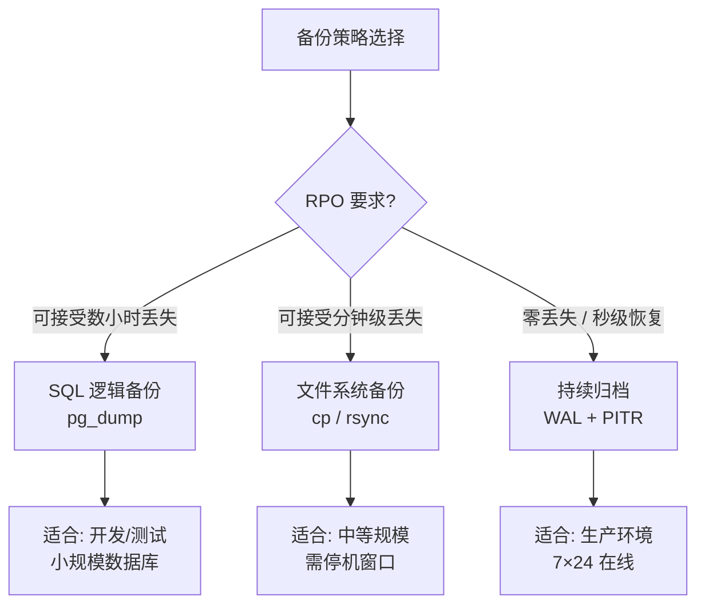
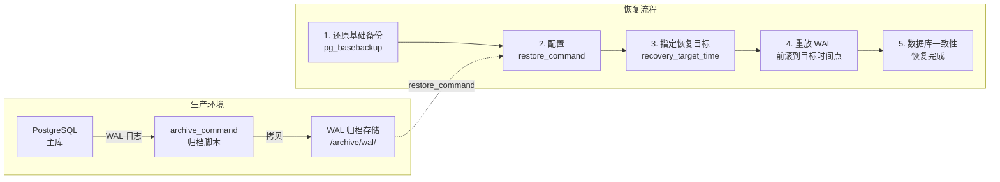
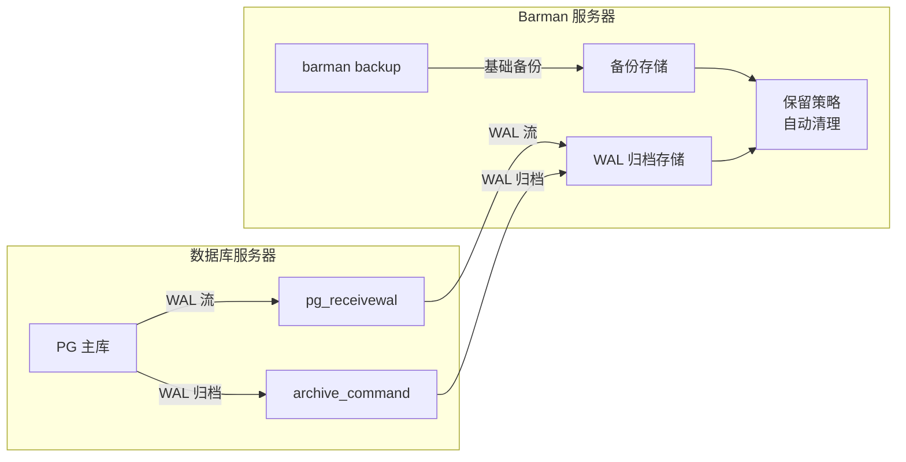

# 备份与恢复

数据是企业的核心资产，备份是最后一道防线。PostgreSQL 提供了三种互补的备份策略，从逻辑导出到物理拷贝再到时间点恢复，覆盖从开发环境到金融级生产系统的全部场景。



## 一、SQL 逻辑备份

逻辑备份将数据库内容导出为 SQL 文本或自定义格式文件，最灵活、最易上手，是日常运维的标配工具。

### 1.1 pg_dump —— 单库备份

`pg_dump` 是最常用的逻辑备份工具，支持四种输出格式：

| 格式 | 参数 | 特点 | 还原工具 |
|------|------|------|----------|
| 纯 SQL 文本 | `-Fp`（默认） | 可读、可编辑、可 grep | `psql` |
| 自定义格式 | `-Fc` | 压缩、支持并行还原、可选择性还原 | `pg_restore` |
| 目录格式 | `-Fd` | 每张表一个文件、支持并行备份和还原 | `pg_restore` |
| tar 归档 | `-Ft` | 单文件打包、不支持并行 | `pg_restore` |

```bash
# 纯 SQL 文本备份（默认格式）
pg_dump -h 127.0.0.1 -U postgres -d mydb -Fp -f /backup/mydb.sql

# 自定义格式（推荐，支持并行还原和选择性还原）
pg_dump -h 127.0.0.1 -U postgres -d mydb -Fc -f /backup/mydb.dump

# 目录格式（支持并行备份，大库首选）
pg_dump -h 127.0.0.1 -U postgres -d mydb -Fd -j 4 -f /backup/mydb_dir/

# tar 格式
pg_dump -h 127.0.0.1 -U postgres -d mydb -Ft -f /backup/mydb.tar
```

::: tip 格式选择建议
- **小库（< 50 GB）**：`-Fc` 自定义格式，压缩好、还原灵活
- **大库（≥ 50 GB）**：`-Fd` 目录格式，可并行备份和还原，显著缩短时间
- **需要人工审查或跨版本迁移**：`-Fp` 纯文本，可读可编辑
:::

### 1.2 pg_dumpall —— 全实例备份

`pg_dump` 只备份单个数据库，而 `pg_dumpall` 备份整个实例：所有数据库 + 全局对象（角色、表空间、权限）。

```bash
# 备份全局对象（角色和表空间）
pg_dumpall -h 127.0.0.1 -U postgres -g -f /backup/globals.sql

# 备份整个实例（所有数据库 + 全局对象）
pg_dumpall -h 127.0.0.1 -U postgres -f /backup/cluster.sql
```

::: warning pg_dumpall 的局限
`pg_dumpall` 只能输出纯文本格式，不支持并行。大型实例建议拆分为：`pg_dumpall -g` 导全局对象 + `pg_dump -Fc` 逐库备份。
:::

### 1.3 pg_restore —— 还原与并行

`pg_restore` 配合 `-Fc` / `-Fd` / `-Ft` 格式使用，核心优势是**并行还原**和**选择性还原**。

```bash
# 并行还原（4 个并发 worker，大幅缩短还原时间）
pg_restore -h 127.0.0.1 -U postgres -d mydb -j 4 /backup/mydb.dump

# 只还原指定的表
pg_restore -h 127.0.0.1 -U postgres -d mydb -t orders /backup/mydb.dump

# 只还原指定的 schema
pg_restore -h 127.0.0.1 -U postgres -d mydb -n sales /backup/mydb.dump

# 生成 SQL 脚本而不执行（用于审查）
pg_restore --format=plain /backup/mydb.dump > review.sql
```

```bash
# 完整恢复流程：先还原全局对象，再还原数据库
psql -h 127.0.0.1 -U postgres -f /backup/globals.sql
pg_restore -h 127.0.0.1 -U postgres -d mydb -j 4 /backup/mydb.dump
```

## 二、文件系统级别备份

文件系统备份直接拷贝 PGDATA 目录下的数据文件，速度比逻辑备份快，但需要**停机或使用一致性快照**。

### 2.1 冷备份（停机拷贝）

```bash
# 1. 停止 PostgreSQL
pg_ctl -D /var/lib/postgresql/16/main stop

# 2. 拷贝数据目录
cp -r /var/lib/postgresql/16/main /backup/pg_cold_20260604/

# 或使用 rsync（增量同步更高效）
rsync -avz /var/lib/postgresql/16/main/ /backup/pg_cold_20260604/

# 3. 启动 PostgreSQL
pg_ctl -D /var/lib/postgresql/16/main start
```

### 2.2 热备份（一致性快照）

如果存储支持快照（LVM、ZFS、AWS EBS、云盘快照），可在不停机的情况下获取一致性备份：

```bash
# 1. 执行 pg_start_backup 标记一致性点
psql -c "SELECT pg_start_backup('snapshot_20260604', true);"

# 2. 创建存储快照（以 LVM 为例）
lvcreate -L 50G -s -n pg_snap /dev/vg0/pgdata

# 3. 结束备份模式
psql -c "SELECT pg_stop_backup();"
```

::: important 快照备份的前提
1. 必须开启 WAL 归档（`archive_mode = on`），快照 + WAL 归档才能保证一致性恢复
2. `pg_start_backup` 期间会触发一次 checkpoint，可能影响性能
3. 快照恢复后还需要重放 WAL 日志到一致性状态
:::

## 三、持续归档与时间点恢复（PITR）

持续归档是 PostgreSQL 最强大的备份方案：通过归档 WAL 日志，可以将数据库恢复到**任意时间点**，实现秒级 RPO。



### 3.1 开启 WAL 归档

```ini
# postgresql.conf
wal_level = replica              # 至少 replica 级别
archive_mode = on                # 开启归档
archive_command = 'cp %p /archive/wal/%f'  # 归档命令
# %p = WAL 文件路径, %f = WAL 文件名
```

更可靠的归档脚本（含压缩和校验）：

```bash
#!/bin/bash
# /usr/local/bin/pg_archive.sh
ARCHIVE_DIR="/archive/wal"
WAL_PATH="$1"
WAL_FILE="$2"

# 压缩归档
gzip -c "${WAL_PATH}" > "${ARCHIVE_DIR}/${WAL_FILE}.gz"

# 校验
if [ $? -eq 0 ]; then
    echo "Archive success: ${WAL_FILE}"
    exit 0
else
    echo "Archive failed: ${WAL_FILE}"
    exit 1
fi
```

```ini
# postgresql.conf
archive_command = '/usr/local/bin/pg_archive.sh %p %f'
```

### 3.2 基础备份 —— pg_basebackup

`pg_basebackup` 是制作基础备份的标准工具，它在线执行，不影响业务运行：

```bash
# 创建基础备份
pg_basebackup -h 127.0.0.1 -U replicator \
    -D /backup/base_20260604 \
    -Ft -z -P \
    --checkpoint=fast

# 参数说明：
# -D    输出目录
# -Ft   tar 格式输出
# -z    gzip 压缩
# -P    显示进度
# --checkpoint=fast  立即 checkpoint，减少等待
```

### 3.3 时间点恢复（PITR）

当发生误操作（如误删表、误更新数据），可以将数据库恢复到灾难发生前的精确时间点：

```bash
# 1. 停止数据库
pg_ctl -D /var/lib/postgresql/16/main stop

# 2. 清空数据目录，还原基础备份
rm -rf /var/lib/postgresql/16/main/*
tar xzf /backup/base_20260604/base.tar.gz -C /var/lib/postgresql/16/main/

# 3. 创建 recovery 配置（PostgreSQL 12+ 使用 postgresql.conf + recovery.signal）
cat >> /var/lib/postgresql/16/main/postgresql.conf <<EOF
restore_command = 'gunzip -c /archive/wal/%f.gz > %p'
recovery_target_time = '2026-06-04 14:30:00+08'
recovery_target_action = 'promote'
EOF

touch /var/lib/postgresql/16/main/recovery.signal

# 4. 启动数据库，自动进入恢复模式
pg_ctl -D /var/lib/postgresql/16/main start
```

```sql
-- 检查恢复状态
SELECT pg_is_in_recovery();

-- 确认恢复到的时间点
SELECT pg_last_xact_replay_timestamp();
```

::: tip recovery_target 选项
- `recovery_target_time`：恢复到指定时间点
- `recovery_target_xid`：恢复到指定事务 ID
- `recovery_target_lsn`：恢复到指定 LSN
- `recovery_target_name`：恢复到命名的还原点（`pg_create_restore_point()`）
- `recovery_target_inclusive`：是否包含目标事务（默认 true）
:::

### 3.4 保留归档的策略

WAL 归档文件会持续增长，需要定期清理：

```bash
# 使用 pg_archivecleanup 清理过期的归档文件
# 保留基础备份之后的所有 WAL，删除更早的
pg_archivecleanup /archive/wal 000000010000000000000010
```

## 四、Barman —— 企业级备份方案

[Barman](https://www.pgbarman.org/) 是 PostgreSQL 社区最成熟的企业级备份管理工具，支持远程备份、多服务器管理、自动保留策略。



```ini
# /etc/barman.d/pg_main.conf
[pg_main]
description = "Production PostgreSQL"
conninfo = host=192.168.1.10 user=barman dbname=postgres
ssh_command = ssh barman@192.168.1.10
retention_policy = RECOVERY WINDOW OF 7 DAYS
wal_retention_policy = MAIN
compression = gzip
```

```bash
# 执行备份
barman backup pg_main

# 查看备份列表
barman list-backup pg_main

# 查看备份详情
barman show-backup pg_main latest

# 校验备份完整性
barman check pg_main

# 恢复到指定时间点
barman recover --target-time "2026-06-04 14:30:00" \
    pg_main latest /var/lib/postgresql/16/recovery
```

::: important Barman 核心优势
1. **集中管理**：一台 Barman 服务器管理多台 PG 实例的备份
2. **流式 WAL 接收**：`pg_receivewal` 实时接收 WAL，避免归档延迟
3. **备份验证**：`barman check` 自动检测备份可用性
4. **保留策略**：自动清理过期备份和 WAL
5. **增量备份**（Barman 3.x）：基于 page-level 增量，大幅缩短备份时间
:::

## 五、备份验证

未经验证的备份等于没有备份。备份验证应纳入日常运维流程。

### 5.1 自动验证脚本

```bash
#!/bin/bash
# /usr/local/bin/pg_verify_backup.sh
BACKUP_DIR="/backup/mydb_dir"
PGHOST="127.0.0.1"
PGUSER="postgres"
PGDB="verify_test"
DATE=$(date +%Y%m%d)

echo "[$(date)] Starting backup verification..."

# 1. 创建临时验证库
createdb -h $PGHOST -U $PGUSER ${PGDB}_${DATE}

# 2. 还原备份到临时库
pg_restore -h $PGHOST -U $PGUSER -d ${PGDB}_${DATE} -j 4 $BACKUP_DIR

# 3. 检查关键表行数
psql -h $PGHOST -U $PGUSER -d ${PGDB}_${DATE} -c "
    SELECT 'orders' AS tbl, COUNT(*) FROM orders
    UNION ALL
    SELECT 'users', COUNT(*) FROM users
    UNION ALL
    SELECT 'products', COUNT(*) FROM products;
"

# 4. 清理
dropdb -h $PGHOST -U $PGUSER ${PGDB}_${DATE}

echo "[$(date)] Verification complete."
```

### 5.2 pg_verifybackup（PostgreSQL 12+）

PostgreSQL 内置的备份验证工具，检查文件完整性和 WAL 一致性：

```bash
# 验证基础备份文件完整性
pg_verifybackup /backup/base_20260604/

# 输出示例：
# backup successfully verified
```

## 六、三大策略对比

| 特性 | SQL 逻辑备份 | 文件系统备份 | 持续归档 PITR |
|------|-------------|-------------|--------------|
| 备份粒度 | 表/库/实例 | 整个实例 | 整个实例 |
| 恢复粒度 | 单表/单库/全库 | 全库 | 全库 + 时间点 |
| 一致性 | 一致性快照 | 需停机或快照 | 任意时间点一致 |
| 在线执行 | 是 | 需配合 | 是 |
| RPO | 小时级 | 小时级 | 秒级 |
| 存储开销 | 中（压缩） | 大（全量） | 中（增量 WAL） |
| 操作复杂度 | 低 | 中 | 高 |
| 适用场景 | 开发/测试/小库 | 中等规模 | 生产/关键业务 |

::: warning 生产环境最佳实践
1. **必须开启 WAL 归档**——无论使用哪种备份策略
2. **定期验证备份**——至少每月一次完整恢复演练
3. **3-2-1 原则**：3 份备份、2 种介质、1 份异地
4. **监控归档延迟**——`pg_stat_archiver` 检查归档是否正常
5. **自动化**——使用 Barman 或自建脚本，避免人工遗漏
:::

## 开源参考

| 项目 | 说明 |
|------|------|
| [Supabase](https://github.com/supabase/supabase) | 基于 PG 的开源 Firebase，底层依赖 PITR 实现数据恢复 |
| [PostgREST](https://github.com/PostgREST/postgrest) | PG 自动 REST API，逻辑备份可完整导出其依赖的 schema |

## 面试技巧

::: tip 面试高频问题
1. **pg_dump 四种格式的区别？** 重点回答 `-Fc` 支持并行还原、`-Fd` 支持并行备份——这是区分"背了参数"还是"实际用过"的关键。

2. **PITR 的原理？** 核心是 WAL 归档 + 基础备份。基础备份是起点，WAL 是增量，恢复时先还原基础备份再前放 WAL 到目标时间点。提一句 `recovery_target_time` 和 `recovery_target_xid` 的区别更佳。

3. **如何保证备份可用？** 一定要提"定期恢复演练"和 `pg_verifybackup`。很多候选人只说"做了备份"不说"验证过"，这是减分项。

4. **逻辑备份 vs 物理备份的选择？** 逻辑备份灵活（可选择性还原）但慢；物理备份快但粒度粗。生产环境通常两者结合：物理备份为主，逻辑备份为辅。

5. **WAL 归档和流复制的区别？** WAL 归档是"备份场景"——持久化到存储；流复制是"高可用场景"——实时传输到备库。两者底层都是 WAL，但用途不同。
:::
