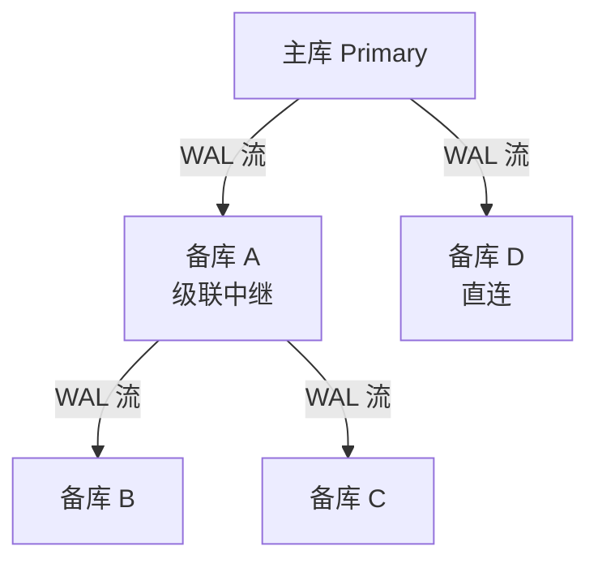
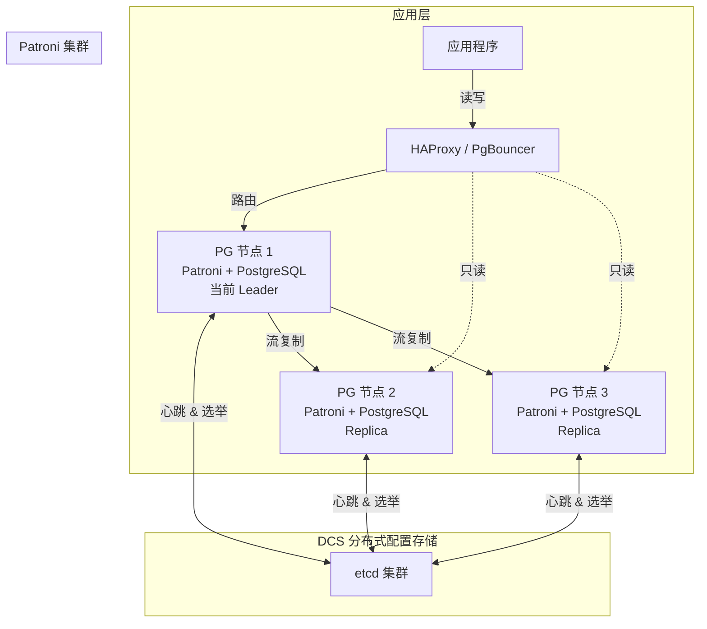

# 流复制与高可用

单机运行意味着单点故障——硬件损坏、网络中断、人为误操作都可能让业务停摆。PostgreSQL 的流复制（Streaming Replication）是实现高可用的基石，配合 Patroni 等编排工具，可以做到自动故障转移、近乎零停机。

## 一、流复制基础

流复制是 PostgreSQL 原生的物理复制方案：主库（Primary）持续将 WAL 记录流式传输到备库（Standby），备库重放 WAL 以保持数据同步。


### 1.1 搭建流复制

**主库配置：**

```ini
# postgresql.conf（主库）
listen_addresses = '*'
wal_level = replica
max_wal_senders = 10          # 最大 WAL 发送进程数
wal_keep_size = '1GB'         # 保留 WAL 大小，防止备库落后太多
hot_standby = on              # 允许备库只读查询（主库也设上，方便日后切换）
```

```ini
# pg_hba.conf（主库）—— 允许复制连接
host    replication     replicator      192.168.1.0/24    md5
```

**创建复制用户：**

```sql
CREATE ROLE replicator WITH REPLICATION LOGIN PASSWORD 'secure_password';
```

**备库初始化：**

```bash
# 使用 pg_basebackup 从主库拉取基础备份
pg_basebackup -h 192.168.1.10 -U replicator \
    -D /var/lib/postgresql/16/main \
    -Fp -Xs -P -R

# -R 参数自动创建 standby.signal 和配置连接信息
# 生成的 postgresql.auto.conf 内容如下：
# primary_conninfo = 'user=replicator password=secure_password host=192.168.1.10 port=5432'
```

启动备库后，它会自动连接主库开始接收 WAL 流。

### 1.2 验证复制状态

```sql
-- 主库执行：查看连接的备库
SELECT pid, state, client_addr, sync_state, sent_lsn, write_lsn, flush_lsn, replay_lsn
FROM pg_stat_replication;

--  pid  |  state  | client_addr  | sync_state | sent_lsn  | write_lsn | flush_lsn | replay_lsn
-- ------+---------+--------------+------------+-----------+-----------+-----------+-----------
--  1234 | streaming | 192.168.1.11 | async      | 0/5000060 | 0/5000060 | 0/5000060 | 0/5000060
```

```sql
-- 备库执行：查看接收和重放状态
SELECT pg_is_in_recovery();  -- 应返回 t（true）

SELECT status, sender_host, sender_port, received_lsn, latest_end_lsn
FROM pg_stat_wal_receiver;
```

## 二、同步 vs 异步复制


| 特性 | 异步复制 | 同步复制 |
|------|---------|---------|
| 主库性能影响 | 无 | 有（等待备库确认） |
| 数据一致性 | 可能丢失最近事务 | 零数据丢失 |
| RPO | 亚秒级到秒级 | 零 |
| 适用场景 | 报表、读扩展 | 金融、交易 |

### 2.1 配置同步复制

```ini
# postgresql.conf（主库）
synchronous_commit = on                    # 同步提交级别
synchronous_standby_names = 'standby01'    # 同步备库名称

# 多备库：FIRST 2 (standby01, standby02, standby03)
# 含义：至少 2 个备库确认后才返回成功
synchronous_standby_names = 'FIRST 2 (standby01, standby02, standby03)'
```

### 2.2 synchronous_commit 的五个级别

```sql
-- 从最高一致性到最高性能：
-- remote_apply  : 备库重放完成（最强一致，最慢）
-- remote_write  : 备库写入 OS 缓存（推荐，平衡点）
-- on            : 备库 WAL flush 到磁盘（同步复制默认）
-- local         : 仅主库 WAL flush（异步复制默认）
-- off           : 主库也异步（极端性能，危险）

-- 可在会话级别调整，灵活控制一致性要求
SET synchronous_commit = remote_write;
```

::: tip 生产环境建议
- **核心交易库**：`synchronous_commit = on` + 至少 1 个同步备库
- **报表/读扩展**：`synchronous_commit = local` + 异步备库
- **灵活策略**：默认 `local`，关键事务会话级 `SET synchronous_commit = on`
:::

## 三、热备（Hot Standby）

开启 `hot_standby = on` 后，备库可以执行只读查询，实现**读写分离**：

```sql
-- 备库上可执行的查询
SELECT * FROM orders WHERE created_at > '2026-06-01';
SELECT COUNT(*) FROM users;
EXPLAIN ANALYZE SELECT * FROM products WHERE category = 'electronics';

-- 备库上禁止的操作
INSERT INTO orders (...) VALUES (...);   -- ERROR: cannot execute INSERT in a read-only transaction
CREATE TABLE new_table (...);           -- ERROR: cannot execute CREATE TABLE in a read-only transaction
```

### 3.1 冲突处理

备库上的长查询可能与 WAL 重放产生冲突（例如主库 DROP TABLE 时备库正在查询该表）：

```ini
# postgresql.conf（备库）
max_standby_streaming_delay = 30s    # 等待冲突查询的最长时间
hot_standby_feedback = on            # 向主库反馈备库最小xmin，减少冲突
```

::: warning 热备冲突取舍
- `max_standby_streaming_delay` 设太短：备库查询频繁被取消
- 设太长：备库延迟增大，与主库数据差距拉大
- `hot_standby_feedback = on` 可以减少冲突，但可能导致主库无法清理死元组（膨胀）
:::

## 四、级联复制

当备库数量较多时，所有备库直接连主库会给主库带来压力。级联复制让备库充当"中继"，将 WAL 继续转发给下游备库。



```ini
# 级联中继备库（备库 A）的 postgresql.conf
max_wal_senders = 5    # 允许下游备库连接
```

## 五、复制槽（Replication Slot）

复制槽确保主库保留足够的 WAL，直到所有备库都接收完毕，防止备库落后太多后无法追上：

```sql
-- 创建复制槽
SELECT pg_create_physical_replication_slot('standby01_slot');

-- 查看复制槽
SELECT slot_name, slot_type, active, restart_lsn
FROM pg_replication_slots;

-- 删除不再使用的复制槽（重要！）
SELECT pg_drop_replication_slot('standby01_slot');
```

::: warning 复制槽的危险
如果备库长时间断开，复制槽会阻止 WAL 清理，导致主库 WAL 堆积、磁盘满！必须监控 `pg_replication_slots`，对不活跃的槽及时处理。

PostgreSQL 13+ 可设置最大保留 WAL 大小：
```ini
max_slot_wal_keep_size = '10GB'   # 超过则使失效的复制槽失效
```
:::

## 六、Patroni —— 自动化高可用

手动管理故障转移容易出错且响应慢。[Patroni](https://github.com/patroni/patroni) 是最流行的 PostgreSQL 高可用编排工具，配合分布式配置存储（etcd / ZooKeeper / Consul），实现自动选主、故障转移、一致性保证。



### 6.1 Patroni 配置示例

```yaml
# /etc/patroni/config.yml
scope: pg-cluster
name: node1

restapi:
  listen: 0.0.0.0:8008

etcd:
  hosts: 192.168.1.100:2379

bootstrap:
  dcs:
    ttl: 30
    loop_wait: 10
    retry_timeout: 10
    maximum_lag_on_failover: 1048576
    postgresql:
      use_pg_rewind: true
      use_slots: true
      parameters:
        wal_level: replica
        hot_standby: "on"
        max_wal_senders: 10
        max_replication_slots: 10
        wal_log_hints: "on"

postgresql:
  listen: 0.0.0.0:5432
  data_dir: /var/lib/postgresql/16/main
  authentication:
    superuser:
      username: postgres
      password: superuser_secret
    replication:
      username: replicator
      password: replicator_secret

tags:
  nofailover: false
  noloadbalance: false
  clonefrom: false
```

### 6.2 常用 Patroni 操作

```bash
# 查看集群状态
patronictl -c /etc/patroni/config.yml list

# +---------+--------+---------+----+-----------+
# | Cluster | Member | Host    | RL | Pending   |
# +---------+--------+---------+----+-----------+
# | pg-cluster | node1 | 10.0.0.1 | Leader |    |
# | pg-cluster | node2 | 10.0.0.2 | Replica |    |
# | pg-cluster | node3 | 10.0.0.3 | Replica |    |
# +---------+--------+---------+----+-----------+

# 计划切换（Switchover）
patronictl -c /etc/patroni/config.yml switchover

# 手动故障转移（Failover）
patronictl -c /etc/patroni/config.yml failover

# 重新加载配置
patronictl -c /etc/patroni/config.yml reload pg-cluster
```

### 6.3 Switchover vs Failover

| 操作 | 场景 | 数据风险 | 停机时间 |
|------|------|---------|---------|
| Switchover | 计划维护（升级、补丁） | 无 | 秒级 |
| Failover | 主库不可用（硬件故障） | 异步复制可能丢失少量事务 | 秒级到分钟级 |

## 七、连接路由

应用不应直连数据库节点，而应通过代理层路由，实现故障自动切换和读写分离。

### 7.1 HAProxy 配置

```ini
# /etc/haproxy/haproxy.cfg
listen pg_write
    bind *:5000
    option httpchk GET /primary
    http-check expect status 200
    default-server inter 3s fall 3 rise 2 on-marked-down shutdown-sessions
    server node1 192.168.1.1:5432 maxconn 300 check port 8008
    server node2 192.168.1.2:5432 maxconn 300 check port 8008
    server node3 192.168.1.3:5432 maxconn 300 check port 8008

listen pg_read
    bind *:5001
    option httpchk GET /replica
    http-check expect status 200
    balance roundrobin
    default-server inter 3s fall 3 rise 2 on-marked-down shutdown-sessions
    server node2 192.168.1.2:5432 maxconn 300 check port 8008
    server node3 192.168.1.3:5432 maxconn 300 check port 8008
```

### 7.2 PgBouncer 连接池

PgBouncer 不仅是连接池，也能做简单的路由：

```ini
# pgbouncer.ini
[databases]
; 写入 → 主库
pg_write = host=192.168.1.1 port=5432 dbname=mydb

; 读取 → 备库（可配置多个实现负载均衡）
pg_read = host=192.168.1.2 port=5432 dbname=mydb

[pgbouncer]
pool_mode = transaction
max_client_conn = 1000
default_pool_size = 20
reserve_pool_size = 5
```

::: tip PgBouncer 池化模式
- **session 模式**：会话结束才释放连接，兼容性最好，但池化效果差
- **transaction 模式**（推荐）：事务结束即释放连接，适合大多数 Web 应用
- **statement 模式**：语句结束即释放，最省连接，但不支持事务内多语句
:::

## 八、监控复制延迟

复制延迟是高可用架构的核心指标，延迟过大会影响故障转移决策和数据一致性。

```sql
-- 方法1：主库查看发送和重放的 LSN 差距
SELECT client_addr, sync_state,
       sent_lsn, write_lsn, flush_lsn, replay_lsn,
       pg_wal_lsn_diff(sent_lsn, replay_lsn) AS replay_lag_bytes
FROM pg_stat_replication;

-- 方法2：备库自测延迟
SELECT now() - pg_last_xact_replay_timestamp() AS replay_delay;

-- 方法3：使用 pg_stat_replication 的发送时间
SELECT client_addr,
       pg_wal_lsn_diff(pg_current_wal_lsn(), replay_lsn) AS lag_bytes,
       pg_wal_lsn_diff(pg_current_wal_lsn(), sent_lsn) AS send_lag_bytes
FROM pg_stat_replication;
```

```bash
# Prometheus postgres_exporter 监控指标
# pg_replication_lag_seconds
# pg_replication_is_replica
# pg_replication_slots_active
```

::: important 延迟告警阈值建议
- **警告**：延迟 > 5 秒或 > 10 MB
- **严重**：延迟 > 30 秒或 > 100 MB
- **紧急**：延迟 > 60 秒或复制中断
:::

## 开源参考

| 项目 | 说明 |
|------|------|
| [Patroni](https://github.com/patroni/patroni) | PostgreSQL 高可用编排，etcd 选举 + 自动故障转移 |
| [Supabase](https://github.com/supabase/supabase) | 基于 PG 的开源 Firebase，内部使用流复制实现高可用 |
| [PostgREST](https://github.com/PostgREST/postgrest) | PG 自动 REST API，配合 HAProxy 可实现读写分离 |

## 面试技巧

::: tip 面试高频问题
1. **同步和异步复制怎么选？** 核心在于 RPO 要求：零丢失选同步，亚秒级可接受选异步。提一句 `synchronous_commit` 的会话级设置是加分项——说明你知道可以在同一集群内混用。

2. **流复制的原理？** 主库 walsender 进程 → TCP → 备库 walreceiver 进程 → 写本地 WAL → startup 进程重放。能画出这张架构图基本稳了。

3. **Patroni 如何保证脑裂不发生？** 依赖 DCS（etcd）的 Leader 选举：同一时刻只有一个节点能获得 Leader 锁。如果 DCS 不可达，Patroni 会主动降级，不会自封为主库。

4. **复制槽有什么风险？** 备库宕机时复制槽阻止 WAL 清理，磁盘会满。必须监控 + 设置 `max_slot_wal_keep_size`。这个问题区分度很高。

5. **热备查询和 WAL 重放冲突怎么办？** `max_standby_streaming_delay` 控制等待时间，`hot_standby_feedback = on` 让主库感知备库xmin。能说出这两点说明有实操经验。
:::
