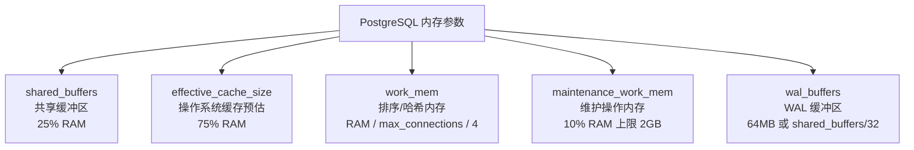
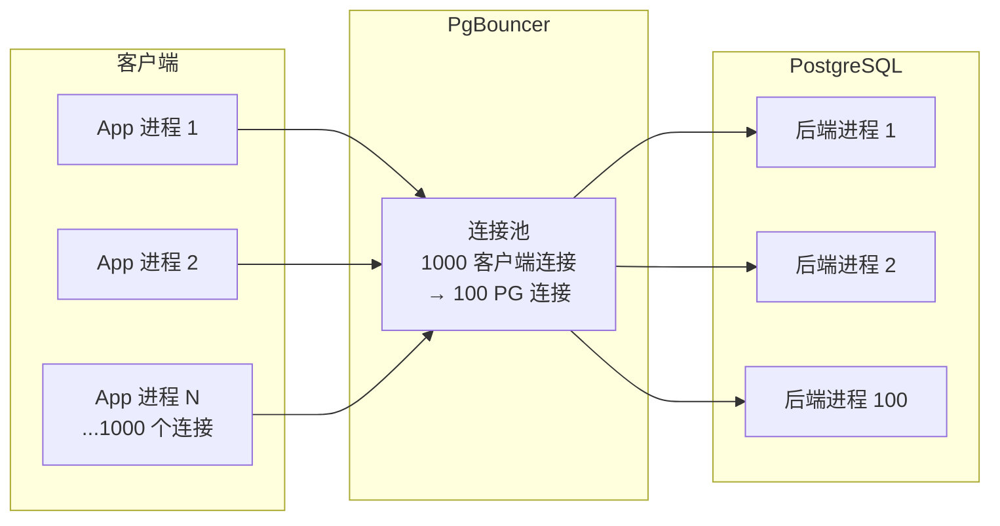

# 性能调优

"数据库慢"往往不是数据库本身的问题，而是配置不合理、查询未优化、连接管理混乱的综合结果。PostgreSQL 提供了丰富的观测工具和调优参数，本篇从**观测 → 参数 → 连接池 → 案例**四步走，建立系统化的调优方法论。

## 一、观测先行 —— pg_stat_statements

调优的第一步不是改参数，而是**找到瓶颈**。`pg_stat_statements` 是 PostgreSQL 最重要的性能观测扩展。

### 1.1 启用 pg_stat_statements

```ini
# postgresql.conf
shared_preload_libraries = 'pg_stat_statements'
pg_stat_statements.max = 10000       # 最多记录多少条 SQL
pg_stat_statements.track = all       # 跟踪所有 SQL（含 PL/pgSQL 内部）
pg_stat_statements.track_utility = on  # 跟踪 UTILITY 语句（CREATE/SET 等）
```

```sql
-- 重启后创建扩展
CREATE EXTENSION pg_stat_statements;
```

### 1.2 定位慢查询

```sql
-- 按 总执行时间 排序（找到最耗时的 SQL）
SELECT query, calls, total_exec_time, mean_exec_time,
       rows, shared_blks_hit, shared_blks_read
FROM pg_stat_statements
ORDER BY total_exec_time DESC
LIMIT 10;

-- 按 平均执行时间 排序（找到单次最慢的 SQL）
SELECT query, calls, mean_exec_time, max_exec_time
FROM pg_stat_statements
ORDER BY mean_exec_time DESC
LIMIT 10;

-- 按 IO 读取量排序（找到磁盘 IO 最重的 SQL）
SELECT query, calls, shared_blks_read,
       shared_blks_hit,
       round(shared_blks_read::numeric / nullif(shared_blks_hit + shared_blks_read, 0) * 100, 2) AS cache_miss_ratio
FROM pg_stat_statements
ORDER BY shared_blks_read DESC
LIMIT 10;
```

::: tip 重置统计
```sql
-- 清零重新统计（调整参数或排查后重置）
SELECT pg_stat_statements_reset();
```
:::

## 二、关键参数调优

PostgreSQL 有 300+ 参数，但真正需要调的只有十来个。以下是最影响性能的核心参数及其推荐值。



### 2.1 shared_buffers —— 共享缓冲区

```ini
# 推荐值：物理内存的 25%，上限约 8GB（超过后 OS 页缓存更有价值）
shared_buffers = '4GB'       # 16GB RAM 机器
shared_buffers = '8GB'       # 32GB RAM 机器
```

```sql
-- 查看缓冲区命中率（应 > 99%）
SELECT
    sum(heap_blks_hit) / (sum(heap_blks_hit) + sum(heap_blks_read)) AS cache_hit_ratio
FROM pg_statio_user_tables;
```

::: important shared_buffers 不是越大越好
PostgreSQL 依赖操作系统的页缓存做二级缓存。`shared_buffers` 过大反而会导致：
- 双重缓存浪费内存
- checkpoint 时刷盘压力大
- 一般不超过物理内存的 40%
:::

### 2.2 effective_cache_size —— 查询规划器参考值

```ini
# 推荐值：物理内存的 75%（包含 shared_buffers + OS 页缓存）
effective_cache_size = '12GB'   # 16GB RAM 机器
effective_cache_size = '24GB'   # 32GB RAM 机器
```

这个参数**不分配内存**，只是告诉规划器"系统大概有多少缓存可用"。值越大，规划器越倾向于使用索引扫描而非顺序扫描。

### 2.3 work_mem —— 排序和哈希操作内存

```ini
# 默认 4MB，通常偏小
# 估算公式：RAM / max_connections / 4（粗略）
work_mem = '64MB'    # 16GB RAM, 100 连接
work_mem = '128MB'   # 32GB RAM, 100 连接
```

```sql
-- 检查是否有排序溢出到磁盘
SELECT query, calls, total_exec_time,
       sorts_spilled  -- 溢出到磁盘的排序次数
FROM pg_stat_statements
WHERE sorts_spilled > 0
ORDER BY sorts_spilled DESC;
```

::: warning work_mem 的陷阱
`work_mem` 是**每个操作**的内存上限，一个复杂查询可能同时使用多个 work_mem（ORDER BY + JOIN + 子查询）。设太大会导致 OOM。建议：
1. 全局设保守值（如 64MB）
2. 大查询会话级调高：`SET LOCAL work_mem = '256MB'`
:::

### 2.4 其他关键参数

```ini
# maintenance_work_mem —— VACUUM / CREATE INDEX 使用的内存
maintenance_work_mem = '2GB'     # 默认 64MB 太小，大表 VACUUM 很慢

# wal_buffers —— WAL 缓冲区
wal_buffers = '64MB'             # 默认 -1（auto），通常 auto 就够了

# checkpoint_completion_target —— checkpoint 分摊时间
checkpoint_completion_target = 0.9   # 在 90% 的间隔内分摊写入

# random_page_cost —— 随机 IO 代价
random_page_cost = 1.1           # SSD 设 1.1（默认 4.0 是为 HDD）
# 1.1 接近 seq_page_cost(1.0)，让规划器更倾向索引扫描

# effective_io_concurrency —— 预取并发
effective_io_concurrency = 200   # SSD 设 200，HDD 设 2

# max_parallel_workers_per_gather —— 并行查询 worker 数
max_parallel_workers_per_gather = 4   # 默认 2，多核可提高

# max_parallel_workers —— 总并行 worker 上限
max_parallel_workers = 8
```

### 2.5 参数速查表

| 参数 | 默认值 | 推荐值（16GB RAM） | 说明 |
|------|--------|-------------------|------|
| `shared_buffers` | 128MB | 4GB | 共享缓冲区 |
| `effective_cache_size` | 4GB | 12GB | 规划器缓存参考 |
| `work_mem` | 4MB | 64MB | 排序/哈希内存 |
| `maintenance_work_mem` | 64MB | 2GB | 维护操作内存 |
| `wal_buffers` | auto | 64MB | WAL 缓冲区 |
| `random_page_cost` | 4.0 | 1.1（SSD） | 随机 IO 代价 |
| `checkpoint_completion_target` | 0.9 | 0.9 | checkpoint 分摊 |
| `max_parallel_workers_per_gather` | 2 | 4 | 并行查询 worker |

## 三、连接池 —— PgBouncer

PostgreSQL 的每个连接都是一个 OS 进程（`fork`），连接数过多会严重拖慢性能。



### 3.1 PgBouncer 配置

```ini
# pgbouncer.ini
[databases]
mydb = host=127.0.0.1 port=5432 dbname=mydb

[pgbouncer]
listen_addr = 0.0.0.0
listen_port = 6432
auth_type = md5
auth_file = /etc/pgbouncer/userlist.txt

; 池化模式
pool_mode = transaction

; 连接数配置
max_client_conn = 1000
default_pool_size = 20        ; 每个 database/user 的服务端连接数
reserve_pool_size = 5         ; 突发时额外连接
reserve_pool_timeout = 3      ; 等待额外连接的超时（秒）

; 超时
server_idle_timeout = 300     ; 空闲连接 5 分钟回收
client_idle_timeout = 0       ; 客户端空闲不限
query_timeout = 30            ; 查询超时 30 秒
query_wait_timeout = 60       ; 等待连接超时 60 私

; 日志
log_connections = 0
log_disconnections = 0
stats_period = 60
```

### 3.2 三种池化模式对比

| 模式 | 释放时机 | 事务支持 | 适用场景 |
|------|---------|---------|---------|
| session | 客户端断开 | 完整 | 兼容性要求高 |
| transaction | 事务结束 | 完整 | Web 应用（推荐） |
| statement | 语句结束 | 不支持 | 纯查询、无事务 |

::: important transaction 模式的限制
- `SET` / `PREPARE` / `LISTEN` / `NOTIFY` 等会话级操作在事务结束后状态丢失
- 需要会话级状态的应用不适合 transaction 模式
- Supabase 等云服务默认使用 transaction 模式，通过 `SET LOCAL` 替代 `SET` 解决
:::

### 3.3 PgBouncer 监控

```bash
# 通过 admin 数据库查看状态
psql -h 127.0.0.1 -p 6432 -U pgbouncer pgbouncer

# 常用命令
SHOW POOLS;        # 查看连接池状态
SHOW STATS;        # 查询统计
SHOW CLIENTS;      # 客户端连接
SHOW SERVERS;      # 服务端连接
SHOW DATABASES;    # 数据库配置
```

## 四、运行时诊断

### 4.1 pg_stat_activity —— 活跃连接

```sql
-- 查看当前所有连接和状态
SELECT pid, datname, usename, state, wait_event_type, wait_event,
       query, now() - query_start AS duration
FROM pg_stat_activity
WHERE state != 'idle'
ORDER BY duration DESC;

-- 查找长时间运行的查询（超过 5 分钟）
SELECT pid, usename, query, now() - query_start AS duration
FROM pg_stat_activity
WHERE state = 'active'
  AND now() - query_start > interval '5 minutes';

-- 终止问题查询
SELECT pg_cancel_backend(pid);       -- 发送 SIGINT，温和终止
SELECT pg_terminate_backend(pid);    -- 发送 SIGTERM，强制终止
```

### 4.2 pg_stat_user_tables —— 表级统计

```sql
-- 查看表的顺序扫描 vs 索引扫描
SELECT relname, seq_scan, idx_scan,
       round(idx_scan::numeric / nullif(seq_scan + idx_scan, 0) * 100, 2) AS idx_scan_ratio,
       n_live_tup, n_dead_tup
FROM pg_stat_user_tables
ORDER BY seq_scan DESC;

-- 查看需要 VACUUM 的表（死元组比例高）
SELECT relname, n_live_tup, n_dead_tup,
       round(n_dead_tup::numeric / nullif(n_live_tup + n_dead_tup, 0) * 100, 2) AS dead_ratio,
       last_vacuum, last_autovacuum, last_analyze, last_autoanalyze
FROM pg_stat_user_tables
WHERE n_dead_tup > 10000
ORDER BY dead_ratio DESC;
```

## 五、VACUUM 与 ANALYZE 策略

### 5.1 理解 VACUUM

PostgreSQL 的 MVCC 机制意味着 UPDATE 和 DELETE 不会立即回收空间，而是留下"死元组"（dead tuples）。VACUUM 负责清理这些死元组。

```sql
-- 手动 VACUUM 和 ANALYZE
VACUUM orders;                 -- 清理死元组，不回收磁盘空间给 OS
VACUUM FULL orders;            -- 重建表，回收空间给 OS（锁全表！生产慎用）
VACUUM ANALYZE orders;         -- 清理 + 更新统计信息
ANALYZE orders;                -- 只更新统计信息
```

### 5.2 自动清理调优

```ini
# postgresql.conf —— 自动清理参数
autovacuum = on                    # 必须开启
autovacuum_max_workers = 4         # 清理 worker 数（默认 3）
autovacuum_naptime = 30s           # 检查间隔（默认 1min）
log_autovacuum_min_duration = 0    # 记录所有 autovacuum 操作

-- 触发阈值（以表的行数百分比计算）
-- autovacuum_vacuum_scale_factor = 0.2   -- 20% 行被更新/删除后触发
-- autovacuum_analyze_scale_factor = 0.1  -- 10% 行变更后触发 ANALYZE
```

```sql
-- 对大表设置绝对阈值（避免百分比在大表上触发太晚）
ALTER TABLE orders SET (
    autovacuum_vacuum_scale_factor = 0,
    autovacuum_vacuum_threshold = 100000,      -- 10 万行变更即触发
    autovacuum_analyze_scale_factor = 0,
    autovacuum_analyze_threshold = 50000        -- 5 万行变更即 ANALYZE
);
```

::: warning VACUUM FULL 的代价
`VACUUM FULL` 重建整张表并回收空间给 OS，但会持有**ACCESS EXCLUSIVE 锁**，期间该表完全不可读写。生产环境通常用 `pg_repack` 扩展替代，它可以在不锁表的情况下重建表。
:::

## 六、Auto-Explain —— 自动记录慢执行计划

```ini
# postgresql.conf
shared_preload_libraries = 'auto_explain'
auto_explain.log_min_duration = '1s'     # 记录超过 1 秒的查询计划
auto_explain.log_analyze = true           # 包含实际执行时间
auto_explain.log_buffers = true           # 包含 IO 信息
auto_explain.log_format = 'json'          # JSON 格式，便于解析
auto_explain.log_nested_statements = true # 包含嵌套 SQL
```

也可以在会话级别启用：

```sql
LOAD 'auto_explain';
SET auto_explain.log_min_duration = '500ms';
SET auto_explain.log_analyze = true;
```

## 七、并行查询调优

PostgreSQL 10+ 支持并行查询，大表扫描和聚合可显著加速。

```ini
# postgresql.conf
max_parallel_workers_per_gather = 4    # 每个 Gather 节点的最大 worker
max_parallel_workers = 8               # 总并行 worker 上限
max_parallel_maintenance_workers = 4   # 维护操作并行度
parallel_tuple_cost = 0.01             # worker 传输元组代价（越小越倾向并行）
parallel_setup_cost = 100              # 启动 worker 代价（越小越倾向并行）
min_parallel_table_scan_size = '8MB'   # 表小于此值不考虑并行
min_parallel_index_scan_size = '512kB'
```

```sql
-- 检查查询是否使用了并行
EXPLAIN ANALYZE SELECT COUNT(*) FROM orders WHERE created_at > '2026-01-01';

-- 输出中看到 Gather 节点 + Workers 说明启用了并行
-- Gather (actual rows=1, loops=1)
--   Workers Planned: 4, Workers Launched: 4
--   ->  Parallel Seq Scan on orders
```

## 八、实战案例

### 场景：电商订单查询从 12 秒优化到 50ms

**症状**：`SELECT * FROM orders WHERE user_id = ? AND status = 'paid' ORDER BY created_at DESC LIMIT 20` 执行耗时 12 秒。

**第一步：诊断**

```sql
EXPLAIN ANALYZE
SELECT * FROM orders WHERE user_id = 12345 AND status = 'paid'
ORDER BY created_at DESC LIMIT 20;

-- 结果：Seq Scan on orders (cost=0.00..580000.00 rows=1 width=200)
-- 过滤条件选择性差，走了全表扫描
```

**第二步：检查统计信息**

```sql
SELECT relname, n_distinct, correlation
FROM pg_stats
WHERE tablename = 'orders' AND attname IN ('user_id', 'status');

-- n_distinct: user_id = -0.1 (10% 唯一), status = 5
-- 5 个状态值，选择性差
```

**第三步：创建复合索引**

```sql
-- 创建覆盖索引（包含查询的所有列）
CREATE INDEX idx_orders_user_status_created
ON orders (user_id, status, created_at DESC);

-- 或者使用 INCLUDE 避免回表
CREATE INDEX idx_orders_covering
ON orders (user_id, status, created_at DESC)
INCLUDE (order_no, amount, payment_method);
```

**第四步：参数调整**

```sql
-- 该查询涉及排序，增大 work_mem 减少磁盘排序
SET work_mem = '128MB';

-- SSD 机器降低随机 IO 代价
SET random_page_cost = 1.1;
```

**第五步：验证**

```sql
EXPLAIN ANALYZE
SELECT * FROM orders WHERE user_id = 12345 AND status = 'paid'
ORDER BY created_at DESC LIMIT 20;

-- 结果：Index Scan using idx_orders_user_status_created
-- (cost=0.43..8.50 rows=20 width=200) (actual time=0.028..0.050 rows=20 loops=1)
-- 从 12s → 0.05ms，提升 240 倍
```

**优化总结：**

| 优化手段 | 效果 |
|---------|------|
| 复合索引 | 消除全表扫描，命中索引 |
| INCLUDE 覆盖列 | 避免回表，减少 IO |
| work_mem 调整 | 排序在内存完成，不溢出磁盘 |
| random_page_cost = 1.1 | SSD 环境下规划器更倾向索引 |

## 开源参考

| 项目 | 说明 |
|------|------|
| [Supabase](https://github.com/supabase/supabase) | 基于 PG 的开源 Firebase，使用 PgBouncer 管理连接池，默认 transaction 模式 |
| [PostgREST](https://github.com/PostgREST/postgrest) | PG 自动 REST API，依赖 `pg_stat_statements` 做查询分析 |

## 面试技巧

::: tip 面试高频问题
1. **shared_buffers 为什么设 25% 而不是越大越好？** PG 依赖 OS 页缓存做二级缓存，`shared_buffers` 过大会导致双重缓存浪费、checkpoint 压力大。超过 8GB 后收益递减。

2. **work_mem 设大了会有什么问题？** `work_mem` 是**每个操作**的上限，一个查询可能有多个排序/哈希操作同时使用。1000 连接 × 4 个操作 × 256MB = 1TB 内存！必须全局保守、会话级调高。

3. **PgBouncer 三种模式的区别？** 核心是连接释放时机：session 最安全但浪费连接，transaction 最均衡（推荐），statement 最省但不支持事务。面试时提一下 Supabase 默认 transaction 模式是加分项。

4. **如何判断一个查询需要优化？** 四步法：① `pg_stat_statements` 找慢查询 → ② `EXPLAIN ANALYZE` 看执行计划 → ③ `pg_stats` 检查统计信息 → ④ 对症下药（索引/参数/SQL 改写）。

5. **VACUUM 和 VACUUM FULL 的区别？** VACUUM 标记死元组可复用但不回收空间给 OS；VACUUM FULL 重建表回收空间但锁全表。生产用 `pg_repack` 替代 VACUUM FULL。
:::
