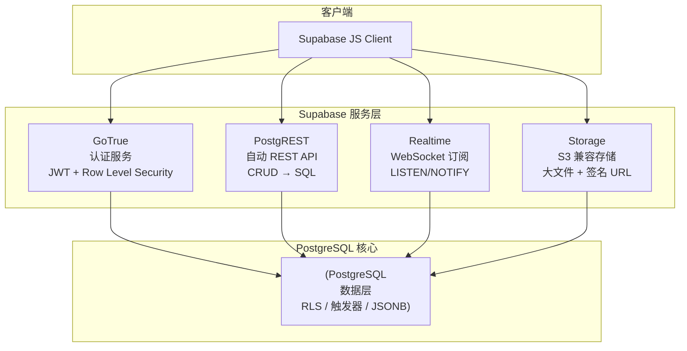

# Supabase 实战

如果你觉得直接操作 PostgreSQL 太底层，又不想被云厂商锁定，[Supabase](https://github.com/supabase/supabase) 是最佳选择——它以 PostgreSQL 为核心，在之上叠加了认证、REST API、实时订阅、对象存储，构建了一个开源的 Firebase 替代品。

## 一、Supabase 架构

Supabase 不是重写数据库，而是在 PostgreSQL 之上加了一层服务，充分利用 PG 的原生能力（RLS、触发器、JSONB、LISTEN/NOTIFY）。



| 组件 | 功能 | 底层 PG 能力 |
|------|------|-------------|
| GoTrue | 用户注册/登录/JWT | `auth` schema + RLS |
| PostgREST | 自动生成 REST API | 查询表/视图/函数 |
| Realtime | 数据变更实时推送 | `LISTEN/NOTIFY` + 触发器 |
| Storage | 文件上传/下载/CDN | `storage` schema + S3 兼容后端 |

::: important Supabase 的核心理念
**数据库即后端**——不是在应用层模拟数据库功能，而是充分利用 PostgreSQL 的原生能力。你的数据始终在 PG 中，Supabase 只是提供了更便捷的访问层。
:::

## 二、Row Level Security（RLS）

RLS 是 Supabase 安全模型的核心。每个请求携带 JWT，PG 根据 RLS 策略自动过滤行级数据——**安全策略在数据库层执行，绕不过去**。

### 2.1 启用 RLS

```sql
-- 创建表
CREATE TABLE todos (
    id BIGSERIAL PRIMARY KEY,
    user_id UUID REFERENCES auth.users(id) NOT NULL,
    title TEXT NOT NULL,
    completed BOOLEAN DEFAULT false,
    created_at TIMESTAMPTZ DEFAULT now()
);

-- 启用 RLS（关键！不启用 RLS 则策略不生效）
ALTER TABLE todos ENABLE ROW LEVEL SECURITY;
```

::: warning 忘记启用 RLS 的后果
`CREATE POLICY` 不会报错，但如果没有 `ALTER TABLE ... ENABLE ROW LEVEL SECURITY`，策略不生效，所有行对所有用户可见。这是最常见的 RLS 配置失误。
:::

### 2.2 创建 RLS 策略

```sql
-- 用户只能看到自己的 todo
CREATE POLICY "Users can view own todos"
ON todos FOR SELECT
USING (user_id = auth.uid());

-- 用户只能插入自己的 todo
CREATE POLICY "Users can insert own todos"
ON todos FOR INSERT
WITH CHECK (user_id = auth.uid());

-- 用户只能更新自己的 todo
CREATE POLICY "Users can update own todos"
ON todos FOR UPDATE
USING (user_id = auth.uid())
WITH CHECK (user_id = auth.uid());

-- 用户只能删除自己的 todo
CREATE POLICY "Users can delete own todos"
ON todos FOR DELETE
USING (user_id = auth.uid());
```

**USING vs WITH CHECK 的区别：**

| 子句 | 作用 | 适用命令 |
|------|------|---------|
| `USING` | 过滤**已有行**（哪些行可见/可操作） | SELECT / UPDATE / DELETE |
| `WITH CHECK` | 验证**新行**（插入/更新后的行是否合规） | INSERT / UPDATE |

### 2.3 角色策略

```sql
-- 管理员可以看所有 todo
CREATE POLICY "Admins can view all todos"
ON todos FOR SELECT
TO authenticated
USING (
    EXISTS (
        SELECT 1 FROM auth.users
        WHERE id = auth.uid()
        AND raw_user_meta_data->>'role' = 'admin'
    )
);

-- 公开只读（未登录用户只能看已完成的 todo）
CREATE POLICY "Public can view completed"
ON todos FOR SELECT
TO anon
USING (completed = true);
```

### 2.4 RLS 与 PostgREST 的关系

[PostgREST](https://github.com/PostgREST/postgrest) 使用不同的 PG 角色执行请求：

- `anon` 角色：未认证请求
- `authenticated` 角色：带有效 JWT 的请求
- `auth.uid()` 从 JWT 中提取用户 ID

```sql
-- 授权给 PostgREST 使用的角色
GRANT SELECT, INSERT, UPDATE, DELETE ON todos TO authenticated;
GRANT SELECT ON todos TO anon;
```

## 三、Realtime 实时订阅

Supabase Realtime 基于 PostgreSQL 的 `LISTEN/NOTIFY` 和逻辑解码，通过 WebSocket 推送数据变更。

### 3.1 启用 Realtime

```sql
-- 在 Supabase Dashboard 或手动开启 Realtime
ALTER PUBLICATION supabase_realtime ADD TABLE todos;
```

### 3.2 客户端订阅

```javascript
import { createClient } from '@supabase/supabase-js'

const supabase = createClient(
  'https://your-project.supabase.co',
  'your-anon-key'
)

// 订阅 todo 变更
const channel = supabase
  .channel('todos-changes')
  .on(
    'postgres_changes',
    {
      event: '*',           // INSERT / UPDATE / DELETE / *
      schema: 'public',
      table: 'todos',
      filter: 'user_id=eq.uuid-value'  // 可选过滤条件
    },
    (payload) => {
      console.log('Change received:', payload)
      // payload.eventType: 'INSERT' | 'UPDATE' | 'DELETE'
      // payload.new: 新行数据
      // payload.old: 旧行数据（UPDATE/DELETE）
    }
  )
  .subscribe()

// 取消订阅
channel.unsubscribe()
```

### 3.3 Presence 和 Broadcast

除了数据库变更，Supabase Realtime 还提供：

```javascript
// Presence —— 在线状态追踪
const room = supabase.channel('room-1', {
  config: { presence: { key: 'user-123' } }
})

room.on('presence', { event: 'sync' }, () => {
  const state = room.presenceState()
  console.log('Online users:', state)
})

room.subscribe(async () => {
  await room.track({ name: 'Alice', status: 'online' })
})

// Broadcast —— 客户端之间消息广播
const chat = supabase.channel('chat')

chat.on('broadcast', { event: 'message' }, (payload) => {
  console.log('Message:', payload)
})

chat.subscribe(async () => {
  await chat.send({
    type: 'broadcast',
    event: 'message',
    payload: { text: 'Hello!' }
  })
})
```

## 四、Storage 文件存储

Supabase Storage 提供类似 S3 的对象存储，支持公开/私有桶、签名 URL、图片转换。

### 4.1 创建存储桶

```javascript
// 创建私有桶
const { data, error } = await supabase.storage.createBucket('avatars', {
  public: false,
  fileSizeLimit: '2MB',
  allowedMimeTypes: ['image/png', 'image/jpeg']
})
```

### 4.2 上传和下载

```javascript
// 上传文件
const { data, error } = await supabase.storage
  .from('avatars')
  .upload('user-123/avatar.png', file, {
    cacheControl: '3600',
    upsert: true
  })

// 下载文件
const { data, error } = await supabase.storage
  .from('avatars')
  .download('user-123/avatar.png')

// 公开桶：获取公开 URL
const { data } = supabase.storage
  .from('public-bucket')
  .getPublicUrl('image.png')

// 私有桶：生成签名 URL（有时效）
const { data, error } = await supabase.storage
  .from('avatars')
  .createSignedUrl('user-123/avatar.png', 3600) // 1 小时有效
```

### 4.3 Storage RLS

```sql
-- 用户只能访问自己目录下的文件
CREATE POLICY "Users can access own folder"
ON storage.objects FOR SELECT
USING (bucket_id = 'avatars' AND auth.uid()::text = (storage.foldername(name))[1]);

CREATE POLICY "Users can upload to own folder"
ON storage.objects FOR INSERT
WITH CHECK (bucket_id = 'avatars' AND auth.uid()::text = (storage.foldername(name))[1]);
```

## 五、实战：构建 Todo 应用

### 5.1 数据库 Schema

```sql
-- 用户资料表
CREATE TABLE profiles (
    id UUID REFERENCES auth.users(id) PRIMARY KEY,
    username TEXT UNIQUE NOT NULL,
    avatar_url TEXT,
    created_at TIMESTAMPTZ DEFAULT now()
);

-- Todo 表
CREATE TABLE todos (
    id BIGSERIAL PRIMARY KEY,
    user_id UUID REFERENCES auth.users(id) NOT NULL,
    title TEXT NOT NULL,
    description TEXT,
    priority TEXT DEFAULT 'medium' CHECK (priority IN ('low', 'medium', 'high')),
    completed BOOLEAN DEFAULT false,
    due_date DATE,
    created_at TIMESTAMPTZ DEFAULT now(),
    updated_at TIMESTAMPTZ DEFAULT now()
);

-- 自动更新 updated_at
CREATE OR REPLACE FUNCTION update_updated_at()
RETURNS TRIGGER AS $$
BEGIN
    NEW.updated_at = now();
    RETURN NEW;
END;
$$ LANGUAGE plpgsql;

CREATE TRIGGER todos_updated_at
    BEFORE UPDATE ON todos
    FOR EACH ROW
    EXECUTE FUNCTION update_updated_at();

-- 启用 RLS
ALTER TABLE profiles ENABLE ROW LEVEL SECURITY;
ALTER TABLE todos ENABLE ROW LEVEL SECURITY;

-- profiles 策略
CREATE POLICY "Users can view own profile" ON profiles
    FOR SELECT USING (id = auth.uid());
CREATE POLICY "Users can update own profile" ON profiles
    FOR UPDATE USING (id = auth.uid()) WITH CHECK (id = auth.uid());

-- todos 策略
CREATE POLICY "Users can CRUD own todos" ON todos
    FOR ALL USING (user_id = auth.uid()) WITH CHECK (user_id = auth.uid());
```

### 5.2 前端代码

```javascript
import { createClient } from '@supabase/supabase-js'

const supabase = createClient(
  'https://your-project.supabase.co',
  'your-anon-key'
)

// ========== 认证 ==========
// 注册
const { data, error } = await supabase.auth.signUp({
  email: 'user@example.com',
  password: 'secure-password'
})

// 登录
const { data, error } = await supabase.auth.signInWithPassword({
  email: 'user@example.com',
  password: 'secure-password'
})

// ========== CRUD ==========
// 查询 todo
const { data: todos, error } = await supabase
  .from('todos')
  .select('*')
  .eq('user_id', userId)
  .order('created_at', { ascending: false })

// 创建 todo
const { data, error } = await supabase
  .from('todos')
  .insert({
    user_id: userId,
    title: '学习 PostgreSQL',
    priority: 'high',
    due_date: '2026-06-10'
  })
  .select()
  .single()

// 更新 todo
const { data, error } = await supabase
  .from('todos')
  .update({ completed: true })
  .eq('id', todoId)
  .select()
  .single()

// 删除 todo
const { error } = await supabase
  .from('todos')
  .delete()
  .eq('id', todoId)

// ========== 实时订阅 ==========
supabase
  .channel('todos-realtime')
  .on('postgres_changes', {
    event: '*',
    schema: 'public',
    table: 'todos',
    filter: `user_id=eq.${userId}`
  }, (payload) => {
    if (payload.eventType === 'INSERT') {
      addTodoToUI(payload.new)
    } else if (payload.eventType === 'UPDATE') {
      updateTodoInUI(payload.new)
    } else if (payload.eventType === 'DELETE') {
      removeTodoFromUI(payload.old)
    }
  })
  .subscribe()
```

## 六、Supabase vs Firebase

| 特性 | Supabase | Firebase |
|------|----------|----------|
| 数据库 | PostgreSQL（关系型） | Firestore（文档型） |
| 数据所有权 | 你的 PG 实例，可自托管 | Google 云，锁定 |
| 查询能力 | 完整 SQL | 有限查询（NoSQL） |
| 事务 | ACID 事务 | 有限事务支持 |
| 实时推送 | 基于触发器 | 内建 |
| 认证 | JWT + PG RLS | Firebase Auth |
| REST API | PostgREST 自动生成 | Cloud Functions |
| 自托管 | 支持 | 不支持 |
| 价格模型 | 免费额度 + 按用量 | 免费额度 + 按读写计费 |

### 何时用 Supabase

- 需要**关系型数据模型**和复杂查询
- 需要数据**可移植**（随时可迁移到裸 PG）
- 团队**熟悉 SQL** 而非 NoSQL
- 需要**自托管**能力（合规/数据主权）

### 何时用 Firebase

- 快速原型，**不需要复杂关联**
- 纯移动端应用，Firestore 离线能力更强
- 团队已深度使用 Google Cloud 生态

::: tip Supabase vs 裸 PostgreSQL
- **用 Supabase**：快速开发、需要认证 + API + 实时的全栈应用
- **用裸 PG**：对性能和可控性有极致要求、不需要 BaaS 层、已有成熟的中间件架构
- Supabase 底层就是 PG，随时可以从 Supabase 迁移到裸 PG，没有锁定
:::

## 开源参考

| 项目 | 说明 |
|------|------|
| [Supabase](https://github.com/supabase/supabase) | 本篇主角，开源 Firebase 替代品 |
| [PostgREST](https://github.com/PostgREST/postgrest) | Supabase 的 REST API 层，自动将 PG 表/视图/函数暴露为 REST |

## 面试技巧

::: tip 面试高频问题
1. **Supabase 的安全模型是什么？** 核心是 RLS（Row Level Security）。每个请求携带 JWT，PG 的 RLS 策略在数据库层过滤数据，应用层无法绕过。这比在应用层做权限过滤更安全。

2. **RLS 的 USING 和 WITH CHECK 有什么区别？** `USING` 过滤已有行（SELECT/UPDATE/DELETE 可操作哪些行），`WITH CHECK` 验证新行（INSERT/UPDATE 后的行是否符合条件）。UPDATE 两者都适用。

3. **Supabase Realtime 的原理？** 底层是 PG 的逻辑解码 + LISTEN/NOTIFY。数据变更通过 WAL 解码，经 WebSocket 推送给客户端。面试时提一句"逻辑解码"而非"触发器"说明理解更深。

4. **Supabase 和 Firebase 怎么选？** 需要关系型、SQL、数据可移植选 Supabase；需要 NoSQL、离线优先、Google 生态选 Firebase。关键是"关系型 vs 文档型"的选择。

5. **PostgREST 是什么？** 自动将 PG 的表、视图、函数暴露为 REST API。支持过滤、分页、嵌套资源、存储过程调用。Supabase 的 API 层就是基于它。
:::
