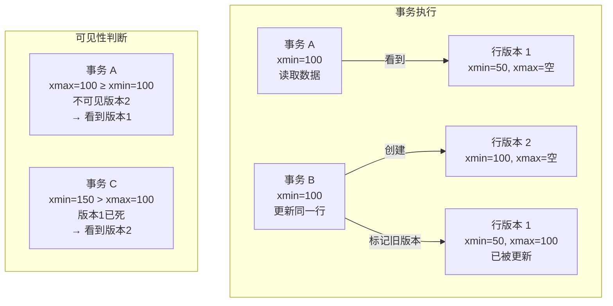
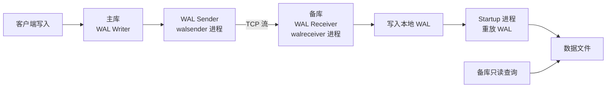

# PostgreSQL 面试题精选

整理 20 道高频 PostgreSQL 面试题，覆盖架构、存储、索引、事务、运维全链路。每题提供要点式参考答案，帮助你在面试中精准作答。

---

## Q1：PostgreSQL 和 MySQL 的核心区别？

| 维度 | PostgreSQL | MySQL |
|------|-----------|-------|
| 架构 | 进程模型（每个连接一个进程） | 线程模型（每个连接一个线程） |
| 存储引擎 | 统一存储引擎 | 可插拔（InnoDB/MyISAM 等） |
| 类型系统 | 丰富（数组、JSONB、范围、几何等） | 相对简单 |
| 扩展性 | CREATE EXTENSION、自定义类型/索引/函数 | 有限 |
| 并发控制 | MVCC（无回滚段） | MVCC（基于 Undo Log） |
| 全文搜索 | 内建（tsvector/tsquery） | 需要外部组件或 8.0+ ngram |
| SQL 标准 | 高度兼容 | 部分兼容 |
| 生态 | Supabase、PostgREST、TimescaleDB | 互联网公司主流 |

**一句话**：PG 更像"数据库界的瑞士军刀"，功能全面、扩展性强；MySQL 更像"专精工具"，在互联网高并发场景下成熟度更高。

---

## Q2：什么是 MVCC？PostgreSQL 的 MVCC 如何实现？

MVCC（Multi-Version Concurrency Control）让读操作不阻塞写操作、写操作不阻塞读操作。每行数据有多个版本，不同事务看到不同版本。



PG 的 MVCC 实现方式：
- 每行有 `xmin`（创建该行的事务 ID）和 `xmax`（删除/更新该行的事务 ID，初始为 0）
- 行头还有 `infomask` 位图标记事务状态（committed / aborted）
- 可见性规则：事务 T 能看到行，当且仅当 `xmin` 对 T 可见且 `xmax` 对 T 不可见

**与 MySQL 的区别**：PG 在表空间中保留多版本（更新 = 插入新行 + 标记旧行），MySQL InnoDB 在 Undo Log 中保留旧版本（更新就地修改 + Undo 记录旧值）。

---

## Q3：什么是 Vacuum？为什么需要它？

由于 PG 的 MVCC 在表中保留多版本，UPDATE/DELETE 后旧版本（死元组）不会自动清理。VACUUM 负责：

1. **标记死元组空间可复用**——后续 INSERT 可使用这些空间
2. **更新统计信息**（ANALYZE）——让规划器做出更优决策
3. **更新可见性映射表**（visibility map）——加速 Index-Only Scan
4. **防止事务 ID 回卷**——冻结旧行的 xmin

```sql
-- 手动 VACUUM
VACUUM orders;              -- 标记空间可复用
VACUUM ANALYZE orders;      -- 标记 + 更新统计
VACUUM FULL orders;         -- 重建表，回收空间给 OS（锁全表！）
```

**Autovacuum** 是自动执行的 VACUUM，根据表的变更量自动触发，生产环境必须开启。

---

## Q4：GIN 和 GiST 索引的区别？

| 特性 | GIN | GiST |
|------|-----|------|
| 全称 | Generalized Inverted Index | Generalized Search Tree |
| 结构 | 倒排索引（关键词 → 行列表） | 平衡搜索树 |
| 适合 | 多值元素查询（数组、JSONB、全文搜索） | 范围查询、几何数据、全文搜索 |
| 查询速度 | 快（精确匹配） | 中（可能返回假阳性，需 recheck） |
| 构建速度 | 慢（需预处理） | 快 |
| 更新代价 | 高（单元素更新可能触发整行重建） | 低 |

```sql
-- GIN：JSONB 查询
CREATE INDEX idx_products_attrs ON products USING GIN (attrs jsonb_path_ops);

-- GiST：地理范围查询
CREATE INDEX idx_stores_location ON stores USING GiST (location);

-- GIN：全文搜索
CREATE INDEX idx_docs_content ON documents USING GIN (to_tsvector('english', content));
```

---

## Q5：JSONB 和 JSON 的区别？为什么推荐 JSONB？

| 特性 | JSON | JSONB |
|------|------|-------|
| 存储 | 文本存储，保留空格/顺序 | 二进制存储，解析后存储 |
| 写入速度 | 快（直接存文本） | 慢（需要解析） |
| 查询速度 | 慢（每次查询需要解析） | 快（已解析） |
| 索引支持 | 不支持 GIN 索引 | 支持 GIN 索引 |
| 操作符 | 基本查询 | 丰富（`@>`、`?`、`?|`、`?&`） |

```sql
-- JSONB 索引查询（毫秒级）
CREATE INDEX idx_users_prefs ON users USING GIN (prefs jsonb_path_ops);

SELECT * FROM users WHERE prefs @> '{"theme": "dark"}';  -- 走索引

-- JSONB 路径查询
SELECT * FROM products WHERE attrs->>'color' = 'red';
SELECT * FROM products WHERE attrs->'tags' ? 'electronics';
```

**结论**：除非需要保留 JSON 的精确格式（空格、键序），否则**一律用 JSONB**。

---

## Q6：流复制的工作原理？



核心流程：
1. 主库写入 WAL 日志
2. `walsender` 进程通过 TCP 将 WAL 流式发送给备库
3. 备库 `walreceiver` 接收并写入本地 WAL
4. `startup` 进程重放 WAL，更新数据文件

同步模式：主库等待备库确认后才返回成功（`synchronous_commit = on`）；异步模式：主库不等备库（`synchronous_commit = local`）。

---

## Q7：什么是 HOT 更新？

HOT（Heap-Only Tuple）更新是 PG 的一种优化：当 UPDATE 不涉及索引列时，新行版本放在同一个数据页中，索引无需更新。

```
普通更新：索引指针 → 旧行 → 新行（需要更新索引）
HOT 更新：索引指针 → 旧行 → 新行（索引不变，通过行内链找到新版本）
```

HOT 更新的好处：
- 避免索引分裂和更新，大幅减少 IO
- 减少索引膨胀
- VACUUM 更快（只需处理堆，不用处理索引）

```sql
-- 让 UPDATE 更容易触发 HOT：使用填充因子
ALTER TABLE orders SET (fillfactor = 85);  -- 留 15% 空间给 HOT 更新
```

---

## Q8：什么是事务 ID 回卷（Transaction ID Wraparound）？

PG 的事务 ID 是 32 位无符号整数（0 ~ 2^32-1 ≈ 42 亿），用完后会从 0 重新开始。如果旧数据的 xmin 没有被"冻结"，新事务可能看到旧数据"在未来"，导致数据不可见。

```sql
-- 查看事务 ID 使用情况
SELECT txid_current();           -- 当前事务 ID
SELECT age(relfrozenxid) AS age_before_wraparound
FROM pg_class WHERE relname = 'orders';
-- age 超过 2 亿就需要关注

-- 查看各表的冻结年龄
SELECT relname, age(relfrozenxid) AS xid_age,
       pg_size_pretty(pg_total_relation_size(oid)) AS size
FROM pg_class
WHERE relkind = 'r'
ORDER BY xid_age DESC;
```

**防范措施**：
- 确保 `autovacuum` 开启
- 监控 `age(relfrozenxid)`，告警阈值 1.5 亿
- 紧急情况手动 `VACUUM FREEZE`

---

## Q9：什么是并行查询？如何启用？

PG 10+ 支持并行查询：多个 worker 同时扫描表的不同部分，结果由 Gather 节点汇总。

```sql
EXPLAIN ANALYZE SELECT COUNT(*) FROM orders;
-- Gather (actual rows=1)
--   Workers Planned: 4, Workers Launched: 4
--   ->  Parallel Seq Scan on orders (actual rows=250000 per worker)
```

关键参数：
```ini
max_parallel_workers_per_gather = 4    # 每个 Gather 的 worker 数
max_parallel_workers = 8               # 总 worker 上限
parallel_tuple_cost = 0.01             # 传输代价（越小越倾向并行）
parallel_setup_cost = 100              # 启动代价
```

**不适合并行的场景**：小表、返回少量行的索引查询、游标、PL/pgSQL 循环内查询。

---

## Q10：什么是 CTE 优化？WITH 子句的性能问题？

PostgreSQL 12 之前，CTE（`WITH` 子句）充当"优化篱笆"——数据库不会将 CTE 内联到主查询中，可能导致次优计划。

```sql
-- PG 11 及之前：CTE 物化（总是执行，不能内联优化）
WITH expensive AS (
    SELECT * FROM orders WHERE status = 'pending'  -- 全表扫描
)
SELECT * FROM expensive WHERE user_id = 12345;     -- 再过滤

-- PG 12+：CTE 默认可内联（自动优化）
WITH cheap AS (
    SELECT * FROM orders WHERE status = 'pending'
)
SELECT * FROM cheap WHERE user_id = 12345;
-- 等价于：SELECT * FROM orders WHERE status = 'pending' AND user_id = 12345
-- 可以走索引！
```

```sql
-- 强制物化（需要 CTE 只执行一次的场景）
WITH expensive AS MATERIALIZED (
    SELECT complex_aggregation() FROM large_table
)
SELECT * FROM expensive;  -- 只计算一次
```

---

## Q11：EXPLAIN ANALYZE 的输出怎么看？

```sql
EXPLAIN ANALYZE SELECT * FROM orders WHERE user_id = 12345;

-- Index Scan using idx_orders_user_id on orders
--   (cost=0.43..8.45 rows=1 width=120)
--   (actual time=0.015..0.016 rows=2 loops=1)
--   Index Cond: (user_id = 12345)
-- Planning Time: 0.089 ms
-- Execution Time: 0.035 ms
```

| 字段 | 含义 |
|------|------|
| `cost` | 估算代价（启动..总代价），单位是任意单位 |
| `rows` | 估算行数 vs 实际行数 |
| `actual time` | 实际耗时（ms） |
| `loops` | 执行次数 |
| `width` | 平均行宽（字节） |

**关键看**：`rows` 估算 vs 实际差距大 → 统计信息不准，需 `ANALYZE`。

---

## Q12：什么是连接池？PgBouncer 三种模式？

见[性能调优篇](../03_运维篇/03_性能调优.md)详细说明。核心区别：

- **session**：客户端断开才释放连接
- **transaction**：事务结束释放（推荐）
- **statement**：语句结束释放（不支持事务）

---

## Q13：什么是 PITR？如何实现？

见[备份与恢复篇](../03_运维篇/01_备份与恢复.md)详细说明。核心：基础备份 + WAL 归档 → 可恢复到任意时间点。

---

## Q14：什么是 RLS（Row Level Security）？

```sql
ALTER TABLE orders ENABLE ROW LEVEL SECURITY;

CREATE POLICY "Users see own orders" ON orders
    FOR SELECT USING (user_id = current_user_id());
```

RLS 在**数据库层**强制行级访问控制，应用层无法绕过。[Supabase](https://github.com/supabase/supabase) 的安全模型就是基于 RLS + JWT。

---

## Q15：什么是 TOAST？

TOAST（The Oversized-Attribute Storage Technique）是 PG 处理大字段（超过数据页 8KB 的行）的机制：

- 行数据超过约 2KB 时，大字段自动压缩和/或移到 TOAST 表
- 查询不涉及 TOAST 字段时不会加载，节省 IO
- JSONB、TEXT、BYTEA 等类型经常触发 TOAST

```sql
-- 查看 TOAST 表大小
SELECT pg_size_pretty(pg_total_relation_size('orders')) AS total,
       pg_size_pretty(pg_relation_size('orders')) AS table_only,
       pg_size_pretty(pg_total_relation_size('orders') - pg_relation_size('orders')) AS toast_and_indexes;
```

---

## Q16：SERIAL 和 IDENTITY 的区别？

```sql
-- SERIAL（旧语法，PG 9.x 及之前）
CREATE TABLE users (id SERIAL PRIMARY KEY, name TEXT);
-- 等价于：
-- CREATE SEQUENCE users_id_seq;
-- CREATE TABLE users (id INTEGER DEFAULT nextval('users_id_seq') PRIMARY KEY, name TEXT);
-- ALTER SEQUENCE users_id_seq OWNED BY users.id;

-- IDENTITY（新语法，PG 10+，推荐）
CREATE TABLE users (
    id INTEGER GENERATED ALWAYS AS IDENTITY PRIMARY KEY,
    name TEXT
);
-- GENERATED ALWAYS：不允许手动插入 id
-- GENERATED BY DEFAULT：允许手动插入，不推荐
```

**推荐 IDENTITY 的原因**：更符合 SQL 标准、不能被意外覆盖（`ALWAYS`）、序列与列绑定更紧密。

---

## Q17：什么是 WAL？它的作用？

WAL（Write-Ahead Logging）是 PG 的预写日志机制：

1. 数据修改前先写 WAL 日志
2. WAL 写入磁盘后才修改数据页
3. 崩溃恢复时重放 WAL 恢复一致性

WAL 的三大用途：
- **崩溃恢复**：重启后重放未刷盘的 WAL
- **流复制**：WAL 流式传输到备库
- **PITR**：归档 WAL 实现时间点恢复

关键参数：`wal_level`（`minimal` / `replica` / `logical`）、`synchronous_commit`、`wal_buffers`。

---

## Q18：什么是 pg_stat_statements？怎么用？

```sql
-- 查看最慢的 10 条 SQL
SELECT query, calls, total_exec_time, mean_exec_time
FROM pg_stat_statements
ORDER BY total_exec_time DESC
LIMIT 10;
```

见[性能调优篇](../03_运维篇/03_性能调优.md)详细说明。核心价值：定位性能瓶颈、量化 SQL 优化效果。

---

## Q19：如何监控 PostgreSQL 复制延迟？

```sql
-- 主库查看
SELECT client_addr, sync_state,
       pg_wal_lsn_diff(sent_lsn, replay_lsn) AS lag_bytes
FROM pg_stat_replication;

-- 备库自测
SELECT now() - pg_last_xact_replay_timestamp() AS replay_delay;
```

告警阈值：延迟 > 5 秒警告，> 30 秒严重，> 60 秒紧急。

---

## Q20：PostgreSQL 的进程模型是什么？

PG 采用**进程模型**（而非线程模型）：每个客户端连接 fork 一个后端进程。

核心进程：

| 进程 | 作用 |
|------|------|
| `postmaster` | 主进程，监听连接、fork 后端进程 |
| `backend` | 处理客户端请求 |
| `walwriter` | 定期将 WAL 缓冲区刷盘 |
| `bgwriter` | 定期将脏页刷盘，减少 checkpoint 压力 |
| `autovacuum launcher` | 调度 autovacuum worker |
| `autovacuum worker` | 执行 VACUUM/ANALYZE |
| `checkpointer` | 执行 checkpoint |
| `stats collector` | 收集统计信息 |
| `walsender` | 流复制：发送 WAL |
| `walreceiver` | 流复制：接收 WAL |
| `archiver` | 归档 WAL 文件 |

**与 MySQL 的区别**：MySQL 使用线程模型（一个进程 + 多线程），上下文切换开销更小但隔离性更差；PG 的进程模型隔离性更好，但连接数受限（需要 PgBouncer 连接池）。

---

## 开源参考

| 项目 | 说明 |
|------|------|
| [Supabase](https://github.com/supabase/supabase) | 基于 PG 的开源 Firebase，RLS + 实时订阅的最佳实践 |
| [PostgREST](https://github.com/PostgREST/postgrest) | PG 自动 REST API，体现 PG 扩展性优势 |

## 面试技巧

::: tip 面试策略
1. **分层回答**：先一句话概括，再展开细节。例如"MVCC 是多版本并发控制，PG 通过 xmin/xmax 实现，与 MySQL 基于 Undo Log 的实现不同..."

2. **对比加分**：每道题如果能与 MySQL 对比，说明知识面广。例如"PG 的 MVCC 在表中保留多版本，会导致表膨胀；MySQL 在 Undo Log 中保留，空间更紧凑但 Undo 表空间可能膨胀"。

3. **实战案例**：能举出自己遇到的案例最加分。例如"我们线上遇到过事务 ID 回卷，age 达到 1.5 亿时触发了 autovacuum freeze，期间 IO 飙升..."

4. **原理 + 工具**：既要知道原理，也要知道怎么观测。例如"复制延迟可以通过 `pg_stat_replication` 的 `replay_lsn` 监控，也可以用 Prometheus postgres_exporter"。

5. **热点方向**：JSONB、RLS、流复制是当前面试热点（受 Supabase 影响），重点准备。
:::
