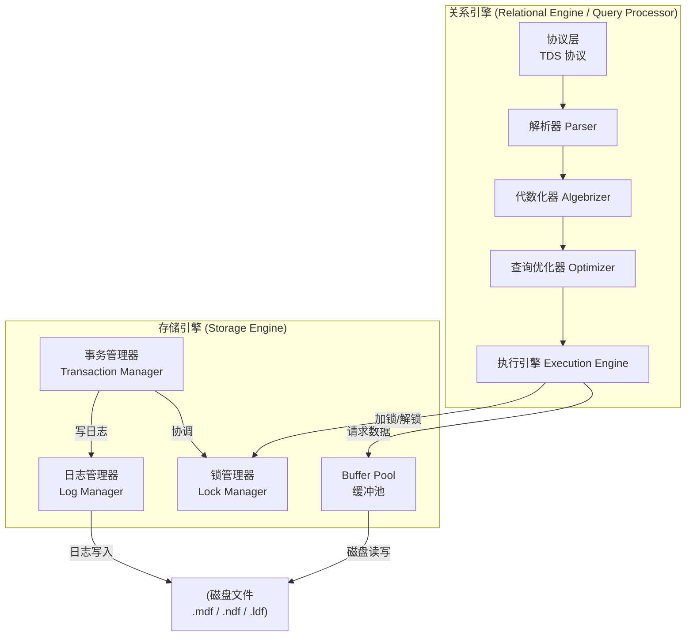
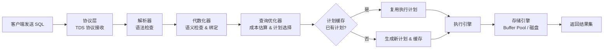
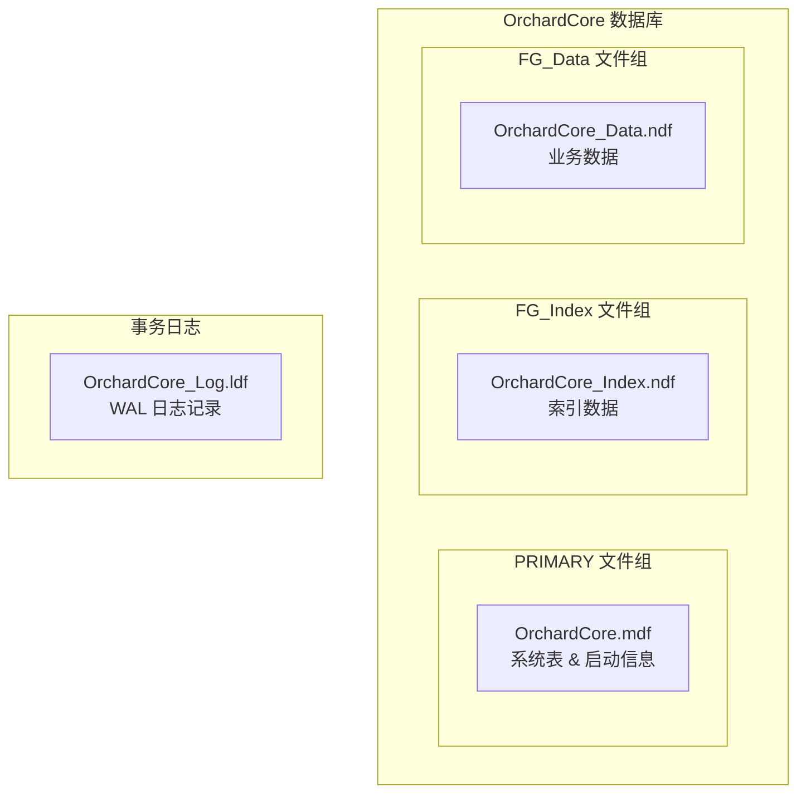
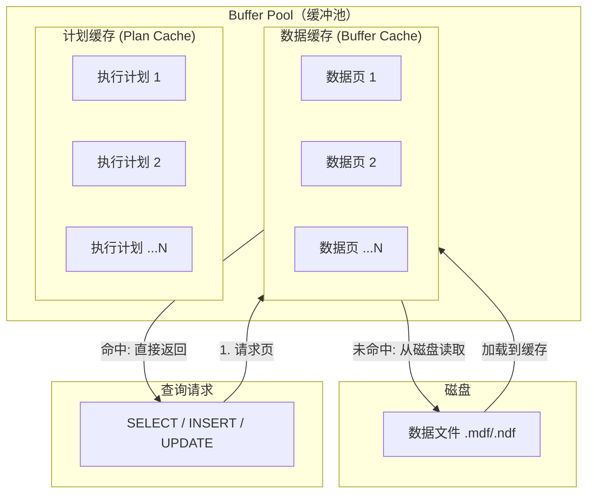

# SQL Server 架构体系

> **理解 SQL Server 的内部架构，是从"写 SQL"到"懂 SQL Server"的第一步。** 本篇带你透视引擎、文件、内存三大核心结构。

---

## 一、SQL Server 引擎架构

SQL Server 的引擎由两大核心组件构成：**关系引擎（Relational Engine）** 和 **存储引擎（Storage Engine）**。



### 1.1 关系引擎（Query Processor）

关系引擎负责 SQL 语句的解析、优化和执行，是 SQL Server 的"大脑"：

| 组件 | 职责 |
|------|------|
| **协议层** | 接收客户端请求，通过 TDS（Tabular Data Stream）协议通信 |
| **解析器（Parser）** | 语法检查，将 SQL 文本转换为解析树 |
| **代数化器（Algebrizer）** | 语义检查（表/列是否存在、类型匹配），绑定到数据库对象，生成逻辑操作树 |
| **查询优化器（Optimizer）** | 基于成本（Cost-Based）选择最优执行计划，是 SQL Server 最复杂的组件 |
| **执行引擎（Execution Engine）** | 按执行计划调用存储引擎完成数据操作 |

### 1.2 存储引擎（Storage Engine）

存储引擎负责数据的物理存储、内存管理、并发控制和事务保证：

| 组件 | 职责 |
|------|------|
| **Buffer Pool** | 数据页和计划缓存的内存区域，减少磁盘 I/O |
| **日志管理器** | 管理事务日志写入，保证 WAL（Write-Ahead Logging） |
| **锁管理器** | 管理各种锁资源，保证并发一致性 |
| **事务管理器** | 协调 ACID 事务，管理与事务相关的资源 |

::: tip 关系引擎 vs 存储引擎
简单类比：关系引擎是"前台"，决定"做什么"；存储引擎是"后台"，决定"怎么做"。查询优化器选择路径，存储引擎执行路径。
:::

---

## 二、一条 SQL 查询的旅程

理解 SQL Server 如何处理一条查询，是掌握性能调优的基础。



```sql
-- 跟踪一条查询的处理过程
SET STATISTICS TIME ON;
SET STATISTICS IO ON;

SELECT o.OrderId, c.CustomerName, o.OrderDate
FROM Orders o
JOIN Customers c ON o.CustomerId = c.CustomerId
WHERE o.OrderDate >= '2024-01-01'
ORDER BY o.OrderDate DESC;

-- SQL Server 执行时间:
--   SQL Server 分析和编译时间 = 2 ms（解析 + 优化）
--   SQL Server 执行时间 = 15 ms（实际执行）
-- 扫描计数 1, 逻辑读取 42 次（从 Buffer Pool 读取的页数）
```

::: important 计划缓存复用
SQL Server 会缓存执行计划以避免重复编译。参数化查询可以极大提高计划复用率。这也是参数嗅探（Parameter Sniffing）问题的根源。
:::

---

## 三、数据库文件与文件组

### 3.1 数据库文件类型

| 文件类型 | 扩展名 | 说明 |
|----------|--------|------|
| **主数据文件** | `.mdf` | 每个数据库有且仅有一个，包含数据库启动信息 |
| **次要数据文件** | `.ndf` | 可选，用于分散 I/O 或扩展存储 |
| **事务日志文件** | `.ldf` | 记录所有事务日志，用于恢复，至少一个 |

```sql
-- 查看数据库文件信息
SELECT
    f.name AS FileName,
    f.type_desc AS FileType,
    f.physical_name AS PhysicalPath,
    f.size * 8 / 1024 AS SizeMB,
    f.growth * 8 / 1024 AS GrowthMB,
    fg.name AS FilegroupName
FROM sys.database_files f
LEFT JOIN sys.filegroups fg ON f.data_space_id = fg.data_space_id;
```

### 3.2 文件组（Filegroup）

文件组是数据文件的逻辑集合，用于管理数据放置和 I/O 分配：

```sql
-- 创建数据库，指定主文件组和用户文件组
CREATE DATABASE OrchardCore
ON PRIMARY
(
    NAME = N'OrchardCore_Primary',
    FILENAME = N'D:\Data\OrchardCore.mdf',
    SIZE = 64MB,
    MAXSIZE = UNLIMITED,
    FILEGROWTH = 16MB
),
FILEGROUP FG_Index
(
    NAME = N'OrchardCore_Index',
    FILENAME = N'E:\Index\OrchardCore_Index.ndf',
    SIZE = 32MB,
    FILEGROWTH = 8MB
),
FILEGROUP FG_Data
(
    NAME = N'OrchardCore_Data',
    FILENAME = N'F:\Data\OrchardCore_Data.ndf',
    SIZE = 128MB,
    FILEGROWTH = 32MB
)
LOG ON
(
    NAME = N'OrchardCore_Log',
    FILENAME = N'G:\Log\OrchardCore_Log.ldf',
    SIZE = 32MB,
    FILEGROWTH = 8MB
);
```



::: tip 文件组最佳实践
- 将索引放在独立文件组，分离数据 I/O 和索引 I/O
- 将不同文件组放在不同物理磁盘，最大化 I/O 并行
- 使用分区表时，每个分区可以映射到不同文件组
:::

---

## 四、Buffer Pool 架构

Buffer Pool 是 SQL Server 最核心的内存结构，占据 SQL Server 内存的大部分。



### 4.1 数据缓存（Buffer Cache）

- 数据以 **8KB 页（Page）** 为单位缓存
- 采用 **LRU-K** 淘汰策略
- 脏页（已修改但未写回磁盘）通过 **Checkpoint** 或 **Lazy Writer** 刷盘

### 4.2 计划缓存（Plan Cache）

- 缓存编译后的执行计划，避免重复编译
- 通过 SQL 文本的哈希值匹配（注意：大小写、空格差异都会导致缓存未命中）

```sql
-- 查看 Buffer Pool 中的数据页分布
SELECT
    DB_NAME(database_id) AS DatabaseName,
    COUNT(*) AS CachedPages,
    COUNT(*) * 8 / 1024 AS CachedMB
FROM sys.dm_os_buffer_descriptors
WHERE database_id > 4  -- 排除系统数据库
GROUP BY database_id
ORDER BY CachedMB DESC;

-- 查看计划缓存统计
SELECT
    objtype AS PlanType,
    COUNT(*) AS PlanCount,
    SUM(size_in_bytes) / 1024 / 1024 AS SizeMB
FROM sys.dm_exec_cached_plans
GROUP BY objtype
ORDER BY SizeMB DESC;

-- 查看最耗 CPU 的缓存计划
SELECT TOP 10
    total_worker_time / execution_count AS AvgCpuMicroseconds,
    execution_count,
    SUBSTRING(st.text, (qs.statement_start_offset / 2) + 1,
        (CASE qs.statement_end_offset
            WHEN -1 THEN DATALENGTH(st.text)
            ELSE qs.statement_end_offset
        END - qs.statement_start_offset) / 2 + 1) AS QueryText
FROM sys.dm_exec_query_stats qs
CROSS APPLY sys.dm_exec_sql_text(qs.sql_handle) st
ORDER BY AvgCpuMicroseconds DESC;
```

::: warning 计划缓存膨胀
如果应用发送大量非参数化的即席查询（Ad-hoc SQL），计划缓存可能膨胀到 GB 级别，挤占数据缓存空间。建议启用"针对即席工作负荷进行优化"：
```sql
EXEC sp_configure 'optimize for ad hoc workloads', 1;
RECONFIGURE;
```
:::

---

## 五、系统数据库

| 数据库 | 用途 | 关键说明 |
|--------|------|----------|
| **master** | 记录所有系统级信息：登录账户、端点、链接服务器、其他数据库信息 | **必须定期备份！丢失则整个实例不可用** |
| **model** | 所有新建数据库的模板 | 修改 model 会影响后续所有 CREATE DATABASE |
| **msdb** | SQL Server Agent 作业、告警、操作员、备份历史 | 作业调度系统的核心 |
| **tempdb** | 临时表、表变量、排序空间、行版本存储 | **每次重启重建**，性能至关重要 |
| **Resource** | 系统对象（sys 架构视图）的只读数据库 | 隐藏数据库，不要直接修改 |

```sql
-- 查看 tempdb 配置（文件数和大小）
SELECT name, physical_name, size * 8 / 1024 AS SizeMB, growth
FROM sys.master_files
WHERE database_id = DB_ID('tempdb');

-- 查看 tempdb 空间使用
SELECT
    SUM(user_object_reserved_page_count) * 8 / 1024 AS UserObjectsMB,
    SUM(internal_object_reserved_page_count) * 8 / 1024 AS InternalObjectsMB,
    SUM(version_store_reserved_page_count) * 8 / 1024 AS VersionStoreMB,
    SUM(unallocated_extent_page_count) * 8 / 1024 AS FreeSpaceMB
FROM sys.dm_db_file_space_usage
WHERE database_id = DB_ID('tempdb');
```

::: important tempdb 性能优化
- 配置多个等大小的数据文件（通常 1 个/CPU 核心，最多 8 个）
- 启用 TF1118 减少混合区分配争用（SQL Server 2016+ 默认启用）
- 将 tempdb 放在高速 SSD 上
- 合理配置初始大小，避免频繁自动增长
:::

---

## 六、SQL Server 版本对比

| 特性 | Express | Standard | Enterprise |
|------|---------|----------|------------|
| 最大内存 | 1.4 GB | 128 GB | OS 最大 |
| 最大数据库大小 | 10 GB | 524 PB | 524 PB |
| CPU 利用限制 | 1 socket / 4 cores | 4 sockets / 24 cores | OS 最大 |
| Buffer Pool 扩展 | ❌ | ✅ | ✅ |
| AlwaysOn AG | ❌ | ✅（1 个辅助） | ✅（无限制） |
| 列存储索引 | ❌ | ✅ | ✅ |
| 内存 OLTP | ❌ | ❌ | ✅ |
| 分区表 | ❌ | ❌ | ✅ |
| 数据压缩 | ❌ | ✅（行压缩） | ✅（行+页+列存储） |
| 透明数据加密 | ❌ | ✅ | ✅ |

::: warning 版本选择建议
- **开发/学习**：Express（免费）或 Developer（免费，功能等同 Enterprise，不可用于生产）
- **中小生产**：Standard（128GB 内存覆盖大部分场景）
- **大型/关键业务**：Enterprise（AlwaysOn 多辅助、In-Memory OLTP、表分区）
:::

---

## 七、SQL Server on Linux

自 SQL Server 2017 起，SQL Server 正式支持 Linux，打破了 Windows-only 的限制。

```bash
# Ubuntu 安装 SQL Server 2022
sudo apt-get update
sudo apt-get install -y curl software-properties-common
curl -fsSL https://packages.microsoft.com/keys/microsoft.asc | sudo apt-key add -
sudo add-apt-repository "$(curl https://packages.microsoft.com/config/ubuntu/22.04/mssql-server-2022.list)"
sudo apt-get install -y mssql-server
sudo /opt/mssql/bin/mssql-conf setup
```

```bash
# Docker 运行 SQL Server
docker run -e 'ACCEPT_EULA=Y' -e 'MSSQL_SA_PASSWORD=YourStr0ng!Pass' \
    -p 1433:1433 --name sqlserver \
    -d mcr.microsoft.com/mssql/server:2022-latest
```

::: tip SQL Server on Linux 注意事项
- Linux 上的 SQL Server 与 Windows 版功能基本一致，但缺少部分特性（如 AlwaysOn FCI 依赖 Pacemaker）
- 文件路径使用 Linux 风格：`/var/opt/mssql/data/`
- 内存管理方式不同：Linux 上 SQL Server 使用 `memory.enablecontainers` 管理内存
:::

---

## 八、Orchard Core 数据库连接配置

[Orchard Core](https://github.com/OrchardCMS/OrchardCore) 是一个开源 CMS 框架，默认支持 SQL Server 作为数据库。

```json
// appsettings.json — Orchard Core SQL Server 连接配置
{
  "ConnectionStrings": {
    "Default": "Server=localhost;Database=OrchardCore;User Id=sa;Password=YourStr0ng!Pass;TrustServerCertificate=True;"
  },
  "OrchardCore": {
    "DatabaseProvider": "SqlConnection",
    "TablePrefix": "Orchard_"
  }
}
```

```csharp
// Orchard Core 数据库模块注册（OrchardCore.Data.SqlServer）
// 源码位置: OrchardCore.Modules/OrchardCore.Data.SqlServer/Startup.cs
public class Startup : StartupBase
{
    public override void ConfigureServices(IServiceCollection services)
    {
        services.AddTransient<IDbConnectionAccessor, SqlServerConnectionAccessor>();
    }
}

// Orchard Core 使用 YesSql ORM，底层通过 IDbConnectionAccessor 获取连接
// 所有表名自动添加 Orchard_ 前缀
```

```sql
-- Orchard Core 安装后查看创建的系统表
SELECT TABLE_NAME
FROM INFORMATION_SCHEMA.TABLES
WHERE TABLE_NAME LIKE 'Orchard_%'
ORDER BY TABLE_NAME;

-- 典型输出:
-- Orchard_Framework_ContentItemRecord
-- Orchard_Framework_ContentTypeRecord
-- Orchard_Framework_DataMigration
-- Orchard_Framework_Document
-- Orchard_Tokens_Token
-- ...
```

---

## 九、面试技巧

::: tip 面试高频考点
1. **关系引擎 vs 存储引擎**：面试官常问 SQL 查询的处理流程，要能说出 Parser → Algebrizer → Optimizer → Execution 的完整链路
2. **Buffer Pool 机制**：理解数据缓存和计划缓存的作用，能解释为什么非参数化 SQL 会"撑爆"计划缓存
3. **系统数据库**：master 不可丢失、tempdb 重启重建、model 是模板——每个都有考点
4. **文件组设计**：大数据库如何通过文件组优化 I/O 是 DBA 面试重点
5. **版本限制**：Express 的 10GB/1.4GB 限制是常见考点
:::

::: warning 易错点
- "Buffer Pool 只缓存数据页"——❌，还缓存执行计划（Plan Cache）
- "tempdb 重启后数据还在"——❌，tempdb 每次重启重建
- "一个数据库只能有一个 .mdf"——✅，主数据文件唯一
- "文件组就是物理文件"——❌，文件组是逻辑概念，包含一个或多个物理文件
:::

---

## 参考资料

- [SQL Server Database Engine Overview](https://learn.microsoft.com/en-us/sql/database-engine/sql-server-database-engine-overview)
- [Buffer Pool Architecture](https://learn.microsoft.com/en-us/sql/relational-databases/memory-management-architecture-guide)
- [Database Files and Filegroups](https://learn.microsoft.com/en-us/sql/relational-databases/databases/database-files-and-filegroups)
- [SQL Server on Linux](https://learn.microsoft.com/en-us/sql/linux/sql-server-linux-overview)
- [Orchard Core GitHub](https://github.com/OrchardCMS/OrchardCore)
