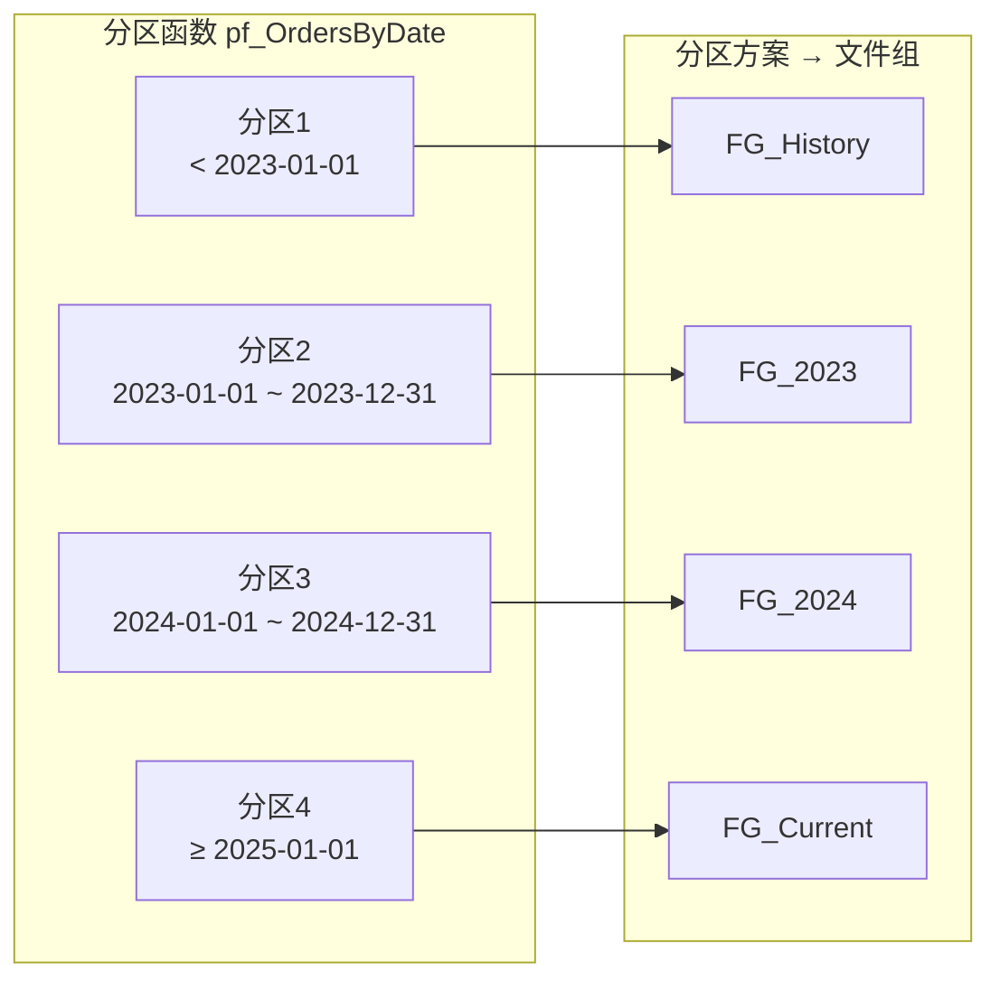
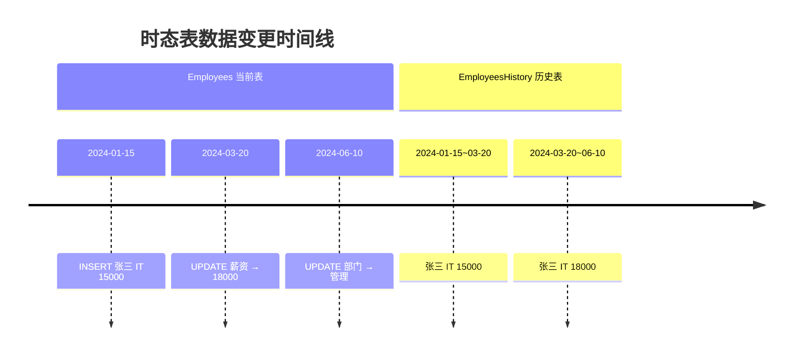
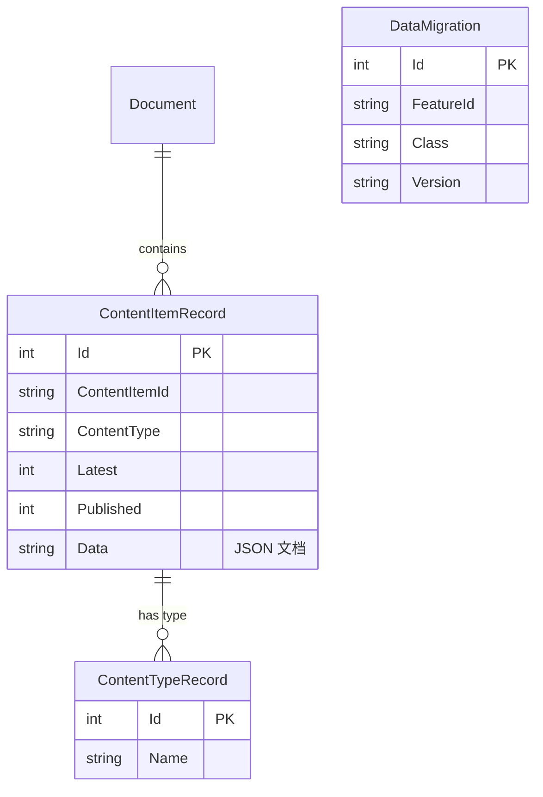

# 数据类型与表设计

> **选对数据类型，是表设计的地基。** 一个 DECIMAL(18,2) 和 FLOAT 的选择，可能导致财务数据分毫之差；一个 NVARCHAR vs VARCHAR 的混淆，可能让中文乱码。本篇系统梳理 SQL Server 数据类型与表设计实战。

---

## 一、数值类型

### 1.1 精确数值类型

| 类型 | 范围 | 存储字节 | 典型场景 |
|------|------|----------|----------|
| `TINYINT` | 0 ~ 255 | 1 | 状态码、排序号 |
| `SMALLINT` | -32,768 ~ 32,767 | 2 | 年龄、数量 |
| `INT` | -2^31 ~ 2^31-1 | 4 | 主键、计数 |
| `BIGINT` | -2^63 ~ 2^63-1 | 8 | 大表主键、雪花 ID |
| `DECIMAL(p,s)` | -10^38+1 ~ 10^38-1 | 5~17 | 金额、精确计算 |
| `NUMERIC(p,s)` | 同 DECIMAL | 5~17 | 同 DECIMAL |
| `MONEY` | ±922万亿 | 8 | 货币（精度固定4位） |
| `SMALLMONEY` | ±21万 | 4 | 小额货币 |

```sql
-- 金额存储：DECIMAL vs MONEY vs FLOAT 的精度差异
DECLARE @d DECIMAL(18,4) = 100.1234
       ,@m MONEY = 100.1234
       ,@f FLOAT = 100.1234;

SELECT @d AS DecimalVal      -- 100.1234（精确）
      ,@m AS MoneyVal        -- 100.1234（精确到4位小数）
      ,@f AS FloatVal;       -- 100.1234（可能存在浮点误差）

-- 浮点误差演示
DECLARE @a FLOAT = 0.1;
DECLARE @b FLOAT = 0.2;
SELECT @a + @b AS Result;    -- 0.30000000000000004（不是精确的0.3！）

-- 正确做法：金额用 DECIMAL
SELECT CAST(0.1 AS DECIMAL(18,2)) + CAST(0.2 AS DECIMAL(18,2)) AS Result;  -- 0.30
```

::: warning 金额绝不用 FLOAT
金融场景中，FLOAT 的浮点误差会在多次累加后放大，导致对账失败。**永远用 DECIMAL 存储金额。**
:::

### 1.2 近似数值类型

| 类型 | 范围 | 存储 | 场景 |
|------|------|------|------|
| `FLOAT(n)` | ±1.79E+308 | 4 或 8 | 科学计算、统计 |
| `REAL` | ±3.40E+38 | 4 | 等同 FLOAT(24) |

---

## 二、字符类型

| 类型 | 说明 | 存储 | 推荐 |
|------|------|------|------|
| `CHAR(n)` | 定长非 Unicode | n 字节 | 仅纯 ASCII 定长 |
| `VARCHAR(n)` | 变长非 Unicode | 实际长度+2 | — |
| `NCHAR(n)` | 定长 Unicode (UTF-16) | 2n 字节 | 定长中文 |
| `NVARCHAR(n)` | 变长 Unicode (UTF-16) | 2×实际+2 | **推荐默认选择** |
| `TEXT` | 大文本非 Unicode | 最多 2GB | ⚠️ **已废弃** |
| `NTEXT` | 大文本 Unicode | 最多 1GB | ⚠️ **已废弃** |

```sql
-- VARCHAR vs NVARCHAR 的中文存储差异
DECLARE @v VARCHAR(10) = '你好';   -- 乱码或截断（取决于排序规则）
DECLARE @n NVARCHAR(10) = N'你好'; -- 正确存储

-- NVARCHAR(MAX) 替代 NTEXT
CREATE TABLE Articles (
    ArticleId INT IDENTITY(1,1) PRIMARY KEY,
    Title NVARCHAR(200) NOT NULL,        -- 标题
    Content NVARCHAR(MAX) NOT NULL,       -- 正文（替代 NTEXT）
    Summary NVARCHAR(500) NULL            -- 摘要
);
```

::: important NVARCHAR 是默认选择
在中文环境下，**所有字符串列优先使用 NVARCHAR**。VARCHAR 只在明确仅存 ASCII（如邮编、MD5哈希）时使用，可节省约一半存储空间。
:::

---

## 三、日期时间类型

| 类型 | 范围 | 精度 | 存储 | 推荐 |
|------|------|------|------|------|
| `DATE` | 0001-01-01 ~ 9999-12-31 | 天 | 3 | ✅ 纯日期 |
| `TIME` | 00:00:00 ~ 23:59:59 | 100ns | 3~5 | ✅ 纯时间 |
| `DATETIME` | 1753-01-01 ~ 9999-12-31 | 1/300秒 | 8 | ⚠️ 旧类型 |
| `DATETIME2(n)` | 0001-01-01 ~ 9999-12-31 | 100ns | 6~8 | ✅ **推荐** |
| `DATETIMEOFFSET(n)` | 同 DATETIME2 + 时区 | 100ns | 8~10 | ✅ 跨时区 |
| `SMALLDATETIME` | 1900-01-01 ~ 2079-06-06 | 分钟 | 4 | ⚠️ 旧类型 |

```sql
-- DATETIME2 vs DATETIME 的精度差异
DECLARE @dt DATETIME = '2024-06-15 14:30:25.123';
DECLARE @dt2 DATETIME2(3) = '2024-06-15 14:30:25.123';

SELECT @dt AS OldDateTime       -- 2024-06-15 14:30:25.123（四舍五入到1/300秒）
      ,@dt2 AS NewDateTime2;    -- 2024-06-15 14:30:25.123（精确到毫秒）

-- DATETIMEOFFSET：带时区存储
DECLARE @dto DATETIMEOFFSET(3) = '2024-06-15 14:30:25.123 +08:00';
SELECT @dto AT TIME ZONE 'UTC' AS UtcTime;  -- 转换为 UTC
```

::: tip 新项目用 DATETIME2
`DATETIME2` 比 `DATETIME` 范围更广、精度更高、存储更省。**新项目一律用 DATETIME2**，DATETIME 仅用于兼容旧系统。
:::

---

## 四、特殊类型

### 4.1 HIERARCHYID — 层级数据

`HIERARCHYID` 是 SQL Server 专为树形结构设计的 CLR 类型，比传统的邻接表（ParentId）更高效。

```sql
-- 组织架构树
CREATE TABLE Organization (
    OrgId INT IDENTITY(1,1) PRIMARY KEY,
    OrgPath HIERARCHYID NOT NULL,     -- 层级路径
    OrgName NVARCHAR(100) NOT NULL,
    OrgLevel AS OrgPath.GetLevel()    -- 计算列：层级深度
);

-- 插入数据：用 /1/、/1/1/、/1/2/ 表示层级
INSERT INTO Organization (OrgPath, OrgName) VALUES
    (HIERARCHYID::Parse('/'), '总公司'),
    (HIERARCHYID::Parse('/1/'), '技术部'),
    (HIERARCHYID::Parse('/1/1/'), '后端组'),
    (HIERARCHYID::Parse('/1/2/'), '前端组'),
    (HIERARCHYID::Parse('/2/'), '市场部'),
    (HIERARCHYID::Parse('/2/1/'), '品牌组');

-- 查询某节点的所有子孙
DECLARE @Parent HIERARCHYID = (SELECT OrgPath FROM Organization WHERE OrgName = '技术部');
SELECT OrgName, OrgPath.ToString() AS Path, OrgLevel
FROM Organization
WHERE OrgPath.IsDescendantOf(@Parent) = 1;

-- 查询直接子节点
SELECT OrgName, OrgPath.ToString() AS Path
FROM Organization
WHERE OrgPath.GetAncestor(1) = @Parent;
```

### 4.2 GEOMETRY / GEOGRAPHY — 空间数据

```sql
-- 存储和查询地理位置
CREATE TABLE Stores (
    StoreId INT IDENTITY(1,1) PRIMARY KEY,
    StoreName NVARCHAR(100),
    Location GEOGRAPHY NOT NULL  -- 经纬度
);

-- 插入点（纬度 纬度, 经度）
INSERT INTO Stores (StoreName, Location) VALUES
    ('北京旗舰店', GEOGRAPHY::Point(39.9042, 116.4074, 4326)),
    ('上海分店', GEOGRAPHY::Point(31.2304, 121.4737, 4326));

-- 查找 50km 内的门店
DECLARE @Center GEOGRAPHY = GEOGRAPHY::Point(39.9042, 116.4074, 4326);
SELECT StoreName,
       Location.STDistance(@Center) / 1000 AS DistanceKm
FROM Stores
WHERE Location.STDistance(@Center) <= 50000  -- 50km
ORDER BY DistanceKm;
```

### 4.3 JSON 支持

SQL Server 2016+ 原生支持 JSON（通过 NVARCHAR 存储 + 内置函数解析）：

```sql
-- JSON 列存储灵活数据
CREATE TABLE Products (
    ProductId INT IDENTITY(1,1) PRIMARY KEY,
    ProductName NVARCHAR(200) NOT NULL,
    Price DECIMAL(18,2) NOT NULL,
    Attributes NVARCHAR(MAX)  -- JSON 格式属性
);

INSERT INTO Products VALUES
('iPhone 15', 6999.00, N'{"Color":"深空黑","Storage":"128GB","Weight":"171g"}'),
('MacBook Pro', 14999.00, N'{"Color":"银色","CPU":"M3","RAM":"16GB"}');

-- 查询 JSON 属性
SELECT ProductName,
       JSON_VALUE(Attributes, '$.Color') AS Color,
       JSON_VALUE(Attributes, '$.Storage') AS Storage
FROM Products;

-- FOR JSON：将查询结果转为 JSON
SELECT ProductId, ProductName, Price
FROM Products
WHERE Price > 5000
FOR JSON PATH;
```

---

## 五、IDENTITY vs SEQUENCE

### 5.1 IDENTITY（自增列）

```sql
CREATE TABLE Orders (
    OrderId INT IDENTITY(1,1) PRIMARY KEY,  -- 从1开始，每次+1
    CustomerId INT NOT NULL,
    OrderDate DATETIME2(3) DEFAULT SYSDATETIME()
);

-- IDENTITY 无法手动插入（除非 SET IDENTITY_INSERT ON）
SET IDENTITY_INSERT Orders ON;
INSERT INTO Orders (OrderId, CustomerId, OrderDate) VALUES (1000, 1, '2024-01-01');
SET IDENTITY_INSERT Orders OFF;
```

### 5.2 SEQUENCE（序列）

```sql
-- SEQUENCE：更灵活的自增方案
CREATE SEQUENCE seq_OrderNo
    AS BIGINT
    START WITH 100000
    INCREMENT BY 1
    NO CACHE;  -- 或 CACHE 50 提高性能但可能跳号

-- 在 INSERT 中使用
INSERT INTO Orders (OrderId, CustomerId, OrderDate)
VALUES (NEXT VALUE FOR seq_OrderNo, 1, SYSDATETIME());

-- SEQUENCE 优势：
-- ✅ 可跨表共享
-- ✅ 可重置 (ALTER SEQUENCE ... RESTART)
-- ✅ 可定义 CACHE 减少锁争用
-- ✅ 不绑定到特定列
```

| 特性 | IDENTITY | SEQUENCE |
|------|----------|----------|
| 绑定列 | 是 | 否（独立对象） |
| 跨表共享 | ❌ | ✅ |
| 手动获取下一个值 | ❌（需插入后取） | ✅（NEXT VALUE FOR） |
| 重置 | DBCC CHECKIDENT | ALTER SEQUENCE RESTART |
| CACHE | ❌ | ✅ |
| 事务回滚是否跳号 | 是（跳号） | 是（跳号，CACHE 更明显） |

---

## 六、计算列与稀疏列

### 6.1 计算列（Computed Column）

```sql
CREATE TABLE OrderItems (
    ItemId INT IDENTITY(1,1) PRIMARY KEY,
    OrderId INT NOT NULL,
    ProductName NVARCHAR(200),
    Quantity INT NOT NULL,
    UnitPrice DECIMAL(18,2) NOT NULL,
    -- 持久化计算列：存入磁盘，可建索引
    LineTotal AS (Quantity * UnitPrice) PERSISTED,
    -- 非持久化计算列：每次查询时计算
    DiscountPrice AS (Quantity * UnitPrice * 0.9)
);

-- 持久化计算列可建索引
CREATE INDEX IX_OrderItems_LineTotal ON OrderItems(LineTotal);
```

### 6.2 稀疏列（Sparse Column）

当列中大部分值为 NULL 时，稀疏列可节省存储空间：

```sql
CREATE TABLE ProductAttributes (
    ProductId INT PRIMARY KEY,
    [Color] NVARCHAR(50) SPARSE NULL,      -- 90% 的产品没有此属性
    [Size] NVARCHAR(20) SPARSE NULL,        -- 85% 没有
    [Weight] DECIMAL(10,2) SPARSE NULL,     -- 80% 没有
    [Material] NVARCHAR(100) SPARSE NULL,   -- 95% 没有
    ExtraData XML COLUMN_SET FOR ALL_SPARSE_COLUMNS  -- 列集：统一查询
);
```

::: warning 稀疏列的代价
非 NULL 值的存储比普通列多 2~4 字节。只有当 NULL 比例 > 40%（INT 类型）或 > 60%（NVARCHAR 类型）时才划算。具体阈值参考 SQL Server 文档。
:::

---

## 七、表分区（Table Partitioning）

```sql
-- 1. 创建分区函数：按日期范围分区
CREATE PARTITION FUNCTION pf_OrdersByDate(DATETIME2(3))
AS RANGE RIGHT FOR VALUES
('2023-01-01', '2024-01-01', '2025-01-01');
-- RIGHT: 边界值属于右侧分区 → [..., 2023), [2023, 2024), [2024, 2025), [2025, ...)

-- 2. 创建分区方案：映射到文件组
CREATE PARTITION SCHEME ps_OrdersByDate
AS PARTITION pf_OrdersByDate
TO (FG_History, FG_2023, FG_2024, FG_Current);

-- 3. 创建分区表
CREATE TABLE Orders (
    OrderId BIGINT IDENTITY(1,1),
    OrderDate DATETIME2(3) NOT NULL,
    CustomerId INT NOT NULL,
    Amount DECIMAL(18,2) NOT NULL
) ON ps_OrdersByDate(OrderDate);

-- 4. 分区切换（最快的数据归档方式）
ALTER TABLE Orders SWITCH PARTITION 1 TO Orders_Archive PARTITION 1;
-- 瞬间完成，不移动数据，只修改元数据
```



---

## 八、时态表（System-Versioned Temporal Tables）

SQL Server 2016+ 的时态表自动记录数据变更历史，无需手动维护历史表。

```sql
-- 创建时态表
CREATE TABLE Employees (
    EmployeeId INT IDENTITY(1,1) PRIMARY KEY,
    Name NVARCHAR(100) NOT NULL,
    Department NVARCHAR(50) NOT NULL,
    Salary DECIMAL(18,2) NOT NULL,
    ValidFrom DATETIME2(2) GENERATED ALWAYS AS ROW START HIDDEN,
    ValidTo DATETIME2(2) GENERATED ALWAYS AS ROW END HIDDEN,
    PERIOD FOR SYSTEM_TIME (ValidFrom, ValidTo)
)
WITH (SYSTEM_VERSIONING = ON (HISTORY_TABLE = dbo.EmployeesHistory));

-- 插入和修改数据
INSERT INTO Employees (Name, Department, Salary) VALUES ('张三', 'IT', 15000);
UPDATE Employees SET Salary = 18000 WHERE Name = '张三';
UPDATE Employees SET Department = '管理' WHERE Name = '张三';

-- 查询当前数据
SELECT EmployeeId, Name, Department, Salary FROM Employees;

-- 查询某个时间点的数据
SELECT * FROM Employees
FOR SYSTEM_TIME AS OF '2024-06-01T10:00:00';

-- 查询某段时间内的所有变更
SELECT * FROM Employees
FOR SYSTEM_TIME BETWEEN '2024-01-01' AND '2024-12-31';

-- 查询所有历史版本
SELECT * FROM Employees
FOR SYSTEM_TIME ALL;
```



---

## 九、Orchard Core 表结构设计

[Orchard Core](https://github.com/OrchardCMS/OrchardCore) 使用 YesSql ORM，采用文档-关系混合模式，所有表带 `Orchard_` 前缀。



```sql
-- Orchard Core 的核心表结构（简化）
-- Orchard_Framework_Document：文档存储表
SELECT TOP 5 Id, Type, Content
FROM Orchard_Framework_Document;

-- Orchard_Framework_ContentItemRecord：内容项表
SELECT TOP 5 Id, ContentItemId, ContentType, Latest, Published, ModifiedUtc
FROM Orchard_Framework_ContentItemRecord;

-- Orchard_Framework_DataMigration：迁移版本跟踪
SELECT FeatureId, Class, Version
FROM Orchard_Framework_DataMigration
ORDER BY FeatureId;
```

::: tip Orchard Core 的设计理念
Orchard Core 的核心设计是 **"文档在关系型数据库上的投影"**：用 `Document` 表存储 JSON 文档（Content 字段），用 `ContentItemRecord` 管理版本和发布状态。这种设计让 CMS 内容建模极其灵活，同时保留了关系型数据库的查询能力。
:::

---

## 十、面试技巧

::: tip 面试高频考点
1. **DECIMAL vs FLOAT**：金额场景必须用 DECIMAL，面试必问
2. **NVARCHAR vs VARCHAR**：中文环境下默认 NVARCHAR，VARCHAR 省50%空间但只存 ASCII
3. **DATETIME2 vs DATETIME**：新项目用 DATETIME2，范围更广精度更高
4. **IDENTITY vs SEQUENCE**：SEQUENCE 跨表共享、可重置、可缓存，更灵活
5. **时态表**：SQL Server 2016+ 特性，面试加分项，FOR SYSTEM_TIME 语法
6. **HIERARCHYID**：树形结构专用类型，比邻接表高效
7. **表分区 vs 时态表**：分区是性能优化，时态表是审计追踪，不要混淆
:::

::: warning 易错点
- "MONEY 和 DECIMAL 一样"——❌，MONEY 精度固定4位，运算可能截断；DECIMAL 可自定义精度
- "VARCHAR 能存中文"——取决于排序规则（Collation），中文应使用 NVARCHAR + N 前缀
- "IDENTITY 保证不跳号"——❌，事务回滚、实例重启都会跳号
- "稀疏列什么时候都能省空间"——❌，非 NULL 值反而更耗空间
:::

---

## 参考资料

- [Data Types (Transact-SQL)](https://learn.microsoft.com/en-us/sql/t-sql/data-types/data-types-transact-sql)
- [HIERARCHYID](https://learn.microsoft.com/en-us/sql/t-sql/data-types/hierarchyid-data-type-method-reference)
- [Temporal Tables](https://learn.microsoft.com/en-us/sql/relational-databases/tables/temporal-tables)
- [JSON Data](https://learn.microsoft.com/en-us/sql/relational-databases/json/json-data-sql-server)
- [Orchard Core GitHub](https://github.com/OrchardCMS/OrchardCore)
