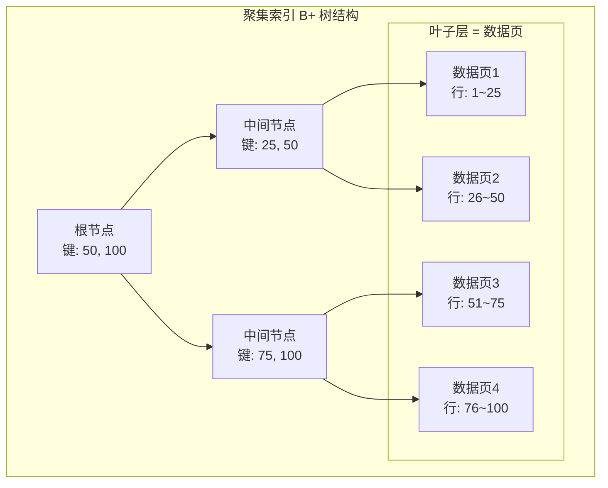
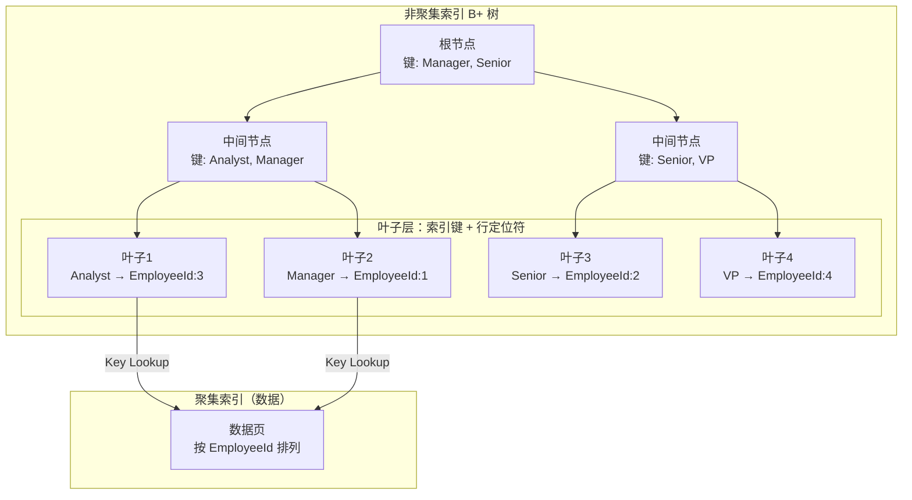
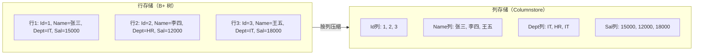

# 索引体系

> **索引是 SQL Server 性能调优的第一利器。** 一个好的索引能让查询从秒级降到毫秒级，一个差的索引能拖慢整个系统。本篇深入 SQL Server 索引的内部结构与设计哲学。

---

## 一、聚集索引（Clustered Index）

聚集索引决定了表中数据的 **物理存储顺序**。一个表只能有一个聚集索引，因为数据只能按一种方式物理排列。



**关键特性：**
- 叶子节点 = 实际数据行（不是指针！）
- 数据按聚集索引键排序存储
- 默认主键即聚集索引（可显式指定 NONCLUSTERED）
- 没有聚集索引的表称为 **堆表（Heap）**

```sql
-- 创建聚集索引
CREATE CLUSTERED INDEX IX_Orders_OrderDate
ON Orders(OrderDate);

-- 主键默认创建聚集索引
CREATE TABLE Customers (
    CustomerId INT IDENTITY(1,1) PRIMARY KEY,  -- 默认 CLUSTERED
    CustomerName NVARCHAR(100) NOT NULL
);

-- 显式指定非聚集主键 + 另一个聚集索引
CREATE TABLE Products (
    ProductId INT IDENTITY(1,1) PRIMARY KEY NONCLUSTERED,
    ProductName NVARCHAR(200) NOT NULL,
    CategoryId INT NOT NULL,
    CreateDate DATETIME2(3) DEFAULT SYSDATETIME()
);
CREATE CLUSTERED INDEX IX_Products_CreateDate ON Products(CreateDate);
```

::: important 聚集索引键的选择原则
1. **窄列**：聚集索引键会被所有非聚集索引引用（作为行定位符），键越宽，所有索引越大
2. **唯一**：非唯一时 SQL Server 添加 4 字节唯一标识符，增加存储开销
3. **静态**：键值变更会导致整行移动 + 所有非聚集索引更新
4. **递增**：避免页面分裂（如 IDENTITY），但注意可能造成热点页
:::

---

## 二、非聚集索引（Non-Clustered Index）

非聚集索引是独立于数据存储的 B+ 树结构，叶子节点存储 **行定位符**（聚集索引键或 RID）。



```sql
-- 创建非聚集索引
CREATE NONCLUSTERED INDEX IX_Employees_Department
ON Employees(Department);

-- 一个表最多 999 个非聚集索引（实际建议 < 10 个）
```

---

## 三、包含列索引（Covering Index）

通过 `INCLUDE` 将额外列存储在索引叶子层，避免 Key Lookup 回表：

```sql
-- 没有 INCLUDE：需要回表查 Name
SELECT EmployeeId, Name, Department
FROM Employees
WHERE Department = 'IT';
-- 执行计划: Index Seek → Key Lookup

-- 包含列索引：覆盖查询所需所有列
CREATE NONCLUSTERED INDEX IX_Employees_Dept_Cover
ON Employees(Department)
INCLUDE (EmployeeId, Name);
-- 执行计划: Index Seek（无需回表！）
```

```sql
-- 实战：覆盖订单查询
-- 慢查询
SELECT OrderId, CustomerId, OrderDate, Amount
FROM Orders
WHERE CustomerId = 1001 AND OrderDate >= '2024-01-01';

-- 覆盖索引
CREATE NONCLUSTERED INDEX IX_Orders_CustDate_Cover
ON Orders(CustomerId, OrderDate)
INCLUDE (OrderId, Amount);
```

::: tip 何时使用 INCLUDE
- SELECT 中需要但不在 WHERE/JOIN/ORDER BY 中的列 → 放 INCLUDE
- INCLUDE 列不计入索引键，不影响排序，不影响索引层级深度
- INCLUDE 列适合宽列（如 NVARCHAR(500)），因为只存在叶子层
:::

---

## 四、筛选索引（Filtered Index）

对满足条件的行建索引，减少索引大小和维护开销：

```sql
-- 只为活跃订单建索引
CREATE NONCLUSTERED INDEX IX_Orders_Active
ON Orders(CustomerId, OrderDate)
WHERE Status = 'Active';
-- 索引只包含 Status='Active' 的行，大小可能只有全量索引的 5%

-- 只为非 NULL 值建索引
CREATE NONCLUSTERED INDEX IX_Products_SKU
ON Products(SKU)
WHERE SKU IS NOT NULL;
```

::: warning 筛选索引的查询匹配
查询的 WHERE 条件必须 **包含** 筛选索引的条件，SQL Server 才会考虑使用该索引。如果查询没有 `WHERE Status = 'Active'`，则不会使用上面的筛选索引。
:::

---

## 五、列存储索引（Columnstore Index）

列存储索引将数据按 **列** 而非按行存储，是数据仓库和分析查询的利器。



```sql
-- 聚集列存储索引（整个表按列存储，适合事实表）
CREATE CLUSTERED COLUMNSTORE INDEX CCI_Sales
ON SalesFact;

-- 非聚集列存储索引（行存储表上叠加列存储，适合混合负载）
CREATE NONCLUSTERED COLUMNSTORE INDEX NCCI_Employees
ON Employees(Department, Salary, HireDate);

-- 列存储索引的典型查询：聚合分析
SELECT Department, AVG(Salary) AS AvgSalary, COUNT(*) AS HeadCount
FROM Employees
GROUP BY Department;
-- 列存储只读 Salary 和 Department 列，不读 Name/Id 等无关列
```

| 特性 | 行存储（B+ 树） | 列存储（Columnstore） |
|------|-----------------|----------------------|
| 存储方式 | 按行 | 按列 |
| 压缩率 | 低 | 高（5x~10x） |
| 点查询 | ✅ 极快 | ❌ 慢 |
| 范围扫描 | 中等 | ✅ 极快 |
| 聚合分析 | 中等 | ✅ 极快 |
| 单行更新 | ✅ 高效 | ⚠️ 通过增量存储间接支持 |

---

## 六、内存优化索引（In-Memory OLTP）

```sql
-- 内存优化表 + 哈希索引
CREATE TABLE InMem_Orders (
    OrderId INT NOT NULL PRIMARY KEY
        NONCLUSTERED HASH WITH (BUCKET_COUNT = 1000000),
    CustomerId INT NOT NULL,
    Amount DECIMAL(18,2) NOT NULL,
    INDEX IX_Customer HASH (CustomerId) WITH (BUCKET_COUNT = 500000)
) WITH (MEMORY_OPTIMIZED = ON, DURABILITY = SCHEMA_AND_DATA);

-- 范围查询用 Range 索引
CREATE TABLE InMem_Log (
    LogId BIGINT NOT NULL PRIMARY KEY NONCLUSTERED,
    LogTime DATETIME2 NOT NULL,
    Message NVARCHAR(4000),
    INDEX IX_LogTime (LogTime)  -- Range 索引，支持范围扫描
) WITH (MEMORY_OPTIMIZED = ON, DURABILITY = SCHEMA_ONLY);
```

::: warning 哈希索引的 BUCKET_COUNT
- 太小：大量哈希冲突，查询退化为链表扫描
- 太大：浪费内存
- 经验值：预期行数的 1.5~2 倍，且必须是 2 的幂
- 无法动态调整，需要重建表
:::

---

## 七、索引设计最佳实践

### 7.1 SARGability（可搜索参数）

SARGable（Search Argument Able）指查询条件能利用索引查找：

```sql
-- ✅ SARGable：可以用索引 Seek
WHERE OrderDate >= '2024-01-01'
WHERE Name LIKE '张%'
WHERE Salary BETWEEN 10000 AND 20000

-- ❌ 非 SARGable：导致 Index Scan
WHERE YEAR(OrderDate) = 2024           -- 函数包裹列
WHERE LEFT(Name, 1) = '张'             -- 函数包裹列
WHERE Salary * 12 > 100000             -- 列参与运算
WHERE Name LIKE '%三'                  -- 前导通配符
WHERE ISNULL(Dept, 'IT') = 'IT'       -- 函数包裹列

-- 修复：改写条件
WHERE OrderDate >= '2024-01-01' AND OrderDate < '2025-01-01'  -- 替代 YEAR()
WHERE Name >= N'张' AND Name < N'张\xff'                     -- 替代 LEFT()
WHERE Salary > 100000 / 12                                   -- 运算移到右侧
```

### 7.2 选择性与基数

```sql
-- 查看索引的选择性
SELECT
    i.name AS IndexName,
    s.row_count,
    s.range_scan_count,
    s.singleton_lookup_count,
    CAST(s.singleton_lookup_count AS FLOAT) / NULLIF(s.range_scan_count, 0) AS SeekToScanRatio
FROM sys.indexes i
JOIN sys.dm_db_index_usage_stats s
    ON i.object_id = s.object_id AND i.index_id = s.index_id
WHERE i.object_id = OBJECT_ID('Orders')
ORDER BY i.name;
```

### 7.3 最左前缀原则

```sql
-- 复合索引 (CustomerId, OrderDate, Status)
CREATE INDEX IX_Orders_CustDateStatus
ON Orders(CustomerId, OrderDate, Status);

-- ✅ 能用索引
WHERE CustomerId = 1001
WHERE CustomerId = 1001 AND OrderDate >= '2024-01-01'
WHERE CustomerId = 1001 AND OrderDate >= '2024-01-01' AND Status = 'Active'

-- ❌ 不能用索引（缺少最左列 CustomerId）
WHERE OrderDate >= '2024-01-01'
WHERE Status = 'Active'

-- ⚠️ 部分使用（只有 CustomerId 能用索引 Seek）
WHERE CustomerId = 1001 AND Status = 'Active'  -- 跳过了 OrderDate
```

---

## 八、索引碎片维护

```sql
-- 1. 检查索引碎片
SELECT
    i.name AS IndexName,
    ips.avg_fragmentation_in_percent,
    ips.page_count,
    CASE
        WHEN ips.avg_fragmentation_in_percent > 30 THEN 'REBUILD'
        WHEN ips.avg_fragmentation_in_percent > 10 THEN 'REORGANIZE'
        ELSE 'OK'
    END AS Action
FROM sys.indexes i
CROSS APPLY sys.dm_db_index_physical_stats(
    DB_ID(), i.object_id, i.index_id, NULL, 'LIMITED'
) ips
WHERE i.object_id = OBJECT_ID('Orders')
ORDER BY ips.avg_fragmentation_in_percent DESC;

-- 2. 重建索引（脱机，锁表）
ALTER INDEX IX_Orders_OrderDate ON Orders REBUILD;

-- 3. 重组索引（联机，不锁表）
ALTER INDEX IX_Orders_OrderDate ON Orders REORGANIZE;

-- 4. 联机重建（Enterprise 版本）
ALTER INDEX IX_Orders_OrderDate ON Orders REBUILD WITH (ONLINE = ON);
```

| 碎片率 | 建议 |
|--------|------|
| < 10% | 无需操作 |
| 10% ~ 30% | REORGANIZE（联机，轻量） |
| > 30% | REBUILD（更彻底，默认脱机） |

::: important DMV 监控索引使用
```sql
-- 找出从未被使用过的索引（可考虑删除）
SELECT i.name AS IndexName, i.type_desc, s.user_seeks, s.user_scans,
       s.user_lookups, s.user_updates, s.last_user_seek, s.last_user_scan
FROM sys.indexes i
LEFT JOIN sys.dm_db_index_usage_stats s
    ON i.object_id = s.object_id AND i.index_id = s.index_id
WHERE i.object_id = OBJECT_ID('YourTable')
    AND i.name IS NOT NULL
    AND i.is_primary_key = 0
    AND i.is_unique_constraint = 0
    AND (s.user_seeks + s.user_scans + s.user_lookups) = 0
ORDER BY i.name;
```
未被使用的索引白白增加写入开销和维护成本，应定期清理。
:::

---

## 九、面试技巧

::: tip 面试高频考点
1. **聚集 vs 非聚集**：聚集索引叶子=数据，非聚集叶子=行定位符。一个表一个聚集，999个非聚集
2. **B+ 树 vs B 树**：B+ 树数据只在叶子层，叶子层有双向链表，适合范围查询
3. **覆盖索引**：INCLUDE 列避免 Key Lookup，是性能调优最常用的手段
4. **SARGability**：WHERE 条件中列被函数包裹会导致索引失效，要会改写
5. **碎片维护**：>30% REBUILD，10%~30% REORGANIZE
6. **列存储索引**：分析场景用列存储，OLTP 场景用行存储
7. **最左前缀**：复合索引 (A, B, C)，查询条件必须从 A 开始才能用索引
:::

::: warning 易错点
- "聚集索引就是主键"——❌，主键默认创建聚集索引，但可以 NONCLUSTERED
- "非聚集索引的行定位符是物理地址"——不完全对：堆表是 RID（物理地址），有聚集索引的表是聚集索引键
- "索引越多查询越快"——❌，索引增加写入开销、占用存储、需要维护
- "REORGANIZE 和 REBUILD 一样"——❌，REORGANIZE 只整理叶子层，REBUILD 重建整棵 B+ 树
:::

---

## 参考资料

- [Clustered and Nonclustered Indexes](https://learn.microsoft.com/en-us/sql/relational-databases/indexes/clustered-and-nonclustered-indexes-described)
- [Columnstore Indexes](https://learn.microsoft.com/en-us/sql/relational-databases/indexes/columnstore-indexes-overview)
- [In-Memory OLTP](https://learn.microsoft.com/en-us/sql/relational-databases/in-memory-oltp/overview-and-usage-scenarios)
- [sys.dm_db_index_physical_stats](https://learn.microsoft.com/en-us/sql/relational-databases/system-dynamic-management-views/sys-dm-db-index-physical-stats-transact-sql)
- [Orchard Core GitHub](https://github.com/OrchardCMS/OrchardCore)
