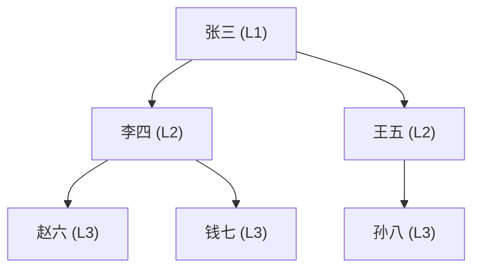

# T-SQL 核心

> **T-SQL 是 SQL Server 的编程语言，不仅仅是查询。** 变量、流程控制、CTE、动态 SQL、JSON——掌握这些，你才能写出真正高效的企业级 SQL。

---

## 一、变量与流程控制

### 1.1 变量声明与赋值

```sql
-- 声明变量
DECLARE @OrderId INT = 1001;
DECLARE @StartDate DATETIME2(3) = '2024-01-01';
DECLARE @CustomerName NVARCHAR(100);

-- 赋值
SET @CustomerName = N'张三';
-- 或通过查询赋值（只返回一行时）
SELECT @CustomerName = CustomerName
FROM Customers
WHERE CustomerId = 1;
```

### 1.2 IF...ELSE

```sql
DECLARE @Stock INT = 5;

IF @Stock < 10
BEGIN
    PRINT '库存不足，请及时补货';
    -- 发送告警通知
END
ELSE IF @Stock < 50
BEGIN
    PRINT '库存偏低';
END
ELSE
BEGIN
    PRINT '库存充足';
END
```

### 1.3 WHILE 循环

```sql
-- 批量处理：每次删除 1000 行，避免事务日志膨胀
DECLARE @RowsAffected INT = 1;

WHILE @RowsAffected > 0
BEGIN
    DELETE TOP (1000) FROM OrderDetails
    WHERE OrderDate < '2023-01-01';

    SET @RowsAffected = @@ROWCOUNT;
    PRINT '删除了 ' + CAST(@RowsAffected AS NVARCHAR(10)) + ' 行';
END
```

### 1.4 TRY...CATCH

```sql
BEGIN TRY
    BEGIN TRANSACTION;

    UPDATE Accounts SET Balance = Balance - 500 WHERE AccountId = 1;
    UPDATE Accounts SET Balance = Balance + 500 WHERE AccountId = 2;

    COMMIT TRANSACTION;
END TRY
BEGIN CATCH
    IF @@TRANCOUNT > 0
        ROLLBACK TRANSACTION;

    PRINT '错误: ' + ERROR_MESSAGE();
    PRINT '严重级别: ' + CAST(ERROR_SEVERITY() AS NVARCHAR(10));
    PRINT '错误行号: ' + CAST(ERROR_LINE() AS NVARCHAR(10));
END CATCH
```

### 1.5 CASE 表达式

```sql
-- 行转列 + 条件分类
SELECT
    EmployeeId,
    Name,
    Department,
    Salary,
    CASE
        WHEN Salary >= 20000 THEN N'高级'
        WHEN Salary >= 12000 THEN N'中级'
        ELSE N'初级'
    END AS SalaryLevel,
    CASE Department
        WHEN 'IT' THEN '技术'
        WHEN 'HR' THEN '人事'
        WHEN 'Sales' THEN '销售'
        ELSE '其他'
    END AS DeptName
FROM Employees;
```

---

## 二、CTE（公共表表达式）

### 2.1 普通 CTE

```sql
-- CTE：先计算部门平均工资，再筛选高于平均的员工
;WITH DeptAvg AS (
    SELECT Department, AVG(Salary) AS AvgSalary
    FROM Employees
    GROUP BY Department
)
SELECT e.Name, e.Department, e.Salary, d.AvgSalary,
       e.Salary - d.AvgSalary AS DiffFromAvg
FROM Employees e
JOIN DeptAvg d ON e.Department = d.Department
WHERE e.Salary > d.AvgSalary
ORDER BY e.Department, e.Salary DESC;
```

### 2.2 递归 CTE

```sql
-- 组织架构树：查询某员工的所有下属（含多层）
;WITH OrgChart AS (
    -- 锚点：起始节点
    SELECT EmployeeId, Name, ManagerId, 1 AS Level
    FROM Employees
    WHERE EmployeeId = 1  -- 总经理

    UNION ALL

    -- 递归成员：逐层向下
    SELECT e.EmployeeId, e.Name, e.ManagerId, o.Level + 1
    FROM Employees e
    JOIN OrgChart o ON e.ManagerId = o.EmployeeId
)
SELECT EmployeeId, Name, Level,
       REPLICATE('  ', Level - 1) + Name AS OrgTree
FROM OrgChart
ORDER BY Level, EmployeeId
OPTION (MAXRECURSION 100);  -- 默认 100，设 0 无限制
```



::: important 递归 CTE 注意事项
1. 锚点和递归成员的列数、类型必须一致
2. 递归成员不能包含：GROUP BY、HAVING、TOP、LEFT/RIGHT JOIN（除非递归表在右边）
3. 默认最大递归 100 层，超过报错，用 `OPTION (MAXRECURSION n)` 调整
4. 递归 CTE 可能性能较差，深层级（>1000层）考虑用 HIERARCHYID 或持久化路径
:::

---

## 三、临时表 vs 表变量 vs 表值参数

### 3.1 临时表（#temp / ##global）

```sql
-- 局部临时表（仅当前会话可见）
CREATE TABLE #TempOrders (
    OrderId INT,
    CustomerId INT,
    Amount DECIMAL(18,2)
);

INSERT INTO #TempOrders
SELECT OrderId, CustomerId, Amount FROM Orders WHERE OrderDate >= '2024-01-01';

-- 全局临时表（所有会话可见，创建者断开后自动删除）
CREATE TABLE ##GlobalSummary (
    Department NVARCHAR(50),
    TotalSalary DECIMAL(18,2)
);
```

### 3.2 表变量（@table）

```sql
DECLARE @DeptTotals TABLE (
    Department NVARCHAR(50),
    TotalAmount DECIMAL(18,2)
);

INSERT INTO @DeptTotals
SELECT Department, SUM(Amount) AS TotalAmount
FROM Orders o JOIN Employees e ON o.EmployeeId = e.EmployeeId
GROUP BY e.Department;

SELECT * FROM @DeptTotals ORDER BY TotalAmount DESC;
```

### 3.3 对比

| 特性 | 临时表 (#temp) | 表变量 (@table) |
|------|---------------|----------------|
| 作用域 | 当前会话 | 当前批处理 |
| 统计信息 | ✅ 有 | ❌ 无（估算固定1行） |
| 索引 | ✅ 可创建 | ❌ 仅主键/唯一约束 |
| 事务回滚 | ✅ 参与 | ❌ 不参与 |
| 日志 | 少量 | 极少量 |
| 大数据量 | ✅ 适合（>1000行） | ❌ 适合小数据（<1000行） |
| tempdb 负载 | 较重 | 较轻 |
| 并发 | 会话隔离 | 无并发问题 |

::: tip 选择建议
- **< 1000 行**：表变量（无统计信息开销）
- **> 1000 行**：临时表（有统计信息，优化器能选更好的计划）
- **需要跨存储过程传递表数据**：表值参数（TVP）
:::

### 3.4 表值参数（Table-Valued Parameters）

```sql
-- 1. 定义表类型
CREATE TYPE OrderIdTable AS TABLE (
    OrderId INT NOT NULL PRIMARY KEY
);

-- 2. 存储过程使用表值参数
CREATE PROCEDURE dbo.GetOrderDetails
    @OrderIds OrderIdTable READONLY
AS
BEGIN
    SELECT o.OrderId, o.CustomerId, o.Amount
    FROM Orders o
    JOIN @OrderIds ids ON o.OrderId = ids.OrderId;
END

-- 3. 调用
DECLARE @Ids OrderIdTable;
INSERT INTO @Ids VALUES (1001), (1002), (1003);
EXEC dbo.GetOrderDetails @Ids;
```

---

## 四、动态 SQL

### 4.1 sp_executesql（参数化，安全）

```sql
-- ✅ 参数化动态 SQL：防注入 + 计划缓存复用
DECLARE @Sql NVARCHAR(MAX) = N'
    SELECT OrderId, CustomerId, Amount
    FROM Orders
    WHERE CustomerId = @CustId AND OrderDate >= @StartDate';

EXEC sp_executesql
    @Sql,
    N'@CustId INT, @StartDate DATETIME2(3)',
    @CustId = 1001,
    @StartDate = '2024-01-01';
```

### 4.2 EXEC（非参数化，有注入风险）

```sql
-- ❌ 字符串拼接：有 SQL 注入风险！
DECLARE @Dept NVARCHAR(50) = N'IT'';
DELETE FROM Employees; --';

EXEC('SELECT * FROM Employees WHERE Department = ''' + @Dept + '''');
-- 实际执行: SELECT * FROM Employees WHERE Department = 'IT'; DELETE FROM Employees; --'
```

::: warning 永远用 sp_executesql 替代 EXEC
- **sp_executesql**：参数化，防注入，计划可缓存复用
- **EXEC**：字符串拼接，SQL 注入风险，每次生成新计划
- 只有在无法参数化的场景（如动态表名、动态列名）才用 EXEC，且必须用 `QUOTENAME()` 防注入
:::

```sql
-- 动态表名/列名：用 QUOTENAME 防注入
DECLARE @TableName NVARCHAR(128) = N'Orders';
DECLARE @ColumnName NVARCHAR(128) = N'Amount';
DECLARE @Sql NVARCHAR(MAX);

SET @Sql = N'SELECT ' + QUOTENAME(@ColumnName) + N' FROM ' + QUOTENAME(@TableName);
EXEC sp_executesql @Sql;
-- QUOTENAME('Orders') → [Orders]
-- QUOTENAME('Orders; DROP TABLE Users--') → [Orders; DROP TABLE Users--]（被安全引用）
```

---

## 五、MERGE 语句

```sql
-- MERGE：根据条件 INSERT / UPDATE / DELETE（常用于 ETL 同步）
MERGE INTO Employees AS target
USING (SELECT EmployeeId, Name, Department, Salary FROM EmployeeStaging) AS source
ON target.EmployeeId = source.EmployeeId

WHEN MATCHED AND (
    target.Name <> source.Name
    OR target.Department <> source.Department
    OR target.Salary <> source.Salary
) THEN
    UPDATE SET
        target.Name = source.Name,
        target.Department = source.Department,
        target.Salary = source.Salary

WHEN NOT MATCHED THEN
    INSERT (Name, Department, Salary)
    VALUES (source.Name, source.Department, source.Salary)

WHEN NOT MATCHED BY SOURCE THEN
    DELETE;
```

::: warning MERGE 的坑
1. 在某些 SQL Server 版本中，MERGE 可能对同一行执行多次操作（违反标准语义）
2. MERGE 持有更长时间的锁，高并发下可能造成阻塞
3. 建议：对简单 UPSERT 用 `IF EXISTS ... UPDATE ELSE INSERT` 替代
4. 如必须用 MERGE，加上 `HOLDLOCK` 提示保护并发
:::

---

## 六、分页：OFFSET...FETCH

```sql
-- SQL Server 2012+ 标准分页
SELECT OrderId, CustomerId, OrderDate, Amount
FROM Orders
ORDER BY OrderDate DESC, OrderId DESC
OFFSET 0 ROWS FETCH NEXT 20 ROWS ONLY;  -- 第1页

-- 参数化分页
DECLARE @PageNumber INT = 3;
DECLARE @PageSize INT = 20;

SELECT OrderId, CustomerId, OrderDate, Amount
FROM Orders
ORDER BY OrderDate DESC, OrderId DESC
OFFSET (@PageNumber - 1) * @PageSize ROWS
FETCH NEXT @PageSize ROWS ONLY;
```

::: important OFFSET...FETCH 性能
- **前几页**：性能好（只扫描少量行）
- **深分页**（如第 10000 页）：需要先跳过前面所有行，性能差
- 深分页优化：用 Keyset Pagination（WHERE Key > lastSeenKey）
:::

---

## 七、字符串与 JSON 函数

### 7.1 字符串函数（2016+）

```sql
-- STRING_AGG：字符串聚合（2017+）
SELECT Department,
       STRING_AGG(Name, ', ') WITHIN GROUP (ORDER BY Salary DESC) AS EmployeeList
FROM Employees
GROUP BY Department;
-- IT: 张三, 王五, 赵六

-- STRING_SPLIT：字符串拆分（2016+）
SELECT value AS Tag
FROM STRING_SPLIT('C#,SQL,Python,Docker', ',');
-- C# / SQL / Python / Docker

-- CONCAT_WS：带分隔符拼接，自动忽略 NULL（2017+）
SELECT CONCAT_WS(' - ', FirstName, MiddleName, LastName) AS FullName
FROM Users;
```

### 7.2 JSON 函数

```sql
-- FOR JSON PATH：查询结果转 JSON
SELECT OrderId, CustomerId, Amount
FROM Orders
WHERE CustomerId = 1001
FOR JSON PATH;
-- [{"OrderId":1001,"CustomerId":1001,"Amount":500.00}, ...]

-- OPENJSON：解析 JSON 为行集
DECLARE @Json NVARCHAR(MAX) = N'[
    {"ProductId":1, "Name":"iPhone 15", "Price":6999},
    {"ProductId":2, "Name":"MacBook Pro", "Price":14999}
]';

SELECT ProductId, Name, Price
FROM OPENJSON(@Json)
WITH (
    ProductId INT '$.ProductId',
    Name NVARCHAR(200) '$.Name',
    Price DECIMAL(18,2) '$.Price'
);

-- JSON_VALUE：提取标量值
SELECT JSON_VALUE(Attributes, '$.Color') AS Color
FROM Products;

-- JSON_MODIFY：修改 JSON 值
UPDATE Products
SET Attributes = JSON_MODIFY(Attributes, '$.Color', '白色')
WHERE ProductId = 1;
```

---

## 八、CROSS APPLY / OUTER APPLY

```sql
-- CROSS APPLY：类似 INNER JOIN，但右边可以是表值函数或子查询
-- 场景：获取每个客户最近 3 笔订单
SELECT c.CustomerId, c.CustomerName, o.OrderId, o.Amount
FROM Customers c
CROSS APPLY (
    SELECT TOP 3 OrderId, Amount
    FROM Orders
    WHERE CustomerId = c.CustomerId
    ORDER BY OrderDate DESC
) o;

-- OUTER APPLY：类似 LEFT JOIN，左边没匹配也返回
SELECT c.CustomerId, c.CustomerName, o.OrderId, o.Amount
FROM Customers c
OUTER APPLY (
    SELECT TOP 3 OrderId, Amount
    FROM Orders
    WHERE CustomerId = c.CustomerId
    ORDER BY OrderDate DESC
) o;  -- 没有订单的客户也会返回，OrderId/Amount 为 NULL
```

::: tip APPLY vs JOIN
- **JOIN**：右边不能引用左边的列（关联条件在 ON 中）
- **APPLY**：右边可以引用左边的列，类似 LATERAL JOIN
- **CROSS APPLY** = INNER JOIN 语义（必须匹配）
- **OUTER APPLY** = LEFT JOIN 语义（允许不匹配）
:::

---

## 九、EXISTS vs IN vs JOIN

```sql
-- 查询有订单的客户

-- 1. EXISTS：外表驱动，找到一条就返回（推荐大子查询）
SELECT * FROM Customers c
WHERE EXISTS (SELECT 1 FROM Orders o WHERE o.CustomerId = c.CustomerId);

-- 2. IN：先算子查询结果集，再匹配（推荐小子查询）
SELECT * FROM Customers
WHERE CustomerId IN (SELECT CustomerId FROM Orders);

-- 3. JOIN：可能产生重复行（需要 DISTINCT）
SELECT DISTINCT c.* FROM Customers c
JOIN Orders o ON c.CustomerId = o.CustomerId;
```

| 场景 | 推荐 | 原因 |
|------|------|------|
| 子查询结果集小 | IN | 一次性获取，哈希匹配效率高 |
| 外表小、子查询大 | EXISTS | 找到即停，避免全量扫描 |
| 需要返回两表数据 | JOIN | 直接获取两表列 |
| NOT 语义 | NOT EXISTS | NOT IN 遇 NULL 结果为空 |

::: warning NOT IN 的 NULL 陷阱
```sql
-- 如果子查询包含 NULL，NOT IN 返回空结果！
SELECT * FROM Customers
WHERE CustomerId NOT IN (SELECT ManagerId FROM Employees);
-- 如果 ManagerId 有 NULL，结果为空！

-- 安全写法：用 NOT EXISTS
SELECT * FROM Customers c
WHERE NOT EXISTS (SELECT 1 FROM Employees e WHERE e.ManagerId = c.CustomerId);
```
:::

---

## 十、面试技巧

::: tip 面试高频考点
1. **CTE vs 临时表**：CTE 是语法糖（非物化），临时表有统计信息可索引；大数据用临时表
2. **表变量 vs 临时表**：表变量无统计信息（估算1行），>1000行用临时表
3. **sp_executesql vs EXEC**：参数化 vs 拼接，安全 vs 注入，计划复用 vs 每次编译
4. **OFFSET...FETCH 深分页**：性能问题及 Keyset Pagination 优化方案
5. **NOT IN vs NOT EXISTS**：NULL 值导致 NOT IN 返回空集
6. **CROSS APPLY 使用场景**：每行关联的 TOP-N 子查询
7. **JSON 函数**：FOR JSON / OPENJSON / JSON_VALUE / JSON_MODIFY
:::

::: warning 易错点
- "CTE 会物化数据"——❌，CTE 只是内联展开，每次引用都重新计算
- "表变量在内存中"——❌，大数据时也会写入 tempdb
- "MERGE 是原子操作"——不一定，某些情况下可能对同一行多次操作
- "OFFSET...FETCH 深分页性能好"——❌，越深的页越慢
:::

---

## 参考资料

- [T-SQL Reference](https://learn.microsoft.com/en-us/sql/t-sql/language-reference)
- [WITH common_table_expression](https://learn.microsoft.com/en-us/sql/t-sql/queries/with-common-table-expression-transact-sql)
- [sp_executesql](https://learn.microsoft.com/en-us/sql/relational-databases/system-stored-procedures/sp-executesql-transact-sql)
- [JSON Data in SQL Server](https://learn.microsoft.com/en-us/sql/relational-databases/json/json-data-sql-server)
- [ABP Framework GitHub](https://github.com/abpframework/abp)
